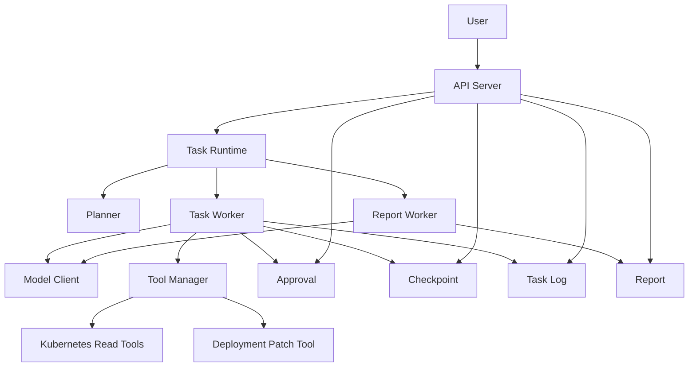
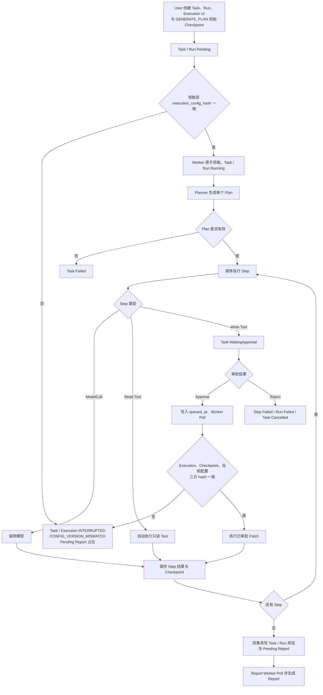
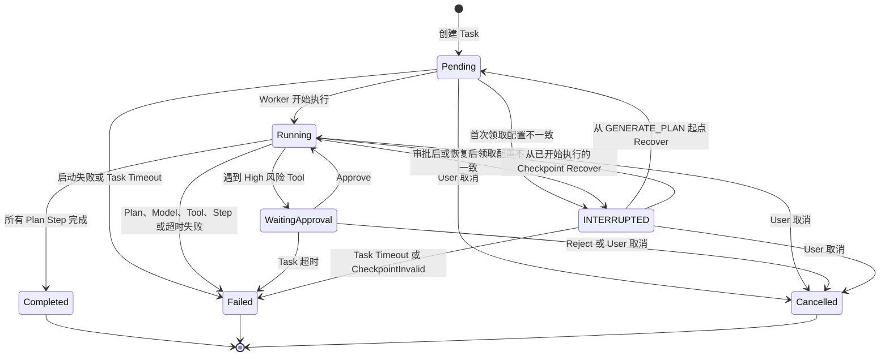
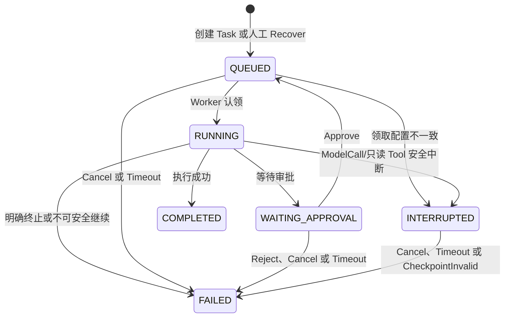
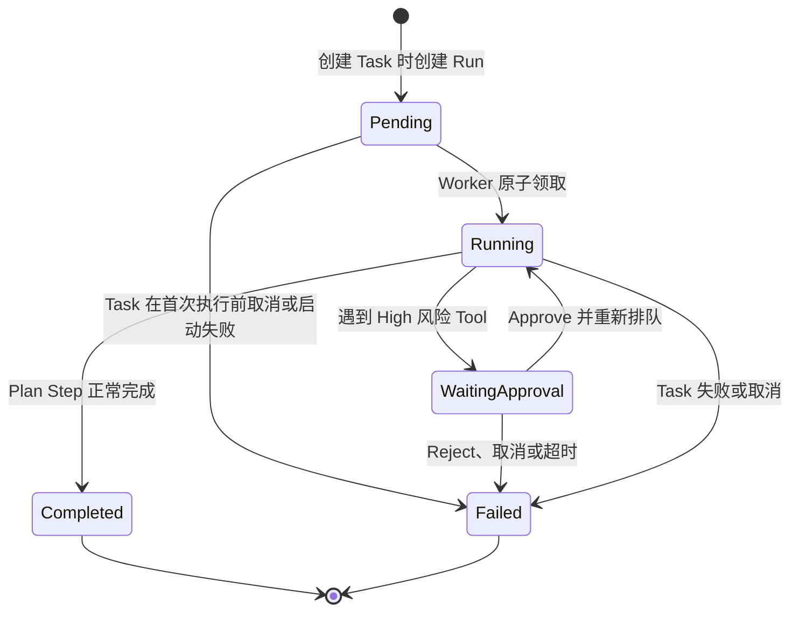
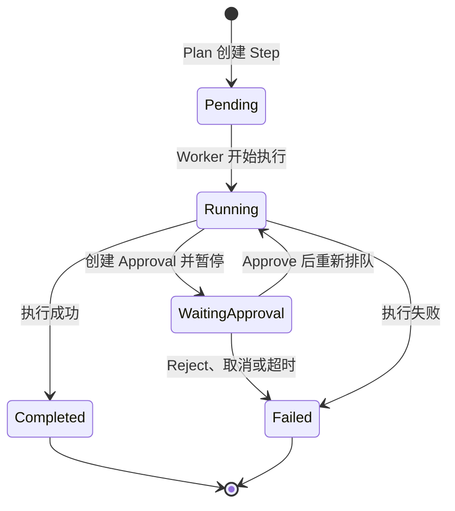

# AgentOps-Go：AI Agent Runtime 需求规格说明书

文档版本：V3.5

文档状态：Resume MVP 已同步架构决策基线

适用范围：6～8 周个人开发项目

调整依据：MVP 裁剪结论、需求质询与评审的已确认结论、`docs/design/003-system-architecture-design.md`

## 1. 文档目的

本文档定义 AgentOps-Go Resume MVP 的产品范围、核心流程、领域对象、状态、功能需求、异常处理和验收标准，用于指导后续概要设计（HLD）、详细设计（LLD）和研发拆分。

本文档只描述产品与领域需求，不直接规定数据库表、完整接口协议或代码结构。

## 2. 项目定位

AgentOps-Go 是一个面向个人工程实践和简历展示的 AI Agent Runtime。

项目用于展示：

- AI Agent 任务运行时；
- Agent Planner；
- Tool Registry 与 Tool Calling；
- Worker 异步执行；
- Checkpoint 恢复；
- 高风险 Tool 人工审批；
- Kubernetes 诊断与 Deployment Patch；
- 执行过程记录与最终报告；
- Go 后端分层、状态管理和错误处理能力。

项目不以企业级生产平台为目标，不追求高可用、多租户、复杂调度、事件溯源或完整治理体系。

## 3. 项目目标

### 3.1 核心目标

1. 用户能够提交一个自然语言任务。
2. Agent Planner 将任务拆解为一个顺序执行计划。
3. Worker 异步执行计划中的 Step。
4. 只读 Tool 可以自动执行。
5. Deployment Patch 等高风险 Tool 必须先由用户审批。
6. Planner 完成和每个业务 Step 完成后保存 Runtime Context Checkpoint。
7. Worker 重启后，安全中断的 TaskExecution 可以由用户触发创建新 execution_version，并从旧版本最新有效 Checkpoint 继续执行。
8. 任务结束后生成包含执行过程和结果的报告。
9. 用户可以通过 REST API 查询任务状态、执行日志和报告。

### 3.2 工程目标

- 展示清晰的 Go 后端分层；
- 展示 Agent、Planner、Tool、Worker、Checkpoint 和 Approval 的协作关系；
- 保持核心对象与 Kubernetes 具体实现解耦；
- 控制在个人 6～8 周开发周期内完成；
- 为后续扩展多 Worker、更多 Tool 和更强治理能力保留清晰边界。

### 3.3 成功标准

- Kubernetes 故障诊断任务可以完成计划、查询、分析和报告闭环；
- Deployment Patch 未经审批不会执行；
- Worker 重启后，INTERRUPTED TaskExecution 能够在 execution_config_hash 一致时创建新版本并从最新 Runtime Context Checkpoint 继续；
- 任务成功、失败、取消和等待审批状态清晰可查询；
- 项目能够通过代码、文档和演示说明 AI Agent Runtime 的核心设计。

## 4. MVP 范围

### 4.1 必须实现

- Agent 启动时静态注册；
- Task 创建、查询、执行、完成、失败和取消；
- Task 与 Run 基本领域模型；
- 单个结构化 Plan；
- 顺序 Step 执行；
- 一个模型 Provider；
- Tool Registry；
- Kubernetes 只读 Tool；
- 受限的 Kubernetes Deployment Patch Tool；
- Tool 白名单、命名空间权限和高低风险等级；
- 高风险 Tool 单次人工审批；
- 单 Task Worker 异步执行；
- Task Execution Guard 与 execution_version 条件更新；
- 数据库待执行记录与单 Worker FIFO Poll；
- PostgreSQL advisory lock 保护整个 Runtime Instance；
- 简化 Checkpoint；
- Checkpoint 手动恢复；
- execution_config_hash 恢复一致性校验；
- 所有状态变更 API 的 command_id 与 Command Receipt；
- 本机静态 Bearer Token API 认证；
- ToolExecution UNKNOWN 与未知副作用标记；
- Task Log；
- 最终执行报告；
- REST API。

### 4.2 明确不实现

- 动态 Plan Version、Plan Diff、Plan Snapshot 和多版本计划；
- Multi-Agent；
- 并行或复杂 DAG 工作流；
- 多级审批、会签、审批版本、撤销、失效和消费模型；
- Lease、Heartbeat、Fencing Token、稳定 Worker Ownership 和自动接管；MVP 仅保留 Task Execution 上的进程实例 worker_id；
- Leader Election 和分布式 Worker 治理；
- TaskExecution 的 Unknown、Reconciling 和 NeedsReview；ToolExecution 允许受限的 UNKNOWN；
- Outbox、Event Source、Event Replay 和 Event Sequence；
- 不可变审计链、Audit Hash 和 Digest Chain；
- Prompt、Tool、Policy、Price 和完整配置版本治理；MVP 仅保存 execution_config_hash，不保存配置快照或历史版本；
- Token、成本、Tool 次数等配额与预算；
- 模型价格管理和成本统计；
- 多租户治理；
- 多模型路由、熔断和 Fallback；
- 企业级 SLA、灾备和跨区域高可用；
- 完整 Workflow DSL；
- Kubernetes Deployment 之外的写 Tool；
- 任意 JSON Patch、Merge Patch 或完整 Kubernetes 资源对象写入；
- Kubernetes rollout 等待、应用健康判断和自动回滚；
- 运行期 Agent 或 Tool 配置管理 API；
- 消息队列、优先级队列和延迟队列；
- 非 Kubernetes Tool 的实际交付。

## 5. 用户与系统角色

### 5.1 User

User 可以：

- 创建 Task；
- 查询 Task、Run、Step 和 Task Log；
- 取消 Task；
- 查看待审批操作；
- 批准或拒绝高风险 Tool；
- 请求从 Checkpoint 恢复；
- 查看最终报告。

MVP 面向个人项目，使用服务端固定配置的单一操作人标识作为 Task 创建人和审批人，并允许自审。所有 API 使用一个由运行配置注入的静态 Bearer Token；MVP 不实现用户体系、完整认证、复杂 RBAC、多租户权限体系，也不区分生产与非生产环境。

API 默认只监听 loopback。Bearer Token 不得写入数据库、TaskLog 或应用日志，也不进入 execution_config_hash。MVP 仅用于本地演示环境，静态 Token 不构成生产认证能力，不得作为生产服务或直接暴露到公网。人工审批只用于展示暂停、参数确认和继续执行流程，不构成生产级身份隔离或职责分离。

### 5.2 API Server

API Server 负责：

- 接收 REST 请求；
- 校验静态 Bearer Token；
- 校验基本输入；
- 要求所有状态变更命令携带 command_id；
- 创建和查询业务对象；
- 接收取消、审批和恢复命令；
- 返回 Task 状态、Task Log 和 Report。

API Server 不在请求线程内执行长时间模型或 Tool 调用。

### 5.3 Worker

Worker 负责：

- 领取待执行 Task；
- 调用 Planner；
- 顺序执行 Step；
- 调用模型和 Tool；
- 在关键节点保存 Checkpoint；
- 写入 Task Log；
- 通过同一服务内的 Report Worker 后台循环生成 Report。

MVP 只要求一个 Task Worker 实例，同一时间执行一个 Task，不支持多 Worker 竞争和自动故障接管。系统不维护独立内存队列或消息队列：新 Task、审批通过的 Task 和人工恢复请求在数据库中写入 `queued_at`，Task Worker 按 `queued_at` 顺序 Poll 待执行记录，不抢占当前 Task，也不实现优先级或延迟调度。

创建 Task 时必须在同一事务内创建 Task、唯一 Run、`TaskExecution v1=QUEUED`、Task.current_execution_version、`next_action=GENERATE_PLAN` 的 v1 初始 Checkpoint、基于 PostgreSQL UTC 时间计算的 deadline_at、Command Receipt 和 queued_at。Task Worker 只认领当前版本已有的 QUEUED TaskExecution，领取前必须校验 execution_config_hash：首次领取比较 TaskExecution 与当前语义配置；Approval 后重新领取比较 TaskExecution、当前版本最新 Checkpoint 与当前配置；Recover 后领取比较新 TaskExecution、恢复起点 Checkpoint与当前配置。

领取时任一 hash 不一致，不执行 Task、不设置 worker_id，也不调用 Planner、Model 或 Tool；在同一短事务中将当前 TaskExecution 和 Task 更新为 `INTERRUPTED`，在二者的现有 `error_code` 字段记录 `CONFIG_VERSION_MISMATCH`，清空 queued_at，并创建唯一 Pending Report占位。Run 和 Step保持领取前状态。该中断不关闭 Runtime、不新增 BLOCKED、不自动重试；Worker继续后续 Poll。恢复原语义配置后，User 可以按既有三方 hash 规则发起 Recover，也可以取消该 Task。

服务每次启动生成新的进程实例 worker_id。服务启动时应取得整个 Runtime Instance 的 PostgreSQL advisory lock，随后执行 Schema Migration 和一次综合启动清理；未取得锁时 API Server、Task Worker、Report Worker 和 Timeout Scanner 均不得启动。数据库中 queued_at 非空的记录无需重建队列即可继续被 Poll。

Report Worker 是同一服务内的独立后台轮询循环，不属于多 Worker 调度能力。它只 Poll Report 记录，不领取 Task，也不引入 MQ、Lease、Fencing Token 或 Worker Ownership。

## 6. 整体架构

架构保持 Agent Runtime、Planner、Tool Manager、Worker、Checkpoint 和 Report 的独立边界，但不引入企业级分布式治理组件。

MVP 的持久化与单实例约束如下：

- PostgreSQL 是唯一核心持久化数据库，一个 Database 只承载一个 AgentOps Runtime；
- Runtime 使用应用固定 advisory lock key，由一条专用 PostgreSQL connection 在整个进程生命周期内持锁；
- Task、Run、Step、TaskExecution、ToolExecution、Approval、Checkpoint、Report、TaskLog 和 Command Receipt 的全部持久化写入必须通过该持锁 connection 串行提交；
- 普通连接池只允许查询，不得旁路提交 Runtime 持久化写入；
- 所有状态事务必须是短事务；禁止在数据库事务中执行 LLM、Kubernetes API 或其他长耗时外部操作；
- 持锁 connection 断开或任意写事务报告连接错误时，Runtime 停止 API 和所有后台组件并退出，不在原进程内重连抢锁；
- 外部进程管理器可以启动全新 Runtime，但不得自动恢复 INTERRUPTED Task。

## 7. 核心业务流程

### 7.1 标准执行流程

`Analysis`、`Verification` 和通用 `ModelCall` 均通过同一个 Model Client 执行，仅提示模板和输出 Schema 不同。Report 不属于 Plan 或 Step；Task 和 Run 业务终态与 `Pending` Report 的创建或已有占位确认在同一数据库事务中持久化，随后由 Report Worker 轮询生成。Report 成功或失败均不改变已经确定的 Task、Run 和 Step 状态，Planner 失败等尚未生成 Plan 的路径也使用相同的 Report 入口。

领取配置不一致时允许在 Task 尚未终止时提前创建唯一 Pending Report占位。Report Worker 只有在关联 Task 已进入 `Completed`、`Failed` 或 `Cancelled` 后才能领取该记录生成最终报告；Task=`INTERRUPTED` 期间 Report 保持 Pending。

### 7.2 审批流程

1. Worker 识别到高风险 Tool，解析其所有前序输出引用。
2. Worker 校验具体参数、读取目标 Deployment 的相关旧值和 `resourceVersion`，冻结不可变的 Tool 输入。
3. Worker 在同一数据库事务中创建当前 execution_version 的 `Pending` Approval、保存 WaitingApproval Runtime Context Checkpoint、将当前 ToolCall Step、Task 和 Run 更新为 `WaitingApproval`，将同版本 TaskExecution 从 `RUNNING` 更新为 `WAITING_APPROVAL`、清空 worker_id，并清空 `queued_at`。
4. 事务成功后 Task 释放 Worker 执行槽，User 查看 Tool 名称、具体参数、旧值、新值和操作说明。
5. User 执行 Approve 或 Reject。
6. Approve 后在同一数据库事务中更新 Approval、将 ToolCall Step、Task 和 Run 改回 `Running`、将同版本 TaskExecution 从 `WAITING_APPROVAL` 更新为 `QUEUED`、保存审批后的 Runtime Context Checkpoint，并写入 `queued_at`；Approve 不创建新 execution_version，Worker 后续按 FIFO Poll 到该 Task。
7. Worker 执行前重新读取 Deployment；若审批上下文未变化，则使用 Approval 中冻结的参数执行 Tool。
8. Reject 后 Tool 不执行，对应 ToolCall Step 进入 `Failed/ApprovalRejected`，Run 进入 `Failed/ApprovalRejected`，Task 进入 `Cancelled`。

Approve、Reject、Cancel 和 Timeout 通过持锁写通道按数据库提交顺序处理，并匹配预期 Approval 状态、TaskExecution 状态和 execution_version。同一 command_id 的重试通过 Command Receipt 返回原结果；不同 command_id 针对同一次 WAITING_APPROVAL 只有第一个有效决定成功，后续决定返回状态冲突。Approve 已提交后到达的 Cancel 作为针对 QUEUED 或后续 RUNNING 状态的新生命周期命令重新校验。

### 7.3 Checkpoint 恢复流程

1. Task 创建事务保存 `next_action=GENERATE_PLAN` 的 v1 初始 Checkpoint；Worker 随后在 Planner、业务 Step 和审批边界保存带 execution_version、execution_config_hash 的 Runtime Context Checkpoint。
2. ModelCall 或只读 Tool 执行中断时，当前 TaskExecution 进入 `INTERRUPTED`；写 Tool 已进入 RUNNING 保守边界后中断时，TaskExecution 进入 `FAILED/WRITE_TOOL_INTERRUPTED`，ToolExecution 进入 `UNKNOWN`。
3. User 对 `INTERRUPTED` TaskExecution 发送带 command_id 的 Recover 命令。
4. Task Runtime 校验 Task/Run 状态、当前 execution_version、未排队、deadline、写 Tool 安全条件和最新 Checkpoint。
5. Task Runtime 比较当前语义配置、旧 TaskExecution 和 Checkpoint 的 execution_config_hash；不一致时返回 `CONFIG_VERSION_MISMATCH`，不创建新 execution_version。
6. 校验成功后，Task Runtime 在一个事务中创建 `execution_version+1` 的 QUEUED TaskExecution、更新 Task.current_execution_version、Task/Run/Step、queued_at、Command Receipt，并为新版本创建恢复起点 Checkpoint。
7. Worker 只认领并读取当前 execution_version，从新版本 Checkpoint 的执行位置继续；已经完成的 Step 不重复执行。

Checkpoint 不以“最近完成 Step”作为有效性前提，而是保存 Worker 恢复所需的 Runtime Context。`CONFIG_VERSION_MISMATCH` 后原执行保持不变，由 User 或运维恢复原配置后重新 Recover，或取消 Task。UNKNOWN 写 ToolExecution 禁止自动恢复或重放，必须人工检查 Kubernetes 实际状态后决定后续处理。

## 8. 核心领域对象

以下字段是领域要求，不代表最终数据库表。

### 8.1 Agent

| 字段 | 含义 |
|---|---|
| `agent_id` | Agent 唯一标识 |
| `name` | Agent 名称 |
| `description` | Agent 描述 |
| `system_prompt` | Agent 基础指令 |
| `model_name` | 使用的模型 |
| `allowed_tools` | 允许调用的 Tool 列表 |
| `task_timeout` | Task 最大执行时间 |
| `enabled` | 是否允许创建新 Task |

Agent 和 Tool 均通过服务端静态配置，在进程启动时注册并加载；运行期间不可新增或修改，不提供管理 API。MVP 不管理 Agent、Prompt 或完整配置版本，但必须基于规范化语义配置计算 execution_config_hash。

execution_config_hash 覆盖 Agent 指令、模型标识与生成参数、允许的 Tool 集合、Tool 输入 Schema、读写/风险等级、审批策略和 Plan 约束；凭证、API 地址、日志级别和持锁连接存活检查参数不进入 hash。MVP 不保存完整配置快照。

### 8.2 Task

Task 表示 User 提交的业务任务。

| 字段 | 含义 |
|---|---|
| `task_id` | Task 唯一标识 |
| `agent_id` | 使用的 Agent |
| `created_by` | 服务端固定配置的操作人标识 |
| `input` | 用户任务输入 |
| `status` | Task 当前状态 |
| `current_run_id` | 当前 Run |
| `current_execution_version` | 当前有效 TaskExecution 版本 |
| `result_summary` | 最终结果摘要 |
| `error_code` | 失败、取消或配置中断原因 |
| `deadline_at` | 创建 Task 时基于 PostgreSQL UTC 时间计算的绝对截止时间 |
| `queued_at` | 非空表示等待 Worker Poll，作为 FIFO 排序时间 |
| `recoverable` | 查询时派生的是否允许人工恢复标识，不作为持久化状态 |
| `created_at` | 创建时间 |
| `started_at` | 开始时间 |
| `ended_at` | 结束时间 |

`Task.Status`：

- `Pending`；
- `Running`；
- `WaitingApproval`；
- `INTERRUPTED`；
- `Completed`；
- `Failed`；
- `Cancelled`。

Task 创建幂等性由 Command Receipt 提供：相同 command_id 和请求指纹返回原 Task，相同 command_id 对应不同请求时返回状态冲突。

Task=`INTERRUPTED` 专门表示 QUEUED TaskExecution 在领取时因 `CONFIG_VERSION_MISMATCH` 未执行。User 决策中的 reason_code 沿用现有 `error_code` 字段表达，不新增重复字段。该状态不是终态，允许 Cancel 和 Timeout；恢复原语义配置并成功 Recover 后，Task 根据来源 Checkpoint 回到 `Pending` 或 `Running`。

`recoverable=true` 仅表示 Task.Status 为 `Running` 或 `INTERRUPTED`、current_execution_version 指向 `INTERRUPTED` TaskExecution、未排队、没有结果未知的写 Tool、Checkpoint 有效、execution_config_hash 一致且尚未超时。

创建 Task 时必须在同一数据库事务中创建其唯一 Run、`TaskExecution v1=QUEUED`、`next_action=GENERATE_PLAN` 的 v1 初始 Checkpoint和 Command Receipt，设置 current_execution_version=1，基于 PostgreSQL UTC 时间计算 deadline_at，并写入 queued_at。

### 8.3 Run

Run 表示 Task 的一次具体执行。MVP 默认一个 Task 对应一个 Run；Checkpoint 恢复继续原 Run，不创建新 Run。

| 字段 | 含义 |
|---|---|
| `run_id` | Run 唯一标识 |
| `task_id` | 所属 Task |
| `status` | Run 状态 |
| `plan_id` | 当前 Plan |
| `current_step_id` | 当前 Step |
| `context` | Agent 执行上下文 |
| `error_code` | 失败原因 |
| `started_at` | 开始时间 |
| `ended_at` | 结束时间 |

`Run.Status`：

- `Pending`；
- `Running`；
- `WaitingApproval`；
- `Completed`；
- `Failed`。

Task 取消时，Task 进入 `Cancelled`，其活动 Run 进入 `Failed`，`error_code=TaskCancelled`。

审批拒绝时，Task 进入 `Cancelled`，活动 Run 进入 `Failed`，`error_code=ApprovalRejected`。Run 的 `Failed` 必须结合 `error_code` 区分平台执行失败、用户取消和审批拒绝。

### 8.4 TaskExecution

TaskExecution 表示 Task 的一次有版本执行尝试，不是 Run，也不是 Lease 或稳定 Worker Ownership。

| 字段 | 含义 |
|---|---|
| `task_execution_id` | 执行尝试唯一标识 |
| `task_id` | 所属 Task |
| `execution_version` | Task 内严格递增的执行版本 |
| `worker_id` | 认领该执行的进程实例标识；未认领时为空 |
| `status` | QUEUED、RUNNING、WAITING_APPROVAL、COMPLETED、FAILED、INTERRUPTED |
| `error_code` | 执行错误分类 |
| `termination_reason` | 取消、超时或中断等终止来源 |
| `execution_config_hash` | 本次执行依赖的语义配置摘要 |
| `created_at`、`started_at`、`ended_at` | 执行尝试时间 |

TaskExecution 规则：

- Task 创建事务生成 v1=QUEUED，并同步更新 Task.current_execution_version；
- Recover 只允许从 INTERRUPTED 创建 version+1=QUEUED，并同步更新 current_execution_version；
- Worker 领取已有 QUEUED 记录前必须执行 execution_config_hash 校验；一致时更新为 RUNNING、设置本次进程 worker_id，不创建新版本；
- 领取时配置不一致执行 `QUEUED → INTERRUPTED`，Task 同时进入 INTERRUPTED，二者记录 `error_code=CONFIG_VERSION_MISMATCH`，不执行外部动作；
- Approval 暂停与继续沿用同一 execution_version，执行 `RUNNING → WAITING_APPROVAL → QUEUED`；
- FAILED 表示执行尝试已经终止且不可恢复，不承诺外部副作用未发生；
- INTERRUPTED 表示 ModelCall/只读 Tool等可安全重做动作中断，或 QUEUED 领取时配置不一致，允许人工 Recover；
- 所有 Task、Run、Step、TaskExecution、ToolExecution、Approval 和 Checkpoint 状态推进必须匹配 Task.current_execution_version；
- 旧 execution_version 的迟到结果不得覆盖当前状态。

### 8.5 Plan

Plan 是 Planner 为一次 Run 生成的单个顺序执行计划。

| 字段 | 含义 |
|---|---|
| `plan_id` | Plan 唯一标识 |
| `run_id` | 所属 Run |
| `goal` | 计划目标 |
| `steps` | 有序 Step 列表 |
| `created_at` | 创建时间 |

Plan 规则：

- 一个 Run 只有一个 Plan；
- Step 必须按顺序执行；
- 不支持动态新增、删除、替换或重排 Step；
- Step 总数默认不超过 20；
- Plan 中只能引用 Agent `allowed_tools` 中的 Tool；
- 后续 Step 输入仅可通过 `step.output.<field>` 读取紧邻的已完成前序 Step 的一个结构化输出字段，其中 `step` 固定表示该前序 Step；
- 不支持条件、函数、默认值、数组选择、多级路径、循环或任意表达式求值；
- 引用能力不得用于动态新增、删除、替换或重排 Step；
- Plan 格式或 Tool 引用无效时 Task 失败。

### 8.6 Step

| 字段 | 含义 |
|---|---|
| `step_id` | Step 唯一标识 |
| `run_id` | 所属 Run |
| `sequence` | 顺序号 |
| `type` | Step 类型 |
| `name` | Step 名称 |
| `input` | Step 输入，可包含受限的前序输出引用 |
| `output` | Step 结构化输出或摘要 |
| `output_schema` | Planner 声明的结构化输出字段及类型 |
| `status` | Step 状态 |
| `tool_name` | ToolCall 使用的 Tool |
| `error_code` | 失败原因 |
| `started_at` | 开始时间 |
| `ended_at` | 结束时间 |

Step 类型：

- `ModelCall`；
- `ToolCall`；
- `Analysis`；
- `Verification`。

`Step.Status`：

- `Pending`；
- `Running`；
- `WaitingApproval`；
- `Completed`；
- `Failed`。

任一 Step 失败后，后续 Step 不再执行；Task 和 Run 进入失败终态时，同一数据库事务创建唯一的 `Pending` Report。

`ModelCall`、`Analysis` 和 `Verification` 均使用同一个 Model Client 执行，仅提示模板和输出 Schema 不同。Report 不是 Step。

取消时，正在执行的非 Patch Step 进入 `Failed/TaskCancelled`；审批拒绝时，对应 ToolCall Step 进入 `Failed/ApprovalRejected`；尚未开始的业务 Step 保持 `Pending`，但不再调度。

### 8.7 Tool

| 字段 | 含义 |
|---|---|
| `name` | Tool 唯一名称 |
| `description` | Tool 能力说明 |
| `input_schema` | 输入参数约束 |
| `risk_level` | `Low` 或 `High` |
| `read_only` | 是否只读 |
| `timeout` | 单次调用超时 |
| `enabled` | 是否可调用 |

Tool 规则：

- Agent 只能调用 `allowed_tools` 中的 Tool；
- Tool 参数必须通过基本 Schema 校验；
- `Low` 风险只读 Tool 自动执行；
- `High` 风险写 Tool 必须审批；
- Tool 超时或返回错误时，本次 Step 直接失败；
- MVP 不自动重试 Tool；
- Tool 结果在送入模型或持久化前执行脱敏和大小限制；
- Tool 调用写入 Task Log。

### 8.8 ToolExecution

| 字段 | 含义 |
|---|---|
| `tool_execution_id` | Tool 调用标识 |
| `task_id`、`run_id`、`step_id` | 关联 Task、Run 和 Step |
| `execution_version` | 所属 TaskExecution 版本 |
| `tool_name` | Tool 名称 |
| `input` | 调用参数 |
| `output` | 返回结果或摘要 |
| `status` | RUNNING、COMPLETED、FAILED、UNKNOWN |
| `side_effect_unknown` | 是否可能存在无法确认的外部副作用 |
| `truncated` | 输出是否因大小限制被截断 |
| `original_size` | 可确定时记录原始字节数 |
| `original_count` | 可确定时记录原始条目数或日志行数 |
| `error_code` | 错误分类 |
| `started_at`、`ended_at` | 执行时间 |

ToolExecution 仅在即将调用外部 Tool 时创建，并关联当前 execution_version。写 Tool 必须在外部调用前先通过持锁 connection 提交冻结输入和 `ToolExecution=RUNNING`，再在事务外发送请求。写 Tool 的 RUNNING 表示已经进入“无法证明请求未发送”的保守边界，不表示 Kubernetes 已确认接收请求。

等待审批、审批拒绝、Task 取消、Task 超时或资源上下文变化发生在该边界之前时不得创建 ToolExecution。一次只读 Tool 的人工恢复会为同一 Step、不同 execution_version 创建新的 ToolExecution。

写 Tool 进入 RUNNING 边界后发生 Worker 中断、Cancel、Timeout、连接中断或结果持久化失败，且无法取得确定结果时，ToolExecution 进入 `UNKNOWN` 并设置 `side_effect_unknown=true`。UNKNOWN 禁止自动重放，TaskLog、Report 和 API 必须提示人工检查 Kubernetes 实际状态。MVP 不定义 Reconciling、NeedsReview、通用 Tool 幂等记录或自动副作用核验。

### 8.9 Approval

| 字段 | 含义 |
|---|---|
| `approval_id` | Approval 唯一标识 |
| `task_id`、`run_id`、`step_id` | 关联对象 |
| `execution_version` | 所属 TaskExecution 版本 |
| `tool_name` | 待执行 Tool |
| `tool_input` | 已解析、校验并冻结的待执行参数 |
| `observed_values` | 审批创建时相关字段的旧值 |
| `resource_version` | 审批创建时目标 Deployment 的 resourceVersion |
| `status` | Pending、Approved、Rejected |
| `comment` | 审批意见 |
| `decided_by` | 服务端固定配置的操作人标识 |
| `decided_at` | 决策时间 |

Approval 规则：

- 每个高风险 ToolCall 产生一个 Approval；
- Pending Approval 通过原子条件更新只能决定一次；
- 相同决定的重复请求幂等返回当前结果，相反决定返回状态冲突；
- Approved 后执行对应 Tool；
- Rejected 后对应 Tool 不执行，Step 和 Run 以 `ApprovalRejected` 失败，Task 取消；
- Task 进入终态后，仍为 Pending 的 Approval 保留历史值但不可操作；
- Approval 的可操作性由关联 Task 状态派生，不新增失效状态；
- Pending Approval、WaitingApproval Runtime Context Checkpoint、当前 Step/Task/Run 的 `WaitingApproval` 状态和清空后的 `queued_at` 必须在同一数据库事务中持久化；
- MVP 不支持撤销、失效、会签、多级审批和审批版本。

### 8.10 Checkpoint

| 字段 | 含义 |
|---|---|
| `checkpoint_id` | Checkpoint 唯一标识 |
| `task_id` | 所属 Task |
| `run_id` | 所属 Run |
| `execution_version` | 所属 TaskExecution 版本 |
| `checkpoint_sequence` | Run 内严格递增的 Checkpoint 序号 |
| `runtime_context` | Worker 恢复执行所需的结构化 Runtime Context |
| `execution_config_hash` | 恢复配置一致性摘要 |
| `source_execution_version`、`source_checkpoint_id` | 恢复版本起点的来源；首次执行时为空 |
| `created_at` | 保存时间 |

Checkpoint 规则：

- Task 创建事务保存 v1 初始 Checkpoint，Runtime Context 的下一动作为 `GENERATE_PLAN`，并与 TaskExecution v1 保存相同 execution_config_hash；
- Planner 完成后保存一次，Runtime Context 指向首个待执行 Step；
- 每个 Step 得到确定结果后保存，Runtime Context 指向下一个 Step；最后一个 Step 完成后指向 Run 收尾动作；
- 进入 WaitingApproval 前保存，Runtime Context 表示当前 ToolCall Step 正在等待指定 Approval；
- Approval 通过后保存，Runtime Context 表示继续同一 ToolCall Step 并执行已冻结参数；
- Runtime Context 至少包含当前执行位置、下一动作、已解析变量引用、继续执行所需的 Step 结果引用，以及适用时的 Approval 和冻结 Tool 输入引用；
- 每次保存时为同一 Run 分配严格递增且唯一的 `checkpoint_sequence`；
- 只保留恢复所需的结构化上下文，不依赖“最近完成 Step”或“必须存在下一个 Step”判断 Checkpoint 有效性；
- MVP 不保存 Chain、Digest、加密元数据或完整配置快照；仅保存 execution_config_hash 和恢复起点来源。

恢复时只选择当前 execution_version 下 `checkpoint_sequence` 最大的最新 Checkpoint。有效 Checkpoint 必须可解析，Task、Run、execution_version 关联正确，execution_config_hash 与对应 TaskExecution 及当前语义配置一致，Runtime Context 引用的 Plan、Step、Approval 和持久化对象存在，且“当前执行位置、下一动作”与这些对象的状态一致。Task 创建后的 GENERATE_PLAN、Planner 后、等待审批、审批通过后、普通 Step 后和最后一个 Step 后的 Checkpoint 均可合法有效。最新 Checkpoint 无效时恢复失败并返回明确原因，不自动回退到更早 Checkpoint。

### 8.11 TaskLog

TaskLog 是简化的执行与操作记录。

| 字段 | 含义 |
|---|---|
| `log_id` | 日志标识 |
| `task_id`、`run_id`、`step_id` | 关联对象 |
| `execution_version` | 可选；与具体执行尝试相关时记录 |
| `level` | Info、Error |
| `event` | 操作或执行事件名称 |
| `message` | 可读说明 |
| `operator` | 固定操作人标识、Worker 或 System |
| `created_at` | 记录时间 |

应记录：

- Task 创建、开始、完成、失败和取消；
- Plan 生成结果；
- Step 开始、完成和失败；
- Tool 请求、结果和错误；
- Approval 请求、批准和拒绝；
- Checkpoint 保存和恢复；
- Report 生成。

TaskLog 不是事件溯源或不可变审计链。

TaskLog 是附属的简单日志，不作为领域状态或 Checkpoint 恢复的事实来源，也不要求通过日志重建 Task。

### 8.12 Report

| 字段 | 含义 |
|---|---|
| `report_id` | Report 唯一标识 |
| `task_id` | 关联 Task |
| `run_id` | 关联 Run；MVP 中每个 Task 创建时同步创建唯一 Run |
| `status` | Pending、Generating、Completed 或 Failed |
| `summary` | 执行结果摘要 |
| `steps` | Step 执行结果 |
| `tool_calls` | Tool 调用摘要 |
| `agent_output` | Agent 分析结果 |
| `final_result` | 最终结果或失败原因 |
| `created_at` | Report 记录创建时间 |

Report 不属于 Plan，也不关联任何 Step。一个 Task 最多创建一个 Report，`task_id` 使用唯一约束；重复生成触发返回已有记录。

Task 进入 `Completed`、`Failed` 或 `Cancelled` 时，Task 与 Run 的终态更新和 `Pending` Report 创建或已有占位确认必须在同一数据库事务中完成。领取配置不一致时可以提前创建唯一 Pending Report占位，但 Report Worker 必须联表确认 Task 已终止后才能执行 `Pending → Generating → Completed/Failed`；Task=`INTERRUPTED` 时不得生成。服务启动清理将旧进程遗留的 `Generating` 重置为 `Pending`，进程中断的报告自动重新生成并复用同一记录；DeepSeek 明确返回失败或报告自身超时时进入 Failed，MVP 不自动重试。Report 状态不得改变已经确定的 Task、Run 或 Step。

### 8.13 Command Receipt

Command Receipt 表示状态变更 API 命令的持久化幂等结果。

| 字段 | 含义 |
|---|---|
| `command_id` | Client 生成的 Database 内唯一命令标识 |
| `command_type` | Create、Approve、Reject、Cancel、Recover 等命令类型 |
| `target_id` | 命令目标 |
| `request_fingerprint` | 规范化请求指纹 |
| `response` | 经过脱敏的 API 结果 |
| `created_at` | 首次提交时间 |

所有状态变更 API 必须携带 command_id。Command Receipt 与命令产生的全部业务状态变更必须在同一短事务中提交；相同 command_id 且请求指纹一致时返回已保存结果，不重复执行；相同 command_id 对应不同命令、目标或请求指纹时返回状态冲突。

## 9. Task 状态机

状态规则：

- 关键状态变化写入 TaskLog，不要求记录所有字段变化；
- 终态不可恢复；
- Checkpoint 恢复只适用于 current_execution_version 指向 INTERRUPTED TaskExecution，且 Task 为 Running 或 INTERRUPTED 的场景；
- Task 创建时使用 PostgreSQL UTC 时间计算并保存 deadline_at，Pending、WaitingApproval、Worker 停止和 FIFO 等待均计入 Task Timeout；
- Task Timeout 约束 Planner 和所有 Plan Step，不包含独立 Report 生成；
- 到达 deadline_at 时 Task Runtime 立即终止当前执行，TaskExecution 进入 FAILED/TIMED_OUT，并停止开始新的 Step；
- ModelCall 或只读 Tool 正在执行时尽力取消，迟到结果不得更新状态；
- 写 Tool 尚未进入 ToolExecution=RUNNING 保守边界时不得创建或调用 Tool；
- 写 Tool 已进入 RUNNING 保守边界时，Timeout 不等待外部调用，ToolExecution 进入 UNKNOWN、side_effect_unknown=true，迟到结果不得覆盖终态；
- Tool 确定结果事务与 Timeout 事务按持锁写通道提交顺序竞争；已提交的确定结果不改写为 UNKNOWN，Timeout 先提交时丢弃迟到结果；
- 服务默认每 5 秒扫描非终态 Task；平台服务可用期间保证在 deadline_at 后 10 秒内完成终态转换；审批、取消、恢复和 Worker 取任务时也必须同步检查；
- 服务启动时在一次清理事务中综合旧 worker_id、当前动作和 deadline：已过期的 ModelCall/只读 Tool 直接进入 FAILED/TIMED_OUT；已过期写 Tool 同时保留 TIMED_OUT、WRITE_TOOL_INTERRUPTED 和 UNKNOWN 副作用信息；
- 并发超时检查通过原子条件更新保证只产生一次终态转换和一次 Report 生成；
- Task 和 Run 进入终态时必须在同一数据库事务中创建或确认唯一 `Pending` Report；事务成功后业务终态和 Report 记录同时可见。
- 领取配置不一致执行 TaskExecution `QUEUED→INTERRUPTED` 和 Task→INTERRUPTED，清空 queued_at，创建 Pending Report占位；不关闭 Runtime、不自动重试。

TaskExecution 状态机：

TaskExecution 不增加 CANCELLED、TIMED_OUT、SUPERSEDED、UNKNOWN 或 NEEDS_REVIEW 状态；取消、超时、审批拒绝和写 Tool 中断通过 FAILED 加 error_code/termination_reason 表达。只有 INTERRUPTED 可以创建新的 execution_version。

## 10. Run 与 Step 状态规则

### 10.1 Run

### 10.2 Step

Approval 等待期间，对应 ToolCall Step、Task 和 Run 均为 `WaitingApproval`。

Task 取消时，正在执行的非 Patch Step 进入 `Failed/TaskCancelled`，活动 Run 进入 `Failed/TaskCancelled`；尚未开始的业务 Step 保持 `Pending` 且不再调度。审批拒绝时，对应 ToolCall Step 和 Run 分别进入 `Failed/ApprovalRejected`，Task 进入 `Cancelled`。

Worker 在 ModelCall 或只读 Tool 执行中中断时，Step 保持 `Running`，当前 TaskExecution 进入 INTERRUPTED。人工恢复创建新的 execution_version，在同一 Step 上继续并记录新的 ToolExecution；成功后 Step 执行 `Running → Completed`。写入型 Patch 进入 ToolExecution=RUNNING 边界后中断时，TaskExecution、Step、Run 和 Task 进入失败，ToolExecution 进入 UNKNOWN，禁止重新执行。

Report 不属于 Step 状态机。Task 和 Run 进入业务终态时，Runtime 在同一数据库事务中创建或确认唯一的 `Pending` Report；领取配置不一致产生的占位必须等到 Task 进入业务终态后，才能由 Report Worker 独立生成并更新。

## 11. Planner 需求

### 11.1 输入

- Task 原始输入；
- Agent system prompt；
- Agent 可用 Tool 名称、描述和输入 Schema；
- 最大 Step 数。

### 11.2 输出

Planner 输出一个结构化 Plan，至少包含：

- Plan goal；
- 有序 Step 列表；
- 每个 Step 的类型、名称和输入；
- ToolCall Step 的 Tool 名称和参数；
- 最终 Verification Step。

Step 输出必须是可寻址的结构化数据。后续 Step 只允许使用 `step.output.<field>` 读取紧邻的已完成前序 Step 的一个直接输出字段，其中 `step` 固定表示该前序 Step；不支持多级路径、条件、函数、默认值、数组选择、循环或表达式求值。引用仅用于数据传递，Plan 的 Step 数量、类型和顺序保持不变。

### 11.3 校验

Runtime 必须校验：

- 输出可以解析；
- Step 数不超过上限；
- Step sequence 唯一且连续；
- Tool 存在并处于 enabled；
- Tool 在 Agent allowed_tools 中；
- Tool 的静态参数和引用表达式符合基本 Schema 结构；
- 引用形式严格符合 `step.output.<field>`；
- 引用只能指向 sequence 上紧邻的前一个 Step；
- 被引用字段存在于前一个 Step 声明的 `output_schema`。

校验失败时允许调用模型修复一次；再次失败则 Task 失败。

以上是 Plan 创建时的静态校验，不要求前一个 Step 已经执行完成。

Worker 执行 Step 时再校验：

- 紧邻的前一个 Step 已为 `Completed`；
- 前一个 Step 的实际 `output` 中存在被引用字段；
- 实际字段类型符合当前 Step 输入要求和 Tool Schema。

任一执行时校验失败时，当前 Step、Run 和 Task 进入 `Failed/InputResolutionFailed`。

## 12. Model 调用需求

MVP 使用一个模型 Provider 和一个默认模型。

需要支持：

- 非流式模型调用；
- 调用超时；
- 基本错误记录；
- Planner 结构化输出；
- ModelCall、Analysis 和 Verification 的对应输出；
- 独立 Report 生成所需的模型调用。

不支持：

- 多 Provider 路由；
- Fallback；
- 熔断；
- 复杂重试；
- Token 配额；
- 成本和价格统计。

模型超时、网络错误、认证错误或非法输出均使当前 Step 失败。仅 Planner 结构修复允许一次额外调用。

三种模型 Step 共用一个 Model Client，不为 Analysis 或 Verification 建立独立执行引擎。Report 生成可以复用同一个 Model Client，但不创建 Step。Worker 中断后的 ModelCall 仅允许在 User 发起 Checkpoint 恢复后重新执行，并通过 TaskLog 记录新的执行尝试。

模型调用返回时必须通过原子条件确认 Task、Run 和当前 Step 仍处于允许接收结果的执行状态。若 Task、Run 或 Step 已进入 `Completed`、`Failed` 或 `Cancelled` 等终态，晚到模型结果不得修改任何终态、不得触发后续 Step，直接丢弃，仅写入事件类型为 `LateModelResultIgnored` 的 TaskLog。MVP 不新增 ModelExecution 或 ModelAttempt 对象。

Report 使用独立的 60 秒超时。Tool 结果送入模型前必须完成大小限制和脱敏；模型输出在写入 Step、Checkpoint、TaskLog 或 Report 前必须再次执行相同的脱敏规则。

## 13. Tool Framework 需求

### 13.1 Tool Registry

系统启动时加载已配置 Tool。Registry 支持：

- 按名称查找 Tool；
- 查询 Tool 描述和输入 Schema；
- 查询风险等级和只读属性；
- 读取 Tool 的启用状态。

Tool 配置在进程启动时静态加载，运行期间不可新增、修改、启用或停用。MVP 不提供 Tool 管理 API、在线版本发布、历史版本和复杂生命周期管理。

### 13.2 Kubernetes Read Tools

至少实现：

- Get Deployment；
- Get Pod；
- Get Event；
- Get Container Log。

只读 Tool 必须：

- 仅访问配置允许的集群和命名空间；
- 校验资源名称和必要参数；
- 设置调用超时；
- 将结果或摘要写入 Step 和 TaskLog；
- 单次原始结果最大 1 MiB，超过限制时安全截断并记录 `truncated=true` 和可确定的原始大小；
- Get Container Log 默认读取末尾 200 行，最多允许 1,000 行；
- 只将截断并脱敏后的结果送入模型和持久化。

MVP 不提供读取 Kubernetes Secret 的 Tool。Tool 结果在写库或送入模型前，必须按敏感字段名和常见凭据格式执行最佳努力脱敏。

### 13.3 Deployment Patch Tool

Deployment Patch Tool 输入至少包括：

- cluster；
- namespace；
- deployment name；
- 可选的 `replicas`；
- 可选的 `container_name` 与 `image`；
- `replicas` 或镜像变更至少提供一种。

规则：

- 只能作用于 Kubernetes Deployment；
- 只能访问配置允许的集群和命名空间；
- 只允许修改 `spec.replicas` 和指定容器的镜像字段；
- `replicas` 必须是整数，并处于服务端静态配置的 `min_replicas` 与 `max_replicas` 闭区间内；未配置有效范围时禁止 replicas 变更；
- 镜像地址解析出的 Registry 必须匹配服务端静态配置的 Registry 白名单；白名单为空时禁止镜像变更；
- 不接收任意 JSON Patch、Merge Patch 或完整 Deployment 对象，由平台根据结构化输入构造 Patch；
- 风险等级固定为 `High`；
- 必须经过单次人工审批；
- 创建 Approval 前解析全部引用并完成 Schema、字段白名单和权限校验；
- Approval 必须保存并展示冻结的目标资源、具体旧值、新值和 `resourceVersion`；
- Approve 后不得重新解析或修改参数；
- 执行前重新读取 Deployment；若 `resourceVersion` 或待修改字段发生变化，则不执行 Patch，Step、Run 和 Task 进入 `Failed/ApprovalContextChanged`；
- Patch 成功或失败写入 ToolExecution 和 TaskLog；
- 资源上下文复核通过后、调用 Kubernetes 前，先在短事务中提交当前 execution_version、冻结输入和 ToolExecution=RUNNING，再在事务外发出 Patch；
- ToolExecution=RUNNING 表示已经进入无法证明请求未发送的保守边界；
- 创建 ToolExecution 前再次检查 Task deadline；截止时间已到时不得创建或调用 Patch；
- Patch 已进入 RUNNING 边界后发生 Task Timeout 或 Cancel 时立即终止 TaskExecution，不等待 Kubernetes 返回；ToolExecution 进入 UNKNOWN、side_effect_unknown=true；
- Patch 超时、连接中断或结果持久化失败且无法取得确定结果时，TaskExecution、Step、Run 和 Task 失败，ToolExecution 进入 UNKNOWN，不自动重试；TaskLog、Report 和 API 必须说明外部变更结果未确认并要求人工检查；
- Patch 后 Verification 只重新读取 Deployment 并确认已批准字段与目标值一致，不等待 rollout、不判断应用健康、不自动回滚；
- MVP 不区分生产与非生产环境，写操作安全边界由服务端配置的集群和命名空间、字段白名单以及人工审批共同构成；
- MVP 不实现通用 ResourceVersion 冲突重试、自动刷新审批、自动回滚或执行结果 Reconciliation。

## 14. Approval 需求

Worker 进入审批等待时，创建当前 execution_version 的 `Pending` Approval、保存 WaitingApproval Runtime Context Checkpoint、将当前 ToolCall Step、Task 和 Run 更新为 `WaitingApproval`，将同版本 TaskExecution 更新为 WAITING_APPROVAL、清空 worker_id 和 queued_at，必须在同一短事务中完成。事务失败时不得持久化任何部分结果。

User 查看 Approval 时至少可以看到：

- Task 目标；
- Tool 名称；
- 目标集群、命名空间和 Deployment；
- 已冻结的结构化变更参数；
- 目标字段的旧值和新值；
- 创建 Approval 时的 `resourceVersion`；
- 操作风险说明。

Approve 与 Reject 必须满足：

- 只能处理 Pending Approval；
- 通过预期 Approval 状态、TaskExecution=WAITING_APPROVAL 和当前 execution_version 条件更新保证首次成功决定生效；
- 相同 command_id 通过 Command Receipt 返回原结果，不重复执行 Tool；
- 不同 command_id 的后续冲突决定返回状态冲突；
- Task 已超时或进入终态时返回状态冲突；
- Approve、当前 ToolCall Step、Task 和 Run 回到 `Running`、同版本 TaskExecution 更新为 QUEUED、审批后 Runtime Context Checkpoint、Command Receipt 和 queued_at 必须在同一短事务中保存；Approve 不创建新 execution_version；
- Reject 后 Tool 不执行，对应 Step 和 Run 以 `ApprovalRejected` 失败，Task 进入 `Cancelled`；
- 决策人、时间和意见写入 Approval 和 TaskLog。

决策人使用服务端固定配置的操作人标识，允许自审。MVP 不实现审批超时；审批等待受 Task Timeout 限制。Task 终止后，未决 Approval 保留 `Pending` 历史状态但不可操作，默认待审批列表仅返回可操作记录。

## 15. Checkpoint 与恢复需求

### 15.1 保存内容

Checkpoint 只保存恢复执行所需的 Runtime Context：

- Task 和 Run 标识；
- execution_version；
- execution_config_hash；
- 当前执行位置；
- 下一动作；
- 已解析变量引用；
- 继续执行所需的 Step 结果引用；
- 适用时的 Approval 标识和冻结 Tool 输入引用。

保存点包括 Task 创建时的 GENERATE_PLAN 起点、Planner 完成后、每个 Step 得到确定结果后、进入 WaitingApproval 前以及 Approval 通过后。Runtime Context 必须能够分别表达“生成 Plan”“执行首个 Step”“执行下一个 Step”“等待 Approval”“执行已批准的同一 ToolCall Step”和“完成 Run”，不要求存在最近完成 Step 或下一个 Step。

此外，Task 创建事务必须保存 `GENERATE_PLAN` 初始 Checkpoint，使首次领取前因配置不一致进入 INTERRUPTED 的 Task 可以在恢复原配置后按既有 Recover 流程创建新 execution_version。

### 15.2 恢复条件

只有同时满足以下条件时允许恢复：

- Task.Status 为 `Running`，或为 `INTERRUPTED` 且 `error_code=CONFIG_VERSION_MISMATCH`；
- Run.Status 为 `Pending` 或 `Running`，并与最新 Checkpoint 的执行起点一致；
- Task.current_execution_version 指向 `INTERRUPTED` TaskExecution；
- `queued_at` 为空；
- 没有正在执行或结果未确认的写 Tool；
- 存在有效 Checkpoint；
- 当前语义配置、TaskExecution 和 Checkpoint 的 execution_config_hash 一致；
- Task 尚未超时；
- User 明确发起恢复。

Checkpoint 有效性要求：

- 内容可解析；
- Task、Run 关联与恢复目标一致；
- Checkpoint.execution_version 与当前 TaskExecution 一致；
- execution_config_hash 与 TaskExecution 及当前语义配置一致；
- Runtime Context 引用的 Plan、Step、Approval 和持久化对象存在；
- 当前执行位置和下一动作与 Task、Run、Step、Approval、ToolExecution 状态一致；
- Runtime Context 所引用的 Step 输出已经持久化；
- Task 创建后的 GENERATE_PLAN、Planner 后、等待审批、审批通过后、普通 Step 后以及最后一个 Step 后的合法 Runtime Context 均不得因缺少“最近完成 Step”或“下一个 Step”而被判定无效。

### 15.3 恢复行为

- 选择并加载当前 execution_version 下 `checkpoint_sequence` 最大的最新 Checkpoint；
- Task Runtime 负责恢复策略和完整恢复事务，Checkpoint Manager 只加载和校验 Checkpoint；
- 校验成功后创建 execution_version+1 的 QUEUED TaskExecution，同事务更新 Task.current_execution_version、Task、Run、Step、queued_at 和 Command Receipt；
- Task/Run 根据来源 Checkpoint 恢复到领取前状态：GENERATE_PLAN 起点恢复为 Pending/Pending，其他起点恢复为 Running/Running；清除 Task 上的 CONFIG_VERSION_MISMATCH；
- 为新 execution_version 创建恢复起点 Checkpoint，复制最小 Runtime Context 和已匹配的 execution_config_hash，并记录来源 execution_version 与 Checkpoint；
- Worker 只从当前 execution_version 的恢复起点 Checkpoint 继续；
- 已完成 Step 不重复执行；
- 写入 CheckpointRestored TaskLog；
- 恢复请求通过 command_id、Command Receipt 和状态条件保证幂等；
- Task 已在执行、已入队、已超时或已进入终态时，不得创建新的恢复执行；
- execution_config_hash 不一致时返回 `CONFIG_VERSION_MISMATCH`，不修改原 TaskExecution、不创建新 execution_version、不重新排队；
- CONFIG_VERSION_MISMATCH 后由 User 或运维恢复原配置再发起 Recover，或取消 Task；
- Checkpoint 缺失、不可解析或一致性校验失败时，Task 和 Run 进入 `Failed/CheckpointInvalid`。

最新 Checkpoint 无效时不得回退到更早 Checkpoint，恢复请求必须返回明确的校验失败原因。

服务启动检查发现未超时的 ModelCall 中断时，Step 保持 `Running`，当前 TaskExecution 进入 INTERRUPTED；发现未超时的只读 ToolExecution 仍为 RUNNING 时，将该 ToolExecution 置为 `FAILED/WORKER_INTERRUPTED`，TaskExecution 进入 INTERRUPTED。人工恢复为同一 Step 创建新的 execution_version 和 ToolExecution。

服务启动检查发现写 ToolExecution 仍为 RUNNING 时，TaskExecution 进入 FAILED/WRITE_TOOL_INTERRUPTED，ToolExecution 进入 UNKNOWN、side_effect_unknown=true，Step、Run 和 Task 进入失败，禁止恢复或重放，并在 Report 中说明需要人工检查 Kubernetes 实际状态。deadline 已过期时同时保留 TIMED_OUT 与 WRITE_TOOL_INTERRUPTED 信息，不产生可恢复中间状态。

每个 Step 得到确定结果后，Step/ToolExecution 结果、Run Context 和 Runtime Context Checkpoint 必须在同一短事务中保存。TaskLog 是附属简单日志，不作为恢复或状态判断依据。Patch 已成功但该事务保存失败时不得重放，TaskExecution、Task 和 Run 进入失败，ToolExecution 进入 UNKNOWN、side_effect_unknown=true，报告说明外部变更可能已经生效并要求人工检查。

MVP 不自动接管异常中断且未排队的 `Running` Task，不实现恢复重试、Checkpoint 完整性链或跨 Run 恢复。Worker 只 Poll 数据库中 `queued_at` 非空的记录；不引入 MQ、优先级或延迟队列。

## 16. Task 取消与超时

### 16.1 取消

- Pending、WaitingApproval、Running 和 INTERRUPTED Task 均可以取消；
- 取消后不再开始新的 Step；
- 对正在进行的模型或只读 Tool 调用发送取消信号；
- 写 Tool 尚未进入 ToolExecution=RUNNING 保守边界时，取消事务使后续调用无法通过状态条件校验；
- 写 Tool 已进入 RUNNING 保守边界时不等待 Kubernetes 返回，ToolExecution 进入 UNKNOWN、side_effect_unknown=true；系统不得声称外部操作已经取消；
- 正在执行的非 Patch Step 进入 `Failed/TaskCancelled`；
- WaitingApproval 中的 ToolCall Step 进入 `Failed/TaskCancelled`，关联 Pending Approval 保留历史值但不可操作；
- 尚未开始的业务 Step 保持 `Pending`，但不再调度；
- 当前 TaskExecution 进入 FAILED，termination_reason=CANCELLED；
- Task 进入 Cancelled；
- 关联 Run 进入 Failed，`error_code=TaskCancelled`；
- Task/Run 终态与唯一 `Pending` Report 在同一数据库事务中写入。

### 16.2 超时

- 每个 Agent 配置一个 Task Timeout，默认 30 分钟；
- 创建 Task 时基于 PostgreSQL UTC 时间计算并保存 deadline_at；
- Pending、WaitingApproval、Worker 停止和 FIFO 等待均计入 Timeout；
- Timeout 不包含业务终态后的 Report 生成；
- 到达 deadline_at 时立即将当前 TaskExecution 更新为 FAILED，termination_reason=TIMED_OUT，并终止 Task、Run 和当前 Step；
- ModelCall 或只读 Tool 尽力取消，迟到结果不得提交；
- 写 Tool 尚未进入 RUNNING 保守边界时不得创建或调用；
- 写 Tool 已进入 RUNNING 保守边界时不等待外部调用，ToolExecution 进入 UNKNOWN、side_effect_unknown=true；
- Worker 在开始任何新 Tool 前同步检查 `deadline_at`，已过期时不创建 ToolExecution；
- Tool 确定结果与 Timeout 事务按持锁写通道提交顺序竞争；结果先提交时保留确定事实，Timeout 先提交时迟到结果被丢弃；
- Timeout 后不再执行后续 Step；
- 未决 Approval 变为不可操作；
- Task/Run 超时终态与唯一 `Pending` Report 在同一数据库事务中写入，Report Worker 使用独立的 60 秒超时生成终止报告；
- 默认每 5 秒扫描一次；平台服务可用期间保证在 deadline_at 后 10 秒内完成终态转换；
- 服务启动清理在一个事务中综合旧 worker_id、动作类型和 deadline，直接写入最终中断或超时分类；
- 审批、取消、恢复和 Worker 取任务时同步检查 Timeout；
- 所有触发路径使用原子条件更新和 Report 的 `task_id` 唯一约束，确保只产生一次终态转换和一条 Report 记录。

## 17. REST API 能力

MVP REST API 需要支持以下业务能力：

| 能力 | 主要输入 | 主要输出 |
|---|---|---|
| 创建 Task | command_id、agent、自然语言任务 | task_id、初始状态 |
| 查询 Task | task_id | Task 状态、当前 Run、当前 Step、recoverable |
| 查询 Task 列表 | 可选状态过滤 | Task 摘要列表 |
| 取消 Task | command_id、task_id | 最新 Task 状态 |
| 查询 Plan/Step | task_id 或 run_id | Plan 和 Step 执行结果 |
| 查询 TaskLog | task_id | 按时间排序的日志 |
| 查询待审批项 | task_id 或 approval_id | Tool 和参数 |
| 批准/拒绝 | command_id、approval_id、decision、comment | Approval 和 Task 最新状态 |
| 恢复执行 | command_id、task_id | 恢复结果和 Task 状态 |
| 查询 Report | task_id | Pending、Generating 或最终报告 |

基本要求：

- 使用 JSON；
- 所有请求必须携带有效静态 Bearer Token；
- 所有状态变更请求必须携带 Client 生成的 command_id；
- 非法输入返回明确错误；
- 不存在对象和状态冲突使用不同错误；
- 长任务异步执行；
- 创建 Task 时必须在同一短事务中创建 Command Receipt、唯一 Run、TaskExecution v1=QUEUED、`GENERATE_PLAN` 初始 Checkpoint、保存 Task 和 Run=`Pending`、设置 current_execution_version 和 PostgreSQL UTC deadline_at，并写入 queued_at；
- 相同 command_id 和请求指纹返回 Command Receipt 保存的原结果；相同 ID 对应不同请求时返回状态冲突；
- Task Worker 领取时必须先完成 execution_config_hash 校验；一致时在一个短事务内认领当前版本 QUEUED TaskExecution、设置 worker_id、清空 queued_at，并按需更新 Task/Run started_at；只有更新成功者可以执行；
- 领取配置不一致时不设置 worker_id、不执行 Task；同事务将 Task/TaskExecution 更新为 INTERRUPTED/CONFIG_VERSION_MISMATCH、清空 queued_at并创建 Pending Report占位；
- 任何 Task=`Pending` 且 `queued_at` 为空的领取结果均为非法状态；
- Task 查询返回派生字段 `recoverable`；
- Task 创建和审批操作使用服务端固定配置的操作人标识；
- 默认待审批列表只返回 Task 尚未终止的可操作 Pending Approval；
- 审批采用预期状态和 execution_version 条件更新；同 command_id 幂等返回，不同 command_id 的冲突决定返回状态冲突；
- Patch 已进入 RUNNING 保守边界后取消时立即终止 Task，ToolExecution 进入 UNKNOWN，不等待 Patch；
- 恢复请求通过 command_id、Command Receipt 和 execution_version 条件保证幂等；
- Task 进入终态时必须在同一事务中创建 `Pending` Report；Report 查询返回 Pending、Generating、Completed 或 Failed；
- 不提供 Agent 或 Tool 的运行期管理 API；
- API 默认只监听 loopback，所有端点要求静态 Bearer Token；MVP 不提供生产认证能力，不得将 API 直接暴露到公网；
- MVP 不实现完整 OAuth、组织、租户和复杂权限接口。

## 18. Task Log 与基础可观测性

MVP 只要求：

- 结构化应用日志；
- 持久化 TaskLog；
- API 请求日志；
- 模型和 Tool 调用耗时；
- Task、Run 和 Step 状态查询；
- 错误码和错误摘要。

不得提供读取 Kubernetes Secret 的 Tool。Model、Tool 和错误响应必须先完成结构化筛选、字段白名单、大小限制和脱敏，才能进入 Step、ToolExecution、Checkpoint、TaskLog、Report 或 Command Receipt。原始响应只允许短暂存在于内存，不得持久化；无法安全处理时只记录安全错误元数据并按调用失败处理。API 只返回已脱敏的持久化内容。MVP 不承诺通用 DLP 或识别全部自然语言敏感信息。

TaskLog 至少能够区分以下错误：`ApprovalRejected`、`TaskCancelled`、`TaskTimeout`、`InputResolutionFailed`、`ToolTimeout`、`ToolConnectionLost`、`WorkerInterrupted`、`WRITE_TOOL_INTERRUPTED`、`CheckpointInvalid`、`CONFIG_VERSION_MISMATCH`、`ApprovalContextChanged`、`PersistenceAfterWriteFailed` 和 `ReportGenerationFailed`。

TaskLog 仅用于人类可读的执行日志和问题排查，Task、Run、Step、TaskExecution、Approval、ToolExecution、Checkpoint、Report 和 Command Receipt 各自的持久化状态才是事实来源。TaskLog 不要求支持状态重建、事件重放、全局顺序或不可变事件语义，日志写入失败不得被扩展为 Event Source 补偿机制。

MVP 不要求：

- Event Source；
- Event Replay；
- 全局 Event Sequence；
- OpenTelemetry Trace；
- Prometheus 完整指标体系；
- 审计摘要链；
- 企业级告警平台。

## 19. 非功能需求

### 19.1 开发周期

- 单人 6～8 周内完成；
- 优先实现端到端闭环；
- 不以企业级扩展能力阻塞 MVP。

### 19.2 性能

- API 查询在正常本地开发负载下 P95 不超过 1 秒，不包含模型和 Kubernetes 调用；
- 单 Worker 默认同时执行 1 个 Task；
- 单 Task 默认最多 20 个 Step；
- 单 Task Timeout 默认 30 分钟；
- 超时扫描默认每 5 秒执行一次；平台服务可用期间 Task 在 `deadline_at` 后 10 秒内进入终态；
- 单次 Tool 原始结果最大 1 MiB；
- Get Container Log 默认末尾 200 行，最多 1,000 行。

### 19.3 可靠性

- Task、Run、Step、TaskExecution、Approval、Checkpoint、ToolExecution、TaskLog、Report 和 Command Receipt 持久化；
- 进程重启后历史状态可查询；
- Task Worker 按 `queued_at` FIFO Poll 数据库待执行记录，不使用内存队列、MQ、优先级或延迟队列；
- Task Worker 领取当前版本 QUEUED TaskExecution 前按排队来源校验 execution_config_hash；一致后才原子设置 RUNNING、worker_id 并清空 queued_at，领取失败时不得执行；
- Task 创建、Approval 通过和恢复请求均通过事务写入 `queued_at`，服务重启后无需重建队列；
- 恢复请求通过 Command Receipt 和 execution_version Guard 幂等，同一 Task 同时最多有一个当前待执行版本；
- Step 结果、Run Context 和 Runtime Context Checkpoint 事务化保存，TaskLog 不作为事务恢复依据；
- Checkpoint 从保存的 Runtime Context 继续；中断的 ModelCall 和只读 Tool 可人工重新执行，写入型 Patch 不重放；
- Task 和 Run 业务终态与 Pending Report 的创建或已有占位确认在同一事务中持久化；
- Report Worker 轮询 Pending Report，但只有关联 Task 已为 Completed、Failed 或 Cancelled 时才能执行 Pending → Generating → Completed/Failed；Task=INTERRUPTED 时保持 Pending；服务重启后继续处理具备生成资格的 Pending 或遗留且可重试的 Generating Report；
- Report 使用 task_id 唯一约束，不使用 Outbox、Event Source 或消息队列；
- 所有 Runtime 持久化写入通过持有 advisory lock 的同一 PostgreSQL connection 串行提交，普通连接池只查询；
- 状态事务必须保持短事务，严禁在事务中执行 LLM、Kubernetes API 或其他长耗时外部操作；
- advisory lock connection 断开时整个 Runtime 退出，由外部进程管理器启动全新实例；
- 不承诺高可用、自动接管和 exactly-once Tool 执行。

### 19.4 安全性

- Kubernetes 和模型凭据通过服务端配置或 Secret 注入；
- 凭据不得返回给 User 或写入日志；
- API 默认只监听 loopback，所有端点要求运行配置注入的静态 Bearer Token；
- Bearer Token 不得持久化、写日志或进入 execution_config_hash；
- API 仅用于本地演示环境，静态 Token 不构成生产认证能力，不得直接暴露到公网；
- Agent 和 Tool 使用启动时静态配置，不提供运行期管理接口；
- Agent 只能调用 Tool Registry 中显式允许的 Tool；
- Kubernetes Tool 只能访问配置允许的集群和命名空间；
- Deployment Patch 必须人工审批；
- Deployment Patch 只接受结构化参数，只允许修改 `spec.replicas` 和指定容器镜像；
- replicas 必须符合服务端静态配置的上下限，镜像 Registry 必须命中静态白名单；
- Approval 参数在创建时冻结，执行前复核旧值和 `resourceVersion`；
- Tool 参数必须经过基本 Schema 校验；
- Tool 与模型输出执行双层最佳努力脱敏。

### 19.5 可维护性与测试

- 核心模块边界清晰；
- Planner、Model Client 和 Tool 可以使用测试替身；
- Task 状态变化可以进行单元测试；
- Approval 并发决策、恢复幂等和超时并发触发可以进行单元测试；
- Kubernetes Tool 提供集成测试；
- 至少覆盖成功、失败、取消、审批、超时、恢复和外部结果未确认路径。

## 20. 异常处理

| 异常 | 处理结果 |
|---|---|
| Agent 不存在或 disabled | Task 创建失败 |
| 相同 command_id 和请求指纹重复提交状态变更命令 | 返回 Command Receipt 保存的原结果，不重复执行 |
| 相同 command_id 对应不同命令、目标或请求指纹 | 返回状态冲突 |
| Worker 原子领取失败 | Worker 不得执行 Task，数据库状态保持可再次 Poll 或由成功领取者处理 |
| Task 为 Pending 但 queued_at 为空 | 非法状态；领取事务必须整体回滚，禁止单独清空 queued_at |
| Planner 输出无法解析 | 允许修复一次；仍失败则 Task Failed |
| Plan 引用未知或未授权 Tool | Task Failed |
| Plan 创建时引用格式、相邻 Step 或 output_schema 校验失败 | Plan 校验失败，允许 Planner 修复一次 |
| Step 执行时前序 Step 未完成、实际字段缺失或类型错误 | Step、Run、Task Failed，`error_code=InputResolutionFailed` |
| Model 超时或调用失败 | 当前 Step、Run、Task Failed |
| Task 或 Step 终态后 ModelCall 返回 | 丢弃结果，不改状态、不执行后续 Step，仅记录 LateModelResultIgnored |
| Read Tool 超时或失败 | 当前 Step、Run、Task Failed |
| Tool 结果超过 1 MiB 或日志超过行数上限 | 安全截断并标记 `truncated=true`，继续执行 |
| 进入 WaitingApproval 的事务失败 | Approval、Checkpoint、Step、Task、Run 和 queued_at 均不得出现部分更新 |
| Deployment Patch 被拒绝 | 不创建 ToolExecution；Step、Run Failed/ApprovalRejected；Task Cancelled |
| 相同 command_id 的审批请求重试 | 返回 Command Receipt 原结果，不重复执行 Tool |
| 不同 command_id 的审批决定并发或后到提交 | 首次有效决定生效，后续请求返回状态冲突 |
| Task 终态后处理 Pending Approval | Approval 保留 Pending 但不可操作，接口返回状态冲突 |
| 首次领取 execution_config_hash 不一致 | 不执行；Task/TaskExecution INTERRUPTED/CONFIG_VERSION_MISMATCH，Run保持Pending，创建Pending Report占位 |
| Approval或Recover后领取 execution_config_hash 不一致 | 不执行；Task/TaskExecution INTERRUPTED/CONFIG_VERSION_MISMATCH，Run/Step保持原状态，创建或复用Pending Report占位 |
| Approval 通过前目标资源发生变化 | 不执行 Patch；Step、Run、Task Failed/ApprovalContextChanged |
| replicas 超出静态配置范围 | Patch 参数校验失败，不创建 Approval 或 ToolExecution |
| image Registry 未命中静态白名单 | Patch 参数校验失败，不创建 Approval 或 ToolExecution |
| Deployment Patch 明确失败且未生效 | 当前 Step、Run、Task Failed |
| Deployment Patch 超时或连接中断 | TaskExecution、Step、Run、Task Failed；ToolExecution UNKNOWN、side_effect_unknown=true；不自动重试并要求人工检查 |
| User 取消 Pending Task | Task Cancelled，已创建的 Pending Run Failed/TaskCancelled，不创建 Step |
| User 在 Patch 开始前取消 Running 或 WaitingApproval Task | 当前非 Patch Step 和 Run Failed/TaskCancelled；Task Cancelled |
| User 在 Patch RUNNING 保守边界后取消 | 立即终止 TaskExecution；ToolExecution UNKNOWN、side_effect_unknown=true；不等待、不重放，提示人工检查 Kubernetes |
| Task Timeout，当前没有写 Tool RUNNING | 平台服务可用期间，在 deadline_at 后 10 秒内将 TaskExecution、Task、Run 和当前 Step 终止为超时 |
| Task Timeout，写 ToolExecution 已为 RUNNING | 立即终止 TaskExecution；ToolExecution UNKNOWN、side_effect_unknown=true；迟到结果不得覆盖终态 |
| Checkpoint 不存在、不可解析或 Runtime Context 与持久化状态不一致 | 恢复失败；Task、Run Failed/CheckpointInvalid |
| 恢复时 execution_config_hash 不一致 | 返回 CONFIG_VERSION_MISMATCH；不修改原执行、不创建新 execution_version；恢复原配置后重试或取消 Task |
| 重复恢复请求 | 相同 command_id 返回原结果，不重复创建 execution_version 或入队 |
| Worker 在 ModelCall 中崩溃 | 当前 TaskExecution INTERRUPTED；User 可从当前版本最新 Checkpoint 创建新 execution_version 恢复 |
| Worker 在只读 Step 中崩溃 | 原 ToolExecution FAILED/WORKER_INTERRUPTED，TaskExecution INTERRUPTED；人工恢复创建新 execution_version 和 ToolExecution |
| Worker 重启时发现写 ToolExecution RUNNING | TaskExecution FAILED/WRITE_TOOL_INTERRUPTED；ToolExecution UNKNOWN、side_effect_unknown=true；禁止恢复或重放 |
| Patch 成功但结果事务持久化失败 | TaskExecution、Task、Run 失败，ToolExecution UNKNOWN、side_effect_unknown=true；禁止重放并提示人工检查 |
| 最新 Checkpoint 无效 | 恢复失败并返回明确原因，不回退到更早 Checkpoint |
| Task/Run 终态事务执行 | 同事务创建或确认唯一 Pending Report；任一写入失败则整体回滚 |
| 服务重启发现 Pending 或遗留 Generating Report | 启动清理将 Generating 重置为 Pending；Report Worker 使用同一记录重新生成 |
| Report 生成超时或失败 | Report Failed/ReportGenerationFailed，不改变已经确定的业务终态 |
| Runtime 启动无法取得 advisory lock | 整个 Runtime 启动失败，不启动 API Server 或任何后台组件 |
| 持锁 PostgreSQL connection 断开 | 停止 API 和所有后台组件，丢弃迟到结果并退出；旧进程不得再写状态 |
| Bearer Token 缺失或错误 | 拒绝请求，不执行查询或状态变更 |

## 21. MVP 验收标准

### 21.1 Task Runtime

- **AC-TASK-01**：User 使用 command_id 创建 Task；同一事务创建 Task、Run、TaskExecution v1=QUEUED、GENERATE_PLAN 初始 Checkpoint、Command Receipt、current_execution_version=1、PostgreSQL UTC deadline_at 和 queued_at。
- **AC-TASK-02**：Worker 领取前校验 execution_config_hash；一致时在一次短事务中认领当前版本 QUEUED TaskExecution、设置本次进程 worker_id、清空 queued_at并按需更新 Task/Run started_at；领取失败者不得执行。
- **AC-TASK-03**：所有 Plan Step 完成后，Task/Run Completed 与唯一 Pending Report 在同一事务中写入。
- **AC-TASK-04**：任一 Plan Step 失败后，Task/Run Failed 与唯一 Pending Report 在同一事务中写入；Report 后续失败不修改业务终态。
- **AC-TASK-05**：Pending、WaitingApproval、Running 和 INTERRUPTED Task 可以取消；写 Tool 已进入 RUNNING 边界时立即终止 TaskExecution，并将 ToolExecution 标记为 UNKNOWN、side_effect_unknown=true。
- **AC-TASK-06**：平台服务可用期间 Task 在 deadline_at 后 10 秒内进入超时终态；Model/只读调用迟到结果被丢弃，写 Tool RUNNING 时不等待外部返回。
- **AC-TASK-07**：Pending、WaitingApproval、Worker 停止和 FIFO 等待均计入 Task Timeout，所有生命周期判断使用 PostgreSQL UTC 时间。
- **AC-TASK-08**：Tool 确定结果与 Cancel/Timeout 事务按提交顺序竞争；结果先提交时不被改写，终止事务先提交时迟到结果被丢弃。
- **AC-TASK-09**：WaitingApproval 释放 Worker；新 Task、审批通过和恢复请求通过 queued_at 被 Worker 按数据库 FIFO Poll，且不抢占。
- **AC-TASK-10**：服务重启后 queued_at 非空记录继续可被 Poll；未排队的异常 Running Task 不自动执行，只有 TaskExecution=INTERRUPTED 时可人工恢复。
- **AC-TASK-11**：相同 command_id 和请求指纹返回 Command Receipt 原结果；相同 ID 对应不同请求返回状态冲突。
- **AC-TASK-12**：ToolExecution 的 RUNNING 创建与 Cancel/Timeout 终态更新通过 execution_version 和预期状态条件互斥，不会在 Task 终止后开始新 Tool。
- **AC-TASK-13**：数据库不会出现 Task=Pending 且 queued_at 为空的领取中间状态。
- **AC-TASK-14**：所有状态推进携带 execution_version 条件；旧版本迟到结果不能覆盖 Task.current_execution_version 对应状态。
- **AC-TASK-15**：所有 Runtime 写入通过持锁 connection 的短事务提交，测试能够证明事务内不执行 LLM、Kubernetes API 或其他长耗时外部调用。
- **AC-TASK-16**：第一个 Runtime 取得固定 advisory lock 后才启动 API 和后台组件；第二个实例获取失败时整个启动失败。
- **AC-TASK-17**：持锁 connection 断开时 Runtime 停止所有组件并退出；外部进程管理器启动的新实例执行 Migration 和启动清理，但不自动恢复 Task。
- **AC-TASK-18**：首次领取比较 TaskExecution 与当前配置；Approval后重新领取比较 TaskExecution、最新Checkpoint与当前配置；Recover后领取比较新TaskExecution、恢复起点Checkpoint与当前配置。
- **AC-TASK-19**：领取配置不一致时不执行外部动作，Task/TaskExecution进入INTERRUPTED并记录CONFIG_VERSION_MISMATCH，清空queued_at、创建Pending Report占位；Runtime不关闭、不新增BLOCKED、不自动重试。

### 21.2 Planner

- **AC-PLAN-01**：Planner 能将 Kubernetes 诊断任务生成一个包含多个有序 Step 的 Plan。
- **AC-PLAN-02**：未知 Tool、未授权 Tool、非法参数或超过 20 个 Step 的 Plan 被拒绝。
- **AC-PLAN-03**：Planner 输出非法时只修复一次，第二次失败后 Task 失败。
- **AC-PLAN-04**：执行过程中不会创建第二个 Plan 或修改已有 Step。
- **AC-PLAN-05**：Plan 创建时校验 `step.output.<field>` 格式、紧邻前序 Step 关系和字段存在于前一步 output_schema，不要求前一步已经 Completed。
- **AC-PLAN-06**：Step 执行时校验前一步已 Completed、实际输出字段存在且类型匹配；失败时进入 Failed/InputResolutionFailed。
- **AC-PLAN-07**：条件、函数、默认值、数组选择、多级路径或其他表达式均被拒绝。

### 21.3 Tool Framework

- **AC-TOOL-01**：Get Deployment、Get Pod、Get Event 和 Get Container Log 可以通过 Registry 调用。
- **AC-TOOL-02**：Agent 调用 allowed_tools 之外的 Tool 时被拒绝。
- **AC-TOOL-03**：访问未配置命名空间时被拒绝。
- **AC-TOOL-04**：只读 Tool 自动执行并保存 ToolExecution、Step 结果和 TaskLog。
- **AC-TOOL-05**：Tool 超时或失败时 Task 直接失败，不自动重试。
- **AC-TOOL-06**：写 Tool 在外部调用前先提交当前 execution_version、冻结输入和 ToolExecution=RUNNING；边界前终止时不创建 ToolExecution。
- **AC-TOOL-07**：单次 Tool 原始结果超过 1 MiB 时被安全截断并标记；容器日志默认 200 行且不能请求超过 1,000 行。
- **AC-TOOL-08**：Tool 结果送入模型或持久化前完成脱敏，模型仅接收截断和脱敏后的内容。
- **AC-TOOL-09**：Patch 超时、连接中断、Worker 中断或结果持久化失败时，ToolExecution=UNKNOWN、side_effect_unknown=true，TaskExecution 失败且禁止自动重放，API、TaskLog 和 Report 要求人工检查 Kubernetes。
- **AC-TOOL-10**：replicas 超出静态配置上下限时被拒绝；未配置有效范围时禁止 replicas 变更。
- **AC-TOOL-11**：镜像 Registry 未命中静态白名单时被拒绝；白名单为空时禁止镜像变更。

### 21.4 Approval 与 Patch

- **AC-APP-01**：进入审批等待时，在同一事务中创建 Pending Approval、保存 Runtime Context Checkpoint、将 Step/Task/Run 置为 WaitingApproval 并清空 queued_at；事务失败时无部分状态。
- **AC-APP-02**：Approval 展示目标 Deployment、namespace、冻结的结构化参数、相关旧值、新值和 resourceVersion。
- **AC-APP-03**：Approve 后不重新解析参数，执行与审批展示一致的冻结参数，并继续原 ToolCall Step。
- **AC-APP-04**：Reject 后 Patch 不执行且不创建 ToolExecution；Step 和 Run Failed/ApprovalRejected，Task Cancelled。
- **AC-APP-05**：相同 command_id 的审批重试通过 Command Receipt 返回原结果；不同 command_id 通过 Approval、TaskExecution 和 execution_version 条件竞争，冲突决定返回状态冲突。
- **AC-APP-06**：非 Deployment 资源的写操作不属于 MVP 并被拒绝。
- **AC-APP-07**：任意 JSON Patch、Merge Patch、完整 Deployment 对象以及 replicas、指定容器镜像以外的字段修改均被拒绝。
- **AC-APP-08**：审批后资源相关字段或 resourceVersion 变化时不执行 Patch，Task Failed/ApprovalContextChanged。
- **AC-APP-09**：Task 进入终态后，未决 Approval 保留 Pending 但不可操作，也不出现在默认待审批列表中。
- **AC-APP-10**：审批决策人来自服务端固定操作人配置，并允许审批自己创建的 Task。
- **AC-APP-11**：Patch 后 Verification 只确认目标字段一致，不等待 rollout，也不将字段一致表述为应用健康恢复。
- **AC-APP-12**：Approve、Step/Task/Run 回到 Running、同版本 TaskExecution 变为 QUEUED、审批后 Checkpoint、Command Receipt 和 queued_at 在同一短事务中保存；不创建新 execution_version。

### 21.5 Checkpoint 与恢复

- **AC-CP-01**：Task创建时保存GENERATE_PLAN初始Checkpoint；Planner完成和每个Step得到确定结果后均保存Runtime Context Checkpoint。
- **AC-CP-02**：进入 WaitingApproval 前和 Approve 后保存能够表达同一 ToolCall Step 不同下一动作的 Runtime Context。
- **AC-CP-03**：Worker安全中断或领取配置不一致后，User仅能从current_execution_version对应的INTERRUPTED TaskExecution和最新Checkpoint发起恢复。
- **AC-CP-04**：恢复后从 Runtime Context 的当前执行位置和下一动作继续，已完成 Step 不重复执行。
- **AC-CP-05**：写 Tool RUNNING 时崩溃，TaskExecution FAILED/WRITE_TOOL_INTERRUPTED，ToolExecution UNKNOWN、side_effect_unknown=true，不自动重放。
- **AC-CP-06**：Checkpoint 缺失、不可解析、关联错误或 Runtime Context 与持久化状态不一致时，Task 和 Run Failed/CheckpointInvalid。
- **AC-CP-07**：ModelCall 或只读 Tool 中断后 TaskExecution 进入 INTERRUPTED；人工恢复创建新的 execution_version，并在同一业务 Step 上继续。
- **AC-CP-08**：TaskExecution、Checkpoint 和当前语义配置的 execution_config_hash 必须一致；不一致返回 CONFIG_VERSION_MISMATCH，不创建新版本。
- **AC-CP-09**：恢复请求通过 command_id、Command Receipt 和 execution_version 条件幂等，不重复创建版本、排队或执行。
- **AC-CP-10**：Step/ToolExecution 结果、Run Context 和 Runtime Context Checkpoint 在同一事务中保存；TaskLog 不作为恢复依据。
- **AC-CP-11**：Patch 成功后持久化失败时不重放，TaskExecution 失败，ToolExecution UNKNOWN、side_effect_unknown=true，并提示人工检查。
- **AC-CP-12**：Task创建后的GENERATE_PLAN、Planner后、WaitingApproval前、Approve后和最后一个Step后保存的合法Runtime Context均能通过有效性校验。
- **AC-CP-13**：最新 Checkpoint 无效时恢复失败并返回明确原因，不自动回退到更早 Checkpoint。
- **AC-CP-14**：启动清理综合旧 worker_id、动作类型和 deadline；过期写 Tool 同时保留 TIMED_OUT、WRITE_TOOL_INTERRUPTED 和 UNKNOWN 信息，不产生 INTERRUPTED 中间状态。
- **AC-CP-15**：Recover 成功时在同一事务创建 version+1 QUEUED TaskExecution、更新 current_execution_version 和 queued_at，并为新版本创建带来源信息的恢复起点 Checkpoint。

### 21.6 Report、Log 与 API

- **AC-API-01**：REST API 可以创建、查询、取消和恢复 Task。
- **AC-API-02**：REST API 可以查询 Plan、Step、TaskLog、Approval 和独立 Report。
- **AC-LOG-01**：TaskLog 记录关键 Task、Step、Tool、Approval、Checkpoint 和 Report 事件，不要求覆盖所有字段变化。
- **AC-LOG-02**：Model、Tool 和错误原始响应不持久化；只有经过结构化筛选、白名单、限长和脱敏的结果可以进入领域对象、TaskLog、Report 和 Command Receipt。
- **AC-REPORT-01**：成功报告包含 Step、Tool 调用、Agent 输出和最终结果。
- **AC-REPORT-02**：失败、取消或审批拒绝时生成相应终止报告，或记录报告生成失败。
- **AC-REPORT-03**：业务终态与 Pending Report 的创建或已有占位确认在同一事务中写入；Report 处理期间查询返回 Pending 或 Generating。
- **AC-REPORT-04**：Report 在独立 60 秒内生成；超时或失败记录 ReportGenerationFailed，不改变业务终态。
- **AC-REPORT-05**：Report 不属于 Plan 或 Step；Planner 失败且没有 Plan 时仍能生成失败 Report；重复触发不会创建第二个 Report。
- **AC-REPORT-06**：Report Worker 执行 Pending → Generating → Completed/Failed；启动清理将遗留 Generating 重置为 Pending，DeepSeek 明确失败进入 Failed 且不自动重试。
- **AC-REPORT-07**：领取配置不一致可提前创建唯一Pending Report占位；Task=INTERRUPTED期间Report Worker不得领取，Task进入最终业务终态后才生成。
- **AC-API-03**：相反审批决定和终态后的审批返回状态冲突；Patch RUNNING 时取消会终止 Task 并将未知副作用写入 ToolExecution。
- **AC-API-04**：Agent 和 Tool 由启动配置静态注册，系统不提供运行期管理 API。
- **AC-API-05**：Task 查询返回正确的 recoverable；Task 已排队、已超时、正在执行或存在在途写 Tool 时为 false。
- **AC-API-06**：API 默认只监听 loopback，所有端点要求静态 Bearer Token；Token 不持久化、不写日志、不进入 execution_config_hash，且不作为生产认证能力验收。
- **AC-API-07**：Create、Approve、Reject、Cancel、Recover 等状态变更 API 均要求 command_id，并通过 Command Receipt 返回幂等结果。
- **AC-LOG-03**：TaskLog 不用于状态恢复、重放或事件溯源，缺失 TaskLog 不改变领域对象状态。
- **AC-LOG-04**：模型结果晚到时仅产生 LateModelResultIgnored，不修改终态或触发后续 Step。

### 21.7 端到端场景

- **AC-E2E-01**：平台能够使用 Kubernetes 只读 Tool 分析 payment Deployment 启动失败。
- **AC-E2E-02**：Planner 生成查询 Deployment、Pod、Event、Log、分析、修复和验证的顺序 Plan；Report 在 Task 终态后独立生成。
- **AC-E2E-03**：只读诊断自动执行。
- **AC-E2E-04**：Deployment Patch 等待 User 审批。
- **AC-E2E-05**：拒绝审批时不修改 Kubernetes。
- **AC-E2E-06**：批准审批时执行冻结的 replicas 或镜像变更，随后验证目标字段并生成不夸大应用健康状态的 Report。
- **AC-E2E-07**：Worker 在已完成只读 Step 后重启，可以从 Checkpoint 继续。
- **AC-E2E-08**：Worker 在写 Tool RUNNING 边界后中断时，TaskExecution 失败、ToolExecution UNKNOWN，系统不重放并明确提示人工检查 Kubernetes。

## 22. 已知限制

- 单 PostgreSQL Database、单 Runtime Instance、单 Worker 均是单点故障；
- advisory lock connection 同时是全部 Runtime 写入的串行通道，吞吐能力受单连接限制；
- 外部进程管理器只负责重启 Runtime，不支持 Runtime 自动接管或 Task 自动恢复；
- 不保证写 Tool exactly-once；
- Tool 超时、连接中断、Worker 中断或结果持久化失败时可能进入 UNKNOWN，必须人工检查 Kubernetes，禁止自动重放；
- Checkpoint 仅保存最小 Runtime Context；中断的 ModelCall 和只读 Tool 只能在人工恢复后重新执行；
- 一个 Run 只有一个不可变 Plan；
- Plan 引用只支持 `step.output.<field>`，不提供表达式 DSL；
- 一个模型 Provider，没有 Fallback；
- 没有 Token、成本和配额治理；
- Agent 和 Tool 仅在启动时静态配置，只保存 execution_config_hash，没有配置历史快照；不匹配时 Recover 被拒绝；
- 没有企业级审计和事件溯源；
- 没有完整认证、多租户和复杂权限，使用固定单一操作人并允许自审；
- 不区分生产与非生产环境，本项目仅定位为个人 Resume MVP；
- API 仅限 loopback 本地演示并使用单个静态 Bearer Token，不提供生产身份、用户或 RBAC，不得直接暴露到公网；
- Task 从创建时开始计算 Timeout，Pending、WaitingApproval、Worker 停止和 FIFO 等待均占用 deadline；
- Worker 仅 Poll 数据库待执行记录，不提供 MQ、优先级或延迟队列；
- Deployment Patch 只允许 replicas 和指定容器镜像，不支持通用 Patch；
- Patch 后只验证字段写入，不等待 rollout、不判断应用健康、不自动回滚；
- Tool、Model 和错误原始响应不持久化，只保存白名单、限长和脱敏后的结构化结果；
- 最佳努力脱敏不等同于通用 DLP；
- Report 记录在业务终态事务中可靠创建或确认；Report 不属于 Plan 或 Step，DeepSeek 明确失败后不自动重试且不改变业务结果；
- Runtime 启动时先以 Runtime 写身份取得 advisory lock，再通过独立 Migration 身份执行 Schema Migration；Runtime 写身份只持有业务 DML，普通查询身份在数据库 ACL 层没有业务表写权限；
- Command Receipt、TaskLog 和其他历史记录的自动清理与长期归档不属于 MVP。

这些限制是 Resume MVP 的明确边界，不应在 HLD 或 LLD 阶段被重新引入为必做能力。

## 23. 后续可扩展方向

后续版本可以独立评估：

- 多 Worker、Lease 和自动接管；
- Tool 幂等、结果核验和 Reconciliation；
- 动态 Plan；
- 多模型 Provider 和 Fallback；
- 配置版本与策略治理；
- Token、成本和配额；
- 事件流和 OpenTelemetry；
- 更细粒度审批和 Kubernetes Patch 策略；
- 多租户与 RBAC。

以上仅为演进方向，不属于 Resume MVP 的需求或验收范围。

## 24. 需求问题清单（同步后）

本次同步后不存在未确认的 MVP 产品范围或核心架构决策。以下问题下沉到详细设计，不得改变本需求基线：

1. Command Receipt 的保留周期、响应字段和历史清理方式；
2. execution_config_hash 的规范化序列化格式、摘要算法和测试向量；
3. TaskExecution、ToolExecution、Task、Run、Step 的 error_code 与 termination_reason 对照表；
4. 持锁 connection 存活检查的默认间隔、超时和进程退出宽限期；
5. Schema Migration 的版本表、单版本事务边界和失败诊断；
6. UNKNOWN ToolExecution 的 API 展示、TaskLog/Report 文案和 Kubernetes 人工检查 Runbook；
7. 静态 Bearer Token 的配置注入、启动校验和轮换操作说明。

这些问题属于 LLD、配置或运维文档范围；不得借此引入 Lease、Heartbeat、自动接管、自动 Task 恢复、写 Tool 自动重放、生产认证或 Report 自动重试。
