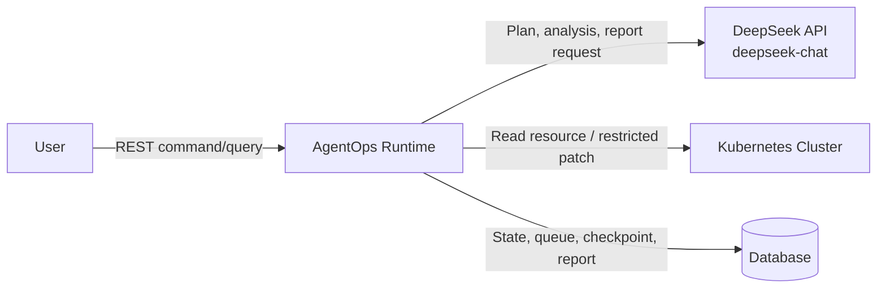
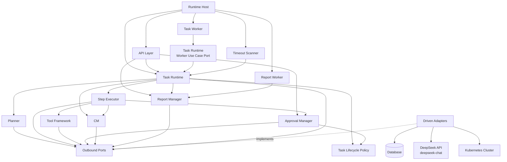
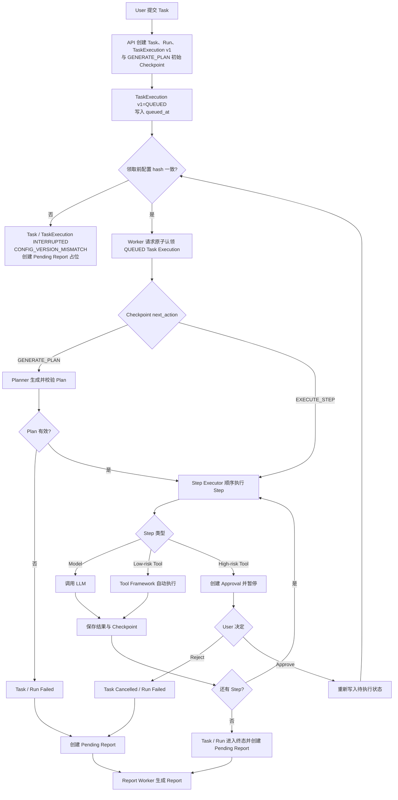
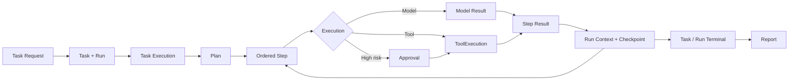

# AgentOps-Go 系统整体架构设计

| 属性 | 值 |
|---|---|
| 文档版本 | V1.3 |
| 文档状态 | 架构质询完成；已确认 QUEUED 执行配置门禁 |
| 需求基线 | `docs/design/001-requirements.md` V3.5 |
| 设计规范 | `docs/specs/003-architecture-specification.md` |

## 1. 架构设计目标

### 1.1 需要解决的问题

当前架构需要建立一条清晰、可落地的 AI Agent 任务执行链路：

- REST 请求与长时间运行的模型、Tool 调用解耦；
- 自然语言 Task 能够被转换为不可变的顺序 Plan；
- Worker 能够按顺序执行 Step，并将关键状态持久化；
- 只读 Tool 自动执行，高风险写 Tool 必须暂停并等待人工审批；
- Worker 中断后能够从最新有效 Checkpoint 人工恢复；
- Task 终止后能够独立生成 Report；
- 模型、Kubernetes 和数据库等外部依赖不侵入核心业务边界。

### 1.2 设计关注点

- 模块职责唯一，避免 Runtime、Worker 和 Step Executor 相互越界；
- 数据库是任务状态、排队状态和恢复状态的唯一事实来源；
- 每次任务执行尝试通过持久化 Task Execution 表达，旧执行版本不能覆盖新执行结果；
- Task 通过持久化 current_execution_version 指向当前有效执行版本；
- TaskExecution 和 Checkpoint 通过 execution_config_hash 固定恢复所依赖的执行配置；
- 所有 QUEUED TaskExecution 在领取前校验 execution_config_hash，禁止用当前新配置直接执行旧执行尝试；
- Task/Run/Plan/Step 表示稳定的业务执行结构，执行尝试产生的 ToolExecution、Checkpoint 和 Approval 归属具体 execution_version；
- 状态迁移具备明确的一致性边界；
- 状态变更 API 使用持久化 Command Receipt 区分同一命令重试和新的冲突命令；
- 外部调用失败或晚到时不能覆盖已经确定的业务终态；
- Model、Tool 和错误响应只有经过结构化筛选、大小限制与脱敏后才能持久化；
- 写 Tool 的审批参数与实际执行参数一致；
- 架构复杂度适合单人 6～8 周完成。

### 1.3 当前 MVP 不解决的问题

当前架构不解决：

- 多服务与多 Worker 调度；
- 消息队列、Lease、心跳续租、Leader Election 和自动故障接管；
- 动态 Plan、DAG、并行 Step 和 Workflow DSL；
- Multi-Agent；
- Tool exactly-once、Reconciliation 和自动回滚；
- 多模型路由、Fallback、成本与配额治理；
- 多租户、复杂 RBAC、生产认证与企业级高可用。

## 2. 系统上下文设计

### 2.1 系统边界

AgentOps Runtime 是唯一业务系统边界，对外提供任务操作入口，对内编排模型与 Kubernetes Tool 调用。

| 外部对象 | 与 AgentOps Runtime 的关系 |
|---|---|
| User | 通过本机受 Bearer Token 保护的 API 创建、查询、取消和恢复 Task，处理 Approval，查看 TaskLog 与 Report |
| DeepSeek API（LLM Provider） | 使用 `deepseek-chat` 提供 Plan 生成、模型 Step 执行和 Report 生成能力 |
| Kubernetes Cluster | 提供诊断数据，并接收经过审批的受限 Deployment Patch |
| Database | 持久化领域状态、Command Receipt、排队记录、Checkpoint、日志与 Report |

### 2.2 边界约束

- User 只通过受认证 API 与系统交互，不直接操作 Worker 或数据库；
- API 默认仅监听 loopback，所有端点都要求同一个静态 Bearer Token；
- Bearer Token 通过运行配置注入，不写入数据库或日志，也不进入 execution_config_hash；
- DeepSeek API 只提供模型能力，不决定 Task 状态；
- Kubernetes Client 只封装外部系统访问，不承担审批和任务流程；
- Database 保存事实，但不通过触发器编排业务流程；
- Agent 与 Tool 在服务启动时静态加载，不提供运行期管理入口。
- MVP 禁止注册或调用读取 Secret 内容的 Tool。

## 3. 系统总体架构设计

### 3.1 架构风格

系统采用单进程模块化单体：

- 一个 API Server；
- 一个 Task Worker，一次执行一个 Task；
- 每次执行尝试对应一个持久化 Task Execution 版本，Worker 只认领已有的 QUEUED Execution；
- 服务每次启动生成新的进程实例 worker_id，并在该进程生命周期内保持不变；
- 一个 Report Worker；
- 一个 Timeout Scanner；
- 一组进程内业务模块；
- 一个关系型数据库；
- 一个 LLM Provider，固定为 DeepSeek API 的 `deepseek-chat`；
- 一个 Kubernetes Client。
- 一条专用 PostgreSQL 连接持有 Runtime Instance 级 advisory lock，防止两个 Runtime 实例并存。

模块化单体保留清晰边界，但不引入网络调用、消息队列或分布式事务。

PostgreSQL advisory lock 只作为整个 Runtime Instance 的 fail-fast 单实例保护，而不只是保护 Task Worker：不包含超时续租、不在实例之间选主，也不自动接管旧实例工作。

MVP 将单实例作用域固定为 PostgreSQL Database：一个 Database 只承载一个 AgentOps Runtime，使用应用固定的 advisory lock key。开发、测试和生产等环境必须使用不同 Database，不支持通过不同 lock key 或 runtime_scope 在同一 Database 内运行多个隔离 Runtime。

### 3.2 架构分层

| 层次 | 包含模块 | 职责 |
|---|---|---|
| 驱动层 | API Layer、Task Worker、Report Worker、Timeout Scanner、Runtime Host | 接收外部请求或触发后台循环，只通过应用层入口驱动用例 |
| 应用层 | Task Runtime、Planner、Step Executor、Tool Framework、Approval Manager、Checkpoint Manager、Report Manager | 编排用例，并由具体命令的负责模块控制事务和一致性边界 |
| 领域规则层 | Task Lifecycle Policy | 以无状态规则校验状态转换，不执行 I/O，不拥有事务 |
| 被驱动适配层 | Repository、LLM Adapter、Kubernetes Adapter、Config、Clock | 实现应用层声明的持久化和外部系统端口 |

Runtime Host 仅表示进程的组合根和启停控制，不等同于 Task Runtime。Runtime Host 负责取得 advisory lock、生成 worker_id、启动或停止 API 与后台组件；Task Runtime 只负责 Task 用例和执行编排。

依赖方向固定为“驱动层 → 应用层 → 领域规则层”，应用层通过出站端口调用被驱动适配层。被驱动适配层不得反向调用应用模块或决定 Task 状态。Task Worker 只能调用 Task Runtime 暴露的 Worker 用例入口；Task Runtime 不持有 Worker 引用。Approval Manager 与 Task Runtime 共同依赖 Task Lifecycle Policy，二者不得互相调用。

Task Lifecycle Policy 是模块化单体内的纯规则组件，不是新的服务、进程或持久化对象；本次分层调整不增加部署单元，也不改变单 Runtime、单 Worker 和单数据库的 MVP 约束。

### 3.3 内部模块关系

### 3.4 模块职责总览

| 模块 | 职责 | 输入 | 输出 | 依赖 | 不负责 |
|---|---|---|---|---|---|
| API Layer | 仅在 loopback 提供 REST 接口，校验静态 Bearer Token 和状态变更命令的 command_id，并完成协议校验和响应转换 | REST Request | REST Response | Task Runtime、各 Manager | 长任务执行、直接访问数据库、用户/角色/RBAC、独立决定幂等结果 |
| Runtime Host | 管理进程组合和启停顺序；取得并监控 advisory lock；生成进程实例 worker_id；触发启动清理；统一启停 API 与后台组件 | 静态配置、进程信号、持锁连接状态 | 已组装的单 Runtime Instance 或启动/关闭结果 | Config、Database、Task Runtime、各驱动组件 | Task 生命周期规则、Task 状态事务、Step 执行 |
| Task Runtime | 执行 Task 生命周期用例；创建首次 Task Execution 与初始 Checkpoint；拥有 Worker 领取、领取前配置校验与启动清理的应用入口；编排 Plan 执行、恢复命令和执行链路终态收尾；按 Task Execution 版本接收结果 | Task 命令、恢复命令、Worker 用例请求、启动清理请求 | 新业务状态、Task Execution、执行结果、恢复排队结果 | Task Lifecycle Policy、Planner、Step Executor、Checkpoint、Report、Config、Repository 端口 | HTTP/Poll/进程启停、具体模型或 Kubernetes 调用、Approval 命令事务、定义第二套生命周期规则 |
| Worker | 执行 FIFO Poll 和单执行槽循环；携带 Runtime Host 注入的 worker_id 调用 Task Runtime 的领取与执行入口；Task Runtime 调用返回后释放执行槽 | Worker 用例入口返回的已领取 Task Execution | 领取请求、执行触发 | Task Runtime 的 Worker Use Case Port | 直接更新 Task/Run/Step、解释或推进执行状态、启动清理分类、创建 execution_version、定义生命周期规则、调用 Approval Manager、多 Task 并行调度、Lease 续租 |
| Planner | 生成和校验单个顺序 Plan | Task、Agent、Tool 描述 | 合法 Plan 或错误 | LLM Adapter、Tool Registry | Step 执行、运行期修改 Plan |
| Step Executor | 顺序执行当前 Step，解析输入并保存确定结果 | 当前 Step、Runtime Context | Step 结果或失败 | Model Client、Tool Framework、Approval、Checkpoint | Task 调度、Report 生成 |
| Tool Framework | 注册 Tool、校验权限与参数、路由 Tool 调用 | Tool 名称与结构化输入 | Tool 结果或错误 | Kubernetes Adapter | Task 状态迁移、审批决定 |
| Approval Manager | 冻结高风险 Tool 输入，处理首次审批决定，并原子执行 Approval 命令导致的跨对象状态迁移 | Approval 命令、冻结参数、当前执行事实 | Approval、同版本 Task Execution 及关联执行对象的新状态 | Task Lifecycle Policy、Repository 端口、Checkpoint Manager | 调用 Task Runtime、定义 Task 生命周期、创建新 execution_version、执行 Patch、身份权限平台 |
| Task Lifecycle Policy | 集中表达 Task/Run/Step/TaskExecution 的合法转换条件，供 Task Runtime 和 Approval Manager 复用 | 当前状态、命令类型、execution_version、deadline 等已加载事实 | 允许或拒绝及稳定原因码 | 无 | Repository、事务、排队、外部调用、应用流程编排 |
| Checkpoint Manager | 保存最小 Runtime Context，并加载、校验最新 Checkpoint | 当前执行位置、下一动作或恢复目标 | Checkpoint 或校验错误 | Repository | Task/Run 状态迁移、恢复策略、重新排队、自动接管 |
| Report Manager | 从持久化事实生成独立最终报告 | 已终止 Task/Run 事实 | Report 或生成错误 | LLM Adapter、Repository | 修改 Task/Run/Step 业务终态 |
| Infrastructure | 提供持久化、版本化 Schema Migration、Runtime Instance 单实例 advisory lock、串行 Runtime 写通道、数据库权威时间、进程单调计时、模型、Kubernetes 和配置能力 | 应用启动与业务层请求 | Migration 与单实例锁结果、持久化写结果、时间和外部调用结果 | Database、LLM、Kubernetes SDK | 业务流程、状态机判断、Leader Election |

### 3.5 运行时进程

进程内包含三个独立后台循环：

- Task Worker：领取并执行 Task；
- Report Worker：生成已经创建的 Pending Report；
- Timeout Scanner：发现超过 deadline 的活动 Task。

三者共享 Repository 和配置，但不共享内存任务队列。Task Worker 与 Report Worker处理不同的持久化对象，不构成多 Worker 调度。

Task Execution 表示 Task 的一次有版本执行尝试，而不是 Worker 占用记录。它用于持久化执行状态、协调人工恢复并拒绝旧版本结果，不提供 Lease、心跳续租、多 Worker 竞争或自动接管。

Task 持久化 `current_execution_version` 作为当前有效 Task Execution 的唯一判断依据：

- Task 创建事务创建 TaskExecution v1，并将 current_execution_version 设置为 1；
- TaskExecution v1 和初始 Checkpoint 保存创建时的 execution_config_hash；
- 恢复事务创建 version+1，并在同一事务中更新 current_execution_version；
- Worker 认领、审批暂停和继续不改变 current_execution_version；
- 所有可能推进 Task、Run、Step 或 Task Execution 状态的事务必须携带 execution_version 条件；
- 条件与 Task.current_execution_version 不匹配时，结果属于旧执行，不得修改当前状态；
- 不通过 MAX(execution_version) 推导当前版本。

worker_id 表示一次服务进程实例，而不是稳定 Worker 身份：

- 服务每次启动生成新的 worker_id；
- worker_id 在进程生命周期内保持不变；
- 服务重启后生成不同的 worker_id；
- Worker 认领 Task Execution 时写入当前进程的 worker_id；
- MVP 不通过 worker_id 实现 Lease、Heartbeat 或自动接管。

Task Execution 使用最小状态集合：

- `QUEUED`：等待 Worker 认领；
- `RUNNING`：已被 Worker 认领并正在执行；
- `WAITING_APPROVAL`：同一次执行尝试暂停等待审批；
- `COMPLETED`：该执行尝试成功完成；
- `FAILED`：该执行尝试已经终止且不可继续或恢复；不保证外部副作用确定未发生；
- `INTERRUPTED`：ModelCall 或只读 Tool 等可安全重做动作发生执行中断，或 QUEUED 执行在领取前发现配置不一致；允许人工恢复。

取消、审批拒绝和超时不新增 Task Execution 状态，统一使用 `FAILED`，并通过 `error_code` 或 `termination_reason` 区分原因。恢复只允许基于 `INTERRUPTED` Task Execution 创建新的 execution_version。

Task 增加非终态 `INTERRUPTED`，仅用于表达领取阶段的 `CONFIG_VERSION_MISMATCH`。此时 Task 和当前 TaskExecution 均记录 `error_code=CONFIG_VERSION_MISMATCH`，`queued_at` 被清空，Run/Step 保持领取前状态；Runtime 不退出、不自动重试。用户可以取消该 Task，或在运维恢复原语义配置后显式 Recover。

Task 生命周期时间统一以 PostgreSQL 为权威：

- Task 创建事务使用数据库时间计算并保存 UTC deadline；
- queued_at、状态变更时间、Timeout Scanner 判断和启动清理均使用数据库时间；
- Timeout Scanner 只选择数据库时间已经达到 deadline 的活动 Task，并通过当前状态和 execution_version 条件更新提交终止；
- Runtime 进程的单调时钟只用于 ModelCall、Tool 调用和持锁连接检查等单次操作的本地超时，不参与 Task deadline 或状态先后判断。

Worker 中断时按外部副作用分类：

- ModelCall 或只读 Tool 中断：Task Execution 进入 `INTERRUPTED`，可以人工恢复并创建新 execution_version；
- 写 Tool 在外部调用前，先通过持锁连接提交当前 execution_version 的 `ToolExecution=RUNNING` 和冻结请求参数，再在事务外发出请求；
- 写 ToolExecution 的 `RUNNING` 表示已经进入“无法证明请求未发送”的保守边界，不表示系统确认 Kubernetes 已接收请求；
- 该边界后的写 Tool 中断使 Task Execution 进入 `FAILED/WRITE_TOOL_INTERRUPTED`，不允许恢复或重放；
- 无法取得确定结果时，ToolExecution 进入 `UNKNOWN` 并记录 `side_effect_unknown=true`；即使请求可能尚未真正发出，也按未知副作用处理，日志和 Report 不得声称外部变更未发生。

服务启动时按以下顺序恢复运行环境：

1. 加载静态配置并注册 Agent、Tool；
2. 初始化 Database、LLM 和 Kubernetes Adapter；
3. 生成本次进程实例的 worker_id；
4. 通过专用 PostgreSQL 连接和应用固定 lock key 获取 Database 级 Runtime Instance advisory lock；
5. advisory lock 获取失败时整个 Runtime 启动失败，不启动 API Server、Task Worker、Report Worker 和 Timeout Scanner；
6. 获取成功后，在继续持有 Runtime 写身份 advisory lock 的前提下，通过独立 Migration 身份连接执行尚未应用的版本化 Schema Migration；
7. Migration 失败时释放 advisory lock、关闭数据库资源并终止整个 Runtime，不执行启动清理，也不启动 API 或后台组件；
8. Migration 成功后，在一次启动清理事务中检查旧 worker_id 遗留的 RUNNING Task Execution、当前动作类型和 Task deadline；
9. 未超时的 ModelCall/只读 Tool 对应 Execution 更新为 INTERRUPTED；
10. 未超时的 RUNNING 写 ToolExecution 对应 Execution 更新为 FAILED/WRITE_TOOL_INTERRUPTED，ToolExecution 更新为 UNKNOWN；
11. deadline 已过期时不产生 INTERRUPTED 中间状态：ModelCall/只读 Tool 对应 Execution 直接进入 FAILED/TIMED_OUT；写 Tool 对应 Execution 进入 FAILED，分别保留 TIMED_OUT 和 WRITE_TOOL_INTERRUPTED 信息，ToolExecution 更新为 UNKNOWN；
12. 同一启动清理事务完成关联 Task/Run/Step 终态和 Pending Report 创建或已有占位确认；
13. 将旧进程遗留的 GENERATING Report 重置为 PENDING；
14. 启动 API 和后台循环，Report Worker 重新领取关联 Task 已处于业务终态的 PENDING Report。

Runtime 关闭采用逆依赖的两阶段流程。Host 一旦决定关闭，先幂等调用 PostgreSQL Runtime 的写准入封闭操作；该阶段只改变准入状态，不关闭持锁连接、普通池或其他资源。WriteExecutor 取得串行 gate 后执行最终准入检查，该检查与准入封闭通过同一状态锁线性化：检查成功的事务视为已经接纳并由后续 Close 等待，仍在 gate 外或检查失败的调用不得开始事务。随后 Host 停止 HTTP Listener 和各驱动组件接收新工作，并在 Shutdown 宽限期内等待活动请求及已经接纳的事务结束；因此关闭前已经进入 Handler、但尚未被 WriteExecutor 接纳的请求也不能新建写事务。组件优雅关闭结束后，Host 才调用 PostgreSQL Runtime Close 完成资源释放。PostgreSQL Runtime Close 入口同步封闭普通读取准入；每个 Query 和 QueryRow 从连接获取前登记，Rows 在 Close、EOF 或迭代错误时注销，QueryRow 在 Scan 成功或失败后注销。关闭宽限期内等待已登记读取正常结束；期限到达后取消其派生 Context、关闭对应底层连接以中断阻塞调用、回滚只读事务并确认连接归还，随后才同步关闭普通连接池。宽限期超时时，HTTP Server 取消所有请求的服务器级 Context 并调用强制关闭以断开活动连接；PostgreSQL Runtime 同时直接关闭持有 advisory lock 的底层连接，使未提交写事务失败并由 PostgreSQL 释放会话锁。Handler 必须遵守请求 Context；Go Runtime 不提供强制终止忽略 Context 的任意 goroutine 的能力。并发或重复关闭只执行一次实际动作，并向所有调用方返回第一次关闭保存的同一最终结果，包括超时和强制关闭错误。

运行期间必须持续持有取得 advisory lock 的专用数据库连接。该连接断开即视为失去 Runtime Instance 单实例保护，当前进程立即进入关闭流程：

1. 停止 API Server 接收新命令，并停止所有后台组件领取或启动新工作；
2. 尽力取消在途 ModelCall 和只读 Tool 调用，任何迟到结果都不得再提交；
3. 对已经进入 `ToolExecution=RUNNING` 保守边界的写 Tool 调用不等待完成、不重试，也不在旧进程中提交结果；
4. 关闭服务并退出进程，不尝试在原进程内自动重连抢锁；
5. 下一 Runtime Instance 取得锁后，按持久化记录分类遗留执行：ModelCall/只读 Tool 对应 Task Execution 进入 INTERRUPTED；在途写 Tool 对应 Task Execution 进入 FAILED/WRITE_TOOL_INTERRUPTED，结果不明的 ToolExecution 进入 UNKNOWN 并设置 side_effect_unknown=true。

旧进程在失去锁后不参与遗留状态分类，避免与已经取得锁的新 Runtime Instance 并发修改相同执行记录。

持有 advisory lock 的 PostgreSQL 连接同时是所有 Runtime 持久化写入的唯一提交通道：

- Task、Run、Step、TaskExecution、ToolExecution、Approval、Checkpoint、Report、TaskLog 和 Command Receipt 的创建及更新事务必须通过该连接串行执行；
- Task Runtime、Approval、Checkpoint 和 Report 等应用模块只依赖共享 `RuntimeWriteExecutor` 与不透明 `RuntimeWriteTx`；具体 PostgreSQL Repository Adapter 才能在基础设施边界内验证令牌并使用对应事务，应用模块不得导入 PostgreSQL Adapter 或取得 pgx 类型；
- Migration、Runtime 写和 Runtime 读连接必须使用三个不同的真实登录身份；每条连接的 `session_user` 必须等于 `current_user`，禁止通过连接启动参数或 `SET ROLE` 以高权限登录身份冒充低权限身份；
- 普通数据库连接池严格只承担查询，并使用数据库 ACL 对所有 Runtime 管理表均无表级或列级写权限的独立只读身份；即使会话尝试关闭 `default_transaction_read_only` 或执行 `RESET ROLE`，也不得旁路提交任何 Runtime 持久化写入；
- 所有状态事务必须保持短事务，不得等待外部系统或执行长耗时计算；
- ModelCall、Tool 调用等外部请求必须在数据库事务之外执行，返回后再通过持锁连接进行条件更新；
- 持锁连接断开时，连接上的未完成事务失败；锁释放后，旧 Runtime Instance 不再具备提交 Runtime 持久化数据的数据库通道。

该约束以单连接串行化换取 MVP 的明确失锁写入边界，不扩展为 Runtime fencing token。

Runtime 通过同一持锁连接执行周期性轻量存活检查：

- 存活检查与 Runtime 持久化写事务串行执行，不并发使用同一连接；
- 任意存活检查或状态写事务报告连接错误时，立即触发不可逆的 Runtime 关闭流程；
- 当前进程不重建持锁连接、不重新获取 advisory lock，也不恢复后台组件；
- 检查间隔和单次检查超时由静态配置提供，具体默认值在运行配置详细设计中确定；
- 该检查不写入 Worker 所有权、不延长租期，也不支持故障接管，因此不属于 Lease 或 Heartbeat。

Runtime 进程退出后的服务恢复由外部进程管理器负责：

- Runtime 自身不在进程内等待、重连或循环抢锁；
- 外部进程管理器可以启动一个全新进程，新进程生成新的 worker_id，并完整执行获取锁、Migration 和启动清理流程；
- 自动重启只恢复 Runtime 服务可用性，不自动创建 execution_version，也不自动继续 INTERRUPTED Task；
- INTERRUPTED Task 仍然等待用户显式发起 Recover；
- 不部署等待锁的热备 Runtime，不引入 Leader Election 或自动 Worker 接管。

## 4. 核心运行流程设计

### 4.1 主执行链路

### 4.2 模块协作

1. API Layer 校验 command_id 后调用 Task Runtime，在同一事务中创建 Command Receipt、Task、Run、QUEUED TaskExecution v1、`next_action=GENERATE_PLAN` 的初始 Checkpoint 和 `queued_at`，不在请求线程中运行 Planner 或 Tool；
2. Worker 通过 Task Runtime 的 Worker Use Case Port 请求领取；Task Runtime 先校验 QUEUED TaskExecution 的 execution_config_hash。首次领取比较 TaskExecution 与当前语义配置，Approval 或 Recover 后领取还比较当前版本最新 Checkpoint。全部一致时，Runtime 在短事务内将已有 Task Execution 从 QUEUED 原子更新为 RUNNING、填入 worker_id，并把已领取执行返回给 Worker；
3. 领取 hash 不一致时，Task Runtime 不执行 Planner、Model 或 Tool；在同一短事务中将 Task 和当前 TaskExecution 更新为 `INTERRUPTED/CONFIG_VERSION_MISMATCH`、清空 `queued_at`、保持 Run/Step 的领取前状态并创建唯一 Pending Report 占位。Runtime 继续运行，Worker 继续后续 Poll；
4. Task Runtime 调用 Planner 创建唯一 Plan；
5. Task Runtime 按 Plan 顺序驱动 Step Executor；
6. Step Executor 根据 Step 类型调用 Model Client 或 Tool Framework；
7. 高风险 Tool 在外部调用前交给 Approval Manager；Approval Manager 直接使用 Task Lifecycle Policy 校验并提交等待审批事务，不回调 Task Runtime，Task 暂停并释放 Worker；
8. 每个确定执行边界由 Checkpoint Manager 保存 Runtime Context；
9. Task Runtime 完成业务终态，并可靠创建或确认唯一待生成 Report；
10. Report Worker 只领取关联 Task 已处于业务终态的 Pending Report，再调用 Report Manager 独立生成最终报告。

Task Runtime 持续编排已领取执行，直到进入 `WAITING_APPROVAL` 或业务终态后才返回；Worker 将返回视为释放当前单执行槽的信号，不解释或推进 Task 状态。Approve 事务只负责将同版本 Task Execution 重新置为 QUEUED，随后由 Worker 的下一次 Poll 重新进入 Task Runtime，不存在 Approval Manager → Task Runtime 的同步回调。

### 4.3 状态管理边界

| 关键点 | 需要保持一致的状态 |
|---|---|
| Task 创建 | Task、唯一 Run、TaskExecution v1=QUEUED、Task.current_execution_version=1、相同 execution_config_hash 的 GENERATE_PLAN 初始 Checkpoint、worker_id 为空、待执行标记 |
| 命令幂等 | Command Receipt 与命令产生的业务状态在同一事务中提交；相同 command_id 重试返回原结果 |
| Worker 领取 | 校验当前配置、TaskExecution 及适用时最新 Checkpoint 的 execution_config_hash；一致后同一 Task Execution QUEUED→RUNNING、写 worker_id、清待执行标记并按需推进 Task/Run 启动状态；execution_version 不变 |
| 领取配置不一致 | Task 和当前 TaskExecution→INTERRUPTED/CONFIG_VERSION_MISMATCH、清待执行标记、保持 Run/Step 原状态、唯一 Pending Report 占位；不执行外部动作 |
| Plan 完成 | Plan、Step、Run 当前执行位置、Checkpoint |
| Step 完成 | Step 结果、当前版本 ToolExecution、Run Context、当前版本 Checkpoint |
| 进入审批 | Approval Manager：当前版本 Approval、Step/Run/Task WaitingApproval、同版本 Task Execution RUNNING→WAITING_APPROVAL、清空 worker_id、Checkpoint |
| Approval 通过 | Approval Manager：Approval、Step/Run/Task Running、同版本 Task Execution WAITING_APPROVAL→QUEUED、Checkpoint、重新排队 |
| 审批命令冲突 | Approve、Reject、Cancel、Timeout 通过持锁写通道按提交顺序处理，并匹配预期 Approval 状态、TaskExecution 状态和 execution_version |
| 人工恢复 | Task Runtime：当前 Task Execution、恢复条件、Task/Run/Step 状态、新 execution_version、Task.current_execution_version、新版本恢复起点 Checkpoint、重新排队；Checkpoint Manager 提供旧版本校验结果并创建新版本起点 |
| Task 终止 | Task/Run 终态、创建或确认唯一 Pending Report |

模型和 Kubernetes 调用属于耗时外部操作，不应运行在数据库事务内。调用返回后必须确认当前业务状态仍允许接收结果。

所有状态变更 API 必须携带客户端生成的 command_id：

- Command Receipt 使用 command_id 作为 Database 内唯一幂等标识，并记录命令类型、目标、请求指纹和经过脱敏的 API 结果；
- 首次命令在同一事务中写入 Command Receipt 和全部业务状态变更，不能分别提交；
- 相同 command_id 且请求指纹一致的重试直接返回已保存结果，不再次执行状态迁移；
- 相同 command_id 对应不同命令类型、目标或请求指纹时返回冲突；
- 不同 command_id 按当前业务状态和 execution_version 正常校验，可能成功或返回状态冲突。

所有可能推进 Task、Run、Step 或 Task Execution 的异步结果还必须携带其 execution_version；只有与 Task.current_execution_version 相同的结果可以提交，旧版本结果只能被丢弃并记录。

Task/Run/Plan/Step 不随 execution_version 复制。ToolExecution、Checkpoint 和 Approval 必须记录所属 execution_version；TaskLog 可以按审计需要选择性关联 execution_version。

Cancel 和 Timeout 由 Task Runtime 按立即终止规则处理：

- 命令事务必须匹配当前 execution_version 和允许终止的 TaskExecution 状态，并将 TaskExecution 更新为 FAILED，以 `CANCELLED` 或 `TIMED_OUT` 原因区分终止来源；
- ModelCall 或只读 Tool 正在执行时，Runtime 尽力取消调用；无论取消是否成功，其迟到结果都不得再更新 Task 状态；
- 写 Tool 尚未提交 ToolExecution=RUNNING 时，终止事务使后续写调用无法通过状态条件校验，不得发出外部请求；
- 写 Tool 已进入 ToolExecution=RUNNING 保守边界时，终止事务不等待外部调用，也不声称 Kubernetes 操作已经取消；ToolExecution 更新为 UNKNOWN 并设置 side_effect_unknown=true；
- 写 Tool 的确定结果事务与 Cancel/Timeout 事务通过持锁写通道按数据库提交顺序竞争，并同时匹配当前 execution_version、TaskExecution 状态和 ToolExecution=RUNNING；
- Tool 结果先提交时保留其确定事实，后到的 Cancel/Timeout 只能针对已经推进后的 Task 状态重新校验，不得把确定 Tool 结果改写为 UNKNOWN；
- Cancel/Timeout 先提交时 ToolExecution 进入 UNKNOWN，后到的 Tool 结果不得再更新 ToolExecution 或推进 Task；
- Cancel 或 Timeout 不创建新的 execution_version；Task/Run 进入相应业务终态，并可靠创建 Pending Report。

所有外部响应在进入持久化边界前执行统一安全处理：

- Model 响应、Tool 响应和错误内容先解析为允许的结构化字段，再执行字段白名单、结果大小限制和敏感信息脱敏；
- 原始响应只允许在调用处理期间短暂存在于内存，不得写入 Step、ToolExecution、Checkpoint、TaskLog、Report 或 Command Receipt；
- 无法完成结构化、大小限制或脱敏时，不保存原始内容，只记录安全错误元数据并按调用失败处理；
- Checkpoint 只引用已经安全持久化的结构化结果，不保存原始上下文副本；
- Report 只能读取经过处理的持久化事实，不得访问原始 Model 或 Tool 响应；
- MVP 禁止 Secret 类 Tool，不建设原始数据加密存储、密钥管理或 DLP 平台。

### 4.4 Approval 暂停与继续

- Step Executor 在审批前解析并冻结完整 Tool 输入；
- Approval Manager 保存旧值、新值和审批时读取的 Kubernetes `resourceVersion`；
- Approval Manager 在一个事务中创建 Approval，使 Task、Run 和当前 Step 进入 WaitingApproval，将同一 Task Execution 从 RUNNING 更新为 WAITING_APPROVAL、清空 worker_id，并保存 Checkpoint；
- WaitingApproval 不占用 Worker；
- Approve 时，Approval Manager 在一个事务中更新 Approval、Step、Run、Task、Checkpoint 和 `queued_at`，并将同一 execution_version 从 WAITING_APPROVAL 更新为 QUEUED；
- Approve 不创建新的 Task Execution，也不递增 execution_version；
- Approval Manager 执行由审批命令触发的状态迁移，但迁移是否合法由共享的无状态 Task Lifecycle Policy 校验；Approval Manager 不调用 Task Runtime；
- Approve、Reject、Cancel 和 Timeout 通过持锁写通道按数据库提交顺序处理，不设置跨事务命令优先级；
- 针对同一次 WAITING_APPROVAL，命令事务必须同时匹配预期 Approval 状态、TaskExecution=WAITING_APPROVAL 和当前 execution_version；只有第一个有效决定成功，后续决定返回冲突且不得产生部分状态更新；
- Approve 后 Task 重新进入数据库 FIFO 队列；
- Approve 已提交后到达的 Cancel 不再属于同一次审批决定，而是针对 QUEUED 或后续 RUNNING 状态的新生命周期命令，必须按该状态的取消规则重新校验；
- Worker 再次领取后，由 Tool Framework 在发出写请求前复核 Kubernetes 资源上下文；该复核用于提前发现变化，但不作为最终并发正确性边界；
- Kubernetes Adapter 必须使用内部生成的 JSON Patch，并把对 `/metadata/resourceVersion` 等于 Approval 冻结值的 `test` 操作放在同一个 Patch 请求中；资源版本检查与后续受限字段变更由 Kubernetes API 在单个请求内原子执行；
- 外部请求只允许包含 Adapter 按已审批参数生成的 resourceVersion `test` 与受限变更操作，仍不接受用户提供的任意 JSON Patch、Merge Patch 或完整资源对象；
- 原子前置条件失败或 Kubernetes 返回资源版本冲突时，不执行自动刷新、重试或复用原 Approval；ToolExecution 记录确定失败 `ApprovalContextChanged`，`side_effect_unknown=false`，Task 按现有 Tool 失败流程终止；
- 请求发出后若超时、断连或结果无法确认，仍按既有规则记录 ToolExecution=UNKNOWN、side_effect_unknown=true；resourceVersion 前置条件不提供 exactly-once 保证；
- Reject 时不创建 ToolExecution，也不调用 Kubernetes Patch。

### 4.5 Checkpoint 恢复

- Task 创建事务先保存 `next_action=GENERATE_PLAN`、与 TaskExecution v1 hash 相同的初始 Checkpoint；Planner 完成、Step 得到确定结果和 Approval 边界继续保存 Checkpoint；
- Checkpoint 描述当前执行位置和下一动作，不保存全量数据库快照；
- Worker 中断后不自动执行未排队的 Running Task；
- User 明确请求恢复后，Task Runtime 编排完整恢复流程；
- Task Runtime 判断 Task/Run 状态、超时、当前 Task Execution 是否为 INTERRUPTED，以及写 Tool 安全条件；Task 可以是执行中断时保持的 Running，也可以是领取配置不一致产生的 INTERRUPTED；
- Checkpoint Manager 加载并校验当前 execution_version 的最新 Checkpoint，不决定 Task 是否允许恢复；
- Task Runtime 比较当前静态执行配置与 TaskExecution、Checkpoint 保存的 execution_config_hash；任一不一致时返回 CONFIG_VERSION_MISMATCH，不修改原执行状态、不创建新 execution_version，也不重新排队；
- CONFIG_VERSION_MISMATCH 后由运维或用户恢复原配置再重新发起 Recover，或取消该 Task；
- execution_config_hash 基于规范化后的执行语义与安全配置计算，覆盖 Agent 指令、模型标识与生成参数、允许的 Tool 集合、Tool 输入 Schema、读写/风险等级、审批策略和 Plan 约束；
- 凭证及其轮换、API 地址、日志级别、持锁连接存活检查间隔等运维配置不进入 execution_config_hash；
- hash 输入必须使用确定性的字段选择、排序和序列化规则，不能直接依赖配置文件原始文本或字段排列；
- Task Runtime 根据校验结果创建 execution_version+1、status=QUEUED 且 worker_id 为空的新 Task Execution，并更新 Task.current_execution_version、Task、Run、Step 和 `queued_at`；来源为 GENERATE_PLAN 时 Task/Run 恢复为 Pending/Pending，其他来源恢复为 Running/Running，并清除 Task 上的 CONFIG_VERSION_MISMATCH；
- 同一恢复事务为新 execution_version 创建恢复起点 Checkpoint，复制已验证的最小 Runtime Context 和已匹配的 execution_config_hash，并记录来源 execution_version 与来源 Checkpoint；
- 恢复成功后 Task 重新进入执行队列，后续结果必须匹配新的 execution_version；
- Worker 只加载当前 execution_version 的最新 Checkpoint，不跨版本扫描恢复位置；
- ModelCall 与只读 Tool 可以在人工恢复后重新执行当前 Step；
- 已经提交 `ToolExecution=RUNNING` 但结果未保存的写 Tool 使 Task Execution 进入 FAILED/WRITE_TOOL_INTERRUPTED，不允许恢复或重放；
- 结果未知的写 ToolExecution 使用 UNKNOWN 和 side_effect_unknown=true 表达外部副作用不确定；UNKNOWN 包括无法证明请求未发送的保守场景。
- UNKNOWN 禁止自动恢复或重放；API、TaskLog 和 Report 必须提示人工检查 Kubernetes 实际状态后再决定后续操作。

### 4.6 Report 生成

- Report 不属于 Plan 或 Step；
- Task/Run 业务终态与 Pending Report 的创建或已有占位确认可靠地同时提交；
- 领取配置不一致可以在 Task=`INTERRUPTED` 时提前创建唯一 Pending Report 占位；
- Report 使用 PENDING、GENERATING、COMPLETED、FAILED 四种状态；
- Report Worker 领取 PENDING 记录时必须联表确认 Task 已为 Completed、Failed 或 Cancelled；Task=`INTERRUPTED` 时保持 PENDING；
- 满足业务终态门禁后，Report Worker 通过持锁写通道将 PENDING 条件更新为 GENERATING，再独立调用 DeepSeek 生成报告；
- 生成结果只允许从 GENERATING 条件更新为 COMPLETED；
- Runtime 启动清理将旧进程遗留的 GENERATING 重置为 PENDING，并由 Report Worker 自动重新生成；该重做只适用于进程中断；
- DeepSeek 明确返回生成失败时，Report 进入 FAILED，MVP 不自动重试，也不增加退避、attempt 或独立重试调度；
- Report 失败只改变 Report 自身状态；
- Report 不反向修改已经确定的 Task、Run 或 Step。

## 5. 核心模块边界设计

### 5.1 Task Runtime

负责：

- Task/Run 生命周期编排；
- 通过 Task Lifecycle Policy 校验状态迁移，不在应用服务内部维护仅供自身调用的第二套规则；
- 向 Worker 暴露窄化的领取与执行用例入口；
- 在 Worker 请求领取时按入口类型校验当前配置、TaskExecution 和适用 Checkpoint 的 execution_config_hash；
- 配置一致时原子完成 QUEUED→RUNNING、worker_id 和 `queued_at` 更新；
- 配置不一致时不执行外部动作，原子将 Task/TaskExecution 更新为 INTERRUPTED/CONFIG_VERSION_MISMATCH、清空 `queued_at` 并创建唯一 Pending Report 占位；
- 接收 Runtime Host 发起的启动清理请求，并按既有动作类型、deadline 和 execution_version 规则分类旧执行；
- 创建 Task 时在同一事务中创建 Task、Run、QUEUED TaskExecution v1、`GENERATE_PLAN` 初始 Checkpoint 和 `queued_at`；
- 创建或恢复 Task Execution 时，在同一事务中更新 Task.current_execution_version；
- 编排恢复命令并判断 Task/Run 是否允许恢复；
- 校验恢复时的超时、当前 Task Execution=INTERRUPTED 和写 Tool 安全条件；
- 恢复时创建新的 execution_version，并原子更新 Task、Run、Step 和 `queued_at`；
- 恢复事务中为新 execution_version 创建自己的起点 Checkpoint；
- 拒绝旧 execution_version 对当前 Task、Run 和 Step 的状态推进；
- 要求所有状态推进匹配 Task.current_execution_version；
- 将写 Tool 中断归类为 FAILED/WRITE_TOOL_INTERRUPTED，而不是可恢复的 INTERRUPTED；
- 调用 Planner 和 Step Executor；
- 决定暂停、继续、失败和完成；
- 控制执行链路产生的状态迁移和业务终态。

不负责：

- Worker Poll 和执行槽循环；
- 生成 worker_id 或控制进程启停；
- 解析 HTTP；
- 执行 Approval 命令的跨对象事务；
- 被 Approval Manager 回调，或主动调用 Worker；
- 定义与 Task Lifecycle Policy 重复的状态转换规则；
- 实现 LLM 或 Kubernetes SDK；
- 生成数据库字段结构。

### 5.2 Worker

负责：

- 按数据库 FIFO 领取 Task；
- 通过 Task Runtime 的 Worker Use Case Port 发起领取，不直接修改 Task、Run、Step 或 TaskExecution；
- 使用 Runtime Host 注入的进程实例 worker_id，领取时不创建或递增 execution_version；
- 只在应用已取得 advisory lock 时启动和运行；
- 保证一次只执行一个 Task；
- 将已领取 Task 交给 Task Runtime；
- Task Runtime 调用在 WaitingApproval 或终态后返回，随后释放执行槽。

不负责：

- 决定 Step 如何执行；
- 维护内存任务队列；
- 生成 worker_id 或执行启动遗留状态分类；
- 直接依赖 Approval Manager、Checkpoint Manager 或 Repository 写接口；
- 决定或提交 Task 生命周期状态迁移；
- 实现 Lease、心跳续租或自动接管；
- 将 worker_id 当作跨进程稳定身份；
- 实现 Leader Election；
- 处理 Report。

### 5.3 Planner

负责：

- 调用单一 LLM Provider 生成结构化 Plan；
- 校验 Step 顺序、Tool 权限和受限引用；
- 对非法结构执行一次修复。

不负责：

- 执行 Step；
- 动态修改已经创建的 Plan；
- 进行 Tool 调用；
- 管理 Task 状态机。

### 5.4 Step Executor

负责：

- 执行当前顺序 Step；
- 解析显式的紧邻前序 Step 输出引用 `step.output.<field>`；
- 调用模型或 Tool；
- 将确定结果交给 Runtime 和 Checkpoint Manager。

不负责：

- 领取 Task；
- 重新规划；
- 并行调度 Step；
- 自动注入历史 Step 摘要或 Memory；
- 生成最终 Report。

### 5.5 Tool Framework

负责：

- 静态 Tool Registry；
- Tool 查找、参数 Schema、白名单和风险等级校验；
- 写 Tool 在外部调用前先持久化当前 execution_version、冻结参数和 ToolExecution=RUNNING；
- 对 Kubernetes 写 Tool 保留执行前资源上下文复核，并将冻结的 resourceVersion 传给 Kubernetes Adapter；
- 调用具体 Tool Adapter；
- 将 RUNNING 视为无法证明请求未发送的边界，并对未取得确定结果的写调用记录 ToolExecution=UNKNOWN 和 side_effect_unknown=true；
- 对结果执行大小限制和脱敏。

不负责：

- 决定是否批准高风险操作；
- 修改 Task 状态；
- 自动重试写 Tool；
- 绕过 Kubernetes Adapter 的请求级 resourceVersion 原子前置条件；
- 提供运行期 Tool 管理。

### 5.6 Approval Manager

负责：

- 创建单次 Approval；
- 冻结待执行 Tool 输入、资源上下文和 Kubernetes resourceVersion；
- 处理首次有效 Approve 或 Reject；
- 直接使用 Task Lifecycle Policy 校验审批命令能否执行；
- 原子更新 Approval、Step、Run、Task、Checkpoint 和 `queued_at`；
- 进入等待时将同版本 Task Execution 更新为 WAITING_APPROVAL 并清空 worker_id；
- Approve 时将同版本 Task Execution 更新回 QUEUED，不创建新 execution_version；
- 完成审批命令导致的继续排队或终止。

不负责：

- 复杂身份认证；
- 多级、会签或撤销审批；
- 定义 Task 生命周期及其合法状态转换；
- 调用 Task Runtime 或 Worker；
- 执行 Deployment Patch；
- 自动刷新失效审批。

### 5.7 Task Lifecycle Policy

负责：

- 以无状态、无 I/O 的方式集中表达 Task、Run、Step 和 TaskExecution 的合法状态转换；
- 同时服务 Task Runtime 的创建、领取、执行、取消、超时、恢复和启动清理，以及 Approval Manager 的进入审批、Approve 和 Reject；
- 基于调用方已加载的当前状态、execution_version、deadline 和命令类型返回允许或稳定拒绝原因；
- 保证 Task Runtime 与 Approval Manager 使用同一套转换规则。

不负责：

- 读取或写入 Database；
- 持有事务、生成 `queued_at` 或创建 Checkpoint；
- 调用 Task Runtime、Approval Manager、Worker 或外部系统；
- 决定具体命令的事务范围。

### 5.8 Checkpoint Manager

负责：

- 保存最小 Runtime Context；
- 加载并校验指定 execution_version 的最新 Checkpoint；
- 校验 Checkpoint 的 execution_config_hash 与对应 TaskExecution 一致，并将其返回给 Task Runtime；
- 为恢复产生的新 execution_version 创建恢复起点 Checkpoint，并记录来源；
- 向 Task Runtime 返回经过校验的恢复位置和下一动作。

不负责：

- 判断 Task/Run 是否允许恢复；
- 修改 Task、Run、Step 或 `queued_at`；
- 编排恢复流程；
- 自动故障接管；
- 保存配置快照；
- 回退到更早 Checkpoint；
- 事件重放。

### 5.9 Report Manager

负责：

- 读取已持久化的执行事实；
- 生成成功、失败或取消报告；
- 管理 Report 的 PENDING、GENERATING、COMPLETED、FAILED 状态；
- 领取 Pending Report 时校验关联 Task 已进入 Completed、Failed 或 Cancelled，拒绝为 INTERRUPTED Task 生成最终报告；
- 仅允许进程重启清理将遗留 GENERATING 重置为 PENDING。

不负责：

- 参与 Plan；
- 创建业务 Step；
- 改变业务终态；
- 修复失败 Task。

## 6. 核心技术决策

| 问题 | 选择方案 | 原因 |
|---|---|---|
| 系统形态 | 单进程模块化单体 | 满足 MVP 周期，同时保留清晰模块边界 |
| 任务调度 | Database `queued_at` FIFO Poll | 重启后无需重建队列，避免 MQ 和内存队列双写 |
| Worker 模型 | 单 Task Worker，一次执行一个 Task | 不需要 Lease、竞争协调和并行调度 |
| 首次执行创建 | Task 创建事务同时创建 TaskExecution v1 和 `next_action=GENERATE_PLAN` 的初始 Checkpoint；Execution 初始为 QUEUED 且 worker_id 为空，两者保存相同 execution_config_hash | 保证任何排队 Task 都有执行尝试，并为首次领取配置失配后的人工恢复提供合法起点 |
| Worker 执行记录 | PostgreSQL 持久化 Task Execution；它表示一次执行尝试，包含 worker_id、execution_version 和 execution_status | 使执行状态、恢复竞态和旧结果保护都以数据库为事实来源 |
| 当前执行事实 | Task 持久化 current_execution_version；创建/恢复 Execution 时同事务更新 | 提供可用于原子条件更新的当前版本，不依赖 MAX 推导 |
| 执行结构与尝试分离 | Task/Run/Plan/Step 不按版本复制；ToolExecution、Checkpoint、Approval 必须关联 execution_version | 保留单一业务结构，同时能追踪每次执行尝试的副作用与恢复状态 |
| worker_id 语义 | 每次服务启动生成新的进程实例标识，进程内保持不变 | 无需 Lease 即可识别重启前遗留的 RUNNING Execution |
| 单实例保护 | 启动时通过专用 PostgreSQL 连接获取 Runtime Instance 级 advisory lock；失败则整个 Runtime 启动失败，不启动 API Server 和任何后台组件 | 防止两个 Runtime 实例通过 Worker 或状态变更 API 并发修改任务状态 |
| 单实例作用域 | 一个 PostgreSQL Database 对应一个 AgentOps Runtime，使用应用固定 advisory lock key；不同环境使用不同 Database | 避免 runtime_scope 配置错误绕过互斥，也不引入多租户数据隔离 |
| Schema Migration | 取得 Runtime 写身份 advisory lock 后、启动清理前，通过独立 Migration 身份连接执行版本化 Migration；失败则整个 Runtime 退出 | 避免候选实例并发修改 Schema，同时不让运行期写身份长期持有 DDL 权限 |
| 锁丢失处理 | 停止接收和启动新工作；取消 ModelCall/只读 Tool；不等待在途写 Tool，且不提交任何迟到结果；退出后由下一 Runtime Instance 分类遗留执行 | 失锁旧进程不再修改任务状态，避免与新实例重叠；对不确定写副作用采用保守失败 |
| Runtime 写通道 | Task、Run、Step、TaskExecution、ToolExecution、Approval、Checkpoint、Report、TaskLog 和 Command Receipt 的全部持久化写入只通过持锁 PostgreSQL 连接串行提交；普通连接池使用独立数据库只读身份，数据库 ACL 不授予业务表写权限 | 使 advisory lock 释放与旧实例失去全部 Runtime 写能力共享同一数据库会话边界，并防止会话 GUC 被修改后绕过 WriteExecutor |
| 状态事务时长 | 所有状态事务保持短事务；LLM、Kubernetes API 和长耗时外部操作严格位于事务外 | 避免单写连接被外部调用长期占用并阻塞整个 Runtime |
| 持锁连接存活检查 | 在同一持锁连接上周期性执行轻量检查，并与 Runtime 写事务串行；任意连接错误触发关闭且不重连 | 在空闲或长外部调用期间也能有界发现锁会话丢失，不引入 Lease/Heartbeat |
| 进程退出后的服务恢复 | Runtime 退出后由外部进程管理器启动全新实例；新实例执行标准启动流程，但不自动恢复 INTERRUPTED Task | 恢复 API 服务可用性，同时保持任务恢复必须由用户触发 |
| Task Execution 状态 | QUEUED、RUNNING、WAITING_APPROVAL、COMPLETED、FAILED、INTERRUPTED | 保持状态机最小，具体终止原因由 error_code/termination_reason 表达 |
| 恢复来源 | 只允许从 INTERRUPTED Task Execution 创建新 execution_version | 明确恢复边界，避免对已确定成功或失败的执行重复运行 |
| 恢复起点 | 恢复事务为新 execution_version 复制一条最小 Runtime Context Checkpoint，并记录来源 | 让每个执行版本自包含，Worker 无需跨版本读取 |
| 恢复配置一致性 | TaskExecution 和 Checkpoint 保存 execution_config_hash；Recover 要求当前配置、旧执行和 Checkpoint 三者一致 | 防止使用变化后的 Agent、Tool Schema 或安全策略静默恢复 |
| QUEUED 领取配置门禁 | 首次领取比较 TaskExecution 与当前配置；Approval 后和 Recover 后领取比较 TaskExecution、当前版本最新 Checkpoint 与当前配置 | 所有排队来源在执行外部动作前确认语义配置未漂移，禁止用新配置执行旧 Execution |
| 领取配置不一致 | Task 与当前 TaskExecution 原子进入 INTERRUPTED/CONFIG_VERSION_MISMATCH，清空 queued_at，保持 Run/Step 原状态并创建唯一 Pending Report 占位；Runtime 继续运行且不自动重试 | 保持状态机最小，为恢复原配置后的人工 Recover 保留现场，同时不让单个任务配置漂移影响服务可用性 |
| Execution Config Hash 范围 | 覆盖 Agent 指令、模型及生成参数、Tool 集合与 Schema、风险等级、审批策略和 Plan 约束；排除凭证、API 地址、日志与存活检查配置 | 只让执行语义或安全边界变化阻止恢复，避免运维配置变化造成无意义失配 |
| FAILED 语义 | 执行尝试已终止且不可恢复，不保证外部副作用未发生 | 能表达写 Tool 结果未知但不能安全继续的场景 |
| 写 Tool 中断 | Task Execution=FAILED/WRITE_TOOL_INTERRUPTED；ToolExecution=UNKNOWN、side_effect_unknown=true | 禁止重放，同时保留外部副作用不确定性 |
| 写 Tool 调用边界 | 外部调用前先提交 ToolExecution=RUNNING 和冻结请求；RUNNING 表示无法证明请求未发送 | 优先避免未记录的外部副作用；接受请求可能未真正发出时的保守 UNKNOWN |
| 旧结果保护 | 所有状态推进必须匹配当前 execution_version | 恢复创建新版本后，旧执行结果不能覆盖当前执行 |
| 高可用边界 | Execution Version Guard，不实现 Lease、心跳、自动接管或多 Worker 调度 | 保留 MVP 范围，只解决单 Worker 的持久化执行与恢复竞态 |
| 执行模型 | 单个不可变顺序 Plan | 能展示 Planner 与执行器，又不引入 DAG/DSL |
| 状态管理 | Database 作为唯一事实来源 | 支持查询、事务一致性和人工恢复 |
| 生命周期权威时间 | Task deadline、queued_at、状态时间和超时判断统一使用 PostgreSQL UTC 时间；进程单调时钟只控制单次外部操作 | 避免服务重启和主机时钟差异造成生命周期判断不一致 |
| 命令 API 幂等 | 所有状态变更 API 要求 command_id；Command Receipt 与业务变更同事务保存，相同请求重试返回原结果 | 区分响应丢失后的安全重试与新的冲突命令 |
| API 访问边界 | 默认只监听 loopback，所有端点要求单个静态 Bearer Token；Token 仅通过运行配置注入 | 为 Approval、Recover、Cancel 和查询提供最低限度保护，不引入用户、角色或 RBAC |
| 外部结果持久化 | 只保存结构化、白名单、限长和脱敏后的 Model/Tool/错误结果；原始响应仅短暂存在内存 | 降低数据库、日志、报告和幂等回执泄露敏感信息的风险 |
| 外部调用 | 事务外调用，返回后条件保存 | 避免模型和 Kubernetes 调用形成长事务 |
| 执行中取消或超时 | 立即将当前 TaskExecution 更新为 FAILED 并保留 CANCELLED/TIMED_OUT 原因；取消 Model/只读调用，写 Tool 已进入 RUNNING 边界时记为 UNKNOWN | 及时终止任务，同时不对写操作的外部副作用作错误承诺 |
| Tool 结果与终止命令竞争 | 确定结果与 Cancel/Timeout 按持锁写通道的提交顺序执行，并匹配 execution_version、TaskExecution 和 ToolExecution 预期状态 | 已提交的确定 Tool 事实不被覆盖；终止命令先提交时拒绝迟到结果 |
| 启动时中断与超时重叠 | 在一次启动清理事务中综合判断旧执行动作和 deadline；已超时执行直接进入 FAILED，不产生 INTERRUPTED 中间状态 | 避免过期任务短暂暴露为可恢复状态或发生二次终止迁移 |
| 生命周期规则依赖 | Task Lifecycle Policy 作为无状态、无 I/O 的共享领域规则；Task Runtime 与 Approval Manager 都依赖它，二者互不调用 | 保留 Approval Manager 的事务所有权，同时消除 Worker、Task Runtime 与 Approval Manager 的隐含循环 |
| Worker 与 Runtime | Worker 是驱动适配器，只通过 Task Runtime 的 Worker Use Case Port 发起领取和执行；状态事务由 Task Runtime 编排 | Worker 保留 FIFO Poll 和单执行槽职责，但不越界定义或直接推进 Task 生命周期 |
| 审批事务所有权 | Approval Manager 负责 Approval 命令引起的完整跨对象事务，并使用共享 Task Lifecycle Policy 校验 | 保持命令事务完整，同时避免 Approval Manager 成为 Task 生命周期定义者或反向依赖 Task Runtime |
| 审批与执行版本 | 审批暂停和继续沿用同一 Task Execution；RUNNING→WAITING_APPROVAL→QUEUED | 审批是计划内暂停，不应被记录为新的执行尝试 |
| 审批命令冲突 | Approve、Reject、Cancel、Timeout 按持锁写通道的数据库提交顺序执行，并使用预期状态和 execution_version 条件更新 | 同一次等待审批只有一个决定成功，不引入命令优先级协调 |
| 任务恢复 | Task Runtime 负责完整恢复事务；Checkpoint Manager 只加载和校验最新 Checkpoint | 恢复属于 Task 生命周期命令，同时保持 Checkpoint 管理职责单一 |
| Tool 调用 | 静态 Registry + Schema + 权限/风险校验 | 提供明确安全边界，不建设运行期插件平台 |
| 写操作安全 | 冻结参数 + 人工审批 + 执行前资源上下文复核 + 同一 Kubernetes JSON Patch 请求内的 resourceVersion `test` | 复核用于提前失败，请求级原子前置条件关闭复核与写入之间的竞态窗口 |
| 写 Tool 失败 | 不自动重试、不承诺 exactly-once | 防止不确定副作用被重复执行 |
| Report | 独立 Report Worker；业务终态时创建或确认 Pending Report；配置失配中断可提前创建占位，但只在 Task 终态后领取 | 满足配置失配决策的唯一报告要求，同时避免把可恢复中断误生成最终报告 |
| Report 中断恢复 | 遗留 GENERATING 在启动清理时重置为 PENDING 并自动重做；DeepSeek 明确失败则进入 FAILED 且不自动重试 | ModelCall 无写副作用，可安全恢复进程中断；不为普通失败引入重试调度 |
| LLM 接入 | DeepSeek API + `deepseek-chat`，通过独立 Model Client 封装 | 成本和中文效果满足 MVP；保持业务层与兼容 API 解耦 |
| Step 上下文 | 仅允许 `step.output.<field>` 显式引用紧邻前序 Step 输出 | 执行链路可预测，Context 有界，便于恢复和审计 |
| Agent/Tool 配置 | 启动时静态加载 | 避免配置版本和运行期管理能力 |
| 持久化技术 | PostgreSQL 作为唯一核心持久化数据库 | Runtime 状态管理和恢复需要事务、锁与条件更新；MVP 不引入其他主存储 |

更复杂方案未被采用，是因为它们主要解决多实例、高并发或企业治理问题，不属于当前 Resume MVP 的约束。

## 7. 核心数据流设计

### 7.1 主数据流

### 7.2 数据所有权

| 数据 | 主要创建者 | 主要使用者 | 事实来源 |
|---|---|---|---|
| Task / Run | Task Runtime | API、Worker、Report | Database；Task.current_execution_version 标识当前执行 |
| Task Execution | Task Runtime 在 Task 创建时创建 v1，在恢复时创建新版本 | Worker、Task Runtime、Step Executor | Database |
| Plan / Step | Planner，经 Runtime 持久化 | Step Executor | Database；不随 execution_version 复制 |
| ToolExecution | Step Executor | Runtime、Report | Database；必须关联 execution_version |
| Approval | Approval Manager | API、Step Executor | Database；必须关联 execution_version |
| Runtime Context / Checkpoint | Checkpoint Manager | Task Runtime、Step Executor | Database；必须关联 execution_version |
| TaskLog | 各业务模块 | API、Report | Database；可选关联 execution_version，不用于恢复 |
| Report | Report Manager | API、User | Database |

### 7.3 数据处理原则

- Planner、Tool 和模型输出在持久化前结构化；
- Task/Run/Plan/Step 保持单份业务结构，不因恢复复制；
- ToolExecution、Checkpoint 和 Approval 必须携带所属 execution_version；
- 恢复新版本拥有自己的起点 Checkpoint，并记录来源 execution_version/Checkpoint；
- TaskLog 是否携带 execution_version 由具体审计事件决定；
- Step 之间只通过 `step.output.<field>` 显式传递紧邻前序 Step 的结构化字段；
- Analysis/Verification 不自动获得全历史摘要、Memory 或自主选择的上下文；
- Tool 结果在进入模型和数据库前完成截断与脱敏；
- TaskLog 是附属记录，不替代领域对象；
- Checkpoint 只保存继续执行需要的引用和位置；
- Report 只基于已持久化事实生成。

## 8. 架构风险分析

| 风险 | 风险描述 | 当前 MVP 解决方式 | 后续扩展方向 |
|---|---|---|---|
| LLM 输出不稳定 | Plan 可能无法解析、引用非法或不符合 Tool 约束 | 结构化输出、严格校验、仅允许一次修复 | 更成熟的结构化输出协议与模型治理 |
| Tool 执行失败 | Kubernetes 请求可能超时、断连或返回错误 | 调用前记录 RUNNING；无法证明请求未发送或结果不确定时记录 UNKNOWN 和 side_effect_unknown；不自动重试 | 按 Tool 类型设计幂等和重试策略 |
| UNKNOWN 人工处置 | 系统不能自动判断 Kubernetes 写操作是否已经生效 | 禁止重放，API、TaskLog 和 Report 明确要求人工检查实际资源 | Reconciliation 与幂等写 Tool |
| Worker 异常退出 | RUNNING Task Execution 可能属于已退出的旧进程，且启动时 deadline 可能已经过期 | 新进程使用不同 worker_id；在一次启动清理事务中综合动作类型和 deadline，直接写入最终分类 | 多 Worker Lease 与自动接管 |
| 状态一致性 | Task、Run、Step、Approval 和 Checkpoint 可能部分更新 | 关键状态组合在同一事务或原子条件更新中完成 | 更完整的一致性监控 |
| 时间源不一致 | Runtime 与 Database 时钟差异可能导致提前或延迟终止 | Task deadline 和所有生命周期比较统一使用 PostgreSQL UTC 时间 | 跨区域时间服务与更完整时钟监控 |
| Schema 版本不兼容 | 新 Runtime 使用旧 Schema 执行启动清理可能破坏状态 | 取得单实例锁后先执行版本化 Migration；失败时不开放任何服务 | 独立 Migration 身份与部署阶段 |
| 数据库身份权限 | Migration 需要 DDL，Runtime 写需要业务 DML，普通查询不应具备任何业务写权限 | 三个独立登录身份；先以 Runtime 写身份持锁，再以 Migration 身份迁移；只读身份禁用角色继承并由启动检查拒绝写权限、对象所有权和提权能力 | 由部署平台自动轮换三个身份的 Secret |
| 写操作安全 | Patch 可能修改错误目标，或在执行前复核后资源再次变化 | Tool 白名单、参数冻结、人工审批、执行前复核，并在同一 JSON Patch 请求中原子 `test` 已审批 resourceVersion；冲突确定失败且不重试 | Reconciliation 与更细策略治理 |
| 恢复时配置漂移 | Agent 指令、Tool Schema 或风险策略已变化，旧 Checkpoint 可能不再安全 | TaskExecution 与 Checkpoint 保存 execution_config_hash；不匹配时拒绝恢复且不创建新版本 | 配置快照与显式迁移工具 |
| 排队期间配置漂移 | Task 创建、审批暂停或恢复排队后静态语义配置可能已变化，旧 Execution 若被直接领取会使用错误配置 | 所有 QUEUED Execution 领取前执行 hash 门禁；失配时转为可人工恢复的 INTERRUPTED，不执行、不重试且不关闭 Runtime | 配置快照、显式配置版本与迁移工具 |
| 提前创建 Report 占位 | 配置失配中断尚非业务终态，普通 Pending 轮询可能提前生成错误的最终报告 | Report.task_id 唯一；Report Worker 领取时联表校验 Task 业务终态，INTERRUPTED 期间保持 Pending | 拆分报告请求类型或引入明确 eligibility 字段 |
| 外部结果晚到 | Task 已取消、超时、恢复到新 execution_version，或 Runtime Instance 已失去 advisory lock 后模型/Tool 才返回 | 保存结果前校验业务状态、当前 execution_version 和本实例仍持有单实例保护；取消/超时后的 Model/只读结果丢弃，写结果未知时保守记录 UNKNOWN | 完整 Lease/Fencing 与结构化执行尝试治理 |
| Report 生成失败 | Task 已终止但模型报告生成失败 | Report 独立状态；进程中断时重置为 PENDING，模型明确失败时进入 FAILED 且不自动重试 | 独立重试与降级模板 |
| Runtime Instance 单点 | Runtime 不可用时 API 和后台任务均不可用 | PostgreSQL advisory lock 保证整个 Runtime 单实例；Database 保留任务事实，外部进程管理器可启动全新实例 | 多实例高可用、Leader Election 和多 Worker 调度 |
| 单写连接瓶颈 | 全部 Runtime 写事务在持锁 connection 上串行，慢事务会阻塞 API 命令和后台状态推进 | 事务保持短小，外部调用全部放在事务外；MVP 接受吞吐上限 | 独立一致性协调与多写入者架构 |
| 持锁连接失效发现延迟 | 空闲或长外部调用期间可能没有业务写操作暴露连接错误 | 同一持锁连接执行可配置周期检查，检查失败立即关闭 Runtime | Lease、Heartbeat 和自动故障转移 |
| 脱敏不完整 | 模型、Tool 或错误输出可能包含未识别敏感信息 | 禁止 Secret Tool；原始内容不持久化；只保存白名单、限长和脱敏后的结构化结果 | 专用 DLP、加密原始存储与审计能力 |
| API 未授权访问 | Approval、Recover、Cancel 或查询接口被本机未授权进程调用 | 默认仅监听 loopback，所有 API 要求静态 Bearer Token，Token 不进入数据库或日志 | OIDC、用户身份、RBAC 与审批者权限 |
| 历史记录增长 | Command Receipt、TaskLog、Checkpoint 和执行记录持续累积 | MVP 接受单机演示规模，不实现自动清理 | 保留策略、归档和分区 |

表中的后续扩展方向不属于当前 MVP，不应进入本轮实现范围。

## 9. 后续详细设计拆分

| 编号 | 详细设计模块 | 目标 |
|---|---|---|
| 01 | Task Runtime 设计 | 明确 Task/Run 生命周期、状态迁移、Worker 用例入口、启动清理、Timeout、取消与终态收尾 |
| 02 | Worker 设计 | 明确数据库 FIFO Poll、Worker Use Case Port 调用和单执行槽 |
| 03 | Planner 设计 | 明确模型输入输出、Plan 校验和一次修复 |
| 04 | Step Executor 设计 | 明确顺序执行、输入解析、模型 Step 与结果提交 |
| 05 | Tool Framework 设计 | 明确 Registry、Tool 契约、Kubernetes Tool 和安全限制 |
| 06 | Approval 设计 | 明确参数冻结、审批状态、暂停与继续 |
| 07 | Checkpoint 设计 | 明确 Runtime Context、保存点、有效性和人工恢复 |
| 08 | Report 设计 | 明确报告事实输入、异步生成和独立状态 |

后续文档应逐个展开，不在整体架构文档中提前输出字段级数据库设计、API 详细协议、测试方案或开发计划。

## 10. 架构决策总结

### 10.1 已确定架构决策

- 采用单进程模块化单体；
- Task Worker、Report Worker 和 Timeout Scanner 在同一服务内独立运行；
- Task 通过数据库 FIFO Poll 异步执行；
- 一个执行尝试只对应一个 Task Execution 版本；
- Task 创建事务同时创建 QUEUED TaskExecution v1 和同 hash 的 `GENERATE_PLAN` 初始 Checkpoint；
- 恢复创建 QUEUED 新版本，Worker 只认领该版本并更新为 RUNNING；
- Task.current_execution_version 是当前有效执行版本的持久化事实；
- 创建或恢复 Task Execution 时同事务更新 current_execution_version；
- Task/Run/Plan/Step 不随执行版本复制，ToolExecution/Checkpoint/Approval 必须关联 execution_version；
- 恢复事务为新 execution_version 创建自己的起点 Checkpoint，Worker 只读取当前版本；
- TaskExecution 和 Checkpoint 保存 execution_config_hash；恢复要求当前配置与旧执行、Checkpoint 一致，否则返回 CONFIG_VERSION_MISMATCH 且不创建新版本；
- 所有 QUEUED TaskExecution 在领取前执行配置一致性门禁：首次领取比较 TaskExecution 与当前配置，Approval 后和 Recover 后领取同时比较 TaskExecution、最新 Checkpoint 与当前配置；
- 领取配置不一致时不执行 Task；Task 与当前 TaskExecution 原子进入 INTERRUPTED/CONFIG_VERSION_MISMATCH，清空 queued_at、保持 Run/Step 原状态并创建唯一 Pending Report 占位；
- 领取配置不一致不关闭 Runtime、不新增 BLOCKED、不自动重试；恢复原配置后用户可 Recover，也可取消 Task；
- CONFIG_VERSION_MISMATCH 后只能恢复原配置再重新 Recover，或取消 Task；
- execution_config_hash 使用规范化的语义配置计算，覆盖 Agent、模型参数、Tool Schema/风险、审批和 Plan 约束，排除凭证、API 地址、日志和存活检查等运维配置；
- Task Execution 只使用 QUEUED、RUNNING、WAITING_APPROVAL、COMPLETED、FAILED、INTERRUPTED 六种状态；
- Task deadline、queued_at 和生命周期状态时间统一使用 PostgreSQL UTC 时间；进程单调时钟仅用于单次 Model/Tool 等操作超时；
- 取消、审批拒绝和超时使用 FAILED 加原因码表达；
- Cancel/Timeout 立即终止当前执行；ModelCall/只读 Tool 尽力取消并丢弃迟到结果，写 Tool 尚未进入 RUNNING 边界时禁止发出请求；
- Cancel/Timeout 发生在写 Tool RUNNING 边界后时不等待外部调用，TaskExecution 保留 CANCELLED/TIMED_OUT 原因，ToolExecution 进入 UNKNOWN 并设置 side_effect_unknown=true；
- 写 Tool 确定结果与 Cancel/Timeout 按数据库提交顺序竞争；结果先提交时不得被改写为 UNKNOWN，终止命令先提交时丢弃迟到结果；
- FAILED 表示执行尝试已经终止且不可恢复，不承诺外部副作用未发生；
- 只有 INTERRUPTED Task Execution 可以创建恢复版本；
- ModelCall/只读 Tool 中断进入 INTERRUPTED；RUNNING 写 Tool 中断进入 FAILED/WRITE_TOOL_INTERRUPTED；
- 写 Tool 在外部调用前先提交 ToolExecution=RUNNING 和冻结请求；RUNNING 表示已经进入无法证明请求未发送的保守边界；
- 该边界后无法取得确定结果时，写 ToolExecution 使用 UNKNOWN 和 side_effect_unknown=true，不允许自动重放；
- UNKNOWN 必须通过 API、TaskLog 和 Report 提示人工检查 Kubernetes 实际状态；
- 所有状态推进必须匹配当前 execution_version，旧版本结果不能覆盖新执行；
- Task Execution 不扩展为 Lease、心跳、自动接管或多 Worker 调度；
- worker_id 是每次服务启动生成的进程实例标识，不是稳定 Worker 身份；
- PostgreSQL advisory lock 保护整个 Runtime Instance，而不只是 Task Worker；获取失败时整个 Runtime 启动失败，不启动 API Server 或任何后台组件；
- MVP 固定一个 PostgreSQL Database 对应一个 AgentOps Runtime，并使用应用固定 advisory lock key；不同环境必须使用不同 Database；
- Runtime 在写身份取得 advisory lock 后、执行启动清理前，通过独立 Migration 身份连接执行版本化 Schema Migration；Migration 失败则释放锁并终止启动；
- Task、Run、Step、TaskExecution、ToolExecution、Approval、Checkpoint、Report、TaskLog 和 Command Receipt 的全部持久化写入只通过持锁连接串行提交，普通连接池严格只读；
- 所有状态事务保持短事务，LLM、Kubernetes API 和其他长耗时外部操作不得进入数据库事务；
- 所有状态变更 API 必须携带 command_id；Command Receipt 与业务状态在同一事务中提交，相同 command_id 和请求指纹返回原结果，不同请求复用 command_id 时返回冲突；
- API 默认仅监听 loopback，所有端点要求单个静态 Bearer Token；Token 通过运行配置注入，不持久化、不记录日志，也不进入 execution_config_hash；
- Model、Tool 和错误响应只允许持久化经过结构化筛选、字段白名单、大小限制和脱敏的结果；原始内容仅短暂存在内存；
- Step、ToolExecution、Checkpoint、TaskLog、Report 和 Command Receipt 均不得保存原始外部响应；MVP 禁止 Secret 类 Tool；
- ModelCall 和 Tool 调用位于数据库事务之外，结果返回后通过持锁连接进行条件更新；
- 持锁连接通过与 Runtime 写事务串行的周期性轻量检查探测存活；任意连接错误触发单向关闭，不重连抢锁；
- 存活检查不写所有权、不续期、不接管，因此不引入 Lease 或 Heartbeat；
- Runtime 退出后允许外部进程管理器启动全新实例；Runtime 自身不循环抢锁，新实例不自动恢复 INTERRUPTED Task；
- advisory lock 连接断开时停止接收和启动新工作，取消 ModelCall/只读 Tool，不等待在途写 Tool，不提交任何迟到结果，然后关闭服务并退出进程；
- 失锁旧进程不修改遗留执行状态；新 Runtime Instance 取得锁后统一检查旧 worker_id，对未超时的 ModelCall/只读 Tool 对应 Execution 置为 INTERRUPTED，对 RUNNING 写 Tool 对应 Execution 置为 FAILED/WRITE_TOOL_INTERRUPTED、未知结果置为 UNKNOWN；
- 启动检查在一次事务中综合旧执行动作和 deadline；已过期的 ModelCall/只读 Tool 直接进入 FAILED/TIMED_OUT，已过期的写 Tool 同时保留 TIMED_OUT、WRITE_TOOL_INTERRUPTED 和 UNKNOWN 副作用信息；
- 一个 Run 只有一个不可变顺序 Plan；
- Runtime Host 只负责进程组合、advisory lock 与组件启停；Task Runtime 只负责 Task 应用用例和执行编排；
- Worker 是驱动适配器，只通过 Task Runtime 的 Worker Use Case Port 发起领取和执行；Task Runtime 不依赖或回调 Worker；
- Task Lifecycle Policy 集中定义无状态生命周期规则；Task Runtime 与 Approval Manager 共同依赖该 Policy，二者互不调用；
- Approval Manager 原子执行 Approval 命令导致的跨对象状态迁移，不调用 Task Runtime；
- 审批暂停和 Approve 后继续沿用同一 execution_version，并在 WAITING_APPROVAL 时释放 worker_id；
- 同一次 WAITING_APPROVAL 的 Approve、Reject、Cancel、Timeout 按数据库提交顺序竞争，只有第一个匹配预期 Approval、TaskExecution 状态和 execution_version 的命令成功；后续命令返回冲突；
- Approve 提交后到达的 Cancel 作为针对 QUEUED 或后续 RUNNING 状态的新生命周期命令重新校验；
- Step Executor 统一执行模型 Step 与 Tool Step；
- 高风险 Tool 必须先审批；Kubernetes Patch 在单个 Adapter 生成的 JSON Patch 请求内原子校验已审批 resourceVersion，冲突不刷新审批、不重试；
- 请求级 resourceVersion 前置条件不改变写 Tool exactly-once 边界；请求结果无法确认时仍进入 UNKNOWN 且禁止自动重放；
- Checkpoint 只保存最小 Runtime Context，并由 User 触发恢复；
- Task Runtime 负责恢复策略和完整恢复事务；Checkpoint Manager 不修改 Task/Run 状态；
- Report 使用 PENDING、GENERATING、COMPLETED、FAILED 状态；配置失配中断可提前创建唯一 Pending 占位，但 Report Worker 仅在 Task 业务终态后领取生成；
- 启动清理将旧进程遗留的 GENERATING Report 重置为 PENDING 并自动重做；DeepSeek 明确失败进入 FAILED，MVP 不自动重试；
- Database 是唯一状态事实来源；
- PostgreSQL 是 MVP 唯一核心持久化数据库，不引入其他主存储；
- LLM Provider 固定为 DeepSeek API，模型固定为 `deepseek-chat`；
- 模型调用通过独立 Model Client 封装；
- Analysis/Verification 仅使用显式 `step.output.<field>` 引用，不自动注入历史上下文。

### 10.2 设计假设

- 使用单个服务实例和单 Task Worker；
- 每个 AgentOps Runtime 独占一个 PostgreSQL Database，不在同一 Database 中部署多个 runtime_scope 或租户；
- Runtime 数据库身份在 MVP 中具备 Schema Migration 所需 DDL 权限；
- 部署环境提供外部进程重启能力；Runtime 本身不承担进程守护或热备接管；
- Agent、Tool 和访问策略通过启动配置静态加载；
- MVP 不自动清理或归档 Command Receipt、TaskLog、Checkpoint 和历史执行记录；
- API 仅用于本地演示环境，默认监听 loopback，并使用单个静态 Bearer Token；不视为生产认证能力。

### 10.3 需求基线同步结果

`docs/design/001-requirements.md` V3.5 已同步：

1. Task Execution Guard、execution_version 和 current_execution_version；
2. ToolExecution UNKNOWN、side_effect_unknown 与人工检查要求；
3. command_id、Command Receipt 和命令幂等验收标准；
4. execution_config_hash 与 CONFIG_VERSION_MISMATCH 恢复流程；
5. loopback + 静态 Bearer Token API 边界；
6. advisory lock、一个 Database 对应一个 Runtime、持锁 connection 全写入和短事务约束；
7. 单 Database、单 Runtime、单 Worker、外部进程重启、不自动恢复 Task 和 Report 失败不自动重试等 MVP 明确限制；
8. 所有 QUEUED TaskExecution 的 execution_config_hash 领取门禁、配置失配中断处理、初始 Checkpoint 和 Pending Report 终态领取门禁。

此前三项问题已经确认：

1. PostgreSQL 是 MVP 唯一核心持久化数据库；
2. LLM Provider 固定为 DeepSeek API，模型为 `deepseek-chat`；
3. Analysis/Verification 只支持 `step.output.<field>` 显式引用，不自动注入历史 Step 摘要。

### 10.4 后续详细设计重点

- 先确定 Task Runtime 与 Worker 的状态和一致性边界；
- 再确定 Planner、Step Executor 和 Tool Framework 的输入输出契约；
- 随后设计 Approval 与 Checkpoint 的暂停恢复闭环；
- 最后设计独立 Report 生成；
- 每个模块评审通过后再进入下一份详细设计。

本轮整体架构质询与需求基线同步已经完成，可以进入模块详细设计。
