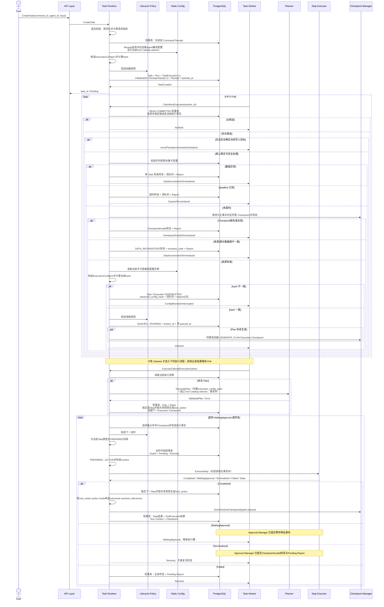
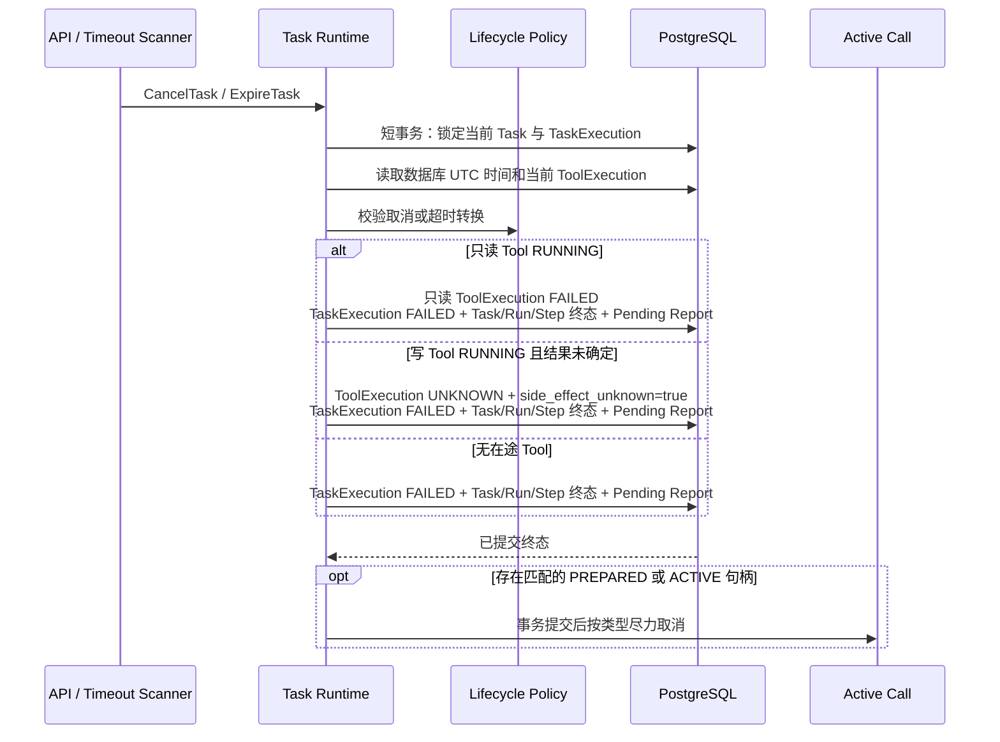
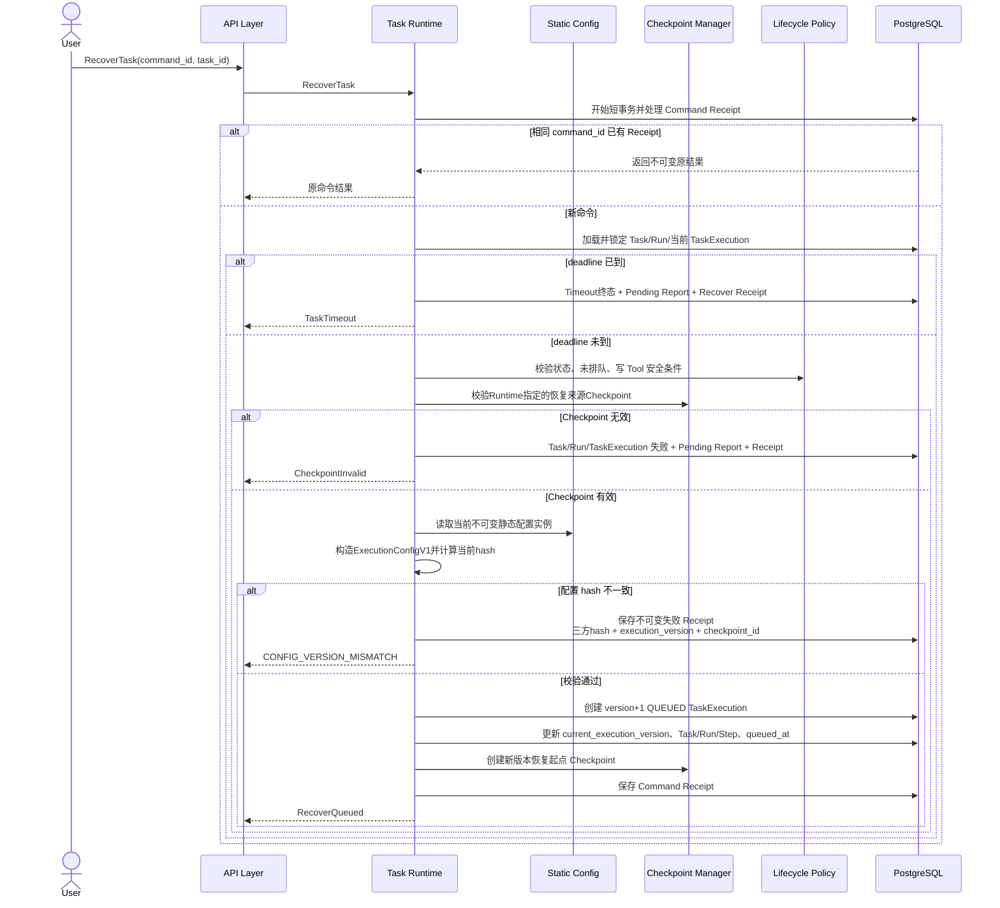
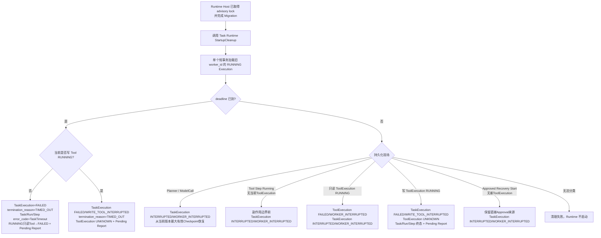
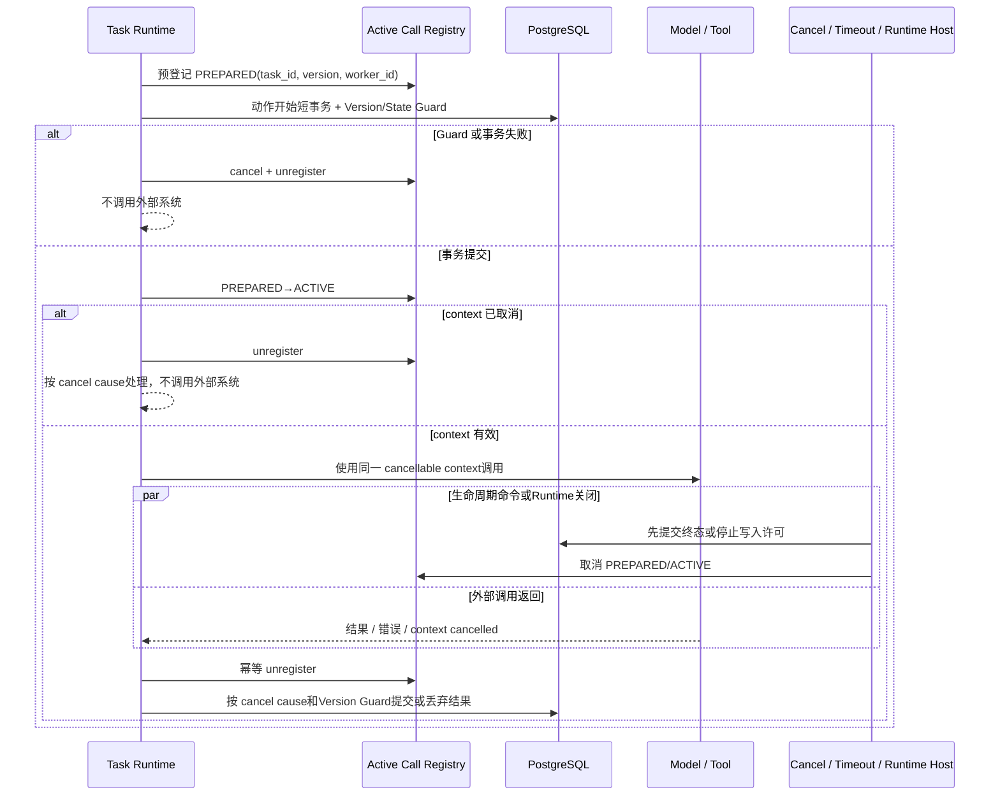
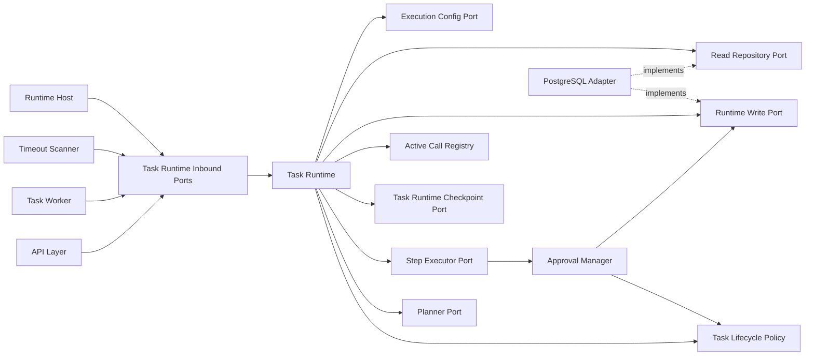
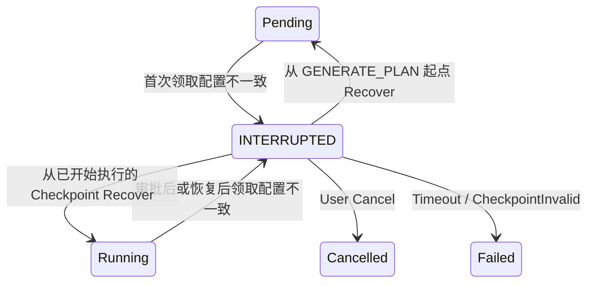
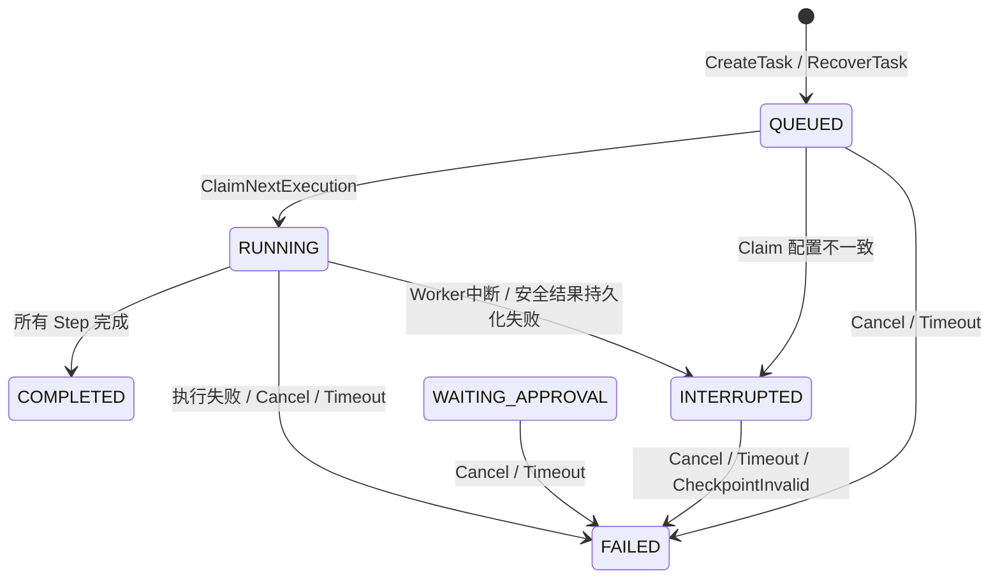

# Task Runtime 功能详细设计

| 属性 | 值 |
|---|---|
| 文档版本 | V1.19 |
| 文档状态 | MVP Design Review 阻塞项已修正；范围冻结 |
| 需求基线 | `docs/design/001-requirements.md` V3.5 |
| 架构基线 | `docs/design/003-system-architecture-design.md` V1.3 |
| 设计规则 | `docs/specs/005-detailed-design-guideline.md` |
| 共享契约 | `docs/design/002-shared-domain-contract.md` V1.1 |

本文档是当前 Task Runtime 模块的详细设计基线。早期整体草案中与 V3.5 需求、V1.3 架构或本文档冲突的 Task Runtime、Worker Activity Gate、恢复和上下文设计不再适用。

> 跨模块契约说明：公共状态/终态、错误字段语义、ExecutionScope、ExecutionConfigV1、execution_config_hash、共享Port类型及Owner以`docs/design/002-shared-domain-contract.md`为唯一规范来源。本文保留的同名表格、图和字段清单只说明Task Runtime如何构造、持久化或消费共享事实，不构成第二份类型/枚举定义；发生文字差异时必须回到共享契约，不得按本文局部副本实现。

> 类型约束：本文所有表示持久化 `execution_version`、`current_execution_version` 或 `source_execution_version` 的应用层字段统一使用共享 `ExecutionVersion`；可空来源使用 `*ExecutionVersion`。PostgreSQL 列保持 `BIGINT`。

## 1. 功能概述

### 1.1 功能目标

Task Runtime 是 Task 应用用例和单个 Task 执行链路的编排者，目标是：

- 以 PostgreSQL 中的 Task、Run、TaskExecution 和 `queued_at` 作为执行事实；
- 为 API、Task Worker、Timeout Scanner 和 Runtime Host 提供窄化的应用入口；
- 使用共享的 Task Lifecycle Policy 校验状态转换；
- 创建首次 TaskExecution，认领当前执行版本，并顺序驱动 Planner 与 Step Executor；
- 使用既有持久化事实判定领取来源，不新增 enqueue_reason；
- 在取消、超时、执行成功或失败时原子收敛业务状态并创建或确认唯一 Pending Report；
- 在 QUEUED 领取配置不一致时安全中断当前 Task 与 Execution，并创建唯一 Pending Report 占位；
- 将可安全终止的领取数据异常隔离为单 Task 失败，将无法安全确定写入目标的不变量损坏升级为 Runtime 致命错误；
- 对安全中断的执行提供显式、幂等且受 execution_config_hash 约束的人工恢复；
- 通过 execution_version Guard 拒绝旧 Worker、旧执行版本和迟到外部结果；
- 在 Runtime 启动时分类旧进程遗留的 RUNNING TaskExecution；
- 在Planner结果事务和Step结果事务中使用共享执行动作规则生成Checkpoint `next_action`，不在派发阶段动态推断；
- 保证所有数据库状态事务短小，任何模型或 Kubernetes 调用都在事务外执行。

### 1.2 使用场景

Task Runtime 覆盖以下场景：

1. User 创建 Task；
2. Task Worker 请求领取下一条 FIFO 待执行记录；
3. Worker 把已领取的 TaskExecution 交给 Runtime 执行；
4. Planner 首次生成不可变顺序 Plan；
5. Runtime 顺序推进 Step，直至 WaitingApproval 或业务终态；
6. User 取消 Pending、Running、WaitingApproval 或 INTERRUPTED Task；
7. Timeout Scanner 终止到期 Task；
8. User 对 INTERRUPTED TaskExecution 发起人工 Recover；
9. Runtime Host 在新进程启动时请求分类旧 worker_id 遗留执行；
10. 外部调用结果晚到、持久化失败或写 Tool 副作用未知时执行保守收尾。

### 1.3 涉及模块

| 模块 | 与 Task Runtime 的关系 |
|---|---|
| API Layer | 调用 Create、Cancel、Recover；负责认证、HTTP 校验和响应转换 |
| Task Worker | 只通过 Worker Use Case Port 请求领取和执行，不直接写业务状态 |
| Timeout Scanner | 提交到期候选或触发到期扫描，不直接终止 Task |
| Runtime Host | 在取得 advisory lock、完成 Migration 后触发启动清理 |
| Task Lifecycle Policy | 无状态校验 Task、Run、Step、TaskExecution 的合法转换 |
| Planner | 在事务外生成并校验唯一 Plan |
| Step Executor | 在事务外执行当前 Step，并返回结构化执行结果 |
| Approval Manager | 由 Step Executor 调用；独立拥有进入审批、Approve、Reject事务，以及这些入口在统一Guard通过并经共享Policy授权后的可安全归属CheckpointInvalid终态；不回调Task Runtime |
| Checkpoint Manager | 按 Task Runtime 指定的版本保存、加载和校验 Runtime Context；不判断领取来源，也不决定能否恢复 |
| Shared Step Reference Extractor | Task Runtime 使用共享纯函数构造待持久化规范引用；Checkpoint Manager与Step Executor复用同一提取规则 |
| Active Call Registry | Task Runtime进程内组件；保存单个执行版本的PREPARED/ACTIVE取消句柄，不作为持久化事实 |
| Report Manager / Repository | Runtime 创建唯一 Pending Report 或占位；Report Worker 仅在 Task 业务终态后独立生成内容 |
| Repository / Write Executor | 提供只读查询、持锁 connection 串行写事务和条件更新 |
| Config | 提供静态 Agent、Tool、模型语义配置及 execution_config_hash |

### 1.4 边界约束

Task Runtime 负责：

- Task 创建、领取、执行编排、取消、超时、恢复和启动清理；
- Runtime 所拥有命令的完整事务边界；
- 当前 execution_version 校验；
- 领取来源、Checkpoint 类型和 Claim 结果的用例决策；
- 执行成功或失败的统一终态收尾；
- 预登记本进程活动调用，并在生命周期命令提交后发出类型化尽力取消信号；
- 把已持久化事实转换为下一执行动作。
- 对每一个Step统一执行Active Call预登记和动作开始事务，再调用Step Executor进行输入解析、Model/Tool或Approval处理。

Task Runtime 不负责：

- Worker Poll 间隔、循环和执行槽管理；
- Runtime Instance advisory lock 的获取、监控和进程退出；
- HTTP、Bearer Token 或响应序列化；
- Planner、Model Client、Tool、Kubernetes Adapter 的内部实现；
- Approval Manager 所拥有的审批跨对象事务；
- 将领取来源、Task 恢复条件或状态迁移决策下放给 Checkpoint Manager；
- Report 内容生成；
- 自动恢复、自动接管、写 Tool 重放或 exactly-once；
- 定义第二套与 Task Lifecycle Policy 重复的状态规则。

Task Lifecycle Policy 是进程内纯规则组件，不是新服务或新持久化对象。除 Runtime 自有状态规则外，它提供 Approval Manager 共用的 `CanTerminalizeCheckpointInvalid(source, locked facts, db_now)`；任何审批入口的 CheckpointInvalid 终态都必须先通过 current execution_version、所有权、预期状态、deadline 等统一 Guard，再由该规则授权。本设计不改变单 Database、单 Runtime Instance、单 Task Worker 的 MVP 架构。

目标Step到`next_action`的映射复用共享契约第2.1节执行协议；Task Runtime是Planner结果事务和Step结果事务中的调用者及持久化Owner，不维护第二套映射。Checkpoint Manager、Worker和派发循环只消费该持久化结果，均不得重新推断或改写。

## 2. 业务流程

### 2.1 创建、领取与正常执行



正常流程的关键约束：

- Worker 只触发 Runtime 用例，不解释或推进 Task 状态；
- Claim 的业务结果固定为 Claimed、NoWork、ConfigMismatchInterrupted、CheckpointInvalidTerminalized、DataInconsistentTerminalized、ExpiredTerminalized；基础设施故障单独返回 error；
- Planner 和 Step Executor 调用均在数据库事务外；
- Runtime 每个动作前重新读取当前持久化事实；
- 所有Step路径都先预登记Active Call并提交动作开始事务；输入解析、Model/Tool调用和Approval准备均在此之后；
- Runtime派发只接受Checkpoint中已经持久化的`next_action`，不得依据Step风险在内存中动态改写；
- Runtime 只执行 Task.current_execution_version 指向的 TaskExecution；
- 首次或恢复后在 Plan 生成前成功领取时，领取事务创建当前版本的 GENERATE_PLAN Execution Checkpoint，保证 Planner 中断可安全恢复；
- Runtime 在 WaitingApproval 或业务终态后返回，Worker 随后释放执行槽；
- Approval Manager 返回 `CheckpointInvalidTerminalized` 时，Runtime只确认当前事实已经终态并返回Worker，不再次执行失败事务；
- Approval 通过只负责同版本重新排队，Worker 下一次 Poll 后再次进入 Runtime。

### 2.2 取消与超时



取消与超时通过同一个终态收敛机制实现，但业务结果不同：

- Cancel：Task=`Cancelled`，Run=`Failed/TaskCancelled`，TaskExecution=`FAILED`，termination_reason=`CANCELLED`；
- Timeout：Task=`Failed/TaskTimeout`，Run=`Failed/TaskTimeout`，TaskExecution=`FAILED`，termination_reason=`TIMED_OUT`；
- 两者都不创建新 execution_version；
- 两者都不等待已经进入 RUNNING 保守边界的写 Tool；
- RUNNING 只读 ToolExecution 进入 FAILED/TaskCancelled 或 FAILED/TaskTimeout，不能遗留 RUNNING，也不使用 UNKNOWN；
- 当前 TaskExecution 原有 CONFIG_VERSION_MISMATCH 和 observed_config_hash 必须保留，最终终止来源写入 termination_reason；
- 迟到结果只能通过条件提交，不能覆盖终态。

### 2.3 人工恢复



恢复只允许从 current_execution_version 对应的 INTERRUPTED TaskExecution 发起。恢复成功后：

- 旧 TaskExecution 保持 INTERRUPTED，作为历史执行尝试；
- 新 TaskExecution 的 execution_version 严格加一；
- 新 TaskExecution=`QUEUED`、worker_id 为空；
- Task.current_execution_version 与新版本在同一事务更新；
- Task/Run 根据来源 Checkpoint 的冻结 `next_action` 恢复到领取前状态：`GENERATE_PLAN` 起点恢复为 Pending/Pending，其他动作起点恢复为 Running/Running；同时清除 Task 上的 CONFIG_VERSION_MISMATCH；
- 中断 Step 保持 `Running`，由新版本继续同一业务 Step；
- 新版本拥有独立恢复起点 Checkpoint；
- Recover 配置失配的 Receipt 一经保存不可修改；恢复配置后必须使用新的 command_id；
- 已完成 Step 不重复执行；
- Worker 仅加载新版本 Checkpoint。

恢复起点分为两类：

- Initialization Checkpoint 仅允许用于 Task 尚未生成 Plan、未执行 Step、未调用 Model/Tool，且首次领取因 CONFIG_VERSION_MISMATCH 进入 INTERRUPTED 的场景；
- Task 一旦成功领取并开始执行，Recover必须使用当前版本checkpoint_sequence最大的有效Execution Checkpoint或Recovery Start Checkpoint；最大序号记录无效时禁止扫描或回退。

### 2.4 启动清理



启动清理只分类持久化现场：

- 不创建恢复 execution_version；
- 不写 `queued_at`；
- 不自动继续 INTERRUPTED Task；
- 不处理 Approval Manager 的命令；
- 已完整提交的WAITING_APPROVAL不属于RUNNING遗留执行，不进入本清理事务；
- Tool Step Running但不存在当前版本ToolExecution时仍位于副作用边界前，允许后续人工Recover；
- Approved Recovery Start且不存在新版本ToolExecution时保留Checkpoint中的直接Approval来源，按边界前安全中断处理；
- 分类只使用Step、最新Checkpoint、不可变Approval、Tool静态能力和ToolExecution等持久化事实，不依赖Active Call Registry；
- 不重置 Report 状态，Report 的 GENERATING→PENDING 由 Report Manager 的启动流程负责；
- 无法安全分类的数据异常必须使启动清理失败，避免服务在未知状态上继续执行。

### 2.5 外部调用派发与取消



Active Call Registry 只关闭进程内竞态：

- key 固定为 task_id、execution_version、worker_id；MVP 同一 TaskExecution 同时最多一个外部调用；
- value 保存 action_kind、可选 step_id/tool_execution_id、PREPARED/ACTIVE、cancellable context和取消函数；
- cancel cause 固定为 TASK_CANCELLED、TASK_TIMED_OUT、ACTION_TIMEOUT、RUNTIME_SHUTDOWN、LOCK_LOST；
- TASK_CANCELLED/TASK_TIMED_OUT 表示业务终态已经提交，Worker 不得重复收敛；
- ACTION_TIMEOUT 在数据库 Guard 仍有效时按 Model/Tool 调用失败处理；
- RUNTIME_SHUTDOWN/LOCK_LOST 禁止旧进程再提交结果，由下一实例启动清理；
- 句柄缺失不能证明外部请求未发出，尤其不能改变写 Tool的 UNKNOWN 规则。

## 3. 模块设计

### 3.1 模块定位

Task Runtime 位于应用层。驱动层只能调用它暴露的入站用例，Task Runtime 通过出站端口使用领域规则、持久化和相邻应用能力。



禁止形成以下依赖：

- Task Runtime → Task Worker；
- Approval Manager → Task Runtime；
- Task Runtime → Approval Manager；
- Repository → Task Runtime；
- Task Lifecycle Policy → Repository 或任意应用模块。

Step Executor 可以在执行高风险 Tool 时调用 Approval Manager；Task Runtime 只接收 `WaitingApproval` 结果，不参与或重复提交审批事务。

### 3.2 入站用例

| 用例 | 调用方 | 输入 | 输出 | 事务所有者 |
|---|---|---|---|---|
| `CreateTask` | API Layer | command_id、agent_id、task_input、operator_id | TaskCreated 或确定错误 | Task Runtime |
| `ClaimNextExecution` | Task Worker | worker_id | Claimed、NoWork、ConfigMismatchInterrupted、CheckpointInvalidTerminalized、DataInconsistentTerminalized、ExpiredTerminalized，或系统 error | Task Runtime |
| `ExecuteClaimedExecution` | Task Worker | ExecutionClaim、可取消 context | WaitingApproval、Terminal 或 Stale | Task Runtime 编排；动作局部事务按模块边界执行 |
| `CancelTask` | API Layer | command_id、task_id、operator_id | Cancelled 或确定错误 | Task Runtime |
| `RecoverTask` | API Layer | command_id、task_id、operator_id | RecoverQueued 或确定错误 | Task Runtime |
| `ExpireTask` | Timeout Scanner | task_id、observed_execution_version | Expired、Skipped 或 AlreadyTerminal | Task Runtime |
| `StartupCleanup` | Runtime Host | current_worker_id | CleanupSummary 或错误 | Task Runtime |

入站接口要求：

- 不接收 HTTP Request、数据库模型或 Kubernetes SDK 类型；
- 所有 ID、状态和错误使用应用层明确类型；
- 所有可推进状态的 Worker 请求携带 execution_version；
- `ExecutionClaim` 至少包含 task_id、run_id、execution_version 和 worker_id；
- `ExecuteClaimedExecution` 不接收可由数据库重新加载的 Plan、Step 或 Checkpoint 快照；
- Worker 不根据返回值自行写状态。

`ClaimNextExecution`的业务结果是封闭集合。Worker只对Claimed调用ExecuteClaimedExecution；NoWork按正常间隔轮询；其余四个已提交结果最多记录一条结构化应用日志后继续Poll，不新增持久化指标。数据库连接、事务提交、advisory lock或持锁连接异常必须返回系统error，触发Runtime Host关闭，不能伪装为业务结果。

### 3.3 出站端口

| 端口 | 最小职责 |
|---|---|
| Runtime Read Repository | 查询 Task、Run、当前 TaskExecution、Plan、Step、ToolExecution、Approval 和 Checkpoint 投影 |
| Runtime Write Executor | 在持有 advisory lock 的同一 connection 上串行执行短事务 |
| Runtime Transaction Repository | 在既有事务内锁定、创建和条件更新 Runtime 所拥有的数据 |
| Task Lifecycle Policy | 校验状态组合、命令和目标转换，不执行 I/O；共享 `CanTerminalizeCheckpointInvalid`，按入口、当前版本、所有权、预期状态和数据库时间授权审批入口的 CheckpointInvalid 终态 |
| Planner Port | 根据 Task 和静态能力生成已校验 PlanDraft；只允许一次结构修复 |
| Step Executor Port | 执行一个明确 Step，返回结构化 StepOutcome |
| Task Runtime Checkpoint Port | 提供SaveRuntimeCheckpoint、LoadLatestForClaim、LoadLatestForExecutionDispatch、ValidateRecoverySource、LoadLatestForStartupCleanup和CreateRecoveryStart窄方法；Checkpoint Manager在调用方事务内加载真实持久化事实，ToolExecution投影不含read_only且Manager不读取Registry；缺失统一返回CheckpointInvalid/CHECKPOINT_NOT_FOUND；不执行生命周期迁移、不创建Report、不递归遍历历史来源链 |
| Shared Step Reference Extractor | 按next_action action mode提取/规范化显式引用；Task Runtime是Checkpoint resolved_references的唯一构造Owner |
| Execution Config Port | 只读取并返回已经通过启动校验的强类型静态配置源；不规范化 JSON、不计算或比较 execution_config_hash |
| Database Clock | 在写事务中取得 PostgreSQL UTC 当前时间 |
| Pending Report Writer | 在 Task 终态事务或领取配置失配事务中确保存在唯一 Pending Report |

所有写端口必须共享调用方传入的事务上下文，不允许相邻模块自行开启嵌套事务。只读查询可以使用普通只读连接池；一旦读取结果用于状态推进，最终写事务必须重新锁定并校验相关事实。

#### 3.3.1 共享 ExecutionScope

> 唯一类型定义见共享契约第4节。本节只保留Task Runtime构造与Guard使用说明。

`ExecutionScope` 是 AgentOps 核心契约包中唯一的进程内执行关联值，Task Runtime 是唯一构造 Owner：

```go
type ExecutionConfigHash string

type ExecutionScope struct {
	TaskID              TaskID
	RunID               RunID
	ExecutionVersion    ExecutionVersion
	ExecutionConfigHash ExecutionConfigHash
	WorkerID            WorkerID
	StepID              StepID
	DeadlineAt          time.Time
}
```

`ExecutionConfigHash` 只能由 Task Runtime 的私有构造路径在 SHA-256 计算或持久化值格式校验成功后创建；其零值和空字符串非法。共享契约包不公开 hash 计算器。

| 字段 | 必填约束 | 唯一事实来源 |
|---|---|---|
| `task_id`、`run_id`、`step_id` | 非空且属于当前执行链 | 已重新锁定并校验的 Task、Run、Step |
| `execution_version` | 大于 0，等于 `Task.current_execution_version` | 已通过 Version Guard 的当前 TaskExecution |
| `execution_config_hash` | 非空，必须是 64 个小写十六进制字符 | 已通过当前配置、TaskExecution、当前最大 Checkpoint 三方门禁的 `TaskExecution.execution_config_hash` |
| `worker_id` | 非空，等于当前 Runtime Instance 对该 TaskExecution 的所有权 | 已通过 Worker Ownership Guard 的 TaskExecution |
| `deadline_at` | 非零数据库 UTC 时间 | 持久化 Task |

构造规则：

1. Task Runtime 使用当前 Runtime 已冻结的同一个不可变 `ExecutionConfigV1` 实例完成三方 hash 门禁；
2. 门禁通过后，从已验证的 `TaskExecution.execution_config_hash` 原样填入 `ExecutionScope.execution_config_hash`，不得在 Scope 构造时再次计算；
3. Task Runtime 以同一实例投影 StepExecutionRequest、AgentAuthorization 和 StaticToolDefinition；
4. Scope 创建失败、hash 缺失或格式非法表示持久化核心事实不满足执行条件，返回 Runtime Fatal `PersistenceInvariantViolation`，不得调用 Step Executor；
5. Scope 是按值传递的只读值；Step Executor、Tool Framework、Approval Manager 和 Checkpoint Manager均不得计算、补全、刷新或修改其中的 hash；
6. Scope 不替代外部调用前和结果提交时的数据库 Version/Ownership/State Guard。

### 3.4 ClaimResult

> 封闭分支见共享契约第2.3节；本节只说明Task Runtime为各分支提交的持久化事实。

`ClaimNextExecution` 返回封闭的业务结果联合类型；系统故障使用独立的 `error` 通道，不属于联合类型成员。

| 结果 | 最小载荷 | 语义 |
|---|---|---|
| `Claimed` | ExecutionClaim | 已成功领取；Worker 必须执行该 claim |
| `NoWork` | 无 | 当前没有候选；Worker 按正常 Poll 间隔继续 |
| `ConfigMismatchInterrupted` | task_id、execution_version、error_code、expected_config_hash、observed_config_hash、可选 checkpoint_config_hash | 配置失配现场已原子中断并出队 |
| `CheckpointInvalidTerminalized` | task_id、execution_version、error_code=`CheckpointInvalid`、reason_code | 当前必须存在的Checkpoint缺失或无效，已原子终止并出队 |
| `DataInconsistentTerminalized` | task_id、execution_version、error_code=`DATA_INCONSISTENT`、invariant_code | 可安全归属的数据异常已原子终止并出队 |
| `ExpiredTerminalized` | task_id、execution_version、error_code=`TaskTimeout` | 到期候选已原子终止并出队 |

`invariant_code` 只允许以下固定值：

- `CURRENT_EXECUTION_INVALID`；
- `QUEUE_STATE_INVALID`；
- `CLAIM_SOURCE_AMBIGUOUS`；
- `CROSS_OBJECT_STATE_INVALID`。

Checkpoint 错误不得进入 `invariant_code`：缺失固定为 `CHECKPOINT_NOT_FOUND`，其他损坏使用 Checkpoint Manager 的稳定 reason_code。Worker 不得把四种已处理业务结果转成 `NoWork`，也不得再次更新 Task、创建 Report 或修复数据。数据库连接失败、事务提交结果不确定、advisory lock/持锁连接异常和无法安全确定当前写入目标的 `PersistenceInvariantViolation` 返回系统 `error`，由 Runtime Host 停止服务。

### 3.5 ExecutionClaim

> 公共字段语义见共享契约第2.3节；本节只说明Task Runtime领取后的复核。

ExecutionClaim 是 Worker 与 Task Runtime 之间的短生命周期应用值，不持久化为新对象。

| 字段 | 含义 |
|---|---|
| task_id | 已领取 Task |
| run_id | 唯一 Run |
| execution_version | 本次领取的当前执行版本 |
| worker_id | 当前 Runtime Instance 标识 |
| claimed_at | PostgreSQL UTC 领取时间 |

`ExecuteClaimedExecution` 开始时必须重新校验：

- Task.current_execution_version 等于 claim.execution_version；
- 对应 TaskExecution=`RUNNING`；
- TaskExecution.worker_id 等于 claim.worker_id；
- Task/Run 处于允许执行的状态；
- `queued_at` 为空；
- deadline 尚未到达。

任一条件不满足时不得调用 Planner、Model 或 Tool。

### 3.6 StepOutcome

> 封闭分支见共享契约第2.2节；本节只说明Task Runtime如何消费结果。

Step Executor 只向 Runtime 返回以下语义结果：

| Outcome | 含义 | Runtime 行为 |
|---|---|---|
| `Completed` | 外部动作有确定结果，结果已完成安全处理 | 条件保存 Step/ToolExecution、Run Context 和下一 Checkpoint |
| `WaitingApproval` | Approval Manager 已原子提交等待审批现场 | 停止执行并返回 Worker |
| `Terminalized` | Approval Manager 已原子提交 Task 级 CheckpointInvalid 终态和 Pending Report | 重新读取确认终态后返回 Worker；不得再次执行 Runtime 失败事务 |
| `Failed` | 动作明确失败，或写 Tool 结果未知且不能继续 | 按错误分类执行 Runtime 终态事务 |
| `Stale` | 当前 execution_version、状态或 worker_id 已不再允许接收结果 | 丢弃结果，不推进状态 |

`Completed` 只能携带结构化、限长和脱敏后的结果；不得携带用于持久化的原始 Model 或 Tool 响应。

### 3.7 进程内活动调用控制

Task Runtime 内部维护最小 Active Call Registry：

| 项目 | 设计 |
|---|---|
| key | task_id、execution_version、worker_id |
| value | action_kind、可选 step_id/tool_execution_id、PREPARED/ACTIVE、context、cancel |
| 并发约束 | 同一 key 同时只能有一个句柄；重复登记是进程内不变量错误，不允许并行调用 |
| 登记时机 | 动作开始事务前登记 PREPARED |
| 激活时机 | 动作开始事务成功后执行 PREPARED→ACTIVE |
| 注销时机 | 调用完成、事务失败或取消后幂等注销 |

外部客户端必须使用 Registry 中的同一 context，不得派生脱离该 context 的请求。Cancel、Timeout 在业务终态提交后取消 PREPARED 和 ACTIVE；Runtime Host 在关闭或失锁时取消全部活动调用。Registry 不是状态事实、Worker Ownership、Lease、队列或恢复依据，进程崩溃后只按数据库现场分类。

写 Tool进入 ToolExecution=RUNNING 后仍处于未知副作用保守边界。即使本地 context取消，也不能证明 Kubernetes 未收到请求，不能据此重试或把 UNKNOWN 降级为普通失败。

### 3.8 共享执行动作协议

> `CheckpointNextAction`枚举、生成规则和Owner见共享契约第2.1节；本节只描述Runtime事务落点。

Task Runtime、Step Executor和Approval Manager共享《跨模块共享领域契约》第2.1节定义的唯一`next_action`生成规则；Checkpoint Manager只消费冻结结果并验证持久化后果：

| 已锁定的目标Step与审批事实 | 持久化next_action |
|---|---|
| ModelCall、Analysis、Verification | `EXECUTE_STEP` |
| Low且read_only的ToolCall | `EXECUTE_STEP` |
| High且write的ToolCall，尚无同一冻结动作的Approved Approval | `REQUEST_APPROVAL` |
| High且write的ToolCall，当前Checkpoint直接引用同一Approved Approval | `EXECUTE_APPROVED_TOOL` |

该规则是无状态共享协议，不是新的服务。Task Runtime仅在持锁短事务中，对已经锁定且验证过的首Step或下一Step调用它并保存结果；Approval Manager Approve事务对已批准动作写入`EXECUTE_APPROVED_TOOL`；Recover事务复制并验证来源动作。派发主循环、Worker、Step Executor和Checkpoint Manager不得在读取后动态推断、降级或覆盖`next_action`。

Step Executor返回`NEXT_STEP(step_id)`时，它只表达目标位置，不是可直接持久化的`next_action`。Task Runtime必须在结果事务中锁定该Step，并从计算当前TaskExecution.execution_config_hash的同一不可变`ExecutionConfigV1.tool_framework.tools`读取Tool capability的risk_level/read_only，结合直接审批事实调用共享规则；Step持久化投影不包含risk_level/read_only，Checkpoint Manager也不重算该映射。无法唯一映射时整体回滚，不创建Checkpoint。

同一 Planner 结果或 Step 结果事务中，Task Runtime按next_action调用共享`StepReferenceExtractor`：EXECUTE_STEP、REQUEST_APPROVAL、EXECUTE_APPROVED_TOOL使用TARGET_STEP_INPUT并对目标Step.input提取；GENERATE_PLAN、FINALIZE_RUN使用NO_STEP_INPUT并固定保存空数组，FINALIZE_RUN不重算已完成Step.input。Task Runtime是该持久化列表的唯一构造Owner；Approval Manager只能沿用已验证绑定，Checkpoint Manager按同一mode校验，Step Executor只做运行期复核与值解析。

## 4. 数据设计

### 4.1 核心实体

Task Runtime 直接编排以下持久化实体：

| 实体 | Runtime 使用的关键字段 |
|---|---|
| Task | task_id、agent_id、input、status（含 INTERRUPTED）、current_run_id、current_execution_version、deadline_at、queued_at、result_summary、error_code、started_at、ended_at |
| Run | run_id、task_id、status、plan_id、current_step_id、context、error_code、started_at、ended_at |
| TaskExecution | task_execution_id、task_id、execution_version、worker_id、status、execution_config_hash、observed_config_hash、error_code、invariant_code、termination_reason、started_at、ended_at |
| Plan | plan_id、run_id、goal、created_at |
| Step | step_id、run_id、sequence、type、status、input、output、output_schema、tool_name、error_code、started_at、ended_at |
| ToolExecution | task_id、run_id、step_id、execution_version、status、side_effect_unknown、error_code、started_at、ended_at |
| Checkpoint | checkpoint_id、task_id、run_id、execution_version、checkpoint_sequence、runtime_context、execution_config_hash、source_execution_version、source_checkpoint_id、created_at |
| Report | task_id、run_id、status、created_at |
| Command Receipt | command_id、command_type、target_id、request_fingerprint、response、created_at |
| TaskLog | task_id、run_id、step_id、可选 execution_version、event、message、operator、created_at |

Task Runtime 不复制 Task、Run、Plan 或 Step 来表达恢复。ToolExecution、Checkpoint 和 Approval 必须关联 execution_version。

MVP不提供独立RecoverabilityView接口。现有Task查询只派生`recoverable`布尔值：Task为Running或INTERRUPTED、当前TaskExecution为INTERRUPTED、queued_at为空、deadline未到、没有RUNNING/UNKNOWN写Tool、当前版本最大Checkpoint有效且三方hash一致时为true，否则为false。该字段仅供UI提示，RecoverTask仍在事务内权威重校验；不返回诊断码或解释模型。

### 4.2 关键唯一性与一致性约束

| 约束 | 目的 |
|---|---|
| Task 内 `(task_id, execution_version)` 唯一 | 每个版本只有一个 TaskExecution |
| Task.current_execution_version 必须指向已有 TaskExecution | 当前执行事实可被条件更新 |
| 一个 Task 只有一个 Run | 符合 MVP 单 Run |
| 一个 Run 只有一个 Plan | 防止恢复或重试生成第二个 Plan |
| Step 的 `(run_id, sequence)` 唯一且连续 | 保证严格顺序执行 |
| Checkpoint 的 `(run_id, checkpoint_sequence)` 唯一 | 保证 Run 内严格递增 |
| Report.task_id 唯一 | 配置失配占位与后续终态竞争只创建一个 Report |
| Command Receipt.command_id 唯一 | 命令幂等 |
| observed_config_hash 非空时 error_code=CONFIG_VERSION_MISMATCH，且状态为 INTERRUPTED 或后续 FAILED | 失配证据与状态一致 |
| invariant_code为空，或error_code=DATA_INCONSISTENT且值属于四个固定代码 | 防止审计原因漂移或与CheckpointInvalid混用 |

跨表状态组合不能只依赖数据库约束，必须由同一事务内的条件更新和 Task Lifecycle Policy 共同保证。

Checkpoint 不新增 checkpoint_kind，使用以下结构不变量区分：

| 类型 | 唯一判定 |
|---|---|
| Initialization Checkpoint | Task 创建事务产生；execution_version=1、checkpoint_sequence=1、next_action=GENERATE_PLAN、source_*为空 |
| Recovery Start Checkpoint | Recover 事务为新 execution_version 创建；source_execution_version和source_checkpoint_id均非空 |
| Execution Checkpoint | 成功领取或执行确定边界创建；source_*为空，且不是 Initialization Checkpoint |

Checkpoint 在 Run 内按 checkpoint_sequence 全局严格递增且创建后不可修改。查询“最新 Checkpoint”必须先选择当前 execution_version 下 sequence 最大的记录，再验证该记录；不得通过过滤无效记录或向前扫描实现回退。

Checkpoint `resolved_references` 使用共享契约第7.4节的线协议和最多256条限制。Task Runtime在Planner结果或Step结果事务中按冻结next_action选择action mode：TARGET_STEP_INPUT时锁定目标Step和紧邻前序Step并生成canonical列表；NO_STEP_INPUT时固定为空且不读取Step.input。Checkpoint Manager按相同mode校验。绑定遗漏、额外、重复、非法路径、超限或非规范排序均为`CheckpointInvalid`稳定reason，不属于DATA_INCONSISTENT。Approval事务只沿用已验证绑定，Recover只通过ValidatedRecoverySource复制。

恢复位置为`EXECUTE_APPROVED_TOOL`时，Recovery Start Checkpoint允许直接引用较早execution_version中不可变的Approved Approval。当前版本必须自包含执行所需事实：

- Recover事务校验来源Checkpoint直接引用的Approval与Task、Run、Step一致且状态为Approved；
- Recover事务校验持久化 `Approval.execution_config_hash=来源Checkpoint.execution_config_hash=来源TaskExecution.execution_config_hash`；Approval hash 不从进程内 FrozenToolRequest 或当前配置补全；
- 来源Checkpoint中的approval_id、冻结Tool输入和resourceVersion必须与Approval完全一致；
- Recover事务把相同approval_id、冻结Tool输入和resourceVersion写入新版本Recovery Start Checkpoint的Runtime Context，并记录直接source_execution_version/source_checkpoint_id；
- 新Recovery Start Checkpoint提交后即为当前版本完整执行起点，Worker不读取或递归遍历更早Checkpoint；
- Worker只校验当前版本最大Checkpoint、其直接引用的不可变Approved Approval、冻结参数、resourceVersion和当前持久化事实；
- 不复制、不重新创建、不重新审批Approval；恢复后实际执行产生的ToolExecution必须属于新的execution_version。

### 4.3 execution_config_hash

> `ExecutionConfigV1`、规范化、hash算法、三方门禁及Catalog证据边界的唯一契约见共享契约第5节。以下展开保留为Task Runtime生产实现说明；不得被其他模块作为独立类型或编码规范引用。

#### 4.3.1 唯一 Owner 与共享类型

`ExecutionConfigV1` 是 MVP 唯一的执行语义配置线协议。Task Runtime 是以下动作的唯一 Owner：

1. 从已经完成启动校验的静态配置构造 `ExecutionConfigV1`；
2. 补齐共享强类型默认值；
3. 校验字段、版本、排序和空值约束；
4. 生成规范化 JSON；
5. 计算并持久化 `execution_config_hash`；
6. 从同一个不可变 `ExecutionConfigV1` 实例投影 PlannerRequest（含已门禁的hash和该Agent的Tool Catalog selector）、共享 `ExecutionScope`、StepExecutionRequest、AgentAuthorization、Tool Definition、Checkpoint 和 Approval 所需事实。

`ExecutionConfigV1` 作为 AgentOps 共享只读值类型放在不依赖 Task Runtime 应用服务的核心契约包中，避免 Planner、Step Executor 或 Tool Framework 反向依赖 Task Runtime 实现包；该包只声明类型和只读投影，不提供公开 hasher。构造器、默认值应用、规范化编码器和 SHA-256 实现仅属于 Task Runtime。其他模块可以引用共享类型或其强类型子投影，但不能取得第二个计算入口。

Planner、Step Executor、Tool Framework、Checkpoint Manager 和 Approval Manager只能引用该共享类型及Task Runtime给出的不可变投影，禁止：

- 自行计算hash，或在没有已冻结Port/Guard契约时自行增加比较规则；允许按共享契约对Task Runtime提供的两个hash证据执行纯字节相等校验；
- 在局部文档追加hash输入字段；
- 维护私有默认值、字段顺序或JSON规范化实现；
- 用文档版本号代替`ExecutionConfigV1`中的显式契约版本；
- 从相同hash反向推导不存在的完整配置。

完整 `execution_config_hash` 与 Planning Tool Catalog 证据必须分离：

- 每个静态 Agent 分别拥有一个不可变 `ExecutionConfigV1`；agent_id、system instruction、model、allowed_tools 或其他执行语义任一不同，完整 execution_config_hash 即可不同；
- Task Runtime在首次TaskExecution创建及Recover创建新TaskExecution时，仍按既有规则计算并持久化完整execution_config_hash；Planner、Step Executor、Tool Framework和Approval只接收既有值，不追加字段或重新计算；
- Planning Tool Catalog 不接收、不保存、不比较完整 execution_config_hash，也不以它选择 Registry；
- Tool Framework 为每个静态 Catalog 维护独立 `catalog_id`、`registry_version` 和按 Agent 允许集合生成的 `catalog_snapshot_hash`；
- Runtime 启动装配时，从同一静态 Agent 配置取得其 `catalog_id + allowed_tools`，由 Tool Framework 现有静态 Registry Loader 生成并冻结 `expected_registry_version + expected_snapshot_hash`，形成该 Agent 的 `PlanningToolCatalogSelector`；这不是运行期新增 Port；
- Task Runtime 只把已冻结 selector 投影到 PlannerRequest，不计算 catalog_snapshot_hash；该 hash 不是 TaskExecution、Checkpoint 或 Approval 的 execution_config_hash 替代品；
- 多个 Agent 可以引用同一 catalog_id，也可以引用不同 catalog_id；共享 Catalog 且 allowed_tools 相同的 Agent 可以得到同一 PlanningToolSnapshot，即使它们的完整 execution_config_hash 因Prompt或Model不同而不同；
- Catalog 的版本或内容漂移只由 Planning Tool Catalog Port 的独立证据检测；Claim、Recover、Checkpoint 仍只使用完整 execution_config_hash 三方门禁。

强类型顶层结构及字段顺序固定为：

```go
type ExecutionConfigV1 struct {
	Schema        string
	Version       uint32
	Agent         AgentExecutionConfigV1
	Model         ModelExecutionConfigV1
	JSON          JSONExecutionContractV1
	Safety        SafetyExecutionContractV1
	Planner       PlannerExecutionConfigV1
	StepExecutor  StepExecutorExecutionConfigV1
	ToolFramework ToolFrameworkExecutionConfigV1
	Checkpoint    CheckpointExecutionConfigV1
	Approval      ApprovalExecutionConfigV1
}
```

`schema`固定为字符串`agentops.execution-config`，`version`固定为无符号整数`1`。出现未知字段、缺失字段或不支持版本时Runtime启动失败，不允许忽略。

#### 4.3.2 字段集合与固定顺序

下表中的顺序同时是结构字段顺序和规范化JSON成员输出顺序。

| 对象 | 按顺序排列的字段及类型 |
|---|---|
| `agent` | `agent_id:string`、`enabled:bool`、`system_instruction:string`、`allowed_tools:[]string`、`max_steps:uint32` |
| `model` | `model_name:string`、`stream:bool`、`response_format:string`、`model_client_contract_version:string`、`generation_params_schema_version:uint32`、`generation_params:GenerationParams` |
| `generation_params` | `temperature:CanonicalDecimalV1`、`top_p:CanonicalDecimalV1`、`max_output_tokens:uint32` |
| `json` | `canonicalization_version:string`、`max_depth:uint32`、`max_object_fields:uint32`、`reject_duplicate_keys:bool`、`reject_null:bool` |
| `safety` | `sanitization_rule_version:string`、`safe_summary_max_bytes:uint32`、`log_string_max_bytes:uint32` |
| `planner` | `contract_version:string`、`plan_schema_version:uint32`、`non_tool_input_contract_version:string`、`tool_schema_subset_version:string`、`repair_policy_version:string`、`allowed_step_types:[]StepType`、`final_step_type:StepType`、`sequence_start:uint32`、`requires_contiguous_sequence:bool`、`max_repairs:uint32`、`limits:PlannerLimitsV1` |
| `step_executor` | `contract_version:string`、`step_input_contract_version:string`、`reference_protocol_version:string`、`reference_action_mode_version:string`、`output_schema_version:string`、`limits:StepExecutorLimitsV1` |
| `tool_framework` | `contract_version:string`、`result_contract_version:string`、`tools:[]ToolDefinitionV1`、`access_policy:ToolAccessPolicyV1`、`result_limits:ToolResultLimitsV1`、`event_policy:EventPolicyV1`、`patch_policy:PatchPolicyV1` |
| `checkpoint` | `contract_version:string`、`runtime_context_schema_version:uint32`、`resolved_reference_protocol_version:string`、`action_mode_version:string`、`max_resolved_references_per_step:uint32`、`max_target_path_depth:uint32` |
| `approval` | `policy_version:string`、`required_risk_level:RiskLevel`、`required_read_only:bool`、`freeze_resource_version:bool` |

限制结构的字段顺序固定为：

| 对象 | 按顺序排列的字段 |
|---|---|
| `PlannerLimitsV1` | `max_task_input_bytes`、`max_agent_prompt_bytes`、`max_tool_description_bytes`、`max_tool_schema_bytes`、`max_planning_tools`、`max_initial_prompt_bytes`、`max_repair_prompt_bytes`、`max_model_response_bytes`、`max_plan_steps`、`max_plan_draft_bytes`、`max_step_name_bytes`、`max_goal_bytes`、`max_step_input_bytes`、`max_resolved_references_per_step`、`max_output_fields`、`max_output_field_name_bytes`、`max_validation_issues`、`max_repair_candidate_summary_bytes`、`planner_model_call_timeout_ms`、`repair_min_model_budget_ms`、`planner_local_safety_margin_ms`；全部为`uint64` |
| `StepExecutorLimitsV1` | `max_resolved_step_input_bytes`、`max_step_output_bytes`、`max_model_prompt_bytes`、`max_model_response_bytes`、`max_resolved_references_per_step`、`max_target_path_depth`；全部为`uint64` |
| `ToolDefinitionV1` | `name:string`、`enabled:bool`、`description:string`、`capability_kind:ToolCapabilityKind`、`input_schema:CanonicalJSONSchema`、`output_schema:CanonicalJSONSchema`、`risk_level:RiskLevel`、`read_only:bool`、`timeout_ms:uint64` |
| `ToolAccessPolicyV1` | `clusters:[]ClusterPolicyV1`、`replicas_policy:ReplicasPolicyV1`、`image_registry_allowlist:[]string` |
| `ClusterPolicyV1` | `cluster_id:string`、`namespaces:[]string`、`resources:[]ResourcePolicyV1` |
| `ResourcePolicyV1` | `kind:string`、`verbs:[]string`、`write_fields:[]string` |
| `ReplicasPolicyV1` | `enabled:bool`、`min:int64`、`max:int64`；disabled时固定`min=0,max=0` |
| `ToolResultLimitsV1` | `raw_response_max_bytes:uint64`、`safe_dto_max_bytes:uint64`、`pod_page_limit:uint32`、`event_page_limit:uint32`、`container_log_default_lines:uint32`、`container_log_max_lines:uint32` |
| `EventPolicyV1` | `version:string`、`sort_keys:[]EventSortKey`、`candidate_budget_bytes:uint64`、`reserve_bytes:uint64`、`follow_continue:bool` |
| `PatchPolicyV1` | `version:string`、`response_classification_version:string`、`resource_version_test_required:bool`、`allowed_write_fields:[]string` |

`CanonicalDecimalV1` 是 AgentOps 共享 Model Client 契约中的有限十进制值对象，不是任意 JSON number 或模块私有 `float`：逻辑值由十进制 coefficient 与非负 scale 表示，构造时去除小数尾随零；零统一为 coefficient=0、scale=0，禁止负零。编码时输出不带指数的最短十进制 JSON number。`temperature` 与 `top_p` 的范围仍以共享 `GenerationParams` 契约为准。Planner、Step Executor 和 Model Adapter 只能消费规范化值，不能用二进制浮点重新生成 hash 输入。

`CanonicalJSONSchema` 是 Planner 第 4.7 节受限 Schema 的强类型递归值，不是任意 `map[string]any`。每个节点的 `type` 必填；对象节点把省略的 `additionalProperties` 规范化为 `false` 并显式编码，把无 required 成员规范化为 `[]`；`properties` 的键和 `required` 成员按 UTF-8 字节升序；数组节点只允许一个强类型 `items`；`nullable=false` 和空 `description` 采用规范化省略，`nullable=true` 与非空 `description` 显式编码。其他关键字、重复成员和 `null` 在 Runtime 启动时拒绝。Schema 节点最终按 UTF-8 键序编码，因此同一合法 Schema 只有一组字节。

固定版本与限制必须覆盖：

- Planner线协议、Plan Schema、非Tool输入、Tool Schema子集、一次Repair及全部Plan接受限制；
- Step输入协议、`step.output.xxx`引用协议、action mode、OutputSchema和JSON深度/字段/字节限制；
- 每个Tool的enabled、Schema、risk、read_only和timeout；
- Tool原始响应与安全DTO限制、Pod/Event单页限制、Log行数限制；
- Event有界排序键、960 KiB候选预算、64 KiB reserve和不跟随continue规则；
- Patch三分支最终状态分类、resourceVersion test和允许写字段；
- 脱敏规则、safe_summary、日志字符串限制和Tool Framework结果契约版本；
- Checkpoint Runtime Context、resolved_references与action mode版本；
- Approval风险、只读和resourceVersion冻结策略。

#### 4.3.3 空值、集合与JSON规范化

构造和编码规则固定为：

1. 除上一节明确规定内部可省略关键字的 `CanonicalJSONSchema` 外，`ExecutionConfigV1` 的所有结构字段必填，禁止`null`，禁止省略字段；不支持的可选语义必须通过显式`false`、`0`、空数组`[]`或版本化枚举表示；
2. schema允许的空集合必须编码为`[]`，不得用`null`或缺失字段替代；必填标识、版本、描述和system instruction禁止空字符串；
3. 字符串必须是合法UTF-8，保留原始Unicode标量、大小写和业务空白，不执行trim、NFC/NFKC或与语义无关的折叠；
4. `allowed_tools`、`allowed_step_types`、`tools`、cluster、namespace、resource、verb、write field、registry allowlist和JSON Schema中的`required`均去重并按UTF-8字节升序排列；Tool按`name`、cluster按`cluster_id`、resource按`kind`排序；
5. `event_policy.sort_keys`是有业务顺序的数组，保持声明顺序，不按字典序重排；
6. 普通对象严格按第4.3.2节声明顺序输出；`CanonicalJSONSchema`中的动态object key按UTF-8字节升序输出；
7. JSON使用UTF-8、无BOM、无缩进、无成员间空白、无结尾换行；仅按JSON要求转义双引号、反斜线和控制字符，其余Unicode直接编码为UTF-8；
8. bool只编码`true/false`；整数使用不带前导零的十进制；有限decimal使用最短无损十进制，禁止`NaN`、`Infinity`、`-0`和指数形式；
9. `GenerationParams`默认值、范围和类型由共享Model Client契约定义，但只能由Task Runtime配置加载阶段规范化一次；其他模块不得补默认值；
10. 任何排序、默认值、版本或编码不满足本节时拒绝Runtime启动，禁止“尽力计算”hash。

#### 4.3.4 Hash算法与编码

- 输入：第4.3.3节生成的完整`ExecutionConfigV1`规范化JSON字节；
- 算法：SHA-256；
- 输出：32字节摘要编码为64个ASCII小写十六进制字符；
- 字段：数据库`execution_config_hash`只保存摘要，不加`sha256:`前缀；
- 比较：按完整64字符精确比较，不做大小写转换、截断或base64解码；
- 敏感信息：API Key、Bearer Token、模型/Kubernetes endpoint、TLS/DNS、Kubernetes凭证、日志级别、advisory lock key、连接存活参数和关闭宽限期不进入`ExecutionConfigV1`。

#### 4.3.5 固定测试向量

跨模块契约测试使用以下规范化JSON字节；代码块中的内容没有BOM和结尾换行：

```json
{"schema":"agentops.execution-config","version":1,"agent":{"agent_id":"agent-default","enabled":true,"system_instruction":"You are AgentOps.","allowed_tools":["k8s.get_deployment"],"max_steps":20},"model":{"model_name":"deepseek-chat","stream":false,"response_format":"json_object","model_client_contract_version":"model-client-v1","generation_params_schema_version":1,"generation_params":{"temperature":0.2,"top_p":1,"max_output_tokens":4096}},"json":{"canonicalization_version":"agentops-json-v1","max_depth":16,"max_object_fields":64,"reject_duplicate_keys":true,"reject_null":true},"safety":{"sanitization_rule_version":"result-sanitization-v1","safe_summary_max_bytes":512,"log_string_max_bytes":256},"planner":{"contract_version":"planner-v1.3","plan_schema_version":1,"non_tool_input_contract_version":"non-tool-input-v1","tool_schema_subset_version":"tool-schema-subset-v1","repair_policy_version":"single-repair-v1","allowed_step_types":["Analysis","ModelCall","ToolCall","Verification"],"final_step_type":"Verification","sequence_start":1,"requires_contiguous_sequence":true,"max_repairs":1,"limits":{"max_task_input_bytes":16384,"max_agent_prompt_bytes":32768,"max_tool_description_bytes":4096,"max_tool_schema_bytes":65536,"max_planning_tools":32,"max_initial_prompt_bytes":262144,"max_repair_prompt_bytes":393216,"max_model_response_bytes":1048576,"max_plan_steps":20,"max_plan_draft_bytes":262144,"max_step_name_bytes":128,"max_goal_bytes":2048,"max_step_input_bytes":32768,"max_resolved_references_per_step":256,"max_output_fields":32,"max_output_field_name_bytes":64,"max_validation_issues":32,"max_repair_candidate_summary_bytes":65536,"planner_model_call_timeout_ms":60000,"repair_min_model_budget_ms":15000,"planner_local_safety_margin_ms":2000}},"step_executor":{"contract_version":"step-executor-v1","step_input_contract_version":"step-input-v1","reference_protocol_version":"step-output-ref-v1","reference_action_mode_version":"reference-action-mode-v1","output_schema_version":"output-schema-v1","limits":{"max_resolved_step_input_bytes":1048576,"max_step_output_bytes":1048576,"max_model_prompt_bytes":262144,"max_model_response_bytes":1048576,"max_resolved_references_per_step":256,"max_target_path_depth":16}},"tool_framework":{"contract_version":"tool-framework-v1","result_contract_version":"tool-framework-result-v1","tools":[{"name":"k8s.get_deployment","enabled":true,"description":"Get one Deployment.","capability_kind":"K8S_GET_DEPLOYMENT","input_schema":{"additionalProperties":false,"properties":{"cluster":{"type":"string"},"deployment":{"type":"string"},"namespace":{"type":"string"}},"required":["cluster","deployment","namespace"],"type":"object"},"output_schema":{"additionalProperties":false,"properties":{"name":{"type":"string"}},"required":["name"],"type":"object"},"risk_level":"Low","read_only":true,"timeout_ms":30000}],"access_policy":{"clusters":[{"cluster_id":"prod","namespaces":["default"],"resources":[{"kind":"Deployment","verbs":["get"],"write_fields":[]}]}],"replicas_policy":{"enabled":false,"min":0,"max":0},"image_registry_allowlist":[]},"result_limits":{"raw_response_max_bytes":1048576,"safe_dto_max_bytes":1048576,"pod_page_limit":200,"event_page_limit":200,"container_log_default_lines":200,"container_log_max_lines":1000},"event_policy":{"version":"bounded-event-page-v1","sort_keys":["event_time_desc","namespace_asc","name_asc","uid_asc"],"candidate_budget_bytes":983040,"reserve_bytes":65536,"follow_continue":false},"patch_policy":{"version":"deployment-patch-v1","response_classification_version":"patch-final-status-v1","resource_version_test_required":true,"allowed_write_fields":["image","replicas"]}},"checkpoint":{"contract_version":"checkpoint-v1.3","runtime_context_schema_version":1,"resolved_reference_protocol_version":"step-output-ref-v1","action_mode_version":"checkpoint-action-mode-v1","max_resolved_references_per_step":256,"max_target_path_depth":16},"approval":{"policy_version":"approval-policy-v1","required_risk_level":"High","required_read_only":false,"freeze_resource_version":true}}
```

期望SHA-256小写十六进制：

```text
27f26b3d37da75facddaca5b9cbc23de91093977d75746fb5c53a0d92d257f43
```

Task Runtime的生产实现、配置加载器测试以及Planner、Step Executor、Tool Framework、Checkpoint、Approval的契约测试必须复用同一fixture。其他模块不实现第二个hash计算器；它们通过fixture断言收到的不可变投影和Task Runtime输出hash匹配。

Task 创建时把 hash 同时保存到 TaskExecution v1 和 Initialization Checkpoint；后续 Execution/Recovery Start Checkpoint 保存所属 TaskExecution 的相同 hash。所有 QUEUED TaskExecution 都必须先通过领取门禁：

- 当前配置hash只允许由Task Runtime对当前不可变`ExecutionConfigV1`计算；
- 首次领取比较TaskExecution.execution_config_hash、Initialization Checkpoint.execution_config_hash和当前`ExecutionConfigV1` hash；Initialization Checkpoint 的结构违反创建不变量时按 `CheckpointInvalid`，hash值不相等时按`CONFIG_VERSION_MISMATCH`；
- 非首次领取比较 TaskExecution、当前版本 sequence 最大且验证通过的 Checkpoint 与当前`ExecutionConfigV1` hash三者；
- Recover 创建新版本前比较旧 TaskExecution、恢复来源 Checkpoint和当前`ExecutionConfigV1` hash三者；
- 三方必须完全相等；禁止先比较其中两方、创建版本后再补校验。

领取 hash 不匹配时，原 execution_config_hash 不变，observed_config_hash 首次写入当前配置 hash。Checkpoint 已持久化自己的基线 hash，因此无需复制到 TaskExecution。

hash一致不替代执行时授权。每次Tool调用仍必须按当前凭证执行RBAC检查，并再次校验Tool enabled、cluster、namespace、resource kind、verb、写字段和Registry allowlist；任一不允许都不得调用外部系统。

### 4.4 Command Receipt

Task Runtime 为 Create、Cancel 和 Recover 命令保存 Receipt：

- request_fingerprint 使用去除 Bearer Token 后的规范化命令字段计算 SHA-256；
- response 只保存重放 API 结果所需的脱敏结构化字段；
- 成功结果和确定性业务拒绝都保存 Receipt；
- 数据库连接错误、事务未提交等不确定基础设施失败不保存 Receipt；
- Receipt 与业务变更在同一事务提交；
- 同 command_id、同指纹返回已保存结果；
- 同 command_id、不同 command_type、target_id 或指纹返回冲突；
- MVP 不自动清理 Receipt。

确定性失败 Receipt 不包含原始异常、堆栈、凭证或外部响应。

各命令保存的最小响应字段：

| command_type | 成功响应 | 确定失败响应 |
|---|---|---|
| Create | task_id、run_id、status、current_execution_version、deadline_at、queued_at | error_code、稳定错误摘要 |
| Cancel | task_id、Task/Run/TaskExecution 最新状态、execution_version、termination_reason | error_code、当前状态摘要 |
| Recover | task_id、来源 execution_version、新 execution_version、TaskExecution 状态、queued_at | error_code、当前 execution_version、可重试条件摘要 |

Receipt 不保存完整 Task、Plan、Checkpoint、日志或外部响应副本；查询接口始终从领域事实读取最新数据。

Recover 因 CONFIG_VERSION_MISMATCH 确定失败时，失败 Receipt 还必须保存：

- current_config_hash；
- task_execution_config_hash；
- checkpoint_config_hash；
- execution_version；
- checkpoint_id；
- error_code=CONFIG_VERSION_MISMATCH。

该 Receipt 不可覆盖、删除或改写为成功。相同 command_id 直接返回原 Receipt且不重新读取配置；恢复匹配配置后必须使用新的 command_id 发起新的 Recover。

### 4.5 事务数据变化

| 事务 | 原子变化 |
|---|---|
| 创建 Task | Command Receipt、Task、Run、TaskExecution v1=QUEUED、current_execution_version=1、v1 初始 Checkpoint、deadline_at、queued_at |
| 领取 | 来源/Checkpoint校验、当前 TaskExecution QUEUED→RUNNING、worker_id、queued_at清空、Task/Run必要的 Pending→Running；Plan不存在时创建GENERATE_PLAN Execution Checkpoint |
| 领取配置不一致 | 当前 TaskExecution QUEUED→INTERRUPTED、Task→INTERRUPTED、error_code=CONFIG_VERSION_MISMATCH、observed_config_hash、ended_at、queued_at清空、唯一 Pending Report |
| 领取数据异常 | 可安全终止时 Task/Run/活动Step/TaskExecution失败、error_code=DATA_INCONSISTENT、invariant_code、queued_at清空、唯一Pending Report |
| Plan 完成 | 唯一 Plan、全部 Step、Run.plan_id/current_step_id/context、当前版本下一 Execution Checkpoint |
| Step 开始 | 当前 Step Pending→Running、Run.current_step_id；恢复中的 Running Step不重复迁移 |
| Step 确定完成 | Step/ToolExecution 确定结果、Run Context、当前版本 Checkpoint |
| Runtime 终态 | Task、Run、当前 Step、TaskExecution 终态，queued_at 清空，唯一 Pending Report |
| Cancel | Receipt、Task/Run/Step/TaskExecution终态；只读ToolExecution失败或写ToolExecution UNKNOWN；Pending Report |
| Timeout | Task/Run/Step/TaskExecution终态；只读ToolExecution失败或写ToolExecution UNKNOWN；Pending Report |
| Recover | Receipt、新 TaskExecution、current_execution_version、新版本起点 Checkpoint、Task/Run/Step、queued_at |
| 启动清理 | 遗留 Execution 分类、相关 ToolExecution、Task/Run/Step，以及需要时的 Pending Report |

TaskLog 不作为以上原子组合的必要成员。核心事务提交后，Runtime 通过同一持锁写通道执行独立的最佳努力日志写入；TaskLog 失败不得回滚或改变领域状态。

### 4.6 持久化不变量

任意已提交状态必须满足：

- `queued_at != NULL` 时，Task.current_execution_version 对应 TaskExecution 必须为 QUEUED；
- TaskExecution 为 RUNNING 时必须有 worker_id，且 `queued_at=NULL`；
- TaskExecution 为 WAITING_APPROVAL 时 worker_id 为空，Task/Run/当前 Step 均为 WaitingApproval；
- TaskExecution 为 INTERRUPTED 时 `queued_at=NULL`，不自动执行；Worker 中断场景 Task/Run 保持 Running，领取配置不一致场景 Task=INTERRUPTED、Run/Step 保持领取前状态；
- TaskExecution进入INTERRUPTED不代表Task业务终止，Task和Run.ended_at必须保持NULL；
- TaskExecution.started_at 仅在该版本第一次成功领取时由NULL写入，Approval后重新领取不得覆盖；
- TaskExecution进入INTERRUPTED时写ended_at；后续INTERRUPTED→FAILED不得覆盖；
- TaskExecution从RUNNING进入COMPLETED、FAILED或INTERRUPTED时保留最后worker_id；WAITING_APPROVAL清空worker_id；领取前配置失配的worker_id保持NULL；
- observed_config_hash 正常为NULL，仅领取CONFIG_VERSION_MISMATCH时通过 `observed_config_hash IS NULL` 条件首次写入，后续不可覆盖或继承到恢复新版本；
- invariant_code 仅在 DATA_INCONSISTENT 时非空；
- Task 为 Completed 时，Run 和当前 TaskExecution 均为 Completed；
- Task 为 Failed 或 Cancelled 时，当前 TaskExecution 为 FAILED；
- Task 或 Run 进入终态时必须存在唯一 Report；领取配置不一致允许在非终态提前创建唯一 Pending Report，但 Task=INTERRUPTED 期间 Report Worker 不得领取生成；
- 当前版本的任何状态推进都必须匹配 Task.current_execution_version；
- 历史 execution_version 不得修改 Task、Run 或 Step；
- ToolExecution=UNKNOWN 时 `side_effect_unknown=true`；
- Task进入终态后不得存在当前版本RUNNING的只读ToolExecution；
- 写 Tool 的 UNKNOWN 不得生成新的恢复版本。

## 5. 状态设计

### 5.1 TaskExecution 状态

> 公共枚举与执行尝试终态定义见共享契约第1.4节。

| 状态 | Runtime 语义 |
|---|---|
| QUEUED | 已具备 Worker 领取资格，worker_id 为空，queued_at 非空 |
| RUNNING | 当前进程已领取并执行，worker_id 为当前 Runtime Instance |
| WAITING_APPROVAL | 同一执行尝试暂停，释放 Worker，不具备执行资格 |
| COMPLETED | 本次执行尝试成功终止 |
| FAILED | 本次执行尝试已终止且不可继续或恢复；不承诺外部副作用未发生 |
| INTERRUPTED | ModelCall/只读 Tool安全中断、其结果安全持久化失败，或 QUEUED 领取时配置不一致；可以由 User 发起 Recover |

TaskExecution 每次进入 COMPLETED、FAILED 或 INTERRUPTED 都必须具有 `ended_at`。领取前中断允许 `started_at=NULL`；已开始执行的版本保留首次领取的 `started_at`。INTERRUPTED 后因 Cancel、Timeout 或 CheckpointInvalid 转为 FAILED 时保留原 `ended_at`。

### 5.2 Task 状态

> 公共TaskStatus及业务终态集合见共享契约第1.1节；本节仅说明INTERRUPTED在Runtime中的写入路径。

Task 新增非终态 `INTERRUPTED`，专门表示 QUEUED TaskExecution 因 `CONFIG_VERSION_MISMATCH` 未被执行：

- 仅由 ClaimNextExecution 的配置一致性事务写入；
- `error_code=CONFIG_VERSION_MISMATCH`；
- 用户决策中的 `reason_code` 沿用现有领域字段 `error_code` 表达，不新增重复字段；
- queued_at 为空；
- Run 保持领取前状态：首次领取时仍为 Pending，审批后或恢复后领取时仍为 Running；
- 当前 Step 保持原状态；首次领取前不存在 Step；
- 允许 Cancel 和 Timeout；
- 当前配置恢复一致且 Checkpoint 有效后允许 Recover；
- Recover 成功时 Task 根据来源 Checkpoint 回到 Pending 或 Running，并清除该 error_code；
- 不是终态，也不自动重试。



### 5.3 Runtime 所有的 TaskExecution 状态转换



`RUNNING→WAITING_APPROVAL`、`WAITING_APPROVAL→QUEUED` 和审批拒绝导致的 FAILED 由 Approval Manager 事务执行，Task Runtime 与 Approval Manager 共同使用 Task Lifecycle Policy。

### 5.4 跨对象合法组合

| 场景 | Task | Run | 当前 Step | 当前 TaskExecution | queued_at |
|---|---|---|---|---|---|
| 新建待执行 | Pending | Pending | 无 | QUEUED | 非空 |
| 首次执行/普通执行 | Running | Running | Pending 或 Running | RUNNING | 空 |
| 等待审批 | WaitingApproval | WaitingApproval | WaitingApproval | WAITING_APPROVAL | 空 |
| 审批后待领取 | Running | Running | Running | QUEUED | 非空 |
| Worker安全中断 | Running | Running | Running，或 Planner 前无 Step | INTERRUPTED | 空 |
| Model/只读 Tool结果持久化安全中断 | Running | Running | Running，或 Planner 前无 Step | INTERRUPTED/RESULT_PERSISTENCE_FAILED | 空 |
| 领取配置不一致 | INTERRUPTED/CONFIG_VERSION_MISMATCH | 保持 Pending 或 Running | 保持原状态或无 Step | INTERRUPTED/CONFIG_VERSION_MISMATCH | 空 |
| 从 GENERATE_PLAN 恢复后待领取 | Pending | Pending | 无 | QUEUED（新版本） | 非空 |
| 从已开始执行位置恢复后待领取 | Running | Running | Running | QUEUED（新版本） | 非空 |
| 成功 | Completed | Completed | Completed | COMPLETED | 空 |
| 执行失败/超时 | Failed | Failed | 当前活动 Step Failed | FAILED | 空 |
| User 取消 | Cancelled | Failed/TaskCancelled | 当前活动 Step Failed；未开始 Step 保持 Pending | FAILED | 空 |

### 5.5 原因映射

> `error_code/cause_code/reason_code/termination_reason`公共语义和稳定码见共享契约第3节；本节保留跨对象持久化映射。

| 场景 | Task.status / error_code | Run.status / error_code | TaskExecution | 当前 Step | ToolExecution |
|---|---|---|---|---|---|
| 正常完成 | Completed | Completed | COMPLETED | Completed | 保持确定结果 |
| 领取配置不一致 | INTERRUPTED / CONFIG_VERSION_MISMATCH | 保持 Pending 或 Running | INTERRUPTED / CONFIG_VERSION_MISMATCH | 保持原状态或无 Step | 不创建 |
| Claim 数据异常且可安全归属 | Failed / DATA_INCONSISTENT | Failed / DATA_INCONSISTENT | FAILED / DATA_INCONSISTENT + invariant_code | 活动 Step Failed/DATA_INCONSISTENT | 按已知现场收敛 |
| User Cancel | Cancelled / TaskCancelled | Failed / TaskCancelled | FAILED + termination_reason=CANCELLED；已有 CONFIG_VERSION_MISMATCH 时保留其 error_code | 活动 Step Failed/TaskCancelled | 在途只读 Tool FAILED/TaskCancelled；在途写 Tool UNKNOWN |
| Task Timeout | Failed / TaskTimeout | Failed / TaskTimeout | FAILED + termination_reason=TIMED_OUT；已有 CONFIG_VERSION_MISMATCH 时保留其 error_code | 活动 Step Failed/TaskTimeout | 在途只读 Tool FAILED/TaskTimeout；在途写 Tool UNKNOWN |
| Planner 最终失败 | Failed / PlanGenerationFailed 或 PlanValidationFailed | Failed / 同原因 | FAILED | 无 | 无 |
| 输入引用解析失败 | Failed / InputResolutionFailed | Failed / InputResolutionFailed | FAILED | Failed / InputResolutionFailed | 不新增调用 |
| Model 明确失败 | Failed / ModelCallFailed | Failed / ModelCallFailed | FAILED | Failed / ModelCallFailed | 无 |
| Model JSON或OutputSchema无效 | Failed / ModelOutputInvalid | Failed / ModelOutputInvalid | FAILED | Failed / ModelOutputInvalid | 无 |
| Model结果安全脱敏失败 | Failed / ResultSanitizationFailed | Failed / ResultSanitizationFailed | FAILED | Failed / ResultSanitizationFailed | 无 |
| 只读 Tool 明确失败 | Failed / ToolTimeout 或 ToolConnectionLost | Failed / 同原因 | FAILED | Failed / 同原因 | FAILED |
| Kubernetes Approval上下文变化 | Failed / ApprovalContextChanged | Failed / ApprovalContextChanged | FAILED | Failed / ApprovalContextChanged | 未进入调用边界时不存在；请求级冲突时 FAILED |
| Tool已成功但结果安全脱敏失败 | Failed / ResultSanitizationFailed | Failed / ResultSanitizationFailed | FAILED | Failed / ResultSanitizationFailed | COMPLETED，output=NULL |
| 写Tool已取得明确2xx但body读取、解析或大小处理失败 | Failed / 对应processing_error | Failed / 同原因 | FAILED | Failed / 同原因 | COMPLETED，output=NULL |
| 写Tool已取得明确非2xx但错误body无法解析 | Failed / ToolCallFailed或类型化错误 | Failed / 同原因 | FAILED | Failed / 同原因 | FAILED |
| 写 Tool 结果未知 | Failed / WRITE_TOOL_INTERRUPTED 或对应调用错误 | Failed / 同原因 | FAILED | Failed | UNKNOWN + side_effect_unknown |
| Checkpoint 无效 | Failed / CheckpointInvalid | Failed / CheckpointInvalid | FAILED | 可安全确定的活动Step→Failed/CheckpointInvalid；未开始Step保持Pending | 保持历史事实 |
| Worker 中断 ModelCall | 保持 Running | 保持 Running | INTERRUPTED / WORKER_INTERRUPTED | 保持 Running；Planner 前可无 Step | 无 |
| Worker 中断Tool边界前动作 | 保持 Running | 保持 Running | INTERRUPTED / WORKER_INTERRUPTED | 保持 Running | 不存在 |
| Worker 中断只读 Tool | 保持 Running | 保持 Running | INTERRUPTED / WORKER_INTERRUPTED | 保持 Running | FAILED / WORKER_INTERRUPTED |
| Model结果安全持久化失败 | 保持 Running | 保持 Running | INTERRUPTED / RESULT_PERSISTENCE_FAILED | 保持 Running；Planner 阶段可无 Step | 无 |
| 只读 Tool结果安全持久化失败 | 保持 Running | 保持 Running | INTERRUPTED / RESULT_PERSISTENCE_FAILED | 保持 Running | FAILED / RESULT_PERSISTENCE_FAILED |

错误码最终常量命名应统一使用需求中的语义名称；`termination_reason` 只承载 CANCELLED、TIMED_OUT 等终止来源，不替代具体 error_code。Task Timeout 的领域 `error_code`/`cause_code` 统一为 `TaskTimeout`；`TIMED_OUT` 只能写入 `TaskExecution.termination_reason`，不得写入 Task、Run、Step、ToolExecution、Command Receipt 或跨模块结果的 error_code/cause_code。`TASK_TIMED_OUT` 是终态提交后传播给进程内 context 的取消原因，不属于持久化领域错误码。

## 6. 核心逻辑

### 6.1 CreateTask

处理顺序：

1. 校验command_id格式以及构造规范化请求所必需的语法字段；无法生成稳定request_fingerprint的请求直接返回InvalidArgument且不保存Receipt；
2. 生成不含Bearer Token的request_fingerprint；
3. 进入持锁connection的短事务；
4. 查询command_id：
   - 同类型、同目标语义、同指纹：返回 Receipt 中结果；
   - command_id 已被不同请求使用：返回冲突；
5. Receipt未命中后从静态配置加载Agent并校验存在且enabled；Agent不存在、disabled或其他可确定配置拒绝时，在当前事务保存失败Receipt后返回；
6. Task Runtime构造并校验唯一`ExecutionConfigV1`，按第4.3节生成规范化JSON并计算当前execution_config_hash；
7. 取得PostgreSQL UTC当前时间；
8. 使用Agent task_timeout计算绝对deadline_at；
9. 通过Task Lifecycle Policy校验创建；
10. 创建Task=`Pending`；
11. 创建唯一Run=`Pending`；
12. 创建TaskExecution v1=`QUEUED`、worker_id为空，并保存execution_config_hash；
13. 创建v1初始Checkpoint：
    - execution_version=1；
    - execution_config_hash 与 TaskExecution v1 相同；
    - next_action=`GENERATE_PLAN`；
    - source_execution_version 和 source_checkpoint_id 为空；
14. 设置Task.current_execution_version=1；
15. 设置`queued_at=数据库当前时间`；
16. 保存成功Command Receipt；
17. 提交后按MVP最小TaskLog规则记录Task创建。

任一步失败时不得留下部分 Task、Run、Execution、Checkpoint、Receipt 或 queued_at。

### 6.2 ClaimNextExecution

领取使用 PostgreSQL `READ COMMITTED`，并在一个短事务内按以下固定顺序处理：

1. 验证 worker_id 非空且等于当前 Runtime Host 的进程实例标识；
2. 按 `queued_at ASC, created_at ASC, task_id ASC` 选择并锁定一个候选；无候选提交只读事务并返回 `NoWork`；
3. 锁定候选 Task、唯一 Run、Task.current_execution_version 指向的 TaskExecution 及判定现场所需记录；
4. 先解析核心关系：
   - 若无法唯一确定 Task、Run 或当前 TaskExecution，无法证明任何具体执行版本是安全写入目标，则整体回滚并返回系统错误 `PersistenceInvariantViolation`；
   - 若当前写入目标可唯一确定，但队列、来源或跨对象状态违反不变量，则进入第 5 步；
5. 对可安全归属的数据异常，按对应固定 `invariant_code` 原子执行：
   - Task、Run、当前活动 Step、当前 TaskExecution 收敛为 FAILED；
   - `error_code=DATA_INCONSISTENT`，TaskExecution 保存 `invariant_code`；
   - 写 TaskExecution.ended_at，清空 queued_at；
   - 创建或确认唯一 Pending Report；
   - 提交并返回 `DataInconsistentTerminalized`；
6. 使用数据库 UTC 时间检查 deadline；已到期时按 Timeout 规则原子终止，提交并返回 `ExpiredTerminalized`；
7. 仅从持久化事实判定领取来源：
   - 首次领取：execution_version=1、Plan 尚未生成，且不存在已完成 Step、Approval、Recover 来源或有效执行过程 Checkpoint；
   - 非首次领取：存在 Plan、已执行 Step、Approval、Recover 来源或有效执行过程 Checkpoint中的任一事实；
   - 无法唯一分类时，以 `CLAIM_SOURCE_AMBIGUOUS` 安全终止；
8. 校验领取所需 Checkpoint：
   - 首次领取调用 `LoadLatestForClaim(InitialClaim)`，必须存在且仅使用符合结构不变量的 Initialization Checkpoint；
   - 非首次领取调用 `LoadLatestForClaim(QueuedContinuation)`，先选择当前 execution_version 下 checkpoint_sequence 最大记录，再由 Checkpoint Manager 校验；
   - 两类记录缺失都返回 `CheckpointInvalid/CHECKPOINT_NOT_FOUND`；其他损坏返回对应稳定 reason_code；不得转换为DATA_INCONSISTENT；
   - CheckpointInvalid时经Task Lifecycle Policy在当前短事务内原子终止Task、Run、当前Execution和可安全确定的活动Step，清queued_at，创建或确认Pending Report，提交并返回`CheckpointInvalidTerminalized`；
   - 禁止过滤无效记录、向前扫描或回退到 Initialization Checkpoint；
9. Task Runtime对当前不可变`ExecutionConfigV1`计算规范化execution_config_hash，并执行统一三方门禁：
   - 首次领取比较TaskExecution、Initialization Checkpoint和当前配置；
   - 非首次领取比较TaskExecution、所选最大序号且校验通过的Checkpoint和当前配置；
   - 任一Checkpoint结构无效优先按CheckpointInvalid处理；结构有效但三方hash不完全相等按CONFIG_VERSION_MISMATCH处理；
10. hash 不一致时，在同一事务中：
    - 不设置 worker_id，不调用 Planner、Model 或 Tool；
    - TaskExecution 执行 QUEUED→INTERRUPTED，写 `error_code=CONFIG_VERSION_MISMATCH`、`observed_config_hash=当前配置hash`、ended_at；
    - observed_config_hash 仅允许通过 `IS NULL` 条件首次写入，并检查影响行数；
    - Task→INTERRUPTED，写 `error_code=CONFIG_VERSION_MISMATCH`；
    - Run 和当前 Step 保持领取前状态；
    - 清空 queued_at，创建或确认唯一 Pending Report；
    - 提交并返回 `ConfigMismatchInterrupted`；
11. 使用 Task Lifecycle Policy 校验领取转换；
12. TaskExecution 执行 QUEUED→RUNNING，设置 worker_id并清空 queued_at：
    - started_at 为 NULL 时写入数据库当前时间；
    - Approval 后同版本重新领取不得覆盖 TaskExecution.started_at；
13. Task/Run 为 Pending 时执行 Pending→Running，仅在各自 started_at 为 NULL 时写入；已为 Running 时不得覆盖；
14. Plan 尚未生成时，在本领取事务内创建 sequence 高于 Initialization Checkpoint、`next_action=GENERATE_PLAN`、source_* 为空的 Execution Checkpoint；
15. 提交并返回 `Claimed(ExecutionClaim)`。

条件更新未命中时不得直接返回 `Conflict`。事务必须重新判定：候选已被前序合法写入移除时返回 `NoWork`；Checkpoint缺失或损坏且仍可安全归属时返回`CheckpointInvalidTerminalized`；其他可安全归属的数据异常返回 `DataInconsistentTerminalized`；提交结果无法确认或核心写入目标无法确定时返回系统 `error`。

配置不一致属于已提交的非终态中断，不关闭Runtime、不自动重试、不新增BLOCKED。Worker对所有非`Claimed`业务结果最多记录一条结构化应用日志并继续Poll。

### 6.3 ExecuteClaimedExecution 主循环

主循环只在一个 Worker 调用栈内顺序运行：

1. 用 ExecutionClaim 重新加载执行快照并完成 Guard；
2. 同步检查数据库 deadline；
3. 调用`LoadLatestForExecutionDispatch`选择当前 execution_version 下 checkpoint_sequence 最大记录并校验；缺失统一为`CheckpointInvalid/CHECKPOINT_NOT_FOUND`，不得回退或进入Step Executor；
4. 若不存在 Plan，最大记录必须是本次成功 Claim 创建的 GENERATE_PLAN Execution Checkpoint，然后进入 Planner 流程；
5. 若存在 Plan，最大记录必须是有效 Execution Checkpoint或Recovery Start Checkpoint；
6. 校验 Runtime Context 与 Task、Run、Step、Approval、ToolExecution 的当前事实一致；
7. 重新确认当前不可变 `ExecutionConfigV1` 实例计算结果、已验证 TaskExecution 和当前最大 Checkpoint 的 hash 完全相同；以第 3.3.1 节唯一构造器从该 TaskExecution 原样构造含必填 `execution_config_hash` 的 `ExecutionScope`；缺失、格式非法或不一致时不得调用 Step Executor；
8. 构造StepExecutionRequest时原样携带该 `ExecutionScope` 和当前Checkpoint中已经验证的canonical `resolved_references`；不得由Runtime派发循环重新提取、补齐、排序或让下游计算 hash；
9. 根据 `next_action` 执行：
   - `EXECUTE_STEP`：执行普通 Model 或只读 Tool Step；
   - `REQUEST_APPROVAL`：由 Step Executor 调用 Approval Manager；
   - `EXECUTE_APPROVED_TOOL`：使用当前版本Checkpoint直接引用的不可变Approved Approval继续同一ToolCall Step，不遍历历史Checkpoint；
   - `FINALIZE_RUN`：提交成功终态；
10. 每个动作返回后重新加载数据库事实，不依赖上次内存快照推导下一状态；
11. 进入 WaitingApproval、Approval Manager 已提交的 `Terminalized`、其他业务终态、Stale 或 Runtime 关闭时返回 Worker；`Terminalized` 不得再次调用本模块失败终态事务。

主循环不在内存中预生成后续 Task，不跨 Task 并行，也不轮询 Approval。

### 6.4 Planner 流程

1. 验证最大序号记录是当前版本有效的 GENERATE_PLAN Execution Checkpoint；
2. 在动作开始事务前向 Active Call Registry 预登记 PREPARED 句柄；
3. 在短事务中确认 Task/Run/TaskExecution 仍满足当前 ExecutionClaim、Run.plan_id 为空、deadline未到；
4. 动作开始事务失败时取消并注销句柄，不调用 Planner；
5. 提交后把句柄标为 ACTIVE，并在真正调用前检查同一 context 是否已取消；
6. 从同一静态Agent运行配置构造PlannerRequest：完整execution_config_hash仅复制已通过门禁的TaskExecution值；PlanningToolCatalogSelector仅复制启动时冻结的catalog_id、allowed_tools、expected_registry_version和expected_snapshot_hash；二者不得互相推导；
7. 事务外使用该 context 调用 Planner；Planner 内部最多进行一次结构修复；
8. Planner 返回完整且已静态校验的 PlanDraft后，先执行Port契约防线：每个Step引用不超过256条、普通文本中部`step.output.`保持字面量；违反表示Planner契约破坏，不持久化Plan；随后幂等注销句柄；
9. 在新短事务中重新执行 execution_version、worker_id、状态和 deadline Guard；
10. 原子创建唯一Plan、全部Pending Step并设置Run.plan_id/current_step_id/context；锁定首Step，根据第3.8节共享协议生成`EXECUTE_STEP`或`REQUEST_APPROVAL`，按TARGET_STEP_INPUT构造引用并创建下一Execution Checkpoint；
11. 若 Guard 已因合法并发失效，丢弃Planner结果并最佳努力记录`LateModelResultIgnored`；
12. Planner 最终明确失败时执行失败终态和 Pending Report；
13. Planner 结果事务发生可确认回滚且持锁 connection仍健康时，按安全结果持久化失败规则中断。

Planner 调用中进程退出时，StartupCleanup 将当前 TaskExecution 标为 `INTERRUPTED/WORKER_INTERRUPTED`。Recover 以该版本最大且有效的 GENERATE_PLAN Execution Checkpoint为来源创建新版本，不回退到 Initialization Checkpoint，也不自动执行 Recover。

### 6.5 Step 执行

每个 Step 按以下边界执行：

1. 从当前版本最大且有效的Checkpoint读取已经持久化的`next_action`；Runtime只校验其与当前Step事实一致，不动态推断或改写；
2. 对当前Step无条件在动作开始事务前向Active Call Registry预登记PREPARED句柄，适用于Model、只读Tool、`REQUEST_APPROVAL`和`EXECUTE_APPROVED_TOOL`；
3. 短事务校验当前ExecutionClaim、deadline、Run.current_step_id、Checkpoint `next_action`和Step状态；
4. 首次进入Step时执行Pending→Running；恢复或Approve后继续同一Step时允许保持Running；
5. 事务失败时取消并注销句柄，不解析输入、不调用Step Executor或任何外部系统；
6. 提交后把句柄标为ACTIVE，在调用Step Executor前检查同一context是否已取消；
7. 在调用Step Executor前构造请求：
   - 普通Step和`REQUEST_APPROVAL`校验当前Checkpoint、Step及静态投影可构造；
   - `EXECUTE_APPROVED_TOOL`按第9项优先级完成持久化预校验；
   - `scope.execution_config_hash` 必须从第3.3.1节已经验证的 TaskExecution 原样取得，并与本次 StepExecutionRequest 使用的同一 `ExecutionConfigV1` 实例及当前 Checkpoint 相等；
   - 三个 Tool 入口共享同一个 Scope 值，Runtime 不为不同入口分别构造或修改 hash；
   - 预校验通过后才使用同一context调用Step Executor；
   - 输入引用解析、Model/Tool分派和Approval准备均发生在动作开始事务之后；输入解析失败从Running按`InputResolutionFailed`失败终态收敛；
8. 对`REQUEST_APPROVAL`：
   - Step Executor使用同一context准备冻结现场并调用Approval Manager；
   - Approval Manager只接受Step=Running，原子提交Approval=Pending、Step/Run/Task=WaitingApproval、TaskExecution=WAITING_APPROVAL、Checkpoint及清worker_id/queued_at；
   - 不创建ToolExecution；
   - WaitingApproval返回后Runtime不重复写状态，注销句柄并立即结束主循环；
   - Approval Manager 先校验 current execution_version、worker_id、四对象预期状态、queued_at、数据库 deadline、DTO/静态配置和其他共享 Guard；只有 Guard 全部通过后才校验 Checkpoint；
   - Guard 通过且 Checkpoint 可安全归属但无效时，Approval Manager 必须调用共享 Task Lifecycle Policy 的 `CanTerminalizeCheckpointInvalid`；Policy 允许后才提交 Task/Run/Step/TaskExecution Failed/CheckpointInvalid、清 queued_at 和唯一 Pending Report；Step Executor 返回 Terminalized，Runtime 注销句柄、重新读取确认终态后结束主循环，不重复收敛；
   - 旧 execution_version、错误 worker、Cancel/Timeout 已提交、deadline 已到或错误 DTO 的结果优先于 CheckpointInvalid，Approval Manager 不得因此终止当前 Task；
   - Approval Manager 无法确定对象归属时返回 PersistenceInvariantViolation，Runtime 按 Fatal 路径关闭；
9. 对`EXECUTE_APPROVED_TOOL`在第7项调用前按以下优先级校验：
   - 当前最大Checkpoint缺失、不可解析、对象关联错误或Recovery来源证据不完整：`CheckpointInvalid`，不调用Step Executor或Kubernetes，不创建ToolExecution；
   - 持久化校验已经通过但传给Step Executor的DTO自相矛盾：Runtime Fatal `STEP_EXECUTOR_CONTRACT_BROKEN`；
   - 同一不可变静态配置投影自相矛盾：Runtime Fatal `RUNTIME_STATIC_TOOL_SNAPSHOT_INCONSISTENT`；
   - execution_version、worker_id或状态因合法并发变化：`Stale`；
   - 同版本Checkpoint直接引用同版本Approved Approval，并要求 Approval、TaskExecution、Checkpoint 的持久化 execution_config_hash 相等；Approval hash 与所属版本 TaskExecution 不一致为 PersistenceInvariantViolation，Checkpoint hash 不一致为 CheckpointInvalid；
   - Recovery Start允许按既有规则直接引用旧版本不可变Approved Approval，先验证Approval与来源版本Execution/Checkpoint hash，再验证新版本三方hash，不遍历历史Checkpoint；
   - 上述检查通过后才调用Step Executor；Step Executor使用同一context在事务外读取Kubernetes live resource，仅live resource相对冻结字段或resourceVersion变化时返回`ApprovalContextChanged`；
10. 对只读Tool或复核通过的已批准写Tool，在真正调用外部Tool前通过同一Runtime Write Executor执行Tool动作开始短事务：
   - 重新校验 execution_version、worker_id、TaskExecution=RUNNING、Step=Running 和 deadline；
   - 创建当前 execution_version 的 ToolExecution=RUNNING；
   - 写 Tool同时保存冻结输入；
   - 条件失败时返回 Stale，且不得发送外部请求；
11. 该事务提交后再次检查同一context；仅context仍有效时才在事务外调用Tool。Kubernetes Patch请求必须携带已审批resourceVersion作为请求级前置条件，由API Server原子校验；未取得可信最终状态的超时或断连返回UNKNOWN，明确2xx后的body处理失败保持COMPLETED并携带processing_error，明确非2xx保持FAILED，确定冲突返回ApprovalContextChanged；
12. Model Step在第6步context检查通过后，由Step Executor直接于事务外调用Model Client；
13. 外部调用结束后无论成功、失败或取消都幂等注销句柄；
14. 对确定结果，在短事务中再次执行Guard；
15. 原子保存：
   - Step 结构化结果或错误；
   - 适用时 ToolExecution 确定结果；
   - Run Context；
   - 若Step Executor返回`NEXT_STEP(step_id)`，锁定目标Step并按第3.8节生成其持久化`next_action`，使用TARGET_STEP_INPUT构造引用后创建当前版本下一Checkpoint；
16. 最后一个Step完成后，Checkpoint的下一动作设为`FINALIZE_RUN`，使用NO_STEP_INPUT保存空resolved_references，不读取最后Step.input；
17. Guard因合法并发失败时丢弃迟到结果，不推进下一Step；
18. Model或只读Tool结果事务发生可确认回滚且持锁connection健康时，按安全结果持久化失败规则中断；写Tool使用未知副作用规则。

Model、Tool 和错误原始响应不得进入上述事务。

### 6.6 成功终态

当当前版本最大序号且校验通过的 Checkpoint 指向 `FINALIZE_RUN` 时：

1. 锁定 Task、Run、当前 TaskExecution 和最后一个 Step；
2. 校验所有 Plan Step 已 Completed；
3. 校验 current_execution_version、TaskExecution=RUNNING 和 worker_id；
4. Task→Completed；
5. Run→Completed；
6. TaskExecution→COMPLETED；
7. 清空 queued_at；保留 worker_id 作为本次执行尝试的历史进程标识；
8. 使用同一数据库时间写 Task、Run、TaskExecution 和最后 Step适用的 ended_at；任何 started_at 不得覆盖；
9. 确保存在唯一 Pending Report；
10. 提交后按MVP最小TaskLog规则记录TaskTerminalized。

Report 生成不在该事务内，也不得反向修改业务终态。

### 6.7 失败终态

Runtime 内部使用统一的终态收敛过程，但调用方必须提供明确原因和外部副作用分类：

1. 锁定 Task、Run、当前 TaskExecution、当前 Step 和适用的 ToolExecution；
2. 校验目标仍非业务终态且 execution_version 当前有效；
3. 根据错误映射设置 Task、Run、Step；
4. TaskExecution→FAILED，设置 error_code/termination_reason；
5. 若只读 Tool仍为RUNNING，将其更新为FAILED并写对应error_code、ended_at；
6. 若写 Tool 已进入 RUNNING 且无法确认结果：
   - ToolExecution→UNKNOWN；
   - side_effect_unknown=true；
7. 清空 queued_at；
8. 使用数据库当前时间结束Task、Run、当前活动Step和TaskExecution；若TaskExecution由INTERRUPTED转FAILED则保留原ended_at；
9. 创建唯一 Pending Report；
10. 提交后写最佳努力`TaskTerminalized`日志。

Approval Reject，以及 Approval Manager 在 RequestApproval、Approve、Reject 中完成统一 Guard、确认可安全归属 CheckpointInvalid 并经共享 Task Lifecycle Policy 授权后的终态事务，均由 Approval Manager 所有，不调用此 Runtime 内部过程。`CanTerminalizeCheckpointInvalid` 是唯一审批入口终态规则，Approval Manager 不得维护私有生命周期判断；Task Runtime 也不重复授权或提交该事务。Task Runtime 仍负责它在领取、执行派发、Recover、Cancel、Timeout 和 StartupCleanup 中自行发现的 CheckpointInvalid。

CheckpointInvalid收敛时必须唯一处理Step：能够从Run.current_step_id和持久化关系安全确定活动Step时，将其更新为Failed/CheckpointInvalid；尚未开始的Step保持Pending。若无法可靠确定活动Step，整体回滚并返回PersistenceInvariantViolation，不得提交Task/Run已失败但活动Step仍Running的状态。

### 6.8 CancelTask

1. 计算 request_fingerprint；
2. 在持锁 connection 上开始短事务并处理 Command Receipt；
3. 锁定 Task、Run 和 current TaskExecution；
4. 使用数据库时间同步检查 deadline：
   - 已超时且超时事务先取得写入顺序时，按 Timeout 收敛；
   - 否则按 Cancel 校验；
5. 允许 Pending、Running、WaitingApproval 和 INTERRUPTED；
6. 当前 TaskExecution 可以是 QUEUED、RUNNING、WAITING_APPROVAL 或 INTERRUPTED；
7. 若当前只读 ToolExecution=RUNNING，标记 FAILED/TaskCancelled、`side_effect_unknown=false`并写ended_at；
8. 若当前写 ToolExecution=RUNNING且结果未确定，标记UNKNOWN并写`side_effect_unknown=true`；
9. Task→Cancelled，Run→Failed/TaskCancelled；
10. 当前活动Step→Failed/TaskCancelled；未开始Step保持Pending；
11. TaskExecution→FAILED，termination_reason=CANCELLED：
    - 原状态为INTERRUPTED时保留原ended_at；
    - 原error_code=CONFIG_VERSION_MISMATCH时保留该error_code和observed_config_hash；
12. 创建或确认唯一Pending Report并保存Command Receipt；
13. 终态提交后，以`TASK_CANCELLED`取消本进程匹配的PREPARED或ACTIVE句柄；未找到句柄不影响命令结果；
14. 写Tool不等待、不重放，也不声明Kubernetes操作已取消。

### 6.9 ExpireTask

Timeout Scanner 只提供候选，不直接更新状态。Task Runtime 对每个候选执行独立短事务：

1. 取得 PostgreSQL UTC 时间；
2. 锁定 Task 和 current TaskExecution；
3. 若 Task 已终态、deadline 未到或 observed_execution_version 已过期，返回 Skipped；
4. 使用 Task Lifecycle Policy 校验超时；
5. 当前TaskExecution→FAILED，termination_reason=TIMED_OUT；原状态为INTERRUPTED时保留原ended_at，原配置失配证据不覆盖；
6. Task/Run/当前活动Step→Failed/TaskTimeout；
7. 若只读ToolExecution=RUNNING，更新为FAILED/TaskTimeout、`side_effect_unknown=false`并写ended_at；
8. 若写ToolExecution=RUNNING且结果未确定，更新为UNKNOWN、`side_effect_unknown=true`；
9. 清空queued_at，创建或确认唯一Pending Report；
10. 提交后以`TASK_TIMED_OUT`取消本进程匹配的PREPARED或ACTIVE句柄；
11. 迟到结果通过Guard丢弃。

Timeout Scanner每次扫描间隔不得超过5秒，可以批量查询候选，但Runtime必须按Task使用短事务收敛，避免单写connection被大事务长期占用。Timeout与Approve、Reject、Cancel等领域写使用同一串行写通道，不具有插队或重排优先级。

### 6.10 RecoverTask

恢复必须在一个完整短事务中完成：

1. 计算不含敏感信息的request_fingerprint并开始短事务；
2. 首先处理Command Receipt：
   - 相同command_id、同指纹命中时直接返回原Receipt；
   - 不重新读取当前配置，不重新执行任何恢复校验；
   - command_id被不同请求使用时返回CommandConflict；
3. 锁定Task、Run和current TaskExecution；
4. 取得数据库UTC时间；deadline已到时不继续恢复校验，按6.9节Timeout规则在当前事务内收敛Task、Run、活动Step、TaskExecution和适用的ToolExecution，创建或确认Pending Report，保存Recover确定失败Receipt并返回TaskTimeout；
5. deadline未到时，校验Task/Run组合允许恢复、TaskExecution=`INTERRUPTED`且queued_at为空；
6. 从当前TaskExecution.execution_config_hash对应的同一不可变Execution Config实例取得Tool Registry/Tool Definition，并在调用Checkpoint Port前完成静态安全Guard：
   - ToolExecution不持久化read_only，不得从其记录或状态反推Tool读写属性；
   - 拒绝存在RUNNING或UNKNOWN写ToolExecution的现场；
   - `RESULT_PERSISTENCE_FAILED`只允许Model/Analysis/Verification，或静态定义为只读且ToolExecution为FAILED/RESULT_PERSISTENCE_FAILED、side_effect_unknown=false的ToolCall；
   - 静态写Tool却出现INTERRUPTED/RESULT_PERSISTENCE_FAILED与FAILED ToolExecution组合属于既有`PersistenceInvariantViolation`，不调用`ValidateRecoverySource`、不创建新版本；
7. Task Runtime按持久化事实决定唯一来源：
   - `BeforeFirstExecution`：Task=INTERRUPTED/CONFIG_VERSION_MISMATCH、Run=Pending、Execution=INTERRUPTED/CONFIG_VERSION_MISMATCH、无Plan/Step/Model/Tool/Approval；最大来源允许为Initialization，或首次领取前再次配置失配的GENERATE_PLAN Recovery Start；
   - `StartedExecution`：Worker/安全结果持久化中断时Task/Run=Running/Running且Execution=INTERRUPTED/WORKER_INTERRUPTED或RESULT_PERSISTENCE_FAILED；已开始位置QUEUED领取配置失配时Task=INTERRUPTED、Run=Running、Execution=INTERRUPTED/CONFIG_VERSION_MISMATCH；最大来源允许为Execution或Recovery Start；
   - StartedExecution永久禁止回退Initialization；两种阶段都只选择当前execution_version下checkpoint_sequence最大记录；
   - 已开始执行却不存在上述任一继续执行Checkpoint时返回`CheckpointInvalid/CHECKPOINT_NOT_FOUND`，不得恢复；
8. Task Runtime调用`ValidateRecoverySource(BeforeFirstExecution|StartedExecution)`，Checkpoint Manager在同一事务内按来源类型、中断原因和next_action封闭矩阵选择并校验来源：
   - 记录缺失时返回`CheckpointInvalid/CHECKPOINT_NOT_FOUND`，不允许DataInconsistent；
   - 最大记录无效时返回CheckpointInvalid，不扫描或回退；
   - 来源位置为EXECUTE_APPROVED_TOOL时，Checkpoint Manager在本Recover事务中加载并校验该Checkpoint直接引用的Approved Approval、持久化execution_config_hash、冻结Tool输入和resourceVersion，Task Runtime依据校验结果决定是否恢复；不递归扫描更早Checkpoint；
   - Checkpoint Manager只校验ToolExecution归属、status、error_code和side_effect_unknown等真实持久化后果，不读取Registry、不判断read_only；
   - 成功时返回仅在本事务有效的`ValidatedRecoverySource`，后续创建不得使用任意CheckpointView；
   - 上述无效情形均按确定性失败规则终止当前现场、创建或确认Pending Report并保存包含`error_code=CheckpointInvalid`与稳定`reason_code`的失败Receipt，然后结束本命令；
9. Receipt尚未命中后，Task Runtime才对当前不可变`ExecutionConfigV1`按第4.3节计算规范化execution_config_hash；
10. 比较当前`ExecutionConfigV1`、旧TaskExecution和来源Checkpoint的三方hash；Checkpoint Manager只返回已验证的持久化hash，不参与计算；
11. hash不一致时：
    - 保存不可变失败Receipt，其中包含current_config_hash、task_execution_config_hash、checkpoint_config_hash、execution_version、checkpoint_id和CONFIG_VERSION_MISMATCH；
    - 不创建新TaskExecution，不修改原Checkpoint、Task、Run、Step、旧TaskExecution或queued_at，不调用模型或Tool；
    - 返回明确提示：该命令已确定失败，恢复匹配配置后必须使用新的command_id；
12. 全部校验成功后：
    - 新版本号=当前版本+1；
    - 创建TaskExecution=`QUEUED`、worker_id=NULL、observed_config_hash=NULL，保存通过校验的execution_config_hash；
    - 同事务更新Task.current_execution_version；
    - `ValidatedRecoverySource.source_phase`只证明来源中断现场合法；新版本状态按`source_next_action`恢复：`GENERATE_PLAN`为Task/Run=Pending/Pending，其他动作为Running/Running；
    - 清除Task上领取阶段的CONFIG_VERSION_MISMATCH；中断Step保持Running；
    - 写入queued_at=数据库当前时间；
    - 使用同一事务`ValidatedRecoverySource`调用`CreateRecoveryStart`；Manager复核来源仍为旧版本最大记录，并按来源next_action action mode校验resolved_references：三种Step动作精确重算，GENERATE_PLAN/FINALIZE_RUN固定为空且不读取Step.input；
    - 新起点复制恢复运行位置并写source_execution_version/source_checkpoint_id；若上下文处于EXECUTE_APPROVED_TOOL，写入已验证的approval_id、冻结Tool输入和resourceVersion，并要求新起点hash与不可变Approval hash相同，使新版本执行起点自包含，不复制或创建Approval；
    - 保存成功Receipt；
13. 提交后按MVP最小TaskLog规则记录CheckpointRestored。

旧TaskExecution保持INTERRUPTED和原ended_at。Recover不修改其worker_id、error_code、observed_config_hash或Checkpoint。失败或UNKNOWN写Tool不可恢复；恢复配置属于新的用户命令，不是原命令的网络重试。

### 6.11 StartupCleanup

前置条件：

- Runtime Host 已持有 advisory lock；
- Migration 已成功；
- API、Task Worker、Report Worker 和 Timeout Scanner 尚未启动；
- current_worker_id 已生成。

Task Runtime 在一次启动清理事务中：

1. 取得 PostgreSQL UTC 时间；
2. 使用NULL-safe条件查询`status=RUNNING AND worker_id IS DISTINCT FROM current_worker_id`的TaskExecution；
3. RUNNING且worker_id为NULL违反持久化不变量，整体回滚并阻止Runtime启动；不得把它当作普通旧Worker中断；
4. 对其余记录确认其仍为Task.current_execution_version；
5. 先从当前Execution Config的Registry/Tool Definition取得静态Tool能力，再调用`LoadLatestForStartupCleanup`加载并校验当前版本最大Checkpoint；Checkpoint Manager只校验当前ToolExecution的归属、status、error_code、side_effect_unknown等持久化事实，不返回read_only。Task Runtime组合当前Step、Checkpoint、直接Approved Approval、静态Tool能力和当前版本ToolExecution识别现场：
   - Planner/ModelCall；
   - Tool Step=Running且当前版本不存在该动作ToolExecution；
   - ToolExecution=RUNNING且同一Registry/Tool Definition为只读；
   - ToolExecution=RUNNING且同一Registry/Tool Definition为写入；
   - Approved Recovery Start且当前版本不存在新ToolExecution；
   - 涉及 Approved Approval 时同时加载该 Approval 所属版本 TaskExecution：Approval hash 与其所属 Execution 不一致为 PersistenceInvariantViolation；Checkpoint hash 与当前 Execution 不一致为 CheckpointInvalid；不得用进程内 FrozenToolRequest 补值；
6. `TaskExecution=WAITING_APPROVAL`及完整WaitingApproval现场不在本查询范围，不按遗留RUNNING清理；QUEUED、COMPLETED、FAILED和INTERRUPTED同样不处理；
7. 先判断deadline，再按以下矩阵分类：

| 持久化现场 | 未超过deadline | 已超过deadline |
|---|---|---|
| Planner/ModelCall | Execution→INTERRUPTED/WORKER_INTERRUPTED；Task/Run及适用Step保持Running；无Report | Task/Run/Step→Failed/TaskTimeout；Execution→FAILED且termination_reason=TIMED_OUT；Pending Report |
| Tool Step=Running且无当前动作ToolExecution | 副作用边界前；Execution→INTERRUPTED/WORKER_INTERRUPTED；Task/Run/Step保持Running；无Report | Task/Run/Step→Failed/TaskTimeout；Execution→FAILED且termination_reason=TIMED_OUT；Pending Report |
| ToolExecution=RUNNING，Registry定义为只读 | ToolExecution→FAILED/WORKER_INTERRUPTED；Execution→INTERRUPTED；Task/Run/Step保持Running；无Report | ToolExecution→FAILED/TaskTimeout；Task/Run/Step→Failed/TaskTimeout；Execution→FAILED且termination_reason=TIMED_OUT；Pending Report |
| ToolExecution=RUNNING，Registry定义为写入 | ToolExecution→UNKNOWN、side_effect_unknown=true；Task/Run/Step/Execution→FAILED/WRITE_TOOL_INTERRUPTED；Pending Report | ToolExecution→UNKNOWN、side_effect_unknown=true；Task/Run/Step→Failed/TaskTimeout；Execution→FAILED/WRITE_TOOL_INTERRUPTED且termination_reason=TIMED_OUT；Pending Report |
| Approved Recovery Start且无新ToolExecution | 保留直接Approval来源；Execution→INTERRUPTED/WORKER_INTERRUPTED；Task/Run/Step保持Running；无Report | 保留Approval历史事实；Task/Run/Step→Failed/TaskTimeout；Execution→FAILED且termination_reason=TIMED_OUT；Pending Report |

8. 未超时 Planner/ModelCall：
   - TaskExecution→INTERRUPTED/WORKER_INTERRUPTED并写ended_at；
   - Task/Run 保持 Running；
   - 当前 Step 保持 Running；Planner 阶段可以没有 Step；
9. 未超时且Tool Step=Running、当前版本没有ToolExecution：
   - 认定仍在外部副作用边界前；
   - TaskExecution→INTERRUPTED/WORKER_INTERRUPTED并写ended_at；
   - Task/Run/Step保持Running，不创建Report；
10. 未超时只读 Tool：
   - ToolExecution→FAILED/WORKER_INTERRUPTED；
   - TaskExecution→INTERRUPTED/WORKER_INTERRUPTED并写ended_at；
   - Task/Run/Step保持可恢复现场；
11. 未超时写 Tool：
   - ToolExecution→UNKNOWN、side_effect_unknown=true；
   - TaskExecution→FAILED/WRITE_TOOL_INTERRUPTED并写ended_at；
   - Task/Run/Step失败；
   - 创建 Pending Report；
12. Approved Recovery Start且尚无新版本ToolExecution时属于第9项边界前安全中断；保留当前Checkpoint中的approval_id、source_execution_version、source_checkpoint_id、冻结输入和resourceVersion；
13. 已超时非写动作：
   - TaskExecution→FAILED，termination_reason=TIMED_OUT；
   - 若存在ToolExecution=RUNNING且Registry定义为只读，则更新为FAILED/TaskTimeout、side_effect_unknown=false并写ended_at；
   - Task/Run/Step超时失败；
   - 创建 Pending Report；
14. 已超时写 Tool：
    - TaskExecution→FAILED/WRITE_TOOL_INTERRUPTED，termination_reason=TIMED_OUT；
    - ToolExecution→UNKNOWN、side_effect_unknown=true；
    - Task/Run/Step→Failed/TaskTimeout；
    - 创建 Pending Report；
15. 保留旧 TaskExecution.worker_id 作为历史进程标识；
16. 最大Checkpoint缺失时固定按`CheckpointInvalid/CHECKPOINT_NOT_FOUND`终止当前Task并创建或确认唯一Pending Report；其他可安全归属的内容无效按对应Checkpoint reason和相同Report规则终止；不得映射DataInconsistent。对象归属不明或现场仍无法唯一分类时整体回滚并返回Runtime Fatal `PersistenceInvariantViolation`；
17. 清理成功后 Runtime Host 才能继续启动各驱动组件。

ToolExecution不存在的判断必须同时匹配task_id、step_id和当前execution_version。Active Call Registry不参与分类，句柄不存在不能证明外部请求未发出。

### 6.12 execution_version Guard

所有状态推进事务至少验证：

- task_id；
- Task.current_execution_version=输入 execution_version；
- TaskExecution.execution_version=输入 execution_version；
- TaskExecution 处于动作要求的预期状态；
- 涉及 Worker 执行结果时 TaskExecution.worker_id=输入 worker_id；
- Task、Run、Step 处于动作要求的预期状态；
- 涉及 ToolExecution 时匹配其预期状态；
- Runtime 仍拥有持锁写连接。

条件更新影响行数不符合预期时：

- 不重试外部动作；
- 回滚本次状态事务；
- 重新读取当前状态；
- 若当前版本或状态已经变化，返回 Stale 并丢弃结果；
- 若可唯一确定当前目标但数据违反不变量，按所属用例的确定性数据异常规则处理；
- 若无法唯一确定安全写入目标，回滚并返回`PersistenceInvariantViolation`，Runtime Host停止服务。

### 6.13 类型化取消原因

Active Call Registry只接受以下取消原因：

| cancel cause | 触发方 | 处理 |
|---|---|---|
| `TASK_CANCELLED` | CancelTask | 业务终态已提交；取消外部调用，不重复写终态 |
| `TASK_TIMED_OUT` | ExpireTask | 业务终态已提交；取消外部调用，不重复写终态 |
| `ACTION_TIMEOUT` | 动作局部超时 | Guard仍有效时按对应Model/Tool调用失败收敛 |
| `RUNTIME_SHUTDOWN` | Runtime Host正常关闭 | 停止调用；禁止旧进程提交结果，由启动清理分类 |
| `LOCK_LOST` | advisory lock connection断开 | 立即停止调用和任何后续写入，关闭Runtime |

取消函数与注销操作必须幂等。句柄在动作开始事务前登记为PREPARED，终态命令提交后对PREPARED和ACTIVE都调用取消；未找到句柄不改变数据库事实。

### 6.14 迟到结果

ModelCall、只读 Tool 和写 Tool确定结果返回后：

1. 先完成结构化、大小限制和脱敏；
2. 通过持锁 connection 请求结果事务；
3. 重新检查 execution_version、worker_id、TaskExecution、Task、Run、Step 和 ToolExecution；
4. Guard 成功才保存结果和下一 Checkpoint；
5. Guard 失败时：
   - ModelCall结果丢弃并最佳努力记录`LateModelResultIgnored`；
   - 只读Tool结果丢弃，不要求额外TaskLog；
   - 写 Tool若已有确定终态，不覆盖；
   - 写 Tool若终止事务已把 ToolExecution 标为 UNKNOWN，不得改回 Completed 或 Failed。

失去 advisory lock connection 后，旧 Runtime Instance 不得提交任何迟到结果。

### 6.15 写 Tool结果持久化失败

写 Tool外部请求返回确定结果后，如果结果事务失败：

- 不重新调用 Kubernetes；
- 如果数据库连接仍可用且失败不是状态竞争，执行新的短事务把 ToolExecution 标记为 UNKNOWN、side_effect_unknown=true，并按 PersistenceAfterWriteFailed 终止 Task；
- 如果持锁 connection 已断开，不尝试重连或补写，由 Runtime Host 关闭进程；下一 Runtime Instance 的启动清理把遗留 RUNNING 写 Tool分类为 UNKNOWN；
- 如果结果事务因 Cancel/Timeout 已先提交而 Guard 失败，保留 Cancel/Timeout 写入的 UNKNOWN 和业务终态；
- Report 和 API 必须提示人工检查 Kubernetes 实际状态。

### 6.16 Model与只读Tool结果持久化失败

ModelCall或只读Tool已经返回确定结果，但结果事务失败时必须区分：

1. 若事务已明确回滚、持锁connection仍健康，且重新锁定确认execution_version、worker_id和状态未因合法并发失效：
   - TaskExecution→INTERRUPTED；
   - `error_code=RESULT_PERSISTENCE_FAILED`，写ended_at并保留worker_id；
   - Task/Run保持Running；
   - Model Step保持Running；只读ToolExecution→FAILED/RESULT_PERSISTENCE_FAILED并写ended_at，Step仍保持Running；
   - 清空queued_at；
   - 不创建Report，不自动重试；
   - 后续Recover从该动作之前的当前版本最大有效Execution Checkpoint或Recovery Start Checkpoint继续；
2. 若结果事务因Cancel、Timeout、Recover或其他合法状态竞争导致Guard失效，按迟到结果处理，不写INTERRUPTED；
3. 若connection状态或事务提交结果不确定，返回系统错误并触发Runtime关闭；不得猜测回滚成功，也不得在新连接上补写。

该规则只适用于可安全重做的ModelCall和只读Tool。写Tool始终使用UNKNOWN保守边界。

### 6.17 配置中断的 Pending Report

领取配置不一致事务按确认决策创建唯一 Pending Report，但 Task=`INTERRUPTED` 仍为可恢复非终态。为保持 Report 的最终报告语义：

- Report Worker 领取 Pending Report 时必须联表确认 Task 已为 Completed、Failed 或 Cancelled；
- Task=INTERRUPTED 时 Report 保持 Pending，不调用模型生成内容；
- User Cancel、Timeout、CheckpointInvalid 或恢复后的最终完成/失败事务复用同一 Report，不创建第二条；
- Task 最终进入业务终态后，该 Pending Report 才具备生成资格；
- Report 的内容只读取最终已持久化事实，不把 CONFIG_VERSION_MISMATCH 中断误写为最终结果。

## 7. 异常处理

### 7.1 异常分类

| 分类 | 示例 | 是否重试 | Runtime 处理 |
|---|---|---|---|
| 参数错误 | command_id 空、Task 输入空、worker_id 空 | 否 | 返回 InvalidArgument，不创建业务对象 |
| 配置错误 | Agent 不存在、disabled、静态配置非法 | 否 | Create 失败；启动期配置错误由 Runtime Host 阻止启动 |
| 命令冲突 | command_id 被不同请求复用 | 否 | 返回 CommandConflict |
| 状态冲突 | Task 已终态、Execution 非当前版本 | 否 | 返回 StateConflict 或 Stale |
| Claim CheckpointInvalid | 当前必需Checkpoint缺失或损坏 | 否 | 原子终止单Task并返回CheckpointInvalidTerminalized；Runtime继续 |
| Claim 可安全归属的数据异常 | 队列、来源或跨对象状态不一致（不含Checkpoint缺失/损坏） | 否 | 原子终止单Task并返回DataInconsistentTerminalized；Runtime继续 |
| 持久化致命不变量错误 | 无法唯一确定当前Task/Run/Execution安全写入目标，或不可变Approval hash与其所属TaskExecution不一致 | 否 | 回滚并返回PersistenceInvariantViolation；Runtime关闭 |
| Planner 错误 | 模型失败、两次结构输出均非法 | 仅结构修复一次 | Task失败并创建 Report |
| Model Step调用错误 | 超时、网络、认证、Provider失败 | 否 | Step/Run/Task失败 |
| ModelOutputInvalid | Model Step响应JSON解析失败、重复Key或OutputSchema校验失败 | 否 | Step/Run/Task以ModelOutputInvalid失败 |
| ResultSanitizationFailed | Model或Tool确定结果无法完成安全脱敏 | 否 | Step/Run/Task以ResultSanitizationFailed失败；已确定成功的ToolExecution保持COMPLETED |
| 只读 Tool错误 | 超时、连接或业务错误 | 否 | ToolExecution/Step/Run/Task失败 |
| Approval 暂停 | High风险 Tool | 不适用 | Approval Manager提交等待事务，Runtime返回 |
| ApprovalContextChanged | Kubernetes live resource相对冻结字段或resourceVersion变化，或请求级resourceVersion冲突 | 否 | 当前Task确定失败；冲突发生在Tool边界前则不创建ToolExecution，请求级冲突则ToolExecution=FAILED |
| CheckpointInvalid | 当前最大Checkpoint缺失、不可解析、对象关联错误、Checkpoint hash与对应Execution/Approval证据不一致或Recovery来源不完整 | 否 | Task Runtime自行发现时由Runtime终止；Approval Manager在三个审批入口持锁复核时发现且可安全归属，则由Approval Manager同事务终止并返回Terminalized；两者均不调用外部系统 |
| Step Executor Runtime Fatal | 已校验DTO不可能矛盾、静态配置投影矛盾 | 否 | 返回类型化系统error；Worker停止新Claim，Runtime Host关闭 |
| Step执行Stale | execution_version、worker_id或状态因合法并发变化 | 否 | 丢弃当前结果，不推进状态 |
| 写 Tool结果未知 | 最终状态取得前超时/断连、Worker中断、持久化失败 | 禁止 | UNKNOWN，TaskExecution FAILED，人工检查；明确2xx/非2xx不得回退UNKNOWN |
| Task Timeout | 数据库时间达到 deadline | 否 | 立即终止，不开始新动作 |
| Claim CONFIG_VERSION_MISMATCH | QUEUED Execution 与当前配置，或与最新 Checkpoint 不一致 | 否 | Task/TaskExecution→INTERRUPTED，清队列，创建 Pending Report占位；Runtime继续运行 |
| Recover CONFIG_VERSION_MISMATCH | 当前、Execution、Checkpoint hash不同 | 否 | 不修改执行现场，不创建新版本 |
| Model/只读Tool结果持久化失败 | 事务明确回滚且持锁connection健康 | 禁止自动重试 | Execution→INTERRUPTED/RESULT_PERSISTENCE_FAILED，保留可恢复现场 |
| 数据库连接错误 | 持锁 connection 断开 | 原进程禁止重连 | 通知 Runtime Host关闭全部组件并退出 |

已批准写Tool的预校验优先级固定为`CheckpointInvalid → Runtime Fatal → Stale → Kubernetes live resource检查`。前三类命中时不创建ToolExecution；只有前三类均通过后观察到live resource变化，才使用`ApprovalContextChanged`。不得把Checkpoint损坏、调用DTO矛盾、静态配置矛盾或合法Guard竞争统一映射为`ApprovalContextChanged`。

执行期Model Step错误码统一为：

- `ModelOutputInvalid`：assistant content的严格JSON解析、重复Key检查或OutputSchema校验失败；
- `ResultSanitizationFailed`：解析和Schema已经通过，但安全脱敏无法产生可持久化结果。

Planner仍使用自身的`PlanGenerationFailed`和`PlanValidationFailed`，Model Client仍使用基础设施错误类别；Task Runtime不得把Planner候选错误或Model Client传输错误改名为上述Step错误码。

### 7.2 重试规则

允许：

- Planner 对结构化 Plan 校验失败进行一次模型修复调用；
- 相同 command_id、相同指纹的 API 重试读取 Command Receipt；
- Recover配置失配后恢复原配置，使用新的command_id发起新的Recover；
- Worker 在 NoWork 后按自身 Poll 周期再次调用 Claim；
- 外部进程管理器启动全新 Runtime Instance。

禁止：

- Task Runtime 自动恢复 INTERRUPTED Task；
- 自动创建新的 execution_version；
- Model Step 自动重试；
- Tool 自动重试；
- 写 Tool重放；
- ResourceVersion 冲突后刷新 Approval；
- 相同command_id的失败Recover因配置变化重新执行；
- Checkpoint 无效后回退到更早 Checkpoint；
- 持锁 connection 断开后原进程重连抢锁；
- Report 明确失败后由 Task Runtime 重试。

### 7.3 数据异常处理原则

- Claim中能唯一确定Task、Run和当前TaskExecution且可构造闭合终态时，执行条件终态事务，持久化`DATA_INCONSISTENT`和固定`invariant_code`；
- 只能确定“外部写结果未知”时，使用 ToolExecution UNKNOWN；
- 无法判断动作类型或执行版本时，不猜测、不重放；
- 无法唯一确定安全写入目标时整体回滚并升级`PersistenceInvariantViolation`，不能尝试部分终止；
- 运行期单个Task可安全归属的数据异常停止该Task并返回`DataInconsistentTerminalized`；
- 启动清理无法分类时阻止 Runtime 启动，避免开放会继续破坏状态的服务；
- 原始异常内容必须经过安全筛选后才能进入 TaskLog 或 Report。

## 8. 并发与一致性

### 8.1 单写通道

- 所有 Runtime 持久化写事务通过持有 advisory lock 的同一 PostgreSQL connection 串行执行；
- 业务事务隔离级别固定为 PostgreSQL `READ COMMITTED`；
- 需要推进状态时显式锁定目标记录，并同时使用预期状态、execution_version、worker_id等条件更新；
- 普通连接池只读；
- 同一 connection 上的存活检查和业务事务串行；
- 任意外部调用、模型解析和长计算均在事务外；
- Task Runtime 不自行建立第二条写连接；
- 相邻应用模块必须使用 Runtime Write Executor 提供的事务上下文。

为满足`deadline_at + 10s`的MVP验收，写通道遵循现有架构约束：

- 所有领域写按照Runtime Write Executor接受并提交事务的顺序串行执行，不设置跨事务优先级，不在事务开始前重排；
- Approve、Reject、Cancel和Timeout发生竞争时，只由实际事务提交顺序及各自状态Guard决定结果；
- TaskLog不得进入领域写等待队列；仅在没有等待中的领域写时尝试，连接忙或达到等待上限即丢弃；
- Timeout Scanner扫描间隔不超过5秒；
- 单个领域事务目标预算200ms，数据库`lock_timeout`和`statement_timeout`必须小于剩余SLA预算；
- 容量测试至少覆盖20个非终态Task同时到期，并验证从Scanner发现到最后一个Timeout事务提交不超过5秒；
- 20个Task只是最低容量测试基线，不是AC-TASK-06的适用上限；平台可用期间仍必须满足`deadline_at + 10s`，更高负载不因超过20个而自动视为产品范围外。

本设计不为Runtime Write Executor增加优先级参数、仲裁队列或调度接口。若容量测试无法满足AC-TASK-06，应作为容量缺陷处理，不能通过改变命令顺序语义或缩小需求适用范围规避。

### 8.2 原子条件

所有状态变化采用“锁定当前事实 + 预期状态条件更新 + 影响行数检查”：

- current_execution_version 是当前版本唯一事实，不使用 MAX(execution_version)；
- Worker 领取必须匹配 QUEUED、worker_id 为空和 queued_at 非空；
- Worker结果必须匹配 execution_version、worker_id 和 RUNNING；
- observed_config_hash仅允许在领取配置失配时以`observed_config_hash IS NULL`条件首次写入；影响行数必须为1，数据库CHECK约束保证非空值只能与CONFIG_VERSION_MISMATCH及INTERRUPTED/后续FAILED组合；MVP不使用触发器；
- 当前版本最新Checkpoint必须先按最大checkpoint_sequence选出再校验，禁止通过WHERE过滤无效记录或回退；
- Recover 必须匹配 INTERRUPTED、未排队和当前版本；
- Cancel/Timeout 必须匹配非终态和当前版本；
- 终态写入必须同时创建或确认唯一 Pending Report；
- Approval 事务由 Approval Manager 使用相同 Policy 和版本条件；审批入口 CheckpointInvalid 终态必须先匹配请求版本与当前版本、入口预期状态、数据库 deadline，并在 RequestApproval 匹配 worker_id，再调用 `CanTerminalizeCheckpointInvalid`。

### 8.3 命令幂等

Create、Cancel、Recover 的幂等顺序：

1. 规范化命令并计算 request_fingerprint；
2. 在业务事务开始后查询 command_id；
3. 命中同一请求则直接返回保存结果；
4. 命中不同请求则冲突；
5. 未命中才执行业务校验和状态变更；
6. 业务结果与 Receipt 同事务提交。

command_id 不代替 execution_version Guard。不同 command_id 的合法命令仍按当前状态竞争。

Recover命中相同command_id的失败Receipt时，不得重新读取当前配置或重新校验；配置恢复后必须使用新command_id。失败Receipt中的current、TaskExecution、Checkpoint三方hash、execution_version、checkpoint_id和error_code均不可修改。

### 8.4 主要竞态

| 竞态 | 提交顺序 | 结果 |
|---|---|---|
| Claim配置失配 vs Cancel | Claim失配先提交 | Task/Execution进入INTERRUPTED并清队列；Cancel随后可按INTERRUPTED规则终止并复用Report占位 |
| Claim配置失配 vs Cancel | Cancel先提交 | TaskExecution进入FAILED；Claim重新校验后不得写INTERRUPTED或执行Task |
| Claim vs Cancel | Claim先提交 | Execution进入RUNNING；Cancel随后可终止并使迟到执行结果失效 |
| Claim vs Cancel | Cancel先提交 | TaskExecution进入FAILED，Claim条件失败 |
| 动作预登记 vs Cancel/Timeout | PREPARED先登记、终态后提交 | 终态提交后取消PREPARED；动作开始事务或调用前context检查阻止外部请求 |
| 动作开始事务 vs Cancel/Timeout | 动作事务先提交 | 终态随后提交并取消ACTIVE；迟到结果因Guard失效 |
| 动作开始事务 vs Cancel/Timeout | 终态先提交 | 动作开始Guard失败，注销PREPARED且不发送请求 |
| 只读Tool开始 vs Cancel/Timeout | ToolExecution RUNNING先提交 | 终止命令将ToolExecution置FAILED/TaskCancelled或TaskTimeout，不使用UNKNOWN |
| 写Tool开始 vs Cancel/Timeout | ToolExecution RUNNING先提交 | 终止命令将ToolExecution置UNKNOWN，不等待外部调用 |
| Tool开始 vs Cancel/Timeout | 终止先提交 | Tool开始条件失败，不发送请求 |
| Tool确定结果 vs Cancel/Timeout | 结果先提交 | 保留确定结果，终止命令基于推进后的状态重新校验 |
| Tool确定结果 vs Cancel/Timeout | 终止先提交 | 迟到结果 Guard失败，UNKNOWN不被覆盖 |
| Recover vs Claim | Recover先提交 | 新版本QUEUED；后续 Claim领取该版本 |
| Recover vs 另一个 Recover | 首个成功 | 第二个因 Receipt或当前状态不再INTERRUPTED而幂等返回/冲突 |
| Recover vs Timeout Scanner | 任一先提交 | Scanner先提交则Recover返回终态；Recover先锁定但已过期时由Recover自身提交Timeout终态 |
| 旧版本结果 vs 新版本 | 新版本已成为current | 旧结果因 execution_version Guard被丢弃 |
| Approve vs Cancel/Timeout | 任一先提交 | Approval Manager与Runtime使用持锁通道和预期状态，后提交者重新校验 |
| StartupCleanup vs 业务命令 | 不并发 | 清理完成前API和后台组件不启动 |
| Runtime失锁 vs 迟到结果 | 失锁发生 | 旧进程没有写通道，不得提交结果 |
| Model/只读Tool确定结果 vs 结果事务失败 | 明确回滚且connection健康 | 条件写Execution INTERRUPTED/RESULT_PERSISTENCE_FAILED；不自动重试 |
| Model/只读Tool确定结果 vs 连接结果不确定 | 无法确认事务结果 | 系统error并关闭Runtime，不做补写 |
| Claim数据异常 vs 后续候选 | 异常可安全终止并提交 | 返回DataInconsistentTerminalized，Worker记录后继续Poll |

### 8.5 事务边界

| 操作 | 事务内 | 事务外 |
|---|---|---|
| Create | Receipt、Task、Run、Execution、GENERATE_PLAN初始Checkpoint、deadline、queued_at | API转换、日志 |
| Claim | READ COMMITTED候选锁定、核心关系/来源/Checkpoint/hash校验、状态更新、worker_id、时间；Plan前执行Checkpoint；异常或失配时包含Report | Worker Poll等待 |
| Planner | 动作开始Guard；结果事务中的Plan/Step/Checkpoint | Active Call预登记/激活/注销、DeepSeek调用、解析和校验 |
| Step | 动作开始Guard和状态；结果事务中的Step/ToolExecution、Run Context、Checkpoint | Active Call预登记/激活/注销、Model/Tool调用、输出安全处理 |
| Approval | 由Approval Manager原子更新关联对象 | User等待、Kubernetes调用 |
| Cancel/Timeout | 全部业务终态、只读Tool FAILED或写Tool UNKNOWN、Pending Report | 提交后以类型化cause取消PREPARED/ACTIVE |
| Recover | Receipt校验；已过期时Timeout终态，否则执行来源/Checkpoint/三方hash校验、新Execution、版本指针、Checkpoint、queued_at | request_fingerprint计算；相同Receipt命中后不读取配置 |
| StartupCleanup | 遗留状态分类和必要Report | 无外部调用 |

### 8.6 TaskLog 一致性

TaskLog不参与状态判断、恢复或幂等。MVP仅保留开发和验收必需的最小事件：

- 日志失败不回滚领域状态；
- 日志写入仍通过持锁 connection；
- 日志不进入领域写等待队列；连接忙时允许丢弃；
- 日志中的 execution_version 必须来自已提交事实；
- 日志不得作为补偿或重放依据；
- Command Receipt 不是 TaskLog，必须与命令业务状态同事务提交。

Task Runtime只要求以下事件：

| event | 关键安全字段 |
|---|---|
| `TaskCreated` | task_id、execution_version |
| `ExecutionClaimed` | task_id、execution_version |
| `ExecutionInterrupted` | task_id、execution_version、error_code |
| `CheckpointRestored` | task_id、source_execution_version、new_execution_version |
| `LateModelResultIgnored` | task_id、execution_version |
| `TaskTerminalized` | task_id、最终状态、error_code、termination_reason |

`TaskTerminalized` 的唯一 Owner 是实际提交该终态的模块：通常为 Task Runtime；仅当 Approval Manager 在 RequestApproval、Approve 或 Reject 事务中发现并提交可安全归属的 CheckpointInvalid 终态时，由 Approval Manager记录。两者不得为同一终态重复记录，也不得通过模块回调补写。

日志不得记录配置hash、原始配置、原始Model/Tool响应、凭证或敏感输入。Tool和Approval模块只需使用需求已规定的错误码记录其最小事件。更细的Claim原因、Checkpoint诊断、性能指标和审计链全部后置。

为满足AC-LOG-01，相邻模块各自只补一类最小结果事件：Plan结果、Step开始/结果、Tool结果、Approval请求/决定、Checkpoint保存和Report结果。错误字段必须能够区分需求列出的错误码，不为TaskLog另建第二套错误分类。

## 9. 测试场景

### 9.1 单元测试

| ID | 场景 | 预期 |
|---|---|---|
| RT-U-001 | 创建有效 Task | 生成 Task、Run、v1 QUEUED、同hash的GENERATE_PLAN初始Checkpoint、deadline、queued_at和Receipt |
| RT-U-002 | Agent 不存在或 disabled | 不创建业务对象，同事务保存确定失败Receipt |
| RT-U-002A | Create请求无法规范化 | 返回InvalidArgument且不保存Receipt |
| RT-U-002B | Agent配置变化后重试同一command_id | 直接返回原失败Receipt，不因配置变化创建Task |
| RT-U-003 | 相同 command_id 与指纹重试 | 返回原结果，不重复创建 |
| RT-U-004 | 相同 command_id 不同指纹 | 返回冲突 |
| RT-U-004A | ExecutionConfigV1固定测试向量 | 规范化字节与第4.3.5节逐字节一致，SHA-256为27f26b3d37da75facddaca5b9cbc23de91093977d75746fb5c53a0d92d257f43 |
| RT-U-004B | ExecutionConfigV1字段顺序、集合排序或空值违规 | Runtime启动失败，不计算兼容hash |
| RT-U-004C | Planner、Step、Tool、Checkpoint或Approval任一显式语义字段变化 | Task Runtime重新计算的hash变化；其他模块不自行追加salt或字段 |
| RT-U-004D | 三方门禁通过后构造 ExecutionScope | scope.execution_config_hash 与 TaskExecution、当前最大 Checkpoint 和同一 ExecutionConfigV1 计算结果逐字节相等 |
| RT-U-004E | TaskExecution.execution_config_hash 缺失或格式非法 | PersistenceInvariantViolation；不构造 Scope，不调用 Step Executor |
| RT-U-004F | Scope 构造器被要求使用不同配置实例或覆盖 hash | 契约拒绝；Task Runtime 只能复制已通过门禁的 TaskExecution hash |
| RT-U-004G | Agent A/B使用相同catalog和allowed_tools，但system prompt或model不同 | 两个ExecutionConfigV1产生不同execution_config_hash；PlannerRequest携带同一个合法PlanningToolCatalogSelector |
| RT-U-004H | Agent A/B使用不同catalog_id | 各自PlannerRequest携带对应selector；Task Runtime不按execution_config_hash选择Catalog |
| RT-U-004I | Registry version或所选Tool投影变化 | 新registry_version/snapshot_hash与Agent冻结selector不一致；Planner拒绝，Task Runtime不重算或改写旧execution_config_hash |
| RT-U-005 | 首次领取且三方hash一致 | 比较Execution、Initialization Checkpoint与当前ExecutionConfigV1；Pending→Running，v1 QUEUED→RUNNING，设置worker_id、首次started_at、清队列并创建GENERATE_PLAN Execution Checkpoint |
| RT-U-005A | 首次领取Initialization Checkpoint结构有效但hash不一致 | CONFIG_VERSION_MISMATCH；不领取、不调用Planner |
| RT-U-006 | 审批后领取且三方hash一致 | 比较Execution、最新Checkpoint和当前配置；execution_version不变，QUEUED→RUNNING |
| RT-U-007 | 恢复后领取且三方hash一致 | 比较新Execution、恢复起点Checkpoint和当前配置；只领取current_execution_version |
| RT-U-008 | deadline已到的候选 | 不执行，直接超时终态并创建Report |
| RT-U-008A | 首次领取配置不一致 | Task/Execution INTERRUPTED、Run Pending、初始Checkpoint保留、Report Pending |
| RT-U-008B | Approval后领取配置不一致 | Task/Execution INTERRUPTED、Run/Step保持Running、不执行Tool |
| RT-U-008C | 配置中断后Worker继续Poll | Runtime不关闭且不自动重试该Task |
| RT-U-008D | Recover后领取配置不一致 | Task/Execution INTERRUPTED、Run/Step保持恢复后状态、不执行外部动作 |
| RT-U-009 | Planner成功且首Step为普通Step | 只创建一个Plan，保存全部Step，并按共享规则创建next_action=EXECUTE_STEP的首Step Checkpoint |
| RT-U-009A | Planner成功且首Step为High/write Tool | 同一结果事务创建next_action=REQUEST_APPROVAL的首Step Checkpoint |
| RT-U-010 | Planner一次修复后成功 | 使用修复Plan继续 |
| RT-U-011 | Planner最终失败 | Task/Run/Execution失败并创建Report |
| RT-U-012 | 普通Step成功且后继为普通Step | 原子保存Step结果、Run Context，并按共享规则创建EXECUTE_STEP Checkpoint |
| RT-U-012A | 普通Step成功且后继为High/write Tool | 同一结果事务创建REQUEST_APPROVAL Checkpoint，不先写EXECUTE_STEP |
| RT-U-012B | REQUEST_APPROVAL入口 | PREPARED登记→Pending到Running动作事务→输入解析和Approval准备→WaitingApproval事务 |
| RT-U-012C | REQUEST_APPROVAL输入解析失败 | Step已为Running，不调用Kubernetes或Approval Manager，按InputResolutionFailed闭合 |
| RT-U-012D | Approval前Cancel/Timeout竞争 | 按动作开始与终态提交顺序唯一决定，不出现Pending→WaitingApproval |
| RT-U-012E | RequestApproval返回CheckpointInvalidTerminalized | Runtime不重复写终态，确认Task/Run/Step/Execution Failed和Report Pending后返回Worker |
| RT-U-013 | 最后Step成功 | Checkpoint指向FINALIZE_RUN并完成唯一终态 |
| RT-U-013A | Planner候选单Step含257条引用 | Planner返回REFERENCE_COUNT_LIMIT_EXCEEDED；Runtime不创建Plan/Step/Checkpoint |
| RT-U-013B | Planner返回声称有效但引用超过256的Draft | Planner Port契约破坏；不持久化Plan |
| RT-U-014 | WaitingApproval | Runtime不重复写审批状态并返回Worker |
| RT-U-015 | Step失败 | 后续Step保持Pending，Task终止 |
| RT-U-016 | Model结果晚到 | Guard失败，不推进状态，最佳努力记录LateModelResultIgnored |
| RT-U-017 | 旧execution_version结果晚到 | current_execution_version不匹配，结果丢弃 |
| RT-U-018 | worker_id不匹配 | 结果丢弃，不更新当前执行 |
| RT-U-019 | Pending Task取消 | Task Cancelled、Run/Execution失败、Report唯一 |
| RT-U-020 | Running Model取消 | 先提交终态，再触发取消函数 |
| RT-U-021 | WaitingApproval取消 | 当前Step失败，Pending Approval保留但不可操作 |
| RT-U-022 | 写 Tool RUNNING后取消 | ToolExecution UNKNOWN，side_effect_unknown=true |
| RT-U-023 | Timeout与结果竞争 | 按写事务提交顺序保留唯一事实 |
| RT-U-024 | Recover成功 | 创建version+1 QUEUED并复制恢复起点Checkpoint |
| RT-U-025 | Recover hash不匹配 | 返回CONFIG_VERSION_MISMATCH，不创建版本 |
| RT-U-025A | 恢复原配置后Recover首次领取中断 | 从GENERATE_PLAN初始Checkpoint创建新版本并重新排队 |
| RT-U-025B | Task INTERRUPTED期间Report Worker扫描 | Report保持Pending，不生成最终内容 |
| RT-U-025C | 相同command_id重试失败Recover | 直接返回包含原三方hash/version/checkpoint_id的Receipt，不读取新配置 |
| RT-U-025D | 配置恢复后使用新command_id Recover | 重新执行三方hash校验，成功后才创建新版本 |
| RT-U-026 | Recover最新Checkpoint无效 | 不回退，Task以CheckpointInvalid终止 |
| RT-U-026A | CheckpointInvalid且活动Step可确定 | Task/Run/Execution及活动Step以CheckpointInvalid闭合 |
| RT-U-026B | CheckpointInvalid但活动Step归属不确定 | 整体回滚并返回PersistenceInvariantViolation |
| RT-U-027 | Recover存在UNKNOWN写 Tool | 拒绝恢复 |
| RT-U-028 | 重复Recover | 不重复创建execution_version或queued_at |
| RT-U-029 | Tool Step Running但无当前版本ToolExecution | 认定副作用边界前，TaskExecution INTERRUPTED，Task/Run/Step保持Running且允许Recover |
| RT-U-030 | 只读 Tool中断清理 | ToolExecution FAILED，Execution INTERRUPTED |
| RT-U-031 | 写 Tool中断清理 | ToolExecution UNKNOWN，Execution及Task失败 |
| RT-U-032 | 已超时写 Tool启动清理 | 同时保留超时、写中断和UNKNOWN语义 |
| RT-U-032A | 完整WaitingApproval现场 | StartupCleanup不处理、不改写等待状态 |
| RT-U-032B | Approved Recovery Start且无新ToolExecution | 保留直接Approval来源，Execution INTERRUPTED并允许Recover |
| RT-U-033 | 启动现场无法分类 | 清理回滚，Runtime不启动 |
| RT-U-033A | RUNNING TaskExecution的worker_id为NULL | NULL-safe查询命中并阻止Runtime启动 |
| RT-U-034 | Claim无候选 | 返回NoWork，不产生领域写入 |
| RT-U-035 | Claim来源无法唯一判定 | 原子失败并返回DataInconsistentTerminalized/CLAIM_SOURCE_AMBIGUOUS，Worker继续Poll |
| RT-U-036 | Claim当前写入目标无法确定 | 整体回滚并返回PersistenceInvariantViolation，Runtime关闭 |
| RT-U-037 | Claim最大序号Checkpoint无效但较早记录有效 | 不回退，返回CheckpointInvalidTerminalized及稳定reason_code |
| RT-U-037A | Claim所需Checkpoint缺失 | 返回CheckpointInvalidTerminalized/CHECKPOINT_NOT_FOUND，不返回DataInconsistent |
| RT-U-037B | Execution Dispatch所需Checkpoint缺失 | Task级CheckpointInvalid/CHECKPOINT_NOT_FOUND闭合，不调用Planner/Step Executor |
| RT-U-038 | Claim数据异常被处理 | 返回DataInconsistentTerminalized而非NoWork，Report唯一 |
| RT-U-039 | observed_config_hash首次写入 | 配置失配事务写实际hash、ended_at，worker_id保持NULL |
| RT-U-040 | observed_config_hash重复覆盖 | 条件更新失败且数据库CHECK阻止非法组合 |
| RT-U-041 | Approval后重新领取 | 不覆盖Task/Run/TaskExecution.started_at，worker_id重新设置 |
| RT-U-042 | INTERRUPTED后Cancel | Execution转FAILED并保留原ended_at；配置失配证据保留，termination_reason=CANCELLED |
| RT-U-043 | RUNNING只读Tool取消 | ToolExecution FAILED/TaskCancelled、side_effect_unknown=false，不产生UNKNOWN |
| RT-U-044 | RUNNING只读Tool超时 | ToolExecution FAILED/TaskTimeout、side_effect_unknown=false，不产生UNKNOWN |
| RT-U-044A | Task Timeout错误码字段隔离 | Task/Run/活动Step及适用只读Tool的error_code为TaskTimeout；TaskExecution.termination_reason为TIMED_OUT；任何error_code/cause_code均不为TIMED_OUT |
| RT-U-045 | Model结果事务明确回滚 | Execution INTERRUPTED/RESULT_PERSISTENCE_FAILED，Task/Run/Step保持Running，无Report |
| RT-U-046 | 只读Tool结果事务明确回滚 | ToolExecution FAILED/RESULT_PERSISTENCE_FAILED，Execution INTERRUPTED，Step保持Running |
| RT-U-047 | 结果事务提交状态不确定 | 返回系统error并关闭Runtime，不执行补写 |
| RT-U-048 | Planner调用期间崩溃后Recover | 使用Claim创建的GENERATE_PLAN Execution Checkpoint创建新版本，不回退Initialization |
| RT-U-049 | 已开始执行但无Execution或Recovery Start Checkpoint | Recover返回CheckpointInvalid/CHECKPOINT_NOT_FOUND，不创建新版本 |
| RT-U-049A | Recover用任意CheckpointView创建新起点 | 契约不可达；必须使用同事务ValidatedRecoverySource |
| RT-U-049B | 目标Step resolved_references遗漏、额外、重复或非规范排序 | CheckpointInvalid稳定reason；不调用Step Executor |
| RT-U-049C | StartupCleanup所需Checkpoint缺失 | CheckpointInvalid/CHECKPOINT_NOT_FOUND闭合该Task，不改判DataInconsistent |
| RT-U-050 | Recovery Start Checkpoint | 仅该记录写source_execution_version/source_checkpoint_id，新版本observed_config_hash为NULL |
| RT-U-050A | GENERATE_PLAN恢复版本首次Claim前再次配置失配 | Task/Run=INTERRUPTED/Pending；以当前Recovery Start按BEFORE_FIRST_EXECUTION创建version+1并恢复Pending/Pending |
| RT-U-050B | 恢复版本Claim后产生新Checkpoint前崩溃 | Task/Run保持Running；按STARTED_EXECUTION创建version+1 |
| RT-U-050C | 连续两次安全恢复 | 每次只使用当前版本最大Recovery Start并创建严格version+1，不回退旧版本 |
| RT-U-050D | 从EXECUTE_APPROVED_TOOL恢复 | Recover验证来源Checkpoint直接引用的Approved Approval及Approval/来源Execution/来源Checkpoint三方hash；新Recovery Start自包含引用并保持同hash，新ToolExecution属于新版本且不重复审批 |
| RT-U-050E | Recover时Approval冻结参数不一致，或Approval hash与所属来源Execution不一致 | 前者CheckpointInvalid，后者PersistenceInvariantViolation；均不创建新execution_version |
| RT-U-050EA | Approval与来源Execution hash一致但来源Checkpoint hash不同 | CheckpointInvalid/CHECKPOINT_EXECUTION_HASH_MISMATCH；不创建新execution_version |
| RT-U-050F | Worker执行恢复后的EXECUTE_APPROVED_TOOL | 只读取当前版本最大Checkpoint和其直接Approval，不查询历史Checkpoint |
| RT-U-050G | 最后Step.input含引用并保存FINALIZE_RUN | 使用NO_STEP_INPUT保存空resolved_references，不重算已完成Step.input |
| RT-U-050H | 从FINALIZE_RUN安全恢复 | 按NO_STEP_INPUT校验并复制空绑定，新版本严格+1 |
| RT-U-050I | Step持久化投影不含risk/read_only | Runtime从execution_config_hash对应静态Tool capability生成next_action，Checkpoint Manager不重算 |
| RT-U-050J | StartedExecution从GENERATE_PLAN来源恢复 | 来源Task/Run可为Running/Running；新版本仍按GENERATE_PLAN恢复Pending/Pending |
| RT-U-050K | 只读Tool为RESULT_PERSISTENCE_FAILED | Runtime从同一Registry确认只读；ToolExecution FAILED/RESULT_PERSISTENCE_FAILED且side_effect_unknown=false后才调用ValidateRecoverySource |
| RT-U-050L | 静态写Tool伪装为RESULT_PERSISTENCE_FAILED安全中断 | PersistenceInvariantViolation；不调用Checkpoint Manager、不创建新execution_version |
| RT-U-050M | Checkpoint Port返回的ToolExecution投影 | 不含read_only；Runtime不得用ToolExecution字段覆盖Registry定义 |
| RT-U-053 | PREPARED期间Cancel | 终态先提交，句柄被取消，动作Guard或调用前检查阻止外部请求 |
| RT-U-054 | ACTIVE期间Timeout | 终态先提交并取消context，迟到结果不能覆盖 |
| RT-U-055 | Registry重复登记 | 同一task/version/worker第二个活动调用被进程内不变量拒绝 |
| RT-U-056 | 五种cancel cause | 各cause按6.13节收敛且注销幂等 |
| RT-U-057 | 六种Claim invariant_code | 每种数据异常持久化并返回对应固定代码，未知代码被约束拒绝 |
| RT-U-058 | Kubernetes Patch resourceVersion冲突 | 同一Patch请求由API Server原子拒绝，返回ApprovalContextChanged且不产生成功结果 |
| RT-U-059 | Tool enabled或Kubernetes访问allowlist变化 | execution_config_hash变化，旧QUEUED执行在领取阶段被中断 |
| RT-U-060 | Recover锁定后发现deadline已到 | 同事务执行Timeout终态、Report和失败Receipt，不创建新版本 |
| RT-U-061 | Approved Checkpoint缺失、不可解析或Recovery来源不完整 | CheckpointInvalid终止当前Task，不调用Step Executor或Kubernetes |
| RT-U-062 | 已校验Approved DTO自相矛盾 | 返回STEP_EXECUTOR_CONTRACT_BROKEN并关闭Runtime |
| RT-U-063 | Approved静态配置投影矛盾 | 返回RUNTIME_STATIC_TOOL_SNAPSHOT_INCONSISTENT并关闭Runtime |
| RT-U-064 | Approved执行发生合法版本或状态竞争 | 返回Stale，不映射为ApprovalContextChanged |
| RT-U-065 | Kubernetes live resource相对冻结现场变化 | 仅该场景返回ApprovalContextChanged |
| RT-U-066 | Model严格JSON或OutputSchema校验失败 | ModelOutputInvalid |
| RT-U-067 | Model安全脱敏失败 | ResultSanitizationFailed，不使用ModelOutputInvalid |
| RT-U-068 | Tool外部调用成功但结果安全脱敏失败 | ToolExecution=COMPLETED且output=NULL；Step/Run/Task以ResultSanitizationFailed失败 |
| RT-U-069 | Patch明确2xx后body读取、解析或大小失败，且无终止竞争/持久化故障 | ToolExecution=COMPLETED且output=NULL；按processing_error终止，不使用UNKNOWN |
| RT-U-070 | Patch明确非2xx后错误body无法解析 | ToolExecution=FAILED；按status/type错误终止，不使用UNKNOWN |
| RT-U-071 | Patch最终状态取得前断连 | ToolExecution=UNKNOWN、side_effect_unknown=true并提示人工检查 |

### 9.2 Repository 集成测试

- 领取排序严格使用 queued_at、created_at、task_id；
- 领取事务不产生 Task=Pending 且 queued_at 为空；
- 配置失配的 Task/TaskExecution INTERRUPTED、queued_at 清空和 Pending Report 占位必须同时提交或同时回滚；
- Claim数据异常终态、invariant_code、queued_at清空和Pending Report必须同时提交或同时回滚；
- Claim事务使用READ COMMITTED、显式锁和条件更新；封闭业务结果不得使用Conflict；
- 最大checkpoint_sequence记录无效时不得返回更早有效记录；
- observed_config_hash条件首次写入、行数检查和数据库CHECK必须共同生效；
- Report Worker 的 Pending→Generating 条件更新必须要求关联 Task 已为 Completed、Failed 或 Cancelled；
- Task.current_execution_version 条件阻止旧版本更新；
- `(task_id, execution_version)` 唯一；
- 一个 Run 不能创建第二个 Plan；
- Report.task_id 唯一且终态重入不创建第二条；
- Command Receipt 与业务状态同时提交或同时回滚；
- Recover 并发请求只创建一个新版本；
- Recover失败Receipt不可变；相同command_id不重新读取配置，新command_id重新校验；
- Recovery Start Checkpoint来源字段成对存在，Initialization和普通Execution Checkpoint来源字段为空；
- EXECUTE_APPROVED_TOOL恢复在Recover事务中验证直接Approval并生成自包含Recovery Start Checkpoint；Worker执行查询不得读取历史Checkpoint；
- Planner结果事务和Step结果事务在锁定目标Step后按同一共享规则原子保存next_action；
- Tool Step Running且无当前版本ToolExecution的启动清理必须与Execution INTERRUPTED同时提交或回滚；
- Approved Recovery Start边界前清理保留直接Approval来源，不复制Approval；
- INTERRUPTED→FAILED保留TaskExecution原ended_at；
- WAITING_APPROVAL清空worker_id，其他已开始终止态保留worker_id；
- Cancel/Timeout不能遗留当前版本ToolExecution=RUNNING且Registry定义为只读的现场；
- Cancel、Timeout、Approve 和结果事务按持锁写通道顺序得到确定结果；
- 普通连接池写入被配置或权限阻止；
- TaskLog独立失败不影响核心事务；
- 有领域写等待时TaskLog不排队且不阻塞Timeout；
- 容量测试至少覆盖20个Task同时到期，并在5秒内扫描、随后5秒内完成全部终态提交；该数量不构成SLA上限；

### 9.3 编排测试

使用 Planner、Step Executor、Checkpoint Manager 和 Database Clock 测试替身：

- 验证事务开启期间不会调用 Planner、Model 或 Tool；
- 验证 Runtime 只按 Checkpoint next_action 顺序执行；
- 验证 Task Runtime 是共享 ExecutionScope 的唯一构造者，三个 Tool 路径收到同一个不可变 scope 值；
- 验证 StepExecutionRequest.scope.execution_config_hash 与已验证 TaskExecution/Checkpoint 完全一致，下游没有计算或补全入口；
- 验证Runtime不在派发阶段根据Step风险动态推断或改写next_action；
- 验证首Step和后继Step为High/write Tool时均由结果事务生成REQUEST_APPROVAL；
- 验证所有Step在输入解析、Model/Tool或Approval前都完成PREPARED登记和Pending→Running动作事务；
- 验证 WaitingApproval 后立即返回 Worker；
- 验证 Approval Manager 只有在统一 Guard 全部通过且 `CanTerminalizeCheckpointInvalid` 允许后才返回 CheckpointInvalidTerminalized；Runtime 不调用自身失败事务、不重复创建 Report，并立即返回 Worker；
- 验证坏 Checkpoint 与旧 execution_version、错误 worker、已提交 Cancel/Timeout、deadline 到期或错误 DTO 组合时，Approval Manager 返回对应 Stale/StateConflict/deadline/Runtime Fatal，Runtime 当前 Task 不被误终止；
- 验证 Approve 后下一次 Claim继续同一 execution_version；
- 验证恢复从新版本起点Checkpoint继续且不重复Completed Step；
- 验证 Model/只读 Tool取消是业务终态提交后的尽力动作；
- 验证PREPARED登记发生在动作开始事务前，ACTIVE发生在提交后，外部调用前检查同一context；
- 验证Cancel/Timeout能取消PREPARED和ACTIVE且句柄缺失不影响终态；
- 验证Model/只读Tool结果安全持久化失败从前一Execution或Recovery Start Checkpoint恢复；
- 验证写 Tool UNKNOWN 路径不调用外部 Tool第二次；
- 验证ApprovalContextChanged、CheckpointInvalid、Runtime Fatal和Stale使用同一错误优先级；
- 验证Model JSON/Schema失败与安全脱敏失败分别使用ModelOutputInvalid和ResultSanitizationFailed；
- 验证失锁后所有结果提交均被拒绝。

### 9.4 验收标准映射

| 需求验收 | 本设计覆盖 |
|---|---|
| AC-TASK-01～04、18～19 | Create、初始/执行Checkpoint、领取来源与配置门禁、配置失配中断、执行主循环与统一终态 |
| AC-TASK-05～08 | Cancel、Timeout、外部结果竞争 |
| AC-TASK-09～14 | FIFO、WaitingApproval、execution_version Guard |
| AC-TASK-15～17 | 单写短事务、单实例启动和失锁边界 |
| AC-CP-01、03～09 | 初始/执行/恢复起点Checkpoint、INTERRUPTED恢复、最大序号校验和Receipt幂等 |
| AC-CP-10～15 | 结果事务、启动清理和新版本起点 |
| AC-REPORT-03、07 | 终态Report一致性、配置失配占位和终态领取门禁 |
| AC-APP-01、05、12 | Runtime与Approval Manager边界及共享Policy |
| AC-LOG-02～04 | 安全持久化、TaskLog非事实、迟到结果 |

## 10. 待确认问题

无。当前Task Runtime详细设计不存在阻塞开发的待确认问题。

### 10.1 MVP Review整合结论

进入开发前必须解决的Review问题已整合：

- Recovery Start Checkpoint支持连续安全恢复；
- Recover发现过期时立即执行Timeout终态；
- 已批准Approval经Recover事务验证后，由自包含的Recovery Start Checkpoint跨execution_version直接引用；
- execution_config_hash 由唯一 `ExecutionConfigV1` 计算，并显式覆盖 Tool enabled 与 Kubernetes 访问边界；
- Create确定性配置拒绝纳入Command Receipt；
- CheckpointInvalid活动Step状态唯一闭合；
- 单写通道不设置命令优先级，并按AC-TASK-06执行Timeout容量验收；
- StartupCleanup使用NULL-safe worker_id检查。
- Planner结果和Step结果事务使用同一共享next_action生成规则；
- 所有Step统一在输入解析、Model/Tool或Approval之前完成Active Call预登记和动作开始事务；
- StartupCleanup覆盖ToolExecution创建前、只读、写、WaitingApproval和Approved Recovery Start现场；
- ApprovalContextChanged、CheckpointInvalid、Runtime Fatal和Stale使用统一错误作用域；
- GenerationParams引用共享Model Client契约，ModelOutputInvalid与ResultSanitizationFailed语义唯一。

明确裁剪并后置：

- 独立RecoverabilityView、诊断码和恢复解释模型；
- 细粒度TaskLog、配置hash日志、审计链和长期归档；
- 非安全关键持久化指标和复杂告警；
- 通用写请求队列、动态容量治理和企业级SLA；
- 高可用、多Worker、Lease、Heartbeat、Leader Election和自动Recover。

后续若需求或整体架构发生变更，必须重新进行影响分析，不得通过实现细节隐式改变上述MVP边界。
