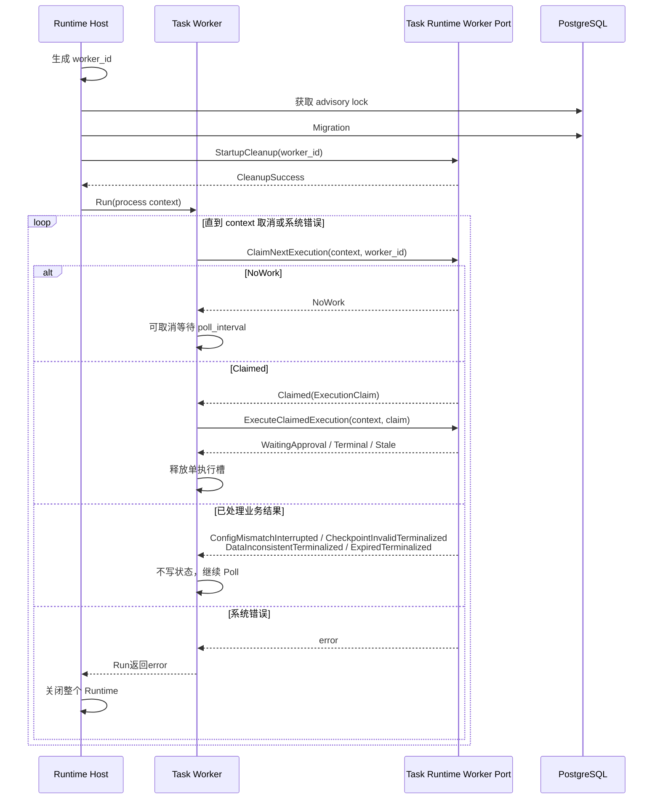
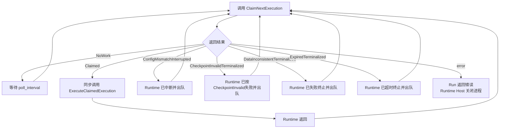
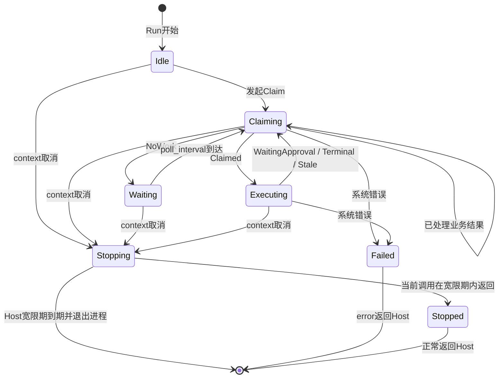
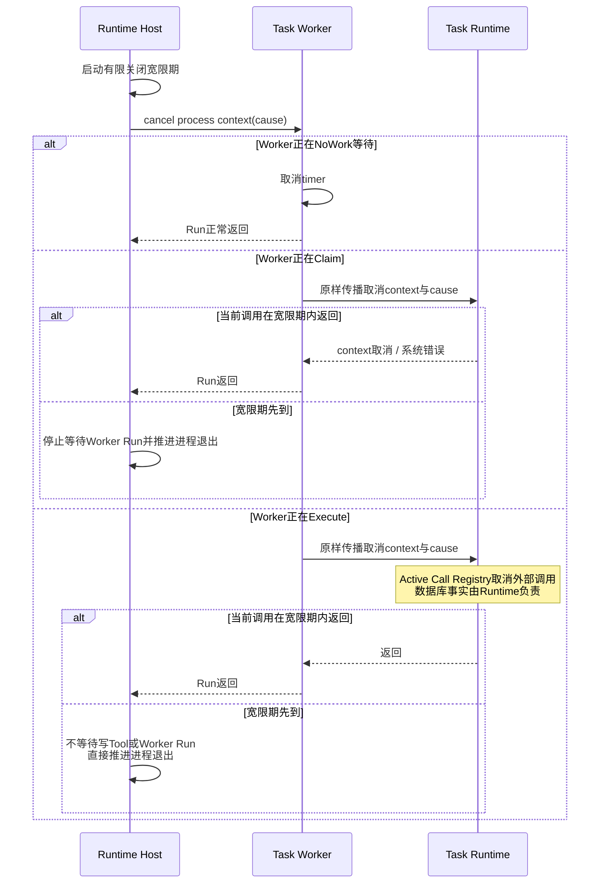
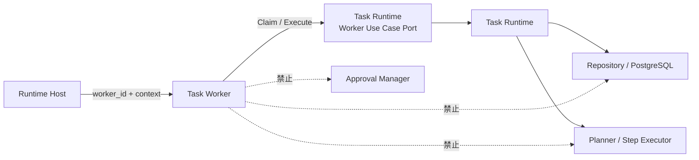
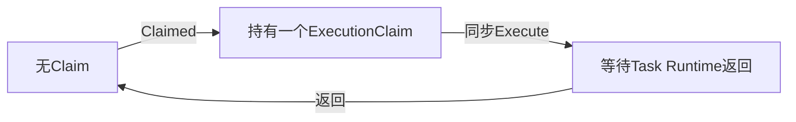

# Worker 功能详细设计

| 属性 | 值 |
|---|---|
| 文档版本 | V1.3 |
| 文档状态 | MVP Design Review 阻塞项已修正 |
| 需求基线 | `docs/design/001-requirements.md` V3.5 |
| 架构基线 | `docs/design/003-system-architecture-design.md` V1.3 |
| 相邻详细设计 | `docs/design/004-task-runtime-detailed-design.md` V1.19 |
| 设计规则 | `docs/specs/005-detailed-design-guideline.md` |
| 共享契约 | `docs/design/002-shared-domain-contract.md` V1.1 |

本文档中的 Worker 指 Task Worker，不包含 Report Worker、Timeout Scanner 或 Runtime Host。Task Runtime 的领取、状态事务、执行编排、Checkpoint 和恢复规则以相邻详细设计为准，本文档不重复定义第二套业务规则。

> 跨模块契约说明：ClaimResult、ExecutionClaim、ExecuteResult、TaskExecution公共状态、错误字段及Owner以`docs/design/002-shared-domain-contract.md`为唯一规范来源。本文出现的同名分支和状态表仅是Worker分支处理说明，不是可独立演进的定义。

> 类型约束：ExecutionClaim及Worker调用链中的所有持久化执行版本字段使用共享 `ExecutionVersion`，Worker不得转换为 `uint64`、裸 `int64` 或 `int`。

## 1. 功能概述

### 1.1 功能目标

Worker 是驱动层中的单 Task 执行循环，目标是：

- 按固定间隔驱动 Task Runtime 从 PostgreSQL 持久化队列领取工作；
- 携带 Runtime Host 注入的进程实例 worker_id 调用 Worker Use Case Port；
- 使用单执行槽保证同一时间最多执行一个已领取 TaskExecution；
- 仅在 `Claimed` 时触发 `ExecuteClaimedExecution`；
- 等待 Task Runtime 执行到 WaitingApproval、业务终态或 Stale 后释放执行槽；
- 在 NoWork 时执行可取消等待，避免空闲忙轮询；
- 在配置失配、已处理 CheckpointInvalid、已处理数据异常或已处理超时时继续轮询其他 Task；
- 在系统错误、持锁连接异常或 Runtime 关闭时停止领取，并在 Runtime Host 的有限关闭宽限期内尽力结束当前调用；
- 不持久化任何 Worker 私有状态，不参与 Task 生命周期决策。

### 1.2 使用场景

Worker 覆盖以下场景：

1. Runtime Host 完成单实例保护和启动清理后启动 Worker；
2. Worker 空闲时请求领取下一条 FIFO 排队执行；
3. 当前没有工作时等待下一轮 Poll；
4. 成功领取后同步触发 Task Runtime 执行；
5. Task 进入 WaitingApproval 后释放执行槽；
6. Task 完成、失败或被并发命令终止后释放执行槽；
7. 领取阶段配置失配或数据异常已被 Runtime 收敛后继续 Poll；
8. Approval 通过或 Recover 成功重新写入 queued_at 后再次领取；
9. Runtime 正常关闭或 advisory lock 连接失效时停止；
10. 服务重启后用新的 worker_id 继续 Poll 数据库中仍然排队的记录。

### 1.3 涉及模块

| 模块 | 与 Worker 的关系 |
|---|---|
| Runtime Host | 生成 worker_id，注入带明确取消原因的进程 context，控制 Worker 启停和有限关闭宽限期，并接收 Run 返回错误 |
| Task Runtime Worker Use Case Port | 提供 ClaimNextExecution 和 ExecuteClaimedExecution |
| Task Runtime | 拥有领取、执行、终态、配置门禁和异常收敛事务 |
| Approval Manager | 不与 Worker 直接交互；Approve 事务重新写 queued_at 后由下一次 Poll 发现 |
| Timeout Scanner | 独立终止过期 Task；不与 Worker 共享内存队列或执行槽 |
| Report Worker | 独立处理 Report，不属于 Task Worker 调度 |
| PostgreSQL | Worker 不直接访问；Task Runtime 的持久化写入通过持锁连接提交，只读查询可使用普通连接池 |

### 1.4 职责边界

Worker 负责：

- 单 goroutine Poll 循环；
- 单执行槽；
- 保存进程生命周期内只读的 worker_id；
- 调用 Task Runtime 的领取和执行入口；
- 按 ClaimResult 和 ExecuteResult 控制循环；
- NoWork 后的可取消等待；
- 原样传播 Runtime Host 提供的取消原因，并在关闭宽限期内尽力等待当前端口调用返回；
- 将系统错误返回 Runtime Host；
- 输出最小结构化进程日志。

Worker 不负责：

- 查询或更新 Task、Run、Step、TaskExecution、ToolExecution、Checkpoint、Approval、Report；
- 解释 queued_at、execution_config_hash、Checkpoint 或状态组合；
- 决定 FIFO 排序、领取来源、Timeout、Cancel、Recover 或状态转换；
- 创建新的 execution_version；
- 调用 Planner、Model Client、Tool、Kubernetes 或 Approval Manager；
- 创建 TaskLog 或 Pending Report；
- 处理启动遗留 Execution；
- 生成 worker_id 或取得 advisory lock；
- 多 Task 并行、抢占、优先级、延迟调度、MQ 或内存任务队列；
- Lease、Heartbeat、Fencing、自动接管或自动恢复。

### 1.5 MVP 约束

- 一个 Runtime Instance 只有一个 Task Worker；
- 一个 Worker 同时只有一个 Task 执行槽；
- Worker 不启动额外执行 goroutine；
- 当前 Task 未从 Task Runtime 返回前不发起下一次 Claim；
- Worker 不缓存排队 Task 列表；
- Worker 不根据执行时长抢占当前 Task；
- Poll 间隔为静态进程配置，MVP 默认 1 秒，必须大于 0；
- Poll 间隔最大为 5 秒，超过上限属于启动配置错误；
- Poll 间隔不进入 execution_config_hash，运行期间不热更新；
- NoWork 使用固定 Poll 间隔，不使用指数退避或随机抖动；
- 配置失配、数据异常和过期候选已由 Runtime 提交确定结果，不由 Worker 重试或补偿。

## 2. 业务流程

### 2.1 启动与正常执行

启动约束：

- Worker 只能在 advisory lock、Migration 和 StartupCleanup 全部成功后进入 Run；
- advisory lock 获取失败或 StartupCleanup 失败时，Worker 不得启动；
- Runtime Host 可以先完成 Worker 对象装配，但不得提前调用 Run；
- Worker 不重复执行 StartupCleanup，也不验证数据库单实例锁。

### 2.2 ClaimResult 处理

Worker 必须穷尽处理 ClaimResult：

- `Claimed`：唯一允许进入执行入口的分支；
- `NoWork`：不代表错误，不输出每轮持久化日志；
- `ConfigMismatchInterrupted`：不得使用当前新配置继续执行；
- `CheckpointInvalidTerminalized`：不得把缺失或损坏的 Checkpoint 改判为 DataInconsistent，也不得再次执行终态事务；
- `DataInconsistentTerminalized`：不得再次更新异常 Task 或创建 Report；
- `ExpiredTerminalized`：不得再次触发 Timeout；
- 未知结果类型：视为 Worker Port 契约错误，停止 Worker并返回系统错误；
- 系统 error：不得转换为 NoWork 或业务结果。

### 2.3 单执行槽

该状态机仅为 Worker 进程内控制状态，不持久化，也不等同于 TaskExecution 状态。

单执行槽规则：

- Claim 和 Execute 均在同一 Run 调用栈内同步执行；
- `Claimed` 返回后必须立即把原 ExecutionClaim 交给 Execute；
- Execute 未返回前不得调用下一次 Claim；
- Worker 不创建 goroutine 承载单个 Task 执行；
- WaitingApproval、Terminal 和 Stale 都表示本次调用结束，可以释放槽；
- Worker 不根据结果推断 Task 的最终状态。

### 2.4 Approval 与 Recover 后继续

1. Task Runtime 执行到高风险 Tool 时，由 Step Executor 和 Approval Manager 提交 WaitingApproval 事务；
2. Task Runtime 返回 `WaitingApproval`；
3. Worker 释放执行槽并继续 Poll 其他 Task；
4. Approve 事务将同一个 execution_version 改为 QUEUED并写入 queued_at；
5. Worker 后续 Poll 重新领取该 TaskExecution；
6. Worker 不接收 Approval Manager 回调，也不保存等待审批列表；
7. Recover 成功时，Task Runtime 创建新 execution_version并写入 queued_at；
8. Worker 对 Recover 排队记录与普通新 Task 使用完全相同的 Claim 流程；
9. Worker 只把当前版本 ExecutionClaim交给 Runtime，不跨版本读取 Checkpoint。

### 2.5 关闭流程

关闭约束：

- context 取消后不得发起新的 Claim；
- Runtime Host 通过 context cause 明确区分 `RUNTIME_SHUTDOWN` 和 `LOCK_LOST`，Worker 必须原样传播，不得降级为无原因取消；
- 已取得 Claimed 结果时仍调用 ExecuteClaimedExecution，并传入同一个已取消 context，由 Task Runtime 阻止新外部动作并按数据库事实处理；
- Runtime Host 拥有关闭宽限期及最终进程退出决定；关闭宽限期是 Runtime Host 静态配置，不由 Worker 定义或热更新；
- Worker 对当前端口调用的等待仅属于宽限期内的最佳努力优雅关闭，不是 Runtime Host 退出的前置条件；
- 当前调用在宽限期内返回时 Worker 正常结束 Run；宽限期到期仍未返回时，Runtime Host 停止等待并直接推进进程退出；
- Worker 不强制终止端口调用，也不为实现有界关闭新增执行 goroutine、调用托管器或线程中断机制；
- Worker 不把 RUNNING Execution自行改为 INTERRUPTED或FAILED；
- 正常关闭或锁连接失效后遗留的 RUNNING Execution由下一进程 StartupCleanup分类；
- advisory lock connection失效属于整个Runtime的不可逆关闭，不在Worker内部重连或重试；
- Worker 不等待写 Tool 外部结果来决定进程是否可以退出。

## 3. 模块设计

### 3.1 模块定位

依赖方向固定为：

`Runtime Host → Worker → Task Runtime Worker Use Case Port`

禁止形成：

- Task Runtime → Worker；
- Approval Manager → Worker；
- Worker → Repository；
- Worker → Task Lifecycle Policy；
- Worker → Planner、Step Executor、Tool或Report Manager。

### 3.2 Worker 组成

Worker 保持一个具体实现，不拆分新的调度、队列或执行器模块。内部只包含：

| 组成 | 职责 |
|---|---|
| Run Loop | 串行驱动 Claim、Execute 和 NoWork等待 |
| Worker Use Case Port | 调用 Task Runtime |
| poll_interval | NoWork后的固定等待时间 |
| worker_id | 当前Runtime进程实例标识 |
| process context | 接收Runtime Host关闭信号与明确取消原因，并原样传播到Task Runtime |

不单独创建 Queue、Scheduler、Slot Manager、Retry Manager、Lease Manager 或 Worker Repository。

### 3.3 入站生命周期接口

| 操作 | 调用方 | 输入 | 输出 |
|---|---|---|---|
| 构造 Worker | Runtime Host组合根 | Worker Use Case Port、worker_id、poll_interval | Worker或InvalidConfiguration |
| Run | Runtime Host | process context | 正常停止或系统error |

构造约束：

- Worker Use Case Port不能为空；
- worker_id不能为空；
- poll_interval必须满足 `0 < poll_interval <= 5s`；
- 构造函数不启动goroutine、不访问数据库、不调用Claim；
- 同一个Worker实例的Run只能调用一次，并由Worker内部原子一次性启动门禁保证；
- 只有第一次调用可以完成 `Created → Claiming`；并发或后续调用稳定返回 `AlreadyStarted`，不得启动第二个循环；
- `Run` 是阻塞式后台组件入口；Runtime Host 在唯一组件goroutine中调用它，并在关闭时并行等待Run完成信号或关闭宽限期到达；
- 上述组件goroutine就是唯一Run Loop，不允许Worker内部再派生第二个执行goroutine；
- Worker停止后不可重新启动；Runtime重启必须构造新的Worker实例。

### 3.4 Worker Use Case Port

> Claim/Execute公共结果边界见共享契约第2.3节；本节只定义Worker调用Task Runtime的方式。

Worker 仅依赖两个应用入口：

| 方法 | 输入 | 输出 | 语义 |
|---|---|---|---|
| `ClaimNextExecution` | context、worker_id | ClaimResult或error | Runtime原子领取或处理一个候选 |
| `ExecuteClaimedExecution` | context、ExecutionClaim | ExecuteResult或error | Runtime持续编排已领取Execution直到释放槽 |

接口约束：

- Worker 不传入 Task、Plan、Step、Checkpoint 或静态配置快照；
- Worker 不向 ExecuteResult 回写任何数据库状态；
- 两个方法必须接受同一个进程派生 context；
- `ClaimNextExecution` 的业务结果和系统 error必须分离；
- `ExecuteClaimedExecution` 的业务返回和系统 error必须分离；
- `error=nil` 时必须且只能返回一个已知业务结果；
- `error!=nil` 时不得同时返回有效业务结果；若两者同时存在，Worker忽略该业务结果并返回 `PortContractViolation`，同时保留原error作为诊断cause；
- `error=nil` 且没有业务结果、或返回未知业务结果，同样属于 `PortContractViolation`；
- 系统 error不得由Worker自动重试。

Worker Port 的返回组合固定如下：

| 业务结果 | error | Worker处理 |
|---|---|---|
| 一个已知结果 | nil | 按业务结果分支处理 |
| 无 | 可识别的正常取消 | 按第7.3节结束Run |
| 无 | 类型化系统错误 | 返回Runtime Host并关闭Runtime |
| 一个结果 | 非nil | 忽略结果，返回PortContractViolation |
| 无 | nil | 返回PortContractViolation |
| 未知结果 | nil | 返回PortContractViolation |

### 3.5 ExecutionClaim

> 字段语义唯一来源为共享契约第2.3节；本节只说明Worker按值持有和传递。

ExecutionClaim 由 Task Runtime 创建，Worker仅短暂持有：

| 字段 | Worker用途 |
|---|---|
| task_id | 结构化日志关联；不用于查询数据库 |
| run_id | 透传给Execute；不用于状态判断 |
| execution_version | 透传给Execute；不自行比较当前版本 |
| worker_id | 必须与本Worker只读worker_id一致 |
| claimed_at | 诊断信息；不参与Timeout判断 |

Worker 在调用 Execute 前只执行契约级校验：

- 必填ID非空；
- execution_version为正数；
- claim.worker_id等于Worker.worker_id。

契约校验失败属于系统错误。Worker不得尝试修复ExecutionClaim、重新Claim或直接查询数据库。

### 3.6 ClaimResult

> 封闭分支唯一来源为共享契约第2.3节；本节只说明Worker分支处理。

| 结果 | Worker行为 |
|---|---|
| Claimed | 同步调用ExecuteClaimedExecution |
| NoWork | 等待poll_interval或context取消 |
| ConfigMismatchInterrupted | 最多写一条安全结构化应用日志，立即进入下一次Claim |
| CheckpointInvalidTerminalized | 最多写一条安全结构化应用日志，立即进入下一次Claim |
| DataInconsistentTerminalized | 最多写一条安全结构化应用日志，立即进入下一次Claim |
| ExpiredTerminalized | 最多写一条安全结构化应用日志，立即进入下一次Claim |

Worker 不持久化 expected_config_hash、observed_config_hash、checkpoint hash或invariant_code。需要审计时以 TaskExecution、Checkpoint、Report 和 Task Runtime日志为准。

### 3.7 ExecuteResult

> 结果边界唯一来源为共享契约第2.3节。

| 结果 | Worker行为 |
|---|---|
| WaitingApproval | 释放槽并继续Poll |
| Terminal | 释放槽并继续Poll |
| Stale | 释放槽并继续Poll |

ExecuteResult 不要求 Worker理解 Task是Completed、Failed还是Cancelled。未知结果类型属于契约错误并终止Worker。

## 4. 数据设计

### 4.1 持久化数据

Worker 不拥有持久化实体，不新增 Worker、Slot、Queue、Lease 或 Heartbeat表。

Worker会间接使用但不读写以下事实：

| 持久化事实 | 所有者 | Worker关系 |
|---|---|---|
| Task.queued_at | Task Runtime / Approval Manager | 通过Claim入口间接驱动FIFO领取 |
| Task.current_execution_version | Task Runtime | 不读取；由Runtime在Claim和Execute中校验 |
| TaskExecution.status | Task Runtime / Approval Manager | 不更新；仅接收ClaimResult |
| TaskExecution.worker_id | Task Runtime | Claim事务写入；Worker只透传自身worker_id |
| Checkpoint | Checkpoint Manager / 调用方事务 | Worker不加载；Task Runtime执行时加载 |
| Approval | Approval Manager | Worker不查询、不决定 |
| ToolExecution | Step Executor / Task Runtime事务 | Worker不创建、不更新 |

### 4.2 进程内数据

| 数据 | 生命周期 | 可变性 | 约束 |
|---|---|---|---|
| worker_id | 整个进程 | 只读 | 由Runtime Host生成；服务重启后变化 |
| poll_interval | Worker实例 | 只读 | 默认1秒；必须满足 `0 < poll_interval <= 5s` |
| process context | Worker Run | 仅取消 | 由Runtime Host拥有取消权并携带RUNTIME_SHUTDOWN或LOCK_LOST原因 |
| ExecutionClaim | 单次Claim到Execute返回 | 只读 | 不缓存到下一轮，不持久化 |
| loop state | Worker实例 | 可变 | 一次性启动状态以原子方式转换；运行状态仅Run goroutine访问 |

Worker 不保存：

- 待执行Task列表；
- 最近一次queued_at；
- 当前Plan或Step；
- Checkpoint或Approval副本；
- execution_config_hash；
- 自动恢复标记；
- 失败重试次数。

### 4.3 数据不变量

- 一个Worker实例只有一个worker_id；
- 一个Worker实例最多只有一次成功Run，停止后不可复用；
- 一个Run Loop同时最多持有一个ExecutionClaim；
- 持有ExecutionClaim时不得发起新的Claim；
- ExecutionClaim只传给一次ExecuteClaimedExecution；
- NoWork不生成ExecutionClaim；
- Worker停止后不得保留可重新启动的内存队列；
- Worker进程内状态不得作为Task执行或恢复的事实来源。

## 5. 状态设计

### 5.1 Worker 控制状态

| 状态 | 含义 | 允许动作 |
|---|---|---|
| Created | 已构造，尚未Run | Run一次 |
| Claiming | 正在调用ClaimNextExecution | 等待返回或context取消 |
| Waiting | NoWork后的可取消等待 | timer到期或context取消 |
| Executing | 已Claimed并同步执行 | 等待Runtime返回 |
| Stopping | context已取消，不再启动新Claim | 在Host关闭宽限期内最佳努力等待当前调用；Host可在期限到达后直接退出进程 |
| Stopped | 正常结束 | 无 |
| Failed | 系统错误结束 | 向Host返回error |

控制状态不持久化。Worker重启是创建新的Worker实例，不恢复旧控制状态。Runtime Host 在关闭宽限期到达后直接退出进程时，Worker不要求先进入Stopped；进程退出本身结束全部内存控制状态。

### 5.2 Worker 与 TaskExecution 状态

> TaskExecutionStatus唯一枚举和终态语义见共享契约第1.4节；Worker不拥有该状态机。

Worker不执行TaskExecution状态转换。其观察关系如下：

| Worker观察 | Task Runtime可能已提交的TaskExecution状态 | Worker动作 |
|---|---|---|
| Claimed | RUNNING | 调用Execute |
| NoWork | 无新变化 | 等待 |
| ConfigMismatchInterrupted | INTERRUPTED | 继续Poll |
| CheckpointInvalidTerminalized | FAILED | 继续Poll |
| DataInconsistentTerminalized | FAILED | 继续Poll |
| ExpiredTerminalized | FAILED | 继续Poll |
| Execute WaitingApproval | WAITING_APPROVAL | 释放槽 |
| Execute Terminal | COMPLETED或FAILED | 释放槽 |
| Execute Stale | 当前状态或版本已变化 | 释放槽 |

Worker不能仅根据Execute返回值覆盖数据库状态，也不能把Stale转换为FAILED。

### 5.3 单执行槽不变量

以下情况均禁止：

- 一个Claimed结果启动多个Execute调用；
- Execute尚未返回时再次Claim；
- 为提高吞吐量启动第二个Worker goroutine；
- WaitingApproval期间保留执行槽；
- 通过内存标记让未排队Task重新执行。

## 6. 核心逻辑

### 6.1 构造

1. Runtime Host创建Task Runtime Worker Use Case Port实现；
2. Runtime Host生成本进程worker_id；
3. 加载静态poll_interval，未配置时使用1秒；
4. 校验依赖、worker_id和`0 < poll_interval <= 5s`；
5. 创建Worker具体实例；
6. 不启动后台循环，不访问数据库。

worker_id生成不属于Worker职责。Worker不接受稳定节点名、Pod名或主机名替代进程实例ID。
关闭宽限期由Runtime Host的静态配置负责，不作为Worker构造参数。

### 6.2 Run Loop

Run按以下顺序执行：

1. 使用原子一次性启动门禁执行`Created→Claiming`；未取得门禁的并发或后续Run返回`AlreadyStarted`；
2. context已经取消时直接正常返回；
3. 记录WorkerStarted结构化应用日志，不创建TaskLog；
4. 进入Claiming；
5. 调用ClaimNextExecution；
6. 根据业务结果进入6.3节分支；
7. 系统error立即结束循环并返回Runtime Host；
8. context取消后停止发起新Claim，并原样传播取消原因；
9. 当前同步调用在Host关闭宽限期内返回时结束Run；若期限先到，Host可以不等待Run返回而直接推进进程退出；
10. 记录WorkerStopped或WorkerFailed结构化应用日志。

Worker循环不捕获业务panic并继续运行；不可恢复的进程错误交给Runtime Host和进程管理器处理。

### 6.3 Claim 分支

#### Claimed

1. 校验ExecutionClaim契约；
2. 不重新读取context决定是否丢弃Claim；
3. 使用同一个context同步调用ExecuteClaimedExecution；
4. 即使context刚被取消，也把Claim交给Runtime，使Runtime能够阻止新外部动作并按持久化事实返回；
5. Execute在关闭宽限期内返回时释放ExecutionClaim；若Host先退出进程，不要求Worker完成内存清理；
6. context仍有效时进入下一轮Claim，否则结束。

#### NoWork

1. 创建poll_interval定时等待；
2. timer到期后进入下一轮Claim；
3. context取消时停止timer并结束；
4. 不使用sleep阻塞关闭信号；
5. 不把NoWork记录为TaskLog或错误。

#### 已处理业务结果

对ConfigMismatchInterrupted、CheckpointInvalidTerminalized、DataInconsistentTerminalized和ExpiredTerminalized：

1. 不调用Execute；
2. 不等待poll_interval；
3. 不修改任何领域状态；
4. 最多记录一条不含输入、配置hash或外部结果的结构化应用日志；
5. context仍有效时立即进入下一轮Claim。

### 6.4 Execute 分支

1. Worker把ExecutionClaim原样传给Task Runtime；
2. Task Runtime自行重新加载当前版本事实；
3. Task Runtime负责Plan、Step、Approval、Checkpoint、外部调用和状态收敛；
4. Worker同步等待结果；
5. WaitingApproval、Terminal或Stale均释放ExecutionClaim；
6. Worker不查询最终Task状态；
7. Worker不生成Report；
8. Worker不对Stale或明确业务失败执行重试；
9. error按第7.3节分类；类型化系统错误立即返回Runtime Host，正常关闭取消结束Run；
10. 业务结果与error同时存在、二者都不存在或结果类型未知时返回PortContractViolation，不执行或重试该Claim。

### 6.5 Poll 等待

MVP固定采用以下策略：

- 仅NoWork后等待；
- 默认间隔1秒；
- 合法范围为`0 < poll_interval <= 5s`，超过范围时Runtime拒绝启动Worker；
- 使用进程单调计时；
- 等待可被context立即取消；
- 不做指数退避；
- 不做随机抖动；
- 不在执行结束后人为等待；
- 不根据队列长度动态调整。

Poll间隔只影响空队列后发现新工作的延迟，不决定数据库FIFO顺序。FIFO由Task Runtime的Claim事务按queued_at、created_at、task_id确定。
5秒上限仅用于避免错误配置使空队列后的新任务长期不可见；不引入动态Poll、优先级或新的调度SLA。

### 6.6 启动与重启

启动顺序由Runtime Host控制：

1. 加载静态配置；
2. 初始化数据库；
3. 生成worker_id；
4. 获取Database级advisory lock；
5. 执行Migration；
6. 调用Task Runtime StartupCleanup；
7. 启动API和后台循环；
8. 调用Worker.Run。

重启规则：

- 新进程生成新的worker_id；
- 新Worker不继承旧ExecutionClaim或控制状态；
- queued_at非空记录由正常Claim重新发现；
- 旧RUNNING记录必须先由StartupCleanup分类；
- Worker不执行自动Recover；
- 未排队的INTERRUPTED Task等待User Recover。

### 6.7 停止

正常进程关闭、advisory lock连接断开或Runtime Host发现系统错误时：

1. Runtime Host启动有限关闭宽限期，并使用`RUNTIME_SHUTDOWN`或`LOCK_LOST`原因取消process context；
2. Worker停止启动新Claim；
3. NoWork timer立即退出；
4. 进行中的Claim或Execute收到同一个context及原始取消原因；
5. Task Runtime负责Active Call Registry和数据库Guard；
6. Worker只在Runtime Host规定的关闭宽限期内最佳努力等待当前端口调用返回；
7. 当前调用在期限内返回时，Worker清除进程内ExecutionClaim引用并让Run返回；
8. 期限到达仍未返回时，Runtime Host停止等待Worker Run并直接推进进程退出；
9. Worker不强制中断端口调用，不补写任何领域状态，也不重启自身；
10. 下一Runtime Instance取得advisory lock后，由StartupCleanup根据持久化事实分类未完成执行。

Worker不得在停止过程中：

- 创建补偿事务；
- 把RUNNING改为INTERRUPTED；
- 对写Tool推断副作用是否发生；
- 等待Approval；
- 重新获取advisory lock。

关闭宽限期到达不是Worker业务错误，也不生成TaskLog或持久化完成记录。已进入写Tool未知副作用边界的执行由下一实例分类为FAILED/WRITE_TOOL_INTERRUPTED及ToolExecution=UNKNOWN；ModelCall或只读Tool按既有安全中断规则分类。

### 6.8 最小日志

Worker仅输出进程级结构化应用日志：

- WorkerStarted；
- WorkerStopped；
- WorkerFailed；
- 可选的Claim业务结果摘要。

日志最小字段：

- worker_id；
- 适用时task_id、execution_version；
- result_type或安全错误码。

禁止记录：

- Task原始输入；
- Model或Tool原始输出；
- execution_config_hash；
- Approval冻结参数；
- Kubernetes对象内容；
- 凭证或Bearer Token。

Worker不直接写TaskLog。Task领域事件由拥有事务和状态事实的Task Runtime及相邻应用模块记录。

## 7. 异常处理

### 7.1 异常分类

| 分类 | 示例 | Worker行为 | 是否重试 |
|---|---|---|---|
| 构造错误 | port为空、worker_id为空、poll_interval非法 | 拒绝构造或启动 | 否 |
| 生命周期错误 | 同一Worker实例重复或并发Run | 返回AlreadyStarted，不启动第二循环 | 否 |
| NoWork | 当前无排队Task | 等待poll_interval | 正常Poll |
| 配置失配已处理 | ConfigMismatchInterrupted | 继续Poll | 不重试原Execution |
| CheckpointInvalid已处理 | CheckpointInvalidTerminalized | 继续Poll | 不重试原Execution |
| 数据异常已处理 | DataInconsistentTerminalized | 继续Poll | 不重试原Execution |
| 超时已处理 | ExpiredTerminalized | 继续Poll | 不重试原Execution |
| Execute WaitingApproval | Task暂停审批 | 释放槽并继续Poll | 审批后由queued_at重新领取 |
| Execute Terminal | Task已终止 | 释放槽并继续Poll | 否 |
| Execute Stale | 版本或状态已变化 | 丢弃本次内存Claim并继续Poll | 否 |
| context取消 | 正常关闭或锁失效关闭 | 停止新工作并返回 | 否 |
| Port契约错误 | 未知结果、Claim字段非法 | 返回系统error | 否 |
| Port返回组合错误 | 业务结果与error同时存在或二者都不存在 | 忽略业务结果，返回PortContractViolation | 否 |
| 数据库或事务系统错误 | connection失败、提交结果不确定 | 返回系统error给Host | 否 |
| Runtime致命不变量错误 | PersistenceInvariantViolation | 返回系统error给Host | 否 |
| Host关闭宽限期到达 | 当前Port调用仍未返回 | Host停止等待并退出进程；Worker不补写状态 | 否 |

### 7.2 重试规则

Worker只允许NoWork后的正常Poll，不实现业务重试。

明确禁止：

- Claim系统error后重试；
- Execute系统error后重试；
- 对同一个ExecutionClaim调用第二次Execute；
- 对Stale结果重试；
- 对配置失配自动重试；
- 对INTERRUPTED Task自动Recover；
- Model、Tool或写Tool重试；
- Worker内部重启循环；
- advisory lock失效后继续Poll。

外部进程管理器可以启动新Runtime进程，但新进程必须重新执行完整启动顺序。

### 7.3 context 取消与系统错误

Worker Port error必须提供稳定的类型分类，不允许Worker解析错误字符串。最小分类如下：

| error kind | 含义 | Worker处理 |
|---|---|---|
| Canceled | Port因传入context取消而结束 | 仅满足下述正常取消条件时正常停止 |
| PersistenceUnavailable | 数据库连接或持锁写通道不可用 | 返回Host并关闭Runtime |
| TransactionOutcomeUnknown | 事务提交结果无法确认 | 返回Host并关闭Runtime |
| LockLost | advisory lock或持锁连接已经失效 | 返回Host并关闭Runtime |
| PersistenceInvariantViolation | 无法安全确定持久化写入目标 | 返回Host并关闭Runtime |

`PortContractViolation`由Worker在端口返回组合、未知结果或ExecutionClaim契约非法时生成，也按系统错误返回Host。

判定规则：

- 只有process context已经取消、其cause为`RUNTIME_SHUTDOWN`或`LOCK_LOST`，且Port error kind为Canceled或可通过标准context取消语义识别时，Worker才按正常关闭停止；
- process context仍有效时返回Canceled属于端口契约异常，Worker返回PortContractViolation；
- 端口明确返回数据库、事务或不变量错误时，即使context随后取消，Worker仍把该错误返回Host；
- error非空时不得处理同时返回的业务结果；该非法组合升级为PortContractViolation；
- error为空时必须存在一个已知业务结果，否则返回PortContractViolation；
- Worker不通过错误字符串推断错误类型；
- Worker不吞掉系统错误并继续Poll；
- Worker不把系统错误转换为NoWork。

## 8. 并发与一致性

### 8.1 并发模型

- Worker只有一个Run Loop goroutine；
- Worker通过原子一次性启动门禁保证并发调用Run时最多一个循环成功启动；
- Claim和Execute顺序调用；
- 无第二执行槽；
- 无共享可变Task缓存；
- worker_id和poll_interval构造后只读；
- 带类型化cause的context取消是运行期停止工作的跨goroutine控制信号；Runtime Host关闭宽限期是外部等待边界；
- Worker不持有数据库事务或连接。

### 8.2 FIFO 一致性

Worker只触发领取，不决定排序：

- 不在内存中排序Task；
- 不预取多条记录；
- 不缓存下一条Task；
- 不设置优先级；
- 不抢占当前Task；
- 不调整queued_at。

Task Runtime成功返回的Claimed是唯一执行许可。Worker不能依据此前看到的NoWork、日志或Task查询结果执行Task。

### 8.3 execution_version 与 worker_id

- Worker不生成execution_version；
- Worker不通过MAX(execution_version)推导当前版本；
- Worker把Runtime返回的execution_version原样传回；
- Worker仅校验claim.worker_id与自身worker_id相等；
- 旧版本、旧worker_id和迟到结果由Task Runtime Guard拒绝；
- Worker不通过worker_id实现Lease或存活判断。

### 8.4 主要竞态

| 竞态 | 事实顺序 | Worker行为 |
|---|---|---|
| NoWork后新Task入队 | 入队发生在等待期间 | timer到期后正常发现 |
| Claimed后Cancel提交 | Runtime执行入口重新校验 | 同步等待Runtime返回，不写状态 |
| Claimed后context取消 | Execution已RUNNING | 仍把Claim交给Runtime；Runtime阻止新外部动作 |
| Execute期间Timeout | Timeout事务先提交 | Runtime丢弃迟到结果并返回，Worker释放槽 |
| Execute期间Approve/Reject | 状态事务按提交顺序 | Worker不参与竞争 |
| WaitingApproval后Approve | Approval写queued_at | 后续Poll按FIFO重新领取 |
| Recover成功后新版本排队 | Recover写queued_at | 后续Poll按普通任务领取 |
| 旧进程关闭与新进程启动 | 新进程先完成StartupCleanup | 新Worker只执行仍排队的当前版本 |
| advisory lock连接断开 | Host以LOCK_LOST取消context并启动关闭宽限期 | Worker停止新Claim并传播cause；期限内最佳努力返回，Host不以Run返回作为最终退出前提 |
| 写Tool不响应取消 | Host关闭宽限期先于Execute返回 | Worker不补写状态；Host直接推进进程退出，下一实例StartupCleanup分类UNKNOWN边界 |

### 8.5 幂等边界

Worker自身不提供命令幂等，也不保存幂等记录：

- Claim幂等和并发正确性由Task Runtime事务条件保证；
- Execute结果正确性由execution_version、worker_id和状态Guard保证；
- API命令幂等由Command Receipt保证；
- Worker不得为了“保险”重复调用Claimed的Execute；
- Worker重启不重放内存操作，只从数据库排队事实重新开始。

### 8.6 与单写通道的关系

- Worker不持有或使用advisory lock connection；
- Claim和Execute内部写操作由Task Runtime通过Runtime Write Executor提交；
- Worker不设置写事务优先级；
- Worker不控制Approve、Reject、Cancel、Timeout的提交顺序；
- Worker不因NoWork等待而占用持锁connection；
- Worker不在端口调用外执行数据库写入。

## 9. 测试场景

### 9.1 单元测试

| ID | 场景 | 预期 |
|---|---|---|
| WK-U-001 | 构造有效Worker | 保存只读worker_id、port和poll_interval，不启动循环 |
| WK-U-002 | worker_id为空 | 构造失败 |
| WK-U-003 | poll_interval不大于0或大于5秒 | 构造失败 |
| WK-U-004 | 顺序重复Run | 第二次Run返回AlreadyStarted且不启动第二循环 |
| WK-U-005 | context启动前已取消 | 不调用Claim，正常返回 |
| WK-U-006 | Claim返回NoWork | 不调用Execute，等待后再次Claim |
| WK-U-007 | NoWork等待时取消 | timer立即退出，不再Claim |
| WK-U-008 | Claim返回Claimed | 使用原Claim同步调用一次Execute |
| WK-U-009 | Claimed的worker_id不匹配 | 不调用Execute，返回契约错误 |
| WK-U-010 | Claimed后context取消 | 仍使用取消后的同一context调用Execute，不启动其他工作 |
| WK-U-011 | Execute返回WaitingApproval | 释放槽并再次Claim |
| WK-U-012 | Execute返回Terminal | 释放槽并再次Claim |
| WK-U-013 | Execute返回Stale | 不重试Execute，继续Claim |
| WK-U-014 | ConfigMismatchInterrupted | 不调用Execute，继续Claim |
| WK-U-014A | CheckpointInvalidTerminalized/CHECKPOINT_NOT_FOUND | 不调用Execute、不改判DataInconsistent、不重复终态，继续Claim |
| WK-U-015 | DataInconsistentTerminalized | 不修改状态，继续Claim |
| WK-U-016 | ExpiredTerminalized | 不重复Timeout，继续Claim |
| WK-U-017 | Claim返回系统error | Run返回error，不再Claim |
| WK-U-018 | Execute返回系统error | Run返回error，不再Claim |
| WK-U-019 | Claim返回未知业务结果 | 返回契约错误 |
| WK-U-020 | Execute返回未知业务结果 | 返回契约错误 |
| WK-U-021 | Execute阻塞期间 | 不产生第二次Claim |
| WK-U-022 | 连续多个业务已处理结果 | 顺序处理，不并行、不调用Execute |
| WK-U-023 | Run正常停止 | 清除内存Claim并记录WorkerStopped |
| WK-U-024 | 两个goroutine并发Run | 原子门禁只允许一个启动，另一个返回AlreadyStarted |
| WK-U-025 | Port同时返回业务结果和error | 不处理业务结果，返回PortContractViolation并保留原error cause |
| WK-U-026 | Port同时不返回业务结果和error | 返回PortContractViolation |
| WK-U-027 | process context有效但Port返回Canceled | 返回PortContractViolation |
| WK-U-028 | context以RUNTIME_SHUTDOWN取消且Port返回Canceled | Run正常停止 |
| WK-U-029 | context以LOCK_LOST取消且Port返回Canceled | Run正常停止，不再Claim |

### 9.2 编排测试

使用可编程Worker Use Case Port替身验证：

- 调用序列严格为Claim→Execute→Claim；
- NoWork分支严格为Claim→等待→Claim；
- 任何时刻最多一个Execute调用；
- WaitingApproval返回后Worker可以领取其他Task；
- Approval写入queued_at后可被下一次Poll发现；
- Recover新版本与普通Task使用相同领取路径；
- Worker从不调用Repository、Approval Manager、Planner或Tool；
- Worker不读取历史execution_version的Checkpoint；
- Worker关闭时context传播到当前Task Runtime调用；
- Worker原样传播RUNTIME_SHUTDOWN或LOCK_LOST取消原因；
- 当前Port调用在Host关闭宽限期内返回时，Worker Run正常结束；
- 写Tool调用不响应取消且关闭宽限期到达时，Host停止等待Worker Run并推进进程退出；
- Port系统错误使Run返回并交给Runtime Host；
- Port业务结果与error返回组合违反互斥契约时，Worker返回PortContractViolation；
- 结构化日志不包含Task输入、配置hash或外部响应。

### 9.3 Runtime 集成测试

- Worker只在Runtime Host完成advisory lock、Migration和StartupCleanup后启动；
- 第二个Runtime无法取得lock时不启动Worker；
- 数据库已有多个queued_at记录时按Task Runtime定义的FIFO顺序逐个执行；
- 当前Task执行期间新Task入队不发生抢占；
- WaitingApproval释放执行槽；
- 配置失配候选被Runtime中断后Worker继续执行后续Task；
- 已过期候选被Runtime终止后Worker继续执行后续Task；
- 持锁connection断开后Host以LOCK_LOST取消context，Worker停止新Claim；
- Execute中的写Tool不响应取消时，Host在关闭宽限期到达后不等待Worker Run返回并退出进程；
- 上述退出遗留的写Tool由下一实例StartupCleanup分类为FAILED/WRITE_TOOL_INTERRUPTED和ToolExecution=UNKNOWN；
- ModelCall或只读Tool在关闭宽限期内或进程退出时中断，由下一实例按安全恢复规则分类；
- 新进程使用新worker_id，先执行StartupCleanup，再处理仍排队记录；
- 旧RUNNING且未排队Execution不会被Worker自动执行；
- Worker全过程不产生直接数据库写入。

### 9.4 验收标准映射

| 需求验收 | 本设计覆盖 |
|---|---|
| AC-TASK-02 | ClaimResult、ExecutionClaim透传、只有Claimed执行 |
| AC-TASK-06～08 | Timeout并发时等待Runtime结果，不接收迟到结果 |
| AC-TASK-09 | 单执行槽、WaitingApproval释放、queued_at FIFO、不抢占 |
| AC-TASK-10 | 重启只处理排队记录，不自动执行遗留RUNNING |
| AC-TASK-14 | execution_version透传，状态Guard由Runtime执行 |
| AC-TASK-15 | Worker不持有事务，外部动作由Runtime在事务外编排 |
| AC-TASK-16～17 | Host完成锁和清理后启动；失锁时传播LOCK_LOST、有限等待且最终退出不依赖Worker Run返回 |
| AC-TASK-18～19 | Worker不解释配置门禁结果，配置失配后继续Poll |

## 10. 待确认问题

无。Worker的MVP边界、单执行槽、Poll策略、结果处理和关闭语义均可由当前需求、整体架构及Task Runtime详细设计确定。
