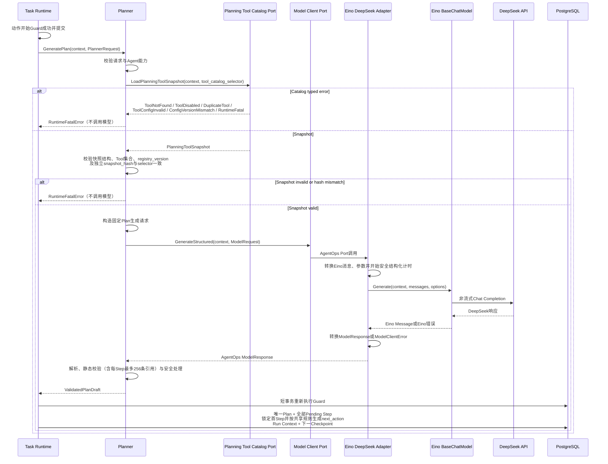
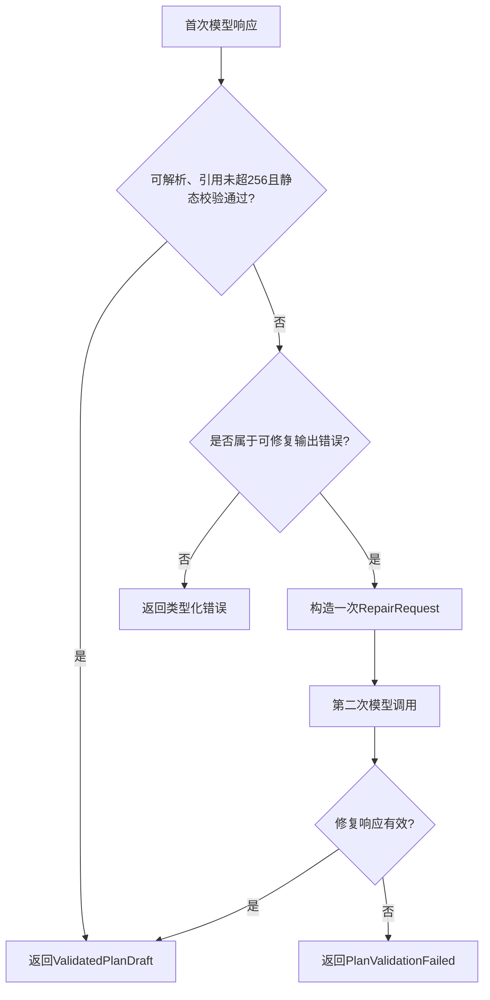
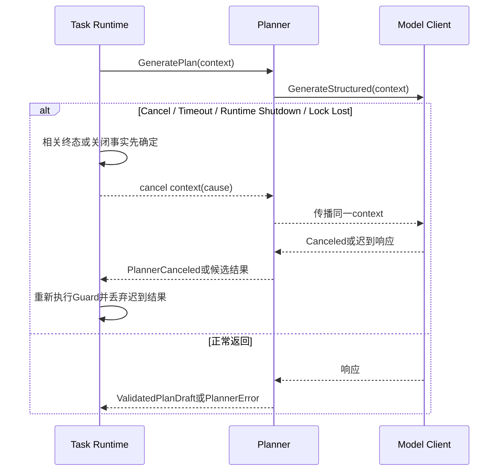
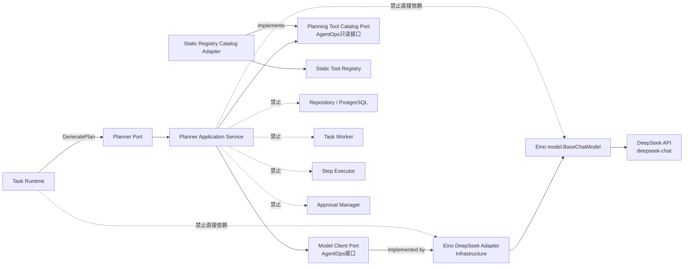
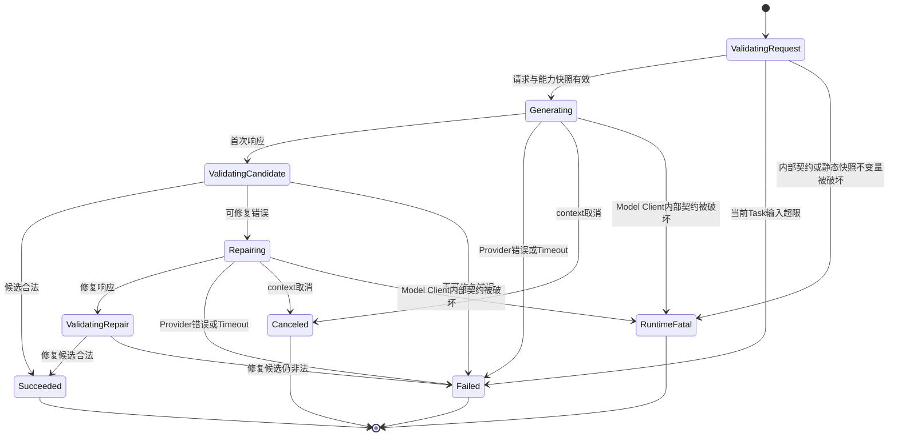
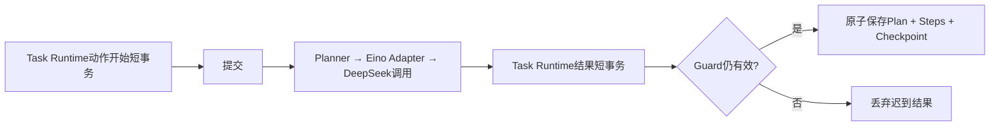

# Planner 功能详细设计

| 属性 | 值 |
|---|---|
| 文档版本 | V1.8 |
| 文档状态 | MVP 详细设计 |
| 需求基线 | `docs/design/001-requirements.md` V3.5 |
| 架构基线 | `docs/design/003-system-architecture-design.md` V1.3 |
| 相邻详细设计 | `docs/design/004-task-runtime-detailed-design.md` V1.19、`docs/design/005-worker-detailed-design.md` V1.3、`docs/design/007-step-executor-detailed-design.md` V1.17、`docs/design/008-tool-framework-detailed-design.md` V1.14、`docs/design/009-approval-detailed-design.md` V1.13、`docs/design/010-checkpoint-detailed-design.md` V1.8 |
| 设计规则 | `docs/specs/005-detailed-design-guideline.md` |
| 共享契约 | `docs/design/002-shared-domain-contract.md` V1.1 |

本文档中的 Planner 指应用层的计划生成模块。Planner 由 Task Runtime 在已经成功领取 TaskExecution 后调用，不由 Task Worker 直接调用。Planner 只返回经过静态校验的 Plan 草案，不持久化 Plan、不推进 Task 状态，也不执行任何 Step。

> 跨模块契约说明：ExecutionConfigV1、GenerationParams、Model Client、Planning Tool Catalog、公共错误字段和状态以`docs/design/002-shared-domain-contract.md`为唯一规范来源。本文同名结构只描述Planner的输入校验、调用和映射方式，不构成第二份共享类型定义。

> 类型约束：PlannerRequest、Model调用元数据及安全日志关联中的持久化执行版本使用共享 `ExecutionVersion`；Planner不得声明本地数值别名。

## 1. 功能概述

### 1.1 功能目标

Planner 的目标是：

- 把 Task 原始目标转换为一个结构化、不可变、严格顺序的 Plan 草案；
- 仅向 DeepSeek `deepseek-chat` 提供当前 Agent 允许且已启用的 Tool 能力；
- 强制 Plan Step 数量、顺序、类型、Tool 权限、Tool 参数和输出引用符合 MVP 约束；
- 保证最后一个 Step 为 `Verification`；
- 只支持 `step.output.<field>` 形式的紧邻前序 Step 直接字段引用；
- 对首次非法模型输出最多执行一次结构修复调用；
- 对网络、认证、超时和取消等调用错误不执行结构修复或自动重试；
- 只向 Task Runtime 返回经过解析、静态校验和安全处理的 PlanDraft；
- 不持久化原始模型响应、Prompt 或修复候选；
- 在 Task 取消、超时、Runtime 关闭或失锁时响应调用方 context。

### 1.2 使用场景

Planner 覆盖以下场景：

1. 首次 TaskExecution 成功领取后，从 GENERATE_PLAN Execution Checkpoint 生成 Plan；
2. Planner 调用期间 Worker 或 Runtime 中断，User 后续 Recover 后重新生成 Plan；
3. 首次模型输出合法，直接返回 ValidatedPlanDraft；
4. 首次模型输出不可解析或静态校验失败，执行一次修复调用；
5. 修复输出合法，返回 ValidatedPlanDraft；
6. 修复输出仍非法，返回 PlanValidationFailed；
7. 模型超时、网络错误或认证错误，返回 PlanGenerationFailed；
8. Task Cancel、Timeout、Runtime Shutdown 或 Lock Lost 取消 Planner 调用；
9. Planner 返回后 TaskExecution 已不再允许接收结果，由 Task Runtime 丢弃迟到结果；
10. Task Runtime 原子保存唯一 Plan、全部 Pending Step 和下一 Execution Checkpoint。

### 1.3 涉及模块

| 模块 | 与 Planner 的关系 |
|---|---|
| Task Runtime | Planner 的唯一业务调用方；负责动作 Guard、取消控制、结果持久化和业务终态 |
| Planner Port | Task Runtime 依赖的最小应用接口 |
| Model Client Port | AgentOps 自定义的稳定模型访问接口；隔离 Planner 与 Eino、DeepSeek Provider 类型 |
| Eino DeepSeek Adapter | Model Client Port 的基础设施层实现；通过 Eino ChatModel 调用 DeepSeek |
| Eino ChatModel | Adapter 内部持有的 Eino 模型组件；执行非流式模型调用 |
| DeepSeek API | 固定使用 `deepseek-chat` 和 JSON Output |
| Planning Tool Catalog Port | Tool Framework 拥有的唯一只读 Catalog Port；按 Agent 的 Catalog selector 从静态 Registry 集合返回版本化投影 |
| Plan Validator | Planner 内部纯逻辑；校验结构、顺序、Tool 权限、Schema 和引用 |
| Task Worker | 不直接调用 Planner；仅驱动 Task Runtime |
| Repository / PostgreSQL | Planner 不直接访问；Task Runtime 通过持锁写通道持久化结果 |
| Checkpoint Manager | Planner 不直接调用；Task Runtime 在 Plan 持久化事务中创建下一 Checkpoint |

Plan Validator 是 Planner 模块内部的确定性纯逻辑，不是新的服务、后台组件或独立部署单元。

### 1.4 职责边界

Planner 负责：

- 校验 PlannerRequest 的应用契约；
- 根据 Agent 允许列表从静态 Tool Catalog 构造本次能力快照；
- 构造固定结构的首次生成请求；
- 调用 Model Client；
- 解析结构化候选；
- 对 Plan 和 Step 执行完整静态校验；
- 构造一次修复请求并验证修复结果；
- 对可持久化字段执行结构化筛选、长度限制和脱敏检查；
- 返回 ValidatedPlanDraft 或类型化 PlannerError。

Planner 不负责：

- 领取 Task 或判断 TaskExecution 是否允许执行；
- 读取或写入 Task、Run、TaskExecution、Plan、Step 或 Checkpoint；
- 创建 plan_id、step_id、created_at 或数据库记录；
- 修改 Task、Run、Step 或 TaskExecution 状态；
- 创建 Pending Report 或 TaskLog；
- 执行 Step、Tool、Approval 或 Verification；
- 解析运行期 `step.output.<field>` 的实际值；
- 判断前序 Step 是否已经 Completed；
- 调用 Kubernetes；
- 执行模型通用重试、Fallback、熔断或多模型路由；
- 修改既有 Plan，生成第二个 Plan 或提供动态重规划；
- 保存 Prompt、原始响应、ModelExecution 或 ModelAttempt。

Eino 仅位于 Model Client Port 之后。Planner、Candidate Parser、Plan Validator、Safe Result Processor、Task Runtime 和领域模型均不得导入 Eino、Eino Ext、DeepSeek SDK 或 Provider 类型。

### 1.5 MVP 约束

- Provider 固定为 DeepSeek API；
- 模型固定为 `deepseek-chat`；
- 模型调用为非流式；
- 一个 Run 最多持久化一个 Plan；
- Plan 创建后不可修改；
- Plan 仅包含顺序 Step，不支持 DAG、条件、循环、并行或动态 Step；
- Step 数量范围为 1 到 `min(request.max_steps, 20)`；
- 最后一个 Step 必须为 Verification；
- Planner 最多调用模型两次：首次生成一次，结构修复最多一次；
- Provider、网络、认证、限流、服务端错误、调用超时或 context 取消均不触发修复调用；
- Planner 不实现模型调用自动重试；
- Planner 不记录 Token、价格或成本；
- Planner 不引入缓存、消息队列、Prompt 管理平台或 Plan 版本管理。
- Eino 只作为模型访问基础设施，不使用 Eino Graph、Workflow、Agent Runner、Interrupt、Checkpoint 或 Resume；
- AgentOps PostgreSQL 中的 Task、Run、TaskExecution、Plan、Step 和 Checkpoint 仍是唯一业务事实来源。

## 2. 业务流程

### 2.1 正常生成流程



关键约束：

- Task Runtime 调用 Planner 前已经完成 execution_version、worker_id、状态和 deadline Guard；
- Planner 调用期间不存在数据库事务；
- Eino、Eino Ext 和 Provider 类型只存在于 Eino DeepSeek Adapter 包内；
- Planner 不因模型成功而认为 Plan 已经持久化；
- Task Runtime 必须在保存前重新执行 Guard；
- Task Runtime必须按共享执行动作协议为首Step生成`EXECUTE_STEP`或`REQUEST_APPROVAL`；Planner不生成、推断或返回`next_action`；
- 只有持久化事务提交成功后，Plan 和 Step 才成为领域事实。

### 2.2 一次结构修复



可修复范围仅包括：

- 空响应或 JSON 不可解析；
- 顶层或 Step 结构不符合输出契约；
- Step 数量、sequence、type 或最终 Verification 不合法；
- Tool 不存在、未启用或未授权；
- Tool 静态输入不符合 Schema；
- 引用语法、来源字段或类型不合法；
- 输出字段无法安全处理。

以下情况不得进入修复调用：

- PlannerRequest 自身非法；
- 静态 Tool Catalog 或 Agent 配置违反启动配置契约；
- Model Client 网络、认证、限流或服务端错误；
- 模型调用超时；
- context 已取消；
- Runtime 已关闭或失锁；
- 第二次模型调用或第二次校验失败。

### 2.3 取消与迟到结果



Planner 不读取数据库判断结果是否迟到，也不写 `LateModelResultIgnored`。Task Runtime 根据持久化状态和 execution_version 决定接收或丢弃，并最佳努力记录对应 TaskLog。

### 2.4 中断与恢复

1. Task Runtime 在调用 Planner 前已存在当前 execution_version 的 GENERATE_PLAN Execution Checkpoint；
2. Planner 不保存中间状态或首次非法候选；
3. 进程在 Planner 调用中退出时，StartupCleanup 将本次 TaskExecution 按 Planner/Model 安全中断规则分类为 INTERRUPTED；
4. User 发起 Recover 并通过既有 Checkpoint 与 execution_config_hash 校验；
5. Recover 创建新的 execution_version 和该版本自包含的恢复起点 Checkpoint；
6. 新版本再次调用 Planner，从 Task、Agent 和静态 Tool 能力重新生成 Plan；
7. 若旧版本的模型结果迟到，Task Runtime 的 execution_version Guard 拒绝保存；
8. Planner 不跨版本读取 Checkpoint，也不尝试复用旧进程内候选。

## 3. 模块设计

### 3.1 模块定位



依赖方向固定为：

`Task Runtime → Planner Port → Planner Application Service → Model Client Port → Eino DeepSeek Adapter → Eino BaseChatModel → DeepSeek API`

Tool 能力依赖仍为：

`Planner Application Service → Planning Tool Catalog Port ← Static Registry Catalog Adapter → Static Tool Registry`

禁止形成：

- Planner → Task Runtime；
- Planner → Task Worker；
- Planner → Repository；
- Planner → Step Executor；
- Planner → Approval Manager；
- Planner → Eino ChatModel、Eino Message、Eino Option、Eino Callback 或 DeepSeek Provider 类型；
- Task Runtime / Planner Port / 领域模型 → Eino DeepSeek Adapter；
- Eino DeepSeek Adapter → Planner Application Service、Task Runtime 或 Repository；
- Model Adapter → Planner；
- Tool Registry → Planner 回调。

### 3.2 Planner 组成

Planner 保持一个应用模块，内部只有以下职责单元：

| 组成 | 职责 |
|---|---|
| Request Validator | 校验 PlannerRequest 和能力快照前置条件 |
| Prompt Builder | 以固定顺序构造首次生成和修复请求 |
| Candidate Parser | 从 ModelResponse 提取严格结构化候选 |
| Plan Validator | 执行确定性静态校验 |
| Safe Result Processor | 对将返回并可能持久化的字段执行结构化筛选、限长和脱敏检查 |
| Model Client Port | 发出非流式结构化模型请求 |
| Planning Tool Catalog Port | 按 `allowed_tools` 返回唯一、只读、带配置证据的静态 Tool 能力投影 |

Request Validator、Prompt Builder、Candidate Parser、Plan Validator 和 Safe Result Processor 属于 Planner 应用模块。Model Client Port 与 Planning Tool Catalog Port 是 Planner 依赖的 AgentOps 接口。后者的唯一契约由共享契约第5.6节定义、Tool Framework 实现，Planner 不读取或持有 Static Registry。Eino DeepSeek Adapter 属于基础设施层，不是 Planner 包内职责，也不是独立服务、后台进程或持久化对象。

### 3.3 Planner Port

| 方法 | 调用方 | 输入 | 输出 |
|---|---|---|---|
| `GeneratePlan` | Task Runtime | context、PlannerRequest | ValidatedPlanDraft 或 PlannerError |

接口约束：

- context 必须来自 Task Runtime 的当前 Planner 动作上下文；
- Planner 不创建脱离该 context 的模型请求；
- PlannerRequest 不包含 HTTP、数据库模型或 DeepSeek SDK 类型；
- 返回值只包含领域无关的 Plan 草案，不包含持久化实体；
- 成功结果与 error 严格互斥；
- context 取消与模型/验证失败必须使用稳定错误类别，调用方不得解析错误字符串；
- Planner 不返回部分合法 Plan；
- Planner 不暴露首次候选、修复候选或原始模型响应。

### 3.4 PlannerRequest

| 字段 | 必填 | 含义 |
|---|---|---|
| `task_id` | 是 | 仅用于调用关联和安全日志，不参与模型语义 |
| `run_id` | 是 | 仅用于调用关联，不由 Planner 查询 |
| `execution_version` | 是 | 当前执行版本，用于返回关联和迟到结果保护 |
| `task_input` | 是 | User 原始任务目标 |
| `agent_id` | 是 | 当前静态 Agent 标识 |
| `agent_system_prompt` | 是 | Agent 基础指令 |
| `allowed_tools` | 是 | Agent 允许的 Tool 名称集合 |
| `max_steps` | 是 | 本次 Plan 最大 Step 数，不得超过 20 |
| `model_name` | 是 | MVP 必须为 `deepseek-chat` |
| `generation_params` | 是 | 共享Model Client Port的强类型`GenerationParams V1`；与execution_config_hash使用同一规范化值 |
| `execution_config_hash` | 是 | Task Runtime 对当前 TaskExecution 完成门禁后传入的64位小写十六进制完整配置hash；Planner仅作为不透明执行证据引用，不用于Catalog选择或比较 |
| `tool_catalog_selector` | 是 | Task Runtime 从当前静态 Agent 配置投影的 `PlanningToolCatalogSelector`；不包含完整 execution_config_hash |

请求不包含：

- Task、Run 或 TaskExecution 数据库对象；
- `execution_config_hash` 对应的完整配置内容（请求只携带 hash）；
- Checkpoint 或 Runtime Context；
- 历史 Step 输出；
- Approval；
- Kubernetes 凭证或 Model API Key；
- Repository 或事务句柄。

`task_input`超过公开任务级限制属于当前Task局部失败。其余PlannerRequest字段非法表示Task Runtime内部契约被破坏，必须返回RuntimeFatalError，停止Runtime，不得收敛为当前Task的PlanGenerationFailed。

### 3.5 Planning Tool Catalog Port 与 PlanningToolSnapshot

> Port、Selector、Snapshot及Catalog hash唯一类型定义见共享契约第5.6节；本节只说明Planner校验和错误映射。

唯一接口定义在《跨模块共享领域契约》第5.6节，Tool Framework 提供实现，Planner 只消费共享类型，不声明本地同结构副本：

```go
type PlanningToolCatalogPort interface {
	LoadPlanningToolSnapshot(
		ctx context.Context,
		selector PlanningToolCatalogSelector,
	) (PlanningToolSnapshot, error)
}
```

请求选择器固定为：

```go
type PlanningToolCatalogSelector struct {
	CatalogID               string
	AllowedTools            []string
	ExpectedRegistryVersion string
	ExpectedSnapshotHash    CatalogSnapshotHash
}
```

`CatalogSnapshotHash` 是 Tool Framework 契约中的独立强类型，只允许64位小写十六进制SHA-256值；它与 `ExecutionConfigHash` 不可互相赋值或比较。

| 字段 | 规则 |
|---|---|
| `catalog_id` | 必填；选择一个启动时已冻结的静态 Registry。多个 Agent 可共享，也可使用不同值 |
| `allowed_tools` | 非 `nil`；元素非空、唯一且最多 `MaxPlanningTools`；空但非 `nil` 合法 |
| `expected_registry_version` | 必填；当前静态 Agent 配置在 Runtime 启动装配时冻结的 Catalog 版本 |
| `expected_snapshot_hash` | 必填；Tool Framework 对同一 catalog_id、registry_version 和 allowed_tools 投影生成的独立 Catalog hash |

Selector 不包含 agent_id、system instruction、model、execution_version 或完整 `execution_config_hash`。Task Runtime 从当前 Agent 的不可变运行配置原样投影 selector；Planner 与 Tool Framework 均不得根据 execution_config_hash 选择 Catalog。

共享响应 DTO 固定为：

```go
type PlanningToolSnapshot struct {
	SchemaVersion   uint32
	RegistryVersion string
	SnapshotHash    CatalogSnapshotHash
	Tools           []PlanningToolSpec
}

type PlanningToolSpec struct {
	ToolName    string
	Description string
	InputSchema CanonicalJSONSchema
	Capability  PlanningToolCapability
	Enabled     bool
}

type PlanningToolCapability struct {
	Kind      ToolCapabilityKind
	RiskLevel RiskLevel
	ReadOnly  bool
}
```

字段契约固定如下：

| 字段 | 规则 |
|---|---|
| `schema_version` | 固定为 `1`，代表 `agentops.planning-tool-snapshot/v1` |
| `registry_version` | 必填；selector 所选 Registry 的不可变版本 |
| `snapshot_hash` | 必填；64位小写十六进制，覆盖所选 Catalog 的本次完整规划投影 |
| `tools` | 与 selector.allowed_tools 集合精确相等，按 `tool_name` Unicode code point 升序，无重复 |
| `tool_name` | Tool 稳定唯一名称 |
| `description` | 非空、安全、可进入 Prompt 的描述 |
| `input_schema` | 通过第4.7节共享子集校验的规范化 JSON Schema |
| `capability` | 固定包含 `kind`、`risk_level` 和 `read_only` |
| `enabled` | 成功快照中固定为 `true`；disabled Tool 不得作为部分结果返回 |

`snapshot_hash` 是 Catalog 专用证据，不是 execution_config_hash。它固定为 `lower-hex(SHA-256(RFC8785-JCS(payload)))`；payload 包含 `schema_version`、`catalog_id`、`registry_version` 和排序后的 `tools`，不包含 `snapshot_hash` 自身。所有字段必填且不使用 `null`，空 Tool 集合编码为 `[]`。Planner 与 Tool Framework 共用该线协议验证函数，不各自维护编码规则。

调用语义固定为：

- Tool Framework 是一个或多个 Static Registry 的 Owner；Catalog Adapter 按 `catalog_id` 选择不可变 Registry；
- 多个 Agent 即使完整 execution_config_hash 不同，也可以用相同 selector 获得同一快照；不同 catalog_id 则相互隔离；
- Planner 不读取 Registry，不调用 Tool Framework 的三个执行入口，也不缓存跨调用快照；
- 返回值为全有或全无：任一请求 Tool 不存在、disabled、重复或配置非法时，不返回部分快照；
- Planner 构造 Prompt 和校验候选必须使用同一个 PlanningToolSnapshot；
- Planner 必须校验 DTO 结构、请求集合、排序和 snapshot_hash，并校验 `snapshot.registry_version=selector.expected_registry_version`、`snapshot.snapshot_hash=selector.expected_snapshot_hash`；
- Planner 不得将 snapshot_hash 与 PlannerRequest.execution_config_hash 比较；后者仍只代表完整 Agent 执行配置。

公开 error 通道的类型化分支保持：

| 分支 | 触发条件 |
|---|---|
| `ToolNotFound` | 所选 Registry 中缺少 allowed Tool |
| `ToolDisabled` | 请求名称存在但 `enabled=false` |
| `DuplicateTool` | selector.allowed_tools 出现重复名称 |
| `ToolConfigInvalid` | catalog_id、名称、描述、Schema、Capability、版本或快照规范非法 |
| `ConfigVersionMismatch` | selector 预期 registry_version/snapshot_hash 与所选 Registry 实际投影不一致 |
| `RuntimeFatal` | catalog_id 对应 Registry 不可读取、实现返回不可能组合或其他 Runtime 内部不变量破坏 |

成功快照与 error 严格互斥。错误类型包含稳定 kind、可选 tool_name 和安全 cause_code，禁止匹配错误字符串；context 取消保留 `errors.Is` 语义。Planner 自身发现响应版本或 hash 与 selector 不同，同样按 ConfigVersionMismatch 处理。

### 3.6 Model Client Port

> ModelClient、GenerationParams、ModelResponse和错误类别唯一来源为共享契约第5.3节与第6节。

| 方法 | 输入 | 输出 |
|---|---|---|
| `GenerateStructured` | context、ModelRequest | ModelResponse 或 ModelClientError |

AgentOps Port 契约等价于：

```go
type ModelClient interface {
	GenerateStructured(
		ctx context.Context,
		request ModelRequest,
	) (ModelResponse, error)
}
```

`ModelRequest`、`ModelResponse`、`ModelClientError` 和错误类别均由 AgentOps 定义。该接口及其所在包不得导入任何 Eino、Eino Ext、DeepSeek SDK 或 Provider 类型。

`GenerationParams`是AgentOps Model Client Port契约中的共享强类型DTO，也是`ExecutionConfigV1.model.generation_params`的字段类型。Planner、Step Executor和Eino DeepSeek Adapter引用同一个定义，不允许各模块声明同名副本或维护各自默认值：

- 字段集合、类型和范围由共享Model Client契约定义；
- `temperature`与`top_p`使用共享契约第5.3～5.4节的`CanonicalDecimalV1`，`max_output_tokens`使用`uint32`；Adapter可转换为Eino稳定 Option，但不得用转换后的二进制浮点反向参与配置hash；
- Task Runtime按`ExecutionConfigV1`规则补齐默认值并完成唯一规范化，PlannerRequest和StepExecutionRequest只携带同一个不可变值；
- INITIAL、REPAIR和执行期Model Step使用相同值；
- 字段顺序和JSON编码只引用共享契约第5节，不在Planner维护局部hash规则；
- Adapter只执行强类型字段到Eino稳定Option的映射，不接受任意Provider参数map；
- Planner、Step Executor和Adapter不得补默认值、忽略未知字段或依赖Provider隐式默认值。

ModelRequest 最小内容：

- model=`deepseek-chat`；
- stream=false；
- response_format=`json_object`；
- 固定顺序的 system 与 user message；
- Prompt 内的 Plan 输出契约和 JSON 示例；
- 当前静态强类型`GenerationParams V1`；
- 调用元数据：task_id、run_id、execution_version、phase=`INITIAL|REPAIR`；
- 不包含数据库事务、Bearer Token 或持久化凭证值。

调用元数据只供Adapter的安全结构化日志关联，不得进入发送给模型的消息正文。

ModelResponse 最小内容：

- `assistant_content`；
- 可选进程内元数据`provider_request_id`；
- 不包含 Eino Message、Eino ResponseMeta、Provider response 或底层 HTTP response。

`provider_request_id`只用于Adapter和Planner当前调用栈内关联及允许的结构化日志元数据。Planner不得把它复制到ValidatedPlanDraft或PlannerError；它绝不能进入INITIAL/REPAIR消息、Plan、Step、Checkpoint、TaskLog正文、Report正文或恢复上下文。

DeepSeek JSON Output 只用于保证响应是 JSON object，不替代 Planner 的严格 Candidate Parser、Plan Validator 和本地输出契约校验。不得假设 Provider 会按完整 Plan Schema 验证每个字段。

ModelResponse 只在当前调用栈内存在。Model Client 必须：

- 保留传入 context 的取消、deadline 和值传播链；
- 不创建脱离 context 的请求；
- 区分Canceled、Timeout、Authentication、Network、RateLimited、Provider、ResponseTooLarge和InvalidResponse；
- 对不符合固定模型、非流式或JSON Output约束的请求返回ModelClientContractViolation；
- 不执行自动重试、Fallback 或模型切换；
- 不记录完整 Prompt 或原始响应。

### 3.7 Eino DeepSeek Adapter

EinoDeepSeekModelClient 是 Model Client Port 的基础设施层实现。实现结构等价于：

```go
type EinoDeepSeekModelClient struct {
	chatModel model.BaseChatModel
}
```

其中 `model.BaseChatModel` 是本设计绑定的最小 Eino ChatModel 接口面，其非流式核心方法为：

```go
Generate(
	ctx context.Context,
	input []*schema.Message,
	opts ...model.Option,
) (*schema.Message, error)
```

Eino DeepSeek Adapter 负责：

1. 在组合根启动阶段创建并持有 Eino `model.BaseChatModel`；
2. 使用 Eino Ext 的 OpenAI-Compatible ChatModel 实现，并在创建时配置 DeepSeek Base URL、API Key、固定模型 `deepseek-chat` 和 `response_format=json_object`；
3. 将AgentOps ModelRequest转换为Eino `schema.Message`，并把共享`GenerationParams V1`逐字段映射为所选版本稳定支持的`model.Option`；禁止透传任意参数map；
4. 只调用 `BaseChatModel.Generate`，不调用 `Stream`；
5. 校验 ModelRequest 的 model、stream 和 response_format 与启动时不可变 ChatModel 配置一致；不一致时返回AgentOps契约错误，不静默覆盖；
6. 将调用方context的取消和deadline原样传播到`Generate`，禁止改用`context.Background()`或`context.TODO()`；
7. 从 Eino `schema.Message.Content` 提取 assistant content；
8. 在HTTP响应读取阶段执行1 MiB硬限制；
9. 仅在所选Eino Adapter通过稳定、文档化字段提供请求ID时提取provider_request_id；不可用时留空，不得使用反射、日志解析或错误字符串猜测；
10. 直接记录MVP允许的结构化模型调用字段，不启用Eino Callback；
11. 把Eino、HTTP Client和Provider错误转换为AgentOps ModelClientError；
12. 返回前把所有Eino类型转换为AgentOps类型；
13. 禁止自动重试、模型切换、Fallback、后台异步调用或Tool Calling。

Adapter 包内部允许使用：

- `github.com/cloudwego/eino/components/model`；
- `github.com/cloudwego/eino/schema`；
- 选定并锁定版本的 Eino Ext OpenAI-Compatible ChatModel；
- 底层 HTTP 和 Provider 错误类型。

这些类型不得出现在 Adapter 构造函数之外的业务接口、Planner Port、PlannerRequest、ModelRequest、ModelResponse、ModelClientError、ValidatedPlanDraft 或领域实体中。

Eino ChatModel 在 Runtime 启动时完成不可变配置，运行中不得调用会改变共享模型实例配置的方法。Planner 不绑定 Eino Tool，也不调用 Eino `BindTools`、`WithTools`、Graph 或 Agent API。

Adapter 字段使用最小的 `model.BaseChatModel`，不使用带可变 `BindTools` 能力的 `model.ChatModel`。Planner 不需要Eino Tool Calling，这一限制同时缩小依赖面并避免共享模型实例被运行期修改。

### 3.8 技术实现选型

引入 Eino 的原因：

- 复用 Go 原生 ChatModel 抽象及 OpenAI-Compatible Provider 适配能力；
- 统一非流式模型调用和消息转换；
- 将 DeepSeek HTTP/SDK 变化封装在基础设施 Adapter 内；
- 未来替换 Eino 或 Provider 时保持 Planner Application Service 和 Model Client Port 不变。

不使用 Eino 编排能力的原因：

- AgentOps 已由 PostgreSQL 持久化 Task、Run、TaskExecution、Plan、Step、Approval 和 Checkpoint；
- Task Runtime 已定义 execution_version Guard、Worker Ownership、Cancel、Timeout、Recover 和事务边界；
- 引入 Eino Graph、Workflow、Agent Runner、Interrupt、Checkpoint 或 Resume 会形成第二套状态机和恢复事实来源；
- Planner 的“一次生成、最多一次 Repair、完整本地校验”是确定性应用流程，不需要 Eino 自主编排。

因此MVP只使用Eino ChatModel组件，不使用Eino Callback、ADK、Graph、Workflow、Tool、Checkpoint或Resume。当前没有独立Callback消费者，模型调用观测由Adapter直接使用项目结构化日志完成，减少第三方版本敏感面。

以下能力明确由 AgentOps 保留，不得下沉或委托给 Eino：

- PlannerRequest 校验和 Tool Catalog 能力快照；
- Prompt 业务约束与安全边界；
- 严格 JSON 解析和重复 JSON key 检测；
- Plan、Step、Tool权限、enabled、Schema和引用静态校验；
- 首次生成与唯一一次 Repair 的流程控制；
- Safe Result Processor、ValidatedPlanDraft、PlannerError和ValidationIssue；
- Task、Run、TaskExecution、Plan、Step、Approval、ToolExecution和Checkpoint状态；
- execution_version Guard、Worker Ownership、Cancel、Timeout和迟到结果判定；
- PostgreSQL事务、AgentOps Checkpoint和Recover机制。

Eino版本锁定是实现前置检查，不是架构待确认问题。实现开始前必须在`go.mod`同时锁定兼容的Eino与Eino Ext精确版本，以锁定版本的`model.BaseChatModel.Generate`完成最小编译测试和Model Client Port契约测试；禁止依赖main分支。依赖升级只能修改Adapter，不得改变AgentOps Model Client Port。

背景参考（不作为接口版本契约，锁定版本源码才是实现依据）：

- [CloudWeGo Eino](https://github.com/cloudwego/eino)
- [CloudWeGo Eino Ext](https://github.com/cloudwego/eino-ext)
- [DeepSeek JSON Output](https://api-docs.deepseek.com/guides/json_mode)

### 3.9 结果类型

`GeneratePlan` 的成功结果是 ValidatedPlanDraft：

| 字段 | 含义 |
|---|---|
| `task_id` | 与请求一致的关联标识 |
| `run_id` | 与请求一致的关联标识 |
| `execution_version` | 与请求一致的执行版本 |
| `goal` | 已安全处理的 Plan 目标 |
| `steps` | 已验证的有序 StepDraft |

Planner 不返回 plan_id、step_id、created_at、status 或 checkpoint_sequence；这些值只能由 Task Runtime 的持久化事务创建。

## 4. 数据设计

### 4.1 Planner 持久化边界

Planner 不拥有数据库表，不直接持久化任何数据。

Planner 成功后，Task Runtime 在一次持锁连接短事务中创建：

| 数据 | 创建规则 |
|---|---|
| Plan | run_id 唯一；goal 来自 ValidatedPlanDraft |
| Step | 按 sequence 创建全部记录，初始状态均为 Pending |
| Run | 设置 plan_id、current_step_id 和最小 Run Context |
| Checkpoint | 当前execution_version的下一Execution Checkpoint；Task Runtime锁定首Step后按共享执行动作协议保存`EXECUTE_STEP`或`REQUEST_APPROVAL` |

该事务必须重新校验：

- Task.current_execution_version；
- ExecutionClaim.execution_version；
- TaskExecution=RUNNING；
- worker_id；
- Task/Run 状态；
- Run.plan_id 仍为空；
- deadline 尚未到达；
- 当前最大 Checkpoint 仍允许 GENERATE_PLAN 结果提交。

任一 Guard 失败时不得持久化 Planner 返回的任何部分。

Planner不在ValidatedPlanDraft中携带`next_action`。Task Runtime的Planner结果事务必须使用共享契约第2.1节中与Step结果事务相同的规则：ModelCall、Analysis、Verification及Low/read_only Tool映射为`EXECUTE_STEP`，High/write Tool映射为`REQUEST_APPROVAL`。Runtime不得先写通用`EXECUTE_STEP`再在派发时动态改写。

### 4.2 Plan JSON 线协议

Planner INITIAL 和 REPAIR 共享同一份、版本内不可变的 AgentOps Plan JSON 线协议。Prompt Builder、Candidate Parser、Plan Validator、Repair Prompt 和持久化 DTO 必须引用同一个协议定义，不得分别维护近似结构。

Plan 顶层只允许：

| 字段 | JSON类型 | 必填 | 规则 |
|---|---|---|---|
| `goal` | string | 是 | 非空，UTF-8有效 |
| `steps` | array | 是 | 1到20个Step object |

Step object 只允许：

| 字段 | JSON类型 | 必填 | 规则 |
|---|---|---|---|
| `sequence` | integer | 是 | 从1开始、连续、唯一 |
| `type` | string enum | 是 | 精确匹配`ModelCall`、`ToolCall`、`Analysis`、`Verification` |
| `name` | string | 是 | 非空 |
| `input` | object | 是 | 符合对应Step输入契约 |
| `output_schema` | object | 是 | AgentOps自定义一层字段映射，至少1个字段 |
| `tool_name` | string | 仅ToolCall必填 | ToolCall为非空字符串；其他Step必须省略 |

通用线协议规则：

- Plan顶层、Step和OutputSchema字段描述对象均禁止未知字段；
- 任意层级出现重复JSON Key时整个候选非法；
- 字段名和枚举值区分大小写，不执行大小写归一化；
- 所有协议字段均禁止`null`；`tool_name`不得使用`null`表达“不适用”；
- 非ToolCall携带`tool_name`时非法，包括空字符串和`null`；
- ToolCall缺少`tool_name`、值为空或非string时非法；
- `goal`、`name`和`tool_name`禁止空字符串或全空白字符串；
- `steps`和`output_schema`禁止空数组或空对象；
- `input`顶层必须是object；是否允许空对象由对应Step输入契约或Tool Schema决定；
- `input`内部可包含string、number、integer、boolean、object、array以及被Schema明确允许的null；
- JSON number必须是有限值；sequence必须能无损表示为正整数；
- 字符串必须是有效UTF-8；
- INITIAL和REPAIR的required、nullable、unknown-field、大小写、重复Key及额外字段规则完全相同；
- 不接受Markdown code fence、JSON前后解释文本或多个JSON文档。

模型输出不得包含plan_id、run_id、execution_version、status、created_at、Checkpoint、Report或审批决定。出现这些字段按`UNKNOWN_FIELD`处理，不得忽略后继续持久化。

### 4.3 Plan JSON 完整示例

最小合法Plan：

```json
{
  "goal": "验证目标工作负载处于预期状态",
  "steps": [
    {
      "sequence": 1,
      "type": "Verification",
      "name": "验证目标状态",
      "input": {
        "criteria": "目标工作负载满足用户要求",
        "evidence": {}
      },
      "output_schema": {
        "verified": {
          "type": "boolean"
        }
      }
    }
  ]
}
```

包含ToolCall、ModelCall、Analysis、Verification和显式引用的合法Plan：

```json
{
  "goal": "检查Deployment并分析其运行状态",
  "steps": [
    {
      "sequence": 1,
      "type": "ToolCall",
      "name": "读取Deployment",
      "input": {
        "cluster": "primary",
        "namespace": "default",
        "name": "demo"
      },
      "output_schema": {
        "deployment": {
          "type": "object"
        }
      },
      "tool_name": "get_deployment"
    },
    {
      "sequence": 2,
      "type": "ModelCall",
      "name": "整理Deployment信息",
      "input": {
        "prompt": "提取后续分析需要的事实",
        "context": "step.output.deployment"
      },
      "output_schema": {
        "analysis_context": {
          "type": "object"
        }
      }
    },
    {
      "sequence": 3,
      "type": "Analysis",
      "name": "分析运行状态",
      "input": {
        "instruction": "判断副本状态和可用性是否异常",
        "evidence": "step.output.analysis_context"
      },
      "output_schema": {
        "verification_context": {
          "type": "object"
        }
      }
    },
    {
      "sequence": 4,
      "type": "Verification",
      "name": "验证分析结论",
      "input": {
        "criteria": "结论必须由已采集事实支持",
        "evidence": "step.output.verification_context"
      },
      "output_schema": {
        "verified": {
          "type": "boolean"
        },
        "summary": {
          "type": "string"
        }
      }
    }
  ]
}
```

### 4.4 PlanDraft与StepDraft

PlanDraft：

| 字段 | 类型 | 规则 |
|---|---|---|
| `goal` | string | 符合线协议并通过安全处理 |
| `steps` | StepDraft[] | 1到max_steps，sequence严格升序 |

StepDraft：

| 字段 | 类型 | 规则 |
|---|---|---|
| `sequence` | integer | 从1开始、连续、唯一 |
| `type` | enum | ModelCall、ToolCall、Analysis、Verification |
| `name` | string | 非空 |
| `input` | JSON object | 符合对应固定输入契约或Tool Schema |
| `output_schema` | OutputSchema | AgentOps自定义一层字段映射 |
| `tool_name` | optional string | ToolCall必填；其他类型字段不存在 |

StepDraft不使用nullable tool_name，不包含status、output、error_code、started_at或ended_at。持久化时所有Step初始状态由Task Runtime固定为Pending。

### 4.5 AgentOps OutputSchema

> 跨模块 OutputSchema 规则以共享契约第7.5节为唯一来源；本节只说明 Planner 的静态校验。

OutputSchema不是标准JSON Schema，而是字段名到字段描述的最小映射：

```json
{
  "field_name": {
    "type": "string"
  }
}
```

固定规则：

- 顶层必须是非空object；
- 字段名匹配`^[A-Za-z_][A-Za-z0-9_]*$`，区分大小写；
- 每个字段描述必须是object，且只允许必填字段`type`；
- type只允许string、number、integer、boolean、object、array；
- 字段描述不允许nullable、required、properties、items、description或其他关键字；
- OutputSchema中声明的字段视为Step确定输出应提供的直接字段，实际输出由Step Executor校验；
- object和array只能作为完整直接字段被下一Step引用，禁止多级路径和数组下标；
- OutputSchema不表达可空字段；实际值为null时不满足声明类型。

### 4.6 非Tool Step固定输入契约

> 固定输入字段和类型规则以共享契约第7.5节为唯一来源；本节只说明 Planner 规划期校验。

Planner和Step Executor必须共享同一份版本内不可变输入契约。

ModelCall input：

| 字段 | 必填 | 逻辑类型 | 是否允许引用 |
|---|---|---|---|
| `prompt` | 是 | string，非空 | 是，只能引用string |
| `context` | 否 | object | 是，只能引用object |

Analysis input：

| 字段 | 必填 | 逻辑类型 | 是否允许引用 |
|---|---|---|---|
| `instruction` | 是 | string，非空 | 是，只能引用string |
| `evidence` | 是 | object | 是，只能引用object |

Verification input：

| 字段 | 必填 | 逻辑类型 | 是否允许引用 |
|---|---|---|---|
| `criteria` | 是 | string，非空 | 否，必须是静态字面量 |
| `evidence` | 是 | object | 是，只能引用object |

共同规则：

- input顶层禁止对应表格之外的附加字段；
- 固定输入契约不支持nullable，任意字段值为null均非法；
- object字面量是受通用大小、深度和字段数限制的结构化数据袋，允许内部业务字段；
- 引用字符串在规划期按目标位置的逻辑类型参与校验，不按string字面量校验；
- Planner校验required、顶层附加字段、字面量类型、引用语法、紧邻关系、来源字段和声明类型兼容性；
- Step Executor要求前序Step=Completed，解析实际字段，替换引用后重新校验required、附加字段和完整实际类型；
- 替换后仍出现引用字符串、缺少字段或类型不匹配时按InputResolutionFailed终止。

### 4.7 Tool输入Schema子集

> 受限 Tool Input Schema 关键字集合以共享契约第7.5节为唯一来源；本节只说明 Planner 的启动期与规划期校验。

Tool `input_schema`采用受限JSON Schema风格，但MVP只支持以下关键字：

| 关键字 | 支持规则 |
|---|---|
| `type` | 必填，单个string；只允许object、array、string、number、integer、boolean |
| `properties` | object类型可用；字段名到子Schema映射 |
| `required` | object类型可用；唯一string数组，成员必须存在于properties |
| `items` | array类型必填；只能是单个子Schema |
| `additionalProperties` | object类型可省略或显式为false；省略按false；true和Schema形式均不支持 |
| `nullable` | 可省略或为boolean；默认false；顶层Tool input不得nullable |
| `description` | 可选string，仅用于Prompt，不参与值校验 |

固定限制：

- 顶层type必须为object；
- 支持嵌套object和array，受统一JSON深度与字段数限制；
- 不支持`$ref`、`oneOf`、`anyOf`、`allOf`、`not`、`if/then/else`、`dependentSchemas`；
- 不支持type数组、多类型联合或通过`"type":["string","null"]`表达nullable；
- 不支持patternProperties、动态additional properties和复杂条件Schema；
- 不支持的关键字、错误的关键字类型或无法确定输入位置类型，均在Runtime启动加载Tool配置时失败；
- Tool Schema启动校验成功后运行期不可变化。

Planner规划期：

- ToolCall input必须满足required、properties、additionalProperties和字面量类型；
- 引用占位计为字段已提供，并按前序OutputSchema声明类型校验目标Schema位置；
- nullable只允许JSON null字面量，不允许把类型不兼容引用视为null；
- integer可用于number，其他类型必须相同；
- 不执行Kubernetes RBAC、资源存在性或resourceVersion检查。

Step Executor运行期：

- 前序Step必须Completed；
- 取出实际输出字段并替换引用；
- 对替换后的完整Tool input重新执行同一Schema子集校验；
- 实际null只在目标Schema nullable=true时合法；
- 运行期校验失败按InputResolutionFailed处理，不调用Tool。

### 4.8 输入引用

输入引用采用保留字符串叶子值`step.output.<field>`：

- 完整字符串匹配`^step\.output\.[A-Za-z_][A-Za-z0-9_]*$`；
- 引用必须独占JSON值，不允许模板拼接；
- sequence=1不得引用；
- sequence=N只能引用sequence=N-1；
- field必须存在于前一Step OutputSchema；
- 来源声明类型必须与固定输入契约或Tool Schema目标位置兼容；
- integer可赋给number，其他类型仅同类型兼容；
- 禁止Step ID、sequence、多级路径、数组下标、条件、函数和默认值；
- 以保留前缀`step.output.`开头但不完整匹配的string返回REFERENCE_SYNTAX_INVALID；
- 不以保留前缀开头、仅在普通文本中部包含`step.output.`的string按字面量处理。
- 每个Step.input最多包含256个合法引用叶子；第257个及以后使整个候选无效，不允许把“已验证Plan”交给Task Runtime后再由Checkpoint拒绝；
- 计数复用共享契约第7.4节引用协议的深度优先遍历和target_path规则；Planner只做静态语法、数量、紧邻Schema和类型校验，不构造持久化resolved_references。

Plan创建时不要求前一Step已执行。运行期Completed、实际字段存在性、实际值类型和替换后完整输入校验由Step Executor负责。

### 4.9 进程内数据

| 数据 | 生命周期 | 是否持久化 |
|---|---|---|
| PlannerRequest | 单次GeneratePlan | 否 |
| PlanningToolSnapshot | 单次GeneratePlan | 否 |
| INITIAL ModelRequest/Response | INITIAL模型调用 | 否 |
| Eino schema.Message/model.Option | 单次Adapter调用且仅存在于基础设施包 | 否 |
| 首次候选及ValidationIssue[] | 校验或Repair构造期间 | 否 |
| RepairRequest/Response | 最多一次Repair调用 | 否 |
| ValidatedPlanDraft | 返回Task Runtime并等待提交 | 仅提交后的Plan/Step成为事实 |

原始ModelResponse、Prompt、候选、Eino Message、Provider response和原始错误不得进入TaskLog、Checkpoint、Report、Command Receipt或应用日志正文。

### 4.10 MVP固定资源限制

所有大小均按UTF-8字节数计算，KiB=1024 bytes，MiB=1024 KiB。以下值是代码内固定的Planner约束V1.3执行语义常量，不提供运行期动态配置：

| 常量 | 固定值 | 执行层 | 超限稳定错误码 |
|---|---:|---|---|
| `MaxTaskInputBytes` | 16 KiB | PlannerRequest校验 | TASK_INPUT_TOO_LARGE |
| `MaxAgentPromptBytes` | 32 KiB | Runtime启动配置校验；PlannerRequest仅作不变量防线 | 启动：AGENT_PROMPT_TOO_LARGE；运行：RUNTIME_INVALID_PLANNER_REQUEST |
| `MaxToolDescriptionBytes` | 4 KiB/Tool | Runtime启动配置校验 | TOOL_DESCRIPTION_TOO_LARGE |
| `MaxToolSchemaBytes` | 64 KiB/Tool | Runtime启动配置校验 | TOOL_SCHEMA_TOO_LARGE |
| `MaxPlanningTools` | 32 | Runtime启动配置校验；能力快照防御校验 | 启动：TOOL_COUNT_EXCEEDED；运行：RUNTIME_STATIC_TOOL_SNAPSHOT_INCONSISTENT |
| `MaxInitialPromptBytes` | 256 KiB | 启动最坏情况校验、Prompt构造前 | 启动：INITIAL_PROMPT_TOO_LARGE；运行：RUNTIME_PROMPT_INVARIANT_BROKEN |
| `MaxRepairPromptBytes` | 384 KiB | 启动最坏情况校验、Repair调用前 | REPAIR_PROMPT_TOO_LARGE |
| `MaxModelResponseBytes` | 1 MiB | Adapter HTTP响应读取阶段及assistant content提取后 | MODEL_RESPONSE_TOO_LARGE |
| `MaxPlanSteps` | 20 | PlannerRequest不变量防线、Candidate Parser、Plan Validator | 请求：RUNTIME_INVALID_PLANNER_REQUEST；候选：PLAN_STEP_LIMIT_EXCEEDED |
| `MaxPlanDraftBytes` | 256 KiB | Candidate Parser、Planner返回前 | PLAN_DRAFT_TOO_LARGE |
| `MaxStepNameBytes` | 128 bytes | Plan Validator、Safe Result Processor | STEP_NAME_TOO_LONG |
| `MaxGoalBytes` | 2 KiB | Plan Validator、Safe Result Processor | PLAN_GOAL_TOO_LONG |
| `MaxStepInputBytes` | 32 KiB/Step | Candidate Parser、Plan Validator | STEP_INPUT_TOO_LARGE |
| `MaxResolvedReferencesPerStep` | 256/Step | Plan Validator共享引用遍历 | REFERENCE_COUNT_LIMIT_EXCEEDED |
| `MaxOutputFields` | 32/Step | Candidate Parser、Plan Validator | OUTPUT_SCHEMA_FIELD_LIMIT_EXCEEDED |
| `MaxOutputFieldNameBytes` | 64 bytes | Candidate Parser、Plan Validator | OUTPUT_FIELD_NAME_TOO_LONG |
| `MaxJSONDepth` | 16 | Tool启动校验、Candidate Parser | JSON_DEPTH_EXCEEDED |
| `MaxObjectFields` | 64/object | Tool启动校验、Candidate Parser | OBJECT_FIELD_LIMIT_EXCEEDED |
| `MaxValidationIssues` | 32 | Plan Validator | VALIDATION_ISSUE_LIMIT_EXCEEDED |
| `MaxRepairCandidateSummaryBytes` | 64 KiB | Repair Prompt构造前 | REPAIR_CANDIDATE_SUMMARY_TOO_LARGE |
| `PlannerModelCallTimeout` | 60 seconds | Model Client调用边界 | MODEL_CALL_TIMEOUT |
| `RepairMinModelBudget` | 15 seconds | Repair调用前 | REPAIR_BUDGET_INSUFFICIENT |
| `PlannerLocalSafetyMargin` | 2 seconds | Repair调用前与返回阶段 | REPAIR_BUDGET_INSUFFICIENT |

限制执行规则：

- Runtime启动时对每个Agent及其allowed_tools执行Schema、数量、单项大小和最坏情况Prompt大小校验；失败阻止整个Runtime启动；
- `MaxModelResponseBytes`由Eino Adapter注入的受限HTTP transport在读取响应体时执行，Eino返回后再次检查assistant content；禁止先无限读取再校验；
- Candidate Parser在构造完整内存对象前执行字节、深度和对象字段数限制；
- 超过Plan、Step、input、OutputSchema或文本限制的首次候选产生可修复ValidationIssue；
- 超过ModelResponse限制不把响应送入Repair，当前Task以PlanGenerationFailed/MODEL_RESPONSE_TOO_LARGE结束；
- ValidationIssue超过32时只保留前31项，第32项固定为VALIDATION_ISSUE_LIMIT_EXCEEDED；
- Repair候选安全摘要超过64 KiB时不截取原始文本，省略候选摘要并加入REPAIR_CANDIDATE_SUMMARY_TOO_LARGE；
- Repair Prompt仍超过384 KiB时不调用模型，返回PlanValidationFailed/REPAIR_PROMPT_TOO_LARGE；
- ValidatedPlanDraft返回前按规范化JSON重新计算总字节数并执行最后防线；
- 影响Plan接受结论的全部常量固定于Planner约束V1.3，并逐字段映射到共享`ExecutionConfigV1.planner`及其`limits`；其中包含`MaxResolvedReferencesPerStep=256`。Planner不得在此列表之外自行追加hash输入；网络连接、DNS、TLS握手等纯运维超时由`ExecutionConfigV1`统一排除。

### 4.11 数据不变量

- Planner成功结果严格符合唯一Plan JSON线协议；
- Planner成功结果包含1到min(max_steps,20)个Step；
- sequence为1..N，最后一个Step是Verification；
- ToolCall具有非空tool_name，非ToolCall不存在tool_name；
- 所有Step input符合固定输入契约或已启动校验的Tool Schema；
- OutputSchema至少1个且最多32个直接字段；
- 所有引用来自紧邻前一Step的直接输出字段；
- ValidatedPlanDraft不包含持久化ID、状态或第三方类型；
- Planner不保存第二份Plan或任何中间候选；
- 同一GeneratePlan最多发出INITIAL和一次REPAIR两次模型请求；
- Repair只发生在首次候选的可修复校验错误之后。

## 5. 状态设计

### 5.1 Planner 调用状态



上述状态只存在于一次函数调用内，不持久化，也不新增 PlannerExecution 或 ModelAttempt。

### 5.2 Plan 状态语义

Plan 不新增状态字段：

- Planner 内存中的候选不是 Plan 领域事实；
- ValidatedPlanDraft 仍不是持久化 Plan；
- Task Runtime 事务成功创建后，Plan 立即成为不可变事实；
- Plan 创建失败或事务回滚时，数据库中不存在部分 Plan；
- 已存在 Plan 时不得再次调用 Planner或覆盖该 Plan。

### 5.3 与 Task 状态的关系

Planner 不执行状态转换。Task Runtime 根据 Planner 结果处理：

| Planner结果 | Task Runtime处理 |
|---|---|
| ValidatedPlanDraft | 重新Guard并原子创建Plan、Step和Checkpoint |
| PlanGenerationFailed | Task/Run/TaskExecution按既有失败终态收敛并创建Pending Report |
| PlanValidationFailed | Task/Run/TaskExecution按既有失败终态收敛并创建Pending Report |
| PlannerCanceled | 重新读取持久化事实；不得由Planner自行判定Task终态 |
| RuntimeFatalError | 不把当前Task收敛为Planner局部失败；Task Runtime把类型化系统错误返回Worker，Runtime Host停止服务，Worker停止新Claim，当前执行留给下一实例StartupCleanup依据持久化事实分类 |

若 Cancel、Timeout、恢复到新 execution_version 或 Runtime 关闭已经使 Guard 失效，Task Runtime 丢弃 ValidatedPlanDraft，不创建 Plan 或 Step。

`StartupConfigurationError`不进入Planner调用状态：组合根必须在API Server、Worker、Report Worker和Timeout Scanner启动前完成静态配置校验，失败即拒绝整个Runtime启动。`RuntimeFatalError`复用Runtime Host和Worker既有系统错误停止路径，不新增Worker结果、Task状态或持久化事实。

## 6. 核心逻辑

### 6.1 启动校验与请求校验

Runtime组合根必须先执行一次完整静态校验：

1. Agent标识、system prompt、allowed_tools和max_steps合法；
2. model固定为`deepseek-chat`，共享`GenerationParams V1`已经由配置加载器完成默认值规范化并处于允许范围；
3. 每个静态注册Tool的名称、描述、risk_level和read_only完整且唯一；每个Agent引用的allowed Tool存在并为enabled；
4. 每个静态注册Tool的input_schema符合第4.7节MVP子集；
5. Agent Prompt、Tool描述、Tool Schema、Tool数量符合第4.10节限制；
6. 对每个Agent计算INITIAL与REPAIR最坏情况Prompt大小并检查固定上限；
7. Plan线协议版本、固定输入契约版本、Tool Schema子集版本和资源限制版本组合一致。

任一检查失败返回`StartupConfigurationError`，阻止整个Runtime启动。该阶段不得创建Task、Report或Command Receipt。

Runtime启动后，Planner按以下顺序进行防御性请求校验：

1. context非空；
2. task_id、run_id、agent_id非空；
3. execution_version为正数；
4. task_input和agent_system_prompt非空；
5. task_input不超过`MaxTaskInputBytes`；
6. model_name等于`deepseek-chat`；
7. max_steps在1..`MaxPlanSteps`；
8. allowed_tools无重复空值且不超过`MaxPlanningTools`；
9. `GenerationParams V1`与已校验静态配置中的同一不可变值一致；
10. `tool_catalog_selector.allowed_tools=PlannerRequest.allowed_tools`，且 selector 不包含 execution_config_hash；
11. 以完整 `tool_catalog_selector` 调用唯一 `PlanningToolCatalogPort`，不得直接读取 Registry或按Agent hash选择Catalog；
12. Tool Catalog 为全部 allowed_tools 返回唯一、enabled、名称有序的完整快照，共享线协议校验通过，且返回的registry_version/snapshot_hash与selector预期完全相等。

只有`task_input`超过公开任务级限制属于当前Task局部`PlanGenerationFailed/TASK_INPUT_TOO_LARGE`。其余请求非法返回`RuntimeFatalError/RUNTIME_INVALID_PLANNER_REQUEST`。Catalog 的 `ToolNotFound`、`ToolDisabled`、`DuplicateTool`、`ToolConfigInvalid`、`ConfigVersionMismatch`、`RuntimeFatal`，以及 Planner 对返回快照发现的集合、版本或 hash 矛盾，统一映射为`RuntimeFatalError/RUNTIME_STATIC_TOOL_SNAPSHOT_INCONSISTENT`，并保留 Catalog `kind` 作为安全 cause 分类。上述错误均不调用模型、不执行Repair，也不得伪装为当前Task生成失败。

### 6.2 首次 Prompt 构造

Prompt 按以下固定区块构造：

1. Agent system prompt；
2. 平台 Plan 契约和安全边界；
3. Task 原始目标，使用明确边界标记并声明其为不可信数据；
4. 按名称排序的可用 Tool 描述和 input_schema；
5. 合法 Step type；
6. max_steps；
7. 最终 Verification Step 要求；
8. `step.output.<field>` 唯一引用规则；
9. 禁止动态 Plan、条件、循环、模板拼接和未授权 Tool；
10. 第4.2节唯一AgentOps Plan JSON线协议；
11. 第4.3节最小与完整合法示例；
12. 第4.6节非Tool固定输入契约和第4.7节Tool Schema子集。

Prompt Builder 不：

- 注入历史 Step 摘要或 Memory；
- 注入 Checkpoint、Approval 或 TaskLog；
- 暴露 Tool 凭证、endpoint 或内部错误；
- 根据模型输出改变约束；
- 把 Task 输入当作平台指令执行。

Prompt Builder、Candidate Parser、Repair Prompt、Plan Validator和持久化DTO必须引用同一V1.2线协议定义，不得复制出独立的近似Schema。INITIAL Prompt构造后按UTF-8字节检查`MaxInitialPromptBytes`。启动校验已按最大Task输入和静态配置最坏情况预防超限；运行中仍超限表示该不变量被破坏，不调用模型并返回`RuntimeFatalError/RUNTIME_PROMPT_INVARIANT_BROKEN`。

### 6.3 模型调用

1. 使用 Task Runtime 传入的 context；
2. 使用固定`deepseek-chat`和当前共享`GenerationParams V1`；
3. stream=false，response_format=`json_object`；
4. Planner Application Service 只调用 AgentOps Model Client Port；
5. Eino DeepSeek Adapter校验固定模型、非流式和JSON Output配置，并把AgentOps messages及共享`GenerationParams V1`逐字段转换为Eino `schema.Message`与稳定`model.Option`；
6. Planner以`min(PlannerModelCallTimeout, 上层context剩余时间)`创建保留上层cause和值链的单次调用context；
7. Adapter在数据库事务外调用Eino `model.BaseChatModel.Generate`，不创建脱离该context的goroutine；
8. Eino ChatModel通过OpenAI-Compatible Chat Completion调用DeepSeek；
9. Adapter在响应体读取阶段执行`MaxModelResponseBytes`硬限制；
10. Adapter把Eino结果转换为AgentOps ModelResponse，或把Eino/HTTP/Provider错误映射为ModelClientError；
11. Adapter直接记录允许的安全结构化字段，不启用Eino Callback；
12. Model Client返回错误时按第7.3节优先级分类；
13. Canceled、Timeout、Authentication、Network、RateLimited或Provider错误均不自动重试；
14. 空响应、无法提取assistant content或内容不可解析进入候选校验失败，可触发唯一修复；
15. 原始响应只保留到解析、校验或修复请求构造完成。

首次和修复调用共享同一个上层动作 context。修复不会获得独立的新 Task deadline；如果剩余时间不足或 context 已取消，不发起修复。

INITIAL 与 REPAIR 是 Planner 的流程状态。Eino Adapter 只接收 phase 并执行一次模型调用，不判断是否需要 Repair，也不得在一次 `GenerateStructured` 内发起第二次请求。

### 6.4 候选解析

Candidate Parser：

1. 在解析前检查assistant content不超过`MaxModelResponseBytes`；
2. 使用单值流式JSON解码，只接受一个顶层JSON object；
3. 只接受第4.2节定义的字段、类型和必填关系；
4. 拒绝Markdown code fence、解释文本、尾随内容或多个JSON值；
5. 在任意嵌套层级拒绝重复JSON key；
6. 在构造完整对象前拒绝超过`MaxJSONDepth`或任一object超过`MaxObjectFields`；
7. 数字sequence必须能无损解析为integer；
8. 拒绝未知Plan、Step、OutputSchema描述字段；
9. 非ToolCall必须省略tool_name；ToolCall必须携带非空字符串tool_name；
10. 拒绝任何协议禁止的null、空数组、空对象和空字符串；
11. 不执行宽松类型转换，不把字符串数字转换为integer；
12. 检查每个Step input、OutputSchema字段数/字段名和规范化PlanDraft总字节限制；
13. 不从自然语言中猜测缺失字段，不生成默认Step或Tool。

解析失败产生固定 ValidationIssue，不直接持久化解析器原始错误。

### 6.5 静态校验顺序

Plan Validator 按固定顺序执行：

1. goal 非空；
2. steps 数量为 1..max_steps；
3. sequence 从 1 开始连续且唯一；
4. type 属于 ModelCall、ToolCall、Analysis、Verification；
5. name 非空；
6. input 是 JSON object；
7. input符合对应Step type的固定输入契约或Tool Schema静态结构；
8. output_schema是第4.5节合法的一层字段声明；
9. goal、name、input、output_schema、PlanDraft和对象深度/字段数均符合第4.10节限制；
10. 最后一个Step的type为Verification；
11. ToolCall的tool_name非空、存在、enabled且属于allowed_tools；
12. 非ToolCall不存在tool_name；
13. ToolCall中所有字面量参数满足MVP Tool input_schema；
14. 引用占位所在输入位置允许目标输出字段类型；
15. sequence=1不包含引用；
16. 其他引用严格匹配保留语法；
17. 引用字段存在于sequence-1的output_schema；
18. 不存在条件、函数、默认值、数组下标、多级路径或模板拼接；
19. 每个Step的合法引用数量不超过`MaxResolvedReferencesPerStep=256`；
20. 所有将持久化的文本和结构化值能够通过安全处理。

校验收集一组有序ValidationIssue，顺序按Step sequence、字段路径和错误码稳定排序，用于修复请求和测试断言。最多保留`MaxValidationIssues`项；超过时保留前31项并把最后一项固定为`VALIDATION_ISSUE_LIMIT_EXCEEDED`。

### 6.6 Tool Schema 与引用校验

对 ToolCall.input 递归遍历：

- 只使用第4.7节已通过启动校验的MVP Tool Schema子集；
- 引用占位先按所在Schema位置的声明类型参与结构校验，不把引用字符串误当作字面量；
- 字面量叶子按Tool input_schema直接校验；
- 合法引用叶子不使用字符串本身做字面量校验，而使用来源 OutputSchema 的类型检查目标位置兼容性；
- 必填字段不得因为引用而跳过；
- input_schema 不允许的额外字段仍然拒绝；
- Tool 名称、权限、风险等级只从 PlanningToolSnapshot 读取，不相信模型声明；
- Planner 不校验运行期 Kubernetes RBAC、namespace实际存在性或resourceVersion；
- 写 Tool 是否进入 Approval 由后续 Step Executor 和 Approval Manager 决定。

类型兼容固定为同类型兼容；`integer` 可以用于目标 `number`，其他类型不做隐式转换。

对ModelCall、Analysis和Verification，Planner使用第4.6节同一固定输入契约执行字段、required、附加字段和目标位置声明类型校验。Step Executor必须引用同一版本的契约：运行期确认前序Step为Completed、读取实际输出字段、替换引用、验证实际类型，并对替换后的完整输入再次校验。Planner不读取运行期输出，Step Executor也不得放宽Planner已经冻结的协议。

### 6.7 安全结果处理

在返回 ValidatedPlanDraft 前：

- 只保留第4.2节白名单字段，并按第4.10节重新检查goal、Step name、input、output_schema和完整PlanDraft大小；
- 对所有字符串执行UTF-8有效性和控制字符检查；
- 对PEM私钥标记、Authorization/Bearer/Basic值，以及键名为`password`、`passwd`、`secret`、`token`、`api_key`、`apikey`、`private_key`、`client_secret`或`authorization`的值执行确定性已知凭证检测；
- 候选命中已知凭证模式时返回`SENSITIVE_CONTENT_DETECTED`，不把原值写入ValidationIssue或Repair摘要；
- Tool input必须同时通过Schema、权限和敏感内容检查；
- Safe Result Processor不得截断或静默改写goal、name或可执行input；超限或需改变语义时拒绝候选；
- 不保存或返回原始模型错误、堆栈、Prompt 或响应；
- ValidationIssue 只包含稳定 error_code、JSON path 和安全摘要；
- 无法安全处理的候选按可修复校验错误处理；修复后仍失败则 PlanValidationFailed。

MVP不实现通用DLP、自由文本秘密识别服务或可配置脱敏规则。上述固定白名单、长度和已知凭证模式是唯一安全处理边界。

### 6.8 修复请求

RepairRequest 包含：

- 与首次请求相同的Task目标、Agent约束、Tool能力和第4.2节Plan线协议；
- 首次候选的受限结构化表示；
- 稳定排序后的ValidationIssue；
- “只能修复结构，不得改变Task目标或绕过权限”的明确约束；
- “只返回完整替换后的JSON对象”的输出要求。

RepairRequest 不包含：

- 原始HTTP响应；
- provider_request_id或任何其他Provider内部诊断；
- 凭证；
- 数据库状态；
- TaskLog；
- Checkpoint；
- 未经限长和安全处理的错误文本。

若首次响应为空或无法解析为结构化候选，RepairRequest 不携带该原始响应，只携带 `INVALID_JSON`、安全错误摘要和完整输出契约。不得为了修复而把不可解析原文重新注入模型。

可解析候选的Repair安全摘要按规范化字段白名单构造。摘要超过`MaxRepairCandidateSummaryBytes`时不截断原文，而是完全省略候选摘要并加入`REPAIR_CANDIDATE_SUMMARY_TOO_LARGE`。Repair Prompt构造完成后超过`MaxRepairPromptBytes`时不调用模型，返回`PlanValidationFailed/REPAIR_PROMPT_TOO_LARGE`。

发起Repair前使用进程单调时间计算上层context剩余时间。只有：

`remaining > RepairMinModelBudget + PlannerLocalSafetyMargin`

时才允许调用；否则返回`PlanValidationFailed/REPAIR_BUDGET_INSUFFICIENT`。允许调用时，Repair单次模型context的deadline为：

`now + min(PlannerModelCallTimeout, remaining - PlannerLocalSafetyMargin)`

修复调用只执行一次。INITIAL与REPAIR使用完全相同的V1.2 Plan线协议；修复响应从解析开始重新执行全部校验，不只校验首次失败项。

### 6.9 返回成功结果

只有以下条件全部满足时返回 ValidatedPlanDraft：

- 请求契约有效；
- Tool能力快照有效；
- 候选可严格解析；
- 完整静态校验通过；
- 安全结果处理通过；
- task_id、run_id、execution_version 原样返回；
- 未发生 context 取消。

Planner 不在返回前检查数据库，也不生成持久化ID。Task Runtime负责最终状态Guard和事务提交。

### 6.10 Task Runtime 持久化协作

Planner 返回成功后，Task Runtime：

1. 幂等注销 Active Call Registry 句柄；
2. 进入持锁连接短事务；
3. 锁定 Task、Run、当前 TaskExecution 和最大 Checkpoint；
4. 重新校验 execution_version、worker_id、状态、deadline 和 `Run.plan_id IS NULL`；
5. 为 Plan 和 Step 生成持久化ID；
6. 创建唯一 Plan；
7. 按 sequence 创建全部 Pending Step；
8. 更新Run.plan_id、current_step_id和最小Context；
9. 锁定首Step，按共享契约第2.1节执行动作协议生成`EXECUTE_STEP`或`REQUEST_APPROVAL`，创建当前版本Execution Checkpoint；
10. 提交后最佳努力记录 Plan 结果 TaskLog。

Planner 不接收事务句柄，不参与上述原子提交。事务唯一约束至少保证一个 run_id 只有一个 Plan。

Checkpoint Manager只保存和校验Task Runtime传入的`next_action`，不根据Step风险自行推导；Planner、Worker和Step Executor也不得在该事务提交后改写它。

### 6.11 失败处理

| 场景 | Planner返回 | 是否修复 |
|---|---|---|
| task_input超过MaxTaskInputBytes | PlanGenerationFailed/TASK_INPUT_TOO_LARGE | 否 |
| PlannerRequest其余内部字段非法 | RuntimeFatalError/RUNTIME_INVALID_PLANNER_REQUEST | 否 |
| Catalog返回ToolNotFound、ToolDisabled、DuplicateTool或ToolConfigInvalid | RuntimeFatalError/RUNTIME_STATIC_TOOL_SNAPSHOT_INCONSISTENT，保留Catalog kind | 否 |
| Catalog返回ConfigVersionMismatch、RuntimeFatal，或响应集合/version/hash校验失败 | RuntimeFatalError/RUNTIME_STATIC_TOOL_SNAPSHOT_INCONSISTENT，保留Catalog kind | 否 |
| ModelClientRequest违反固定契约 | RuntimeFatalError/RUNTIME_INVALID_MODEL_CLIENT_REQUEST | 否 |
| INITIAL Prompt超过启动已验证上限 | RuntimeFatalError/RUNTIME_PROMPT_INVARIANT_BROKEN | 否 |
| 首次模型调用网络/认证/限流/Provider失败 | PlanGenerationFailed | 否 |
| ModelResponse超过1 MiB | PlanGenerationFailed/MODEL_RESPONSE_TOO_LARGE | 否 |
| Adapter单次调用超时 | PlanGenerationFailed/MODEL_CALL_TIMEOUT | 否 |
| Provider明确返回timeout | PlanGenerationFailed/MODEL_PROVIDER_TIMEOUT | 否 |
| context取消 | PlannerCanceled | 否 |
| 首次调用返回ModelClientInvalidResponse | 暂不返回，执行Repair | 是，一次 |
| 首次候选解析或静态校验失败 | 暂不返回，执行Repair | 是，一次 |
| Repair模型调用失败或超时 | PlanGenerationFailed | 否 |
| Repair剩余预算不足 | PlanValidationFailed/REPAIR_BUDGET_INSUFFICIENT | 否 |
| Repair Prompt超过固定上限 | PlanValidationFailed/REPAIR_PROMPT_TOO_LARGE | 否 |
| Repair返回ModelClientInvalidResponse | PlanValidationFailed | 已用尽 |
| Repair候选仍非法 | PlanValidationFailed | 已用尽 |
| 安全处理无法通过 | 首次时Repair；修复后PlanValidationFailed | 最多一次 |

Task Runtime只把`PlanGenerationFailed`和`PlanValidationFailed`映射为当前Task/Run/TaskExecution失败终态及唯一Pending Report。`PlannerCanceled`由Task Runtime重新读取持久化事实决定；`RuntimeFatalError`沿既有系统错误路径上报Runtime Host并停止服务，不得补写当前Task的Planner失败终态。Planner不写任何业务状态。

## 7. 异常处理

### 7.1 错误作用域与 PlannerError

错误作用域固定为三类，禁止相互降级：

| 作用域 | 类型 | 处理 |
|---|---|---|
| Runtime启动 | StartupConfigurationError | Runtime Host拒绝启动全部组件，不创建Task领域记录 |
| 已启动Runtime | RuntimeFatalError | Task Runtime返回类型化系统错误；Worker停止新Claim；Runtime Host停止服务；下一实例StartupCleanup处理遗留执行 |
| 当前Task | PlannerCanceled、PlanGenerationFailed、PlanValidationFailed | 按既有Task Runtime规则处理当前执行，不影响Runtime继续服务 |

`PlannerContractViolation`不再存在。`GeneratePlan`的失败结果使用以下稳定类别和cause_code：

| kind | 稳定cause_code | 语义 |
|---|---|---|
| RuntimeFatalError | RUNTIME_INVALID_PLANNER_REQUEST、RUNTIME_INVALID_MODEL_CLIENT_REQUEST、RUNTIME_STATIC_TOOL_SNAPSHOT_INCONSISTENT、RUNTIME_PLANNER_CONTRACT_BROKEN、RUNTIME_PROMPT_INVARIANT_BROKEN | 已启动Runtime内部契约或静态不变量被破坏；Catalog 失败时附带稳定 catalog_kind，不暴露原始错误 |
| PlannerCanceled | TASK_CANCELLED、TASK_TIMED_OUT、ACTION_TIMEOUT、RUNTIME_SHUTDOWN、LOCK_LOST | Runtime注入的类型化业务取消原因 |
| PlanGenerationFailed | TASK_INPUT_TOO_LARGE、MODEL_CALL_TIMEOUT、MODEL_PROVIDER_TIMEOUT、MODEL_AUTHENTICATION、MODEL_NETWORK、MODEL_RATE_LIMITED、MODEL_PROVIDER_ERROR、MODEL_RESPONSE_TOO_LARGE | 当前Task未取得可供本地校验的模型结果 |
| PlanValidationFailed | REPAIR_EXHAUSTED、REPAIR_BUDGET_INSUFFICIENT、REPAIR_PROMPT_TOO_LARGE | 当前Task候选在唯一一次Repair路径后仍不能接受 |

启动阶段使用以下稳定`StartupConfigurationError` code：

- `STARTUP_AGENT_CONFIG_INVALID`；
- `STARTUP_TOOL_CONFIG_INVALID`；
- `STARTUP_MODEL_CONFIG_INVALID`；
- `STARTUP_PLANNER_CONSTRAINT_INVALID`；
- `STARTUP_CONFIG_COMBINATION_INVALID`；
- `UNSUPPORTED_TOOL_SCHEMA`；
- `AGENT_PROMPT_TOO_LARGE`；
- `TOOL_DESCRIPTION_TOO_LARGE`；
- `TOOL_SCHEMA_TOO_LARGE`；
- `TOOL_COUNT_EXCEEDED`；
- `INITIAL_PROMPT_TOO_LARGE`；
- `REPAIR_PROMPT_TOO_LARGE`。

PlannerError 最小字段：

- kind；
- cause_code；
- phase：INITIAL 或 REPAIR；
- 可选 ValidationIssue[]；
- 安全摘要；

不得包含完整 Prompt、原始响应、Task输入、凭证或未经处理的Provider错误文本。

共享错误码边界：

- `ModelOutputInvalid`仅用于Step Executor执行期Model Step的assistant content严格JSON解析、重复Key或OutputSchema校验失败；
- `ResultSanitizationFailed`仅用于Model或Tool结果已经通过解析/Schema，但无法完成安全脱敏；
- Planner候选的JSON、Plan协议、静态校验或安全处理失败继续使用`PlanValidationFailed`及`ValidationIssue`，不改名为`ModelOutputInvalid`或`ResultSanitizationFailed`；
- Model Client只负责响应信封和Provider协议，成功响应没有可用assistant content时返回`ModelClientInvalidResponse`，不得代替Planner或Step Executor执行JSON Schema与安全脱敏判断。

因此同一模型链路没有重叠Owner：Model Client判断响应信封，Planner判断Plan候选，Step Executor判断执行期Step输出，Task Runtime只按类型化结果收敛状态。

### 7.2 ValidationIssue

| error_code | 适用问题 |
|---|---|
| INVALID_JSON | 响应无法严格解析 |
| DUPLICATE_JSON_KEY | 任意层级出现重复JSON key |
| UNKNOWN_FIELD | 顶层或Step包含未知字段 |
| REQUIRED_FIELD_MISSING | 缺少协议必填字段 |
| NULL_NOT_ALLOWED | 协议禁止位置出现null |
| EMPTY_VALUE_NOT_ALLOWED | 必须非空的字符串、数组或对象为空 |
| GOAL_REQUIRED | goal为空 |
| STEP_COUNT_INVALID | Step为空或超过max_steps |
| STEP_SEQUENCE_INVALID | sequence不连续、重复或不从1开始 |
| STEP_TYPE_INVALID | type不属于允许集合 |
| STEP_NAME_REQUIRED | name为空 |
| FINAL_VERIFICATION_REQUIRED | 最后一个Step不是Verification |
| OUTPUT_SCHEMA_INVALID | output_schema结构、字段名或类型非法 |
| OUTPUT_SCHEMA_FIELD_LIMIT_EXCEEDED | output_schema字段超过32个 |
| OUTPUT_FIELD_NAME_TOO_LONG | 输出字段名超过64 bytes |
| TOOL_NAME_REQUIRED | ToolCall缺少tool_name |
| TOOL_NAME_FORBIDDEN | 非ToolCall携带tool_name |
| TOOL_NOT_FOUND | Tool不存在 |
| TOOL_DISABLED | Tool未启用 |
| TOOL_NOT_ALLOWED | Tool不在Agent allowed_tools |
| TOOL_INPUT_INVALID | Tool字面量输入不符合Schema |
| REFERENCE_SYNTAX_INVALID | 引用不符合唯一语法 |
| REFERENCE_NOT_ALLOWED_ON_FIRST_STEP | 首Step引用前序输出 |
| REFERENCE_FIELD_NOT_FOUND | 紧邻前序Step未声明目标字段 |
| REFERENCE_TYPE_MISMATCH | 来源类型与当前输入位置不兼容 |
| EXPRESSION_NOT_SUPPORTED | 出现模板、条件、函数、多级路径或数组下标 |
| REFERENCE_COUNT_LIMIT_EXCEEDED | 单个Step.input中的合法引用超过256条 |
| NON_TOOL_INPUT_INVALID | ModelCall、Analysis或Verification输入不符合固定契约 |
| PLAN_STEP_LIMIT_EXCEEDED | Step超过20个 |
| PLAN_DRAFT_TOO_LARGE | 规范化PlanDraft超过256 KiB |
| PLAN_GOAL_TOO_LONG | goal超过2 KiB |
| STEP_NAME_TOO_LONG | Step name超过128 bytes |
| STEP_INPUT_TOO_LARGE | 单个Step input超过32 KiB |
| JSON_DEPTH_EXCEEDED | JSON嵌套超过16层 |
| OBJECT_FIELD_LIMIT_EXCEEDED | 任一object字段超过64个 |
| VALIDATION_ISSUE_LIMIT_EXCEEDED | 校验问题超过32项后的固定汇总项 |
| REPAIR_CANDIDATE_SUMMARY_TOO_LARGE | 候选安全摘要超过64 KiB且已省略 |
| SENSITIVE_CONTENT_DETECTED | 命中固定已知凭证模式 |
| UNSAFE_PERSISTABLE_CONTENT | 候选无法安全持久化 |

ValidationIssue 只返回安全 JSON path，例如 `steps[2].input.namespace`，不得回显对应原始值。

### 7.3 Model Client 错误

Eino DeepSeek Adapter 按以下规则转换错误：

| 检测依据 | AgentOps ModelClientError | Planner映射 |
|---|---|---|
| ModelRequest违反固定model、stream或response_format契约 | ModelClientContractViolation | RuntimeFatalError/RUNTIME_INVALID_MODEL_CLIENT_REQUEST |
| `errors.Is(err, context.Canceled)` 或调用 context cause 为Canceled | ModelClientCanceled | PlannerCanceled |
| Adapter固定单次调用deadline结束 | ModelClientTimeout | PlanGenerationFailed/MODEL_CALL_TIMEOUT |
| Provider稳定错误类型或状态明确表示timeout | ModelClientTimeout | PlanGenerationFailed/MODEL_PROVIDER_TIMEOUT |
| DeepSeek/兼容SDK稳定错误类型或HTTP 401、403 | ModelClientAuthentication | PlanGenerationFailed/MODEL_AUTHENTICATION |
| `net.DNSError`、`net.OpError`、连接失败或连接重置等稳定网络错误 | ModelClientNetwork | PlanGenerationFailed/MODEL_NETWORK |
| HTTP 429 | ModelClientRateLimited | PlanGenerationFailed/MODEL_RATE_LIMITED |
| DeepSeek 5xx、HTTP响应无法解码、Provider协议缺失必要字段或其他稳定Provider错误 | ModelClientProvider | PlanGenerationFailed/MODEL_PROVIDER_ERROR |
| HTTP响应体或assistant content超过1 MiB | ModelClientResponseTooLarge | PlanGenerationFailed/MODEL_RESPONSE_TOO_LARGE |
| 调用成功但Eino Message为空、Role不是assistant或assistant content为空 | ModelClientInvalidResponse | 首次候选允许Repair一次；Repair阶段映射PlanValidationFailed/REPAIR_EXHAUSTED |

调用Eino前先校验固定ModelRequest契约；违反契约直接返回RuntimeFatalError，不进入外部错误分类。外部调用错误使用稳定类型、context cause和HTTP状态，优先级固定为：

1. Runtime注入的类型化业务cause；
2. cause为`TASK_CANCELLED`时返回该原因；
3. cause为`TASK_TIMED_OUT`时返回该原因；
4. cause为`ACTION_TIMEOUT`时返回该原因；
5. cause为`RUNTIME_SHUTDOWN`或`LOCK_LOST`时返回该原因；
6. Adapter创建的固定单次调用deadline；
7. Provider稳定错误类型或状态明确表达的timeout；
8. 认证、限流、5xx或其他Provider协议错误；
9. 普通DNS、连接失败、连接重置等网络错误；
10. 未识别的Eino、SDK或Provider调用错误保守映射为ModelClientProvider。

上述顺序表达的是“业务事实优先”，不是用错误字符串猜测先后。如果Task Cancel、Task deadline、Action timeout、Runtime shutdown或Lock Lost已由Runtime类型化cause确定，即使底层同时返回deadline、Provider timeout或网络错误，也必须保留该业务cause。

约束：

- 禁止通过错误字符串或响应正文匹配错误类别；
- 必须保留 context 取消与deadline语义，不能把取消包装成普通Provider错误；
- Adapter 不得把 Eino、DeepSeek SDK 或底层HTTP原始错误直接返回给Planner；
- 原始错误只能作为Adapter内部cause用于进程内诊断，不通过公开字段、`Unwrap`、日志、TaskLog或Report暴露；
- ModelClientError只包含AgentOps稳定类别、安全cause_code、phase和可选provider_request_id；
- Provider错误不得转换为ValidationIssue；
- 任何ModelClientError都只作为类型化结果返回，不由Adapter修改Task状态或创建Report；
- Adapter和Planner均不得自动重试Model Client错误。

### 7.4 超时

- Task deadline 由 Task Runtime 使用PostgreSQL UTC时间判断；
- Planner 不读取数据库时间；
- Task Runtime 在动作开始前检查deadline，并将可取消context传给Planner；
- INITIAL和REPAIR每次Model调用的本地上限固定为`PlannerModelCallTimeout=60s`；
- 实际单次调用timeout为`min(60s, 上层context剩余时间)`，使用进程单调时间计算；
- Adapter固定单次调用timeout映射为`MODEL_CALL_TIMEOUT`，Provider明确返回timeout映射为`MODEL_PROVIDER_TIMEOUT`；
- 首次与修复调用共享上层动作context；
- Repair前必须满足`remaining > 15s + 2s`；否则返回`PlanValidationFailed/REPAIR_BUDGET_INSUFFICIENT`且不得调用模型；
- deadline或context已结束时不得开始Repair；
- Timeout结果返回后仍由Task Runtime重新检查持久化状态；
- Planner不创建独立Timeout Scanner或定时任务。

### 7.5 日志与审计

Planner本身只允许最小结构化应用日志：

- task_id；
- run_id；
- execution_version；
- phase；
- result_kind；
- 安全 error_code；
- 调用耗时。

禁止记录：

- Task 原始输入；
- Agent system prompt；
- Tool完整Schema；
- 首次或修复Prompt；
- 原始模型响应；
- 非法候选；
- validation对应原始值；
- API Key、Bearer Token或Kubernetes凭证。

Planner 不直接写TaskLog。Task Runtime在持久化结果确定后最佳努力记录Plan结果；TaskLog失败不改变Plan或Task状态。

MVP没有独立Callback消费者，因此不注册或注入Eino Callback。Eino DeepSeek Adapter围绕每次同步`BaseChatModel.Generate`直接计时并记录：

- provider=`deepseek`；
- model=`deepseek-chat`；
- phase=`INITIAL|REPAIR`；
- repair=`true|false`；
- task_id；
- run_id；
- execution_version；
- 调用耗时；
- success或AgentOps ModelClientError类别；
- 安全cause_code；
- 可选provider_request_id。

Adapter日志不得序列化Eino输入或输出，不记录Prompt、Task输入、Agent system prompt、Tool Schema、原始响应、非法候选、Provider原始错误或凭证。日志不得更新Task状态、保存Checkpoint、决定Repair、创建Report或承担事务一致性；它不是恢复或审计的事实来源。`provider_request_id`仅允许出现在本调用的安全结构化日志元数据中，不得进入任何Prompt或领域持久化正文。

## 8. 并发与一致性

### 8.1 并发模型

- Planner 无持久化状态和跨调用可变状态；
- 单次 GeneratePlan 内模型调用严格串行；
- 修复调用只能在首次调用完成并校验失败后执行；
- 同一调用最多一个在途Model请求；
- Planner不启动后台goroutine；
- Eino DeepSeek Adapter不为模型调用、日志记录或错误处理创建脱离调用context的goroutine；
- Adapter只调用同步的`BaseChatModel.Generate`，不调用`Stream`、Graph、Workflow或Agent Runner；
- Adapter持有的BaseChatModel在启动后不可变，不在调用间执行`BindTools`或修改Provider配置；
- Tool能力快照在单次调用内不可变；
- Model Client和Tool Catalog实现必须可由组合根安全复用。

MVP单Task Worker保证正常情况下只有一个Planner调用。即使因实现错误出现并发调用，唯一Plan和execution_version Guard仍由Task Runtime持久化事务保证。

### 8.2 事务边界

Planner 不开启数据库事务：



严禁：

- 在持锁连接事务中等待DeepSeek；
- Planner持有Repository或transaction；
- 先保存部分Step再调用模型补齐；
- Plan和Step分多个事务保存；
- Planner写TaskLog后再保存Plan并把日志当作事实。

### 8.3 幂等边界

Planner 调用本身不承诺返回相同模型内容，也不保存幂等记录：

- 同一GeneratePlan内仅允许首次调用和一次Repair；
- Task Runtime通过`Run.plan_id IS NULL`、execution_version、worker_id和状态Guard决定是否接收；
- run_id唯一Plan约束防止持久化第二个Plan；
- 事务提交结果不确定时Planner不得自行重放；
- 进程中断恢复后重新生成Plan属于新的execution_version执行动作，不是原模型请求重试；
- 旧结果即使合法也不得越过当前execution_version Guard。

### 8.4 主要竞态

| 竞态 | 事实顺序 | 处理 |
|---|---|---|
| Planner调用中Cancel | Cancel终态先提交 | context取消；迟到候选被Runtime Guard丢弃 |
| Planner调用中Timeout | Timeout终态先提交 | context取消；Planner不创建Plan |
| Planner调用中Lock Lost | Runtime关闭且旧实例失去写能力 | 取消模型请求；旧实例不得提交结果 |
| Planner返回与Cancel竞争 | 按持锁写通道提交顺序 | Planner结果事务先提交则Plan成为事实；Cancel后续按当前状态处理；Cancel先提交则结果丢弃 |
| Planner返回与Timeout竞争 | 按持锁写通道提交顺序 | 使用状态、deadline和execution_version Guard决定唯一结果 |
| 旧execution_version结果迟到 | Recover已更新current_execution_version | 结果事务条件不命中，不创建Plan |
| 两次Planner结果并发 | 均尝试同一run_id | 只有满足Guard和唯一约束者提交，另一结果丢弃或升级系统错误 |
| Plan事务提交后响应丢失 | 数据库已有Plan和Checkpoint | Runtime重新加载事实，不再次调用Planner |
| Plan事务明确回滚 | 数据库无部分Plan | Task Runtime按安全结果持久化失败规则处理 |

### 8.5 配置一致性

> ExecutionConfigV1和execution_config_hash唯一规范见共享契约第5节；Planner只消费投影。

- Planner使用的Agent、Model、Tool Catalog和Plan约束只能由Task Runtime从当前不可变`ExecutionConfigV1`实例投影；
- Planner依赖的唯一字段范围是`agent`、`model`、`json`、`safety`、`planner`以及`tool_framework.tools`中用于Catalog和Schema校验的投影；
- Planner协议、Plan Schema、非Tool输入、Tool Schema子集、一次Repair策略、Step类型及第4.10节全部限制必须与`ExecutionConfigV1.planner`逐字段一致；
- `PlannerModelCallTimeout`、`RepairMinModelBudget`和`PlannerLocalSafetyMargin`分别引用`planner.limits`中的毫秒整数，不再维护局部hash常量；
- Planner不计算、规范化或补全execution_config_hash，也不把它传给Planning Tool Catalog或与snapshot_hash比较；
- Task Runtime在领取前已经完成TaskExecution、当前Checkpoint和当前`ExecutionConfigV1`的三方hash门禁；
- Task Runtime把已通过门禁的完整hash写入PlannerRequest，同时从当前静态Agent配置投影独立PlanningToolCatalogSelector；二者职责分离；
- Planner只比较Snapshot与selector中的registry_version和catalog snapshot hash；Tool Framework不感知完整Agent execution_config_hash；
- 静态配置运行期间不热更新；
- Planner不得在修复调用中切换模型、Tool集合或Plan规则。
- Planner不维护GenerationParams默认值、ExecutionConfig字段顺序、规范化JSON、hash算法或编码格式；这些规则唯一引用《跨模块共享领域契约》第5节。

### 8.6 数据安全一致性

- 原始模型内容只存在于内存；
- 只有通过结构、权限、Schema、引用和安全处理的PlanDraft可以返回；
- Task Runtime只持久化ValidatedPlanDraft；
- 错误和日志不回显候选值；
- Tool执行时仍需重新执行运行期权限和输入解析校验；
- Planner静态校验不能替代Kubernetes RBAC、Approval或resourceVersion保护。

## 9. 测试场景

### 9.1 单元测试

| ID | 场景 | 预期 |
|---|---|---|
| PL-U-001 | 第4.3节最小合法Plan | 只调用模型一次并返回ValidatedPlanDraft |
| PL-U-002 | 第4.3节含四类Step、ToolCall和引用的完整Plan | 共享协议、输入契约、Tool Schema和引用校验全部通过 |
| PL-U-003 | 顶层或Step出现未知字段 | UNKNOWN_FIELD并进入唯一Repair |
| PL-U-004 | 任意嵌套层级出现重复JSON key | DUPLICATE_JSON_KEY并进入唯一Repair |
| PL-U-005 | 缺少goal、steps或Step必填字段 | REQUIRED_FIELD_MISSING并进入唯一Repair |
| PL-U-006 | 协议禁止位置出现null | NULL_NOT_ALLOWED |
| PL-U-007 | 非ToolCall携带tool_name，包括null或空串 | TOOL_NAME_FORBIDDEN |
| PL-U-008 | ToolCall省略tool_name或使用空串 | TOOL_NAME_REQUIRED |
| PL-U-009 | type大小写不精确或不在枚举 | STEP_TYPE_INVALID |
| PL-U-010 | output_schema使用未知字段、非法类型、null或嵌套Schema | OUTPUT_SCHEMA_INVALID |
| PL-U-011 | Step数量、sequence或最终Verification非法 | 对应稳定ValidationIssue并进入唯一Repair |
| PL-U-012 | 引用不是紧邻前一Step | REFERENCE_FIELD_NOT_FOUND |
| PL-U-013 | 引用字段不存在 | REFERENCE_FIELD_NOT_FOUND |
| PL-U-014 | 引用来源声明类型与目标位置不兼容 | REFERENCE_TYPE_MISMATCH |
| PL-U-015 | 引用包含多级路径、数组下标、模板或表达式 | EXPRESSION_NOT_SUPPORTED |
| PL-U-016 | ModelCall缺少prompt、字段类型错误或附加字段 | NON_TOOL_INPUT_INVALID |
| PL-U-017 | Analysis缺少instruction/evidence、字段类型错误或附加字段 | NON_TOOL_INPUT_INVALID |
| PL-U-018 | Verification缺少criteria/evidence、criteria使用引用或附加字段 | NON_TOOL_INPUT_INVALID |
| PL-U-019 | Tool不存在、disabled或未授权 | TOOL_NOT_FOUND、TOOL_DISABLED或TOOL_NOT_ALLOWED |
| PL-U-020 | ToolCall字面量或引用占位不符合已冻结Schema位置 | TOOL_INPUT_INVALID或REFERENCE_TYPE_MISMATCH |
| PL-U-021 | task_input恰为16 KiB与超过1 byte | 边界通过；超限为PlanGenerationFailed/TASK_INPUT_TOO_LARGE且不调用模型 |
| PL-U-022 | INITIAL Prompt超过256 KiB | RuntimeFatalError/RUNTIME_PROMPT_INVARIANT_BROKEN且不调用模型 |
| PL-U-023 | ModelResponse超过1 MiB | PlanGenerationFailed/MODEL_RESPONSE_TOO_LARGE且不Repair |
| PL-U-024 | JSON嵌套深度为16与17 | 边界通过；超限为JSON_DEPTH_EXCEEDED |
| PL-U-025 | 任一object字段为64与65 | 边界通过；超限为OBJECT_FIELD_LIMIT_EXCEEDED |
| PL-U-026 | Step为20与21、PlanDraft/goal/name/input/output_schema各大小边界 | 使用对应固定稳定错误码 |
| PL-U-027 | ValidationIssue超过32项 | 仅保留31项并以VALIDATION_ISSUE_LIMIT_EXCEEDED收尾 |
| PL-U-028 | Repair候选摘要超过64 KiB | 省略候选摘要并加入REPAIR_CANDIDATE_SUMMARY_TOO_LARGE |
| PL-U-029 | Repair Prompt超过384 KiB | PlanValidationFailed/REPAIR_PROMPT_TOO_LARGE且不调用Repair |
| PL-U-030 | Repair剩余时间等于或小于17s | PlanValidationFailed/REPAIR_BUDGET_INSUFFICIENT且不调用Repair |
| PL-U-031 | Repair剩余时间大于17s | Repair调用上限为min(60s, remaining-2s) |
| PL-U-031A | 单Step包含256条合法引用 | 静态校验通过引用数量边界 |
| PL-U-031B | 单Step包含257条合法引用 | REFERENCE_COUNT_LIMIT_EXCEEDED并进入唯一Repair |
| PL-U-031C | 普通文本中部包含step.output. | 按字面量处理，不计入引用数量 |
| PL-U-032 | Provider网络、认证、限流、timeout或5xx | PlanGenerationFailed且不Repair |
| PL-U-033 | 首次候选非法、Repair合法 | 总计两次模型调用并返回成功 |
| PL-U-034 | 首次候选非法、Repair仍非法 | PlanValidationFailed/REPAIR_EXHAUSTED，不调用第三次 |
| PL-U-035 | 候选命中固定凭证模式 | SENSITIVE_CONTENT_DETECTED，不记录或回显原值 |
| PL-U-036 | task_id/run_id为空、execution_version非法、execution_config_hash缺失/格式非法或model错误 | RuntimeFatalError/RUNTIME_INVALID_PLANNER_REQUEST，不调用Catalog或模型 |
| PL-U-037 | Catalog返回ToolNotFound、ToolDisabled、DuplicateTool、ToolConfigInvalid、ConfigVersionMismatch或RuntimeFatal | RuntimeFatalError/RUNTIME_STATIC_TOOL_SNAPSHOT_INCONSISTENT，保留稳定catalog_kind且不调用模型 |
| PL-U-037A | Catalog返回的Tool集合不精确、未排序、enabled=false、版本非法或snapshot_hash错误 | RuntimeFatalError/RUNTIME_STATIC_TOOL_SNAPSHOT_INCONSISTENT，不调用模型 |
| PL-U-037B | Snapshot.registry_version或snapshot_hash与selector预期不相等 | 按ConfigVersionMismatch映射为RuntimeFatalError/RUNTIME_STATIC_TOOL_SNAPSHOT_INCONSISTENT，不调用模型 |
| PL-U-038 | Model Client返回ContractViolation | RuntimeFatalError/RUNTIME_INVALID_MODEL_CLIENT_REQUEST |
| PL-U-039 | 普通候选校验失败并耗尽Repair | 只终止当前Task，不停止Runtime |
| PL-U-040 | TASK_TIMED_OUT与Adapter timeout同时出现 | PlannerCanceled/TASK_TIMED_OUT优先 |
| PL-U-041 | TASK_CANCELLED与Provider timeout同时出现 | PlannerCanceled/TASK_CANCELLED优先 |
| PL-U-042 | ACTION_TIMEOUT与普通context deadline同时出现 | PlannerCanceled/ACTION_TIMEOUT优先 |
| PL-U-043 | Runtime shutdown期间模型返回迟到结果 | PlannerCanceled/RUNTIME_SHUTDOWN；Task Runtime Guard拒绝候选 |
| PL-U-044 | 成功结果字段关联 | task_id、run_id、execution_version原样返回且无持久化ID/状态/时间 |
| PL-U-045 | Planner和Adapter安全日志 | 不包含Task输入、Prompt、Schema、候选、响应或原始错误 |
| PL-U-046 | Planner候选JSON/Plan Schema无效 | 使用PlanValidationFailed/ValidationIssue，不使用ModelOutputInvalid |
| PL-U-047 | Planner候选安全处理失败 | 使用PlanValidationFailed/ValidationIssue，不使用ResultSanitizationFailed |

### 9.1.1 Planning Tool Catalog Port 契约测试

Planner Fake 与 Tool Framework 的 Static Registry Catalog Adapter 必须运行同一套共享契约测试：

| ID | 场景 | 预期 |
|---|---|---|
| PL-TC-001 | 同一catalog_id、registry_version和allowed_tools集合，输入顺序不同 | 返回完全相同、按tool_name排序的PlanningToolSnapshot和snapshot_hash |
| PL-TC-002 | 空但非 nil 的 allowed_tools | 返回合法空 tools 快照；nil 请求返回 ToolConfigInvalid |
| PL-TC-003 | 请求缺失 Tool | ToolNotFound；不返回部分快照 |
| PL-TC-004 | 请求 disabled Tool | ToolDisabled；不返回部分快照 |
| PL-TC-005 | 请求名称重复 | DuplicateTool；不读取第二份定义、不返回快照 |
| PL-TC-006 | Registry 中 Schema、Capability、description 或版本非法 | ToolConfigInvalid |
| PL-TC-007 | selector预期registry_version或snapshot_hash与实际投影不一致 | ConfigVersionMismatch |
| PL-TC-008 | Adapter 内部不可能状态或读取故障 | RuntimeFatal，带安全 cause_code |
| PL-TC-009 | Agent A为system prompt A/model config A，Agent B为system prompt B/model config B；两者allowed_tools=[tool1,tool2]且selector相同 | execution_config_hash不同；两次Catalog调用返回同一快照，Planner均可生成合法Plan |
| PL-TC-009A | Agent A/B使用不同catalog_id | 分别只取得目标Registry的允许Tool，不发生跨Catalog泄漏 |
| PL-TC-010 | 固定 Registry fixture | Fake 与真实 Adapter 返回字段、排序、规范化 bytes 和 snapshot_hash 完全一致 |
| PL-TC-011 | context 取消或 deadline | 保留 errors.Is 语义，不返回成功快照 |
| PL-TC-012 | 返回成功同时带 error、未知错误类型或非法 DTO | Planner 识别为 Runtime Fatal，不调用模型 |

Fake 只能实现 `PlanningToolCatalogPort`：按 FIFO 返回深拷贝的共享 DTO 或类型化错误，记录深拷贝后的 selector，传播 context 取消；不得复制 Registry 业务逻辑、读取真实 Registry、接收 execution_config_hash 或返回 Planner 私有 DTO。

### 9.2 Model Client 契约测试

| ID | 场景 | 预期 |
|---|---|---|
| PL-MC-001 | Eino Adapter调用DeepSeek兼容测试服务 | 成功获得JSON object并转换为AgentOps ModelResponse |
| PL-MC-002 | AgentOps ModelRequest包含system/user消息和generation_params | 正确转换为Eino schema.Message和model.Option，调用元数据不进入Prompt |
| PL-MC-002A | Planner INITIAL、REPAIR与Step Model请求 | 引用同一`GenerationParams V1`类型和值，不存在模块私有副本 |
| PL-MC-002B | GenerationParams缺省、越界、null或未知字段 | 配置加载器按共享契约补默认值或拒绝；Planner和Adapter不自行处理 |
| PL-MC-002C | 默认GenerationParams规范化 | 与`ExecutionConfigV1.model.generation_params`逐字段一致；Planner不自行序列化或计算hash |
| PL-MC-003 | 任意Planner调用 | 只调用BaseChatModel.Generate，stream固定为false |
| PL-MC-004 | ModelRequest模型配置 | 发送模型固定为`deepseek-chat` |
| PL-MC-005 | JSON Output | `response_format=json_object`正确传递，Prompt明确要求JSON |
| PL-MC-005A | ModelRequest违反固定model、stream或response_format | 返回ModelClientContractViolation，不调用Eino |
| PL-MC-006 | 调用context取消 | Eino/HTTP调用终止并返回ModelClientCanceled |
| PL-MC-007 | context deadline或稳定超时错误 | 返回ModelClientTimeout |
| PL-MC-008 | DeepSeek返回401或403 | 返回ModelClientAuthentication |
| PL-MC-009 | DNS、连接失败或连接重置 | 返回ModelClientNetwork |
| PL-MC-010 | DeepSeek返回429 | 返回ModelClientRateLimited |
| PL-MC-011 | DeepSeek返回5xx或协议响应非法 | 返回ModelClientProvider |
| PL-MC-012 | Eino成功返回但assistant content为空 | 返回ModelClientInvalidResponse |
| PL-MC-013 | Adapter成功调用 | 直接记录provider、model、phase、repair、耗时和success，不启用Eino Callback |
| PL-MC-014 | Adapter错误调用 | 直接记录安全错误类别和cause_code，不记录原始错误 |
| PL-MC-015 | Eino输入输出包含Prompt或原始响应 | Adapter日志不序列化、不记录这些内容 |
| PL-MC-016 | Adapter返回成功或失败 | 返回值和error中不存在Eino、Eino Ext、DeepSeek SDK或HTTP原始类型 |
| PL-MC-017 | 网络、认证、限流、Provider或Timeout错误 | 底层调用次数为1，Adapter不自动重试 |
| PL-MC-018 | 首次候选非法 | Adapter仅完成单次调用；是否发起REPAIR由Planner决定 |
| PL-MC-019 | INITIAL后执行REPAIR | 两次请求使用相同模型和generation_params，REPAIR使用原动作context剩余时间 |
| PL-MC-020 | Provider稳定元数据包含request ID | 只提取允许的provider_request_id；不可用时留空 |
| PL-MC-021 | 原始Eino/Provider错误 | 不能通过ModelClientError公开字段或Unwrap从Planner侧取得 |
| PL-MC-022 | 包依赖规则检查 | Planner、Task Runtime和领域包不直接依赖Eino或Eino Ext |
| PL-MC-023 | 固定依赖版本构建 | go.mod锁定的Eino和Eino Ext精确版本可编译BaseChatModel.Generate适配，且不依赖main分支 |
| PL-MC-024 | Provider ID仅能通过稳定字段取得 | 不使用反射、日志解析或错误字符串；不可用时留空 |
| PL-MC-025 | provider_request_id存在 | 不进入INITIAL/REPAIR消息或任何领域返回字段 |
| PL-MC-026 | Response body为1 MiB与超过1 byte | 边界通过；超限在流读取阶段返回ModelClientResponseTooLarge |
| PL-MC-027 | 执行期Model JSON/Schema失败与安全脱敏失败 | 分别由Step Executor产生ModelOutputInvalid和ResultSanitizationFailed；Planner/Model Client不改写 |

### 9.3 Runtime 启动配置测试

- 共享ExecutionConfigV1 fixture由Task Runtime计算出的hash固定为`27f26b3d37da75facddaca5b9cbc23de91093977d75746fb5c53a0d92d257f43`；
- Planner从fixture取得的agent、model、json、safety和planner投影逐字段相等；PlannerRequest携带Task Runtime计算的完整hash，但PlanningToolSnapshot不携带该hash；
- Agent A/B使用相同allowed_tools但不同Prompt/Model时，execution_config_hash不同而Catalog selector及快照可相同，两者均通过Planner生成；
- Registry中Tool增删、Schema、Capability或其他Definition字段变化时，registry_version与Catalog snapshot hash均变化；旧selector触发ConfigVersionMismatch且不调用模型；
- 修改Planner协议版本、Plan Schema、任一Plan接受限制、GenerationParams或Tool Schema时，只有Task Runtime重算execution_config_hash且结果必须变化；Tool Schema变化时Tool Framework另行生成新的Catalog snapshot hash，两种hash不得混用；
- 字段缺失、null、未知字段或非规范集合在Task Runtime启动校验阶段失败，Planner不得接受后自行修正；
- Agent、Model、Planner约束任一静态字段非法时返回对应`StartupConfigurationError`并拒绝Runtime启动；
- GenerationParams未知字段、null、非有限值、越界值或Adapter无法稳定映射时返回`STARTUP_MODEL_CONFIG_INVALID`；
- Tool missing、disabled、重复或Agent与Tool组合不合法时启动返回`STARTUP_CONFIG_COMBINATION_INVALID`；运行期Catalog防御分支分别保持ToolNotFound、ToolDisabled、DuplicateTool或ToolConfigInvalid；
- Tool Schema包含`$ref`、组合关键字、多类型联合、动态additionalProperties或其他未支持结构时返回`UNSUPPORTED_TOOL_SCHEMA`；
- Agent Prompt、Tool描述、Tool Schema、Tool数量和最坏情况INITIAL/REPAIR Prompt逐项测试等于上限与超过1 byte；
- 启动失败时API Server、Worker、Report Worker和Timeout Scanner均未启动；
- 启动失败不创建Task、Report或Command Receipt。

### 9.4 Task Runtime 与 Worker 编排测试

- 只有当前RUNNING TaskExecution和有效GENERATE_PLAN Execution Checkpoint触发Planner；
- Planner调用发生在数据库事务外；
- Planner成功后在一个事务创建唯一Plan、全部Pending Step、Run Context和下一Checkpoint；
- 首Step为Model、Analysis、Verification或Low/read_only Tool时，Planner结果事务创建`EXECUTE_STEP` Checkpoint；
- 首Step为High/write Tool时，同一Planner结果事务创建`REQUEST_APPROVAL` Checkpoint；
- Planner、Checkpoint Manager和后续派发不得动态推断或改写next_action；
- 任一持久化写失败时没有部分Plan或Step；
- Planner最终失败时Task/Run/TaskExecution终止并创建唯一Pending Report；
- Planner调用中Cancel或Timeout时不保存迟到候选；
- Recover创建新execution_version后旧Planner结果不能提交；
- Planner期间进程退出后，StartupCleanup将执行分类为安全INTERRUPTED；
- Recover后重新生成Plan，不复用旧内存候选；
- Plan事务已提交但响应丢失时不创建第二Plan；
- TaskLog写入失败不回滚已提交Plan。
- RuntimeFatalError不被写成当前Task的PlanGenerationFailed，不创建对应Pending Report；
- Planner已按每Step最多256条拒绝超限引用，Task Runtime保存首/下一Checkpoint时不会首次发现第257条引用；
- Planner、Task Runtime、Checkpoint Manager和Step Executor对普通文本中部`step.output.`均按字面量处理；
- Task Runtime对三种Step动作使用TARGET_STEP_INPUT，对GENERATE_PLAN/FINALIZE_RUN使用NO_STEP_INPUT。
- Worker收到Task Runtime系统错误后停止新Claim并把错误交给Runtime Host；
- Runtime Host进入停止流程，当前执行由下一实例StartupCleanup按持久化事实分类；
- 当前Task的Provider、解析、校验、Repair、Task输入、Cancel或Timeout错误不会停止Runtime。

### 9.5 验收标准映射

| 需求验收 | 本设计覆盖 |
|---|---|
| AC-PLAN-01 | 结构化PlanDraft、顺序Step和完整正常流程 |
| AC-PLAN-02 | Tool存在性、enabled、allowed、Schema和20 Step上限 |
| AC-PLAN-03 | 首次非法仅Repair一次，第二次失败终止 |
| AC-PLAN-04 | Planner无更新接口、Run唯一Plan和持久化Guard |
| AC-PLAN-05 | 引用语法、紧邻前序Step和OutputSchema静态校验 |
| AC-PLAN-06 | 明确划分为Step Executor运行期校验，不由Planner重复承担 |
| AC-PLAN-07 | 拒绝条件、函数、默认值、数组选择、多级路径和表达式 |
| AC-TASK-14 | 结果关联execution_version，持久化由Runtime Guard保护 |
| AC-TASK-15 | DeepSeek调用严格位于数据库事务外 |
| AC-LOG-02 | 原始响应不持久化，仅返回安全结构化结果 |
| AC-LOG-04 | 迟到结果由Task Runtime Guard丢弃并记录 |
| AC-E2E-02 | 支持生成诊断、分析、受控修复和最终验证的顺序Plan |

### 9.6 实现前置检查

开始实现Eino DeepSeek Adapter前必须：

1. 在`go.mod`同时锁定相互兼容的Eino与Eino Ext已发布精确版本；
2. 禁止引用Git主分支、浮动版本或未锁定伪版本作为接口契约；
3. 以锁定版本的`model.BaseChatModel.Generate`和Eino Ext OpenAI-Compatible ChatModel完成最小编译测试；
4. 完成第9.2节Model Client Port契约测试；
5. 确认1 MiB响应体硬限制可在底层HTTP读取阶段执行；
6. 确认provider_request_id仅通过锁定版本的稳定公开字段获取；否则留空，禁止反射；
7. 确认Adapter未注册Eino Callback，未使用Graph、Workflow、Agent Runner、Tool、Checkpoint或Resume。

精确版本选择属于基础设施实现前置条件，不是Planner架构待确认项。依赖升级只允许影响Adapter，并必须重新运行编译和Port契约测试。

## 10. 待确认问题

无。本文定义的MVP Planner协议、共享GenerationParams、首Step next_action协作、错误作用域、资源限制、Eino边界和实现前置条件已闭合，可以进入开发。
