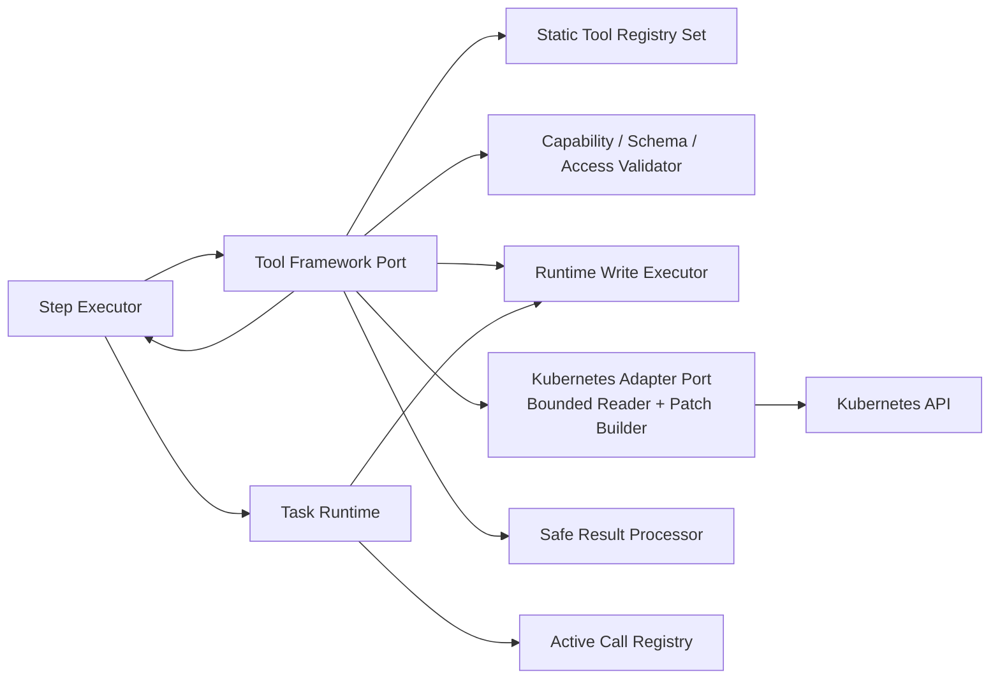
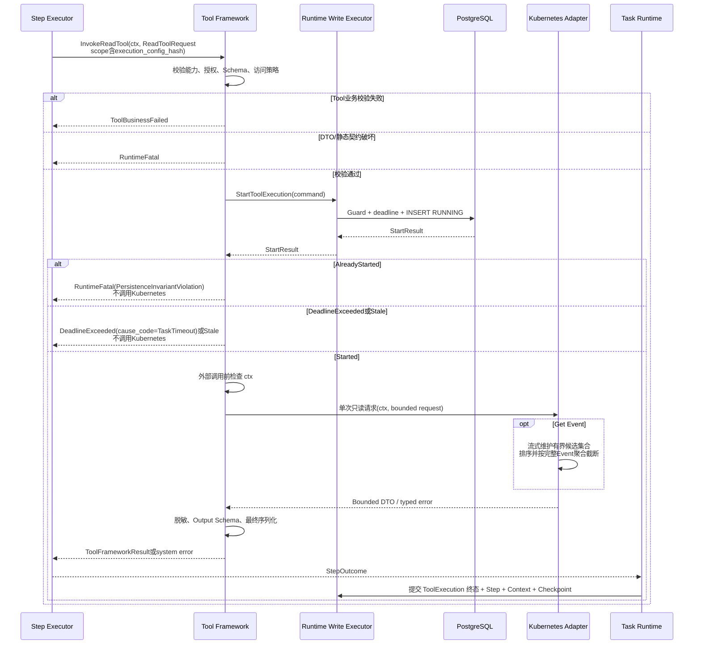
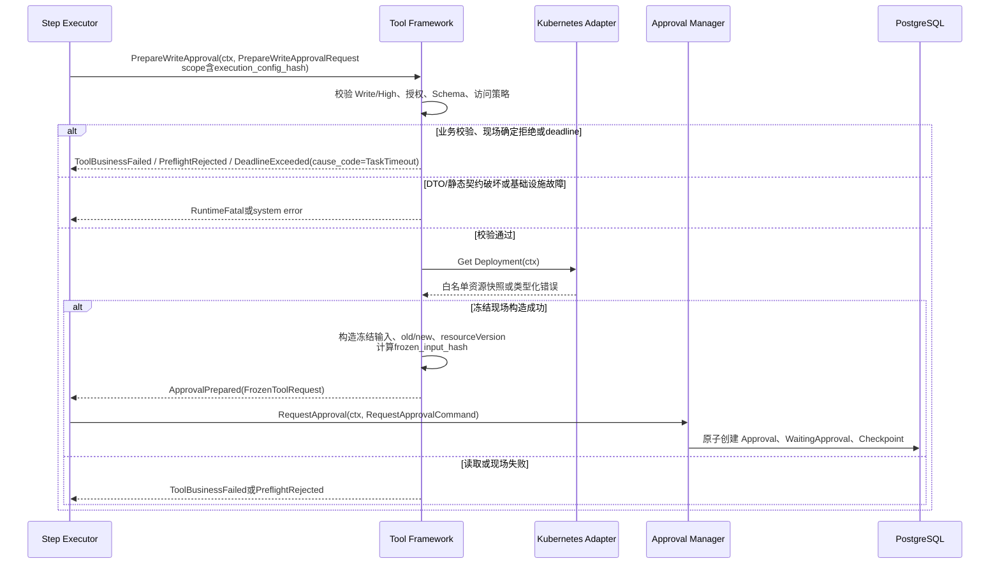
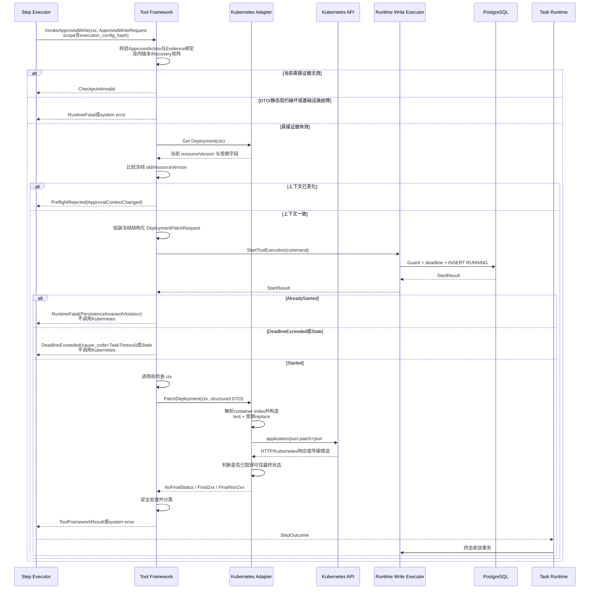
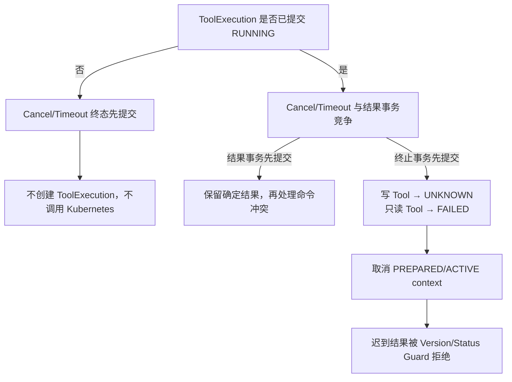
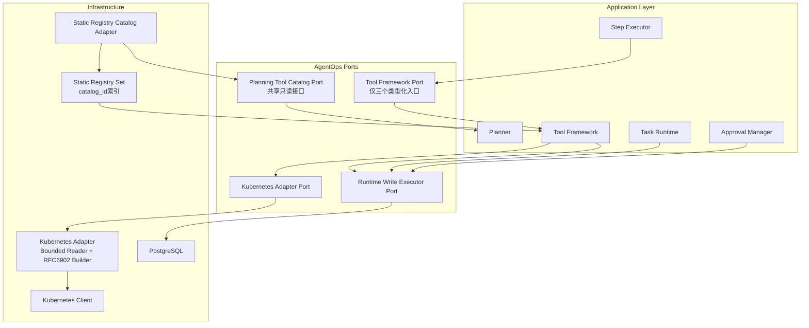
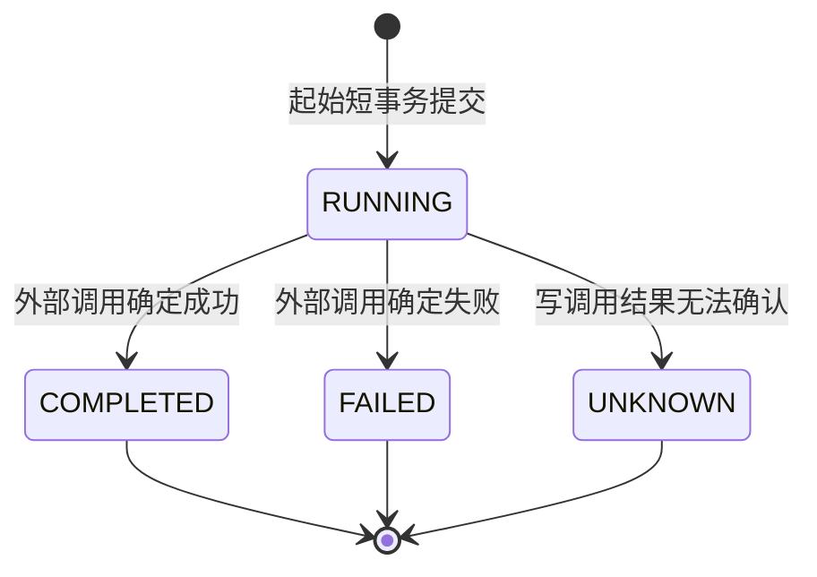
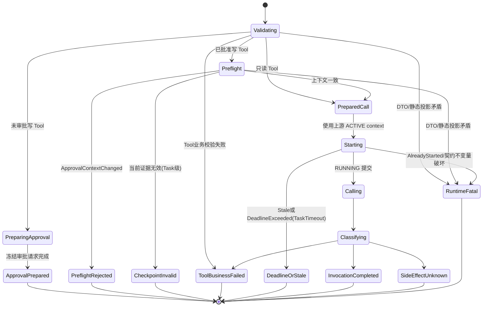
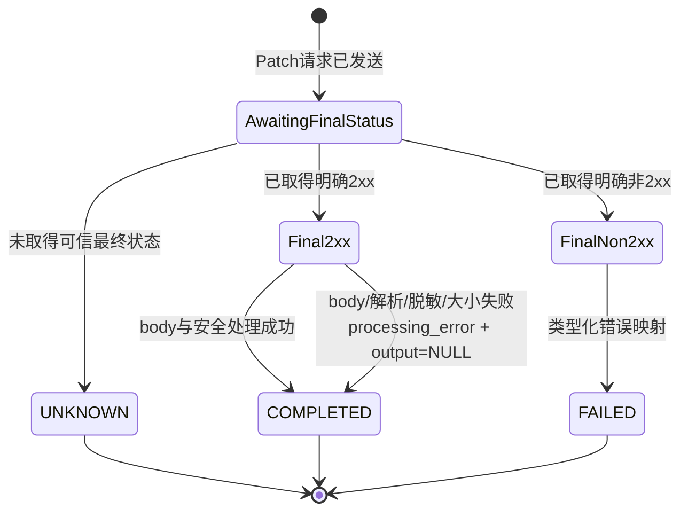

# Tool Framework 功能详细设计

> 文档版本：V1.14
> 适用范围：AgentOps MVP
> 需求基线：`docs/design/001-requirements.md`
> 架构基线：`docs/design/003-system-architecture-design.md`
> 相邻详细设计：Task Runtime V1.19、Worker V1.3、Planner V1.8、Step Executor V1.17、Checkpoint V1.8、Approval V1.13
> 编写规范：`docs/specs/005-detailed-design-guideline.md`
> 共享契约：`docs/design/002-shared-domain-contract.md` V1.1
> 文档状态：MVP 详细设计；Design Review 阻塞项已闭合
> 契约修订：P1-02：`ValidateCapability` 收回为 Tool Framework 内部纯函数；P1-03：冻结 ApprovedAction + ApprovedCheckpointEvidence 无重复证据契约；P1-04：冻结唯一 Planning Tool Catalog Port；P1：Catalog证据与完整execution_config_hash解耦并支持多个静态Agent

## 1. 功能概述

### 1.1 功能目标

Tool Framework 是应用层的 Tool 能力边界，为 Step Executor 提供稳定、类型化的 Tool 调用接口。MVP 目标如下：

> 跨模块契约说明：ExecutionScope、Planning Tool Catalog、Tool Framework公开请求/结果、ApprovedAction/Evidence、ToolExecution状态和公共错误字段以`docs/design/002-shared-domain-contract.md`为唯一规范来源。本文同名代码块和矩阵只说明Tool Framework实现及校验责任，不是第二份共享契约。

> 类型约束：三个 Tool 请求、ApprovedAction、ApprovedCheckpointEvidence、ToolExecution Repository DTO 的执行版本字段使用共享 `ExecutionVersion`；可空 source 使用 `*ExecutionVersion`。

- 维护进程启动时加载的静态 Tool Registry；
- 校验 Tool 是否存在、启用、属于 Agent 的 `allowed_tools`，以及风险等级和只读属性是否与调用入口一致；
- 按受限 JSON Schema 子集校验已经解析完成的 Tool 输入；
- 校验 Kubernetes cluster、namespace、replicas 和 image registry 等静态访问策略；
- 执行 Deployment、Pod、Event、Container Log 四类只读查询；
- 为 Deployment Patch 生成审批所需的冻结请求与资源快照；
- 在执行已批准 Patch 前复核资源上下文，并要求 Kubernetes Adapter 使用请求级 `resourceVersion` 原子前置条件；
- 通过 Runtime Write Executor 在外部调用前提交 `ToolExecution=RUNNING`；
- 在数据库事务之外调用 Kubernetes Adapter；
- 将调用结果分类为确定成功、确定失败、结果未知、截止时间已到或旧执行结果；
- 在结果交给 Task Runtime 前完成结构化筛选、大小限制和第一道脱敏；
- 保留 `context.Context` 的取消语义，不执行自动重试、自动回滚或自动副作用核验。

Tool Framework 不负责 Task、Run、Step 或 TaskExecution 的生命周期推进。它返回调用事实和安全结果，由 Task Runtime 在自己的短事务中完成 ToolExecution 终态、Step 结果、Run Context 和 Checkpoint 的一致性收敛。

### 1.2 使用场景

| 场景 | 调用入口 | Tool Framework 输出 |
|---|---|---|
| Planner 构造 Tool Catalog | Tool Catalog 只读投影 | 已启用且允许暴露的 Tool 定义 |
| Step Executor 分派并调用 Tool Step | 三个公开 Tool 入口之一 | 每个入口内部完成能力、静态定义和参数校验后返回封闭结果 |
| 执行只读 Tool | `InvokeReadTool(ReadToolRequest)` | `ToolFrameworkResult`或system error |
| 高风险写 Tool 进入审批 | `PrepareWriteApproval(PrepareWriteApprovalRequest)` | `ApprovalPrepared(FrozenToolRequest)`或其他封闭分支/system error |
| Approval 后执行 Patch | `InvokeApprovedWrite(ApprovedWriteRequest)` | `ToolFrameworkResult`或system error |
| Cancel、Timeout 或 Runtime 关闭 | 调用 context 被取消 | 尽力停止外部调用并返回类型化结果 |
| Runtime 重启发现遗留调用 | 不调用 Tool Framework | StartupCleanup 根据持久化事实分类 |

### 1.3 涉及模块

| 模块 | 关系 | 职责 |
|---|---|---|
| Step Executor | 唯一业务调用方 | 解析 Step 输入，携带授权投影和执行范围，解释类型化结果 |
| Tool Framework | 本设计范围 | Registry、校验、ToolExecution 起始边界、调用与结果分类 |
| Planning Tool Catalog Provider | Registry 的只读投影 | 实现共享 `PlanningToolCatalogPort`，向 Planner 提供版本化 Tool 定义，不暴露执行能力 |
| Runtime Write Executor | 写端口 | 通过持有 advisory lock 的单连接串行提交短事务 |
| Task Runtime | 结果收敛方 | 持久化 ToolExecution 终态、Step、Run Context 和 Checkpoint |
| Approval Manager | 审批事务 Owner | 创建、批准或拒绝 Approval，并推进 WaitingApproval |
| Kubernetes Adapter | 基础设施端口实现 | 将 AgentOps 请求转换为 Kubernetes API 请求 |
| Active Call Registry | Runtime 进程内设施 | 由 Task Runtime 在 Step 动作开始前预登记、激活和取消句柄；Tool Framework 只传播同一个 context |
| Report Manager | 下游读取方 | 从持久化 ToolExecution 等领域事实生成报告 |

### 1.4 职责边界

Tool Framework 负责：

1. 静态 Registry 的加载、冻结和启动校验；
2. Tool 能力、授权、Schema 和 Kubernetes 访问策略校验；
3. 生成审批所需的冻结请求；
4. 校验当前 Recovery Start Checkpoint 直接引用的 Approved Approval；
5. 校验写 Tool 的冻结参数和资源上下文，并向 Kubernetes Adapter 传递不可变的结构化 Patch DTO；
6. 通过 Runtime Write Executor 创建当前 execution_version 的 `ToolExecution=RUNNING`；
7. 在事务外调用 Kubernetes Adapter；
8. 将外部调用结果转换为 AgentOps 自有结果类型；
9. 对可持久化结果执行安全字段检查、最终大小限制和第一道脱敏；Event 的有界排序与聚合截断由 Adapter 唯一负责；
10. 记录由本模块拥有的 `ToolRequested` 附属日志。

Tool Framework 不负责：

- 创建或推进 Task、Run、Plan、Step 和 TaskExecution；
- 决定是否需要 Approval，或创建、批准、拒绝 Approval；
- 解析 `step.output.xxx` 引用；
- 根据运行时配置重新构造 `allowed_tools`；
- 创建 Checkpoint 或决定 Recover 策略；
- 持久化 ToolExecution 的最终状态；
- 生成 Report；
- 自动重试、Fallback、回滚、协调或 Exactly-once；
- 动态注册 Tool、在线修改 Tool 或 Tool 版本治理；
- 读取 Kubernetes Secret；
- 执行通用 JSON Patch、Merge Patch 或完整资源替换；
- 构造 RFC 6902 operations、解析容器数组下标、转义 JSON Pointer 或设置 Patch content-type；这些最终请求职责属于 Kubernetes Adapter。

### 1.5 事务 Owner

| 事实 | 唯一 Owner | Tool Framework 行为 |
|---|---|---|
| ToolExecution `RUNNING` 创建 | Tool Framework | 在 Tool 起始短事务中创建 |
| ToolExecution `COMPLETED/FAILED/UNKNOWN` | Task Runtime | 返回结果，不直接提交终态 |
| Step `Pending → Running` | Task Runtime | 仅校验已为 Running |
| Step 终态 | Task Runtime | 返回结果，不推进 Step |
| Approval 与 WaitingApproval | Approval Manager | 只生成 `FrozenToolRequest` |
| Checkpoint | Task Runtime / Checkpoint Manager | 只读取当前版本直接证据 |
| TaskLog `ToolRequested` | Tool Framework | RUNNING 提交后按附属日志策略记录 |
| TaskLog `ToolCompleted/ToolFailed/ToolResultUnknown` | Task Runtime | Tool Framework 不重复记录 |

### 1.6 MVP 范围与明确限制

MVP 仅包含：

- 四类只读 Kubernetes Tool；
- 一个受限的 Deployment Patch Tool；
- 静态 Tool Registry 和静态访问策略；
- 单 Runtime Instance、单 Worker、单 PostgreSQL；
- 每个逻辑 Tool 动作有限且固定的 Kubernetes API 请求次数；
- 写 Tool 不提供 exactly-once 保证。

MVP 不包含：

- Kubernetes Secret、Exec、Port Forward、Watch；
- 通用 Kubernetes CRUD；
- 自动分页、持续日志、Informer 或本地资源缓存；
- Tool 自动重试、自动故障转移、自动回滚；
- UNKNOWN 自动核验或自动重放；
- 多集群动态发现、动态凭据管理或 Tool 管理 API；
- 插件市场、脚本 Tool、远程 Tool Server；
- 非 Kubernetes Tool；
- 对 Kubernetes rollout 健康状态的持续等待。

## 2. 业务流程

### 2.1 模块主流程



### 2.2 只读 Tool 正常流程



任何 Guard 失败、deadline 已到或 context 已取消的请求均不得调用 Kubernetes。外部调用不在数据库事务内执行。

### 2.3 高风险 Tool 审批准备流程



审批准备阶段不创建 ToolExecution，不调用 Patch。资源 GET 仅用于形成审批上下文，不提供最终并发正确性保证。

### 2.4 已批准 Deployment Patch 流程



Kubernetes Adapter 生成的 Patch 请求必须携带对 `/metadata/resourceVersion` 的 JSON Patch `test` 操作。Tool Framework 不生成或传递 Patch operations。调用前 GET 只用于尽早失败，不能替代 Adapter 的请求级原子保护。

### 2.5 Cancel、Timeout 与迟到结果



写 Tool 已进入 RUNNING 后，即使本地 context 取消成功，也不能证明 Kubernetes 未收到请求。无法取得并提交确定结果时必须使用 `UNKNOWN` 和 `side_effect_unknown=true`。

## 3. 模块设计

### 3.1 模块定位



Static Registry Catalog Adapter 向 Planner 暴露的 Planning Tool Catalog Port 仅是不可变定义投影。Tool Framework 是 Registry Owner；Planner 不读取 Registry，也不依赖 Tool Framework 的三个执行入口。Catalog Adapter 不回调 Planner、Step Executor 或 Task Runtime，因此不形成反向依赖。

### 3.2 内部组成

| 组件 | 职责 | 是否持久化 |
|---|---|---|
| Static Registry Set | 按catalog_id加载、冻结和查询一个或多个Tool Registry | 否 |
| Static Registry Catalog Adapter | 实现唯一只读 Planning Tool Catalog Port，生成版本化规划投影 | 否 |
| Capability Validator | 校验 enabled、allowed_tools、risk、read_only | 否 |
| Input Schema Validator | 校验受限 JSON Schema 和实际输入 | 否 |
| Kubernetes Access Policy | 校验 cluster、namespace、replicas、image registry | 否 |
| Read Tool Runner | 组织单次只读调用 | 仅创建 RUNNING |
| Approval Request Preparer | 读取资源并生成冻结审批请求 | 否 |
| Approved Write Runner | 复核审批证据和资源上下文，执行原子 Patch | 仅创建 RUNNING |
| Safe Result Processor | 白名单、大小限制、脱敏 | 否 |
| Kubernetes Adapter | Kubernetes SDK 类型隔离、有界流式读取、最终 RFC 6902 构造 | 否 |

### 3.2.1 Planning Tool Catalog Port

> Selector、Snapshot、CatalogSnapshotHash和Owner的唯一契约见共享契约第5.6节；本节只说明Adapter实现。

Planning Tool Catalog Port 是共享契约第5.6节定义、Tool Framework 拥有实现、Planner 消费的唯一只读 Catalog 接口，与第3.3节三个 Tool 执行入口相互独立：

```go
type PlanningToolCatalogPort interface {
	LoadPlanningToolSnapshot(
		ctx context.Context,
		selector PlanningToolCatalogSelector,
	) (PlanningToolSnapshot, error)
}
```

#### Request DTO

```go
type PlanningToolCatalogSelector struct {
	CatalogID               string
	AllowedTools            []string
	ExpectedRegistryVersion string
	ExpectedSnapshotHash    CatalogSnapshotHash
}

type CatalogSnapshotHash string
```

`CatalogSnapshotHash` 的零值非法，只允许64位小写十六进制SHA-256结果。它与 Task Runtime 的 `ExecutionConfigHash` 是不同强类型，禁止相互赋值或转换后比较。

| 字段 | 必填 | 规则 |
|---|---|---|
| `catalog_id` | 是 | 选择启动时已冻结的静态Registry；多个Agent可以共享或使用不同值 |
| `allowed_tools` | 是 | 非 `nil`；元素非空、唯一，最多32项；空但非 `nil` 合法 |
| `expected_registry_version` | 是 | 当前静态Agent配置冻结的目标Registry版本 |
| `expected_snapshot_hash` | 是 | Tool Framework按本selector所选投影生成的Catalog专用hash |

Selector不包含task_id、run_id、agent_id、execution_version、worker_id、事务句柄或完整execution_config_hash。Task Runtime从当前静态Agent配置投影该selector；Catalog Adapter不得读取Agent的system prompt、model config或TaskExecution，也不得按execution_config_hash选择Registry。

#### Response DTO

以下代码块是共享契约第5.6节类型在 Tool Framework 中的实现投影；Planner 和 Fake 直接依赖共享类型，不复制本地类型：

```go
type PlanningToolSnapshot struct {
	SchemaVersion   uint32
	RegistryVersion string
	SnapshotHash    CatalogSnapshotHash
	Tools           []PlanningToolSpec
}

type PlanningToolSpec struct {
	ToolName    string
	Description string
	InputSchema CanonicalJSONSchema
	Capability  PlanningToolCapability
	Enabled     bool
}

type PlanningToolCapability struct {
	Kind      ToolCapabilityKind
	RiskLevel RiskLevel
	ReadOnly  bool
}
```

| 字段 | 冻结规则 |
|---|---|
| `schema_version` | 固定 `1`，线协议名为 `agentops.planning-tool-snapshot/v1` |
| `registry_version` | 非空；由selector所选不可变Registry提供 |
| `snapshot_hash` | 64位小写十六进制；覆盖完整响应投影 |
| `tools` | 与 `allowed_tools` 集合精确相等，按 `tool_name` Unicode code point 升序，无重复 |
| `tool_name` | Registry 中的稳定唯一名称 |
| `description` | 非空、已通过启动安全校验的模型可见描述 |
| `input_schema` | 共享受限 Schema 的规范化 JSON 值 |
| `capability` | 包含 `kind`、`risk_level`、`read_only`，均来自同一静态 Tool Definition |
| `enabled` | 成功快照中固定为 `true` |

投影为全有或全无，不返回 disabled Tool、未请求 Tool、凭证、endpoint、Kubernetes Client 或执行策略内部对象。

`snapshot_hash` 是Catalog专用证据，不是execution_config_hash。它固定为 `lower-hex(SHA-256(RFC8785-JCS(payload)))`；payload包含`schema_version`、`catalog_id`、`registry_version`和排序后的`tools`，不包含`snapshot_hash`自身。全部字段必填且禁止null，空Tool集合编码为`[]`。Tool Framework是该hash的计算Owner；Planner只使用共享纯验证函数复核响应，不把该算法用于完整Agent配置。

#### Error 分支

```go
type PlanningToolCatalogErrorKind string

const (
	PlanningToolNotFound             PlanningToolCatalogErrorKind = "ToolNotFound"
	PlanningToolDisabled             PlanningToolCatalogErrorKind = "ToolDisabled"
	PlanningToolDuplicate            PlanningToolCatalogErrorKind = "DuplicateTool"
	PlanningToolConfigInvalid        PlanningToolCatalogErrorKind = "ToolConfigInvalid"
	PlanningToolConfigVersionMismatch PlanningToolCatalogErrorKind = "ConfigVersionMismatch"
	PlanningToolRuntimeFatal         PlanningToolCatalogErrorKind = "RuntimeFatal"
)
```

| 分支 | 唯一语义 |
|---|---|
| `ToolNotFound` | 请求名称不在 Registry |
| `ToolDisabled` | 请求名称存在但 disabled |
| `DuplicateTool` | `allowed_tools` 存在重复；不得静默去重 |
| `ToolConfigInvalid` | Tool 名称、描述、Schema、Capability、Registry 版本或快照规范非法 |
| `ConfigVersionMismatch` | selector预期registry_version或snapshot_hash与所选Registry实际投影不一致 |
| `RuntimeFatal` | catalog_id对应Registry在启动后不可读取、实现出现不可能状态或其他Runtime内部不变量破坏 |

错误通过 `error` 返回，必须可由 `errors.As` 得到稳定 `kind`、可选 `tool_name` 与安全 `cause_code`；禁止字符串匹配。成功快照与 error 严格互斥，任一 Tool 失败均不返回部分快照。`context.Canceled` 和 `context.DeadlineExceeded` 保留 `errors.Is` 语义，不包装成上述配置错误。

#### Owner 与调用规则

- Tool Framework 是一个或多个 Static Registry 的 Owner；Static Registry Catalog Adapter 是该 Port 的唯一生产实现；
- Adapter维护按catalog_id索引的不可变Registry集合；共享Catalog的Agent引用同一catalog_id，独立Catalog使用不同catalog_id；
- Adapter只读取selector所选Registry，不访问数据库、Kubernetes、Agent system prompt、model config、当前热配置或Tool执行状态；
- Adapter计算Catalog专用snapshot_hash，但不接收、读取、计算或比较execution_config_hash；
- Planner 只能调用本 Port，不得读取 Registry、调用 `validateCapability` 或调用第3.3节执行入口；
- 输入顺序不影响输出；相同catalog_id、registry_version和allowed_tools集合必须得到字节一致的规范化payload与snapshot_hash；
- 两个Agent即使完整execution_config_hash不同，只要selector相同就必须获得同一快照；
- Runtime配置漂移必须由新Runtime Instance重新完成启动装配，禁止在现有Adapter中热替换Registry。

### 3.3 Tool Framework Port

> 三个执行方法、共享请求和结果分支的唯一契约见共享契约第7.1节。

Step Executor 依赖 AgentOps 自有的 Tool Framework Execution Port。三个 Tool 调用方法只接受共享类型化请求 DTO，不接受散列的 scope、授权、输入或 Approval 参数：

| 方法 | 输入 | 输出 |
|---|---|---|
| `InvokeReadTool` | context、`ReadToolRequest` | `ToolFrameworkResult` 或 system error |
| `PrepareWriteApproval` | context、`PrepareWriteApprovalRequest` | `ToolFrameworkResult` 或 system error |
| `InvokeApprovedWrite` | context、`ApprovedWriteRequest` | `ToolFrameworkResult` 或 system error |

Go Port 契约等价于：

```go
type ToolFrameworkPort interface {
	InvokeReadTool(
		ctx context.Context,
		request ReadToolRequest,
	) (ToolFrameworkResult, error)

	PrepareWriteApproval(
		ctx context.Context,
		request PrepareWriteApprovalRequest,
	) (ToolFrameworkResult, error)

	InvokeApprovedWrite(
		ctx context.Context,
		request ApprovedWriteRequest,
	) (ToolFrameworkResult, error)
}
```

`ReadToolRequest`、`PrepareWriteApprovalRequest`、`ApprovedWriteRequest`、`ToolFrameworkResult` 及全部结果分支只在共享契约第7.1节定义一次。Tool Framework 实现该 Port；Step Executor 直接依赖共享定义，不得声明结构相同的本地副本、使用 `map[string]any` 代替 DTO，或增加兼容散列参数的重载方法。

Tool Framework Execution Port 到此闭合：不得增加 `ValidateCapability`、预校验捷径或只返回 Capability 的第四个执行方法。第3.2.1节 Planning Tool Catalog Port 是独立只读接口，不属于执行 Port，也不允许执行 Tool。`ToolCapabilityRequest` 和 `ToolFrameworkError` 不属于公开契约，也不得由 Step Executor、Planner、Approval 或 Fake 引用。

约束：

- 所有可能阻塞的方法必须接收并传播调用方 context；
- Port 不暴露 Kubernetes SDK、HTTP Client、数据库实体或 Repository 类型；
- 业务拒绝、CheckpointInvalid 和可分类 Runtime Fatal 通过 `ToolFrameworkResult` 的封闭分支返回；
- 数据库连接、事务提交结果不确定或其他无法构造可信类型化结果的基础设施故障使用独立 `error` 通道；
- 返回结果与 error 严格互斥：类型化结果非空时 error 必须为空，error 非空时结果必须为空；
- Port 调用一次代表一个逻辑 Tool 动作，不代表单个 Kubernetes API 请求。

Port 的结果和错误边界必须区分：

- 成功：`InvocationCompleted` 或 `ApprovalPrepared`；
- 调用边界前现场拒绝：`PreflightRejected`；
- Tool 业务失败：`ToolBusinessFailed`；
- 写 Tool 结果未知：`SideEffectUnknown`；
- Task 级错误：`CheckpointInvalid`；
- 合法竞争和截止时间：`Stale`、`DeadlineExceeded(cause_code=TaskTimeout)`；
- 可分类 Runtime Fatal：`RuntimeFatal`；
- 无法形成可信结果的基础设施故障：独立 system error。

调用方不得把 `RuntimeFatal` 转换为业务 `Failed`，不得把 `CheckpointInvalid` 升级为 Runtime 关闭，也不得把 `ToolBusinessFailed` 或 Report 无关的单 Tool 失败当作 system error。

### 3.4 请求契约

#### 3.4.1 ExecutionScope

> 唯一类型定义见共享契约第4节；本节只列Tool Framework使用约束。

本节只引用共享契约第4节定义、由 Task Runtime 唯一构造的共享类型，Tool Framework 不声明本地副本。

| 字段 | 说明 |
|---|---|
| `task_id` | Task 标识 |
| `run_id` | Run 标识 |
| `execution_version` | 当前 TaskExecution 版本 |
| `execution_config_hash` | 必填；当前 TaskExecution 已通过配置、Execution、Checkpoint 三方门禁的配置摘要，固定为64个小写十六进制字符 |
| `step_id` | 当前 Step 标识 |
| `worker_id` | 当前 Runtime 进程实例标识 |
| `deadline_at` | 数据库持久化的 Task 截止时间 |

Tool Framework 对 Scope 只做必填、格式和请求内交叉一致性校验，不计算 hash、不查询配置重新生成、不补默认值、不修改该字段。请求执行期间必须保持 Scope 整值不变。

#### 3.4.2 AgentAuthorization

| 字段 | 说明 |
|---|---|
| `agent_id` | Task 创建时冻结的 Agent 标识 |
| `allowed_tools` | 与 `execution_config_hash` 对应的不可变 Tool 名称集合 |

`AgentAuthorization` 必须由 Task Runtime 在 Claim 或 Recover 的三方 hash 门禁通过后，从计算该 `execution_config_hash` 的同一不可变 `ExecutionConfigV1.agent` 构造并传入。数据库只保存 hash，不保存完整配置快照；实现不得尝试从数据库加载不存在的“持久化配置”。Tool Framework 不得按 `agent_id` 重新加载当前配置，避免旧 Task 被新配置改变权限语义。

#### 3.4.3 ReadToolRequest

| 字段 | 类型 | 约束 |
|---|---|---|
| `scope` | `ExecutionScope` | 必填，包含当前 task/run/version/config hash/step/worker/deadline |
| `authorization` | `AgentAuthorization` | 必填，来自当前 execution_config_hash 对应配置实例 |
| `tool_name` | ToolName | 必填，必须与 Step 和 Tool Definition 一致 |
| `resolved_input` | ResolvedToolInput | 必填，已经完成引用解析和结构校验 |
| `tool_definition` | StaticToolDefinition | 必填，当前不可变静态投影 |

该 DTO 是 `InvokeReadTool` 的唯一输入，禁止改为 `InvokeReadTool(ctx, scope, authorization, input, ...)`。

#### 3.4.4 PrepareWriteApprovalRequest

| 字段 | 类型 | 约束 |
|---|---|---|
| `scope` | `ExecutionScope` | 必填，包含当前 task/run/version/config hash/step/worker/deadline |
| `authorization` | `AgentAuthorization` | 必填 |
| `tool_name` | ToolName | 必填 |
| `resolved_input` | ResolvedToolInput | 必填，已经完成引用解析 |
| `tool_definition` | StaticToolDefinition | 必填，必须是 High/write |

该请求不携带 Approval。成功时固定返回 `ToolFrameworkResult.ApprovalPrepared{frozen_tool_request}`，不得直接把 `FrozenToolRequest` 作为方法返回值。

#### 3.4.5 ApprovedWriteRequest

> ApprovedAction与ApprovedCheckpointEvidence唯一字段集合见共享契约第7.2节；本节只说明Tool Framework校验矩阵。

采用方案 B：保留 `ApprovedAction + ApprovedCheckpointEvidence`。两者职责互斥：

- `ApprovedAction` 只描述“哪一条不可变 Approval 批准了什么动作”；
- `ApprovedCheckpointEvidence` 只描述“当前版本最新 Checkpoint 如何授权执行该 Approval”；
- 当前 TaskExecution 的版本、worker、deadline 和配置 hash 只由 `ExecutionScope` 表达，不复制到第三个 DTO。

| 字段 | 类型 | 约束 |
|---|---|---|
| `scope` | `ExecutionScope` | 必填，包含当前 task/run/version/config hash/step/worker/deadline |
| `authorization` | `AgentAuthorization` | 必填 |
| `approved_action` | `ApprovedAction` | 必填，只由不可变 Approval 构造 |
| `checkpoint_evidence` | `ApprovedCheckpointEvidence` | 必填，只由当前版本最新有效 Checkpoint 构造 |
| `tool_definition` | `StaticToolDefinition` | 必填，必须是当前 execution_config_hash 对应的 High/write 投影 |

`ApprovedAction` 的唯一字段集合：

| 字段 | 唯一来源 |
|---|---|
| `approval_id` | `Approval.approval_id` |
| `approval_execution_version` | `Approval.execution_version` |
| `approval_status` | `Approval.status`，固定为 `Approved` |
| `execution_config_hash` | `Approval.execution_config_hash` |
| `frozen_input_hash` | `Approval.frozen_input_hash` |
| `task_id`、`run_id`、`step_id`、`tool_name` | Approval 不可变归属字段 |
| `frozen_input` | `Approval.tool_input` |
| `observed_values` | `Approval.observed_values` |
| `resource_version` | `Approval.resource_version` |

`ApprovedAction` 不得携带 checkpoint_id、checkpoint_type、当前 Checkpoint execution_version 或 Recovery source 字段。

`ApprovedCheckpointEvidence` 的唯一字段集合：

| 字段 | 必填 | 唯一来源 |
|---|---:|---|
| `checkpoint_id` | 是 | 当前版本最新有效 `Checkpoint.checkpoint_id` |
| `approval_id` | 是 | 当前 `Checkpoint.runtime_context.approval_context.approval_id`，用于绑定 ApprovedAction |
| `execution_version` | 是 | 当前 `Checkpoint.execution_version` |
| `checkpoint_type` | 是 | Checkpoint Manager 从不可变字段推断的 `APPROVED_CONTINUATION` 或 `RECOVERY_START` |
| `source_execution_version` | 仅 Recovery | 当前 Recovery Start Checkpoint 顶层字段；同版本必须为空 |
| `source_checkpoint_id` | 仅 Recovery | 当前 Recovery Start Checkpoint 顶层字段；同版本必须为空 |
| `execution_config_hash` | 是 | 当前 `Checkpoint.execution_config_hash` |
| `frozen_input_hash` | 是 | 当前 `Checkpoint.runtime_context.approval_context.frozen_input_hash` |

`ApprovedCheckpointEvidence` 不携带完整冻结输入、observed_values、resourceVersion、task/run/step/tool、Approval 状态或 worker_id。`approval_id` 与 `frozen_input_hash` 是跨 DTO 绑定键，不是第二份业务内容。

三类持久化事实到请求 DTO 的唯一映射：

| 持久化来源 | 请求投影 |
|---|---|
| Approval | `ApprovedAction` |
| 当前版本最新有效 Checkpoint | `ApprovedCheckpointEvidence` |
| 已通过门禁的当前 TaskExecution，以及Task/Step关联事实 | `ExecutionScope` |

Task Runtime 是三个投影的组装者；Step Executor 只校验并转发，Tool Framework 只消费和复核。任何模块不得用 Approval 推导 checkpoint source，也不得用 Checkpoint 中复制的冻结输入代替 Approval 构造 ApprovedAction。

`frozen_input_hash` 为必填证据。其输入是版本化 `FrozenApprovedToolInputV1{tool_name,tool_input,observed_values,resource_version}`，使用 AgentOps 共享规范 JSON 规则编码后计算 SHA-256，并编码为 64 个小写十六进制字符。AgentOps 共享 Tool 契约包只提供一个纯函数 `ComputeFrozenInputHashV1` 和固定测试向量；它不是 Tool Framework Port 方法，也不读取数据库或配置。Tool Framework 在生成 FrozenToolRequest 时计算，Approval Manager 在保存前复核并持久化，Checkpoint Manager 只从持久化 Approval 复制并验证。

固定测试向量的规范字节无 BOM、空白或结尾换行：

```json
{"schema":"agentops.frozen-approved-tool-input","version":1,"tool_name":"k8s.patch_deployment","tool_input":{"cluster":"prod","deployment":"web","namespace":"default","replicas":3},"observed_values":{"replicas":2},"resource_version":"12345"}
```

期望摘要为 `c33d13c983cc54ab1c906c40004b9c2a3ca2efba506ae8db4a12ddca1f4c70f4`。顶层字段按上述顺序编码，`tool_input` 与 `observed_values` 的动态对象 key 按 UTF-8 字节升序排列，其余数值和字符串规则复用 AgentOps 规范 JSON。

跨 execution_version 执行只能使用当前版本 Recovery Start Checkpoint 直接引用的不可变 Approved Approval。Tool Framework 不递归遍历历史 Checkpoint 链，也不复制 Approval。

`ApprovedWriteRequest` 进入 Tool Framework 前，Task Runtime 与 Step Executor 必须已经依据持久化事实验证：

- 同版本继续：Evidence 类型为 `APPROVED_CONTINUATION`、source 两字段为空、`ApprovedAction.approval_execution_version=Evidence.execution_version=scope.execution_version`；
- Recover 后继续：Evidence 类型为 `RECOVERY_START`、source 两字段同时存在、`Evidence.execution_version=scope.execution_version`、`source_execution_version=scope.execution_version-1`；连续 Recover 时 Approval 原始版本允许小于 source version；
- 两条路径都要求 `ApprovedAction.approval_id=Evidence.approval_id`、两个 `frozen_input_hash` 相等；
- 两条路径都要求 `ApprovedAction.execution_config_hash=Evidence.execution_config_hash=scope.execution_config_hash`；该 scope hash 来自当前已通过门禁的 TaskExecution；
- Approval hash 不得由进程内 FrozenToolRequest、API 请求或当前配置重新提供。

错误作用域冻结为：

- 当前最大 Checkpoint 缺失、结构无效、Evidence 缺少合法 Recovery source 或不能证明直接引用 Approval：`CheckpointInvalid`；
- Task Runtime/Step Executor 已宣称校验通过，但 `ApprovedAction` 与 Evidence 的 approval_id、frozen_input_hash、execution_config_hash、版本模式或归属字段互相矛盾：`RuntimeFatal(STEP_EXECUTOR_CONTRACT_BROKEN)`；
- scope 与数据库当前 execution_version/worker/status 因合法并发变化：`Stale`；
- 静态 Tool Definition 与同一 execution_config_hash 的 Registry 投影矛盾：`RuntimeFatal(RUNTIME_STATIC_TOOL_SNAPSHOT_INCONSISTENT)`。

以上失败均不得创建 ToolExecution、不得调用 Kubernetes；Tool Framework 不负责修改 Approval、Checkpoint 或决定 Task 终态。

共享请求DTO的Go形状等价于：

```go
type ReadToolRequest struct {
	Scope          ExecutionScope
	Authorization  AgentAuthorization
	ToolName       ToolName
	ResolvedInput  ResolvedToolInput
	ToolDefinition StaticToolDefinition
}

type PrepareWriteApprovalRequest struct {
	Scope          ExecutionScope
	Authorization  AgentAuthorization
	ToolName       ToolName
	ResolvedInput  ResolvedToolInput
	ToolDefinition StaticToolDefinition
}

type ApprovedWriteRequest struct {
	Scope              ExecutionScope
	Authorization      AgentAuthorization
	ApprovedAction     ApprovedAction
	CheckpointEvidence ApprovedCheckpointEvidence
	ToolDefinition     StaticToolDefinition
}

type ApprovedAction struct {
	ApprovalID              ApprovalID
	ApprovalExecutionVersion ExecutionVersion
	ApprovalStatus          ApprovalStatus
	ExecutionConfigHash     ExecutionConfigHash
	FrozenInputHash         FrozenInputHash
	TaskID                  TaskID
	RunID                   RunID
	StepID                  StepID
	ToolName                ToolName
	FrozenInput             FrozenToolInput
	ObservedValues          ObservedValues
	ResourceVersion         ResourceVersion
}

type ApprovedCheckpointEvidence struct {
	CheckpointID          CheckpointID
	ApprovalID            ApprovalID
	ExecutionVersion      ExecutionVersion
	CheckpointType        ApprovedCheckpointType
	SourceExecutionVersion *ExecutionVersion
	SourceCheckpointID    *CheckpointID
	ExecutionConfigHash   ExecutionConfigHash
	FrozenInputHash       FrozenInputHash
}

type ApprovedCheckpointType string

const (
	ApprovedContinuation ApprovedCheckpointType = "APPROVED_CONTINUATION"
	RecoveryStart        ApprovedCheckpointType = "RECOVERY_START"
)
```

字段类型也是共享Port契约的一部分；实现不得用数据库实体、Kubernetes SDK类型或`any`替代。

`ApprovedCheckpointType` 是封闭枚举，只允许 `APPROVED_CONTINUATION` 和 `RECOVERY_START`。两个 source 字段必须同时为空或同时非空。

### 3.5 内部能力校验纯函数

`validateCapability` 是 Tool Framework 包内不可导出的纯函数，不是 Port 方法。三个公开入口在执行数据库事务或 Kubernetes 调用前，分别从自身公开请求 DTO 构造内部输入并调用它。

内部概念签名：

```go
func validateCapability(
	input capabilityValidationInput,
) (validatedToolCapability, *capabilityValidationFailure)
```

`capabilityValidationInput`、`validatedToolCapability` 和 `capabilityValidationFailure` 均是 Tool Framework 包内类型，不能出现在公开 Port、Adapter、Step Executor Fake 或跨模块 DTO 中。不得继续使用公开名称 `ToolCapabilityRequest` 或 `ToolFrameworkError`。

内部输入只包含本次公开 Request 已携带的不可变事实及 Runtime 启动时冻结的 Registry 投影：

- `ExecutionScope` 和 `AgentAuthorization`；
- 请求的 tool_name、调用模式和完整解析后参数；
- 请求携带的 `StaticToolDefinition`；
- 与同一 `ExecutionConfigV1` 对应的不可变 Registry 定义；
- 对已批准写入口，冻结 Approval 与 Checkpoint 直接证据。

纯函数职责固定为：

1. 校验 Tool Capability：存在、enabled、allowed_tools、risk_level、read_only 与调用模式一致；
2. 校验静态 Tool 定义：请求投影、Registry 投影和当前 execution_config_hash 对应的同一配置实例一致；
3. 校验 Tool 参数：输入 Schema、cluster、namespace、replicas、image registry 及入口专用冻结约束；
4. 成功返回内部 `validatedToolCapability`，供同一次公开入口调用继续使用；
5. 失败返回内部分类，由当前公开入口映射为其允许的 `ToolFrameworkResult` 分支。

该函数不得读取数据库、重新加载配置、调用 Kubernetes、写状态、启动 goroutine或产生外部副作用；相同输入必须得到相同结果。实际业务请求中的不存在、禁用和未授权分别映射为 `ToolBusinessFailed(ToolNotFound/ToolDisabled/ToolNotAuthorized)`；DTO 自相矛盾映射为 `RuntimeFatal(STEP_EXECUTOR_CONTRACT_BROKEN)`；不可变 Registry/静态投影矛盾映射为 `RuntimeFatal(RUNTIME_STATIC_TOOL_SNAPSHOT_INCONSISTENT)`。

Step Executor 继续按已持久化 `next_action` 选择三个公开入口之一；它不调用 `validateCapability`，也不根据内部校验结果重新推导 `next_action`。Planner 只使用 Tool Catalog Port 的只读投影，Approval 只消费冻结审批证据，二者同样不得调用该内部函数。

### 3.6 Static Tool Registry Set

Tool Framework在进程启动后持有不可变Registry集合，以非空且唯一的`catalog_id`索引。每个Registry有独立`registry_version`，每个Tool Definition包含：

- `name`；
- `description`；
- `capability_kind`；
- `input_schema`；
- `risk_level`；
- `read_only`；
- `timeout`；
- `enabled`。

启动校验必须保证：

- name 在同一catalog_id内非空且唯一；
- capability_kind 在同一catalog_id内属于MVP固定集合且唯一映射；
- Schema 属于共享受限子集；
- High 必须为写 Tool，Low 必须为只读 Tool；
- timeout 大于零且不超过 Runtime 允许上限；
- Tool 所需 cluster、namespace、replicas 和 image policy 已配置；
- `enabled=true` 的 Tool 能被 Kubernetes Adapter 支持；
- Tool Definition 的全部语义字段必须逐字段存在于Task Runtime共享`ExecutionConfigV1.tool_framework.tools`；Tool Framework不得自行追加hash输入。
- catalog_id与registry_version在Runtime Instance生命周期内不可修改；
- registry_version是非空、不透明的静态配置版本；任一Tool Definition字段增加、删除或变化都必须产生新registry_version；
- Catalog Adapter向Planning Tool Catalog Port投影时必须复用所选Registry的同一Tool Definition，不得维护Planner专用Registry副本；
- Tool Framework在静态配置加载阶段为每个Agent的`catalog_id + allowed_tools`生成独立`expected_snapshot_hash`绑定；Task Runtime只保存并投影该绑定，不计算Catalog hash；
- 多个Agent可以共享同一绑定，也可以绑定不同Registry；Agent的Prompt、Model或其他非Tool字段不得进入Catalog snapshot hash。

任一不变量失败时 Runtime 启动失败。MVP 不支持部分 Registry 降级运行。

### 3.7 Input Schema Validator

Tool Framework 与 Planner 共用受限 JSON Schema 契约，不维护第二套 Schema 方言：

- 根类型必须是 object；
- 支持 `object`、`array`、`string`、`number`、`integer`、`boolean`；
- 支持 `properties`、唯一 `required`、单一 `items`、`description`、受限 `nullable`；
- `additionalProperties` 必须缺省或为 false；
- 禁止 `$ref`、`oneOf`、`anyOf`、`allOf` 和 type 数组；
- 遵守 Planner 详细设计冻结的嵌套深度和字段数量上限。

Planner 对候选 Plan 的校验不能替代运行期校验。Tool Framework 必须对引用解析后的实际值重新校验类型、必填字段、额外字段和业务约束。

### 3.8 Kubernetes Access Policy

Access Policy 仅使用与当前 `execution_config_hash` 对应的静态策略投影，至少包含：

- 允许的 cluster；
- 每个 cluster 允许的 namespace；
- Deployment Patch 的 replicas 最小值和最大值；
- 允许的 image registry 前缀。

规则：

- 不在 allowlist 的 cluster 或 namespace 一律拒绝；
- replicas 策略缺失时禁止修改 replicas；
- image registry allowlist 为空时禁止修改 image；
- image 必须是可解析的非空镜像引用；先解析并规范化 registry host，再按静态 allowlist 的精确 host 或明确子域规则匹配，禁止直接对整条镜像字符串做不带边界的前缀比较；
- Kubernetes 名称必须符合对应资源名称规则；
- Namespace 必须显式提供，禁止默认到任意 namespace；
- 不允许 Tool 输入提供 kubeconfig、token、API Server 地址或任意 Patch 文档。

### 3.9 Kubernetes Adapter Port

Kubernetes Adapter Port 使用 AgentOps 自有类型，至少提供：

| 方法 | 输入 | 输出 | MVP 最大请求数 |
|---|---|---|---:|
| `GetDeployment` | `DeploymentGetRequest` | `BoundedDeploymentSnapshot` | 1 |
| `GetPods` | `PodListRequest` | `BoundedPodPage` | 1 |
| `GetEvents` | `EventListRequest` | `BoundedEventPage` | 1 |
| `GetContainerLogs` | `ContainerLogRequest` | `BoundedLogResult` | 1 |
| `PatchDeployment` | `DeploymentPatchRequest` | `PatchCallResult` | 1 |

边界：

- Adapter 内部封装 Kubernetes SDK 类型、StatusError 和 REST 配置；
- 所有方法必须使用收到的 context；
- Adapter 不创建脱离 context 的后台 goroutine；
- Adapter 不自动重试、不自动分页、不执行二次查询；
- Adapter 在原始响应完整物化前执行第 4.6 节的有界流式读取，并返回 AgentOps 白名单 DTO、截断元数据或稳定错误分类；
- 原始 Kubernetes 对象和原始响应不得穿透 Adapter；
- Kubernetes Client 的 SDK 级重试必须关闭，或配置为不会重放本设计的逻辑动作。

#### 3.9.1 Pod/Event 单页获取契约

- `GetPods` 和 `GetEvents` 固定设置 Kubernetes LIST `limit=200`；
- Pod 精确名称查询使用 `metadata.name` field selector；按标签查询只使用已经校验的单个 label selector；
- Event 使用目标对象 kind/name 的 field selector；
- Adapter 只读取第一页，`continue` 非空时绝不发起下一请求；
- 返回 DTO 必须携带 `server_page_item_count`、`returned_item_count`、`continue_present`、可选 `remaining_item_count`、`truncated`、可选 `original_count` 和原始字节计数；
- `continue` 非空时 `truncated=true`；
- `server_page_item_count=len(API Server本页items)`，不受 Adapter 有界候选淘汰影响；`returned_item_count` 是最终 DTO 保留项数；
- `original_count` 使用唯一三分支：`continue=false` 时等于 `server_page_item_count`；`continue=true` 且有 `remainingItemCount` 时等于 `server_page_item_count+remainingItemCount`；`continue=true` 且无 remainingItemCount 时为 NULL；
- Adapter 是 Event 单页排序与聚合截断的唯一 Owner；Tool Framework 不重新排序或选择 Event 项；
- Event 只对本次返回页排序，不承诺整个匹配集合的全局最新顺序。

固定 `limit=200`、不跟随 `continue` 是 MVP 冻结契约，不是可运行期调整的 Tool 输入。

Event 有界候选算法固定为：

1. Adapter 使用流式 decoder 逐个投影 Event，不完整物化整页 Kubernetes 对象；
2. 每个 Event 保留完整白名单 message，不在脱敏前截断单项文本；
3. 稳定排序键为 `last_timestamp DESC → metadata.creation_timestamp DESC → metadata.uid ASC → metadata.namespace ASC → metadata.name ASC`；缺失时间按最早时间处理，uid 仅用于进程内稳定选择，不进入输出；
4. Adapter 维护按该排序键有序的候选集合，每加入一项后按规范 JSON 编码大小检查预算；
5. Event 候选集合预算固定为 960 KiB，另保留 64 KiB 给页面 envelope、元数据和后续安全替换；
6. 超出候选预算时只淘汰排序最末端的完整较旧 Event，设置 `truncated=true`；
7. 单个白名单 Event 自身超过候选预算时返回 `StepOutputTooLarge`，不得保留部分 message；
8. 页面读取完成后，Adapter 按同一排序键输出候选集合；返回的 `BoundedEventPage` 必须不超过 1 MiB；
9. `continue`、原始字节超限或候选淘汰任一发生时，`truncated=true`。

Tool Framework 对 `BoundedEventPage` 只执行脱敏、安全检查、Output Schema 和最终规范序列化。若 Adapter 返回超过 1 MiB 或顺序不满足契约的 DTO，属于 Adapter Port 契约破坏；Tool Framework 不通过再次排序或删除 Event 掩盖该错误。

#### 3.9.2 Log 流式获取契约

- Adapter 直接流式读取日志响应体，不调用会将完整 body 物化为 `[]byte` 或 string 的便捷方法；
- 使用完整 UTF-8 行作为最小保留单位，以有界环形队列保留最新完整行；
- 响应累计原始字节数超过 1 MiB 时继续流式计数但不保留全部原文，淘汰最旧完整行并设置 `truncated=true`；
- 最终仍不得超过请求的 `tail_lines`，默认 200、最大 1000；
- 单行原始字节超过 1 MiB 时不保存部分行、不返回截断片段，停止调用并返回稳定 processing error `StepOutputTooLarge`；
- 完整读取成功时记录准确 `original_size` 和 `original_count`；因 context、I/O 或单行超限提前终止时无法确定的字段为 NULL。

#### 3.9.3 DeploymentPatchRequest

Tool Framework 只能传递不可变的 AgentOps 结构化 DTO：

- cluster、namespace、deployment；
- approved `resource_version`；
- 可选 approved replicas；
- 可选 approved `container_name` 和 image；
- Adapter 刚刚返回的有序 container-name 快照及其 `resource_version`。

DTO 不包含 JSON Patch operation、path、JSON Pointer、容器 index、content-type、原始 Patch 文档或完整 Deployment 对象。

Kubernetes Adapter 是最终 RFC 6902 请求的唯一 Owner。它必须：

1. 复核 DTO 字段组合与两个 resourceVersion 一致；
2. 根据有序 container-name 快照精确解析 container index；
3. 对内部生成的 JSON Pointer segment 执行 RFC 6901 转义；
4. 将 `/metadata/resourceVersion` 的 `test` 作为第一项 operation；
5. 仅为 approved replicas 和指定容器 image 生成 `replace`；
6. 将全部 operation 放在一个请求中；
7. 固定使用 `application/json-patch+json`；
8. 拒绝任何包含调用方 operation、path、index 或原始 Patch 文档的 DTO。

#### 3.9.4 Patch 响应事实契约

`PatchDeployment` 返回封闭的 `PatchCallResult`：

| 分支 | 判定 | 必要字段 | Tool Framework 映射 |
|---|---|---|---|
| `NoFinalStatus` | 未取得能够确认属于本次请求的最终 HTTP/Kubernetes 状态 | safe cause | `SideEffectUnknown` |
| `Final2xx` | 已取得本次请求的明确最终 2xx | status_code、可选 bounded body DTO、可选 processing_error | `InvocationCompleted` |
| `FinalNon2xx` | 已取得本次请求的明确最终非 2xx | status_code、类型化 Kubernetes error kind、可选安全元数据 | `ToolBusinessFailed` |

最终状态以 HTTP response headers 已取得、响应与本次未重试请求能够唯一关联为边界，不要求响应 body 已成功读取。Adapter 必须使用能够把 response status 与 body decode 分离的 Kubernetes REST/HTTP 调用方式。

- headers 前断连、TLS/DNS/连接失败或无法确认响应属于本次请求：`NoFinalStatus`；
- 明确 2xx 后 body 中断、解析失败或白名单投影失败：`Final2xx(processing_error=StepOutputInvalid)`；
- 明确 2xx 后大小处理失败：`Final2xx(processing_error=StepOutputTooLarge)`；
- 明确 2xx 后安全处理失败由 Tool Framework 保持 `InvocationCompleted(processing_error=ResultSanitizationFailed)`；
- 明确非 2xx 后，即使错误 body 为空、截断或解析失败，仍为 `FinalNon2xx`，按 status 和可用类型化字段保守映射；
- 不允许 Adapter 或 Tool Framework 因后续 body/安全处理把 `Final2xx` 或 `FinalNon2xx` 回退为 `NoFinalStatus`。Task Runtime 的 Cancel/Timeout 先提交竞态和写结果持久化失败仍按既有架构保留 UNKNOWN；这是持久化竞争或持久化失败，不是重新分类 HTTP 响应。

### 3.10 Runtime Write Executor Port

Tool Framework 通过 `StartToolExecution` 命令创建起始记录。命令包含：

- `ExecutionScope`；
- `tool_name`；
- `read_only`；
- 规范化后的冻结输入；
- 可选 `approval_id`；
- 当前数据库时间要求；
- 写 Tool 的冻结 `resource_version`。

事务必须按顺序完成：

1. 校验 Runtime 仍持有 advisory lock 写能力；
2. 锁定并校验 Task、TaskExecution 和 Step；
3. 匹配 `Task.current_execution_version`；
4. 匹配 TaskExecution 的 `worker_id`、`RUNNING` 和当前版本；
5. 校验 Task、Run 和 Step 均非终态，Step 为 `Running`；
6. 校验 Cancel 或 Timeout 尚未提交；
7. 使用数据库时间校验 `deadline_at > clock_timestamp()`；
8. 校验同一 `(task_id, execution_version, step_id)` 不存在 ToolExecution；
9. 写 Tool 额外校验当前 Checkpoint 直接引用的 Approved Approval 与冻结事实一致；
10. 插入当前版本 `ToolExecution=RUNNING`、冻结输入、`side_effect_unknown=false`、`started_at=database_now`；
11. 提交短事务。

返回类型：

- `Started(tool_execution_id)`；
- `DeadlineExceeded(cause_code=TaskTimeout)`；
- `Stale(reason_code)`；
- `AlreadyStarted(tool_execution_id)`，表示持久化不变量冲突，必须升级为 Runtime Fatal；
- system error，表示事务结果无法确认。

Tool Framework 不在该事务中调用 Kubernetes、写 TaskLog、执行脱敏或等待外部调用。

`AlreadyStarted` 的处理固定为：

- 不调用 Kubernetes；
- 不创建或覆盖第二条 ToolExecution；
- 不把既有记录转换为当前调用的业务结果；
- 返回 Runtime Fatal `PersistenceInvariantViolation`，Worker 停止新 Claim，Runtime Host 关闭当前实例；
- 下一 Runtime Instance 获取 advisory lock 后，由 StartupCleanup根据当前execution_config_hash对应Registry/Tool Definition的read/write属性，以及既有ToolExecution的状态和deadline收敛；ToolExecution本身不保存read_only。

### 3.11 context 与 Active Call Registry 协作

当前 Step 的活动调用句柄由 Task Runtime 在 `Pending → Running` 动作开始事务之前创建并以 `PREPARED` 状态登记；动作开始事务提交后由 Task Runtime 将其置为 `ACTIVE`。Step Executor 和 Tool Framework 必须始终使用该句柄对应的同一个 context。

Tool Framework：

- 不重复创建或登记第二个 Tool 句柄；
- 不替换为脱离上游取消链的 context；
- 允许基于同一父 context 增加不超过 Tool 静态 timeout 的子 deadline；
- 必须把派生 context 原样传给 Kubernetes Adapter；
- 必须在 ToolExecution 起始事务提交后、实际调用 Kubernetes 前再次检查 context；
- 返回后不注销 Task Runtime 拥有的句柄。

Cancel、Timeout 和 Runtime 关闭由 Task Runtime/Runtime Host 取消上游句柄。Active Call Registry 不是持久化事实来源，未找到句柄不能证明外部请求未发生。

### 3.12 共享封闭结果契约

> ToolFrameworkResult封闭分支和方法允许集合见共享契约第7.1节。

三个调用方法统一返回 `ToolFrameworkResult`。该联合类型固定包含：

| 分支 | 必要字段 | ToolExecution 是否存在 | 语义 |
|---|---|---:|---|
| `InvocationCompleted` | id、安全输出、truncated、可选 original_size/count、可选 processing_error | 是 | Read 或 Approved Write 外部调用取得明确成功 |
| `ApprovalPrepared` | `FrozenToolRequest` | 否 | 审批冻结现场构造成功 |
| `PreflightRejected` | error_code、safe_summary | 否 | 外部 Tool 边界前的资源现场或审批上下文确定拒绝 |
| `ToolBusinessFailed` | error_code、safe_summary、可选 id、可选 `tool_execution_status=FAILED` | 按边界 | Tool 不存在、禁用、未授权、输入/访问策略错误，或外部结果确定失败 |
| `SideEffectUnknown` | id、error_code、safe_summary、side_effect_unknown=true | 是 | 写 Tool 外部结果无法确认 |
| `CheckpointInvalid` | reason_code | 否 | 当前 Checkpoint 或直接 Approval 来源证据无效，属于 Task 级错误 |
| `DeadlineExceeded` | cause_code=`TaskTimeout` | 否 | ToolExecution 起始事务前数据库截止时间已到；不产生领域error_code |
| `Stale` | reason_code、可选 id | 视边界而定 | 当前版本、所有权或状态发生合法竞争 |
| `RuntimeFatal` | error_code、safe_cause_code | 不猜测 | 可确定的 DTO、静态配置、持久化或 Adapter 契约破坏 |

Go 封闭类型等价于：

```go
type ToolFrameworkResult interface {
	isToolFrameworkResult()
}

type InvocationCompleted struct { /* typed safe fields */ }
type ApprovalPrepared struct { FrozenToolRequest FrozenToolRequest }
type PreflightRejected struct { /* typed error fields */ }
type ToolBusinessFailed struct { /* typed failure fields */ }
type SideEffectUnknown struct { /* typed unknown fields */ }
type CheckpointInvalid struct { ReasonCode string }
type DeadlineExceeded struct { CauseCode string /* fixed: TaskTimeout */ }
type Stale struct { /* typed stale fields */ }
type RuntimeFatal struct { /* typed fatal fields */ }
```

禁止增加通用 `Succeeded(any)`、`Rejected(any)`、`map[string]any` 或由调用方解析 error string 的分支。具体方法允许返回的分支固定如下：

| 方法 | 允许的 ToolFrameworkResult |
|---|---|
| `InvokeReadTool` | InvocationCompleted、ToolBusinessFailed、DeadlineExceeded、Stale、RuntimeFatal |
| `PrepareWriteApproval` | ApprovalPrepared、PreflightRejected、ToolBusinessFailed、DeadlineExceeded、Stale、RuntimeFatal |
| `InvokeApprovedWrite` | InvocationCompleted、PreflightRejected、ToolBusinessFailed、SideEffectUnknown、CheckpointInvalid、DeadlineExceeded、Stale、RuntimeFatal |

方法返回不属于自身允许集合的分支，表示 Tool Framework Port 实现破坏契约；Step Executor 必须转换为 Runtime Fatal `STEP_EXECUTOR_CONTRACT_BROKEN`，不能猜测或降级。

`InvocationCompleted.processing_error` 仅表示 Tool 已确定成功，但输出无法安全进入持久化，例如 `ResultSanitizationFailed` 或 `StepOutputTooLarge`。Task Runtime 必须将 ToolExecution 保存为 `COMPLETED`、output 置空，同时按 processing_error 将 Step、Run 和 TaskExecution 收敛为失败；不得把 ToolExecution 留在 RUNNING 或改写为 FAILED。

只有外部副作用本身不确定的写 Tool 才返回 `SideEffectUnknown`。

写 Tool 的结果映射固定为：

- Adapter `NoFinalStatus` 只能形成 `SideEffectUnknown`；
- Adapter `Final2xx` 只能形成 `InvocationCompleted`，即使 body 读取、解析、脱敏或大小处理失败；
- Adapter `FinalNon2xx` 只能形成 `ToolBusinessFailed` 且携带已存在 ToolExecution 的 `FAILED` 终态草案，即使错误 body 无法解析；
- Task Runtime 不根据 processing_error 重新判断外部成功、失败或未知；但 Cancel/Timeout 已先提交或写结果事务失败时，仍执行架构既有的迟到结果/`PersistenceAfterWriteFailed` UNKNOWN 规则。

可分类 Runtime Fatal 使用 `RuntimeFatal` 分支：

- `STEP_EXECUTOR_CONTRACT_BROKEN`；
- `RUNTIME_STATIC_TOOL_SNAPSHOT_INCONSISTENT`；
- `PersistenceInvariantViolation`，包括 AlreadyStarted；
- Kubernetes Adapter 违反已冻结 Port 契约。

数据库连接失败、持锁 connection 异常、事务提交结果无法确认等无法形成可信分支的故障使用独立 error 通道。`RuntimeFatal` 和 system error 都由 Step Executor 原样升级给 Task Runtime；二者均不得转换为 StepOutcome.Failed。

### 3.13 FrozenToolRequest

`FrozenToolRequest` 包含：

- task、run、execution_version、step、tool 标识；
- 规范化后的完整输入；
- cluster、namespace、Deployment、可选 container；
- 被允许修改的旧值和新值；
- 审批准备时观察到的 `resource_version`；
- 安全的人类可读摘要；
- 与当前执行一致的 `execution_config_hash`。
- 按第3.4.5节唯一规则计算的 `frozen_input_hash`。

不得保存完整 Kubernetes 对象、凭据、Secret、managedFields 或未列入白名单的 metadata。

`execution_config_hash` 必须从 `PrepareWriteApprovalRequest.scope.execution_config_hash` 原样复制，Tool Framework 不计算或改写。`frozen_input_hash` 由共享 `FrozenApprovedToolInputV1` 纯函数计算。FrozenToolRequest 返回后由 Approval Manager 在 WaitingApproval 短事务中复核并写入两个不可变 hash；Tool Framework 不持久化 Approval。进程重启后的 Approve/Reject 不再依赖本 DTO。

### 3.14 Fake Tool Framework Port 契约

Step Executor单元测试使用的`FakeToolFrameworkPort`与真实Tool Framework实现必须通过同一Port契约测试。Fake固定遵循：

- 精确实现第3.3节三个方法签名，不提供散列参数或直接返回`FrozenToolRequest`的辅助入口；
- 不实现、不暴露也不模拟 `ValidateCapability`；能力校验是 Tool Framework 真实实现的内部职责，不是调用方可编排的交互；
- 分别按调用顺序深拷贝并记录`ReadToolRequest`、`PrepareWriteApprovalRequest`、`ApprovedWriteRequest`；
- 对 ApprovedWriteRequest 分别深拷贝 Action 与 Evidence，保持字段集合边界；不得把完整冻结动作复制进 Evidence 或把 checkpoint/source 字段复制进 Action；
- 深拷贝前后不得修改 `ExecutionScope`；记录值必须包含并保留原 `execution_config_hash`；
- 记录调用时context是否已取消，但不创建脱离该context的goroutine；
- 每个方法按FIFO返回预置的`(ToolFrameworkResult, error)`；
- 强制结果与error互斥，并只允许第3.12节为该方法列出的结果分支；
- `PrepareWriteApproval`准备成功固定返回`ApprovalPrepared{FrozenToolRequest}`；
- `RuntimeFatal`通过联合类型分支返回；数据库连接或事务提交结果不确定等无法形成可信分支的故障通过error返回；
- 不访问数据库、Kubernetes或静态配置，不替Step Executor解释结果。

Fake只验证调用方是否遵守Port契约，不模拟Tool Framework内部状态机或持久化行为。

## 4. 数据设计

### 4.1 MVP Tool 定义

MVP Registry 至少提供以下固定能力：

| capability_kind | risk_level | read_only |
|---|---|---:|
| `K8S_GET_DEPLOYMENT` | Low | true |
| `K8S_GET_POD` | Low | true |
| `K8S_GET_EVENT` | Low | true |
| `K8S_GET_CONTAINER_LOG` | Low | true |
| `K8S_PATCH_DEPLOYMENT` | High | false |

每项能力的对外 `name` 由静态 Tool 配置明确给出，并作为所选 Planner Tool Catalog、Step.tool_name、Approval 和 ToolExecution 的稳定标识。需求没有冻结字符串命名格式，本设计不另行假设命名空间或复数规则。`name`、`enabled`、description、input/output Schema、risk、read_only和timeout必须与当前Agent共享`ExecutionConfigV1.tool_framework.tools`投影一致。MVP不支持同一Catalog内别名；同一catalog_id内一个capability_kind不能注册多个name。不同catalog_id可以复用名称，但Planning Catalog查询必须由selector隔离，执行入口仍以Task Runtime传入的当前ExecutionConfigV1静态ToolDefinition为权威投影。

### 4.2 只读 Tool 输入与输出

#### 4.2.1 Get Deployment

输入：

- `cluster`：必填 string；
- `namespace`：必填 string；
- `deployment`：必填 string。

白名单输出：

- cluster、namespace、name；
- resource_version；
- desired_replicas、available_replicas、ready_replicas；
- selector；
- container name 和 image；
- 受限的 condition type、status、reason、last_transition_time。

#### 4.2.2 Get Pod

输入：

- `cluster`、`namespace`：必填；
- `pod` 与 `label_selector` 二选一且必须唯一提供。

白名单输出：

- Pod 名称、phase、node、start_time；
- container name、image、ready、restart_count；
- 受限 condition；
- `server_page_item_count`、`returned_item_count`、`continue_present`、可选 `remaining_item_count`、可选 `original_count` 和截断标记。

精确 Pod 名称和 label selector 均使用一次 LIST 请求及固定 `limit=200`。不跟随 `continue`；`continue` 非空即表示结果不完整。`original_count` 按第 3.9.1 节三分支计算。

#### 4.2.3 Get Event

输入：

- `cluster`、`namespace`；
- `resource_kind`；
- `resource_name`。

白名单输出：

- reason、type、count；
- first_timestamp、last_timestamp；
- involved object kind/name；
- 经过安全处理的 message。

使用一次 LIST 请求及固定 `limit=200`，不跟随 `continue`。Kubernetes Adapter 按第 3.9.1 节有界候选算法完成本页排序和完整 Event 聚合截断；不承诺整个匹配集合的全局最新顺序。Tool Framework 不对 Event 再排序或删除条目。`continue` 非空时 `truncated=true`，`original_count` 按三分支计算。

#### 4.2.4 Get Container Log

输入：

- `cluster`、`namespace`、`pod`、`container`；
- `tail_lines` 可选，默认 200，范围 1 至 1000。

白名单输出：

- pod、container；
- 按原顺序排列的完整日志行；
- requested_tail_lines、returned_lines；
- truncated、可知时的 original_count/original_size。

Adapter 使用有界流式读取和最新完整行环形队列。单行超过 1 MiB 时返回 `StepOutputTooLarge`，不保存部分行。MVP 不支持 follow、since、previous、timestamps 开关或任意日志查询参数。

### 4.3 Deployment Patch 输入与输出

输入：

- `cluster`、`namespace`、`deployment`：必填；
- `replicas`：可选 integer；
- `container_name` 与 `image`：必须同时出现或同时缺失；
- `replicas` 或 image 修改至少存在一种。

仅允许修改：

- `/spec/replicas`；
- `/spec/template/spec/containers/<approved-index>/image`。

确定成功时的白名单输出：

- cluster、namespace、deployment；
- applied resource_version；
- 已应用的 replicas；
- 已应用的 container_name 和 image；
- `accepted=true`。

该成功结果仅表示 Kubernetes 接受 Patch，不表示 Deployment rollout 健康。

### 4.4 ToolExecution 数据

> ToolExecutionStatus与UNKNOWN公共语义见共享契约第1.5节；字段持久化细节仍由本节拥有。

Tool Framework 使用需求中已有的 ToolExecution 字段：

| 字段 | 起始事务 | 终态事务 |
|---|---|---|
| id | 创建 | 不变 |
| task_id、run_id、step_id | 写入 | 不变 |
| execution_version | 写入当前版本 | 用于 Guard |
| tool_name | 写入规范名称 | 不变 |
| input | 写入规范化、冻结、安全输入 | 不变 |
| output | NULL | 确定成功且安全处理成功时写入 |
| status | RUNNING | COMPLETED / FAILED / UNKNOWN |
| side_effect_unknown | false | UNKNOWN 时必须 true |
| truncated | false | 按安全结果写入 |
| original_size、original_count | NULL | 可知时写入 |
| error_code | NULL | 失败或 UNKNOWN 时写入 |
| started_at | database_now | 不变 |
| ended_at | NULL | 终态 database_now |

不新增 ToolExecution 业务状态。Task Timeout 导致只读 ToolExecution 确定失败时使用 `status=FAILED`、`error_code=TaskTimeout`；写 Tool 已越过副作用边界且结果未知时仍使用 `status=UNKNOWN` 及既有安全错误码。`TIMED_OUT` 不得写入 ToolExecution.error_code，也不得作为 Tool Framework 的 cause_code；它只允许由 Task Runtime 写入 `TaskExecution.termination_reason`。

ToolExecution 数据模型不包含 `risk_level` 或 `read_only`，也不得为 Checkpoint/Recover/StartupCleanup 增加重复字段。Tool Framework、Task Runtime、Step Executor和Approval必须以当前TaskExecution.execution_config_hash对应的同一冻结Registry/Tool Definition作为Tool读写属性事实；Checkpoint Manager只能读取本表真实存在的归属、status、error_code和side_effect_unknown等持久化后果。

### 4.5 数据不变量

1. ToolExecution 必须关联 execution_version；
2. 同一 `(task_id, execution_version, step_id)` 最多一个 ToolExecution；
3. `RUNNING` 的 `ended_at`、output 和 error_code 必须为空；
4. `COMPLETED` 的 `side_effect_unknown=false`；
5. `FAILED` 的 `side_effect_unknown=false`；
6. `UNKNOWN` 只能用于写 Tool，且 `side_effect_unknown=true`；
7. `UNKNOWN` 禁止转回 RUNNING、COMPLETED 或 FAILED；
8. 冻结 input 在创建后不可修改；
9. Approved Patch 的 input 必须与不可变 Approval 中的冻结输入相同；
10. ToolExecution 不保存原始 Kubernetes 响应；
11. 所有时间来自 PostgreSQL；
12. 所有状态写通过持锁连接串行提交。

### 4.6 大小限制与语义截断

MVP 同时冻结两个独立的 1 MiB 上限：

1. **原始字节内存硬限制**：Kubernetes Adapter 的未投影原始字节、当前单项缓冲和解析器缓冲合计不得超过 1 MiB。Adapter 必须使用流式 decoder/reader，在完整响应或完整 LIST 对象物化之前投影或丢弃内容；禁止先调用 typed client 的完整 LIST 解码或 `ReadAll`，再由 Tool Framework 截断。
2. **安全 DTO 硬限制**：Adapter 白名单投影、Tool Framework 脱敏和最终规范化后的可持久化 JSON 均不得超过 1 MiB。

有界处理规则：

- Adapter 对累计流量计数，但只保留不超过 1 MiB 的原始处理窗口；`original_size` 仅在完整消费响应后记录准确值；
- Pod/Event 固定 `limit=200`，流式逐项解码、立即投影，不完整物化整页原始对象；
- 单个 Deployment、Pod、Event 或任一必需白名单字段自身无法在 1 MiB 原始处理窗口内安全解析时，停止调用并返回 `StepOutputTooLarge`，不返回部分对象；
- Pod DTO 超过 1 MiB 时按服务端顺序仅删除末尾完整项；Event 由 Adapter 使用 960 KiB 有界候选集合保留排序靠前的完整项；两者均设置 `truncated=true`，禁止生成无效 JSON；
- Pod/Event 的服务端 `continue` 非空时即使当前 DTO 未超限也设置 `truncated=true`；
- `continue=false` 时 `original_count=服务端本页原始项数`；
- `continue=true` 且 API Server 提供 `remainingItemCount` 时，`original_count=服务端本页原始项数+remainingItemCount`；
- `continue=true` 且未提供 `remainingItemCount` 时，`original_count=NULL`；
- Event 仅对返回页排序；排序和聚合截断唯一发生在 Adapter，Tool Framework 不实现第二套 Event 项选择；
- Container Log 全程流式读取，以完整行为单位淘汰最旧行并保留最新行；单行超过 1 MiB 返回 `StepOutputTooLarge`，不按字节截断；
- Deployment 单对象允许在流式解析时丢弃非白名单字段；如果全部必需白名单字段可安全得到，原始累计字节超过 1 MiB 时设置 `truncated=true`，否则返回 `StepOutputTooLarge`；
- 安全 DTO 超过 1 MiB 时，Pod/Log 按各自语义截断；Event 不允许 Tool Framework 二次选择条目：Adapter 返回前已超限或顺序错误属于 Adapter Port 契约破坏，Adapter 合法返回后因安全替换导致最终序列化超限则返回 `InvocationCompleted(processing_error=StepOutputTooLarge)`，不删除第二批 Event；其他无法保持完整对象、完整行和输出契约的结果同样返回 `StepOutputTooLarge`；
- 能准确获得时记录 `original_size` 和 `original_count`，不可知时保持 NULL，禁止猜测；
- 截断后必须重新序列化并验证输出契约。

### 4.7 脱敏与安全摘要

安全处理顺序固定为：

1. Kubernetes 对象字段白名单；
2. 删除已知敏感键；
3. 对允许文本执行受限敏感模式替换；
4. 大小计算与 Tool 专属语义处理；Event 只校验 Adapter 已有界结果，不重新排序或聚合截断；
5. 输出 Schema 校验；
6. 生成可持久化 DTO。

至少删除或替换：

- `token`、`password`、`secret`、`authorization`、`cookie`；
- kubeconfig、client certificate、private key；
- Bearer Token 和 PEM private key 片段；
- Kubernetes Secret data/stringData；
- 未列入输出契约的 annotation、label 和 managedFields。

无法确定安全输出时返回 `InvocationCompleted(processing_error=ResultSanitizationFailed)`，不保存原始输出。

`safe_summary` 最大 512 UTF-8 bytes。只允许由稳定 error_code、白名单对象标识和固定模板构造；超限时先移除可选标识，再在合法 UTF-8 边界截断并以单字符 `…` 结尾，省略号计入上限。结构化日志 string 字段使用相同规则，最大 256 bytes。

## 5. 状态设计

### 5.1 ToolExecution 状态机

> 公共状态枚举见共享契约第1.5节；本图仅展示Tool Framework拥有的调用边界。



边界前拒绝、Approval 等待、Reject、Cancel、Timeout、资源上下文预检变化均不创建 ToolExecution。

### 5.2 调用阶段状态



该状态仅为进程内调用状态，不是新的领域实体。

### 5.3 外部事实与持久化映射

| 外部事实 | ToolExecution | Step/Task 收敛 |
|---|---|---|
| 只读调用成功且输出安全 | COMPLETED | 正常继续 |
| 只读调用确定失败/超时 | FAILED | 当前 Step 失败 |
| 写 Patch 成功且输出安全 | COMPLETED | 正常继续 |
| 写 Patch 被 Kubernetes 确定拒绝 | FAILED | 当前 Step 失败 |
| Patch 已取得 2xx，body 读取/解析失败 | COMPLETED，output=NULL | Step 失败 / StepOutputInvalid |
| Patch 已取得非 2xx，错误 body 无法解析 | FAILED | 按 status/type 的确定 Tool 错误失败 |
| Patch 原子 resourceVersion test 冲突 | FAILED / ApprovalContextChanged | 当前 Step 失败，不重试 |
| Patch 未取得可信最终状态 | UNKNOWN | Execution、Step、Run、Task 失败，人工检查 |
| 外部成功但安全处理失败 | COMPLETED，output=NULL | Step 失败 / ResultSanitizationFailed |
| 外部成功但单项/单行或安全 DTO 无法在 1 MiB 内表达 | COMPLETED，output=NULL | Step 失败 / StepOutputTooLarge |
| Tool 边界前 Guard、deadline 或 preflight 失败 | 无记录 | Task Runtime 按类型化结果收敛 |

写 Tool 响应事实状态机：



`Final2xx` 和 `FinalNon2xx` 是不可逆外部响应事实。body 和安全后处理失败不得转换为 UNKNOWN；Cancel/Timeout 的已提交终态及结果持久化失败仍按既有事务竞争规则处理。

Timeout 字段映射不改变上述状态机：

- Tool Framework 在边界前发现 Task deadline 已到，仅返回 `DeadlineExceeded(cause_code=TaskTimeout)`，不创建 ToolExecution；
- Task、Run 和活动 Step 的领域 `error_code` 由 Task Runtime 写为 `TaskTimeout`；
- TaskExecution 进入 `FAILED` 时由 Task Runtime 写 `termination_reason=TIMED_OUT`；
- `TIMED_OUT` 不是 Tool Framework 结果的 error_code/cause_code，也不是 ToolExecution.error_code。

### 5.4 Recover 与 StartupCleanup

- Tool Framework 不执行 Recover 或 StartupCleanup；
- `Step=Running + ToolExecution 不存在` 表示 Tool 边界前安全中断，可由 Task Runtime 标记为可恢复中断；
- ToolExecution=RUNNING且Registry/Tool Definition为只读时，由StartupCleanup标记FAILED/WORKER_INTERRUPTED，TaskExecution进入INTERRUPTED；
- ToolExecution=RUNNING且Registry/Tool Definition为写入时，由StartupCleanup标记UNKNOWN，TaskExecution进入FAILED/WRITE_TOOL_INTERRUPTED；
- UNKNOWN 写 ToolExecution 不允许 Recover 或重放；
- Recover 后只读 Tool 在新的 execution_version 创建新的 ToolExecution；
- Approved Recovery Start 只使用当前版本 Checkpoint 对旧版 Approved Approval 的直接引用。

## 6. 核心逻辑

### 6.1 启动加载

1. Runtime Host 取得 PostgreSQL advisory lock；
2. 加载静态语义配置；
3. 构造 Tool Definition 和 Kubernetes Access Policy；
4. 校验 Registry、Schema、能力和 Adapter 支持关系；
5. 请求Task Runtime使用已经构造并校验的唯一`ExecutionConfigV1`；Tool Framework只消费其中`tool_framework`、`json`和`safety`不可变投影，不执行hash规范化；
6. 冻结 Registry；
7. 启动 Worker 前完成 StartupCleanup；
8. Registry 校验失败时整个 Runtime 启动失败。

### 6.2 能力与授权校验

`InvokeReadTool`、`PrepareWriteApproval` 和 `InvokeApprovedWrite` 各自在入口内构造第3.5节的内部 `capabilityValidationInput`，并调用同一个 `validateCapability` 纯函数。固定顺序：

1. 校验共享 `ExecutionScope` 全部必填字段；`execution_config_hash` 为空或不匹配固定格式时返回 Runtime Fatal `STEP_EXECUTOR_CONTRACT_BROKEN`；
2. 将入口 Scope 保存为本次调用的只读值，后续阶段不得修改；
3. 按精确名称查找 Tool；
4. 校验 enabled；
5. 校验 Tool 出现在 `AgentAuthorization.allowed_tools`；
6. 校验调用入口与 read_only/risk_level 一致；
7. 校验请求中的 Tool Definition 投影与 Registry 定义一致；
8. 返回内部 `validatedToolCapability`，只供当前入口后续阶段使用，不穿透 Port。

不存在、禁用或未授权统一作为安全业务拒绝，不向模型或 API 暴露 Registry 中的额外 Tool 信息。

如果同一请求携带的、已经声明来自当前 hash 配置实例的静态 Tool 投影与上述业务判断矛盾，则不再返回业务拒绝：DTO 字段互相矛盾使用 `STEP_EXECUTOR_CONTRACT_BROKEN`，Registry/静态投影矛盾使用 `RUNTIME_STATIC_TOOL_SNAPSHOT_INCONSISTENT`。

### 6.3 输入规范化

1. 输入必须是 JSON object；
2. 按共享 Schema 校验类型、必填、额外字段和嵌套限制；
3. 对字符串做 UTF-8 和长度校验，不做模糊修复；
4. 对 replicas、tail_lines 做整数和范围校验；
5. 对 Kubernetes 名称、image 和 selector 做能力专用校验；
6. 校验 cluster/namespace 策略；
7. 按字段名稳定排序序列化为规范输入；
8. 规范输入用于 Approval、ToolExecution 和审计关联。

禁止由 Tool Framework 猜测缺失的 deployment、pod、container、cluster 或 namespace。

### 6.4 只读 Tool 执行

1. 完成第 6.2、6.3 节校验，并在 `InvokeReadTool` 全流程保留原 `scope.execution_config_hash`；
2. 从 Task Runtime 传入的同一 context 派生有效截止时间 `min(Task deadline, Tool timeout)`；
3. 调用 `StartToolExecution`；
4. Deadline 或 Stale 则立即返回且不调用 Kubernetes；`AlreadyStarted` 按 Runtime Fatal 关闭当前实例；
5. 提交成功后再次检查 context；
6. 按能力调用一次 Kubernetes Adapter；
7. Adapter 在完整物化前执行原始字节硬限制；Event 额外由 Adapter 完成有界候选选择、排序和聚合截断；
8. Tool Framework 执行脱敏、安全检查、Output Schema 和最终序列化，不重复实现 Event 排序或条目截断；
9. 返回类型化结果。

只读 Tool timeout 或连接失败是确定的本地执行失败，返回 `ToolBusinessFailed`，不得自动重试。

### 6.5 审批请求准备

1. 完成第6.2节 Scope 校验并校验 Tool 为 `High + read_only=false`；
2. 校验输入、授权与访问策略；
3. 检查 context 和 Task deadline；
4. 调用一次 `GetDeployment`；
5. 校验 Deployment、容器名和当前字段存在；
6. 计算受限 old/new；
7. 保存 GET 返回的 `resource_version`；
8. 构造 `FrozenApprovedToolInputV1`，通过唯一共享纯函数计算 frozen_input_hash；
9. 构造 `FrozenToolRequest`，原样复制 scope.execution_config_hash 并写入 frozen_input_hash；
10. 返回 `ToolFrameworkResult.ApprovalPrepared{frozen_tool_request}` 给 Step Executor；不得直接返回 `FrozenToolRequest`。

该流程不重复预登记 Tool 活动句柄、不创建 ToolExecution、不调用 Patch。它继续使用 Task Runtime 已登记的当前 Step context；GET 失败按审批准备失败处理。

### 6.6 ApprovedAction 校验

执行 Patch 前必须校验：

- Tool 的 capability_kind 为 `K8S_PATCH_DEPLOYMENT`；
- `ApprovedAction.approval_status=Approved`；
- ApprovedAction 的 task、run、step、tool 与 Scope、Tool Definition 匹配；
- `ApprovedAction.approval_id=ApprovedCheckpointEvidence.approval_id`；
- `ApprovedAction.frozen_input_hash=ApprovedCheckpointEvidence.frozen_input_hash`，且格式合法；
- `scope.execution_config_hash` 非空且格式合法，代表当前 TaskExecution 已通过门禁的 hash；
- `ApprovedAction.execution_config_hash=scope.execution_config_hash=ApprovedCheckpointEvidence.execution_config_hash`；
- 同版本时 Evidence 为 `APPROVED_CONTINUATION`，source 两字段为空，Action 的 Approval 版本、Evidence 版本和 Scope 版本相等；
- Recover 时 Evidence 为 `RECOVERY_START`，source 两字段同时非空，Evidence 版本等于 Scope 版本，source version 等于当前版本减一；Approval 原始版本不得大于 source version；
- 当前版本最新 Checkpoint 的直接引用和来源合法性已经由 Checkpoint Manager 验证；Tool Framework 不递归加载 source_checkpoint_id。

错误优先级与 Task Runtime、Step Executor 统一：

1. 当前最大 Checkpoint 缺失、不可解析、对象关联错误或 Recovery 来源不完整：Task 级 `CheckpointInvalid`；Task Runtime 应在调用 Tool Framework 前终止当前 Task。若 Tool Framework 在直接证据中再次发现该事实，也只返回 Task 级 `CheckpointInvalid`；
2. 已宣称通过上游校验的调用 DTO 仍存在 task/run/step/tool、approval_id、frozen_input_hash、execution_config_hash、版本模式或冻结字段矛盾：Runtime Fatal `STEP_EXECUTOR_CONTRACT_BROKEN`；
3. 静态 Tool 投影与计算同一 hash 的 Registry 实例矛盾：Runtime Fatal `RUNTIME_STATIC_TOOL_SNAPSHOT_INCONSISTENT`；
4. execution_version、worker_id 或状态因合法并发变化：`Stale`；
5. 前四项均通过后，Kubernetes live resource 相对审批现场变化：业务失败 `ApprovalContextChanged`。

不得把所有错误统一映射为 `ApprovalContextChanged`。

### 6.7 Patch 预检

1. 使用冻结 cluster、namespace 和 deployment 调用一次 `GetDeployment`；
2. 比较当前 `resource_version` 与冻结值；
3. 比较审批摘要中的 replicas、容器名和 image 旧值；
4. 目标不存在、resourceVersion 或旧值变化时返回 `PreflightRejected(ApprovalContextChanged)`；
5. 不刷新 Approval，不更新冻结输入，不创建 ToolExecution；
6. 预检通过后继续构造结构化 `DeploymentPatchRequest`。

预检和 Patch 之间仍然存在竞态，因此必须执行第 6.8 节原子前置条件。

### 6.8 结构化 Patch DTO 与 Adapter 原子请求

Tool Framework 只构造第 3.9.3 节的 `DeploymentPatchRequest`。它校验并传递：

- 冻结目标和 approved `resource_version`；
- approved replicas；
- approved container_name 和 image；
- 预检返回的有序 container-name 快照及其 resourceVersion。

Tool Framework 不得创建、接收或向 Adapter 传递 operation、path、JSON Pointer、容器 index、content-type 或原始 Patch 文档。

Kubernetes Adapter 负责：

1. 根据有序 container-name 快照精确定位 index；
2. 执行 JSON Pointer 转义；
3. 将 `test /metadata/resourceVersion = <approved-resource-version>` 放在第一项；
4. 仅生成 replicas 和 approved container image 的 `replace`；
5. 将全部 operation 放入一个 `application/json-patch+json` 请求。

若审批现场中 `spec.replicas` 字段不存在，则 Tool Framework 在预检阶段以 `ApprovalContextChanged` 拒绝，MVP 不为此扩展 `add` 操作。Kubernetes 对单个资源的 Patch 原子应用；`test` 失败时后续 replace 不生效。

### 6.9 写 Tool 调用边界

1. 构造结构化 `DeploymentPatchRequest` 后，从 Task Runtime 传入的同一 context 派生 Tool timeout；
2. 调用 `StartToolExecution`，在短事务中再次校验 deadline、版本、所有权、Step、Approval 和 Checkpoint；
3. `AlreadyStarted` 时返回 Runtime Fatal，不调用 Adapter、不覆盖已有 ToolExecution；
4. 事务成功即进入无法证明请求未发送的保守边界；
5. 在发送前再次检查 context；
6. 若此时 context 已取消，仍返回 `SideEffectUnknown`，因为 RUNNING 已提交；
7. 将结构化 DTO 传给 Adapter 的 `PatchDeployment`；
8. Adapter 内部构造并发送一次最终 RFC 6902 请求；
9. Adapter 按第 3.9.4 节返回 `NoFinalStatus`、`Final2xx` 或 `FinalNon2xx`；
10. `NoFinalStatus` 映射 `SideEffectUnknown`，`Final2xx` 映射 `InvocationCompleted`，`FinalNon2xx` 映射 `ToolBusinessFailed`；
11. Final2xx 后续 body 或安全处理失败只填充 processing_error 和 output=NULL，不得由 Adapter/Tool Framework 回退 `SideEffectUnknown`；
12. 返回结果，由 Task Runtime 争用终态事务。

RUNNING 后不得因“客户端尚未调用 Send”而降级为边界前失败。这是 MVP 保守语义。

### 6.10 Kubernetes 错误分类

只允许基于稳定类型、`errors.Is/errors.As`、HTTP 状态、Kubernetes `apierrors` 判断函数或类型化 `StatusError.ErrStatus.Reason/Details.Causes` 分类，禁止错误字符串匹配。

只读 Tool：

- context deadline：`ToolBusinessFailed/ToolTimeout`；
- context cancel：根据取消原因返回 Stale、TaskTimeout 或调用取消；
- DNS、连接重置、TLS、网络不可达：`ToolBusinessFailed/ToolConnectionLost`；
- Kubernetes 401/403/404/422/5xx：`ToolBusinessFailed/ToolCallFailed`。

写 Tool：

- 未取得可信最终 HTTP/Kubernetes 状态，或无法确认状态属于本次请求：`SideEffectUnknown`；
- 已取得明确 2xx：`InvocationCompleted`；后续 body 读取中断、解析或 Output Schema 失败使用 `processing_error=StepOutputInvalid`，脱敏失败使用 `ResultSanitizationFailed`，大小失败使用 `StepOutputTooLarge`，output 均为 NULL；
- `apierrors.IsConflict`、`StatusReasonConflict`，或所选 Kubernetes/client-go 版本将 Adapter 生成的首项 JSON Patch test 失败表示为类型化 `IsInvalid/StatusReasonInvalid` 时，Adapter 返回稳定 `PatchResourceVersionPreconditionFailed`，Tool Framework 映射为 `ToolBusinessFailed/ApprovalContextChanged`；
- 对 `StatusReasonInvalid` 的上述映射只允许基于 Adapter 已验证的内部请求形状和类型化状态；无法由类型化信息确认是 resourceVersion test 失败时，保守映射为确定的 `ToolBusinessFailed/ToolCallFailed`；
- 已取得明确非 2xx 的认证、授权、NotFound、验证拒绝或 Provider 错误：`ToolBusinessFailed/ToolCallFailed`；错误 body 为空、截断或解析失败不改变该确定事实；
- 最终状态取得前 timeout、连接中断、TLS/DNS 失败，或本地 Runtime 关闭：`SideEffectUnknown`；
- 最终状态取得后发生 context 取消或 body 处理失败，保持对应 `Final2xx/FinalNon2xx`，不得回退 `SideEffectUnknown`；
- Task Runtime 终态写入失败：由 Task Runtime 将记录收敛为 UNKNOWN，不由 Adapter 重试。

Adapter 契约测试必须在项目最终锁定的 Kubernetes/client-go 版本上通过真实 API Server 或兼容测试服务验证 test 失败的类型化表示。禁止在实现或测试中退回匹配 `"test operation"`、`"resourceVersion"` 等错误文本。

### 6.11 结果安全处理

结果处理分为 Adapter 有界获取和 Tool Framework 安全处理两段：

1. Adapter 使用流式 reader/decoder，确保原始字节缓冲不超过 1 MiB；
2. Adapter 逐对象或逐行转换为有界 AgentOps 白名单 DTO，并计算 `continue`、三分支 original_count 和字节元数据；
3. Event 由 Adapter 在返回前完成唯一一次有界选择、排序和聚合截断；
4. Tool Framework 删除未知字段；
5. 执行敏感键和受限文本脱敏；
6. 对安全 DTO 执行独立的 1 MiB 限制；Event 不执行第二次条目选择；
7. 按固定 Output Schema 校验；
8. 生成确定 JSON并清除 Adapter DTO 引用；
9. 返回安全结果。

对于确定失败，只生成安全模板，不把 Kubernetes error message 原样写入 `safe_summary`。

### 6.12 TaskLog

事件唯一 Owner：

| 事件 | Owner |
|---|---|
| `ToolRequested` | Tool Framework |
| `ToolCompleted` | Task Runtime |
| `ToolFailed` | Task Runtime |
| `ToolResultUnknown` | Task Runtime |
| `ApprovalRequested/Approved/Rejected` | Approval Manager |
| `StepStarted/Completed/Failed` | Task Runtime |

`ToolRequested` 仅在 RUNNING 提交后，通过同一持锁写通道执行独立的最佳努力日志事务，最多包含 task/run/version/step/tool/tool_execution_id、来自冻结Tool Definition的非权威read_only快照和安全目标标识。该日志字段不是ToolExecution字段，也不得参与Checkpoint、Recover或StartupCleanup判断。日志事务不得并入 ToolExecution 起始事务，也不得通过普通连接池写入。TaskLog 写入失败不得回滚 ToolExecution，也不得触发 Tool 重试。TaskLog 不是状态恢复依据。

## 7. 异常处理

### 7.1 错误作用域

> 跨模块 error_code/cause_code、Timeout 和终止原因语义以共享契约第3节为唯一来源；本节只说明 Tool Framework 的结果映射和 ToolExecution 后果。

| 错误 | 作用域 | ToolExecution | 处理 |
|---|---|---|---|
| `ToolNotFound` | Step | 无 | Step 失败 |
| `ToolDisabled` | Step | 无 | Step 失败 |
| `ToolNotAuthorized` | Step | 无 | Step 失败 |
| `ToolInputInvalid` | Step | 无 | Step 失败 |
| `ToolAccessDenied` | Step | 无 | Step 失败 |
| `ApprovalContextChanged` | Step | 预检无；原子冲突为 FAILED | Step 失败，不重试 |
| `CheckpointInvalid` | Task | 无 | Task Runtime 终止当前 Task，不关闭 Runtime |
| `STEP_EXECUTOR_CONTRACT_BROKEN` | Runtime Fatal | 不猜测 | DTO 不一致；停止新 Claim 并关闭 Runtime |
| `RUNTIME_STATIC_TOOL_SNAPSHOT_INCONSISTENT` | Runtime Fatal | 不猜测 | 静态投影不一致；停止新 Claim 并关闭 Runtime |
| `PersistenceInvariantViolation` | Runtime Fatal | 保留已有记录 | 包括 AlreadyStarted；不调用 Kubernetes，由 StartupCleanup 收敛 |
| `ToolTimeout` | Step | 只读 FAILED；写 Tool 仅在最终状态未取得时 UNKNOWN | 按最终状态边界处理 |
| `ToolConnectionLost` | Step | 只读 FAILED；写 Tool 仅在最终状态未取得时 UNKNOWN | 不重试 |
| `ToolCallFailed` | Step | 明确非 2xx 时 FAILED | 当前 Step 失败 |
| `StepOutputInvalid` | Step | 明确 2xx 时 COMPLETED | body 读取/解析或 Output Schema 失败，output 为空 |
| `ResultSanitizationFailed` | Step | 外部成功时 COMPLETED | output 为空，Step 失败 |
| `StepOutputTooLarge` | Step | 外部成功时 COMPLETED | 单项/单行或安全 DTO 无法有界表达，output 为空 |
| `WRITE_TOOL_INTERRUPTED` | Execution | UNKNOWN | 禁止 Recover/重放 |
| `TaskTimeout` | Task/Run/Step；只读Tool已在途时也用于ToolExecution.error_code | 边界前无；边界后按类型 | Tool Framework返回`DeadlineExceeded(cause_code=TaskTimeout)`，Task Runtime提交超时终态 |
| `Stale` | 调用 | 视边界而定 | 不覆盖当前版本 |
| 其他 `RuntimeFatal` | Runtime | 不猜测 | 停止执行并由持久化事实/StartupCleanup 处理 |

已批准写 Tool 的调用前错误优先级固定为：

`CheckpointInvalid → STEP_EXECUTOR_CONTRACT_BROKEN / RUNTIME_STATIC_TOOL_SNAPSHOT_INCONSISTENT / PersistenceInvariantViolation → Stale → ApprovalContextChanged`。

`ToolNotFound`、`ToolDisabled`、`ToolNotAuthorized` 是业务请求失败；只有请求携带的同一 hash 静态投影宣称 Tool 已存在、启用或授权，而冻结 Registry/DTO 与之矛盾时，才升级为对应 Runtime Fatal。

Port错误映射固定如下：

| 事实 | `ToolFrameworkResult`或error通道 |
|---|---|
| Tool不存在、禁用、未授权、输入或访问策略失败 | `ToolBusinessFailed` |
| 审批准备/已批准调用在ToolExecution边界前确认现场已变化 | `PreflightRejected` |
| 已创建ToolExecution后取得明确非2xx | `ToolBusinessFailed`，携带FAILED终态草案 |
| 当前Checkpoint或直接Approval来源无效 | `CheckpointInvalid` |
| execution_version、worker_id或状态发生合法竞争 | `Stale` |
| 数据库UTC确认deadline已到且未创建ToolExecution | `DeadlineExceeded(cause_code=TaskTimeout)` |
| DTO、静态投影、AlreadyStarted或Adapter契约可确定破坏 | `RuntimeFatal` |
| 数据库连接、事务提交结果不确定等无法形成可信分支 | 独立非nil `error` |

同一调用不得同时返回结果分支和error。错误字符串不参与分支选择。

### 7.2 system error

以下无法形成可信类型化结果的情况使用独立 system error 通道：

- Runtime Write Executor 无法确认事务提交结果；
- advisory lock 持有连接异常；
- 只读 Repository 读取结果无法确认；
- Tool Framework 无法判断错误是否属于确定响应；
- Active Call Registry 基础设施发生使取消语义无法建立的错误。

能够安全分类的调用 DTO 不一致、Registry静态投影不一致、`AlreadyStarted`及Kubernetes Adapter Port契约破坏，必须返回`ToolFrameworkResult.RuntimeFatal`，不得与上述基础设施error混用。

Worker 不把 system error 转成 `NoWork` 或当前 Step 的业务失败。Runtime Host 按既有 Fatal 边界停止组件或退出；Tool Framework 不自行补写 Task 终态。`CheckpointInvalid` 是例外：它属于当前 Task 的领域错误，必须由 Task Runtime 终止该 Task，而不是关闭 Runtime。

### 7.3 重试

MVP 对所有 Tool 调用均不自动重试：

- 不重试只读 GET、LIST 或 LOG；
- 不重试审批准备 GET；
- 不重试 Patch 预检 GET；
- 不重试 Patch；
- 不因 429、5xx、timeout 或 connection reset 自动重试；
- 不由 Kubernetes Client 隐式重放逻辑动作；
- 人工 Recover 只允许按 Task Runtime 规则重做安全的只读动作；
- UNKNOWN 写 Tool 不允许 Recover 或重放。

### 7.4 UNKNOWN 运维语义

UNKNOWN 表示系统不能确认外部变更结果，不表示失败，也不表示成功：

- 对 Patch，只有尚未取得可信最终 HTTP/Kubernetes 状态时才使用 UNKNOWN；
- 已取得明确 2xx 或非 2xx 后，任何 body、解析、脱敏或大小处理失败均不得由 Adapter/Tool Framework 改写为 UNKNOWN；Cancel/Timeout 先提交和结果持久化失败仍按事务规则处理；
- API、TaskLog 和 Report 必须使用固定安全文案提示人工检查 Kubernetes；
- 人工检查至少核对目标 Deployment、replicas、image 和当前 resourceVersion；
- MVP 不提供自动 reconcile、确认后继续或状态回写命令；
- 后续处理由用户取消 Task 或按运维流程另行创建任务；
- 不得通过“context 已取消”“进程已退出”或“活动句柄不存在”推断 Patch 未发生。

## 8. 并发与一致性

### 8.1 并发模型

- MVP 单 Runtime Instance、单 Worker；
- Tool Framework 不启动独立调度器或后台调用；
- 一个 Step 同一 execution_version 最多执行一个逻辑 Tool 动作；
- 所有持久化写通过 Runtime Write Executor 串行提交；
- Kubernetes 外部调用可阻塞，但必须在事务外并受 context 和静态 timeout 控制。

### 8.2 短事务边界

允许进入事务：

- 读取和锁定必要领域行；
- Version、ownership、state、deadline Guard；
- 插入 ToolExecution RUNNING；
- Task Runtime 的终态收敛写。

禁止进入事务：

- Kubernetes API；
- DNS、TLS 或 HTTP 建连；
- Schema 大对象处理；
- 结果脱敏和截断；
- TaskLog 等非关键附属工作；
- 等待 Active Call Registry。

### 8.3 Version 与 Ownership Guard

每次 Tool 起始写和结果收敛必须携带：

- `Task.current_execution_version = request.execution_version`；
- `TaskExecution.execution_version = request.execution_version`；
- `TaskExecution.worker_id = request.worker_id`；
- `TaskExecution.status = RUNNING`；
- `Step.id = request.step_id` 且 `Step.status = Running`；
- 写 Tool 的 Approval 和 Checkpoint 直接证据；
- ToolExecution 的预期状态。

旧 Worker、旧 execution_version 或迟到结果不能更新当前 Task 状态。

### 8.4 主要竞态

| 竞态 | 一致性规则 |
|---|---|
| Cancel/Timeout 与 StartToolExecution | 持锁写通道按数据库提交顺序；终态先提交则 Start Guard 失败 |
| Cancel/Timeout 与确定结果 | 结果先提交则保留确定事实；终态先提交则写 Tool UNKNOWN，迟到结果被拒绝 |
| Approval 与资源变化 | 预检早失败 + Patch `test resourceVersion` 原子保护 |
| Recover 与旧 Worker | current_execution_version 和 worker_id Guard |
| Runtime 关闭与外部调用 | context 尽力取消；数据库事实决定 StartupCleanup 分类 |
| 结果安全处理失败 | 外部成功事实仍为 COMPLETED，Step 单独失败 |
| 起始事务提交结果未知 | 不发起新的外部调用；Runtime Fatal，下一实例按数据库事实分类 |
| AlreadyStarted | 不调用 Kubernetes、不覆盖既有记录；Runtime Fatal 后由 StartupCleanup 分类 |

### 8.5 幂等边界

- 内部 `validateCapability` 纯函数及其他纯校验对相同输入是幂等的；
- 活动句柄取消和注销由 Task Runtime 保证进程内幂等，Tool Framework 不重复管理；
- TaskLog 写是 best effort，不用于动作幂等；
- `StartToolExecution` 不是外部调用幂等键；发现既有记录时必须返回 `AlreadyStarted/PersistenceInvariantViolation`，不得再次调用 Kubernetes；
- Patch 不具备 exactly-once；
- resourceVersion test 只防止对已变化对象写入，不证明请求只执行一次；
- UNKNOWN 禁止自动重放是 MVP 的最终安全边界。

### 8.6 配置一致性

Tool Framework不再维护局部hash输入清单。它依赖的唯一共享字段为：

- `ExecutionConfigV1.tool_framework.contract_version`和`result_contract_version`；
- `tools`中的name、enabled、description、capability_kind、input/output Schema、risk_level、read_only和timeout_ms；
- `access_policy`中的cluster、namespace、resource、verb、write_fields、replicas范围和image registry allowlist；
- `result_limits`中的原始响应、安全DTO、Pod/Event页大小和Log行数限制；
- `event_policy`中的排序版本、有序sort_keys、960 KiB候选预算、64 KiB reserve和follow_continue；
- `patch_policy`中的Patch协议、最终状态分类版本、resourceVersion test和允许写字段；
- 共享`json`和`safety`中的JSON限制、脱敏规则及安全文本限制。

Pod/Event original_count三分支、Adapter唯一排序Owner和Patch `NoFinalStatus/Final2xx/FinalNon2xx`语义由上述显式契约版本冻结，版本变化必须先修改`ExecutionConfigV1`，不得由Tool Framework向hash追加隐藏salt。

Claim和Recover的三方hash校验仅由Task Runtime负责。门禁通过后，Task Runtime从计算该hash的同一不可变`ExecutionConfigV1`实例构造AgentAuthorization、Registry、访问策略和限制投影。Tool Framework只校验投影一致性；不得计算hash、从数据库寻找完整配置或用新配置静默执行旧TaskExecution。

Planning Tool Catalog Port只按selector选择Registry并返回独立PlanningToolSnapshot。PlannerRequest中的完整execution_config_hash仍由Task Runtime从已通过门禁的TaskExecution投影，但不得进入selector、snapshot或Catalog hash输入。Planner只比较snapshot与selector的registry_version及snapshot_hash；Tool Framework、Planner和Fake均不得从Catalog证据重算、替换或推导execution_config_hash。

### 8.7 Kubernetes 并发保护

Deployment Patch 使用两层保护：

1. 调用前 GET 比较资源上下文，用于提前发现变化；
2. Kubernetes Adapter 在最终 Patch 请求第一项生成 `test /metadata/resourceVersion`，用于 Kubernetes 服务端原子判断。

Tool Framework 只传递 `DeploymentPatchRequest`，不传递 operation、path、index 或原始 Patch；只有 Adapter 拥有的第二层是请求级并发正确性边界。发生冲突后：

- 不刷新 resourceVersion；
- 不复用原 Approval；
- 不自动重试；
- ToolExecution 若已创建则 FAILED/ApprovalContextChanged；
- Task Runtime 按 Tool 失败流程终止。

## 9. 测试场景

### 9.1 Registry 与启动测试

- 每个catalog_id内五类MVP capability_kind可各自映射到唯一Tool name，不同Catalog可独立配置；
- 重名、未知 capability_kind、风险/只读组合错误导致启动失败；
- 非法 Schema、timeout 或缺失策略导致启动失败；
- 未请求的 disabled Tool 不进入 PlanningToolSnapshot；请求 disabled Tool 固定返回 ToolDisabled，不静默过滤；
- Tool语义字段变化后由Task Runtime基于`ExecutionConfigV1`重算hash，Tool Framework不实现第二个hash计算器；
- 共享ExecutionConfigV1 fixture的hash固定为`27f26b3d37da75facddaca5b9cbc23de91093977d75746fb5c53a0d92d257f43`，Tool Framework取得的tool_framework/json/safety投影逐字段一致；
- Registry 冻结后不能修改；
- Registry 投影不暴露执行接口。

### 9.1.1 Planning Tool Catalog Port 契约测试

Planner 使用的 Fake 与 Static Registry Catalog Adapter 必须运行同一套共享契约测试：

| ID | 场景 | 预期 |
|---|---|---|
| TF-TC-001 | 同一catalog_id、registry_version和allowed_tools集合使用不同输入顺序 | tools固定按tool_name排序，规范化payload与snapshot_hash完全一致 |
| TF-TC-002 | 空但非 nil 的 allowed_tools | 返回 schema/version/hash 完整且 tools=`[]` 的成功快照 |
| TF-TC-003 | nil、空名称或超过32项 | ToolConfigInvalid，不返回快照 |
| TF-TC-003A | catalog_id不存在、为空或selector版本证据格式非法 | ToolConfigInvalid，不回退默认Catalog |
| TF-TC-004 | missing Tool | ToolNotFound，不返回部分结果 |
| TF-TC-005 | disabled Tool | ToolDisabled，不返回部分结果 |
| TF-TC-006 | 重复请求名称 | DuplicateTool，不静默去重 |
| TF-TC-007 | Tool description、Schema、Capability 或 Registry 版本非法 | ToolConfigInvalid |
| TF-TC-008 | selector预期registry_version或snapshot_hash与所选Registry实际投影不同 | ConfigVersionMismatch |
| TF-TC-009 | Registry 启动后不可读取或内部出现不可能状态 | RuntimeFatal，原始 cause 不跨 Port 暴露 |
| TF-TC-010 | 固定 Registry fixture | Fake 与真实 Adapter 的 DTO、JCS bytes 和 snapshot_hash 逐字节相同 |
| TF-TC-011 | 快照被修改、漏项、多项、乱序或 enabled=false | 共享验证函数拒绝，Planner不调用模型 |
| TF-TC-012 | context 取消或 deadline | 保留 errors.Is 语义，无后台调用继续运行 |
| TF-TC-013 | Agent A为Prompt A/Model A，Agent B为Prompt B/Model B；两者allowed_tools=[tool1,tool2]且selector相同 | execution_config_hash不同；Catalog返回相同snapshot，两个Planner调用均成功 |
| TF-TC-014 | Agent A/B使用不同catalog_id | 各自只返回目标Registry投影，不跨Catalog读取Tool |
| TF-TC-015 | Registry中Tool增删、Schema、Capability或其他Definition字段变化 | registry_version必须变化，snapshot_hash随之变化；旧selector稳定返回ConfigVersionMismatch |

共享测试同时执行编译期约束：Planner、Fake 不得导入 Registry 包；Catalog Adapter 不得实现第3.3节 Tool 执行 Port；成功与 error 不得同时存在；所有错误只按 `errors.As` 和稳定 kind 分类，不匹配错误字符串。

### 9.2 能力、授权与 Schema 测试

- 三个公开入口均在任何事务或 Kubernetes 调用前调用同一个包内 `validateCapability` 纯函数，不存在公开预校验调用；
- 内部纯函数对相同输入返回相同结果，且数据库、配置加载器、Kubernetes、goroutine和状态写入调用次数均为零；
- 内部 `capabilityValidationInput`、`validatedToolCapability`、`capabilityValidationFailure` 无法从 Tool Framework 包外引用；
- 三个入口收到合法非空 Scope hash 时原样保留至返回，不查询配置或重新计算；
- 任一入口的 Scope hash 为空、长度错误、包含大写或非十六进制字符时返回`RuntimeFatal(STEP_EXECUTOR_CONTRACT_BROKEN)`，Kubernetes与ToolExecution写入均为零；
- allowed_tools 命中时通过，未命中时拒绝；
- AgentAuthorization 来自 Task Runtime 计算 execution_config_hash 的同一不可变 `ExecutionConfigV1.agent`，Runtime 新配置不能静默替换该投影；
- 实际业务请求中的 Tool 名称不存在、禁用或未授权分别返回 ToolNotFound、ToolDisabled、ToolNotAuthorized；
- 已宣称校验通过的 DTO 矛盾返回 STEP_EXECUTOR_CONTRACT_BROKEN；
- Registry 与同一 hash 静态投影矛盾返回 RUNTIME_STATIC_TOOL_SNAPSHOT_INCONSISTENT；
- 必填、类型、额外字段、nullable 和深度限制正确执行；
- 引用解析后的错误实际类型被拒绝；
- cluster/namespace 越权被拒绝；
- replicas 越界或无范围配置时被拒绝；
- image registry 未命中或 allowlist 为空时被拒绝；
- 不允许任意 Patch、Secret 或 kubeconfig 参数。

### 9.3 只读 Tool 测试

- Get Deployment 返回固定白名单视图；
- Get Pods 按 name 或 selector 只发一个 `limit=200` 请求；
- Get Events 只发一个 `limit=200` 请求，Adapter 仅对本页按冻结键稳定排序；
- Event 较新的后到项能够替换候选集合中的较旧项，不因流式输入顺序被提前丢弃；
- Event 候选集合规范编码不超过 960 KiB，BoundedEventPage 不超过 1 MiB；
- Event 超预算只淘汰排序末端完整项，不截断 message；
- Tool Framework 不对 BoundedEventPage 再排序或删除条目；
- Pod/Event `continue` 非空时不发第二次请求且 `truncated=true`；
- `continue=false` 时 original_count 等于服务端本页原始项数；
- `continue=true` 且有 remainingItemCount 时 original_count 等于本页原始项数加 remainingItemCount；
- `continue=true` 且无 remainingItemCount 时 original_count 为 NULL；
- `continue=false` 但 Event 候选发生淘汰时，original_count 仍等于 server_page_item_count，returned_item_count 仅表示保留项数；
- Container Log 默认 tail 200、最大 1000；
- 每个逻辑动作不自动分页、不重试；
- Adapter 以流式 decoder 在完整 LIST 物化前实施原始字节内存硬限制；
- RUNNING 提交前不调用 Kubernetes；
- deadline 已过、Guard 失败或 context 已取消时不调用 Kubernetes；
- deadline 已过固定返回`DeadlineExceeded(cause_code=TaskTimeout)`，结果中不存在`error_code=TIMED_OUT`或`cause_code=TIMED_OUT`；
- timeout、网络、401/403/404/5xx 映射为确定失败；
- Recover 后新 execution_version 创建新的 ToolExecution。

### 9.4 Approval 准备测试

- `K8S_PATCH_DEPLOYMENT` 能力被识别为 High/Write；
- 准备阶段只发一次 Deployment GET；
- 冻结输入、old/new、resourceVersion 和 config hash 完整；
- FrozenToolRequest.execution_config_hash 与 PrepareWriteApprovalRequest.scope.execution_config_hash 逐字节相等；
- FrozenToolRequest.frozen_input_hash 对固定向量等于 `c33d13c983cc54ab1c906c40004b9c2a3ca2efba506ae8db4a12ddca1f4c70f4`；
- 准备阶段不创建 ToolExecution、不调用 Patch；
- Deployment 或容器不存在时确定拒绝；
- replicas/image 组合约束正确；
- Approval 摘要不包含原始资源和敏感字段。

### 9.5 Approved Patch 测试

- 当前版本直接 Approval 引用通过；
- Recovery Start 直接引用旧版本 Approved Approval 通过；
- 连续 Recover 时 Approval 原始版本可以早于直接 source version，但 Evidence 只引用当前版本的直接来源；
- Runtime重启后仅使用持久化 ApprovedAction、ApprovedCheckpointEvidence 与scope即可通过，不需要 FrozenToolRequest；
- 同版本 Evidence 固定为APPROVED_CONTINUATION且source为空；Recover Evidence固定为RECOVERY_START且source完整；
- ApprovedAction 不携带 Checkpoint/source 字段，Evidence 不携带完整冻结动作；
- approval_id、frozen_input_hash、execution_config_hash或版本模式任意不一致时返回STEP_EXECUTOR_CONTRACT_BROKEN，ToolExecution与Kubernetes调用均为零；
- Checkpoint缺失、Evidence来源不完整或不能证明直接Approval引用时返回CheckpointInvalid；
- 不递归遍历历史 Checkpoint；
- Approval、Checkpoint、冻结输入不一致分别映射到正确作用域；
- 预检 resourceVersion 或旧值变化时不创建 ToolExecution；
- Tool Framework 只传递结构化 DeploymentPatchRequest，不传递 operation、path、index、content-type 或原始 Patch；
- Kubernetes Adapter 生成的 Patch 第一项固定为 resourceVersion test；
- Kubernetes Adapter 只为 replicas 和 image 生成受限 replace；
- Kubernetes Adapter 由容器名称精确解析 index 并执行 JSON Pointer 转义；
- Kubernetes Adapter 固定使用 application/json-patch+json；
- 同时修改只发一个 Patch；
- apierrors.IsConflict/StatusReasonConflict 确定映射 ApprovalContextChanged；
- 在锁定的 Kubernetes/client-go 版本上以真实 API Server 验证 JSON Patch test 的类型化失败映射；
- 422/StatusReasonInvalid 无法由类型化契约确认为 test 失败时映射 ToolCallFailed，禁止字符串匹配；
- Patch 在 response headers 前断连时返回`NoFinalStatus`，Tool Framework映射`SideEffectUnknown`；
- Patch 已取得明确 2xx 后 body 中断或解析失败时返回`InvocationCompleted/StepOutputInvalid`、output=NULL；
- Patch 已取得明确 2xx 后脱敏或大小失败时分别返回`InvocationCompleted/ResultSanitizationFailed`或`InvocationCompleted/StepOutputTooLarge`；
- Patch 已取得明确非 2xx 且错误 body 无法解析时仍返回`ToolBusinessFailed`；
- Final2xx 和 FinalNon2xx 后发生 body 阶段 context 取消时，Adapter/Tool Framework 结果不回退`SideEffectUnknown`；
- Cancel/Timeout 终态已先提交时，Task Runtime 保留已提交 UNKNOWN 并把 Final2xx/FinalNon2xx 当迟到结果丢弃；
- 不刷新、不重试、不回滚；
- 成功只表示 accepted，不等待 rollout。

### 9.6 ToolExecution 与事务测试

- 起始事务匹配 execution_version、worker_id、Step Running 和 deadline；
- 同一版本同一 Step 不能创建第二个 ToolExecution；
- AlreadyStarted 返回 PersistenceInvariantViolation，不调用 Kubernetes、不覆盖已有记录，并触发 Runtime 关闭；
- 下一 Runtime Instance 的 StartupCleanup 能收敛 AlreadyStarted 对应的既有记录；
- Start 与 Cancel/Timeout 按提交顺序产生唯一结果；
- Task 已终止后不能进入 RUNNING；
- 写 Tool RUNNING 提交后 context 取消返回 UNKNOWN；
- 只读结果、Step、Context 和 Checkpoint 由 Task Runtime 同事务收敛；
- 写结果提交失败由 Task Runtime 收敛为 UNKNOWN；
- 旧 Worker 和迟到结果不能覆盖新 execution_version；
- 持锁连接异常返回 Runtime Fatal，不猜测业务结果。

### 9.7 安全与结果测试

- 原始 Kubernetes 类型不会穿透 Adapter；
- Secret、token、private key、authorization 和未允许 metadata 被删除；
- 原始响应不进入 ToolExecution、Step、Checkpoint、TaskLog 或 Report；
- 原始字节处理窗口和安全 DTO 分别执行 1 MiB 硬限制；
- 原始响应超过 1 MiB 时不会先完整物化后再截断；
- Pod 按服务端顺序的完整项截断；Event 仅由 Adapter 按有界排序候选集合聚合截断；
- Event 单项超过候选预算返回 StepOutputTooLarge；
- Adapter 返回超出 1 MiB 或顺序错误的 BoundedEventPage 时返回 Port 契约错误，不由 Tool Framework 二次截断掩盖；
- Log 流式读取并优先保留最新完整行；
- Log 单行超过 1 MiB 时不保存部分行并返回 StepOutputTooLarge；
- 无法获得 original_size/count 时保持 NULL；
- 截断结果仍为合法 JSON；
- 外部成功但脱敏失败时 ToolExecution 为 COMPLETED、output=NULL，Step 失败；
- `safe_summary` 不超过 512 UTF-8 bytes；
- 结构化日志 string 字段不超过 256 UTF-8 bytes。

### 9.8 取消、关闭与恢复测试

- Task Runtime 的 PREPARED 和 ACTIVE 句柄取消均能传播到 Tool Framework；
- Tool Framework 不重复登记或注销活动句柄；
- 关闭 context 原样传播到 Kubernetes Adapter；
- Adapter 不创建脱离 context 的 goroutine；
- 运行时关闭不补写 Tool 终态；
- StartupCleanup使用同一冻结Registry/Tool Definition正确区分无ToolExecution、只读RUNNING、写RUNNING，不从ToolExecution读取read_only；
- ToolExecution Repository DTO与Checkpoint ValidationFacts均不包含read_only；
- 写 RUNNING 被收敛为 UNKNOWN/WRITE_TOOL_INTERRUPTED；
- UNKNOWN 不允许 Recover 或重放；
- 活动句柄不存在不会被解释为外部请求未发生。

### 9.9 TaskLog Owner 测试

- RUNNING 提交后由 Tool Framework 记录至多一个 ToolRequested；
- Guard 失败和审批准备不记录 ToolRequested；
- ToolCompleted、ToolFailed、ToolResultUnknown 只由 Task Runtime 记录；
- Approval 和 Step 事件不由 Tool Framework 记录；
- TaskLog 写入失败不改变领域状态、不重试 Tool。

### 9.10 Tool Framework Port 与 Fake 契约测试

- 真实实现和Fake均只暴露`InvokeReadTool(ctx, ReadToolRequest)`、`PrepareWriteApproval(ctx, PrepareWriteApprovalRequest)`、`InvokeApprovedWrite(ctx, ApprovedWriteRequest)`；
- 编译期接口扫描确认公开 Port、Fake、Step Executor、Planner 和 Approval 均不存在 `ValidateCapability` 方法，也不引用 `ToolCapabilityRequest`、`ToolFrameworkError`；
- 内部 `validateCapability` 单元测试覆盖 Tool Capability、静态 Tool 定义和 Tool 参数三组校验；测试只能位于 Tool Framework 包内，不作为跨模块 Port 契约测试；
- 三个请求DTO的必填字段、静态来源和交叉一致性逐字段校验，不接受散列参数、`map[string]any`或同结构本地副本；
- `ExecutionScope.deadline_at`在三个请求中均原样传递，不由Tool Framework重算；
- `ExecutionScope.execution_config_hash` 在三个请求中必填并原样传递，Tool Framework 和 Fake 均不计算、查询、补全或修改；
- Step Executor 入站 Scope 与 Fake/真实 Tool Framework 记录的 Scope hash 不一致时契约测试失败，并稳定拒绝为 `STEP_EXECUTOR_CONTRACT_BROKEN`；
- ApprovedWriteRequest 的 ApprovedAction 只来自 Approval，ApprovedCheckpointEvidence 只来自当前 Checkpoint，Scope 只来自当前 TaskExecution 门禁事实；
- ApprovedAction 与 Evidence 的 approval_id、frozen_input_hash、execution_config_hash相等；同版本和Recovery版本矩阵分别通过契约测试；
- Fake深拷贝两个DTO且不把Action字段补入Evidence、不把Checkpoint/source字段补入Action；
- 三个入口的`DeadlineExceeded`分支均固定携带`cause_code=TaskTimeout`；`TIMED_OUT`不属于Tool Framework错误枚举；
- `PrepareWriteApproval`成功固定返回`ApprovalPrepared{FrozenToolRequest}`，不存在直接`FrozenToolRequest`返回路径；
- 对三个方法分别穷尽测试第3.12节允许的结果分支；
- `PreflightRejected`、`ToolBusinessFailed`、`CheckpointInvalid`、`RuntimeFatal`分别保持业务、Task级和Runtime级作用域；
- `SideEffectUnknown`只允许`InvokeApprovedWrite`，只读和审批准备入口返回该分支时契约测试失败；
- 方法返回不允许分支、结果与error同时存在或同时为空时，调用方稳定识别为`STEP_EXECUTOR_CONTRACT_BROKEN`；
- 可分类的`RuntimeFatal`通过结果分支返回，事务提交不确定等基础设施故障通过独立error返回；
- Fake按FIFO返回、深拷贝记录DTO、传播context取消，不访问真实数据库或Kubernetes；
- Step Executor Fake与Tool Framework真实实现运行同一套请求/返回兼容性用例，防止两端类型或分支集合漂移。

### 9.11 验收标准映射

Task deadline 已到的端到端验收必须验证：不创建ToolExecution、不调用Kubernetes，Port返回`DeadlineExceeded(cause_code=TaskTimeout)`；Task Runtime后续使用`TaskTimeout`收敛领域错误并只在`TaskExecution.termination_reason`写`TIMED_OUT`。

| 需求验收 | 本设计覆盖 |
|---|---|
| AC-TOOL-01 | 四类只读 Tool 通过静态 Registry 调用 |
| AC-TOOL-02 | allowed_tools 授权校验 |
| AC-TOOL-03 | cluster/namespace 访问策略 |
| AC-TOOL-04 | 只读 Tool、ToolExecution 和结果收敛 |
| AC-TOOL-05 | Tool 超时或失败不自动重试 |
| AC-TOOL-06 | 写 Tool 的 RUNNING 起始边界 |
| AC-TOOL-07 | 原始结果 1 MiB、语义截断和日志行数 |
| AC-TOOL-08 | 结果脱敏后才进入模型或持久化 |
| AC-TOOL-09 | UNKNOWN、副作用未知、人工检查 |
| AC-TOOL-10 | replicas 范围策略 |
| AC-TOOL-11 | image registry allowlist |
| AC-TASK-05、AC-TASK-06、AC-TASK-08、AC-TASK-12、AC-TASK-14、AC-TASK-15、AC-TASK-17 | Cancel、Timeout、提交竞争、Version Guard、短事务和 Runtime 退出 |
| AC-APP-02、AC-APP-03 | 冻结目标、参数、旧值、新值和 resourceVersion |
| AC-APP-04 | Reject 不创建 ToolExecution |
| AC-APP-06、AC-APP-07 | 仅受限 Deployment Patch，拒绝任意 Patch 文档 |
| AC-APP-08 | 资源上下文变化和请求级 resourceVersion 保护 |
| AC-APP-11 | Patch 成功不等同于 rollout 健康 |
| AC-CP-05/10/11 | StartupCleanup、同事务结果、持久化失败 |
| AC-LOG-01、AC-LOG-02、AC-LOG-03 | TaskLog Owner、原始响应禁存和日志非事实源 |

## 10. 待确认问题

无。本设计只细化需求和整体架构已经冻结的 Tool Framework、Kubernetes Tool、审批、`resourceVersion`、ToolExecution 和 UNKNOWN 语义，不引入新的架构组件。
