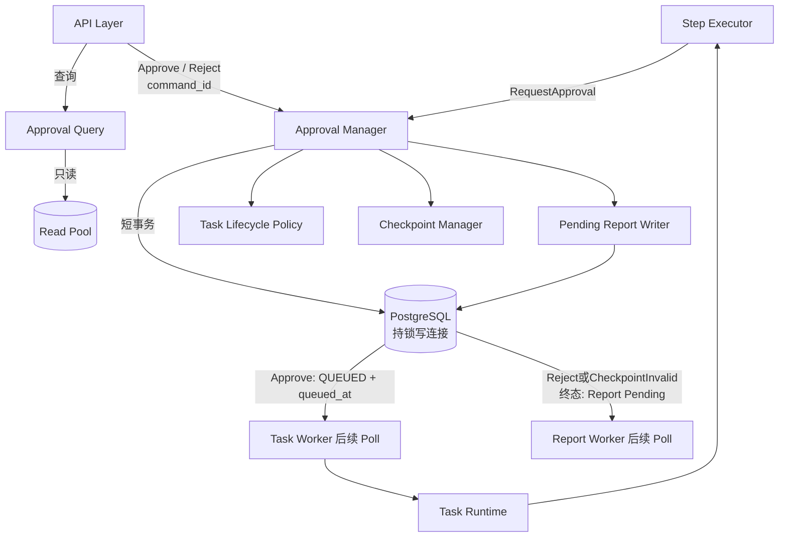
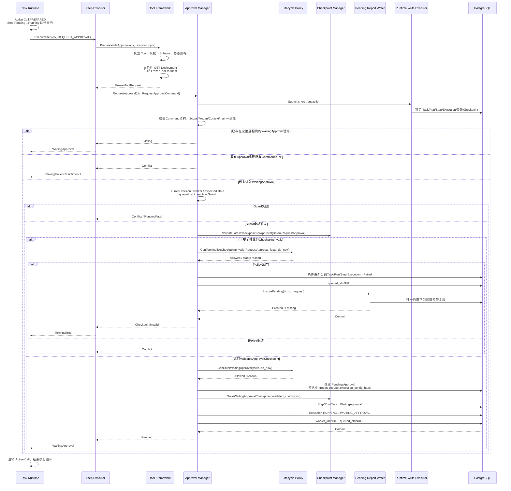
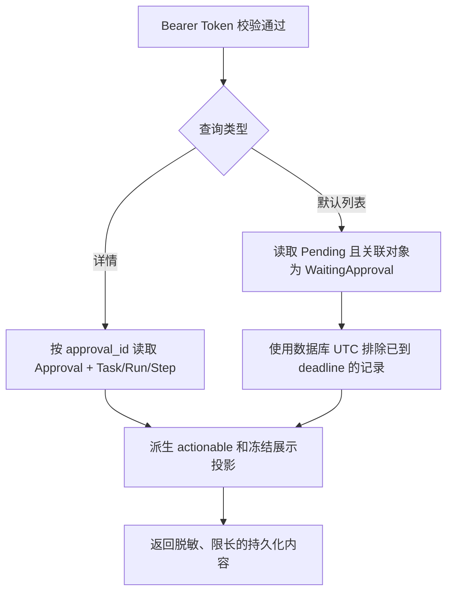
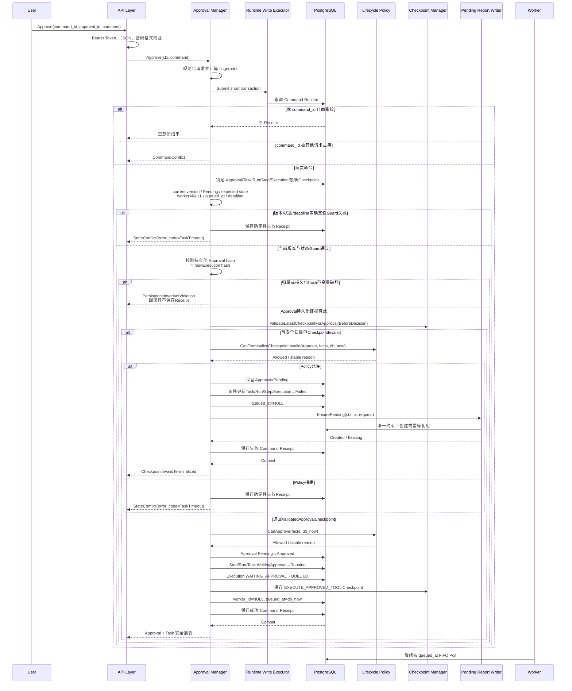
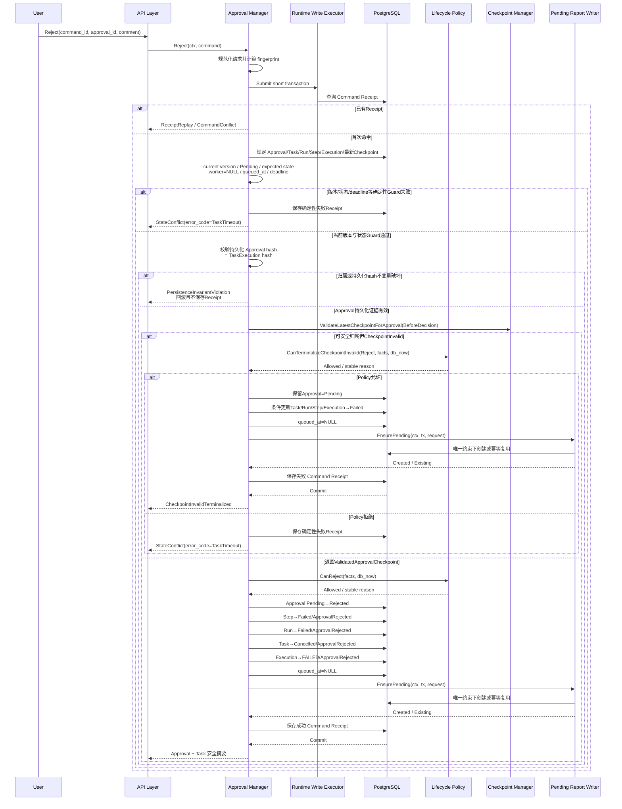
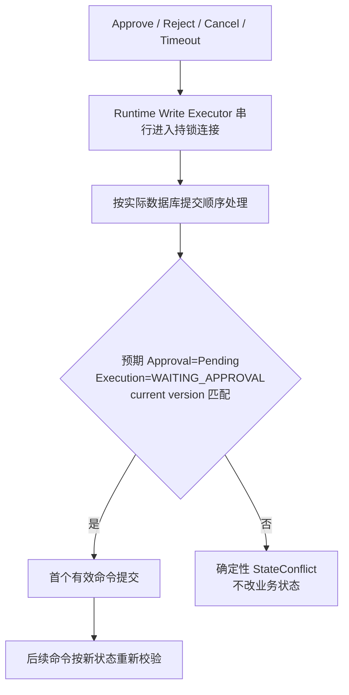
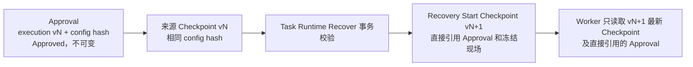
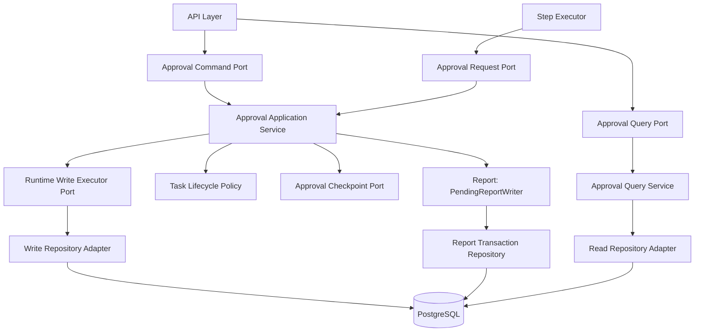
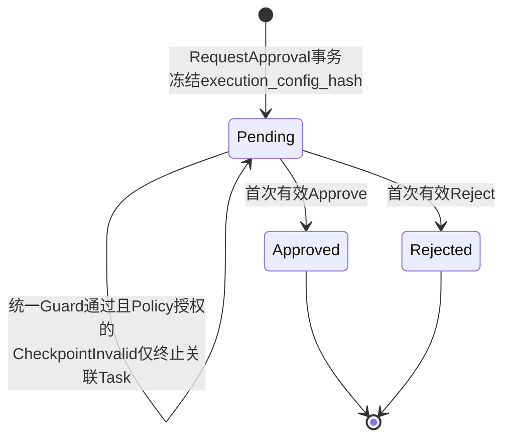
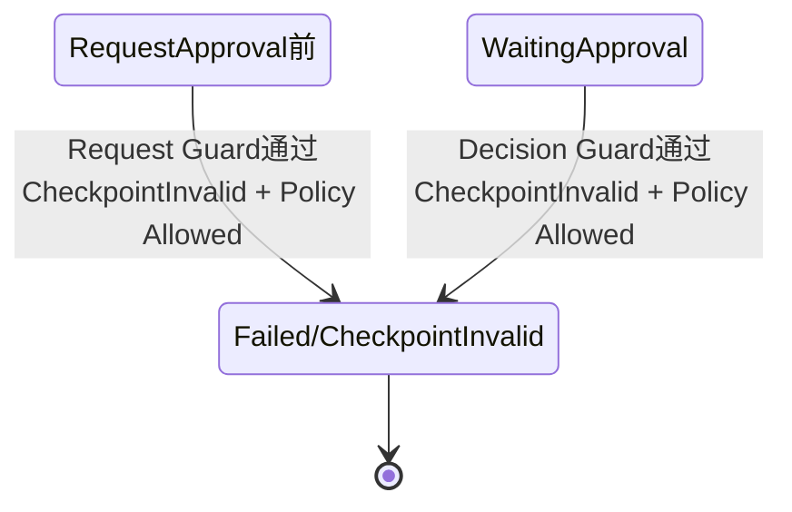

# Approval 功能详细设计

| 属性 | 值 |
|---|---|
| 文档版本 | V1.13 |
| 文档状态 | MVP 详细设计 |
| 需求基线 | `docs/design/001-requirements.md` V3.5 |
| 架构基线 | `docs/design/003-system-architecture-design.md` V1.3 |
| 相邻详细设计 | Task Runtime V1.19、Worker V1.3、Planner V1.8、Step Executor V1.17、Checkpoint V1.8、Tool Framework V1.14、Report V1.3 |
| 设计规则 | `docs/specs/005-detailed-design-guideline.md` |
| 共享契约 | `docs/design/002-shared-domain-contract.md` V1.1 |
| 契约修订 | P1-01：冻结唯一 RequestApproval Port、Command DTO 与封闭 Result；P1-03：持久化 frozen_input_hash 并提供 ApprovedAction 唯一事实 |

本文档中的 Approval 是高风险 Deployment Patch 的单次人工审批能力。Approval Manager 是应用层模块，拥有进入等待、Approve 和 Reject 所产生的完整跨对象事务；它与 Task Runtime 共同依赖无状态的 Task Lifecycle Policy，但二者不得互相调用。

> 跨模块契约说明：公共状态/错误、ExecutionScope、Approval Request、ApprovedAction/Evidence、next_action、Task Lifecycle Policy、RuntimeWriteTx和PendingReportWriter以`docs/design/002-shared-domain-contract.md`为唯一规范来源。本文同名定义只保留审批事务的构造、Guard和结果映射说明。

> 类型约束：Approval实体、Request/Decision Command、Result、Receipt投影和Repository DTO 的执行版本字段统一使用共享 `ExecutionVersion`；跨版本可空来源使用 `*ExecutionVersion`。

## 1. 功能概述

### 1.1 功能目标

Approval 模块在 MVP 中实现以下目标：

- 接收 Step Executor 已经解析、校验并冻结的高风险 Tool 请求；
- 原子创建当前 `execution_version` 的 Pending Approval 和 WaitingApproval 执行现场；
- 向本机 User 展示将要执行的 Tool、目标资源、冻结参数、旧值、新值、`resourceVersion` 和风险说明；
- 使用静态 Bearer Token 保护查询和决策 API；
- 使用 Client 生成的 `command_id` 和持久化 Command Receipt 保证 Approve、Reject 的命令幂等；
- 只允许 Pending Approval 的第一个有效决定生效；
- 将 FrozenToolRequest 的 `execution_config_hash` 作为 Approval 不可变字段持久化，使进程重启后的 Approve、Reject 和 Recover 能仅依据数据库事实验证冻结配置证据；
- Approve 后不重新解析或修改参数，在同一 `execution_version` 内保存继续执行 Checkpoint 并重新排队；
- Reject 后不创建 ToolExecution、不调用 Kubernetes，原子终止当前执行，并通过共享 `PendingReportWriter.EnsurePending` 创建或确认唯一 Pending Report；
- 在 RequestApproval、Approve 或 Reject 的持锁事务中，只有请求当前性、所有权、预期状态、数据库 deadline 和其他共享 Guard 全部通过后发现可安全归属的 `CheckpointInvalid`，才经 Task Lifecycle Policy 授权闭合当前 Task，并通过同一 `PendingReportWriter.EnsurePending` 创建或确认唯一 Pending Report；
- 通过 `execution_version`、预期状态、数据库 UTC deadline 和 Task Lifecycle Policy 关闭与 Cancel、Timeout、Recover 及旧执行结果的竞争；
- 保留终态 Task 下未决 Approval 的历史值，但将其视为不可操作。

### 1.2 使用场景

| 场景 | 入口 | 结果 |
|---|---|---|
| 高风险 Tool 请求审批 | Step Executor 调用 `RequestApproval` | 完整 WaitingApproval 现场或类型化失败 |
| 查询默认待审批列表 | API 调用 `ListActionableApprovals` | 仅返回当前可操作 Pending Approval |
| 查询审批详情 | API 调用 `GetApproval` | 返回冻结现场和派生 `actionable` |
| 批准审批 | API 调用 `Approve` | 同版本重新 QUEUED，后续由 Worker FIFO 领取 |
| 拒绝审批 | API 调用 `Reject` | Tool 不执行，Task 取消并创建 Pending Report |
| 相同命令网络重试 | 相同 `command_id` 与指纹 | 直接返回原 Command Receipt |
| 决策竞争 | 不同 `command_id` 的 Approve/Reject/Cancel/Timeout | 按持锁写通道的数据库提交顺序决定 |
| Recover 延续已批准动作 | Task Runtime Recover | 直接引用旧版本不可变 Approved Approval，不复制 Approval |
| 审批入口发现可归属的 CheckpointInvalid | Approval Manager 当前持锁事务 | 统一 Guard 通过且共享 Policy 授权后完成 Task 级失败闭合，不回调 Task Runtime |

### 1.3 涉及模块

| 模块 | 与 Approval 的关系 |
|---|---|
| API Layer | 校验静态 Bearer Token、JSON 和基础字段；调用 Approval Manager 命令或查询入口 |
| Step Executor | 唯一内部创建入口；传入同一动作 context、ExecutionScope、Step 和 FrozenToolRequest |
| Tool Framework | 在事务外读取 Deployment 并生成已校验的 FrozenToolRequest；不创建 Approval |
| Approval Manager | 本设计范围；拥有等待事务、Approve/Reject 命令事务和审批查询投影 |
| Task Lifecycle Policy | 纯规则组件；验证进入等待、Approve 和 Reject 的状态转换 |
| Checkpoint Manager | 在调用方事务内保存或校验 Runtime Context；不决定审批状态 |
| Runtime Write Executor | 通过持有 advisory lock 的 PostgreSQL connection 串行执行全部审批写事务 |
| Read Repository | 使用普通只读连接池查询 Approval 详情和列表 |
| Task Runtime | 消费 Approve 后重新排队的 Task；拥有 Cancel、Timeout、Recover，不被 Approval Manager 调用 |
| Worker | 只通过 Task Runtime 领取；不调用 Approval Manager，不解释审批状态 |
| Pending Report Writer | Report 模块提供的共享事务内 Port；复用 Approval 当前事务和持锁连接创建或确认唯一 Pending Report |
| Report Manager | `PendingReportWriter` 所属模块；独占 Report 唯一约束、幂等复用与字段初始化，后续独立生成报告 |

### 1.4 职责边界

Approval Manager 负责：

1. 校验 `RequestApproval` 的冻结请求与已持久化执行事实一致；
2. 通过 Task Lifecycle Policy 验证进入 WaitingApproval；
3. 原子创建 Approval、WaitingApproval Checkpoint，并推进 Step、Run、Task 和 TaskExecution；
4. 查询 Approval 及派生可操作性；
5. 规范化 Approve/Reject 命令并计算请求指纹；
6. 在业务状态校验前处理 Command Receipt 重放和冲突；
7. 通过 Task Lifecycle Policy 验证 Approve/Reject；
8. 原子提交 Approval 决定及其所有跨对象状态变化；
9. Approve 时创建 `EXECUTE_APPROVED_TOOL` Checkpoint，并写入 `queued_at`；
10. Reject 时在当前事务内调用共享 `PendingReportWriter.EnsurePending`；
11. 对三个审批入口在统一 Guard 全部通过后发现的可安全归属 `CheckpointInvalid`，调用共享 Task Lifecycle Policy；仅在 Policy 允许后原子终止 Task、Run、活动 Step 和 TaskExecution，并在当前事务内调用同一 `EnsurePending`；
12. 在领域事务提交后，按最佳努力规则记录本模块拥有的 Approval TaskLog。

Approval Manager 不负责：

- 定义 Task、Run、Step 或 TaskExecution 生命周期规则；
- 调用 Task Runtime、Worker、Timeout Scanner 或 Report Worker；
- 解析 `step.output.<field>`；
- 构造、重排或修改 Checkpoint `resolved_references`；
- 重新校验 Tool Schema、权限、replicas 范围或 image registry；
- 读取 Kubernetes 资源或执行 Deployment Patch；
- 重新解析、修改或刷新冻结 Tool 输入；
- 创建新的 `execution_version`；
- 决定 Recover 是否允许或复制 Approval；
- 用户、角色、组织、租户、职责分离或生产级 RBAC；
- Approval 撤销、过期状态、会签、多级审批或自动审批；
- 自动重试业务决定或自动重放写 Tool。
- 直接插入、查询、更新 Report 表，或在 Approval Repository 中实现 Report 唯一性、幂等复用和字段初始化。

### 1.5 事务 Owner

| 事实 | 唯一 Owner | 说明 |
|---|---|---|
| FrozenToolRequest 生成 | Tool Framework | Kubernetes GET 位于 Approval 事务外 |
| Pending Approval 与 WaitingApproval 现场 | Approval Manager | 一个短事务完整提交 |
| Approve 跨对象状态与重新排队 | Approval Manager | 一个短事务完整提交 |
| Reject 跨对象终态与 Pending Report | Approval Manager | 一个短事务完整提交；Report 写入委托同事务 `PendingReportWriter.EnsurePending` |
| 审批入口发现的可归属 CheckpointInvalid 终态 | Approval Manager | 统一 Guard 通过且 Task Lifecycle Policy 授权后，在当前持锁事务直接闭合并调用 `EnsurePending`；不回调 Task Runtime |
| Report 唯一约束、幂等复用和字段初始化 | Report 模块 | 由共享 `PendingReportWriter` 独占；不取得 Approval 生命周期事务所有权 |
| Cancel、Timeout、Recover | Task Runtime | Approval Manager 不代理这些命令 |
| Task 生命周期合法性 | Task Lifecycle Policy | 无状态、无 I/O、不持有事务 |
| Checkpoint 结构保存与校验 | Checkpoint Manager | 不推导 `next_action`，不迁移 Task 状态 |
| ToolExecution | Tool Framework / Task Runtime | Approval 等待与 Reject 均不创建 |
| ApprovalRequested/Approved/Rejected 及本模块终态化的 TaskTerminalized TaskLog | Approval Manager | 对应领域事务提交后最佳努力写入 |

### 1.6 MVP 范围与明确限制

MVP 只支持：

- `High + write` 的受限 Deployment Patch 单次审批；
- 单一服务端固定操作人标识，允许自审；
- 单 Runtime Instance、单 Worker、单 PostgreSQL；
- 默认 loopback API 和单个静态 Bearer Token；
- Pending、Approved、Rejected 三种 Approval 状态；
- Approval 持久化不可变 execution_config_hash，不依赖进程内审批缓存；
- Command Receipt 命令幂等；
- WaitingApproval 受 Task 总 deadline 限制。

MVP 明确不实现：

- Approval 自身的独立超时、Expired 或 Revoked 状态；
- 多人、多级、会签、代理、转交和职责分离；
- 在线刷新 Approval 参数或资源版本；
- 对 Approved 决定的撤销；
- 写 Tool exactly-once、自动重试、自动回滚或 Reconciliation；
- 多 Runtime、多 Worker、Lease、Heartbeat 或 Leader Election；
- Command Receipt、Approval、Checkpoint 和 TaskLog 的自动清理与归档。

## 2. 业务流程

### 2.1 总体流程



约束：

- API Layer 不直接读写 Repository；
- Approval Manager 不调用 Task Runtime 或 Worker；
- Checkpoint Manager 只在 Approval Manager 已拥有的事务中保存 Checkpoint；
- 所有 Approval 领域写必须通过 Runtime Write Executor 的持锁连接；
- 所有 Kubernetes 和其他外部调用必须位于事务之外。

### 2.2 进入 WaitingApproval



关键规则：

- `RequestApproval` 前，Step 已经由 Task Runtime 执行 `Pending → Running`；
- FrozenToolRequest 的 Kubernetes GET 不得在等待事务中执行；
- Approval Manager 必须重新读取并锁定持久化事实，不能信任调用方传入状态；
- `context` 在事务提交前取消时不得提交 WaitingApproval；
- 事务提交后发生取消不能撤销已经形成的等待事实；
- 等待事务失败时不得留下 Approval、Checkpoint 或任何部分状态；
- 进入 WaitingApproval 不创建 ToolExecution。
- 当前最大 Checkpoint 只有在请求仍属当前 execution_version、worker 所有权与预期状态仍有效、deadline 未到且其他共享 Guard 全部通过后才可校验；可安全归属但无效时，不创建 Approval，经 Task Lifecycle Policy 授权后在同一事务内以 `CheckpointInvalid` 闭合 Task 并返回 `ApprovalRequestResult.CheckpointInvalid`。

### 2.3 查询 Approval



详情查询允许返回终态 Task 下保留的历史 Pending Approval，但必须返回 `actionable=false`。默认列表只返回当前可操作记录。

### 2.4 Approve



Approve 不调用 Worker，也不在 HTTP 请求线程中执行 Tool。Worker 后续重新领取同一 TaskExecution，领取前比较 TaskExecution、最新 Checkpoint 与当前语义配置 hash。

### 2.5 Reject



Reject 不创建新的 Checkpoint。最新 WaitingApproval Checkpoint作为历史事实保留，但终态 Task 不可 Recover；Reject 也不创建 ToolExecution、不调用 Kubernetes。

### 2.6 命令冲突与提交顺序



不设置 Timeout、Approve 或 Cancel 的跨事务优先级。不同 `command_id` 的同决定重复请求也不是原命令重试，必须按当前状态返回 `StateConflict`。

### 2.7 跨 execution_version 的 Approved Approval



Approval Manager 不参与 Recover。Approved Approval 保留原 `execution_version`，不复制、不重新审批；跨版本合法性由 Task Runtime Recover 事务验证，并由新版本自包含 Recovery Start Checkpoint 直接引用。

## 3. 模块设计

### 3.1 模块定位与依赖方向



禁止的依赖：

- Approval Manager → Task Runtime；
- Approval Manager → Worker；
- Approval Manager → Kubernetes Adapter；
- Task Runtime → Approval Manager 的审批命令入口；
- Repository Adapter → Approval Manager；
- Approval Write/Read Repository Adapter → Report 表；
- Task Lifecycle Policy → Repository 或应用服务。

### 3.2 内部职责单元

以下均为 Approval 包内职责，不是新服务或独立部署组件：

| 单元 | 职责 |
|---|---|
| Approval Request Service | 实现唯一 `RequestApproval(ctx, RequestApprovalCommand)` Port；穷尽返回五类 `ApprovalRequestResult` 并提交进入 WaitingApproval 的完整事务 |
| Approval Decision Service | 编排 Approve/Reject 命令事务 |
| Command Receipt Guard | 规范化命令、计算指纹、处理重放与冲突 |
| Frozen Context Validator | 仅在 RequestApproval 校验 Command 的 ExecutionScope、FrozenToolRequest、StepID、显式 hash、ApprovalContext 与持久化 Step、Tool、execution_version 和 TaskExecution 一致 |
| Persisted Config Evidence Validator | 在 Approve/Reject 校验 Approval、TaskExecution、当前 Checkpoint 的持久化 hash；不读取 FrozenToolRequest |
| Approval Checkpoint Builder | 构造 WaitingApproval 和 Approved Continuation Runtime Context |
| Pending Report Collaboration | 仅在 Approval-owned 终态中把当前事务能力和标识传给共享 PendingReportWriter；不实现 Report 持久化 |
| Approval Query Service | 构造详情、列表与派生 `actionable` |
| Approval Safe Projector | 对 API、Receipt 和 TaskLog 生成最小脱敏投影 |

### 3.3 Approval Request Port

> 唯一签名、Command字段和Result分支见共享契约第7.3节；本节只说明Approval Manager Guard和事务语义。

`RequestApproval` 的唯一接口定义位于《跨模块共享领域契约》第7.3节。本节仅说明 Approval Manager 的实现、Guard 与事务载荷；Step Executor 不得复制 DTO、改写为位置参数或维护本地结果枚举。

```go
type ApprovalRequestPort interface {
	RequestApproval(
		ctx context.Context,
		command RequestApprovalCommand,
	) (ApprovalRequestResult, error)
}

type RequestApprovalCommand struct {
	Scope               ExecutionScope
	FrozenRequest       FrozenToolRequest
	StepID               StepID
	ExecutionConfigHash ExecutionConfigHash
	ApprovalContext      ApprovalRequestContext
}

type ApprovalRequestContext struct {
	NextAction NextAction
	ToolName   ToolName
	RiskLevel  RiskLevel
	ReadOnly   bool
}

type ApprovalRequestResult interface {
	isApprovalRequestResult()
}

type ApprovalRequestPending struct {
	ApprovalID       ApprovalID
	ApprovalStatus   ApprovalStatus
	TaskID           TaskID
	RunID            RunID
	StepID           StepID
	ExecutionVersion ExecutionVersion
}

type ApprovalRequestExisting struct {
	ApprovalID       ApprovalID
	ApprovalStatus   ApprovalStatus
	TaskID           TaskID
	RunID            RunID
	StepID           StepID
	ExecutionVersion ExecutionVersion
}

type ApprovalRequestConflict struct {
	TaskID           TaskID
	ExecutionVersion ExecutionVersion
	CauseCode        CauseCode
}

type ApprovalRequestCheckpointInvalid struct {
	TaskID              TaskID
	RunID               RunID
	StepID               StepID
	ExecutionVersion    ExecutionVersion
	ErrorCode           ErrorCode
	ReasonCode          ReasonCode
	TaskExecutionStatus TaskExecutionStatus
	ReportStatus        ReportStatus
}

type ApprovalRequestRuntimeFatal struct {
	ErrorCode ErrorCode
	CauseCode CauseCode
	TaskID    *TaskID
	StepID    *StepID
}
```

以上五个结构实现包内不可导出的 `isApprovalRequestResult()` marker；包外调用方只能穷尽匹配这些已导出分支，不能实现第六种结果。`ApprovalRequestCheckpointInvalid` 的 `ErrorCode` 固定为 `CheckpointInvalid`，`TaskExecutionStatus` 固定为 `FAILED`，`ReportStatus` 固定为 `Pending`。

`RequestApprovalCommand` 契约：

| 字段 | 必填 | 语义与约束 |
|---|---|---|
| `Scope` | 是 | Task Runtime 门禁通过后构造的唯一共享 `ExecutionScope`；必须包含 task_id、run_id、execution_version、execution_config_hash、worker_id 和 deadline_at |
| `FrozenRequest` | 是 | Tool Framework 返回的完整不可变 `FrozenToolRequest`；Step Executor 不拆分、重组或维护其字段列表 |
| `StepID` | 是 | 已由 Task Runtime 原子推进至 Running 的目标 ToolCall Step |
| `ExecutionConfigHash` | 是 | 显式命令证据；必须非空，且等于 `Scope.execution_config_hash`、`FrozenRequest.execution_config_hash` 和事务内当前 TaskExecution 的 hash |
| `ApprovalContext` | 是 | 本次审批路由所需的最小冻结上下文；固定为 `NextAction=REQUEST_APPROVAL`、`ToolName=FrozenRequest.tool_name`、`RiskLevel=High`、`ReadOnly=false` |

`ApprovalRequestContext` 不是通用扩展 Map，不得携带完整配置、当前数据库状态、Checkpoint ID/sequence、事务句柄、`queued_at` 或调用方生成的 Approval ID。Approval Manager 在持锁事务中重新加载并验证持久化事实；Step Executor 不得让请求重新加载配置或重算 hash。Approval ID、Checkpoint ID、sequence 和数据库时间均由 Approval Manager 在事务内生成或取得。

`RequestApproval` 是内部执行动作，不是 User 状态变更命令，因此不要求 command_id，也不创建 Command Receipt。

`ApprovalRequestResult` 是封闭联合类型，且只能使用以下五个分支：

| kind | 字段 | 语义 |
|---|---|---|
| `Pending` | approval_id、task_id、run_id、step_id、execution_version、approval_status=`Pending` | 新 Approval、WaitingApproval Checkpoint 及全部等待状态已经原子提交 |
| `Existing` | approval_id、task_id、run_id、step_id、execution_version、approval_status=`Pending` | 已存在与完整 Command 证据一致且自身闭合的 Pending Approval/WaitingApproval 现场；本次不重复写入 |
| `Conflict` | task_id、execution_version、cause_code | 版本、所有权、状态、deadline 或既有 Approval/现场与 Command 冲突；deadline 固定使用 `cause_code=TaskTimeout`；不创建或覆盖 Approval |
| `CheckpointInvalid` | task_id、run_id、step_id、execution_version、error_code=`CheckpointInvalid`、reason_code、task_execution_status=`FAILED`、report_status=`Pending` | 统一 Guard 通过且共享 Policy 授权后，可安全归属的缺失/无效 Checkpoint 已由 Approval Manager 原子闭合；缺失时 `reason_code=CHECKPOINT_NOT_FOUND`；未创建 Approval |
| `RuntimeFatal` | error_code、cause_code、可安全归属标识 | DTO 契约破坏、静态执行配置投影不一致或可确定的持久化不变量破坏；事务无部分提交，Runtime Host 必须停止当前 Runtime |

`Pending` 与 `Existing` 都表示可向 Task Runtime 返回 `WaitingApproval`，但只有 `Pending` 允许创建现场。`Existing` 只在 Approval、Checkpoint、Task/Run/Step/TaskExecution 状态、冻结请求、审批上下文和全部 hash 均完整一致时返回；任一差异必须返回 `Conflict` 或 `RuntimeFatal`，不得借 Existing 覆盖数据。

结果与 `error` 必须互斥：可确定的 Runtime Fatal 使用 `RuntimeFatal` 分支；数据库连接失败、事务提交结果不确定或持锁连接失效使用独立 `error` 通道。空结果加 nil error、同时返回结果与 error、或未知分支均违反 Port 契约。

### 3.4 Approval Command Port

| 方法 | 输入 | 输出 |
|---|---|---|
| `Approve` | `context.Context`、`ApprovalDecisionCommand` | `ApprovalCommandResult` 或 system error |
| `Reject` | `context.Context`、`ApprovalDecisionCommand` | `ApprovalCommandResult` 或 system error |

`ApprovalDecisionCommand`：

| 字段 | 必填 | 规则 |
|---|---|---|
| `command_id` | 是 | Client 生成、Database 内唯一 |
| `approval_id` | 是 | 命令目标 |
| `comment` | 否 | 合法 UTF-8；规范化后最大 1,024 bytes |

Approve 与 Reject 使用独立方法固定 `command_type` 和 `decision`，调用方不得传入任意状态字符串。`decided_by` 不从请求接收，只从 Runtime 静态操作人配置读取。

决策命令不接受 `execution_version`、`execution_config_hash`、FrozenToolRequest、tool_input、resourceVersion 或其他冻结 DTO。Approve/Reject 必须锁定并读取 Approval 自身持久化的不可变证据，不允许由 API、进程内缓存或调用方重新提供、覆盖或补全。

`ApprovalCommandResult`：

| kind | 字段 | 语义 |
|---|---|---|
| `Succeeded` | approval_id、approval_status、task_id、task_status、run_status、step_status、execution_version、task_execution_status、queued_at | 首次命令成功提交 |
| `ReceiptReplay` | Receipt 中相同的安全响应 | 相同 command_id 和指纹的重放 |
| `CheckpointInvalidTerminalized` | approval_id、approval_status=`Pending`、task_id、Task/Run/Step/TaskExecution 失败状态、execution_version、error_code=`CheckpointInvalid`、reason_code、report_status=`Pending` | 决策 Guard 通过且共享 Policy 授权后，CheckpointInvalid、Task 终态、Pending Report 和失败 Receipt 已原子提交；缺失时reason_code=CHECKPOINT_NOT_FOUND |
| `Rejected` | error_code、approval_id、可选当前状态安全摘要 | 确定性业务拒绝，Receipt 已保存 |

`Rejected.error_code` 只使用稳定的 `ApprovalNotFound`、`StateConflict` 或 `TaskTimeout`。`CheckpointInvalid` 必须使用已经完成领域终态收敛的 `CheckpointInvalidTerminalized`，不能作为“只写 Receipt”的普通 Rejected 返回。`CommandConflict` 是已有 command_id 被不同请求占用时的独立命令错误，不能覆盖原 Receipt。

Timeout 返回字段固定为：

- `RequestApproval`使用`Conflict(cause_code=TaskTimeout)`；
- `Approve/Reject`确定性拒绝使用`Rejected(error_code=TaskTimeout)`或其外层`StateConflict`语义；
- Approval Manager不得返回或持久化`error_code=TIMED_OUT`、`cause_code=TIMED_OUT`；
- `TIMED_OUT`只属于Task Runtime超时终态事务写入的`TaskExecution.termination_reason`。

### 3.5 Approval Query Port

| 方法 | 输入 | 输出 |
|---|---|---|
| `GetApproval` | context、approval_id | `ApprovalView` 或 NotFound |
| `ListActionableApprovals` | context、可选 task_id、limit、cursor | `ApprovalPage` |
| `ListTaskApprovals` | context、task_id、limit、cursor | `ApprovalPage` |

查询使用普通只读连接池，不经过 Runtime Write Executor。查询不得修改 Approval 或通过“读取时发现过期”推进 Task Timeout。

`ApprovalView` 至少包含：

- approval_id、task_id、run_id、step_id、execution_version；
- Task 目标安全摘要；
- tool_name；
- cluster、namespace、Deployment name；
- 冻结结构化变更参数；
- 相关旧值、新值和 `resource_version`；
- 风险说明；
- status、comment、decided_by、decided_at、created_at；
- 派生 `actionable`。

不得返回 Bearer Token、Kubernetes 凭证、完整 Deployment、Secret、managedFields、原始外部响应或内部错误 cause。

### 3.6 FrozenToolRequest 契约

Approval Manager 复用共享契约第7.1～7.2节定义的 DTO，不重复定义第二份结构。至少包含：

| 字段组 | 内容 |
|---|---|
| 执行归属 | task_id、run_id、step_id、execution_version |
| Tool | tool_name、risk_level=`High`、read_only=`false` |
| 冻结输入 | 已解析、Schema 校验、规范化的完整输入 |
| 资源目标 | cluster、namespace、Deployment、指定 container |
| 变更事实 | 允许字段、old value、new value |
| 并发基线 | Kubernetes `resourceVersion` |
| 展示信息 | 安全、有限的风险说明 |
| 配置证据 | execution_config_hash |
| 动作绑定证据 | frozen_input_hash |

`frozen_input_hash` 必须等于共享 `FrozenApprovedToolInputV1{tool_name,tool_input,observed_values,resource_version}` 规范 JSON 的 SHA-256 小写十六进制摘要。Approval Manager 使用共享 Tool 契约包唯一的 `ComputeFrozenInputHashV1` 在 RequestApproval 事务前复核，但不定义第二套编码或 hash 规则。

Approval Manager 只校验并持久化该 DTO，不重新读取配置或 Kubernetes。DTO 中若出现任意 JSON Patch operations、Merge Patch、完整 Deployment、不支持字段或错误 frozen_input_hash，视为上游契约破坏，不得创建 Approval。

#### 3.6.1 ExecutionConfigV1 投影边界

《跨模块共享领域契约》第5节定义的强类型 `ExecutionConfigV1` 是 Approval 使用的唯一执行语义配置，Task Runtime 是其唯一构造和 hash 计算 Owner：

- 审批策略只来自 `ExecutionConfigV1.approval`；
- Tool 风险、只读属性、enabled 和授权只来自同一实例的 `tool_framework.tools` 与 `agent.allowed_tools`；
- FrozenToolRequest 中的 `execution_config_hash` 必须是 Task Runtime 对该同一不可变实例计算的结果；
- RequestApproval 的显式 `ExecutionConfigHash`、`ExecutionScope.execution_config_hash` 与 FrozenToolRequest hash 必须逐字节相同；均只能沿 Task Runtime → Step Executor → Tool Framework/Approval 链路原样传入；
- RequestApproval 校验请求投影并把摘要持久化到 Approval；Approve/Reject 只校验 Approval、TaskExecution 和 Checkpoint 中已经持久化的摘要一致。Approval Manager 不接收完整 `ExecutionConfigV1`，也不计算或比较当前配置 hash；
- Approval Manager 不补默认值、不定义字段顺序、不规范化 JSON、不追加审批模块 salt，也不得因本设计文档版本变化自行改变 hash；
- 当前配置、TaskExecution、Checkpoint 的 Claim/Recover 三方门禁只由 Task Runtime 执行。

Task Runtime 是 `ExecutionConfigV1` 构造、默认值、规范化、序列化和 hash 计算的唯一 Owner。Approval Policy 或 Tool 风险规则发生语义变化时，必须先修改共享结构中的显式版本或字段，再由 Task Runtime 生成新 hash；不得在 Approval 内维护局部输入集合。

### 3.7 Task Lifecycle Policy Port

> 公共职责边界见共享契约第8.3节与第9节；本节只说明Approval调用点。

| 规则 | 输入事实 | 输出 |
|---|---|---|
| `CanEnterWaitingApproval` | Task、Run、Step、TaskExecution、current_execution_version、worker_id、deadline、db_now | Allowed 或稳定 reason |
| `CanApprove` | Approval、Task、Run、Step、TaskExecution、current_execution_version、deadline、db_now | Allowed 或稳定 reason |
| `CanReject` | Approval、Task、Run、Step、TaskExecution、current_execution_version、deadline、db_now | Allowed 或稳定 reason |
| `CanTerminalizeCheckpointInvalid` | source、Task、Run、Step、TaskExecution、可选 Approval、current_execution_version、request_execution_version、RequestApproval 的 worker_id、各对象预期状态、deadline、db_now | Allowed 或稳定 reason |

`source` 只允许 `RequestApproval`、`Approve` 或 `Reject`。其中 `request_execution_version` 在 RequestApproval 中取自共享 ExecutionScope；Approve/Reject 则取自命令目标 Approval 的不可变持久化字段，决策 API 不新增 execution_version 或 hash 字段。Command 显式 hash、Scope、FrozenToolRequest 与 TaskExecution hash 相等由 Approval Manager 在调用 Policy 前的统一 Guard 完成，不把配置证据判断下沉给 Lifecycle Policy。`CanTerminalizeCheckpointInvalid` 不判断 Checkpoint 内容是否有效；它只基于 Approval Manager 已锁定并完成统一 Guard 的事实，授权或拒绝从对应审批阶段进入 `Failed/CheckpointInvalid`。RequestApproval 要求请求版本仍为当前版本、TaskExecution 仍由请求 worker 拥有且四对象仍处于 Running/RUNNING；Approve/Reject 要求 Approval 仍为 Pending、四对象仍处于 WaitingApproval/WAITING_APPROVAL、worker_id 为 NULL。

Policy 不读取数据库、不生成时间、不写 Checkpoint、不创建 Report，也不决定事务范围。Approval Manager 必须在任何 `CheckpointInvalid` 终态写入前调用 Policy，不能在应用服务内维护第二套状态转换表；Policy 拒绝时不得终态化，由入口按稳定的 Stale、StateConflict 或 deadline 结果结束。

### 3.8 Checkpoint Manager Port

| 方法 | 调用时机 | 约束 |
|---|---|---|
| `ValidateLatestCheckpointForApproval` | RequestApproval、Approve、Reject 事务；仅在请求当前性、所有权、预期状态、deadline，以及 RequestApproval DTO 或决策持久化 Approval 证据 Guard 全部通过后调用 | 请求 variant 固定为 APPROVAL_REQUEST 或 APPROVAL_DECISION；校验当前版本最大 Checkpoint，成功返回同事务 `ValidatedApprovalCheckpoint` |
| `SaveWaitingApprovalCheckpoint` | RequestApproval 事务 | 必须消费刚才返回的同事务能力；保存 `next_action=REQUEST_APPROVAL` 和当前 Approval 直接引用 |
| `SaveApprovedContinuationCheckpoint` | Approve 事务 | 必须消费刚才返回的同事务能力；保存 `next_action=EXECUTE_APPROVED_TOOL` 和 Approved Approval 直接引用 |

校验结果必须区分：

- `Valid`：继续当前审批事务；
- `CheckpointInvalid`：在调用方已经完成统一 Guard 后，Checkpoint 缺失或内容无效但对象能够安全归属到当前 Task/Run/活动 Step/TaskExecution；缺失固定 `reason_code=CHECKPOINT_NOT_FOUND`，Approval Manager 仍须取得 Task Lifecycle Policy 授权后才能在当前事务内终态收敛；
- `PersistenceInvariantViolation`：对象归属本身无法确定，或 Checkpoint Manager 在恢复校验中发现 Approval.execution_config_hash 与其所属 TaskExecution 不一致；整个事务回滚并升级 Runtime Fatal。

以上三个方法是 Approval 的唯一 Checkpoint Port；Approval Manager 不得调用 Checkpoint 私有通用方法或自行传入任意 usage。Checkpoint Manager 使用调用方已打开的事务加载 ValidationFacts，不接受 Approval Manager 拼装的数据库事实快照，也不得另开连接提交。

`ValidatedApprovalCheckpoint` 由 Checkpoint 模块构造器私有，至少绑定 transaction_scope_id、当前最大 checkpoint_id/sequence、phase 和已经验证的 canonical resolved_references。保存方法要求：

- 能力来自当前同一事务、同一 Approval 入口；
- 来源仍是当前版本最大 Checkpoint；
- RequestApproval 保存沿用来源已验证绑定，并增加 Pending Approval 冻结现场；
- Approve 保存沿用 WaitingApproval Checkpoint 已验证绑定，并把动作改为 EXECUTE_APPROVED_TOOL；
- Approval Manager 不调用引用提取器，不从 FrozenToolRequest 或 Step.input 重新构造绑定；
- Reject 只验证，不保存新的 Checkpoint。

能力不可序列化或跨事务复用。Approval Manager 使用 Task Runtime 从同一不可变 `ExecutionConfigV1.tool_framework.tools` 投影的静态 Tool capability 完成 risk_level/read_only 与动作校验；这些值不写入 Step，也不交给 Checkpoint Manager 重算。Checkpoint Manager 只校验/保存适配器给出的强类型动作及其持久化后果，不迁移生命周期、不创建 Report。

### 3.9 Pending Report Writer Port

> 唯一Port、请求和幂等Owner见共享契约第8.2节；本节只说明Approval事务内使用。

Approval Manager 依赖共享契约第8.2节冻结、并已由 Task Runtime 使用的同一个出站 Port，不声明 Approval 私有适配器、DTO 或幂等规则：

```go
type PendingReportWriter interface {
	EnsurePending(
		ctx context.Context,
		tx RuntimeWriteTx,
		request EnsurePendingReportRequest,
	) (EnsurePendingReportResult, error)
}
```

共享 DTO 和封闭结果完全沿用 Report 契约：

| 项目 | 约束 |
|---|---|
| `RuntimeWriteTx` | 当前 Approval 命令已经由 Runtime Write Executor 打开的事务能力；绑定持有 advisory lock 的同一 PostgreSQL connection |
| `task_id` | 当前锁定 Task 的标识 |
| `run_id` | 当前锁定且属于该 Task 的唯一 Run |
| `created_at` | 当前 Approval 事务从 PostgreSQL 取得的 `db_now` |
| 返回 | `Created` 或 `Existing`；已有合法状态不得被重置或覆盖 |
| error | 关联不一致为 `PersistenceInvariantViolation`；数据库或提交不确定性沿独立 system error 通道返回 |

调用规则：

- 仅 Reject、审批入口的 `CheckpointInvalid` 终态，以及未来任何由 Approval Manager 负责提交的 Task 终态调用 `EnsurePending`；
- 调用必须发生在共享 Guard 与 Task Lifecycle Policy 通过、终态对象条件更新之后、Command Receipt 和外层事务提交之前；
- `EnsurePending` 必须复用当前 `ctx`、`RuntimeWriteTx` 和持锁 connection，禁止打开嵌套事务、切换到普通连接池、提交或回滚调用方事务；
- `EnsurePending` 返回 error 时，Approval Manager 必须回滚 Approval 决定、Task/Run/Step/TaskExecution 更新和 Command Receipt，不能留下部分终态；
- Report 的 `UNIQUE(task_id)`、冲突复用、`run_id` 一致性检查和新行字段初始化均由 Report 模块实现；Approval Manager 与 Approval Repository 不得复制这些规则；
- 相同 `command_id` 命中已有 Receipt 时直接重放，不再次调用 `EnsurePending`；新 command 进入已终态现场则按既有 Guard 返回，不把 `EnsurePending` 当作状态修复入口。

### 3.10 Runtime Write Executor Port

Approval 的全部持久化写通过 Runtime Write Executor 串行进入唯一持锁 PostgreSQL connection：

- 不提供审批优先级；
- 不在事务开始前按命令类型排序；
- 不使用普通连接池写入；
- 不在写任务中执行 Kubernetes、模型或其他外部调用；
- 持锁连接失效时返回 system error，并由 Runtime Host 推进关闭；
- API 请求 context 取消时不创建脱离该 context 的后台命令。

### 3.11 Repository 边界

写事务 Repository 提供最小能力：

- 按 `command_id` 查询/插入 Command Receipt；
- 锁定 Approval、Task、Run、Step、TaskExecution；
- 读取并锁定当前版本最新 Checkpoint；
- 条件更新 Approval；
- 条件更新 Task、Run、Step、TaskExecution 和 `queued_at`；
- 创建 Approval、Checkpoint；
- 取得数据库 UTC 时间和分配 Checkpoint sequence。

只读 Repository 提供 Approval 详情与游标列表投影。Repository 不判断 Approval 是否可决定、不调用 Policy，也不把零行条件更新自动解释为具体业务错误。

Approval Repository 对 Report 表没有任何权限或方法：

- 不直接 INSERT、UPDATE、SELECT 或锁定 Report；
- 不暴露 `CreateReport`、`FindReportByTaskID`、`EnsureReport` 等写入或幂等辅助方法；
- 不实现 `ON CONFLICT(task_id)`、唯一约束冲突复用、`run_id` 一致性检查或 Pending 字段初始化；
- 不把 Report ORM/数据库实体并入 Approval 聚合或 Repository DTO。

Approval Application Service 只能通过第 3.9 节共享 `PendingReportWriter` 触达 Report 持久化。该 Port 内部可以使用 Report Transaction Repository，但此能力不得向 Approval Repository 泄露。

Repository DTO 冻结为：

| DTO | hash 契约 |
|---|---|
| `CreateApprovalRow` | `execution_config_hash` 与 `frozen_input_hash` 必填；分别直接取自已经通过 Guard 的 FrozenToolRequest |
| `LockedApprovalRow` | 必须加载两个 hash；供 Approve/Reject、Checkpoint 保存和后续 ApprovedAction 构造 |
| `ApprovalReadProjection` | 必须加载两个 hash供内部审计和恢复验证；API `ApprovalView` 可不公开 |
| `DecideApprovalParams` | 只携带 approval_id、expected_status、comment、decided_by、decided_at、expected_execution_config_hash、expected_frozen_input_hash；更新 SQL 以已锁定值为条件，不允许提供新 hash 值 |

`DecideApprovalParams.expected_execution_config_hash` 只能由 Approval Application Service 从本事务已经锁定的 `LockedApprovalRow` 复制，不属于 ApprovalDecisionCommand 或 API 输入。

Repository 的 Approval INSERT 必须显式写入两个 hash。Approval UPDATE 列表不得包含任一 hash；决定更新必须同时满足 `status=Pending AND execution_config_hash=:expected_execution_config_hash AND frozen_input_hash=:expected_frozen_input_hash`，零行按重新读取后的 Stale/PersistenceInvariantViolation 分类，不能静默覆盖。

## 4. 数据设计

### 4.1 Approval 实体

| 字段 | 语义 | 可变性 |
|---|---|---|
| `approval_id` | Approval 唯一标识 | 不可变 |
| `task_id`、`run_id`、`step_id` | 关联业务结构 | 不可变 |
| `execution_version` | 创建 Approval 的 TaskExecution 版本 | 不可变 |
| `execution_config_hash` | 创建时 FrozenToolRequest、TaskExecution 和 WaitingApproval Checkpoint 共同使用的执行语义配置摘要 | 不可变 |
| `frozen_input_hash` | 对 tool_name、tool_input、observed_values、resource_version 的版本化规范摘要；绑定 ApprovedAction 与 Checkpoint Evidence | 不可变 |
| `tool_name` | 待执行 Tool 稳定名称 | 不可变 |
| `tool_input` | 已解析、校验、规范化的冻结输入 | 不可变 |
| `observed_values` | 审批创建时允许字段的旧值 | 不可变 |
| `resource_version` | 审批创建时 Deployment resourceVersion | 不可变 |
| `risk_summary` | 安全、有限的操作风险说明 | 不可变 |
| `status` | Pending、Approved、Rejected | 只允许一次决定 |
| `comment` | 决策意见 | Pending 时为空，决定时首次写入 |
| `decided_by` | 服务端固定操作人标识 | Pending 时为空，决定时首次写入 |
| `decided_at` | 数据库 UTC 决策时间 | Pending 时为空，决定时首次写入 |
| `created_at` | 数据库 UTC 创建时间 | 不可变 |

cluster、namespace、Deployment、container、允许字段和新值必须能够从 `tool_input` 的固定结构安全投影；不保存完整 Kubernetes 对象。

固定文本限制：

- `comment` 在换行规范化后最大 1,024 UTF-8 bytes；
- `risk_summary` 最大 512 UTF-8 bytes；
- `decided_by` 最大 128 UTF-8 bytes；
- TaskLog 中的安全 comment 摘要最大 256 UTF-8 bytes。

超限 comment 在事务前返回 InvalidArgument，不做静默截断。`risk_summary` 和 `decided_by` 属于内部冻结输入或静态配置，超限表示配置或上游契约错误，不创建 Approval。TaskLog comment 摘要允许在合法 UTF-8 边界截断并以 `…` 结尾，省略号计入 256 bytes。

### 4.2 Approval 持久化约束

至少需要以下约束：

- `approval_id` 主键；
- `step_id` 唯一，保证一个高风险 ToolCall Step 只产生一个 Approval；
- `execution_version > 0`；
- `execution_config_hash` 非空且匹配 `^[0-9a-f]{64}$`；
- `status` 只允许 Pending、Approved、Rejected；
- Pending 时 `comment`、`decided_by`、`decided_at` 为空；
- Approved/Rejected 时 `decided_by`、`decided_at` 非空；
- `execution_config_hash`、`tool_name`、`tool_input`、`observed_values`、`resource_version` 和 `risk_summary` 决定前后均不可修改；
- `comment`、`risk_summary` 和 `decided_by` 满足第 4.1 节固定字节上限；
- 决定更新必须带 `status=Pending` 条件；
- 关联 Task、Run、Step 必须属于同一业务链；
- Approval.execution_version 在创建时必须等于 Task.current_execution_version。

需要的查询索引：

- `(status, created_at, approval_id)` 支持默认 Pending 列表；
- `(task_id, created_at, approval_id)` 支持 Task 历史查询；
- `(step_id)` 唯一索引支持单 Approval 不变量。

不增加 Approval Expired、Cancelled、Superseded、Revoked 或版本表。

#### 4.2.1 Migration 契约

Approval 表迁移必须增加：

- `execution_config_hash varchar(64)`；
- `frozen_input_hash varchar(64)`；
- `NOT NULL`；
- 两列均使用小写十六进制格式 CHECK；
- 数据库级不可变保护：`BEFORE UPDATE OF execution_config_hash, frozen_input_hash` 在任一新旧值不同时拒绝更新；
- Repository 写角色不得通过通用行更新绕过该保护。

新建数据库直接以完整约束创建列。若开发环境已经存在 Approval 数据，迁移顺序固定为：

1. 先以 nullable 列加入；
2. 按 `approval.task_id + approval.execution_version` 精确关联唯一 TaskExecution，并加载所有直接引用该 Approval 的 WaitingApproval/Approved Continuation Checkpoint；
3. 只有 TaskExecution 唯一存在、至少存在一条直接 Checkpoint，且全部直接 Checkpoint execution_config_hash 都与该 TaskExecution 完全相等时，才回填 `execution_config_hash`；
4. 从 Approval 已持久化的 tool_name、tool_input、observed_values、resource_version 使用唯一共享 FrozenApprovedToolInputV1 纯函数计算 `frozen_input_hash`；禁止从日志、当前配置或进程缓存回填；
5. 任一 Approval 缺少唯一 TaskExecution、没有直接 Checkpoint、直接 Checkpoint hash 不同、冻结字段无法规范化或任一 hash 格式非法时，迁移失败并回滚；
6. 全量验证完成后设置 `NOT NULL`、格式 CHECK 和不可变触发器。

该迁移不改变 Approval 状态、execution_version、冻结参数或决定字段。迁移成功后，进程内 FrozenToolRequest 不再是 Approve/Reject 可验证性的必要条件。

### 4.3 Command Receipt

Approval Manager 使用共享 Command Receipt：

| 字段 | Approval 命令取值 |
|---|---|
| `command_id` | Client 生成的数据库唯一标识 |
| `command_type` | Approve 或 Reject |
| `target_id` | approval_id |
| `request_fingerprint` | 规范化命令字段的 SHA-256 |
| `response` | 可重放的脱敏 ApprovalCommandResult |
| `created_at` | 首次命令提交的数据库 UTC 时间 |

请求指纹包含：

- command_type；
- approval_id；
- 规范化 comment。

Bearer Token、固定操作人配置、请求时间、trace ID 和 HTTP headers 不进入指纹。comment 必须先执行确定性的 UTF-8、空值和换行规范化；无法规范化时直接返回 `InvalidArgument`，不保存 Receipt。

成功结果和确定性业务拒绝都保存 Receipt。数据库连接失败、事务未提交或提交结果不确定等基础设施失败不保存新的确定结果；Client 使用相同 command_id 重试后，以数据库中是否存在 Receipt 判定。

Approve/Reject 在统一 Guard 通过且 Task Lifecycle Policy 授权后处理 CheckpointInvalid 时，Receipt.response 必须保存 `CheckpointInvalidTerminalized` 的最小安全结果，并与 Task、Run、活动 Step、TaskExecution 终态及 Pending Report 同事务提交。RequestApproval 没有 command_id，因此其相同终态事务不创建 Receipt。

### 4.4 WaitingApproval Checkpoint

RequestApproval 事务保存当前 execution_version 的最新 Checkpoint：

| 字段 | 值 |
|---|---|
| task_id、run_id | 当前对象 |
| execution_version | 当前 TaskExecution 版本 |
| checkpoint_sequence | 同 Run 严格递增 |
| execution_config_hash | 与新建 Approval、当前 TaskExecution 和 FrozenToolRequest 相同 |
| current_step_id | 当前 ToolCall Step |
| next_action | `REQUEST_APPROVAL` |
| approval_id | 新建 Pending Approval |
| frozen_tool_input | 与 Approval.tool_input 一致的最小恢复投影 |
| frozen_input_hash | 与不可变 Approval.frozen_input_hash 相同 |
| resource_version | 与 Approval 一致 |
| source_execution_version/source_checkpoint_id | 空 |

该 Checkpoint 表示“当前 Step 已经进入等待指定 Approval”，不是 ToolExecution 或外部调用事实。

### 4.5 Approved Continuation Checkpoint

Approve 事务保存同一 execution_version 的新最新 Checkpoint：

| 字段 | 值 |
|---|---|
| task_id、run_id | 当前对象 |
| execution_version | 不变 |
| checkpoint_sequence | 同 Run 严格递增 |
| execution_config_hash | 与不可变 Approval、TaskExecution 相同 |
| current_step_id | 原 ToolCall Step |
| next_action | `EXECUTE_APPROVED_TOOL` |
| approval_id | 刚更新为 Approved 的 Approval |
| frozen_tool_input | 与不可变 Approval 完全一致 |
| frozen_input_hash | 与不可变 Approval.frozen_input_hash 相同 |
| resource_version | 与不可变 Approval 完全一致 |
| source_execution_version/source_checkpoint_id | 空 |

Worker 重新领取后只消费当前版本最新 Checkpoint，不得回退到 WaitingApproval Checkpoint，也不得重新解析 Step 原始输入。

后续 Task Runtime 构造写 Tool 请求时，`ApprovedAction` 只能取自 Approval 实体；当前 Checkpoint 只贡献 `ApprovedCheckpointEvidence`。Approval Manager 不把 checkpoint_id、checkpoint_type 或 Recovery source 保存进 Approval，也不生成混合 DTO。

### 4.6 Reject 数据变化

Reject 事务更新：

- Approval：Pending → Rejected，写 comment、decided_by、decided_at；
- Step：WaitingApproval → Failed，`error_code=ApprovalRejected`，写 ended_at；
- Run：WaitingApproval → Failed，`error_code=ApprovalRejected`，写 ended_at；
- Task：WaitingApproval → Cancelled，`error_code=ApprovalRejected`，写 ended_at；
- TaskExecution：WAITING_APPROVAL → FAILED，`error_code=ApprovalRejected`，写 ended_at，worker_id 保持 NULL；
- Task.queued_at：保持或设置 NULL；
- Pending Report：调用共享 `PendingReportWriter.EnsurePending(ctx, tx, {task_id, run_id, created_at=db_now})`，由 Report 模块创建或确认该 task_id 唯一记录；
- Command Receipt：保存成功结果。

Reject 不创建新 Checkpoint。已有 WaitingApproval Checkpoint、Approval 冻结现场和历史 TaskExecution 保留，供查询和 Report 使用。

### 4.7 Approved Approval 的跨版本引用

Approval 归属创建它的 execution_version，决定后不可变。Task Runtime Recover 若从 `EXECUTE_APPROVED_TOOL` 边界恢复：

- 校验来源 Checkpoint 直接引用的 Approval 为 Approved；
- 校验 `Approval.execution_config_hash=来源 Checkpoint.execution_config_hash=来源 TaskExecution.execution_config_hash`；
- 校验 Approval 与 Task、Run、Step、Tool、冻结输入和 resourceVersion 一致；
- 为新 execution_version 创建自包含 Recovery Start Checkpoint；
- Recover 三方配置门禁保证新 TaskExecution hash 与上述来源 hash 相同；
- 新 Checkpoint 直接记录 approval_id、Approval 原版本、来源 Checkpoint 和冻结现场，并使用相同 execution_config_hash；
- 不复制 Approval，不修改 Approval.execution_version 或 execution_config_hash。

Approval Query 可以展示其原 execution_version；Approval Manager 的 Approve/Reject 命令只处理当前版本 Pending Approval，不处理跨版本历史 Approval。

### 4.8 TaskLog

Approval Manager 是以下事件的唯一 Owner：

| event | 触发点 | 最小字段 |
|---|---|---|
| `ApprovalRequested` | WaitingApproval 事务提交后 | task_id、run_id、step_id、execution_version、approval_id、tool_name |
| `ApprovalApproved` | Approve 事务提交后 | 同上、固定 operator、数据库决定时间、安全 comment 摘要 |
| `ApprovalRejected` | Reject 事务提交后 | 同上、固定 operator、数据库决定时间、error_code=ApprovalRejected、安全 comment 摘要 |
| `TaskTerminalized` | Approval Manager 完成统一 Guard、取得 Policy 授权并提交 CheckpointInvalid 终态后 | task_id、run_id、step_id、execution_version、error_code=CheckpointInvalid |

TaskLog 通过持锁写通道最佳努力写入，但不与领域事务绑定为事实来源。日志失败不得回滚或重放 Approval 命令，也不得由 Step Executor、Task Runtime 或 Tool Framework 补写同名事件。

TaskLog 不保存 Bearer Token、完整 Tool 输入、完整 comment、完整资源对象、Kubernetes 凭证或原始外部响应。

## 5. 状态设计

### 5.1 Approval 状态机

> ApprovalStatus唯一枚举和终态定义见共享契约第1.6节；本图保留审批模块转换说明。



规则：

- Approved 和 Rejected 均不可再次转换；
- `execution_config_hash` 在 Pending、Approved、Rejected 三个状态中保持同一不可变值，状态转换不产生该字段的赋值边；
- Task 终态或超时不会改变 Pending Approval 的历史状态；
- Timeout终态不增加Approval状态边：Approval保持Pending；Task/Run/活动Step的领域错误为`TaskTimeout`，TaskExecution仅以`termination_reason=TIMED_OUT`记录终止来源；
- Approve/Reject 的统一 Guard 全部通过后校验出可安全归属的 CheckpointInvalid，且 Task Lifecycle Policy 授权终态转换时，Approval 保持 Pending，关联执行在同一事务中失败；
- Approval 持久化 hash 不变量破坏时返回 Runtime Fatal 并回滚，没有 Approval 状态转换；
- `actionable` 是查询时派生属性，不是持久化状态；
- 相同 command_id 重放不产生第二次状态转换；
- 不同 command_id 在已经决定后返回 StateConflict。

### 5.2 进入等待的跨对象转换

| 对象 | 前置状态 | 后置状态 |
|---|---|---|
| Approval | 不存在 | Pending |
| Step | Running | WaitingApproval |
| Run | Running | WaitingApproval |
| Task | Running | WaitingApproval |
| TaskExecution | RUNNING | WAITING_APPROVAL |
| worker_id | 当前 worker_id | NULL |
| queued_at | NULL | NULL |
| Checkpoint | 上一合法 Checkpoint | 新增 REQUEST_APPROVAL |
| 配置证据 | FrozenToolRequest、TaskExecution、前置 Checkpoint hash 相等 | Approval 与新 Checkpoint 持久化同一 hash |

所有变化必须在同一短事务中提交。

`ApprovalRequestResult.Existing` 不是第二条状态边：它要求上述后置事实已经完整存在且与 Command 完全一致，返回时不更新任何对象。`Conflict`、`CheckpointInvalid` 和 `RuntimeFatal` 分别按第 3.3 节约定处理，不得伪装成进入等待成功。

### 5.3 Approve 的跨对象转换

| 对象 | 前置状态 | 后置状态 |
|---|---|---|
| Approval | Pending | Approved |
| Step | WaitingApproval | Running |
| Run | WaitingApproval | Running |
| Task | WaitingApproval | Running |
| TaskExecution | WAITING_APPROVAL | QUEUED |
| worker_id | NULL | NULL |
| queued_at | NULL | 数据库 UTC now |
| Checkpoint | REQUEST_APPROVAL | 新增 EXECUTE_APPROVED_TOOL |
| 配置证据 | Approval、TaskExecution、当前 Checkpoint hash 相等 | Approval、TaskExecution、新 Checkpoint hash 保持相同 |

Approve 不覆盖 Task、Run、Step 或 TaskExecution 的 `started_at`，不创建新 execution_version。

### 5.4 Reject 的跨对象转换

| 对象 | 前置状态 | 后置状态 |
|---|---|---|
| Approval | Pending | Rejected |
| Step | WaitingApproval | Failed/ApprovalRejected |
| Run | WaitingApproval | Failed/ApprovalRejected |
| Task | WaitingApproval | Cancelled/ApprovalRejected |
| TaskExecution | WAITING_APPROVAL | FAILED/ApprovalRejected |
| worker_id | NULL | NULL |
| queued_at | NULL | NULL |
| ToolExecution | 不存在 | 仍不存在 |
| Report | 不存在或 Pending 占位 | `EnsurePending` 返回 Created/Existing，唯一 Pending 或已有合法状态保持不变 |
| 配置证据 | Approval、TaskExecution、当前 Checkpoint hash 相等 | Approval hash 保持不可变 |

### 5.5 CheckpointInvalid 的跨对象转换



| 对象 | RequestApproval 发现无效 | Approve/Reject 发现无效 |
|---|---|---|
| Approval | 不创建 | 保持 Pending 历史值 |
| Active Step | Running→Failed/CheckpointInvalid | WaitingApproval→Failed/CheckpointInvalid |
| Run | Running→Failed/CheckpointInvalid | WaitingApproval→Failed/CheckpointInvalid |
| Task | Running→Failed/CheckpointInvalid | WaitingApproval→Failed/CheckpointInvalid |
| TaskExecution | RUNNING→FAILED/CheckpointInvalid | WAITING_APPROVAL→FAILED/CheckpointInvalid |
| worker_id | 保留当前 worker_id 作为历史执行标识 | 保持 NULL |
| queued_at | 清空 | 清空 |
| Report | 共享 `EnsurePending` 创建或幂等确认 | 共享 `EnsurePending` 创建或幂等确认 |
| Command Receipt | 不适用；内部动作没有 command_id | 保存不可变失败 Receipt |
| 配置证据 | 不创建 Approval | Approval.execution_config_hash 保持原不可变值；无效 Checkpoint 不被改写 |

上述状态和 `PendingReportWriter.EnsurePending` 必须在发现错误的同一持锁事务内同时提交。该转换不是“发现坏 Checkpoint 即失败”的无条件边：只有 Task、Run、活动 Step 和当前 TaskExecution 可以唯一关联、入口的 current execution_version/worker/预期状态/queued_at/deadline/DTO 等统一 Guard 全部通过、Checkpoint Manager 返回 `CheckpointInvalid`，并且 Task Lifecycle Policy 的 `CanTerminalizeCheckpointInvalid` 返回 Allowed 时才能使用。任一 Guard 或 Policy 拒绝均无此状态转换；归属不明或 `EnsurePending` 失败时不得部分终止，必须整体回滚并返回对应错误。

### 5.6 可操作性

`actionable=true` 当且仅当一次只读查询中同时满足：

- Approval.status=Pending；
- Approval.execution_version=Task.current_execution_version；
- Approval.execution_config_hash 格式合法且等于对应 TaskExecution.execution_config_hash；
- Task.status=WaitingApproval；
- Run.status=WaitingApproval；
- Step.status=WaitingApproval；
- TaskExecution.status=WAITING_APPROVAL；
- TaskExecution.worker_id IS NULL；
- Task.queued_at IS NULL；
- 数据库 UTC `now < deadline_at`。

该投影只用于 UI 展示和默认列表过滤，不能替代命令事务中的重新锁定与 Guard。Task 已终态、已超时或状态组合不完整时详情仍可返回，但 `actionable=false`。

### 5.7 决策竞争状态矩阵

| 先提交命令 | 后到命令 | 后到处理 |
|---|---|---|
| Approve | Reject | StateConflict；Approval 已 Approved |
| Reject | Approve | StateConflict；Approval 已 Rejected |
| Cancel | Approve/Reject | StateConflict；Pending Approval 保留但不可操作 |
| Timeout | Approve/Reject | StateConflict；Pending Approval 保留但不可操作 |
| Approve | Cancel | Cancel 按 QUEUED 或后续 RUNNING 的新状态重新校验 |
| Approve | Timeout | Timeout 按 QUEUED 或后续 RUNNING 的新状态重新校验 |
| CheckpointInvalid 终态 | Approve/Reject/Cancel/Timeout | 后到命令按 Failed 终态返回冲突，不覆盖 Pending Approval 或失败原因 |
| 同 command_id 首次命令 | 相同指纹重试 | ReceiptReplay |
| 同 command_id 首次命令 | 不同命令/目标/指纹 | CommandConflict |

## 6. 核心逻辑

### 6.1 RequestApproval 前置条件

Approval Manager 首先校验 `RequestApprovalCommand` 结构，并在事务内锁定事实。`Scope`、`FrozenRequest`、`StepID`、`ExecutionConfigHash` 和 `ApprovalContext` 任一缺失，或 Command 内三份 hash 证据不一致，均返回 `RuntimeFatal(STEP_EXECUTOR_CONTRACT_BROKEN)`。

在进入持锁事务前，Approval Manager 必须使用共享 FrozenApprovedToolInputV1 纯函数复核 `FrozenRequest.frozen_input_hash`。字段缺失、格式非法或与冻结动作不一致属于 `RuntimeFatal(STEP_EXECUTOR_CONTRACT_BROKEN)`，不得创建 Approval。

锁定后先判定唯一幂等复用分支：若当前版本已存在与 Command 的 Scope 归属、StepID、FrozenRequest、ApprovalContext 和 execution_config_hash 全部一致的 Pending Approval，且最新 Checkpoint 及 Task/Run/Step/TaskExecution 已构成完整 WaitingApproval 现场，则返回 `Existing`，不重复写入。存在 Approval 但冻结证据不同、现场不完整或已被决定时返回 `Conflict`；归属不变量破坏返回 `RuntimeFatal(PersistenceInvariantViolation)`。

尚未进入 WaitingApproval 时，必须严格按以下顺序执行统一 Guard；不得先解释或校验 Checkpoint 内容：

1. Runtime 仍持有有效 advisory lock 写连接；
2. Task、Run、Step、TaskExecution 可唯一关联；
3. `Scope`、`FrozenRequest`、`StepID` 中的 task_id、run_id、step_id、execution_version 与锁定对象标识一致；
4. `Task.current_execution_version=Scope.execution_version=FrozenRequest.execution_version`；
5. `ExecutionConfigHash=Scope.execution_config_hash=FrozenRequest.execution_config_hash`，三者均非空、格式合法且逐字节相等；
6. TaskExecution.execution_version 为该当前版本且 status=`RUNNING`；
7. TaskExecution.worker_id 与 `Scope.worker_id` 一致；
8. Task、Run、Step 均为 Running，且 Step 是 Run.current_step_id；
9. Task.queued_at IS NULL；
10. Step 是 `High + write` ToolCall，当前 Step 尚无 Approval 和 ToolExecution；
11. 数据库 UTC `db_now < Task.deadline_at`；`Scope.deadline_at` 只作 DTO 一致性证据，不能替代数据库时间；
12. 其他共享 Version Guard、状态 Guard 和持锁连接 Guard 全部通过；
13. `ApprovalContext` 固定为 `REQUEST_APPROVAL + FrozenRequest.tool_name + High + write`，并与锁定 Step 一致；
14. `ExecutionConfigHash=Scope.execution_config_hash=FrozenRequest.execution_config_hash=TaskExecution.execution_config_hash`，其 Approval/Tool 投影来自 Task Runtime 计算该 hash 的同一不可变 `ExecutionConfigV1`。

第 3、5、13 项的调用 DTO 缺失、格式非法或彼此矛盾属于 `RuntimeFatal(STEP_EXECUTOR_CONTRACT_BROKEN)`；第 14 项在调用 DTO 内证据已相等后仍与持久化 TaskExecution/静态投影不一致，属于 `RuntimeFatal(RUNTIME_STATIC_TOOL_SNAPSHOT_INCONSISTENT)`。两者均不得伪装成 CheckpointInvalid。合法的版本、所有权、状态或既有现场竞争返回 `Conflict`；deadline 已到返回 `Conflict(cause_code=TaskTimeout)`，且优先于后续持久化配置证据校验；无法唯一确定核心对象归属时回滚并返回 `RuntimeFatal(PersistenceInvariantViolation)`。Approval Manager 不计算、不补全、不查询当前配置替换任何 hash。只有以上 Guard 全部通过后才调用 Checkpoint Manager 校验当前版本最大 Checkpoint。

### 6.2 RequestApproval 事务

事务步骤固定为：

1. 取得数据库 UTC 时间；
2. 按固定锁顺序锁定 Task、Run、Step、当前 TaskExecution 和当前版本 sequence 最大 Checkpoint；
3. 校验 Command 结构、DTO 内归属、三份 execution_config_hash 证据和 frozen_input_hash；失败返回 `RuntimeFatal`；
4. 若已存在完整相同 WaitingApproval 现场，提交只读事务并返回 `Existing`；
5. 若存在不相同 Approval、现场或合法状态竞争，返回 `Conflict`，不覆盖既有记录；
6. 尚未进入等待时执行第 6.1 节其余统一 Guard；任一失败立即返回 `Conflict` 或 `RuntimeFatal`，不校验 Checkpoint、不执行终态写入；
7. Guard 全部通过后，调用`ValidateLatestCheckpointForApproval(BeforeRequestApproval)`校验当前版本最大 Checkpoint 的结构、归属、`next_action=REQUEST_APPROVAL` 和 execution_config_hash；
8. 若对象归属本身无法确定，整体回滚并返回 `RuntimeFatal(PersistenceInvariantViolation)`；
9. 若结果为 `CheckpointInvalid`，调用 `CanTerminalizeCheckpointInvalid(source=RequestApproval, facts, db_now)`；
10. Policy 允许时执行第 6.11 节终态收敛并提交，返回 `ApprovalRequestResult.CheckpointInvalid`；Policy 拒绝时不写终态，返回 `Conflict`；
11. 成功取得同事务`ValidatedApprovalCheckpoint`后调用 `CanEnterWaitingApproval`；
12. Policy 允许后分配 approval_id；
13. 创建当前 execution_version 的 Pending Approval，并把 `FrozenRequest.execution_config_hash` 与已经复核的 `FrozenRequest.frozen_input_hash` 原样写入两个不可变字段；
14. 分配严格递增 checkpoint_sequence；
15. 调用`SaveWaitingApprovalCheckpoint(validated_checkpoint, approval_id, frozen_request)`保存 `REQUEST_APPROVAL` Checkpoint；沿用能力中的canonical resolved_references；
16. 条件更新 Step Running→WaitingApproval；
17. 条件更新 Run Running→WaitingApproval；
18. 条件更新 Task Running→WaitingApproval，并确保 queued_at=NULL；
19. 条件更新 TaskExecution RUNNING→WAITING_APPROVAL，清空 worker_id；
20. 校验每个条件更新影响行数恰为 1；
21. 提交事务；
22. 返回 `Pending`；
23. 提交后最佳努力记录 `ApprovalRequested` TaskLog。

任一步失败均回滚，不允许复用已经分配但未提交的 Approval 或 Checkpoint 作为事实。

### 6.3 next_action 规则

> 唯一枚举、生成规则和Owner见共享契约第2.1节。

Approval 模块使用共享契约第2.1节的共享纯函数，不维护第二套规则：

| 持久化事实 | next_action |
|---|---|
| High + write ToolCall，尚无同一冻结动作的 Approved Approval | `REQUEST_APPROVAL` |
| Approval Manager 已批准同一冻结 Tool 动作 | `EXECUTE_APPROVED_TOOL` |

RequestApproval 事务只允许写 `REQUEST_APPROVAL`；Approve 事务只允许写 `EXECUTE_APPROVED_TOOL`。Checkpoint Manager、Worker 和查询接口不得推导、降级或覆盖该值。

### 6.4 查询逻辑

详情查询：

1. 按 approval_id 读取 Approval；
2. 联表读取 Task、Run、Step 和对应 TaskExecution 的只读投影；
3. 取得数据库 UTC 时间；
4. 按第 5.6 节派生 actionable；
5. 从冻结持久化字段构造 ApprovalView；
6. 执行字段白名单、限长和脱敏；
7. 返回结果。

默认列表：

- 固定按 `(created_at, approval_id)` 升序；
- 使用游标分页；
- 只读取 Pending 且完整满足第 5.6 节的记录；
- 可选 task_id 只缩小结果，不改变可操作性；
- 不因列表查询推进 Timeout 或修复不一致数据。

历史列表可以返回 Approved、Rejected 和不可操作 Pending，但必须明确 status 与 actionable。

### 6.5 决策命令预处理

在进入 Runtime Write Executor 前：

1. 校验 command_id、approval_id 的基础格式；
2. 校验 comment 为合法 UTF-8，先将 CRLF 和 CR 规范化为 LF，再验证不超过 1,024 bytes；
3. comment 缺失或规范化后为空字符串时统一表示为 NULL；其他空白字符不做裁剪；
4. 固定 command_type 为 Approve 或 Reject；
5. 使用规范化字段计算 SHA-256 request_fingerprint。

无法生成稳定指纹的请求返回 `InvalidArgument`，不创建 Command Receipt。

### 6.6 Command Receipt 处理

事务开始后首先按 command_id 查询 Receipt：

1. 存在且 command_type、target_id、fingerprint 全部一致：直接返回 Receipt.response，不读取 Approval 当前状态；
2. 存在但任一字段不同：返回 `CommandConflict`，不修改原 Receipt；
3. 不存在：继续执行首次命令。

首次命令的成功或确定性业务拒绝必须在事务中插入 Receipt。数据库唯一约束是并发后备保护；若插入冲突，重新读取 Receipt 并按上述规则处理，不重新执行决定。

### 6.7 Approve 前置校验

首次 Approve 命令完成 Receipt 判定并锁定对象后，必须严格按以下顺序完成统一 Guard：

1. Approval 存在且能够唯一关联 Task、Run、Step 和其 `execution_version` 对应的 TaskExecution；
2. Approval.status=Pending；
3. `Approval.execution_version=Task.current_execution_version=TaskExecution.execution_version`；
4. Task、Run、Step 均为 WaitingApproval，TaskExecution=WAITING_APPROVAL 且 worker_id IS NULL；
5. Task.queued_at IS NULL，其他共享 Version Guard、预期状态 Guard 和持锁连接 Guard 均通过；
6. 数据库 UTC 时间早于 deadline_at；
7. 持久化 `Approval.execution_config_hash` 与 `Approval.frozen_input_hash` 格式合法；
8. `Approval.execution_config_hash=TaskExecution.execution_config_hash`；
9. 使用共享纯函数复核 `Approval.frozen_input_hash` 与持久化 tool_name、tool_input、observed_values、resourceVersion 一致；
10. Approval 的归属、tool_name、冻结输入、旧值、新值和 resourceVersion 与锁定 Step 及持久化关联事实一致。

第 2—6 项不通过属于合法竞争或 deadline，返回 `StateConflict`；deadline 使用 `error_code=TaskTimeout`。只有当前版本、Pending 和 WaitingApproval 现场仍成立后，才解释 Approval 的冻结证据，避免旧 execution_version 或迟到命令对当前 Task 触发错误终态。

第 7—10 项不通过表示当前数据库中本应原子冻结的 Approval 事实已经损坏，返回 Runtime Fatal `PersistenceInvariantViolation`：整个事务回滚，不更新 Approval、Task、Run、Step 或 TaskExecution，不创建 Checkpoint、Report 或 Command Receipt，并由 Runtime Host 关闭当前实例。决策流程不读取进程内 FrozenToolRequest、不读取当前配置服务，也不要求 API 重新携带冻结 DTO。

只有以上 Guard 全部通过后，才调用`ValidateLatestCheckpointForApproval(BeforeDecision)`校验当前版本最大 Checkpoint 是否为当前 Step 的 `REQUEST_APPROVAL`、直接引用当前 Approval，且 `Checkpoint.execution_config_hash=TaskExecution.execution_config_hash=Approval.execution_config_hash`。Checkpoint 缺失、结构无效或 Checkpoint hash 与这两个持久化 hash 不一致时返回 `CheckpointInvalid`；hash 原因固定为 `CHECKPOINT_EXECUTION_HASH_MISMATCH`。若 Checkpoint 可安全归属但无效，调用 `CanTerminalizeCheckpointInvalid(source=Approve, facts, db_now)`；Policy Allowed 后才能执行第 6.11 节。归属不明返回 PersistenceInvariantViolation。Approval Manager 不代替 Timeout Scanner 提交超时终态。

Checkpoint 有效后再调用 `CanApprove`，Allowed 后才能进入第 6.8 节。

### 6.8 Approve 事务

通过第 6.7 节后：

1. 以 `status=Pending AND execution_config_hash=:locked_hash` 条件更新 Approval 为 Approved，UPDATE 列表不包含 execution_config_hash；
2. 从静态配置读取固定操作人标识；
3. 写 comment、decided_by、数据库 UTC decided_at；
4. 条件更新 Step WaitingApproval→Running；
5. 条件更新 Run WaitingApproval→Running；
6. 条件更新 Task WaitingApproval→Running；
7. 条件更新 TaskExecution WAITING_APPROVAL→QUEUED，worker_id 保持 NULL；
8. 使用不可变 Approval 构造 Approved Continuation Runtime Context；
9. 调用`SaveApprovedContinuationCheckpoint(validated_checkpoint, approval_id)`保存 `EXECUTE_APPROVED_TOOL` Checkpoint，沿用能力中的canonical resolved_references；
10. 使用数据库 UTC 写 Task.queued_at；
11. 构造最小脱敏成功响应；
12. 插入 Command Receipt；
13. 校验条件更新影响行数；
14. 提交事务；
15. 提交后最佳努力记录 `ApprovalApproved` TaskLog。

Approve 不修改 TaskExecution 或 Approval 的 execution_config_hash，不写 observed_config_hash，不创建 ToolExecution，不调用 Tool，不覆盖 started_at。

### 6.9 Reject 前置校验

Reject 使用与第 6.7 节 Approve 完全相同且先于 Checkpoint 校验的对象归属、当前版本、Pending Approval、WaitingApproval、worker_id=NULL、queued_at=NULL、数据库 deadline 和持久化 `Approval.execution_config_hash=TaskExecution.execution_config_hash` Guard。任一 Guard 失败时不得校验 Checkpoint，更不得触发 CheckpointInvalid 终态。

Guard 全部通过后，Checkpoint 必须能够证明当前 WaitingApproval 对应此 Approval，并满足 `Checkpoint.execution_config_hash=TaskExecution.execution_config_hash=Approval.execution_config_hash`；能够安全归属但 Checkpoint 缺失、结构无效或 hash 不一致时先调用 `CanTerminalizeCheckpointInvalid(source=Reject, facts, db_now)`，仅 Policy Allowed 后执行第 6.11 节。Approval 自身 hash 格式非法或与 TaskExecution 不一致、对象归属不明均返回 `PersistenceInvariantViolation`，回滚且不保存 Receipt。正常 Reject 不创建继续执行 Checkpoint。

Checkpoint 有效后调用 `CanReject`，Task Lifecycle Policy 返回允许后才能提交拒绝终态。Task 已超时或终态时在 Checkpoint 校验前返回 StateConflict，不把 Pending Approval 改为 Rejected。

### 6.10 Reject 事务

通过第 6.9 节后：

1. 以 `status=Pending AND execution_config_hash=:locked_hash` 条件更新 Approval 为 Rejected，UPDATE 列表不包含 execution_config_hash；
2. 写固定操作人、规范化 comment 和数据库 UTC decided_at；
3. Step→Failed/ApprovalRejected；
4. Run→Failed/ApprovalRejected；
5. Task→Cancelled/ApprovalRejected；
6. TaskExecution→FAILED/ApprovalRejected，写 ended_at；
7. 确保 worker_id=NULL、queued_at=NULL；
8. 使用当前 `ctx`、当前 `RuntimeWriteTx` 和同一 `db_now` 调用共享 `PendingReportWriter.EnsurePending`；只接受 `Created` 或 `Existing`；
9. 构造最小脱敏成功响应；
10. 插入 Command Receipt；
11. 校验条件更新影响行数；
12. 提交事务；
13. 提交后最佳努力记录 `ApprovalRejected` TaskLog。

`EnsurePending` 不提交事务；只有 Approval 外层事务提交后 Report 记录及 Reject 终态才同时可见，Report Worker 才能独立领取。`EnsurePending` 失败会回滚整个 Reject；后续 Report 生成失败不反向修改已经提交的 Reject 结果。Approval Repository 不访问 Report 表。
Reject 不修改 Approval.execution_config_hash。

### 6.11 CheckpointInvalid 终态收敛

该过程只处理以下前置条件已经同时满足的情况：

1. 调用入口已经锁定 Task、Run、活动 Step、当前 TaskExecution、最新 Checkpoint 和适用 Approval；
2. 第 6.1 节或第 6.7/6.9 节的统一 Guard 已全部通过；
3. Checkpoint Manager 在 Guard 之后返回“可安全归属的 `CheckpointInvalid`”；
4. Task Lifecycle Policy 的 `CanTerminalizeCheckpointInvalid` 已按入口 source 和同一批锁定事实返回 Allowed。

Approval Manager 不得自行决定生命周期，也不得把 Policy 调用视为事后通知。满足上述条件后，Approval Manager 在当前持锁事务内：

1. 停止当前 RequestApproval、Approve 或 Reject 正常流程；
2. 不创建、批准或拒绝 Approval：
   - RequestApproval 路径不创建 Approval；
   - Approve/Reject 路径保留原 Pending Approval、冻结输入和决定字段空值；
3. 按 Policy 授权的来源状态，条件更新活动 Step→Failed/CheckpointInvalid；
4. 条件更新 Run→Failed/CheckpointInvalid；
5. 条件更新 Task→Failed/CheckpointInvalid；
6. 条件更新当前 TaskExecution→FAILED/CheckpointInvalid；
7. 使用数据库 UTC 写 Task、Run、活动 Step 和 TaskExecution 的 ended_at；
8. RequestApproval 路径保留当前 worker_id 作为已开始执行尝试的历史标识；Approve/Reject 路径保持 worker_id=NULL；
9. 清空 queued_at；
10. 使用当前 `ctx`、当前 `RuntimeWriteTx` 和同一 `db_now` 调用共享 `PendingReportWriter.EnsurePending`；只接受 `Created` 或 `Existing`；
11. Approve/Reject 路径构造 `CheckpointInvalidTerminalized` 安全响应并插入失败 Command Receipt；RequestApproval 没有 command_id，不创建 Receipt；
12. 校验所有条件更新均携带并匹配 request_execution_version、Task.current_execution_version、TaskExecution.execution_version、入口预期状态；RequestApproval 额外匹配 worker_id，Approve/Reject 额外匹配 Approval=Pending 和 worker_id IS NULL，并校验影响行数；Report 唯一性与已有记录一致性只采用 `EnsurePending` 返回结果；
13. 提交事务；
14. 返回 `CheckpointInvalidTerminalized`；
15. 提交后由 Approval Manager 最佳努力记录 `TaskTerminalized`，不记录 ApprovalApproved 或 ApprovalRejected。

TaskLog 仍不是终态事实；Task、Run、Step、TaskExecution、Pending Approval、Report 和适用的失败 Receipt 才是审计与报告来源。

若活动 Step 或任一核心对象无法唯一归属，必须整体回滚并返回 Runtime Fatal `PersistenceInvariantViolation`，禁止只失败部分对象或保存失败 Receipt。若 Policy 拒绝，或者条件更新因 Cancel、Timeout、Recover、旧 Worker/旧 execution_version 或其他合法事务已先提交而失效，必须回滚并重新读取后返回 Stale，或返回`StateConflict`及适用的`error_code=TaskTimeout`，不覆盖先提交终态，也不得以坏 Checkpoint 为由终止当前版本。

### 6.12 确定性业务拒绝

以下首次命令拒绝是确定性结果，应保存失败 Receipt：

- approval_id 不存在；
- Approval 已 Approved 或 Rejected；
- Approval 不属于当前 execution_version；
- Task、Run、Step 或 TaskExecution 不再是完整 WaitingApproval；
- Task 已到 deadline；
- Task 已进入终态；
- Task Lifecycle Policy 返回稳定拒绝原因。

除 CheckpointInvalid 外，保存失败 Receipt 的事务只插入 Receipt，不修改 Approval 或其他领域对象。CheckpointInvalid 必须使用第 6.11 节原子终态收敛，不能停留在 WaitingApproval。相同 command_id 重试返回同一失败结果，即使对象状态之后再次变化也不重新决定。

### 6.13 Recover 边界

Approval Manager 不提供 Recover 方法。Task Runtime 是 Recover 的唯一事务 Owner：

- Pending Approval 不可 Recover 为可执行动作；
- 只有已批准动作可以被 Recovery Start Checkpoint 直接引用；
- Recover 不修改旧 Approval；
- Recover 不创建相同 Step 的新 Approval；
- 新 execution_version 的 ToolExecution 尚未创建时仍位于写副作用边界前；
- Worker 执行恢复版本时只读取当前版本最大 Checkpoint及其直接引用的 Approved Approval，不递归遍历历史 Checkpoint。

### 6.14 Cancel、Timeout 与 Runtime Shutdown

Cancel、Timeout 由 Task Runtime 提交：

- 如果先于 RequestApproval 事务提交，RequestApproval Guard 失败并返回 `Conflict`，不创建 Approval；
- 如果 WaitingApproval 已提交，Cancel/Timeout 以 Approval Pending、TaskExecution WAITING_APPROVAL 和当前版本作为竞争事实；
- Cancel/Timeout 先提交时，Approval 保留 Pending 但不可操作；
- Approve/Reject 先提交时，后续 Cancel/Timeout 按新状态重新校验；
- Approval Manager 不取消 Active Call、不补写 Cancel/Timeout 状态。

Task Runtime 的 Timeout 事务提交后字段语义为：Task、Run及适用的活动Step使用`error_code=TaskTimeout`，TaskExecution使用`status=FAILED`、`termination_reason=TIMED_OUT`；Approval保持Pending历史状态。Approval Manager不写`termination_reason`，也不把`TIMED_OUT`复制到Approval结果、Receipt或日志的error_code/cause_code。

Runtime Shutdown：

- 已经提交的 WaitingApproval 不需要 StartupCleanup；
- 未提交的 RequestApproval 因 context 取消而回滚；
- 已提交但 HTTP 响应丢失的决定通过相同 command_id 和 Receipt 恢复；
- 持锁连接失效时 Approval Manager 不重连、不绕过 Runtime Write Executor 写入。

## 7. 异常处理

### 7.1 错误分类

| 错误 | 作用域 | 是否保存 Receipt | 处理 |
|---|---|---:|---|
| `InvalidArgument` | 请求 | 否 | API 返回字段错误，不进入事务 |
| `ApprovalNotFound` | 决策命令 | 是 | 确定性失败 |
| `CommandConflict` | command_id | 否，不修改原 Receipt | 返回原 command_id 已被其他请求占用 |
| `StateConflict` | 决策命令 | 是 | 当前状态不允许决定 |
| `TaskTimeout` | 决策命令error_code | 是 | 返回 StateConflict，不代替 Timeout 终态 |
| `Conflict(cause_code=TaskTimeout)` | RequestApproval | 不适用 | 不创建 Approval，由 Task Runtime 收敛 Timeout |
| `Conflict` | RequestApproval 内部执行竞争 | 不适用 | 不补写状态；Step Executor 映射为 Stale |
| `RuntimeFatal` | RequestApproval 可确定致命分支 | 不适用 | 回滚事务并由 Runtime Host 关闭；不得与 error 同时返回 |
| `CheckpointInvalid` | Task 级 | Approve/Reject 保存失败 Receipt；RequestApproval 不适用 | 统一 Guard 通过且 Task Lifecycle Policy 授权后，Approval Manager 才能在当前持锁事务内终止 Task/Run/活动 Step/TaskExecution、清队列，并通过共享 `PendingReportWriter.EnsurePending` 确保 Pending Report |
| `EnsurePending` 返回 `PersistenceInvariantViolation` | Runtime Fatal | 否 | Report 归属不一致；回滚完整 Approval 事务并由 Runtime Host 关闭 |
| `EnsurePending` 数据库或事务能力错误 | system error | 否 | 回滚完整 Approval 事务；不得自行访问 Report 表补偿 |
| `STEP_EXECUTOR_CONTRACT_BROKEN` | Runtime Fatal | 否 | RequestApproval 返回 `RuntimeFatal`；回滚，Runtime Host 关闭 |
| `RUNTIME_STATIC_TOOL_SNAPSHOT_INCONSISTENT` | Runtime Fatal | 否 | RequestApproval 返回 `RuntimeFatal`；回滚，Runtime Host 关闭 |
| `PersistenceInvariantViolation` | Runtime Fatal | 否 | RequestApproval 返回 `RuntimeFatal`；包含 Approval hash 格式非法、Approval hash 与其版本 TaskExecution 不一致或核心归属冲突；回滚全部决定写入，Runtime Host 关闭 |
| 持锁连接失效 | Runtime Fatal | 否 | 停止全部 Runtime 组件并退出 |
| 数据库/提交结果不确定 | system error | 否 | Client 以相同 command_id 重试 |
| context.Canceled | 调用取消 | 否 | 未提交事务回滚；不后台继续 |

### 7.2 错误优先级

RequestApproval 和决策事务使用以下错误优先级；后序分支不得覆盖前序结果：

1. Approve/Reject API 命令语法无法规范化 → InvalidArgument；RequestApproval Command 结构不完整 → `RuntimeFatal(STEP_EXECUTOR_CONTRACT_BROKEN)`；
2. Approve/Reject 已有 Command Receipt → ReceiptReplay 或 CommandConflict；
3. Approve/Reject 对象不存在 → ApprovalNotFound；RequestApproval 无法关联命令标识 → `RuntimeFatal(STEP_EXECUTOR_CONTRACT_BROKEN)`；
4. 核心对象无法唯一归属 → `PersistenceInvariantViolation`；
5. current execution_version、RequestApproval worker_id、Approval Pending、四对象预期状态或 queued_at Guard 失败 → RequestApproval 返回 `Conflict`，Approve/Reject 返回 StateConflict；
6. 数据库 UTC deadline 已到 → RequestApproval 返回`Conflict(cause_code=TaskTimeout)`，Approve/Reject 返回`StateConflict`及`error_code=TaskTimeout`；
7. RequestApproval 的显式 ExecutionConfigHash、ExecutionScope hash 或 Frozen DTO hash 缺失/非法/彼此不同，ApprovalContext 不合法，或调用证据与静态配置投影矛盾 → `RuntimeFatal(STEP_EXECUTOR_CONTRACT_BROKEN)` 或 `RuntimeFatal(RUNTIME_STATIC_TOOL_SNAPSHOT_INCONSISTENT)`；
8. Approve/Reject 的持久化 Approval hash 格式非法、与当前版本 TaskExecution hash 不一致或冻结字段归属矛盾 → `PersistenceInvariantViolation`，回滚且不保存 Receipt；
9. 以上 Guard 全部通过后才校验当前版本最大 Checkpoint；
10. Checkpoint 可安全归属但缺失、结构无效或 hash 与 Approval/TaskExecution 不一致 → `CheckpointInvalid`；调用 `CanTerminalizeCheckpointInvalid`，Allowed 时 RequestApproval 原子返回 `ApprovalRequestResult.CheckpointInvalid`，Approve/Reject 返回 `ApprovalCommandResult.CheckpointInvalidTerminalized`；拒绝时不写终态并返回各自稳定竞争结果；
11. Checkpoint 有效 → 调用当前正常转换的 `CanEnterWaitingApproval`、`CanApprove` 或 `CanReject`，Allowed 后执行正常审批状态转换。

不得把 CheckpointInvalid、Runtime Fatal、Stale/StateConflict 或 deadline 统一映射为 `ApprovalContextChanged`。`ApprovalContextChanged` 只属于 Approved Tool 执行阶段发现 Kubernetes live resource 相对冻结现场变化，不由 Approval Manager 产生。

因此，“Checkpoint 无效 + 旧 execution_version/错误 worker/状态已变化/deadline 已到/错误 DTO”必须分别得到 Stale、StateConflict、deadline 或 Runtime Fatal；CheckpointInvalid 在这些组合中没有终态优先级。

### 7.3 参数和冻结现场错误

RequestApproval 在事务前只做 DTO 结构完整性检查；事务内必须与持久化事实复核。

- 普通用户输入错误：返回 InvalidArgument；
- ExecutionScope.execution_config_hash 缺失、格式非法或与 FrozenToolRequest hash 不同：`STEP_EXECUTOR_CONTRACT_BROKEN`；
- Tool Framework 已宣称完成校验，但 FrozenToolRequest 含未授权字段、Patch operations 或归属矛盾：`STEP_EXECUTOR_CONTRACT_BROKEN`；
- RequestApproval 中 Scope/FrozenToolRequest 已相等但与 TaskExecution 或同一 hash 静态 Tool 投影自相矛盾：`RUNTIME_STATIC_TOOL_SNAPSHOT_INCONSISTENT`；
- Approve/Reject 不再读取 FrozenToolRequest；持久化 Approval hash 格式非法或与其 TaskExecution 不一致：`PersistenceInvariantViolation`；
- 当前 Checkpoint hash 与 Approval/TaskExecution 不一致：`CheckpointInvalid/CHECKPOINT_EXECUTION_HASH_MISMATCH`；
- 调用期间版本或所有权正常变化：Stale；
- 当前 Deployment 后续变化不在本模块检查，留给 Tool Framework/Kubernetes Adapter。

### 7.4 超时

Approval 没有独立超时。Task.deadline_at 是唯一业务截止时间：

- 所有比较使用 PostgreSQL UTC；
- RequestApproval 已到期时不创建等待现场，固定返回`Conflict(cause_code=TaskTimeout)`；
- 查询使用数据库 UTC 派生 actionable；
- Approve/Reject 已到期时返回`StateConflict`及稳定`error_code=TaskTimeout`；
- Timeout Scanner 和 Task Runtime 拥有终态事务；
- Task Runtime终态事务将Task、Run和活动Step的`error_code`写为`TaskTimeout`，并将TaskExecution的`termination_reason`写为`TIMED_OUT`；
- Approval Manager禁止把`TIMED_OUT`作为领域error_code/cause_code，且不写TaskExecution.termination_reason；
- 不以 Go 进程本地时间决定业务状态。

### 7.5 重试

| 操作 | 自动重试 |
|---|---|
| RequestApproval | 不自动重做 Kubernetes GET；事务未提交由执行链按当前持久化状态处理 |
| Approve/Reject 相同 command_id | 允许 Client 重试；只重放 Receipt |
| 不同 command_id | 视为新命令，重新校验当前状态 |
| 数据库连接错误 | 模块不自动重试写事务 |
| Command Receipt 唯一冲突 | 只读取并分类现有 Receipt，不重新执行决定 |
| Approved Tool | Approval Manager 不执行，也不制定重试 |

MVP 不引入后台审批重试器、Outbox、MQ 或补偿事务。

### 7.6 安全处理

- Bearer Token 只由 API 认证中间件使用，不传入 Approval Manager，不写数据库或日志；
- 固定操作人标识来自服务端配置；
- Approval 只保存允许字段的冻结结构，不保存完整 Deployment；
- comment、risk_summary、Receipt response 和 TaskLog message 在持久化前执行 UTF-8、长度和脱敏处理；
- 原始 Kubernetes 响应、SDK error、凭证、堆栈和 HTTP headers 不进入 Approval、Checkpoint、Receipt、TaskLog 或 Report；
- Query 只返回已安全持久化字段；
- 无法安全处理的 comment 在事务前返回 InvalidArgument；
- 无法安全构造 Receipt response 时不得提交决定，返回 system error。

## 8. 并发与一致性

### 8.1 单写通道

Approval、Task、Run、Step、TaskExecution、Checkpoint、Report、Command Receipt 和 TaskLog 的所有写入都通过持锁 PostgreSQL connection。

- 普通连接池严格只读；
- Runtime Write Executor 只保证串行短事务，不提供命令优先级；
- Approve、Reject、Cancel、Timeout 的顺序以数据库实际提交顺序为准；
- 持锁连接断开后旧 Runtime 不具备任何持久化写通道；
- 事务中禁止 Model、Kubernetes、HTTP 或其他长耗时外部调用。

### 8.2 固定锁顺序

审批事务统一按以下逻辑顺序锁定：

1. Command Receipt（若存在）；
2. Approval；
3. Task；
4. Run；
5. Step；
6. TaskExecution；
7. 当前版本最新 Checkpoint；
8. Reject 或 CheckpointInvalid 终态时，由 `PendingReportWriter.EnsurePending` 在相同事务能力内访问 Report 唯一记录；Approval Repository 不取得或实现该锁。

RequestApproval 尚无 Approval 和 Receipt，从 Task 开始并在锁定执行链后创建 Approval。相邻模块涉及相同对象时必须保持相同核心对象顺序，避免实现产生不同锁序。

### 8.3 execution_version Guard

任何审批状态推进至少匹配：

- task_id、run_id、step_id、approval_id；
- Task.current_execution_version；
- TaskExecution.execution_version；
- Approval.execution_version；
- Approval.execution_config_hash 格式合法且与其 execution_version 对应的 TaskExecution hash 相等；
- RequestApproval 时的 worker_id；
- Approval、Task、Run、Step、TaskExecution 预期状态；
- 最新 Checkpoint 的 execution_version、sequence 和直接 approval_id；
- 最新 Checkpoint.execution_config_hash 与 Approval、TaskExecution hash 相等；
- Runtime 仍持有写连接。

条件更新影响行数不符合预期时必须回滚并重新读取分类：

- 合法状态或版本变化 → Stale/StateConflict；
- 对 RequestApproval，只有统一 Guard 再次确认仍通过、Checkpoint 可安全归属且 Task Lifecycle Policy 授权 → 在当前事务内执行第 6.11 节并返回 `ApprovalRequestResult.CheckpointInvalid`；Approve/Reject 仍返回 `ApprovalCommandResult.CheckpointInvalidTerminalized`；
- 无法唯一归属 → PersistenceInvariantViolation。

不得盲目重试条件更新，也不得仅凭已经识别 CheckpointInvalid 绕过当前版本、所有权、预期状态、deadline 或 Policy。对仍被授权的当前请求，CheckpointInvalid 必须原子闭合；对旧请求、迟到请求或错误 DTO，必须保持当前 Task 不变。

### 8.4 Command 幂等

Command Receipt 和决定产生的所有业务变化同事务提交：

- 响应丢失但事务已提交：相同 command_id 重试返回原响应；
- 事务回滚：无 Receipt、无业务变化；
- 提交结果不确定：Client 使用相同 command_id 重试后从数据库判定；
- 相同 command_id 不允许改为另一 decision 或 comment；
- 原失败 Receipt 不因状态后来变化而改为成功。
- CheckpointInvalid 的失败 Receipt 必须与 Task 终态及 `EnsurePending` 的结果同事务；不存在“Receipt 已失败但 Task 仍 WaitingApproval”的合法组合。

### 8.5 Approval 决定一次性

一次性决定同时依赖：

- Approval `status=Pending` 条件更新；
- Approval `execution_config_hash=:locked_hash` 条件且 UPDATE 不修改该字段；
- TaskExecution `status=WAITING_APPROVAL`；
- Task.current_execution_version；
- 持锁写通道串行提交；
- Command Receipt 唯一约束。

即使未来写通道实现改变，数据库条件与唯一约束仍是正确性边界，不能只依赖进程内互斥锁。

### 8.6 Checkpoint 一致性

- WaitingApproval Checkpoint 与 Pending Approval、WaitingApproval 状态同事务；
- Approved Continuation Checkpoint 与 Approved Approval、Running/QUEUED 状态、queued_at 同事务；
- 两次保存都消费同事务 `ValidatedApprovalCheckpoint`；Approval Manager只沿用已验证的canonical resolved_references，不构造或修改绑定；
- WaitingApproval的REQUEST_APPROVAL和Approved Continuation的EXECUTE_APPROVED_TOOL均使用共享契约第7.4节的TARGET_STEP_INPUT；Checkpoint Manager按目标Step.input复核，Approval Manager不调用引用提取器；
- Checkpoint sequence 在数据库事务中分配并保持 Run 内唯一；
- Approve 只能基于当前版本最大 WaitingApproval Checkpoint；
- Worker 只加载 Approve 后的新最大 Checkpoint；
- Reject 不写可恢复 Checkpoint；
- Recover 跨版本引用由 Task Runtime 事务完成，不由 Worker 递归追溯。

### 8.7 queued_at 一致性

- RequestApproval：`queued_at=NULL`；
- Approve：`queued_at=db_now`，与 TaskExecution=QUEUED 同事务；
- Reject：`queued_at=NULL`；
- WAITING_APPROVAL 或终态 Task 不得有 queued_at；
- Approval Manager 不维护内存队列，也不直接唤醒 Worker；
- Worker 的下一次数据库 Poll 自然发现 Approve 后记录。

### 8.8 外部副作用边界

Approval 的全部流程位于 ToolExecution=RUNNING 之前：

- RequestApproval 和 Approve 不表示 Kubernetes 请求已经发出；
- Reject、WaitingApproval Cancel 和 WaitingApproval Timeout 均不创建 ToolExecution；
- Approved 后只有 Worker 重新领取、Tool Framework 预检并成功提交 ToolExecution=RUNNING，才进入可能存在外部副作用的保守边界；
- Approval Manager 不使用本地 context 取消结果推断 Kubernetes 是否收到请求。

## 9. 测试场景

### 9.1 RequestApproval 单元测试

| 编号 | 场景 | 预期 |
|---|---|---|
| AP-U-001 | 合法 High write Tool 请求 | 返回 `Pending`；Approval、Checkpoint、四对象状态、worker_id、queued_at 原子更新；两个hash均正确持久化 |
| AP-U-002 | Step 尚为 Pending | `Conflict` 或契约型 `RuntimeFatal`；不创建 Approval |
| AP-U-003 | TaskExecution 非 RUNNING | `Conflict`；无部分写 |
| AP-U-004 | worker_id 不匹配 | `Conflict`；无部分写 |
| AP-U-005 | execution_version 非当前版本 | `Conflict`；无部分写 |
| AP-U-006 | deadline 已到 | `Conflict(cause_code=TaskTimeout)`；无 Approval/Checkpoint；不出现TIMED_OUT error/cause |
| AP-U-007 | 完整相同的 Pending Approval 和 WaitingApproval 现场已存在 | 返回 `Existing`；不创建第二条、不修改现场 |
| AP-U-007A | 已存在 Approval，但 FrozenRequest、ApprovalContext 或 hash 任一不同 | 返回 `Conflict`；不得复用或覆盖 |
| AP-U-007B | 已存在 Approval，但等待现场不闭合或归属不变量冲突 | 返回 `Conflict` 或 `RuntimeFatal(PersistenceInvariantViolation)`；不得返回 Existing |
| AP-U-008 | 已存在 ToolExecution | 拒绝进入审批；不覆盖 ToolExecution |
| AP-U-009 | FrozenToolRequest 归属矛盾 | `RuntimeFatal(STEP_EXECUTOR_CONTRACT_BROKEN)` |
| AP-U-009A | ExecutionConfigHash、ExecutionScope hash 或 FrozenToolRequest hash 缺失、格式非法或彼此不同 | `RuntimeFatal(STEP_EXECUTOR_CONTRACT_BROKEN)`；不创建 Approval、不校验 Checkpoint |
| AP-U-009B | ApprovalContext 不是 `REQUEST_APPROVAL + 同一tool + High + write` | `RuntimeFatal(STEP_EXECUTOR_CONTRACT_BROKEN)`；不创建 Approval |
| AP-U-010 | Command 内三份 hash 相等，但与当前 TaskExecution 不一致 | `RuntimeFatal(RUNTIME_STATIC_TOOL_SNAPSHOT_INCONSISTENT)`；不创建 Approval |
| AP-U-010A | WaitingApproval Checkpoint hash 与 FrozenToolRequest/TaskExecution 不一致 | `CheckpointInvalid/CHECKPOINT_EXECUTION_HASH_MISMATCH`；不创建 Approval，并按共享 Policy 决定 Task 级收敛 |
| AP-U-010B | INSERT 漏写 Approval.execution_config_hash | NOT NULL/Repository 契约失败，整个等待事务回滚 |
| AP-U-010C | FrozenToolRequest.frozen_input_hash 缺失或与规范冻结动作不一致 | RuntimeFatal(STEP_EXECUTOR_CONTRACT_BROKEN)；不创建Approval |
| AP-U-010D | INSERT 漏写 Approval.frozen_input_hash | NOT NULL/Repository 契约失败，整个等待事务回滚 |
| AP-U-011 | Checkpoint 保存失败 | 整个等待事务回滚 |
| AP-U-012 | 任一状态条件更新零行 | 整体回滚并按 Stale/不变量分类 |
| AP-U-013 | context 在提交前取消 | 回滚；不创建等待现场 |
| AP-U-014 | context 在提交后取消 | WaitingApproval 保持，返回结果可由持久化事实确认 |
| AP-U-015 | RequestApproval 期间不调用外部系统 | 事务只包含数据库操作 |
| AP-U-016 | 当前版本、正确worker、Running状态、deadline未到等Guard全部通过后发现可安全归属的CheckpointInvalid，且Policy允许 | 不创建Approval；Task/Run/Step/Execution Failed/CheckpointInvalid、queued_at清空、Report Pending，返回 `ApprovalRequestResult.CheckpointInvalid` |
| AP-U-017 | RequestApproval 的 CheckpointInvalid 终态中 `EnsurePending` 返回错误 | 整个事务回滚，不出现部分终态 |
| AP-U-018 | RequestApproval发现Checkpoint对象归属不明 | 整体回滚并返回 `RuntimeFatal(PersistenceInvariantViolation)` |
| AP-U-018A | RequestApproval当前版本Checkpoint缺失 | Guard通过后返回CheckpointInvalid/CHECKPOINT_NOT_FOUND并按Policy收敛，不返回DataInconsistent |
| AP-U-019A | Checkpoint无效但execution_version已过期 | `Conflict`；不调用终态Policy，不修改当前Task、不创建Report |
| AP-U-019B | Checkpoint无效但worker_id错误 | `Conflict`；不调用终态Policy，不修改当前Task、不创建Report |
| AP-U-019C | Checkpoint无效但Task/Run/Step/Execution已被Cancel或Timeout改变 | `Conflict`；不终止当前事实、不覆盖既有error_code |
| AP-U-019D | Checkpoint无效但数据库deadline已到 | `Conflict(cause_code=TaskTimeout)`；不执行CheckpointInvalid终态，由Task Runtime超时流程收敛 |
| AP-U-019E | Checkpoint无效且FrozenToolRequest与锁定事实或静态hash矛盾 | 对应Runtime Fatal；不得误报CheckpointInvalid、不得终止Task |
| AP-U-019F | 所有Guard通过且Checkpoint无效，但CanTerminalizeCheckpointInvalid拒绝 | 不提交终态；返回Policy稳定结果 |
| AP-U-019G | RequestApproval校验Tool风险与只读属性 | 仅从 Task Runtime 对同一 `ExecutionConfigV1.tool_framework.tools` 生成的不可变投影读取；Step与Checkpoint投影不提供这些字段 |
| AP-U-019H | 共享 ExecutionConfigV1 固定 fixture | Task Runtime 输出 hash 为 `27f26b3d37da75facddaca5b9cbc23de91093977d75746fb5c53a0d92d257f43`；Approval 原样持久化该值，只核对冻结投影和摘要，不实现 hasher |
| AP-U-019I | Approval 尝试补默认值、追加局部字段或按文档版本加 salt | 契约测试失败；唯一输入集合和规范化规则来自共享契约第5节 |

### 9.2 Query 测试

- 完整 WaitingApproval Pending 记录返回 `actionable=true`；
- Approved、Rejected 返回 `actionable=false`；
- Task 已终态但 Approval 仍 Pending 时详情可查、默认列表不可见；
- deadline 已到但 Timeout 尚未提交时 `actionable=false`；
- execution_version 非当前版本时 `actionable=false`；
- Approval hash 格式非法或与对应 TaskExecution hash 不同时 `actionable=false`；
- 任一 Task/Run/Step/Execution 状态不完整时 `actionable=false`；
- 默认列表按 created_at、approval_id 稳定分页；
- task_id 过滤不泄露其他 Task；
- 响应不包含凭证、完整 Deployment 或原始外部响应；
- 查询不推进状态、不写 TaskLog。

### 9.3 Approve 测试

| 编号 | 场景 | 预期 |
|---|---|---|
| AP-U-020 | 首次合法 Approve | Approval Approved；Step/Run/Task Running；Execution QUEUED；新 Checkpoint；queued_at 非空；Receipt |
| AP-U-021 | Approve 后 execution_version | 保持不变，不创建 TaskExecution |
| AP-U-022 | Approve 后 started_at | 不覆盖既有 started_at |
| AP-U-023 | Approved Checkpoint | next_action=EXECUTE_APPROVED_TOOL，直接引用同一 Approval |
| AP-U-024 | Approve 不重解析参数 | Checkpoint 冻结输入与 Approval 完全一致 |
| AP-U-024A | Waiting与Approved Continuation引用绑定 | 两者均沿用Checkpoint TARGET_STEP_INPUT绑定；Approval Manager不提取、不重排 |
| AP-U-024B | Runtime 重启后合法 Approve | 仅从数据库锁定的 Approval、TaskExecution、Checkpoint 取得冻结参数、config hash和frozen input hash；无需旧 FrozenToolRequest |
| AP-U-024C | Approve 请求尝试携带 hash 或 Frozen DTO | API/Port 契约不接受，不能覆盖持久化 Approval |
| AP-U-024D | Approval.frozen_input_hash与其冻结字段重算值不同 | PersistenceInvariantViolation；不决定、不保存Receipt、不创建Continuation |
| AP-U-024E | Approved Continuation保存 | approval_context复制Approval.frozen_input_hash，Approval不保存任何Checkpoint/source字段 |
| AP-U-025 | Approve 不执行 Tool | 无 ToolExecution，无 Kubernetes 调用 |
| AP-U-026 | Task 已超时 | StateConflict且error_code=TaskTimeout，保存失败 Receipt，无状态变化；不返回TIMED_OUT |
| AP-U-027 | Task 已终态 | StateConflict，Pending Approval 保留 |
| AP-U-028 | Approval 已决定 | StateConflict，不覆盖决定字段 |
| AP-U-029 | Approve统一Guard全部通过后发现可安全归属的WaitingApproval Checkpoint无效，且Policy允许 | Approval保持Pending；Task/Run/Step/Execution Failed/CheckpointInvalid、Report Pending、失败Receipt同事务，返回CheckpointInvalidTerminalized |
| AP-U-029A | Approve当前版本Checkpoint缺失 | 返回CheckpointInvalid/CHECKPOINT_NOT_FOUND并写失败Receipt；不创建Continuation |
| AP-U-030 | Checkpoint 写入失败 | 全事务回滚，包括 Approval 决定 |
| AP-U-031 | queued_at 写入失败 | 全事务回滚 |
| AP-U-032 | 固定 operator | 忽略任何客户端身份字段，写服务端配置值 |
| AP-U-033 | Approve的CheckpointInvalid终态事务失败 | Task终态、Report和失败Receipt同时回滚 |
| AP-U-034 | Checkpoint无效但Approval版本非当前、非Pending或四对象不再WaitingApproval | 保存StateConflict失败Receipt；不调用CheckpointInvalid终态Policy，不修改领域状态 |
| AP-U-035 | Checkpoint无效但deadline已到 | 保存StateConflict/error_code=TaskTimeout Receipt；不执行CheckpointInvalid终态 |
| AP-U-036 | 当前版本状态Guard通过但Approval hash格式非法或与TaskExecution不一致 | `PersistenceInvariantViolation`；全事务回滚、不保存Receipt、Runtime退出 |
| AP-U-036A | Approval/TaskExecution hash一致但Checkpoint hash不同 | `CheckpointInvalid/CHECKPOINT_EXECUTION_HASH_MISMATCH`；Policy允许时Task级终态与失败Receipt同事务 |
| AP-U-036B | Approval属于旧execution_version且hash与当前Execution不同 | 先返回StateConflict，不解释旧Approval hash、不终止当前Task |
| AP-U-037 | Guard通过、Checkpoint无效但终态Policy拒绝 | 保存稳定业务失败Receipt；Approval与Task保持不变 |

### 9.4 Reject 测试

| 编号 | 场景 | 预期 |
|---|---|---|
| AP-U-040 | 首次合法 Reject | Approval Rejected；Step/Run Failed；Task Cancelled；Execution FAILED |
| AP-U-041 | Reject Tool 边界 | 不创建 ToolExecution，不调用 Kubernetes |
| AP-U-042 | Reject Report | 使用与 Task Runtime 相同的 `PendingReportWriter.EnsurePending`，传入当前事务能力和 db_now，返回 Created/Existing |
| AP-U-043 | Reject Checkpoint | 不创建新 Checkpoint，历史 WaitingApproval Checkpoint 保留 |
| AP-U-044 | `EnsurePending` 失败 | Reject 全事务回滚，Approval Repository 不直接补写 Report |
| AP-U-045 | 已终态后 Reject | StateConflict，原 Pending Approval 不修改 |
| AP-U-046 | comment/operator/time | 首次决定字段写入且后续不可覆盖 |
| AP-U-047 | Reject统一Guard全部通过后发现可安全归属的CheckpointInvalid，且Policy允许 | Approval保持Pending；Task级CheckpointInvalid终态、Report和失败Receipt同事务 |
| AP-U-048 | Reject发现Checkpoint对象归属不明 | 整体回滚并返回PersistenceInvariantViolation |
| AP-U-048A | Reject当前版本Checkpoint缺失 | 返回CheckpointInvalid/CHECKPOINT_NOT_FOUND并写失败Receipt，不返回DataInconsistent |
| AP-U-049 | Checkpoint无效但版本、Pending、WaitingApproval、deadline或DTO Guard失败 | 返回对应StateConflict/error_code=TaskTimeout/Runtime Fatal；不执行CheckpointInvalid终态 |
| AP-U-050 | Guard通过、Checkpoint无效但终态Policy拒绝 | 保存稳定业务失败Receipt；Approval与Task保持不变 |
| AP-U-051 | Runtime重启后合法Reject | 只使用持久化Approval、TaskExecution和Checkpoint证据，成功Rejected |
| AP-U-052 | Reject时Approval hash与TaskExecution不一致 | PersistenceInvariantViolation；不修改Approval/Task、不创建Report或Receipt |
| AP-U-053 | Reject时Checkpoint hash与Approval/TaskExecution不一致 | CheckpointInvalid；仅在Policy允许后执行Task级收敛 |

### 9.5 Command Receipt 测试

- 相同 command_id、相同 Approve 请求返回原成功响应，不重新读取 Approval；
- 相同 command_id、相同 Reject 请求返回原成功响应；
- 相同 command_id 的失败 Receipt 重试返回原失败；
- 相同 command_id 改 decision 返回 CommandConflict；
- 相同 command_id 改 approval_id 返回 CommandConflict；
- 相同 command_id 改 comment 返回 CommandConflict；
- 不同 command_id 的相同 decision 在首个已提交后返回 StateConflict；
- Receipt 与成功状态同时提交或同时回滚；
- Receipt 与确定性失败同时提交；
- CheckpointInvalid 失败 Receipt、Task 终态与 `EnsurePending` 的 Report 结果同时提交或同时回滚；
- 相同 command_id 重放 CheckpointInvalidTerminalized 时不重新校验 Checkpoint、不再次调用 `EnsurePending`；
- 数据库连接错误不产生伪成功 Receipt；
- response 不包含原始请求、Bearer Token 或内部 cause。

### 9.6 并发测试

- Approve 与 Reject 并发：仅一个成功；
- Approve 与 Cancel 并发：按数据库提交顺序形成唯一闭合状态；
- Reject 与 Timeout 并发：按提交顺序形成唯一闭合状态；
- Approve 先提交、Cancel 后提交：Cancel 按 QUEUED/后续 RUNNING 规则处理；
- Cancel 先提交、Approve 后到：Approve StateConflict，Pending Approval 保留；
- 两个相同 command_id 并发：一个首次提交，另一个重放 Receipt；
- 同 command_id 不同指纹并发：只有首个请求占用 ID，另一个 CommandConflict；
- 旧 execution_version 请求不得更新当前状态；
- 旧 execution_version Approval 的 hash 不得与当前 TaskExecution 比较后误报 Runtime Fatal；版本/状态 Guard 先返回 StateConflict；
- 条件更新零行不产生部分 Approval、Checkpoint、Report 或 queued_at。
- CheckpointInvalid 终态与 Cancel/Timeout 竞争时仅首个匹配预期状态的事务成功，后到结果不得覆盖先提交终态。
- 旧 execution_version、错误 worker、迟到 RequestApproval 与坏 Checkpoint 组合时，Guard 结果优先，当前版本不得被终止；
- Cancel/Timeout 已提交与坏 Checkpoint 组合时，Approval Manager 返回 Stale/StateConflict，不覆盖既有终态和 error_code；
- CheckpointInvalid 终态条件更新必须同时匹配请求版本、当前版本、入口预期状态；RequestApproval 还必须匹配 worker_id，Approve/Reject 还必须匹配 Approval Pending。

### 9.7 跨模块契约测试

- Step Executor 只在 Active Call 已预登记且 Step 已 Running 后调用 RequestApproval；
- 《跨模块共享领域契约》第7.3节的 `RequestApproval(ctx, RequestApprovalCommand) (ApprovalRequestResult, error)` 是唯一方法签名；编译期契约禁止位置参数重载和 Step Executor 本地 Command/Result 定义；
- Step Executor Fake 与 Approval Manager 实现运行同一 Port 契约套件：完整 Command 深拷贝、context 传播、五个结果分支、FIFO 结果/error 及二者互斥；
- Command 必须同时携带 ExecutionScope、完整 FrozenToolRequest、StepID、显式 ExecutionConfigHash 和 ApprovalRequestContext；任一缺失或调用侧 hash 不一致不得进入领域事务；
- Tool Framework 生成的 FrozenToolRequest 不包含 Patch operations 或完整 Deployment；
- Approval Manager 不调用 Task Runtime、Worker 或 Kubernetes Adapter；
- Approval Manager 与 Task Runtime 注入同一份 `PendingReportWriter` Port 契约，不声明 Approval 私有 Report DTO 或 Adapter；
- Approval Repository 不暴露任何 Report 表读写方法，Report 唯一约束、幂等复用和字段初始化只由 Report 模块实现；
- Approval Manager 只使用三个专用Checkpoint方法，不调用私有通用usage；保存时消费同事务ValidatedApprovalCheckpoint；
- RequestApproval 把 FrozenToolRequest.execution_config_hash 同事务持久化到 Approval；Approve/Reject Port 不接受 FrozenToolRequest 或 hash；
- RequestApproval同时复核并持久化FrozenToolRequest.frozen_input_hash；Approve/Reject从锁定Approval复核该hash，不接收调用方覆盖值；
- RequestApproval 只接受共享契约第4节的 ExecutionScope；Command显式hash、Scope/FrozenToolRequest/TaskExecution/Checkpoint hash 按 Guard 顺序完全相等后才创建 Approval；
- Approval Manager 不计算、补全或从当前配置查询 `ExecutionScope.execution_config_hash`；
- Approval Manager 不构造resolved_references；Waiting和Approved Continuation沿用Checkpoint Manager已验证的canonical绑定；
- RequestApproval 返回 Pending 或 Existing 后 Task Runtime 只接收 WaitingApproval，不重复写状态；Existing 不产生第二条 Approval 或 Checkpoint；
- RequestApproval 只有在 Approval Manager 完成统一 Guard、Checkpoint 校验和 `CanTerminalizeCheckpointInvalid` 授权后才可能返回 `ApprovalRequestResult.CheckpointInvalid`；Step Executor 和 Task Runtime只传播已提交终态，不再次执行失败事务；
- Task Lifecycle Policy 对 RequestApproval、Approve、Reject 的 CheckpointInvalid 终态使用同一规则契约；Approval Manager 不维护私有终态转换表；
- Approve 后 Worker 通过 FIFO Poll 领取同一 TaskExecution；
- Approval 后领取校验 TaskExecution、最新 Checkpoint 与当前配置三方 hash；
- Step Executor 执行 Approved Tool 时使用 Approval.tool_input，并验证持久化 Approval hash 证据，不解析 Step.input；
- Task Runtime构造ApprovedAction时只从Approval读取动作字段；Approval不提供checkpoint_id、checkpoint_type或Recovery source字段；
- Recover 创建新版本前验证 Approved Approval、来源 TaskExecution、来源 Checkpoint 的 hash 相等；新版本三方门禁通过后直接引用旧 Approval，不复制记录；
- Worker 不遍历历史 Checkpoint 来源链；
- Reject 和 Approval-owned CheckpointInvalid 终态先在当前事务调用共享 `EnsurePending`；事务提交后才由 Report Worker 独立生成报告；
- ApprovalRequested/Approved/Rejected 及本模块终态化产生的 TaskTerminalized TaskLog 仅由 Approval Manager 记录。
- Task Runtime 是 `ExecutionConfigV1` 与 execution_config_hash 的唯一计算 Owner；Approval、Checkpoint 和 Tool Framework 只消费同一实例投影及摘要，不维护局部 hash 规则；
- 共享固定 fixture 的 Task Runtime hash 固定为 `27f26b3d37da75facddaca5b9cbc23de91093977d75746fb5c53a0d92d257f43`，Approval 不接受或输出 Eino、Registry 或配置加载器的原始类型；
- RequestApproval的`Conflict`超时分支固定为cause_code=TaskTimeout；Approve/Reject超时拒绝固定为error_code=TaskTimeout；
- Task Runtime提交WaitingApproval超时后，Task/Run/活动Step为TaskTimeout、TaskExecution.termination_reason为TIMED_OUT，Approval仍保持Pending；
- 任一Approval结果、Receipt或日志不得把TIMED_OUT写为error_code或cause_code。

### 9.8 PendingReportWriter Mock/Fake 与事务集成测试

Approval 单元测试使用实现共享 `PendingReportWriter` 接口的 Fake：

- 记录 `ctx`、`RuntimeWriteTx` 身份、task_id、run_id、created_at 和调用次数；
- 可返回 `Created`、`Existing`、`PersistenceInvariantViolation` 或注入 system error；
- 不读取数据库、不模拟 Report 唯一约束细节、不提供 `FindReport`/`InsertReport` 辅助能力；
- Assert Reject、RequestApproval CheckpointInvalid、Approve/Reject CheckpointInvalid 三条路径传入的事务能力与 Approval 条件更新、Receipt 使用的事务能力完全相同；
- Assert 普通 Approve、进入 WaitingApproval、Guard/Policy 失败、ReceiptReplay 和 Stale 路径不调用该 Port；
- Assert `EnsurePending` 返回任意 error 时，外层事务回滚，Approval/Task/Run/Step/TaskExecution/Receipt 均无部分提交。

数据库集成测试使用 Report 模块真实 `PendingReportWriter`：

- Reject 首次调用创建 Pending，再次命令重放不产生第二条；
- 已有相同 task_id/run_id 的 Pending、Generating、Completed 或 Failed Report 时返回 Existing 且不重置字段；
- 已有相同 task_id、不同 run_id 时返回 `PersistenceInvariantViolation` 并回滚完整 Approval 事务；
- Approval 终态对象更新、Command Receipt 与 Pending Report 同时提交或同时回滚；
- `EnsurePending` 只使用 Runtime Write Executor 传入的持锁 connection；测试替身若尝试普通连接池或嵌套事务则契约失败；
- Approval Repository 的接口与 SQL 契约中不存在 Report SELECT/INSERT/UPDATE/LOCK。

### 9.9 Migration 与重启恢复测试

| 编号 | 场景 | 预期 |
|---|---|---|
| AP-M-001 | 新库创建 Approval 表 | 两个hash均NOT NULL、64位小写十六进制且有不可变保护 |
| AP-M-002 | 旧 Approval 可唯一关联相同 config hash 的 TaskExecution/Checkpoint，冻结字段可规范化 | 回填两个hash成功后设置完整约束 |
| AP-M-003 | 旧 Approval 的 TaskExecution/Checkpoint 缺失、歧义、config hash不一致或冻结字段无法规范化 | Migration 整体失败，不猜测或部分回填 |
| AP-M-004 | Repository 尝试更新任一hash | 数据库拒绝，原值保持 |
| AP-M-005 | Runtime 在 WaitingApproval 提交后、Approve 前重启 | 新实例仅从数据库恢复 Approval/TaskExecution/Checkpoint 证据并可正常 Approve |
| AP-M-006 | Runtime 在 WaitingApproval 提交后、Reject 前重启 | 新实例无需进程内 Frozen DTO 即可正常 Reject |
| AP-M-007 | Approved 后安全 Recover 到 version+1 | Approval 保留原 version/hash；来源 Execution、来源 Checkpoint、新 Execution 和新 Recovery Start Checkpoint hash 全部相等 |
| AP-M-008 | Recover 来源 Approved Approval hash 与其所属旧 Execution 不同 | PersistenceInvariantViolation；不创建新 execution_version |
| AP-M-009 | Approval与旧 Execution hash相等，但来源 Checkpoint hash不同 | CheckpointInvalid/CHECKPOINT_EXECUTION_HASH_MISMATCH；不创建新 execution_version |
| AP-M-010 | 重启后构造 ApprovedAction | 仅从 Approval 读取动作及两个hash，不读取Checkpoint/source字段 |

### 9.10 验收映射

Approval超时验收必须覆盖两条入口：RequestApproval返回`Conflict(cause_code=TaskTimeout)`且不创建等待现场；Approve/Reject返回`StateConflict`及`error_code=TaskTimeout`并保存确定性Receipt。Task Runtime提交最终Timeout后，Approval保持Pending历史状态，TaskExecution仅以`termination_reason=TIMED_OUT`记录终止来源。

| 需求验收 | 本设计覆盖 |
|---|---|
| AC-APP-01 | 第 2.2、5.2、6.2、9.1 节 |
| AC-APP-02 | 第 3.5、4.1、6.4、9.2 节 |
| AC-APP-03 | 第 2.4、4.5、6.8、9.3 节 |
| AC-APP-04 | 第 2.5、4.6、5.4、6.10、9.4 节 |
| AC-APP-05 | 第 2.6、4.3、6.6、8.4、9.5/9.6 节 |
| AC-APP-06、AC-APP-07 | 第 1.6、3.6、7.3 节 |
| AC-APP-08 | 第 7.2、8.8 节明确属于后续 Tool 执行，不错误下沉到 Approval |
| AC-APP-09 | 第 2.3、5.1、5.6、6.4 节 |
| AC-APP-10 | 第 3.4、6.8、6.10 节 |
| AC-APP-12 | 第 2.4、4.5、5.3、6.8、8.6/8.7 节 |
| AC-TASK-06、AC-TASK-07 | 第 6.7、6.14、7.4 节 |
| AC-TASK-09、AC-TASK-11、AC-TASK-14 | 第 2.4、6.6、8.3、8.4、8.7 节 |
| AC-CP-02、AC-CP-06、AC-CP-09、AC-CP-12 | 第 4.4、4.5、4.7、5.5、6.11、8.6 节 |
| AC-API-02、AC-API-07 | 第 3.4、3.5、4.3 节 |
| AC-LOG-01、AC-LOG-02、AC-LOG-03 | 第 4.8、7.6 节 |

## 10. 待确认问题

无阻塞开发的待确认问题。

本设计采用需求与整体架构已经冻结的 MVP 决策：

- Approval Manager 独占等待、Approve 和 Reject 的跨对象事务；
- Approval Manager 对三个审批入口先完成统一 Guard；仅在 Checkpoint 可安全归属且共享 Task Lifecycle Policy 授权时执行 Task 级终态事务，归属不明才升级 Runtime Fatal；
- Task Lifecycle Policy 是共享无状态规则，Approval Manager 与 Task Runtime 互不调用；
- Approve 继续同一 execution_version，Reject 不创建 ToolExecution；
- Command Receipt 同事务保证命令幂等；
- Approved Approval 可由新版本 Recovery Start Checkpoint 直接引用，但不复制；
- 审批等待只受 Task deadline 限制，不新增 Approval 超时状态；
- 单 Runtime、单 Worker、单持锁写连接，不增加高可用或复杂审批能力。
