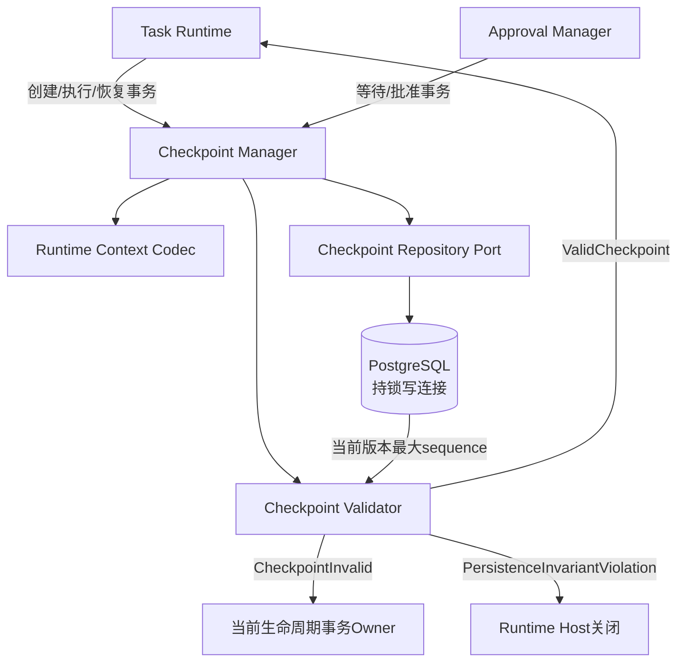
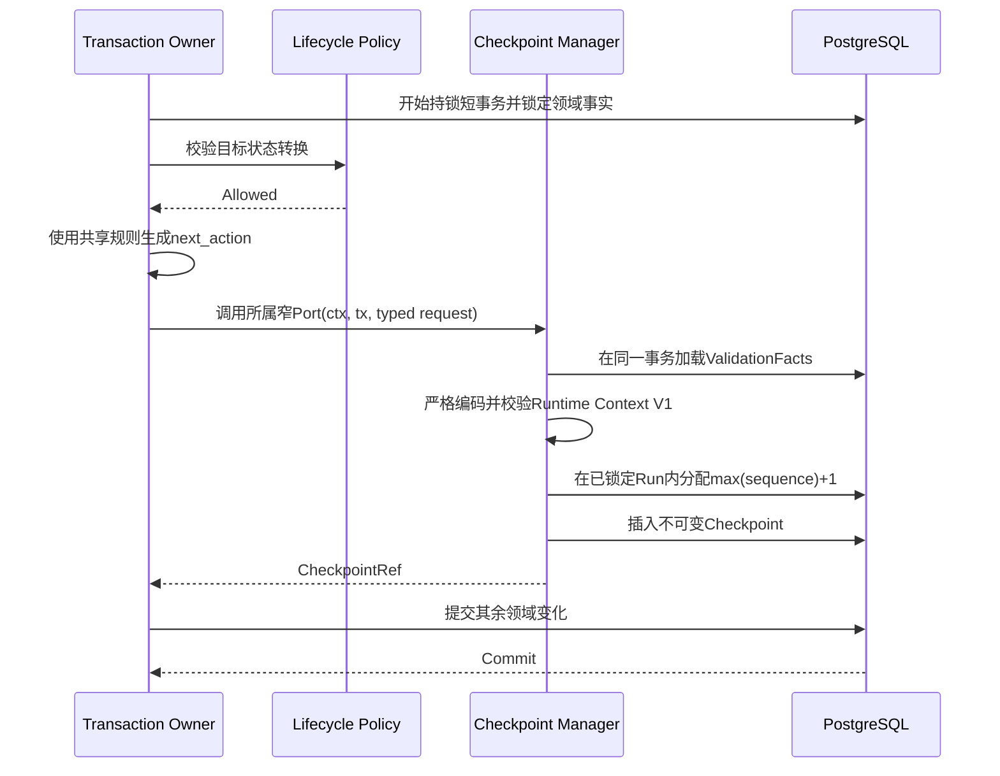
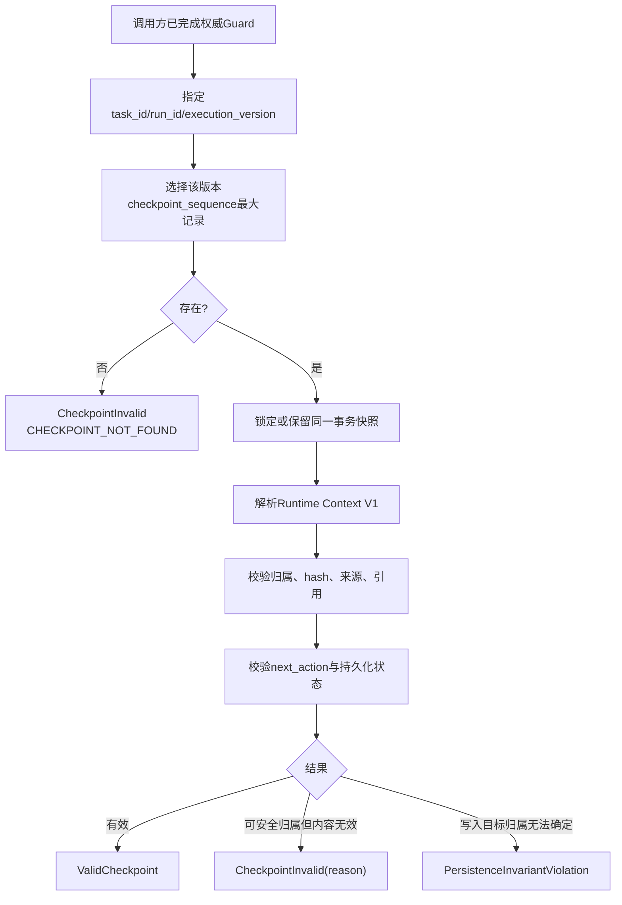
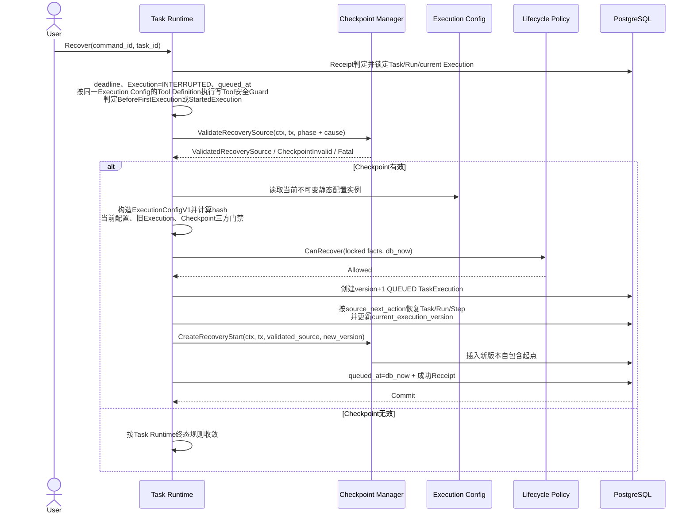
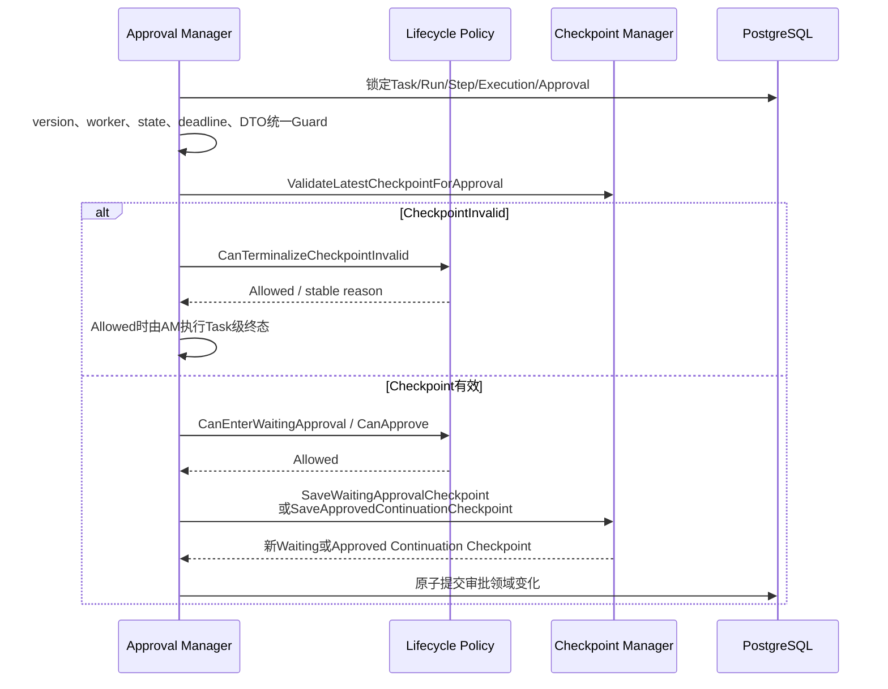
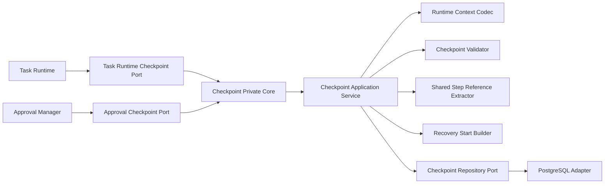
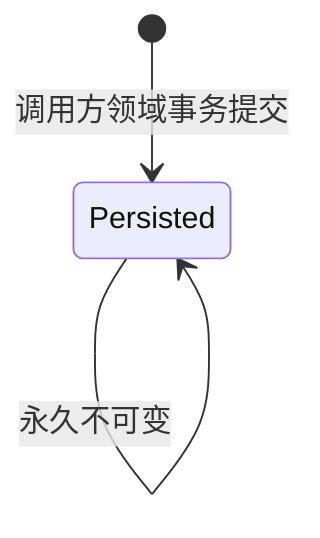
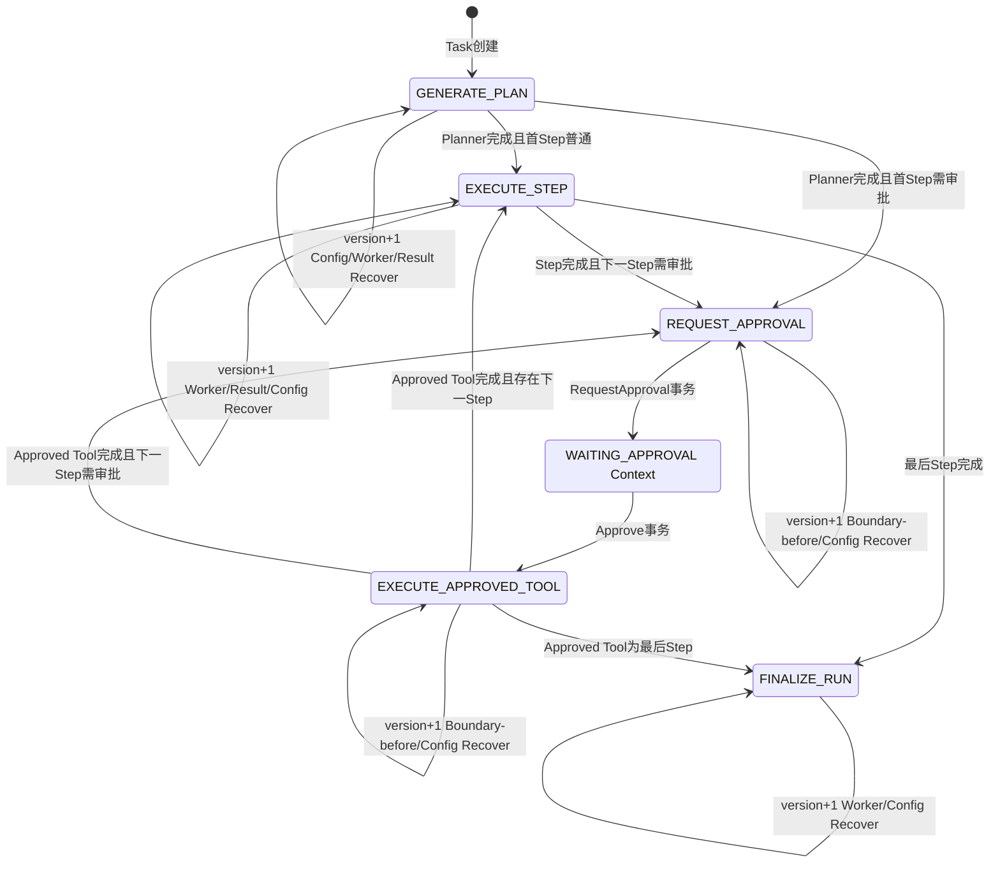

# Checkpoint 功能详细设计

| 属性 | 值 |
|---|---|
| 文档版本 | V1.8 |
| 文档状态 | MVP 详细设计 |
| 需求基线 | `docs/design/001-requirements.md` V3.5 |
| 架构基线 | `docs/design/003-system-architecture-design.md` V1.3 |
| 相邻详细设计 | Task Runtime V1.19、Worker V1.3、Planner V1.8、Step Executor V1.17、Approval V1.13、Tool Framework V1.14 |
| 设计规则 | `docs/specs/005-detailed-design-guideline.md` |
| 共享契约 | `docs/design/002-shared-domain-contract.md` V1.1 |
| 契约修订 | P1-03：冻结 ApprovedCheckpointEvidence 来源与版本矩阵 |

本文档中的 Checkpoint 是一次具体 `TaskExecution` 在确定执行边界保存的最小 Runtime Context。Checkpoint Manager 是应用层无状态组件，负责在调用方已经打开的短事务中保存、选择和校验 Checkpoint；Task Runtime 仍是 Recover 策略、生命周期迁移、`execution_version` 递增和重新排队的唯一 Owner。

> 跨模块契约说明：CheckpointNextAction、RuntimeContextV1、ResolvedReference、ApprovedCheckpointEvidence、ExecutionConfigHash、公共状态和错误字段以`docs/design/002-shared-domain-contract.md`为唯一规范来源。本文保留的同名表格只说明Checkpoint Manager的校验、保存和usage规则。

> 类型约束：Checkpoint实体、RuntimeContext、ValidationFacts、Recovery DTO、ApprovedCheckpointEvidence和Repository DTO 的执行版本字段使用共享 `ExecutionVersion`；`source_execution_version` 可空时使用 `*ExecutionVersion`。

## 1. 功能概述

### 1.1 功能目标

Checkpoint 模块在 MVP 中实现以下目标：

- 为 Task 创建、Planner 完成、Step 确定结果、WaitingApproval、Approve 和 Recover 保存最小 Runtime Context；
- 使用 `execution_version` 将每条 Checkpoint 归属到一次明确的 TaskExecution；
- 使用 Run 内严格递增的 `checkpoint_sequence` 提供唯一执行顺序；
- 只选择指定 execution_version 下 sequence 最大的最新记录，禁止过滤无效记录或回退；
- 校验 Checkpoint 与 Task、Run、TaskExecution、Plan、Step、Approval、ToolExecution 等持久化事实一致；
- 校验 Checkpoint 与对应 TaskExecution 的 `execution_config_hash` 一致，并把该 hash 返回给 Task Runtime完成当前配置三方校验；
- 为新 execution_version 创建自包含的 Recovery Start Checkpoint；
- 允许 Recovery Start Checkpoint 直接引用旧版本不可变的 Approved Approval，而不复制 Approval、不递归遍历历史 Checkpoint；
- 只引用已经安全持久化的结构化 Step 输出，不保存原始模型或 Tool 响应；
- 对所有当前执行路径要求存在 Checkpoint；缺失统一分类为 `CheckpointInvalid/CHECKPOINT_NOT_FOUND`；
- 通过类型化结果区分 CheckpointInvalid、归属无法确定和基础设施故障。

### 1.2 使用场景

| 场景 | 调用模块 | Checkpoint 模块行为 |
|---|---|---|
| 创建 Task | Task Runtime | 保存 v1 Initialization Checkpoint，`next_action=GENERATE_PLAN` |
| 首次成功领取且尚无 Plan | Task Runtime | 保存 GENERATE_PLAN Execution Checkpoint |
| Planner 完成 | Task Runtime | 保存指向首 Step 的 Execution Checkpoint |
| Step 得到确定结果 | Task Runtime | 与 Step、ToolExecution、Run Context 同事务保存下一执行位置 |
| 最后一个 Step 完成 | Task Runtime | 保存 `next_action=FINALIZE_RUN` |
| 请求高风险 Tool 审批 | Approval Manager | 保存直接引用 Pending Approval 的 WaitingApproval Checkpoint |
| Approve | Approval Manager | 保存直接引用 Approved Approval 的 Approved Continuation Checkpoint |
| Worker 执行或领取 | Task Runtime | 选择并校验当前版本最大 sequence Checkpoint |
| User Recover | Task Runtime | 校验旧版本来源并创建新版本 Recovery Start Checkpoint |
| StartupCleanup | Task Runtime | 校验持久化现场以辅助安全中断分类，不由 Checkpoint Manager 改状态 |

### 1.3 涉及模块

| 模块 | 与 Checkpoint 的关系 |
|---|---|
| Task Runtime | 主要调用方；决定保存点、执行位置、Recover 来源、恢复合法性和全部生命周期事务 |
| Approval Manager | 在等待和 Approve 事务中调用 Checkpoint Manager；先执行统一 Guard，再校验或保存 |
| Checkpoint Manager | 本设计范围；保存最小 Runtime Context，选择并校验指定版本最新记录，创建恢复起点 |
| Task Lifecycle Policy | 校验 Task/Run/Step/TaskExecution 状态迁移；Checkpoint Manager 不调用也不替代它 |
| Planner | 返回已校验 PlanDraft；不直接保存 Checkpoint |
| Step Executor | 返回 StepOutcome 和下一位置；不直接持有事务或写 Checkpoint |
| Shared Step Reference Extractor | 纯函数共享契约；从不可变 Step.input 提取并规范化显式引用 |
| Tool Framework | 创建 ToolExecution 外部调用边界；只读取当前 Checkpoint 的直接 Approval 证据 |
| Worker | 只通过 Task Runtime 消费已校验的当前版本 Checkpoint；不调用 Checkpoint Manager |
| Runtime Write Executor | 提供持有 advisory lock 的唯一 PostgreSQL 写连接和短事务执行边界 |
| Repository | 在调用方事务内读取、锁定和插入 Checkpoint 及其引用对象 |
| Execution Config | Task Runtime 从唯一强类型 `ExecutionConfigV1` 计算当前语义配置 hash；Checkpoint Manager 不读取配置服务、不构造配置、不计算 hash |
| TaskLog / Report | 读取已持久化事实；不参与 Checkpoint 有效性判断 |

### 1.4 职责边界

Checkpoint Manager 负责：

1. 严格解析 Runtime Context V1；
2. 校验保存请求的结构和最小性；
3. 在调用方事务内分配 Run 全局严格递增的 `checkpoint_sequence`；
4. 插入不可变 Checkpoint；
5. 先选择指定 execution_version 下 sequence 最大记录，再校验该记录；
6. 校验实体字段与 Runtime Context 内归属字段一致；
7. 校验 Checkpoint hash 与对应 TaskExecution hash 一致；
8. 校验 Runtime Context 引用的 Plan、Step、Step output、Approval 和 ToolExecution；
9. 校验 `next_action` 与当前持久化执行位置一致；
10. 按 Task Runtime 已验证的来源创建自包含 Recovery Start Checkpoint；
11. 返回类型化校验结果和稳定的 CheckpointInvalid reason；
12. 保证不通过历史扫描掩盖最新记录损坏。

Checkpoint Manager 不负责：

- 判断 Task、Run 或 TaskExecution 是否允许 Recover；
- 检查 Task deadline 或决定 Timeout；
- 构造、规范化或计算 `ExecutionConfigV1` 及当前语义配置 hash；
- 执行当前配置、TaskExecution、Checkpoint 的三方 hash 决策；
- 创建 TaskExecution 或递增 execution_version；
- 修改 Task.current_execution_version；
- 修改 Task、Run、Step、TaskExecution、Approval、ToolExecution、Report 或 `queued_at`；
- 创建 Command Receipt；
- 调用 Task Lifecycle Policy；
- 推导目标 Step 的 `next_action`；
- 自动接管 Worker、自动 Recover、自动重试或事件重放；
- 回退到更早 Checkpoint；
- 遍历跨版本 Checkpoint 来源链；
- 保存全量数据库快照、完整配置、原始模型响应、原始 Tool 响应或敏感凭证。

### 1.5 事务 Owner

| 事务 | 唯一 Owner | Checkpoint Manager 行为 |
|---|---|---|
| Task 创建 | Task Runtime | 在同一事务插入 Initialization Checkpoint |
| Planner 结果 | Task Runtime | 在 Plan/Step/Run 更新事务插入 Execution Checkpoint |
| Step 结果 | Task Runtime | 在 Step、ToolExecution、Run Context 更新事务插入 Execution Checkpoint |
| 进入 WaitingApproval | Approval Manager | 在 Approval 和四对象等待状态事务插入 WaitingApproval Checkpoint |
| Approve | Approval Manager | 在 Approval 和四对象继续执行事务插入 Approved Continuation Checkpoint |
| Recover | Task Runtime | 在新 TaskExecution、current_execution_version 和 queued_at 事务插入 Recovery Start Checkpoint |
| CheckpointInvalid 终态 | 当前生命周期用例 Owner | Checkpoint Manager只返回校验结果；不创建 Report、不迁移状态 |

所有保存操作复用调用方事务。Checkpoint Manager 不开启嵌套事务，不自行提交，也不在事务中执行模型、Kubernetes、HTTP 或其他外部调用。

### 1.6 MVP 范围与明确限制

MVP 只支持：

- 单 Task 单 Run；
- 单个不可变顺序 Plan；
- `GENERATE_PLAN`、`EXECUTE_STEP`、`REQUEST_APPROVAL`、`EXECUTE_APPROVED_TOOL`、`FINALIZE_RUN` 五种下一动作；
- Runtime Context V1；
- 人工 Recover；
- 当前版本最新 Checkpoint；
- 直接、单跳的恢复来源记录；
- Approved Approval 的直接跨版本引用；
- PostgreSQL 唯一持久化。

MVP 不实现：

- Checkpoint 更新、删除、压缩、归档或保留策略；
- Checkpoint 状态字段；
- `checkpoint_kind` 持久化字段；
- Chain、Digest、Merkle proof、签名或加密元数据；
- 完整配置快照；
- 跨 Run 恢复；
- 自动 Recover、历史回退或多候选恢复；
- Eino Checkpoint、Graph Resume 或第二套恢复状态；
- Event Sourcing、重放日志或从 TaskLog 重建状态；
- 多 Runtime、多 Worker、Lease、Heartbeat 或自动故障接管。

## 2. 业务流程

### 2.1 总体流程



Checkpoint Manager 的类型化结果不直接产生任何 Task 状态变化。调用方先完成自身的 current execution_version、worker、预期状态、deadline 和其他共享 Guard，再根据校验结果调用 Task Lifecycle Policy 或结束当前用例。

### 2.2 保存确定执行边界



约束：

- `next_action` 必须由 Task Runtime 或 Approval Manager 按共享规则生成；
- Checkpoint Manager 只验证调用方给出的动作，不动态推导或降级；
- Checkpoint 与同一执行边界的领域变化必须同时提交或同时回滚；
- Checkpoint 插入成功但调用方事务最终回滚时，该记录不可见；
- TaskLog 写入失败不得回滚已经提交的领域事务。

### 2.3 选择并校验当前版本最新 Checkpoint



选择步骤不得把 `runtime_context` 可解析、hash 匹配或其他有效性条件写入查询过滤器。即使最大 sequence 记录无效，也必须返回该记录的错误，不得继续读取更早记录。

### 2.4 Recover 与新版本恢复起点



Checkpoint Manager 不检查 Recover command_id、不读取当前配置、不创建 TaskExecution、不更新 `queued_at`。Recovery Start Checkpoint 只能在 Task Runtime 已完成所有恢复 Guard 和三方 hash 校验后创建。

### 2.5 Approval 边界



Approval Manager 必须先完成统一 Guard，再调用 Checkpoint Manager。CheckpointInvalid 没有跳过 current execution_version、worker、预期状态、deadline 或 Task Lifecycle Policy 的优先级。

## 3. 模块设计

### 3.1 模块定位与依赖方向



依赖方向固定为应用层窄端口指向同一模块的私有通用核心，再指向基础设施实现。Repository 不解释业务状态，PostgreSQL 类型不得穿透到 Task Runtime、Approval Manager、Runtime Context 或校验结果。通用核心不是跨模块公共 Port，调用方不能直接传入任意 `usage`、`purpose` 或持久化事实快照。

### 3.2 内部职责单元

| 单元 | 职责 |
|---|---|
| Checkpoint Application Service | 编排选择、校验和保存；不拥有外层事务 |
| Runtime Context Codec | 严格编码/解析 Runtime Context V1，拒绝未知字段和不支持版本 |
| Checkpoint Selector | 选择指定 execution_version 下最大 sequence 记录，不做有效性过滤 |
| Checkpoint Validator | 校验结构、归属、hash、引用、来源和动作状态矩阵 |
| Checkpoint Draft Validator | 保存前验证调用方构造的 Draft，不让非法记录进入数据库 |
| Recovery Start Builder | 从已验证来源复制最小自包含上下文并写直接来源 |
| Checkpoint Repository Port | 在既有事务中分配 sequence、读取和插入记录 |

以上均为同一模块内职责，不新增服务、后台进程或独立数据库。

### 3.3 Checkpoint Manager Port

Checkpoint 模块对外只暴露两个窄 Port；四个通用请求只存在于模块私有核心中。这样 Task Runtime 与 Approval Manager 不能选择不属于自己的 usage，也不能以调用方快照替代事务内事实。

**Task Runtime Checkpoint Port**

| 方法 | 固定 usage/purpose | 输入 | 输出 |
|---|---|---|---|
| `SaveRuntimeCheckpoint` | INITIALIZATION 或 EXECUTION，由请求的强类型 variant 固定 | context、事务、`RuntimeCheckpointSaveRequest` | CheckpointRef 或 system error |
| `LoadLatestForClaim` | CLAIM | context、事务、`RuntimeCheckpointQuery` | CheckpointValidationResult 或 system error |
| `LoadLatestForExecutionDispatch` | EXECUTION_DISPATCH | context、事务、`RuntimeCheckpointQuery` | CheckpointValidationResult 或 system error |
| `ValidateRecoverySource` | RECOVER | context、事务、`RecoverySourceQuery` | `ValidatedRecoverySource`、CheckpointInvalid 或 Fatal |
| `LoadLatestForStartupCleanup` | STARTUP_CLEANUP | context、事务、`RuntimeCheckpointQuery` | CheckpointValidationResult 或 system error |
| `CreateRecoveryStart` | RECOVERY_START | context、同一事务、`RuntimeRecoveryStartRequest` | CheckpointRef 或 system error |

**Approval Checkpoint Port**

| 方法 | 固定 usage/purpose | 输入 | 输出 |
|---|---|---|---|
| `ValidateLatestCheckpointForApproval` | APPROVAL_REQUEST 或 APPROVAL_DECISION，由请求 variant 固定 | context、事务、`ApprovalCheckpointValidationRequest` | `ValidatedApprovalCheckpoint`、CheckpointInvalid 或 Fatal |
| `SaveWaitingApprovalCheckpoint` | WAITING_APPROVAL | context、同一事务、`WaitingApprovalCheckpointRequest` | CheckpointRef 或 system error |
| `SaveApprovedContinuationCheckpoint` | APPROVED_CONTINUATION | context、同一事务、`ApprovedContinuationCheckpointRequest` | CheckpointRef 或 system error |

Approval 详细设计中的上述三个专用方法是唯一 Approval 适配方案；不得再增加 Approval 对通用 `SaveCheckpoint`、`LoadAndValidateLatest` 或 `ValidateCheckpoint` 的调用。适配器只把强类型 variant 映射到私有核心固定枚举，不包含生命周期决策。

`SaveWaitingApprovalCheckpoint` 必须在同一事务内重新加载刚创建的 Approval，并验证其 `execution_config_hash` 等于 FrozenToolRequest、当前 TaskExecution 和待保存 Checkpoint hash，同时验证 `Approval.frozen_input_hash=FrozenToolRequest.frozen_input_hash`。`ValidateLatestCheckpointForApproval(BeforeDecision)` 与 `SaveApprovedContinuationCheckpoint` 只读取持久化 Approval，不接受进程内 FrozenToolRequest 或调用方提供的 hash 覆盖值；保存到 approval_context 的 frozen_input_hash 只能复制自锁定 Approval。

#### 3.3.1 私有核心请求

私有核心方法签名冻结为：

| 方法 | 输入 | 输出 |
|---|---|---|
| `saveCheckpoint` | context、事务、SaveCheckpointRequest | CheckpointRef 或 system error |
| `loadAndValidateLatest` | context、事务、LatestCheckpointRequest | CheckpointValidationResult 或 system error |
| `createRecoveryStart` | context、事务、RecoveryStartRequest | CheckpointRef 或 system error |

不存在接收调用方 `ValidationFacts` 的公共或私有 `ValidateCheckpoint` 方法；对指定记录的复核是以上三个用例内部步骤，事实只能由 Manager 在传入事务中取得。

`SaveCheckpointRequest` 只由窄 Port 适配器构造：

| 字段 | 类型/约束 | 事实来源 |
|---|---|---|
| `purpose` | INITIALIZATION、EXECUTION、WAITING_APPROVAL、APPROVED_CONTINUATION | 由被调用的窄方法/variant 固定，调用方不能传任意字符串 |
| `task_id`、`run_id`、`execution_version` | 非空归属 | 调用方身份参数 |
| `execution_config_hash` | 64 个小写十六进制字符 | Task Runtime 从同一不可变 `ExecutionConfigV1` 计算后给出；Manager 只与事务内 TaskExecution 复核 |
| `runtime_context_draft` | RuntimeContextV1 Draft | Task Runtime 构造执行位置；Approval 仅提供审批增量，由适配器从已验证能力构造 |
| `resolved_references` | CanonicalResolvedReferences | 仅 Task Runtime 构造；Approval 保存沿用已验证能力中的绑定 |
| `validation_facts` | ValidationFacts | 仅 Manager 在同一事务加载，外部调用方不可设置 |

`LatestCheckpointRequest` 只由查询窄方法构造：

| 字段 | 类型/约束 | 事实来源 |
|---|---|---|
| `task_id`、`run_id`、`execution_version` | 唯一选择范围 | 调用方身份参数 |
| `usage` | CLAIM、EXECUTION_DISPATCH、RECOVER、APPROVAL_REQUEST、APPROVAL_DECISION、STARTUP_CLEANUP | 被调用窄方法固定 |
| `usage_context` | ClaimInitial/ClaimContinuation、BeforeFirstExecution/StartedExecution、ApprovalBeforeRequest/ApprovalBeforeDecision，或无额外variant | 窄请求的强类型variant经适配器映射；不能由通用字符串拼装 |
| `validation_facts` | ValidationFacts | Manager 在同一事务、选择最大记录后按 usage 加载 |

`RecoveryStartRequest` 只由 `CreateRecoveryStart` 适配器构造：

| 字段 | 类型/约束 | 事实来源 |
|---|---|---|
| `task_id`、`run_id` | 原业务结构 | Task Runtime 身份参数；Manager 事务内复核 |
| `new_execution_version` | 恰为来源版本+1 | Task Runtime 已决定并已锁定的新版本；Manager 复核 |
| `execution_config_hash` | 已通过 Task Runtime 三方 hash 校验 | Task Runtime 从当前不可变 `ExecutionConfigV1` 计算；Manager 只与旧来源、新 TaskExecution 复核 |
| `validated_source` | `ValidatedRecoverySource` | 只能由同一事务内 `ValidateRecoverySource` 成功返回 |
| `validation_facts` | 新旧 Execution、Task、Run、Plan、Step、Approval、ToolExecution 事实 | Manager 在同一事务重新加载或沿用同一事务能力；调用方不能注入 |

`RuntimeRecoveryStartRequest` 不接受任意 `CheckpointView`、`source_execution`、`approved_action` 或 `resolved_references`。这些内容只能来自 `ValidatedRecoverySource`，防止调用方拼装跨版本恢复来源。

#### 3.3.2 ValidationFacts

`ValidationFacts` 是模块私有、只读、同事务 DTO，不是调用参数。它由 Checkpoint Repository 按固定锁顺序加载：

| 投影 | 最小字段 |
|---|---|
| Task | id、current_run_id、current_execution_version、status、queued_at、deadline_at、error_code |
| Run | id、task_id、status、plan_id、current_step_id |
| TaskExecution | task_id、execution_version、status、worker_id、execution_config_hash、error_code、observed_config_hash、started_at |
| Plan（可空） | id、run_id |
| current Step（可空） | id、run_id、plan_id、sequence、type、status、input、output_schema、tool_name |
| previous Step（可空） | id、run_id、plan_id、sequence、status、output、output_schema |
| Approval（可空） | id、task_id、run_id、step_id、execution_version、execution_config_hash、frozen_input_hash、status、tool_name、frozen_tool_input、observed_values、resource_version |
| ToolExecution（可空） | id、task_id、run_id、step_id、execution_version、status、side_effect_unknown、error_code |
| selected Checkpoint | id、归属、sequence、context、hash、source 两字段 |

deadline 和 worker 的业务优先级仍由调用方 Guard 决定；这些字段进入 ValidationFacts 只用于验证 usage 状态矩阵，不授权 Manager 抢先返回 Timeout 或 Stale。

#### 3.3.3 事实来源约束

| 事实 | 调用方提供 | Manager 事务内加载 |
|---|---:|---:|
| context、事务句柄、task/run/version 身份 | 是 | 复核归属 |
| 固定 usage/purpose | 由窄方法隐含 | 是 |
| 当前 `ExecutionConfigV1` 及其规范化规则 | 不进入 Checkpoint Port | 否 |
| 当前语义配置 hash | Task Runtime 从 `ExecutionConfigV1` 计算后提供 | 只复核持久化 TaskExecution/Checkpoint，不重新计算 |
| Task/Run/Execution/Plan/Step 状态与字段 | 否 | 是 |
| Approval/ToolExecution 持久化事实 | 否 | 是 |
| 目标 Step 的 canonical resolved references | 仅 Task Runtime 构造 | 重新提取并完整校验 |
| Checkpoint 最大记录 | 否 | 是 |
| Recover 可恢复性、deadline、写 Tool 安全决策 | Task Runtime 负责 | Manager 不决策 |

同一事实不得同时以“调用方锁定快照”和 Repository 查询结果两种可分歧形式进入校验。Manager 必须使用传入的同一事务，不能使用普通连接池重读。

`risk_level`、`read_only` 和 Tool enabled/authorization 都属于 `ExecutionConfigV1.tool_framework.tools` 的静态 Tool capability，既不是 Step 字段，也不是 ToolExecution 字段，不进入任何 `ValidationFacts` 持久化投影。Checkpoint Manager 不读取 Tool Registry、Tool Definition 或完整 `ExecutionConfigV1`，不能用 hash、tool_name 或 ToolExecution 状态反推只读/写入属性；风险到 `next_action` 的生成、Tool 读写分类与静态配置一致性由 Task Runtime 从计算该 hash 的同一不可变 `ExecutionConfigV1` 投影给 Approval Manager、Step Executor 和 Tool Framework。

#### 3.3.4 同事务验证能力

`ValidatedRecoverySource` 和 `ValidatedApprovalCheckpoint` 是 Checkpoint 模块构造器私有的不可伪造能力，至少携带 transaction_scope_id、checkpoint_id、execution_version、checkpoint_sequence、inferred_type、已验证 Runtime Context 和 hash；Recovery能力还携带经矩阵验证的`source_phase`和`source_next_action`。能力：

- 只在产生它的数据库事务内有效；
- 不可序列化、不可持久化、不可跨 goroutine 或跨命令复用；
- 后续保存时必须复核同一 transaction_scope_id，且来源记录仍是指定版本最大 sequence；
- 事务提交、回滚或结束后立即失效。

`ValidatedRecoverySource` 的唯一合法来源是同一事务内 `ValidateRecoverySource` 对指定旧版本最大 Checkpoint 的成功结果；`ValidatedApprovalCheckpoint` 的唯一合法来源是同一事务内 Approval 专用验证方法的成功结果。

#### 3.3.5 对外请求 DTO

对外 DTO 也采用封闭类型，不使用 `map[string]any` 或可选字段组合模拟 variant：

| DTO | 固定字段 | variant 专用字段 |
|---|---|---|
| `RuntimeCheckpointSaveRequest` | task_id、run_id、execution_version、execution_config_hash | `InitializationDraft`；或 `ExecutionDraft{plan_id,current_step_id,next_action,resolved_references}` |
| `RuntimeCheckpointQuery` | task_id、run_id、execution_version | `LoadLatestForClaim` 必须为 `InitialClaim` 或 `QueuedContinuation`；其他方法无 variant；usage 由方法名固定 |
| `RecoverySourceQuery` | task_id、run_id、source_execution_version | `BeforeFirstExecution` 或 `StartedExecution`，只表达 Task Runtime 已完成的来源阶段，不携带候选 Checkpoint |
| `RuntimeRecoveryStartRequest` | task_id、run_id、new_execution_version、execution_config_hash、validated_source | 无任意来源/Approval/引用字段 |
| `ApprovalCheckpointValidationRequest` | task_id、run_id、execution_version、step_id | `BeforeRequestApproval{worker_id}` 或 `BeforeDecision{approval_id,decision}` |
| `WaitingApprovalCheckpointRequest` | validated_checkpoint、new_approval_id、frozen_tool_request | 不接受 resolved_references |
| `ApprovedContinuationCheckpointRequest` | validated_checkpoint、approved_approval_id | 不接受 frozen input 重写或 resolved_references |

`decision` 只用于选择 APPROVAL_DECISION 状态矩阵，Reject 成功仍不创建新 Checkpoint。所有 ID 都是 AgentOps 强类型；请求不暴露 Repository、数据库 row、JSONB、`ValidationFacts` 或通用 usage/purpose。

#### 3.3.6 usage 所需事实投影

Repository 根据私有 `LatestCheckpointRequest.usage` 选择固定加载计划；这是性能投影，不改变第3.3.2节同一事实定义：

| usage | 必须加载 |
|---|---|
| CLAIM | Task、Run、当前 TaskExecution、最大 Checkpoint；按 Context 加载 Plan、current/previous Step、Approval、ToolExecution |
| EXECUTION_DISPATCH | CLAIM 全部事实，并要求当前 worker Ownership |
| RECOVER | Task、Run、旧 TaskExecution、最大 Checkpoint、Plan、current/previous Step、直接 Approval、当前版本 ToolExecution |
| APPROVAL_REQUEST | Task、Run、当前 Execution、current/previous Step、最大 Checkpoint、已有 Approval/ToolExecution |
| APPROVAL_DECISION | Task、Run、当前 Execution、current Step、目标 Pending Approval、最大 Checkpoint、ToolExecution |
| STARTUP_CLEANUP | Task、Run、旧 worker 的 RUNNING Execution、最大 Checkpoint、current Step、当前版本 ToolExecution、直接 Approval |

“按 Context 加载”只能发生在最大记录已经被选出之后，不能把引用存在性加入选择 SQL 的 WHERE 条件。

任一 usage 加载到直接 Approval 且 `Approval.execution_version` 与请求版本不同（仅合法 Recovery Start）时，还必须按 `approval.task_id + approval.execution_version` 加载该 Approval 所属 TaskExecution 的最小 hash 投影。该读取只验证不可变 Approval 证据，不遍历 Checkpoint 来源链。

以上加载计划不包含 Tool Registry、Tool Definition 或 `ExecutionConfigV1`。`RECOVER` 与 `STARTUP_CLEANUP` 所需的只读/写入分类必须由 Task Runtime 在调用 Checkpoint Port 前使用计算该 `execution_config_hash` 的同一不可变 `ExecutionConfigV1.tool_framework.tools` 投影完成；Checkpoint Manager 只验证调用后可观察的持久化归属、状态、错误码和副作用标记。

Checkpoint Manager 不接收、不构造也不修改 `ExecutionScope`。对于 `EXECUTION_DISPATCH`，它只在 `ValidCheckpoint` 中返回已验证的持久化 `execution_config_hash`；Task Runtime 必须再完成当前 `ExecutionConfigV1`、TaskExecution 和该 Checkpoint 的三方门禁，随后按《跨模块共享领域契约》第4节唯一构造共享 Scope。Step Executor、Tool Framework 或 Approval 不得要求 Checkpoint Manager 为 Scope 计算、补全或刷新 hash。

### 3.4 CheckpointValidationResult

> 封闭结果及错误作用域的唯一来源见共享契约第7.4节；本节只说明 Checkpoint Manager 返回的模块专用载荷。

校验结果为封闭联合类型：

| kind | 字段 | 语义 |
|---|---|---|
| `ValidCheckpoint` | CheckpointView、RuntimeContextV1、inferred_type、execution_config_hash | 指定记录对当前 usage 有效；hash 直接来自已验证的不可变 Checkpoint |
| `CheckpointInvalid` | checkpoint_id（缺失时为空）、task_id、run_id、execution_version、reason_code | 对象能够安全归属，但要求存在的 Checkpoint 缺失、内容或引用无效 |
| `PersistenceInvariantViolation` | safe_reason_code | 无法唯一确定 Task/Run/Execution 或安全写入目标，必须升级 Runtime Fatal |

CLAIM、EXECUTION_DISPATCH、RECOVER、APPROVAL_REQUEST、APPROVAL_DECISION 和 STARTUP_CLEANUP 全部要求 Checkpoint 存在；选择为空时直接返回 `CheckpointInvalid/CHECKPOINT_NOT_FOUND`。MVP 没有允许 Checkpoint 不存在的历史查询 Port，因此不定义 `Missing` 结果。

Checkpoint Manager 不返回 `Stale`、`StateConflict`、`DeadlineExceeded`、`TaskTimeout`、`CONFIG_VERSION_MISMATCH` 或 `ApprovalContextChanged`：

- Stale、状态冲突和 deadline 由调用方 Guard 决定；
- 当前配置三方 hash 不一致由 Task Runtime 返回 `CONFIG_VERSION_MISMATCH`；
- Kubernetes live resource 变化由 Tool Framework 返回 `ApprovalContextChanged`；
- CheckpointInvalid 终态由当前生命周期事务 Owner 和 Task Lifecycle Policy 决定。

### 3.5 Runtime Context Codec

Codec 必须：

- 只接受 JSON object；
- 使用固定 `schema_version=1`；
- 拒绝未知顶层字段、未知嵌套字段和未知枚举；
- 区分缺失、NULL、空数组和空对象；
- 校验所有 ID、sequence、字段名和 hash 格式；
- 使用 AgentOps 自有 DTO，不暴露数据库 JSON、Eino、Kubernetes 或 Provider 类型；
- 编码前先完成字段白名单和安全检查；
- 使用确定性字段集合编码，不能依赖 map 随机顺序作为测试或 hash 输入；
- Codec 本身不解析 Step.input、也不执行引用值替换；Checkpoint Validator 另行调用共享提取器重算规范绑定。

`schema_version` 是 `runtime_context` 内部协议字段，不是独立数据库列，也不改变 Checkpoint 的业务分类。

### 3.6 Repository Port

Repository 提供：

- `AllocateNextSequence(tx, run_id)`；
- `InsertCheckpoint(tx, checkpoint)`；
- `FindLatestByExecutionVersion(tx, task_id, run_id, execution_version)`；
- `FindByID(tx, checkpoint_id)`；
- `LoadTaskExecution(tx, task_id, execution_version)`；
- 按引用加载 Plan、Step、Approval、ToolExecution；
- 校验 Run 与 Task 归属。

`AllocateNextSequence` 要求调用方已按全局锁序锁定 Run。在单持锁写连接下读取 `MAX(checkpoint_sequence)+1` 并插入，同时以 `(run_id, checkpoint_sequence)` 唯一约束作为数据库后备保护。Repository 不在唯一冲突后自动选择另一 sequence 或重试事务。

### 3.7 调用方契约

调用 Checkpoint Manager 前：

- Task Runtime 必须完成 current execution_version、worker_id、TaskExecution 状态、deadline 和适用写 Tool 安全 Guard；
- Approval Manager 必须完成 current execution_version、RequestApproval worker_id、Approval Pending、四对象预期状态、queued_at、deadline、DTO 和静态配置 Guard；
- 调用方必须按既有锁顺序锁定将被状态推进的领域对象；
- `next_action` 必须已由共享执行动作规则生成；
- 所有被引用结果必须已经完成结构化、大小限制和脱敏。

Checkpoint Manager 返回 Valid 后：

- 调用方仍须使用 Task Lifecycle Policy 校验状态转换；
- 所有条件更新仍须携带 execution_version 和预期状态；
- Checkpoint Valid 不构成 Worker Ownership、恢复授权或状态迁移许可；
- 事务提交前的零行更新仍必须回滚并重新分类。

### 3.8 共享 next_action 契约

> CheckpointNextAction枚举与Owner唯一来源见共享契约第2.1节；本节只说明Checkpoint校验后果。

Checkpoint Manager 使用共享契约第2.1节定义的唯一动作枚举，但不拥有生成规则：

| next_action | 生成 Owner |
|---|---|
| `GENERATE_PLAN` | Task 创建事务、首次 Claim 的无 Plan 执行起点、Recover 复制合法生成 Plan 来源 |
| `EXECUTE_STEP` | Task Runtime 的 Planner 结果或 Step 结果事务 |
| `REQUEST_APPROVAL` | Task Runtime 的 Planner/Step 结果事务，或合法来源 Recover |
| `EXECUTE_APPROVED_TOOL` | Approval Manager Approve 事务，或 Task Runtime Recover 复制已验证 Approved 动作 |
| `FINALIZE_RUN` | Task Runtime 最后 Step 结果事务，或合法来源 Recover |

Checkpoint Manager 只校验冻结动作的结构和持久化后果：Step 类型/位置、Approval 引用、ToolExecution 归属、状态、`error_code`、`side_effect_unknown` 及对象状态必须与动作一致。它不得读取静态 Tool capability，不得根据 `risk_level`、`read_only` 重算动作或把 ToolExecution 分类为只读/写入，也不得把调用方给出的动作改成另一值。

### 3.9 usage × Checkpoint 类型 × 状态验证矩阵

下表是 Validator 的封闭契约。“Execution”包含 source 为空且非 Initialization 的记录；“Recovery”表示 Recovery Start。未列出的组合一律返回 `CheckpointInvalid/CHECKPOINT_NEXT_ACTION_INVALID` 或更具体的引用 reason，不得由实现自行放宽。

| usage | 允许类型 | Task / Run / TaskExecution | 动作与关键事实 |
|---|---|---|---|
| CLAIM / InitialClaim | Initialization | Pending / Pending / QUEUED，worker_id=NULL，queued_at非NULL | 仅 GENERATE_PLAN；无 Plan、Step、Approval、ToolExecution |
| CLAIM / QueuedContinuation | Execution、Recovery | Pending/Pending/QUEUED 仅限尚未执行的 GENERATE_PLAN；其他为 Running/Running/QUEUED；worker_id=NULL，queued_at非NULL | 当前版本最大记录；动作满足第5.2节 |
| EXECUTION_DISPATCH | Execution、Recovery | Running / Running / RUNNING，worker_id为当前 Owner | GENERATE_PLAN 无 Step；其他动作的 Step、Approval、ToolExecution 满足第5.2节 |
| RECOVER / BeforeFirstExecution | Initialization | Task=INTERRUPTED/CONFIG_VERSION_MISMATCH，Run=Pending，Execution=INTERRUPTED/CONFIG_VERSION_MISMATCH，queued_at=NULL | GENERATE_PLAN；无 Plan、Step、模型/Tool调用或Approval |
| RECOVER / BeforeFirstExecution | Recovery | Task=INTERRUPTED/CONFIG_VERSION_MISMATCH，Run=Pending，Execution=INTERRUPTED/CONFIG_VERSION_MISMATCH，queued_at=NULL | Recovery Start 的 GENERATE_PLAN 在首次领取前再次配置失配；支持连续Recover |
| RECOVER / StartedExecution | Execution、Recovery | Task=Running，Run=Running，Execution=INTERRUPTED/WORKER_INTERRUPTED或RESULT_PERSISTENCE_FAILED，queued_at=NULL | Worker或安全结果持久化中断；来源动作满足第3.9.1节 |
| RECOVER / StartedExecution | Recovery；或EXECUTE_APPROVED_TOOL的Execution | Task=INTERRUPTED/CONFIG_VERSION_MISMATCH，Run=Running，Execution=INTERRUPTED/CONFIG_VERSION_MISMATCH，queued_at=NULL | 恢复后或Approval后QUEUED领取配置失配；来源动作满足第3.9.1节 |
| APPROVAL_REQUEST | Execution、Recovery | Task/Run/Step=Running，Execution=RUNNING，worker_id匹配 | REQUEST_APPROVAL 且 approval_context=NULL；当前ToolCall Step尚无Approval；Manager不重算静态风险 |
| APPROVAL_DECISION | Execution | Task/Run/Step=WaitingApproval，Execution=WAITING_APPROVAL，worker_id=NULL，queued_at=NULL | REQUEST_APPROVAL 且直接引用同版本 Pending Approval |
| STARTUP_CLEANUP | Execution、Recovery | Task/Run=Running，Execution=RUNNING 且 worker_id为旧实例 | 动作与 Step/ToolExecution 持久化边界一致；Initialization 不合法；只读/写入分类由 Task Runtime 在调用前完成 |

Approval 保存的 WaitingApproval 与 Approved Continuation 都是 Execution Checkpoint。Approve 成功后新 Continuation 可被后续 CLAIM 和 EXECUTION_DISPATCH 使用；Reject 不创建继续执行 Checkpoint。

#### 3.9.1 RECOVER 来源封闭矩阵

`ValidateRecoverySource` 必须同时匹配来源类型、中断原因、来源 `next_action` 和当前持久化状态。以下是完整允许集合：

| 来源类型 | TaskExecution.error_code | Task / Run | 来源 next_action | 必需持久化后果 |
|---|---|---|---|---|
| Initialization | CONFIG_VERSION_MISMATCH | INTERRUPTED / Pending | GENERATE_PLAN | 无Plan、Step、Approval、ToolExecution；从未成功领取 |
| Recovery | CONFIG_VERSION_MISMATCH | INTERRUPTED / Pending | GENERATE_PLAN | 当前Recovery Start尚未成功领取；无Plan、Step、Approval、ToolExecution |
| Execution、Recovery | WORKER_INTERRUPTED | Running / Running | GENERATE_PLAN | 无Plan/current Step；Execution已开始 |
| Execution、Recovery | RESULT_PERSISTENCE_FAILED | Running / Running | GENERATE_PLAN | Planner安全结果事务未提交；无可见Plan |
| Execution、Recovery | WORKER_INTERRUPTED | Running / Running | EXECUTE_STEP | Plan与current Step存在且Step仍为Running；ToolExecution不存在，或其归属当前动作且为FAILED/WORKER_INTERRUPTED、side_effect_unknown=false；无与动作冲突的Approval |
| Execution、Recovery | RESULT_PERSISTENCE_FAILED | Running / Running | EXECUTE_STEP | Model/Analysis/Verification Step要求ToolExecution不存在；ToolCall Step要求当前动作ToolExecution=FAILED/RESULT_PERSISTENCE_FAILED且side_effect_unknown=false；静态只读安全性已由Task Runtime前置Guard确认 |
| Execution、Recovery | WORKER_INTERRUPTED | Running / Running | REQUEST_APPROVAL | Plan与Running ToolCall Step存在；approval_context为空且无Pending Approval |
| Execution、Recovery | WORKER_INTERRUPTED | Running / Running | EXECUTE_APPROVED_TOOL | Plan与Running ToolCall Step存在；直接引用Approved Approval；尚未创建当前动作ToolExecution |
| Execution、Recovery | WORKER_INTERRUPTED | Running / Running | FINALIZE_RUN | Plan存在，最后Step已Completed；尚未提交Run成功终态 |
| Recovery | CONFIG_VERSION_MISMATCH | INTERRUPTED / Running | GENERATE_PLAN、EXECUTE_STEP、REQUEST_APPROVAL、EXECUTE_APPROVED_TOOL、FINALIZE_RUN | StartedExecution阶段的恢复版本在QUEUED领取时配置失配；动作后果分别满足上列对应规则 |
| Execution | CONFIG_VERSION_MISMATCH | INTERRUPTED / Running | EXECUTE_APPROVED_TOOL | Approval Manager保存Continuation并重新排队后，QUEUED领取配置失配；直接Approved Approval仍有效 |

补充约束：

- 所有行都要求旧 TaskExecution=INTERRUPTED、worker_id保持历史值或NULL、queued_at=NULL；
- `REQUEST_APPROVAL` 带 Pending Approval 的 WaitingApproval Context 不在Recover集合中；
- Task Runtime必须在调用本模块前使用同一Execution Config的Registry/Tool Definition完成Tool读写分类；`RESULT_PERSISTENCE_FAILED`只允许Model类Step或静态只读Tool，静态写Tool与该中断原因组合属于既有`PersistenceInvariantViolation`且不得调用`ValidateRecoverySource`；
- 写 Tool存在RUNNING或UNKNOWN时由Task Runtime在调用本模块前拒绝Recover；Checkpoint Manager不判断“写Tool”，但任何UNKNOWN/side_effect_unknown=true或与来源动作冲突的RUNNING ToolExecution仍按持久化后果拒绝；
- `ValidatedRecoverySource` 必须保存 `source_phase=BEFORE_FIRST_EXECUTION|STARTED_EXECUTION`；该值只描述中断时的来源现场，由上述当前持久化事实验证产生，不由调用方任意指定，也不得用于替代 `source_next_action` 决定新版本状态；
- Recover成功始终创建 `new_execution_version=source_execution_version+1`；连续Recover每次只使用当前版本最大自包含来源，不扫描更早版本。

## 4. 数据设计

### 4.1 Checkpoint 实体

| 字段 | 必填 | 语义 | 可变性 |
|---|---:|---|---|
| `checkpoint_id` | 是 | 全局唯一标识 | 不可变 |
| `task_id` | 是 | 所属 Task | 不可变 |
| `run_id` | 是 | 所属唯一 Run | 不可变 |
| `execution_version` | 是 | 所属 TaskExecution 版本 | 不可变 |
| `checkpoint_sequence` | 是 | Run 内全局严格递增序号 | 不可变 |
| `runtime_context` | 是 | Runtime Context V1 结构化值 | 不可变 |
| `execution_config_hash` | 是 | 所属执行语义配置摘要 | 不可变 |
| `source_execution_version` | 否 | Recovery Start 的直接来源版本 | 不可变 |
| `source_checkpoint_id` | 否 | Recovery Start 的直接来源 Checkpoint | 不可变 |
| `created_at` | 是 | PostgreSQL UTC 创建时间 | 不可变 |

Checkpoint 不提供 update 方法。数据库修复不属于正常应用流程。

### 4.2 RuntimeContextV1

> 跨模块字段和不可变语义见共享契约第7.4节；Codec及持久化细节仍由本模块定义。

| 字段 | 必填条件 | 语义 |
|---|---|---|
| `schema_version` | 始终 | 固定为 1 |
| `task_id`、`run_id`、`execution_version` | 始终 | 必须与 Checkpoint 实体一致 |
| `plan_id` | Plan 已生成后 | 当前不可变 Plan |
| `current_step_id` | next_action 与 Step 有关时 | 下一次将执行或当前暂停的 Step |
| `next_action` | 始终 | 五种冻结动作之一 |
| `resolved_references` | 始终 | 由next_action确定action mode；执行Step动作保存规范绑定，GENERATE_PLAN/FINALIZE_RUN固定为空数组 |
| `approval_context` | WaitingApproval 已创建或执行 Approved Tool 时 | Approval 与冻结 Tool 现场 |

Runtime Context 不保存：

- Task 输入副本；
- Plan 或 Step 完整副本；
- Step.output 值副本；
- 全历史 Step 摘要；
- Memory；
- Prompt；
- 原始模型或 Tool 响应；
- Kubernetes 完整资源；
- Secret、Token、凭证或内部错误 cause；
- Task、Run、Execution 的状态快照。

状态由数据库领域对象提供，Runtime Context 只保存位置和直接引用。

### 4.3 ResolvedReference

> 公共引用协议、action mode和Owner见共享契约第7.4节；本节保留线协议的Checkpoint校验细节。

每条 `resolved_references` 包含：

| 字段 | 语义 |
|---|---|
| `target_path` | 目标 Step.input 中的结构化路径片段数组线协议 |
| `source_step_id` | 紧邻前序 Step |
| `source_output_field` | `step.output.<field>` 的直接字段名 |

`target_path` 的 JSON 线协议固定为数组，每个 segment 是以下封闭联合类型之一：

```json
[
  {"kind":"key","key":"spec"},
  {"kind":"key","key":"containers"},
  {"kind":"index","index":0},
  {"kind":"key","key":"image"}
]
```

- key segment 必须且只能包含 `kind=key` 与非空 UTF-8 `key`；
- index segment 必须且只能包含 `kind=index` 与非负十进制整数 `index`；
- 禁止未知字段、同时出现 key/index、空路径、JSONPath/JMESPath 字符串或其他 segment；
- 单条路径最大 16 个 segment；单 Step 最多 256 条引用。

共享 `StepReferenceExtractor` 是唯一提取算法，输入 `action_mode`、适用时的不可变 Step.input、目标 Step sequence 和紧邻前序 Step 投影，输出 `CanonicalResolvedReferences`。`action_mode` 由冻结 `next_action` 唯一派生，不单独持久化：

| next_action / action_mode | 提取行为 |
|---|---|
| EXECUTE_STEP / TARGET_STEP_INPUT | 从目标 Step.input 提取并精确校验 |
| REQUEST_APPROVAL / TARGET_STEP_INPUT | 从目标 ToolCall Step.input 提取并精确校验 |
| EXECUTE_APPROVED_TOOL / TARGET_STEP_INPUT | 从目标 ToolCall Step.input 提取并精确校验；实际执行仍使用冻结Approved输入 |
| GENERATE_PLAN / NO_STEP_INPUT | 不读取Step.input，期望绑定固定为空数组 |
| FINALIZE_RUN / NO_STEP_INPUT | 不重算最后一个已Completed Step.input，期望绑定固定为空数组 |

`TARGET_STEP_INPUT` 模式固定执行：

1. 深度优先遍历 Step.input 的对象字段与数组元素；
2. 只把完整字符串值 `step.output.<field>` 识别为引用；以保留前缀`step.output.`开头但语法不完整、模板、拼接、多级字段均拒绝；
3. 不以保留前缀开头、仅在普通文本中部包含`step.output.`的字符串按字面量处理，不识别为引用；
4. source Step 必须是目标 Step 的 `sequence-1` 且为 Completed；
5. field 必须是直接字段，并同时存在于 source output_schema 与已安全持久化的 output；
6. 每个 target_path 只能绑定一次；精确重复或同路径不同来源都返回重复错误；同一 source field 可用于不同 target_path；
7. 按 target_path 排序：segment 逐项比较，key 在 index 前，key 按 UTF-8 字节序，index 按数值；共同前缀相同时短路径在前；再以 source_step_id 的规范字符串 UTF-8 字节序、source_output_field 的 UTF-8 字节序作确定性次序；
8. 无引用时固定为空数组，不使用 NULL。

共享提取器返回模块无关的 `ReferenceIssueCode`。数量超限的共享稳定码固定为 `REFERENCE_COUNT_LIMIT_EXCEEDED`：Planner 直接把它作为 `ValidationIssue.code`，Step Executor 把它作为契约错误的 `cause_code`；Checkpoint Manager 在 Task 级分类中确定性映射为 `CheckpointInvalid/CHECKPOINT_REFERENCE_LIMIT_EXCEEDED`。各模块不得用不同计数算法或通过自由文本替代该映射。

Task Runtime 是持久化 `resolved_references` 的唯一构造 Owner。Planner 完成或 Step 结果事务中，Task Runtime 按将要保存的next_action选择action mode并把规范结果放入保存请求。Approval Manager 不构造或修改绑定，只能从 `ValidatedApprovalCheckpoint` 沿用已经验证的当前绑定。Checkpoint Manager 按同一action mode验证：TARGET_STEP_INPUT时使用共享提取器从事务内 Step.input 重新计算并要求与 Draft 或 Context **数量、顺序和每个字段完全一致**；NO_STEP_INPUT时只要求空数组，禁止读取或重算Step.input。Step Executor只在三种Step动作模式中使用同一提取器做运行期解析，不构造待持久化绑定。

恢复时不复制任意调用方列表。Checkpoint Manager 按来源next_action选择相同action mode：TARGET_STEP_INPUT时验证来源 Context 与来源 Step.input 完整一致；NO_STEP_INPUT时要求来源列表为空且不读取已完成Step.input。验证后由 `ValidatedRecoverySource` 把同一规范列表写入新版本起点；不保存解析后的字段值，运行时仍从持久化 Step.output 读取。

### 4.4 ApprovalContext

`approval_context` 是最小冻结执行投影：

| 字段 | 语义 |
|---|---|
| `approval_id` | 直接引用的 Approval |
| `approval_execution_version` | Approval 自身所属版本 |
| `tool_name` | 冻结 Tool 稳定名称 |
| `frozen_tool_input` | 已解析、Schema 校验、规范化且安全的完整输入 |
| `observed_values` | 审批展示和执行复核所需的允许字段旧值 |
| `resource_version` | 审批时 Kubernetes resourceVersion |
| `frozen_input_hash` | 与不可变 Approval 相同的 FrozenApprovedToolInputV1 摘要 |

规则：

- WaitingApproval Checkpoint 直接引用同版本 Pending Approval；
- Approved Continuation Checkpoint 直接引用同版本 Approved Approval；
- Recovery Start Checkpoint 可以直接引用旧版本 Approved Approval；
- 跨版本引用必须同时具有 Checkpoint 顶层 `source_execution_version/source_checkpoint_id`；
- 新 Recovery Start 必须复制已经验证的上述最小冻结投影，使当前版本自包含；
- Waiting、Approved Continuation 与 Recovery Start 的 `frozen_input_hash` 均必须等于直接引用 Approval 的不可变同名字段；
- Approval 记录不复制、不修改；
- Worker 和 Step Executor 不读取来源 Checkpoint 链；
- `frozen_tool_input` 不允许包含 JSON Patch operations、完整 Deployment 或未批准字段。

冻结 JSON 的一致性按规范化结构逐字段比较，不比较原始文本、空白或对象字段顺序。

#### 4.4.1 ApprovedCheckpointEvidence 投影

> DTO字段集合和来源边界见共享契约第7.2节；本节只说明从已验证Checkpoint投影。

采用方案 B。`ApprovedCheckpointEvidence` 是 Tool Framework Port 的共享进程内 DTO，不是新的 Checkpoint 持久化字段。Task Runtime 只能在 Checkpoint Manager 已验证当前版本最大 Checkpoint 后按下表投影：

| Evidence字段 | Checkpoint来源 |
|---|---|
| `checkpoint_id` | 当前最大 Checkpoint 主键 |
| `approval_id` | `runtime_context.approval_context.approval_id` |
| `execution_version` | 当前 Checkpoint.execution_version |
| `checkpoint_type` | 下述端口专用推断值 |
| `source_execution_version` | Recovery Start 顶层字段；非Recovery为空 |
| `source_checkpoint_id` | Recovery Start 顶层字段；非Recovery为空 |
| `execution_config_hash` | 当前 Checkpoint.execution_config_hash |
| `frozen_input_hash` | `runtime_context.approval_context.frozen_input_hash` |

`checkpoint_type` 只允许：

- `APPROVED_CONTINUATION`：Checkpoint 按第4.5节推断为 Execution，`next_action=EXECUTE_APPROVED_TOOL`，source 两字段为空，直接引用同版本 Approved Approval；
- `RECOVERY_START`：Checkpoint 按第4.5节推断为 Recovery Start，`next_action=EXECUTE_APPROVED_TOOL`，source 两字段同时存在，直接引用已经验证的 Approved Approval。

Evidence 不包含完整冻结输入、observed_values、resourceVersion、task/run/step/tool、Approval状态或worker_id。Approval动作事实由独立 `ApprovedAction` 表达；当前 TaskExecution 事实由 `ExecutionScope` 表达。

构造前必须验证：

- 当前 Checkpoint 是指定 execution_version 的最大 sequence；
- approval_context 直接引用已持久化 Approved Approval；
- `approval_id` 和 `frozen_input_hash` 与 Approval 相等；
- `Checkpoint.execution_config_hash=Approval.execution_config_hash=当前 TaskExecution.execution_config_hash`；
- 同版本路径 Approval.execution_version=Checkpoint.execution_version；
- Recovery路径 `source_execution_version=Checkpoint.execution_version-1`，source_checkpoint_id属于该直接来源版本；Approval原始版本允许早于直接来源版本，以支持连续Recover；
- Recovery来源 Checkpoint 的自包含 approval_context 与当前 Recovery Start 的 approval_id、frozen_input_hash 一致；不递归读取更早来源链。

缺失、非法类型、source不完整或不能证明直接引用返回 `CheckpointInvalid`。若调用方在获得已验证能力后改写 Evidence，属于下游 `STEP_EXECUTOR_CONTRACT_BROKEN`；Checkpoint Manager 不提供“修复”或重新推导 Port。

### 4.5 Checkpoint 类型推断

MVP 不持久化 `checkpoint_kind`，按不可变字段推断：

| 推断类型 | 唯一条件 |
|---|---|
| Initialization Checkpoint | Task 创建事务产生；execution_version=1、checkpoint_sequence=1、next_action=GENERATE_PLAN、source 两字段均为空、无 Plan/Step/Approval |
| Recovery Start Checkpoint | source_execution_version 与 source_checkpoint_id 均非空 |
| Execution Checkpoint | source 两字段均为空，且不满足 Initialization 条件 |

source 两字段必须同时为空或同时非空。只有 Recover 事务可以创建 Recovery Start Checkpoint。

### 4.6 保存点与 Runtime Context

| 保存点 | current_step_id | next_action | approval_context | 事务 Owner |
|---|---|---|---|---|
| Task 创建 | NULL | GENERATE_PLAN | NULL | Task Runtime |
| 首次 Claim、无 Plan | NULL | GENERATE_PLAN | NULL | Task Runtime |
| Planner 完成 | 首 Step | 共享规则结果 | 按规则为空 | Task Runtime |
| 普通 Step 完成且存在下一 Step | 下一 Step | 共享规则结果 | 按规则为空 | Task Runtime |
| 最后 Step 完成 | 最后 Step | FINALIZE_RUN | NULL | Task Runtime |
| 进入 WaitingApproval | 当前 ToolCall Step | REQUEST_APPROVAL | 同版本 Pending Approval | Approval Manager |
| Approve | 同一 ToolCall Step | EXECUTE_APPROVED_TOOL | 同版本 Approved Approval | Approval Manager |
| Recover | 从来源复制 | 从来源复制 | Approved 动作时复制已验证投影 | Task Runtime |

Task Runtime按同一Execution Config判定目标Step需要审批且尚无Approved Approval时保存`REQUEST_APPROVAL`，此时`approval_context=NULL`；Approval Manager成功创建Pending Approval后再保存sequence更大的WaitingApproval Checkpoint，其`approval_context`非空。Checkpoint Manager只验证ToolCall位置和审批持久化后果。

### 4.7 关键数据库约束

| 约束 | 目的 |
|---|---|
| `checkpoint_id` 主键 | 全局唯一 |
| `(run_id, checkpoint_sequence)` 唯一 | Run 内严格顺序 |
| `checkpoint_sequence > 0` | 排除非法序号 |
| `(task_id, execution_version)` 引用已有 TaskExecution | 版本归属可验证 |
| run_id 引用属于 task_id 的 Run | 防止跨 Task 引用 |
| source 两字段同时 NULL 或同时非 NULL | Recovery Start 来源完整 |
| source_checkpoint_id 引用已有 Checkpoint | 直接来源可审计 |
| source_execution_version < execution_version | 禁止自引用和未来引用 |
| execution_config_hash 使用固定 SHA-256 小写十六进制格式 | 防止格式漂移 |

Recovery Start 由 Task Runtime 固定创建为当前版本+1，因此应用层还必须校验 `source_execution_version=new_execution_version-1`。数据库约束不替代事务内跨表校验。

#### 4.7.1 approval_context hash 迁移

`frozen_input_hash` 不新增 Checkpoint 表列，而是 `RuntimeContextV1.approval_context` 的条件必填字段。若已有 Checkpoint 数据，必须在启用 V1.7 Validator 前执行一次受控迁移：

1. 先完成 Approval 详细设计规定的 frozen_input_hash 回填；
2. 对每个含 approval_context 的 Checkpoint，按 approval_id 精确加载唯一 Approval；
3. 逐字段确认 Tool、冻结输入、observed_values、resourceVersion 与 Approval 一致；
4. 仅把该 Approval.frozen_input_hash 写入 approval_context，不修改其他 Context、sequence、source 或 created_at；
5. 任一 Approval 缺失、归属歧义、冻结字段不同或 hash 非法时整体迁移失败，禁止根据当前配置、TaskLog 或进程缓存猜测；
6. 全量验证后启用 frozen_input_hash 必填校验。

该操作是版本迁移，不开放普通 Checkpoint update Port，不改变运行期不可变性。

### 4.8 不可变性与事实来源

- Checkpoint 创建后不可更新；
- Task.current_execution_version 是当前有效版本事实，不使用 Checkpoint MAX 推导；
- `checkpoint_sequence` 只表达 Run 内保存顺序，不表达当前有效 execution_version；
- Task/Run/Plan/Step 状态仍以各领域表为准；
- Approval 状态仍以 Approval 表为准；
- Tool 外部结果仍以 ToolExecution 为准；
- TaskLog 不参与有效性判断；
- `runtime_context` 中的引用与领域表冲突时，Checkpoint 无效，不能用 Context 覆盖领域事实。

## 5. 状态设计

### 5.1 Checkpoint 生命周期

Checkpoint 本身没有业务状态：



`ValidCheckpoint`、`CheckpointInvalid` 是一次校验结果，不持久化为 Checkpoint 状态。Task 是否因此失败由当前生命周期事务 Owner 决定。MVP 所有当前执行 usage 都要求 Checkpoint 存在，因此不存在 Missing 状态或 Missing 结果。

### 5.2 next_action 状态矩阵

| next_action | Plan | current Step | Approval | Task/Run/Execution 可接受阶段 |
|---|---|---|---|---|
| GENERATE_PLAN | 不存在 | NULL | NULL | 初始/恢复起点在领取前为Pending/Pending/QUEUED或INTERRUPTED配置失配；已开始Planner时可为Running/Running/RUNNING或安全INTERRUPTED；Recover新版本始终恢复为Pending/Pending |
| EXECUTE_STEP | 存在 | Pending 或 Running 的 Model/Analysis/Verification/ToolCall Step | NULL | 正常执行Running/Running/RUNNING；安全中断为Task/Run Running且Execution=INTERRUPTED；配置失配为Task INTERRUPTED、Run Running；Recovery Start创建后QUEUED |
| REQUEST_APPROVAL，approval_context为空 | 存在 | Pending 或 Running 的 ToolCall Step | 尚不存在 | 正常执行Running/Running/RUNNING；仅边界前安全中断可Recover；配置失配为Task INTERRUPTED、Run Running |
| REQUEST_APPROVAL，approval_context非空 | 存在 | WaitingApproval 的 ToolCall Step | 同版本 Pending | WaitingApproval/WaitingApproval/WAITING_APPROVAL，不属于Recover来源 |
| EXECUTE_APPROVED_TOOL | 存在 | Running 的 ToolCall Step | Approved，允许合法跨版本直接引用 | Running/Running/QUEUED、RUNNING或边界前安全INTERRUPTED；配置失配为Task INTERRUPTED、Run Running |
| FINALIZE_RUN | 存在 | 最后一个 Completed Step | NULL | Running/Running/RUNNING或安全INTERRUPTED；配置失配为Task INTERRUPTED、Run Running；Recovery Start创建后QUEUED |

调用 usage 会收窄可接受状态。例如 Approval 决策只接受完整 WaitingApproval 组合；Worker 执行只接受已经领取的 RUNNING TaskExecution；Recover 来源只接受旧 TaskExecution=INTERRUPTED，并按第3.9.1节同时校验Task/Run、中断原因、source_phase和来源动作。Checkpoint Manager不依赖Step上的risk_level/read_only判断任何一行。

### 5.3 保存点转换



Recover 不产生新的业务动作边，只把某个合法来源动作复制为新 execution_version 的自包含起点。

### 5.4 CheckpointInvalid 与生命周期

Checkpoint Manager 只返回分类：

| 发现位置 | 终态事务 Owner |
|---|---|
| Claim、执行派发、Recover、StartupCleanup | Task Runtime |
| RequestApproval、Approve、Reject 且统一 Guard 已通过 | Approval Manager，经 Task Lifecycle Policy 授权 |

CheckpointInvalid 不允许直接由 Repository、Worker、Step Executor 或 Checkpoint Manager 写入 Task。

## 6. 核心逻辑

### 6.1 SaveCheckpoint

固定步骤：

1. 确认 context 未取消且调用方事务有效；
2. 校验 purpose、归属 ID、execution_version 和 execution_config_hash 格式；
3. 校验 Runtime Context V1 严格结构；
4. 校验 Context 中 task/run/version 与实体字段完全一致；
5. Manager 使用同一事务加载 `ValidationFacts`，并校验目的对应的 `next_action` 和引用；
6. 校验 Checkpoint hash 与对应 TaskExecution hash 完全一致；
7. 校验只包含安全、最小、已持久化引用；
8. 在已锁定 Run 中分配下一 `checkpoint_sequence`；
9. 使用 PostgreSQL UTC 创建不可变记录；
10. 插入并检查影响行数恰为 1；
11. 返回 CheckpointRef，由调用方继续同一事务；
12. 调用方事务提交后记录适用的最佳努力 TaskLog。

Draft 结构错误属于调用方内部契约故障，不得保存一条已知无效的 Checkpoint，也不得转换为当前 Task 的 `CheckpointInvalid`。Checkpoint Manager 返回 system error，调用方回滚其事务并按现有 Runtime Fatal 边界处理。

### 6.2 最新记录选择算法

对给定 `(task_id, run_id, execution_version)`：

1. 校验 Run 唯一属于 Task；
2. 选择该 execution_version 下 `checkpoint_sequence` 最大记录；
3. 不增加 `runtime_context IS NOT NULL`、hash、next_action、source 或引用状态过滤；
4. 不使用 `created_at` 决定新旧；
5. 不使用全 Run 最大记录替代指定版本最大记录；
6. 不使用 Task.current_execution_version 替代调用方指定版本；
7. 记录不存在时直接返回 `CheckpointInvalid/CHECKPOINT_NOT_FOUND`；
8. 存在时只校验该记录；
9. 无效时返回 CheckpointInvalid，不再查询第二条记录。

### 6.3 分层校验顺序

校验固定按以下顺序，防止错误作用域漂移：

1. **调用方权威 Guard**：由调用方在进入 Checkpoint Manager 前完成 execution_version、worker、预期状态、deadline、DTO 和其他生命周期前置条件；
2. **核心归属**：Task、Run、TaskExecution 是否能够唯一、安全关联；
3. **Context 结构**：JSON、schema_version、必填字段和枚举；
4. **字段归属**：实体与 Context 中 task/run/execution_version 是否一致；
5. **版本 hash**：Checkpoint.execution_config_hash 是否等于对应 TaskExecution.execution_config_hash；
6. **类型来源**：Initialization、Execution 或 Recovery Start 推断是否唯一；
7. **Plan/Step 引用**：存在性、Run 归属、顺序和状态；
8. **Step output 引用**：先从next_action选择action mode；TARGET_STEP_INPUT用共享提取器从Step.input重算并校验紧邻前序、Completed、字段存在、安全持久化及与Context完整相等；NO_STEP_INPUT只校验空数组且不读取Step.input；
9. **Approval 引用与配置证据**：先按 Approval.execution_version 加载其所属 TaskExecution；Approval hash 格式非法或与所属 Execution 不一致为 PersistenceInvariantViolation；随后校验 Approval 状态、版本、Tool、冻结参数、resourceVersion，并要求当前/来源 Checkpoint hash 与该 Approval hash 相等；
10. **ToolExecution 事实**：只校验当前 ToolExecution 与Task、Run、Step、execution_version的归属，以及status、error_code、side_effect_unknown是否与next_action所表达的持久化外部调用边界一致；不得读取或推导read_only。冲突归入 `CHECKPOINT_NEXT_ACTION_INVALID`，静态读写分类和是否允许Recover仍由Task Runtime在调用前判定；
11. **next_action 状态矩阵**：动作与全部持久化事实是否一致；
12. **当前配置 hash**：不在 Manager 中执行；把已验证的 Checkpoint hash 返回 Task Runtime。

调用 DTO 与已锁定事实矛盾时使用调用模块既有 Runtime Fatal 分类；不得因为数据库中另有坏 Checkpoint 而覆盖 Stale、deadline 或 Runtime Fatal。

### 6.4 Initialization Checkpoint

保存不变量：

- execution_version=1；
- checkpoint_sequence=1；
- source 两字段为空；
- plan_id、current_step_id、approval_context 均为空；
- resolved_references 为空；
- next_action=GENERATE_PLAN；
- hash 与 TaskExecution v1 相同；
- 与 Task、Run、TaskExecution v1、current_execution_version、queued_at、deadline 和 Create Receipt 同事务。

合法使用：

- 首次领取的来源分类；
- 首次领取前 CONFIG_VERSION_MISMATCH 导致 Task/Execution INTERRUPTED 后的人工 Recover。

禁止使用：

- Task 已成功领取；
- Plan 已生成；
- 任一 Step 已执行；
- 已调用 Model 或 Tool；
- 已进入 Approval；
- 已产生 Execution Checkpoint 或 Recovery Start Checkpoint 后回退。

### 6.5 Execution Checkpoint

Execution Checkpoint 的 source 两字段为空，且不满足 Initialization 条件。

保存点：

- 首次 Claim 后的 GENERATE_PLAN 执行起点；
- Planner 结果；
- Step 确定结果；
- WaitingApproval；
- Approved Continuation；
- FINALIZE_RUN。

当 Step 结果确定时，Checkpoint 必须与以下事实同事务：

- Step.output 或稳定 error；
- 适用的 ToolExecution 确定结果；
- Run Context；
- Run.current_step_id；
- 下一 Step 或 FINALIZE_RUN 位置。

存在下一Step时按其冻结动作使用TARGET_STEP_INPUT构造绑定；最后Step完成并写FINALIZE_RUN时使用NO_STEP_INPUT、`resolved_references=[]`，不得因为最后Step自身input含引用而重算或保留这些已消费绑定。

如果写 Tool 外部成功但上述结果事务无法可靠提交，不得通过重新保存 Checkpoint重放写 Tool；由 Task Runtime 使用 `PersistenceAfterWriteFailed` 和 UNKNOWN 副作用规则收敛。

### 6.6 WaitingApproval 校验

RequestApproval 前的执行起点：

- next_action=REQUEST_APPROVAL；
- current_step_id 指向 ToolCall；该动作已由上游基于同一Execution Config生成；
- approval_context 为空；
- Task/Run/Step/TaskExecution 必须仍满足 Approval Manager 统一 Guard。

RequestApproval 事务提交后的 WaitingApproval Checkpoint：

- next_action=REQUEST_APPROVAL；
- current_step_id 指向同一 ToolCall Step；
- approval_context 直接引用同版本 Pending Approval；
- Checkpoint.execution_config_hash、Approval.execution_config_hash 与当前 TaskExecution.execution_config_hash 完全相等；
- approval_context.frozen_input_hash 与 Approval.frozen_input_hash 完全相等；
- frozen_tool_input、observed_values、resource_version 与 Approval 完全一致；
- Step、Task、Run=WaitingApproval；
- TaskExecution=WAITING_APPROVAL、worker_id=NULL；
- queued_at=NULL。

Approve/Reject 只校验当前版本最大 Checkpoint。若 WaitingApproval Checkpoint 之后存在更大但无效记录，不得回退到该等待记录。

### 6.7 Approved Continuation 校验

Approved Continuation Checkpoint：

- next_action=EXECUTE_APPROVED_TOOL；
- current_step_id 为原 ToolCall；
- Approval.status=Approved；
- 同版本正常继续时 Approval.execution_version=Checkpoint.execution_version；
- Checkpoint.execution_config_hash、Approval.execution_config_hash 与当前 TaskExecution.execution_config_hash 完全相等；
- approval_context.frozen_input_hash 与 Approval.frozen_input_hash 完全相等；
- frozen_tool_input、observed_values 和 resource_version 与不可变 Approval 完全一致；
- Step、Task、Run=Running；
- TaskExecution 在 Approve 提交后为 QUEUED，重新领取后为 RUNNING；
- Worker 不重新解析 Step.input，不刷新 Approval。

Kubernetes live resource 变化不是 CheckpointInvalid，由 Tool Framework 在事务外复核并返回 `ApprovalContextChanged`。

### 6.8 Recovery Start 创建

Recovery source 只有两个合法 variant：

- `BeforeFirstExecution`：指定旧版本最大记录可以是 Initialization，或尚未成功领取的GENERATE_PLAN Recovery Start；Task=INTERRUPTED、Run=Pending、Execution因配置失配INTERRUPTED；
- `StartedExecution`：指定旧版本的最大记录必须是 Execution 或 Recovery Start，Task/Run=Running的Worker/安全结果中断，或Task=INTERRUPTED、Run=Running的领取配置失配；一旦进入该阶段，Initialization 永久失去来源资格。

不存在“调用方指定 checkpoint_id”“取任意有效记录”“缺失时回退上一条”或“扫描其他 execution_version”的第三种来源。

固定步骤：

1. 接受同一事务内 `ValidateRecoverySource` 返回的 `ValidatedRecoverySource`；拒绝任意 CheckpointView；
2. 校验 source.task_id/run_id 与新版本业务结构相同；
3. 校验 source.execution_version 等于旧 current_execution_version；
4. 校验 new_execution_version=source.execution_version+1；
5. 核对能力的 transaction_scope_id、来源 checkpoint_id 和 sequence，重新确认它仍是旧版本最大记录；`INTERRUPTED` 和可恢复性已经由 Task Runtime 与 Task Lifecycle Policy 判定，Checkpoint Manager 不独立作出该决策；
6. 校验 source hash 与旧 TaskExecution 和请求 hash 相同；
7. 从source.next_action选择action mode：TARGET_STEP_INPUT使用共享提取器验证source.resolved_references与不可变Step.input完整一致；NO_STEP_INPUT要求空数组且不读取Step.input；然后复制plan_id、current_step_id、next_action和规范绑定；
8. 若 next_action=EXECUTE_APPROVED_TOOL，校验 source 直接引用的 Approved Approval 和冻结现场，并要求 `Approval.execution_config_hash=source Checkpoint.execution_config_hash=旧 TaskExecution.execution_config_hash` 且 `Approval.frozen_input_hash=source approval_context.frozen_input_hash`；
9. 把同一 approval_id、Approval 原版本、冻结输入、observed_values 和 resource_version 写入新 Context；
10. 写 source_execution_version 和 source_checkpoint_id，并把已经验证的 approval_id、冻结现场、frozen_input_hash 复制到新 Recovery Start approval_context；
11. 把 Context 中 execution_version 改为新版本；
12. 分配 Run 内下一 sequence 并插入；
13. 把`ValidatedRecoverySource.source_phase`和`source_next_action`返回给Task Runtime；`source_phase`仅证明来源状态组合合法，新版本状态仍按冻结动作恢复：GENERATE_PLAN为Task/Run=Pending/Pending，其他动作均为Running/Running；
14. 返回 CheckpointRef，由 Task Runtime 同事务更新新 TaskExecution、Task.current_execution_version 和 queued_at。

Recovery Start 不复制：

- Task、Run、Plan 或 Step；
- Approval 记录；
- ToolExecution；
- Step.output 值；
- 原始外部响应；
- 旧 TaskExecution 状态。

来源为 ModelCall 时，新版本重新执行当前模型 Step。来源为 ToolCall 时，Task Runtime必须先依据同一Execution Config的Tool Definition确认其为只读；Checkpoint Manager只确认旧版本ToolExecution为允许的FAILED持久化后果，新版本在真正调用前创建自己的ToolExecution。来源涉及静态写Tool，或存在RUNNING/UNKNOWN、side_effect_unknown=true等禁止恢复后果时，Task Runtime必须在调用本模块前拒绝Recover。

### 6.9 重复 Recover

如果某 Recovery Start 对应的新执行再次安全中断：

- Task Runtime 只选择该当前版本最大 Checkpoint；
- 若最大记录就是 Recovery Start，则它已经包含继续执行所需事实；
- Recovery Start在首次领取前再次配置失配时，Task/Run为INTERRUPTED/Pending，按BEFORE_FIRST_EXECUTION再次创建version+1；
- Recovery Start成功领取后发生Worker/安全结果中断时，Task/Run保持Running/Running，按STARTED_EXECUTION再次创建version+1；
- 新一轮 Recover 只验证该直接来源，不递归读取更早版本；
- 新版本 Recovery Start 记录当前版本和当前 Checkpoint 作为直接 source；
- 每轮都要求new_execution_version=source_execution_version+1，并按来源next_action使用相同引用action mode；
- Approved Approval 仍可保持最初所属版本，但必须由新起点直接、完整引用；
- 相同 command_id 由 Task Runtime Receipt 重放，不再次调用 Checkpoint Manager；
- 新 command_id 才重新执行当前事实和配置校验。

### 6.10 execution_config_hash

> 完整配置hash、三方门禁和Owner唯一来源见共享契约第5节；本节只说明Checkpoint保存和验证责任。

Checkpoint Manager 只执行：

- 保存时要求 Checkpoint hash 等于对应 TaskExecution hash；
- 校验时比较二者；
- 创建 Recovery Start 时保存 Task Runtime 已通过三方校验的同一 hash；
- 返回该 hash 给 Task Runtime。

Task Runtime 执行：

- 按《跨模块共享领域契约》第5节唯一规则构造并规范化 `ExecutionConfigV1`，以规范化 UTF-8 JSON 字节的 SHA-256 小写十六进制结果作为当前 hash；
- 首次 Claim 比较 TaskExecution、Initialization Checkpoint 和当前 `ExecutionConfigV1` hash；
- Approval 后、Recover 后或其他非首次 Claim 比较 TaskExecution、当前版本 sequence 最大且校验通过的 Checkpoint 和当前 `ExecutionConfigV1` hash；
- Recover 比较旧 TaskExecution、经校验的恢复来源 Checkpoint 和当前 `ExecutionConfigV1` hash；
- 不一致返回 CONFIG_VERSION_MISMATCH，且 Recover 不创建新版本。

三方门禁的错误优先级固定如下：

1. 必须存在的 Checkpoint 缺失、结构无效、归属无效或不满足对应 usage 矩阵时，返回 `CheckpointInvalid`；缺失固定为 `CHECKPOINT_NOT_FOUND`；
2. Checkpoint 结构和归属有效，但 TaskExecution、Checkpoint、当前 `ExecutionConfigV1` hash 不全等时，由 Task Runtime 返回 `CONFIG_VERSION_MISMATCH`；
3. Checkpoint Manager 不得把 hash 不一致转换为可继续执行，也不得选择更早记录绕过门禁。

Checkpoint Manager 不读取配置文件、不调用 Execution Config Port、不接收完整 `ExecutionConfigV1`、不实现规范化或 hash 计算，也不保存 `observed_config_hash`。Checkpoint、Approval 等相邻模块不得向 hash 追加局部字段、版本 salt 或默认值。

### 6.11 引用安全

- 只引用 Step.output 中已经通过 OutputSchema、大小限制和脱敏的字段；
- 不把引用值复制到 Checkpoint；
- ApprovalContext 只保存执行已批准动作所必需的冻结结构；
- Tool Schema 或策略不得通过 Checkpoint 绕过运行期授权；
- 原始 Prompt、候选 Plan、SDK 错误、HTTP header、Kubernetes完整对象和凭证不得进入 Runtime Context；
- Codec 安全处理失败时拒绝保存，整个调用方事务回滚；
- Report 读取 Checkpoint 时仍只使用允许字段，不把 Runtime Context 当作任意 JSON 透传给 API。

### 6.12 TaskLog

Checkpoint 相关最小事件 Owner：

| 事件 | Owner | 时机 |
|---|---|---|
| `CheckpointSaved` | 实际领域事务 Owner | Checkpoint 所属事务提交后最佳努力记录 |
| `CheckpointRestored` | Task Runtime | Recover 成功事务提交后 |
| `TaskTerminalized`（error_code=CheckpointInvalid） | 实际终态事务 Owner | Task 级终态提交后 |

Checkpoint Manager 不单独开启写事务补日志。TaskLog 失败不影响 Checkpoint，也不用于恢复。

## 7. 异常处理

### 7.1 CheckpointInvalid reason

> 稳定 `CheckpointInvalid.reason_code` 集合以共享契约第3.4节为唯一来源；本表保留条件说明和 Checkpoint Manager 分类规则。

| reason_code | 条件 |
|---|---|
| `CHECKPOINT_NOT_FOUND` | 当前 usage 必须存在记录但选择结果为空 |
| `RUNTIME_CONTEXT_MALFORMED` | Context 不是合法 Runtime Context V1 |
| `RUNTIME_CONTEXT_VERSION_UNSUPPORTED` | schema_version 不是 1 |
| `CHECKPOINT_ATTRIBUTION_MISMATCH` | Checkpoint 与 Context 的 task/run/version 不一致 |
| `CHECKPOINT_EXECUTION_HASH_MISMATCH` | Checkpoint hash 与对应 TaskExecution 不一致 |
| `CHECKPOINT_TYPE_AMBIGUOUS` | Initialization、Execution、Recovery Start 无法唯一推断 |
| `CHECKPOINT_SOURCE_INVALID` | Recovery Start 直接来源缺失、版本非法或归属不一致 |
| `CHECKPOINT_PLAN_REFERENCE_INVALID` | Plan 缺失、跨 Run 或与动作不一致 |
| `CHECKPOINT_STEP_REFERENCE_INVALID` | current Step 缺失、跨 Run、顺序或状态不一致 |
| `CHECKPOINT_STEP_OUTPUT_REFERENCE_INVALID` | 输出来源未完成、字段缺失或不是紧邻前序 |
| `CHECKPOINT_REFERENCE_SYNTAX_INVALID` | Step.input 中出现非法引用语法、模板、拼接或非直接字段 |
| `CHECKPOINT_REFERENCE_PATH_INVALID` | target_path 线协议字段、segment 或空路径非法 |
| `CHECKPOINT_REFERENCE_PATH_TOO_DEEP` | target_path 超过 16 个 segment |
| `CHECKPOINT_REFERENCE_LIMIT_EXCEEDED` | 单 Step 引用超过 256 条 |
| `CHECKPOINT_REFERENCE_DUPLICATE_TARGET` | 同一 target_path 出现重复或冲突绑定 |
| `CHECKPOINT_REFERENCE_ORDER_INVALID` | resolved_references 未按规范顺序编码 |
| `CHECKPOINT_REFERENCE_MISSING` | Step.input 提取出的合法引用未出现在 Context |
| `CHECKPOINT_REFERENCE_EXTRA` | Context 含 Step.input 不存在的额外绑定 |
| `CHECKPOINT_REFERENCE_SOURCE_INVALID` | source_step_id 或 source_output_field 不满足紧邻前序、Schema 或持久化输出约束 |
| `CHECKPOINT_APPROVAL_REFERENCE_INVALID` | Approval 缺失、状态、版本或业务归属不一致 |
| `CHECKPOINT_FROZEN_ACTION_MISMATCH` | Tool、冻结输入、旧值或resourceVersion与Approval不一致 |
| `CHECKPOINT_FROZEN_INPUT_HASH_MISMATCH` | approval_context.frozen_input_hash缺失、格式非法或与Approval不一致 |
| `CHECKPOINT_NEXT_ACTION_INVALID` | next_action 与当前持久化事实不一致 |

对外持久化的 Task error_code 仍统一为 `CheckpointInvalid`；reason_code 用于安全诊断、测试和 Report，不扩展 TaskExecution 状态。

Approval 配置证据使用两层分类：

- Approval.execution_config_hash或frozen_input_hash格式非法，Approval frozen_input_hash与自身冻结字段重算值不一致，或config hash与 Approval 自身 `execution_version` 对应的 TaskExecution hash 不一致：不可变领域事实损坏，返回 Runtime Fatal `PersistenceInvariantViolation`，不降级为 CheckpointInvalid；
- Approval 与其 TaskExecution hash 一致，但当前/来源 Checkpoint hash 不一致：Checkpoint 内容无效，返回 `CheckpointInvalid/CHECKPOINT_EXECUTION_HASH_MISMATCH`。
- Approval自身两个hash有效，但当前/来源Checkpoint的frozen_input_hash缺失或不一致：Checkpoint内容无效，返回`CheckpointInvalid/CHECKPOINT_FROZEN_INPUT_HASH_MISMATCH`。

验证必须先确认 Approval 的业务归属和 execution_version，再应用以上规则；不得把跨版本 Approved Approval 与当前新版本直接比较后误判。Recover 已保证新旧版本 hash 相同，但 Checkpoint Manager 仍分别验证 Approval 对其来源版本 TaskExecution，以及 Recovery Start Checkpoint 对新版本 TaskExecution。

### 7.2 错误作用域

| 结果 | 作用域 | 处理 |
|---|---|---|
| `CheckpointInvalid` | 当前 Task | 由生命周期事务 Owner 经既有 Policy 终态收敛 |
| `PersistenceInvariantViolation` | Runtime Fatal | 回滚；Runtime Host 停止全部组件并退出 |
| Checkpoint Draft 非法 | 调用方内部契约故障 | 回滚；不得插入无效记录或伪装成已有数据损坏 |
| 数据库连接/提交失败 | system error | 由 Runtime Host 持锁连接规则处理 |
| context.Canceled | 调用取消 | 未提交事务回滚，不创建后台保存任务 |

### 7.3 错误优先级

涉及状态推进时固定为：

1. Command Receipt 重放或冲突，由命令 Owner 处理；
2. 核心对象无法安全归属 → PersistenceInvariantViolation；
3. current execution_version、worker、预期状态、queued_at Guard → Stale/StateConflict；
4. 数据库 UTC deadline → DeadlineExceeded/TaskTimeout；
5. 调用 DTO 或静态配置投影矛盾 → 既有 Runtime Fatal；
6. 选择并校验当前版本最大 Checkpoint；
7. CheckpointInvalid → 当前生命周期 Policy 和终态流程；
8. Checkpoint 有效后继续正常状态转换；
9. Kubernetes live resource变化 → ApprovalContextChanged。

CheckpointInvalid 不得覆盖旧版本、错误 Worker、已提交 Cancel/Timeout、deadline 或错误 DTO。

### 7.4 Checkpoint 缺失分类

六种 usage 的 Checkpoint 都是强制事实：

| usage | 缺失结果 | 调用方处理 |
|---|---|---|
| CLAIM | `CheckpointInvalid/CHECKPOINT_NOT_FOUND` | Claim 短事务经 Lifecycle Policy 终态收敛并返回 `CheckpointInvalidTerminalized` |
| EXECUTION_DISPATCH | `CheckpointInvalid/CHECKPOINT_NOT_FOUND` | Task Runtime 终止当前 Task、确保唯一Pending Report，不执行模型或 Tool |
| RECOVER | `CheckpointInvalid/CHECKPOINT_NOT_FOUND` | Task Runtime终止当前Task、确保Pending Report并写失败Receipt；不创建新 execution_version |
| APPROVAL_REQUEST | `CheckpointInvalid/CHECKPOINT_NOT_FOUND` | Approval Manager 在 Guard 后经 Lifecycle Policy 终态收敛 |
| APPROVAL_DECISION | `CheckpointInvalid/CHECKPOINT_NOT_FOUND` | Approval Manager 在 Guard 后经 Lifecycle Policy 终态收敛并写失败 Receipt |
| STARTUP_CLEANUP | `CheckpointInvalid/CHECKPOINT_NOT_FOUND` | StartupCleanup 经 Lifecycle Policy 收敛该 Task并确保唯一Pending Report |

以上任何场景都不得映射为 `DataInconsistent`，也不得查询较早 Checkpoint。MVP 不提供“允许不存在”的只读历史查询，因此不定义 `Missing`；未来若增加此类查询，必须使用与当前执行 Port 分离的只读结果类型。

### 7.5 超时

Checkpoint 没有独立 deadline。Task.deadline_at 由调用方使用 PostgreSQL UTC 检查：

- deadline 已到时，调用方不得继续保存新的执行动作 Checkpoint；
- Recover 在校验来源和配置前按 Task Runtime Timeout 流程收敛；
- Approval 命令在校验 Checkpoint 前完成 deadline Guard；
- Checkpoint Manager 不生成时间判断或 Timeout 状态。

### 7.6 重试与恢复

- Checkpoint Manager 不自动重试事务；
- sequence 唯一冲突不自动换号重试；
- Command Receipt 幂等属于 Create、Approve、Recover 等事务 Owner；
- 提交结果不确定时，不得仅凭内存 CheckpointRef重试写入；
- Client 对命令使用相同 command_id，由 Receipt 判断原事务是否提交；
- 内部执行结果事务不盲目重放，尤其写 Tool 已进入副作用边界时；
- 最新 Checkpoint 无效时不得回退；
- UNKNOWN 写 Tool 禁止 Recover 和重放。

## 8. 并发与一致性

### 8.1 单写通道

Checkpoint 的所有写入通过 Runtime Write Executor 持有 advisory lock 的 PostgreSQL connection：

- 普通连接池严格只读；
- 持锁连接失效后不得插入 Checkpoint；
- 旧 Runtime 的迟到结果不能使用其他连接保存；
- 事务保持短小；
- 不设置 Checkpoint 写优先级；
- 不引入独立锁服务、MQ 或内存队列。

### 8.2 锁顺序

Checkpoint Manager 遵守调用方事务既有核心锁序：

1. Command Receipt（适用命令）；
2. Approval（适用审批命令）；
3. Task；
4. Run；
5. Step；
6. TaskExecution；
7. ToolExecution（适用）；
8. 当前版本最大 Checkpoint；
9. Report（适用终态）。

保存 sequence 前必须已经锁定 Run。Checkpoint Manager 不重新以相反顺序锁定调用方已经持有的对象。

### 8.3 sequence 并发

- Run 锁和单持锁写连接串行化 sequence 分配；
- `(run_id, checkpoint_sequence)` 唯一约束提供数据库后备保护；
- sequence 分配与插入在同一事务；
- 回滚产生的未提交 sequence 可以被后续事务重新使用，序列只要求已提交记录严格递增，不要求保留回滚空洞；
- created_at 相同不影响顺序；
- 不使用进程内计数器。

### 8.4 execution_version Guard

Checkpoint 写入和依赖其推进状态的事务必须匹配：

- 请求 execution_version；
- Task.current_execution_version；
- TaskExecution.execution_version；
- Checkpoint.execution_version；
- 调用入口要求的 TaskExecution 状态；
- Worker 结果路径的 worker_id；
- Approval 路径的 Approval status 和适用 worker 规则。

Recovery Start 是例外的“双版本事务”：来源仍匹配旧 current execution_version，事务同时创建新版本并更新 Task.current_execution_version；新 Checkpoint 归属新版本并直接记录旧来源。任一步失败全部回滚。

### 8.5 不可变与迟到结果

- 已提交 Checkpoint 不更新；
- 恢复创建新版本后，旧 Worker 结果因 current_execution_version Guard 失败；
- 旧结果不得创建属于新 execution_version 的 Checkpoint；
- 旧版本 Checkpoint 保留审计，但 Worker 只加载当前版本；
- Approval 后同版本继续时保存 sequence 更大的 Checkpoint，旧 WaitingApproval记录不再作为执行起点；
- Cancel/Timeout 先提交时，后到结果事务不得保存新 Checkpoint。

### 8.6 原子组合

以下组合必须原子：

| 场景 | 同事务事实 |
|---|---|
| Task 创建 | Task、Run、TaskExecution v1、Initialization Checkpoint、current_execution_version、deadline、queued_at、Receipt |
| Planner 完成 | Plan、Step、Run位置、Execution Checkpoint |
| Step 确定结果 | Step、ToolExecution确定结果、Run Context、Execution Checkpoint |
| WaitingApproval | Pending Approval、四对象等待状态、清worker_id/queued_at、WaitingApproval Checkpoint |
| Approve | Approved Approval、四对象继续状态、Approved Continuation Checkpoint、queued_at、Receipt |
| Recover | 新TaskExecution、current_execution_version、Task/Run/Step、Recovery Start、queued_at、Receipt |

不存在“Checkpoint 已提交但对应领域状态未提交”或相反组合。

### 8.7 幂等

Checkpoint 自身不使用 command_id，也不按内容去重：

- Create、Approve、Recover 的命令幂等由同事务 Command Receipt保证；
- 相同 command_id 重放直接返回 Receipt，不再次调用 Save 或 CreateRecoveryStart；
- 内部执行结果通过 execution_version、worker_id、Step/ToolExecution 预期状态和 sequence 唯一约束防止重复提交；
- 相同内容在不同合法执行边界可以形成不同 sequence 记录；
- 不通过“已有相同 runtime_context”推断操作已完成。

### 8.8 跨版本 Approval 一致性

Recovery Start 引用旧 Approved Approval 时：

- 来源 Checkpoint 必须是当前旧版本的已验证最大记录；
- Approval 必须不可变且为 Approved；
- Approval.execution_config_hash 必须等于来源 Checkpoint、来源 TaskExecution、新 TaskExecution 和新 Recovery Start Checkpoint 的 execution_config_hash；
- Approval.frozen_input_hash 必须等于来源与新 Recovery Start approval_context 的 frozen_input_hash；
- Approval.task/run/step/tool 与来源一致；
- 冻结输入、observed_values 和 resource_version 必须逐字段一致；
- 新起点必须直接保存该 Approval 投影；
- source 只指向直接来源，不递归验证历史链；
- Worker 只读取新起点与直接 Approval；
- 新 ToolExecution 必须属于新版本；
- Task Runtime 在调用本模块前对任何 RUNNING/UNKNOWN 写 Tool 拒绝 Recover。

## 9. 测试场景

### 9.1 保存测试

| 编号 | 场景 | 预期 |
|---|---|---|
| CP-U-001 | 创建 Task 保存 Initialization Checkpoint | version=1、sequence=1、GENERATE_PLAN、source为空、hash一致 |
| CP-U-001A | 使用共享 ExecutionConfigV1 固定 fixture 创建 Initialization Checkpoint | Task Runtime 给出的 hash 必须为 `27f26b3d37da75facddaca5b9cbc23de91093977d75746fb5c53a0d92d257f43`；Checkpoint 原样保存且不重新计算 |
| CP-U-002 | 首次 Claim 保存 GENERATE_PLAN Execution Checkpoint | sequence大于1，不误判为Initialization |
| CP-U-003 | Planner完成保存首Step | current_step_id和next_action正确 |
| CP-U-004 | Step完成保存下一Step | Step结果、Run Context、Checkpoint同事务 |
| CP-U-005 | 最后Step完成 | next_action=FINALIZE_RUN |
| CP-U-006 | 保存前Context task/run/version不一致 | 回滚并返回调用方契约故障 |
| CP-U-007 | Checkpoint hash与TaskExecution不一致 | 不插入记录 |
| CP-U-008 | 保存含原始响应或未知字段 | Codec拒绝，事务回滚 |
| CP-U-009 | sequence插入冲突 | 不自动换号，返回system error |
| CP-U-010 | 调用方事务回滚 | Checkpoint及同事务领域变化均不可见 |

### 9.2 最新选择测试

| 编号 | 场景 | 预期 |
|---|---|---|
| CP-U-020 | 同版本存在多个记录 | 只选择最大checkpoint_sequence |
| CP-U-021 | 最大记录无效、较早记录有效 | 返回最大记录CheckpointInvalid，不回退 |
| CP-U-022 | 较早版本sequence更大 | 仍只选择指定execution_version |
| CP-U-023 | created_at与sequence顺序不同 | 以sequence为准 |
| CP-U-024 | CLAIM 指定版本无记录 | CheckpointInvalid/CHECKPOINT_NOT_FOUND，不返回DataInconsistent |
| CP-U-025 | 查询通过WHERE过滤掉坏记录 | 契约测试禁止该Repository实现 |
| CP-U-026 | EXECUTION_DISPATCH/RECOVER/STARTUP_CLEANUP指定版本无记录 | 均为CheckpointInvalid/CHECKPOINT_NOT_FOUND |
| CP-U-027 | APPROVAL_REQUEST/APPROVAL_DECISION指定版本无记录 | 均为CheckpointInvalid/CHECKPOINT_NOT_FOUND |

### 9.3 Runtime Context 校验测试

- schema_version 不是1；
- 未知顶层或嵌套字段；
- entity与Context归属不一致；
- 未知next_action；
- GENERATE_PLAN带Plan、Step或Approval；
- EXECUTE_STEP缺Plan或current Step；
- current Step属于其他Run；
- resolved reference不是紧邻前序；
- source Step未Completed；
- source output字段不存在或未持久化；
- target_path含未知字段、空路径、负index或key/index并存；
- target_path深度超过16或引用总数超过256；
- Step.input合法引用在Context中遗漏、额外、重复或顺序非规范；
- 非法step.output前缀、模板、拼接、多级字段返回稳定引用reason；
- 普通文本中部包含step.output.按字面量处理；
- GENERATE_PLAN/FINALIZE_RUN使用NO_STEP_INPUT，绑定必须为空且不读取Step.input；
- EXECUTE_STEP/REQUEST_APPROVAL/EXECUTE_APPROVED_TOOL使用TARGET_STEP_INPUT并精确重算；
- Task Runtime与Checkpoint Manager使用同一共享提取器时产生完全相同的规范绑定；
- FINALIZE_RUN时存在未Completed Step；
- 当前版本 ToolExecution 状态与next_action矛盾时返回CHECKPOINT_NEXT_ACTION_INVALID；
- 所有错误返回稳定 reason_code。

### 9.4 Approval Checkpoint 测试

| 编号 | 场景 | 预期 |
|---|---|---|
| CP-U-040 | 上游冻结为需审批的ToolCall执行起点尚无Approval | REQUEST_APPROVAL且approval_context为空有效；Manager不读取risk/read_only |
| CP-U-041 | WaitingApproval完整现场 | REQUEST_APPROVAL直接引用同版本Pending Approval |
| CP-U-041A | WaitingApproval三方配置证据 | Approval、Checkpoint、同版本TaskExecution的execution_config_hash完全相等 |
| CP-U-042 | WaitingCheckpoint引用Approved/Rejected Approval | CHECKPOINT_APPROVAL_REFERENCE_INVALID |
| CP-U-043 | Approve后Continuation | EXECUTE_APPROVED_TOOL直接引用同版本Approved Approval |
| CP-U-043A | Approval hash格式非法或与其TaskExecution不同 | PersistenceInvariantViolation；不得保存Continuation或终止Task |
| CP-U-043B | Approval/TaskExecution hash相等但Checkpoint hash不同 | CheckpointInvalid/CHECKPOINT_EXECUTION_HASH_MISMATCH |
| CP-U-043C | Approved Continuation Evidence投影 | 类型APPROVED_CONTINUATION，source为空，approval_id/config hash/frozen hash与Approval一致 |
| CP-U-043D | ApprovedAction字段误放入Evidence | 契约拒绝；Evidence不含完整冻结输入、observed_values或resourceVersion |
| CP-U-044 | 冻结输入或resourceVersion不一致 | CHECKPOINT_FROZEN_ACTION_MISMATCH |
| CP-U-045 | Approval Manager Guard失败且Checkpoint也坏 | 先返回Stale/StateConflict/deadline/Fatal，不触发Checkpoint终态 |
| CP-U-046 | Guard通过且CheckpointInvalid | Approval Manager经Lifecycle Policy决定终态 |
| CP-U-047 | Approval当前版本Checkpoint缺失 | 专用Port返回CheckpointInvalid/CHECKPOINT_NOT_FOUND |
| CP-U-048 | Approval尝试调用通用usage或自行构造resolved_references | 编译期/契约层不可达 |

### 9.5 Recover 测试

| 编号 | 场景 | 预期 |
|---|---|---|
| CP-U-050 | 首次Claim配置失配，从Initialization恢复 | 创建version2 Recovery Start，next_action=GENERATE_PLAN |
| CP-U-050A | Recovery Start GENERATE_PLAN首次领取前再次配置失配 | Task/Run=INTERRUPTED/Pending来源合法，创建version+1且新版本恢复Pending/Pending |
| CP-U-050B | Execution或Recovery发生Worker中断 | Task/Run保持Running、Execution=INTERRUPTED/WORKER_INTERRUPTED，允许version+1 Recover |
| CP-U-050C | Model或只读Tool结果安全持久化中断 | Task/Run保持Running、Execution=INTERRUPTED/RESULT_PERSISTENCE_FAILED，允许version+1 Recover |
| CP-U-050D | StartedExecution阶段从GENERATE_PLAN恢复 | Running/Running来源合法；新version起点仍按GENERATE_PLAN恢复为Pending/Pending |
| CP-U-050E | Model类Step为RESULT_PERSISTENCE_FAILED且无ToolExecution | 持久化后果有效；Manager不读取Tool Registry |
| CP-U-050F | ToolCall为RESULT_PERSISTENCE_FAILED，ToolExecution=FAILED/RESULT_PERSISTENCE_FAILED且side_effect_unknown=false，Runtime已确认静态只读 | 允许创建version+1恢复起点 |
| CP-U-050G | 静态写Tool伪装为INTERRUPTED/RESULT_PERSISTENCE_FAILED与FAILED ToolExecution | Task Runtime按PersistenceInvariantViolation拒绝且不调用ValidateRecoverySource |
| CP-U-050H | RESULT_PERSISTENCE_FAILED来源存在RUNNING、UNKNOWN或side_effect_unknown=true ToolExecution | 拒绝恢复，不创建新版本 |
| CP-U-051 | 已生成Plan却请求回退Initialization | CheckpointInvalid/CHECKPOINT_SOURCE_INVALID |
| CP-U-052 | 当前版本最大Execution Checkpoint有效 | 创建version+1自包含起点 |
| CP-U-053 | 当前版本最大记录无效 | CheckpointInvalid，不扫描更早记录 |
| CP-U-054 | 三方hash不一致 | Task Runtime返回CONFIG_VERSION_MISMATCH，不调用CreateRecoveryStart |
| CP-U-055 | 来源execution不是INTERRUPTED | Task Runtime Guard拒绝，Checkpoint Manager不创建记录 |
| CP-U-056 | 新版本不是旧版本+1 | Recovery Start Draft拒绝 |
| CP-U-057 | 写Tool RUNNING或UNKNOWN | Task Runtime拒绝Recover |
| CP-U-058 | Recover事务任一状态更新失败 | 新Execution、起点、queued_at和Receipt全部回滚 |
| CP-U-059 | 相同command_id重放 | 返回原Receipt，不重复创建版本或Checkpoint |
| CP-U-060 | Recover来源版本无Checkpoint | CheckpointInvalid/CHECKPOINT_NOT_FOUND，不创建新版本 |
| CP-U-061 | 任意CheckpointView直接创建Recovery Start | 契约不可达，必须使用同事务ValidatedRecoverySource |
| CP-U-062 | ValidatedRecoverySource跨事务或来源已非最大记录 | 拒绝保存并回滚 |
| CP-U-063 | Recovery来源resolved_references与Step.input不完全一致 | 稳定引用reason，不创建新版本起点 |
| CP-U-064 | 来源next_action=FINALIZE_RUN且最后Step.input含合法引用 | NO_STEP_INPUT要求空绑定，来源有效且创建的新起点仍为空 |
| CP-U-065 | 连续两次安全Recover | 每次只用当前版本最大Recovery Start并创建严格version+1 |
| CP-U-066 | REQUEST_APPROVAL带Pending Approval作为Recover来源 | 不在封闭矩阵，CheckpointInvalid |
| CP-U-067 | EXECUTE_APPROVED_TOOL已有RUNNING/UNKNOWN写Tool | Task Runtime在调用前拒绝Recover |

### 9.6 跨版本 Approved Approval 测试

- 来源最大 Checkpoint 为 EXECUTE_APPROVED_TOOL；
- 来源直接引用 Approved Approval；
- 新 Recovery Start Evidence类型为RECOVERY_START，source两字段完整且frozen_input_hash与Approved Approval一致；
- 新 Recovery Start 保留同一 approval_id 和 Approval 原 execution_version；
- Approval hash 等于来源 TaskExecution、来源 Checkpoint、新 TaskExecution 和新 Recovery Start Checkpoint hash；
- 冻结Tool输入、observed_values和resourceVersion完整复制；
- Approval记录数量不增加；
- 新起点属于新 execution_version；
- Worker只读取新起点和直接Approval；
- 不读取source_checkpoint_id指向记录的更早source；
- 连续Recover时Approval原execution_version允许小于直接source_execution_version；
- 缺少source_execution_version或source_checkpoint_id时无效；
- 新 ToolExecution属于新版本；
- 已存在RUNNING/UNKNOWN写Tool时拒绝恢复。
- Approval hash 与其来源 TaskExecution 不一致时为 PersistenceInvariantViolation，不创建新版本；
- Approval/来源 TaskExecution 一致但来源 Checkpoint hash 不一致时为 CheckpointInvalid，不创建新版本。

### 9.7 Port 与 usage 契约测试

| 编号 | 场景 | 预期 |
|---|---|---|
| CP-C-001 | Task Runtime 调用每个窄查询方法 | 私有核心收到唯一固定 usage |
| CP-C-002 | Approval 三个专用方法 | 只能映射 APPROVAL_REQUEST/APPROVAL_DECISION 与两种审批保存 purpose |
| CP-C-003 | 调用方尝试提供 ValidationFacts | 公共 DTO 无该字段，契约不可表达 |
| CP-C-004 | Manager 在普通连接重读事实 | 契约测试失败；全部事实必须来自传入事务 |
| CP-C-005 | usage × 类型 × 状态为第3.9节未列组合 | CheckpointInvalid，不自行放宽 |
| CP-C-006 | Checkpoint缺失 | 六种 usage 均为CHECKPOINT_NOT_FOUND |
| CP-C-007 | Approval验证成功后跨事务保存 | ValidatedApprovalCheckpoint失效，拒绝保存 |
| CP-C-008 | Recovery验证成功后来源最大sequence改变 | 能力复核失败，事务回滚 |
| CP-C-009 | InitialClaim 最大记录不是 Initialization | CheckpointInvalid，不按普通 GENERATE_PLAN Execution 放宽 |
| CP-C-010 | QueuedContinuation 试图使用 Initialization | CheckpointInvalid，不回退初始起点 |
| CP-C-011 | Repository尝试从Step或ToolExecution加载risk_level/read_only | 契约测试失败；ValidationFacts两个投影均无这些字段 |
| CP-C-012 | Manager读取Registry/Tool Definition、根据静态风险重算next_action或判断Tool读写 | 契约测试失败；只验证冻结动作与持久化后果 |
| CP-C-013 | 五种next_action映射引用action mode | 三种Step动作使用TARGET_STEP_INPUT，GENERATE_PLAN/FINALIZE_RUN使用NO_STEP_INPUT |
| CP-C-014 | 共享提取器发现第257条引用 | 共享码为REFERENCE_COUNT_LIMIT_EXCEEDED；Checkpoint确定性映射为CHECKPOINT_REFERENCE_LIMIT_EXCEEDED |
| CP-C-015 | ToolExecution事实投影 | 只包含归属、status、side_effect_unknown、error_code等真实持久化字段，不存在read_only |
| CP-C-016 | LoadLatestForStartupCleanup遇到ToolExecution=RUNNING | Manager只返回已验证持久化事实；Task Runtime使用同一Registry/Tool Definition区分只读与写入 |
| CP-C-017 | ValidateRecoverySource遇到UNKNOWN或side_effect_unknown=true | 按持久化后果拒绝来源，不需要也不得读取read_only |
| CP-C-018 | 首次 Claim 三方门禁 | 必须同时校验 TaskExecution、Initialization Checkpoint、当前 ExecutionConfigV1 hash；不得退化为两方比较 |
| CP-C-019 | 非首次 Claim 与 Recover 三方门禁 | 使用指定版本最大有效 Checkpoint；CheckpointInvalid 优先于 CONFIG_VERSION_MISMATCH，且不回退历史记录 |
| CP-C-020 | Checkpoint Manager 接收完整 ExecutionConfigV1 或自行计算 hash | 公共/私有 Port 均不可表达，契约测试失败 |
| CP-C-021 | Checkpoint 模块共享固定 fixture | 只断言持久化摘要和 Task Runtime 输出均为 `27f26b3d37da75facddaca5b9cbc23de91093977d75746fb5c53a0d92d257f43`，模块内不存在第二个 hasher |
| CP-C-022 | ValidationFacts Approval投影 | 必须包含持久化execution_config_hash与frozen_input_hash；不得从FrozenToolRequest或当前配置补值 |
| CP-C-023 | Approval决策校验 | Approval、当前TaskExecution、当前最大Checkpoint config hash相等且Approval/approval_context frozen hash相等后才返回ValidatedApprovalCheckpoint |
| CP-C-024 | 跨版本Approved Approval校验 | 先对来源版本验证Approval/TaskExecution，再验证来源与新版本三方hash；不把原版本号差异当成hash冲突 |
| CP-C-025 | EXECUTION_DISPATCH 返回 ValidCheckpoint | 明确返回已验证 Checkpoint.execution_config_hash，供 Task Runtime 三方门禁使用 |
| CP-C-026 | 下游要求 Checkpoint Manager 构造或补全 ExecutionScope | Port 契约不可表达；Scope 只能由 Task Runtime 构造 |
| CP-C-027 | ApprovedWrite 当前 Scope/Execution、Checkpoint、Approval hash 不一致 | Checkpoint 证据保持原值；Task Runtime/Step Executor/Tool Framework 在 Kubernetes 前拒绝，不由 Manager 改写 |
| CP-C-028 | ApprovedCheckpointEvidence字段来源 | 所有字段仅从当前已验证Checkpoint投影；TaskExecution只进入ExecutionScope，Approval动作只进入ApprovedAction |
| CP-C-029 | Action/Evidence绑定 | approval_id、execution_config_hash、frozen_input_hash必须相等；任一改写由下游识别为STEP_EXECUTOR_CONTRACT_BROKEN |
| CP-C-030 | 旧approval_context缺少frozen_input_hash | 仅迁移可从唯一Approval回填；冻结字段不一致则整体失败，运行期不补值 |

### 9.8 并发与故障测试

- Step结果与Cancel按持锁写通道顺序竞争，只有一个提交；
- Approve与Timeout竞争，Checkpoint和状态不存在部分提交；
- Recover与旧Worker迟到结果竞争，旧结果不能插入新版本Checkpoint；
- 两次Recover不同command_id竞争，仅一个创建version+1；
- 持锁连接断开后SaveCheckpoint失败且Runtime退出；
- context在提交前取消导致整个事务回滚；
- 数据库提交结果不确定时不在模块内盲目重试；
- sequence唯一约束捕获错误实现；
- 普通连接池不能写Checkpoint；
- 事务中不发生Model、Tool或Kubernetes调用。

### 9.9 安全测试

- Runtime Context 不包含Task输入副本、Prompt、原始模型/Tool响应；
- Step output只通过引用使用；
- ApprovalContext只含允许的冻结字段；
- Secret、Token、凭证、HTTP header和内部cause被拒绝；
- 未知JSON字段被拒绝；
- Checkpoint、TaskLog和Report均不成为原始响应旁路；
- API不能把完整runtime_context作为未经投影的任意JSON返回。

### 9.10 跨模块契约测试

- Task Runtime是Recover策略和事务唯一Owner；
- Task Runtime 是 `ExecutionConfigV1` 构造、默认值、规范化、序列化和 hash 计算的唯一 Owner；Checkpoint Manager 只保存和校验摘要；
- 首次 Claim、非首次 Claim 与 Recover 均执行 TaskExecution、适用 Checkpoint、当前 `ExecutionConfigV1` hash 三方门禁；
- 共享固定 fixture 的 Task Runtime 输出固定为 `27f26b3d37da75facddaca5b9cbc23de91093977d75746fb5c53a0d92d257f43`，Checkpoint 和 Approval 只验证收到的投影及摘要；
- Task Runtime是resolved_references唯一持久化构造Owner，Checkpoint Manager与Step Executor复用同一共享提取器；
- Planner在返回ValidatedPlanDraft前按同一遍历规则拒绝单Step第257条引用，错误码REFERENCE_COUNT_LIMIT_EXCEEDED；
- 普通文本中部包含step.output.在Planner、Runtime、Checkpoint和Step Executor中均按字面量处理；
- 三种Step动作使用TARGET_STEP_INPUT，GENERATE_PLAN/FINALIZE_RUN使用NO_STEP_INPUT；
- Approval Manager先完成统一Guard再校验Checkpoint；
- Approval Manager只使用三个专用Port，并沿用ValidatedApprovalCheckpoint中的规范绑定；
- Approval Manager创建时持久化FrozenToolRequest hash；Checkpoint Manager决策和恢复校验只读取Approval持久化hash，不依赖进程内Frozen DTO；
- Checkpoint Manager不调用Task Lifecycle Policy或修改生命周期；
- Step Executor只返回下一位置，不直接保存Checkpoint；
- Worker不调用Checkpoint Manager、不推导next_action；
- Tool Framework只消费当前Checkpoint直接Approved Approval证据；
- Tool Framework Registry/Tool Definition是Tool读写属性来源；ToolExecution不持久化read_only；
- Recover和StartupCleanup由Task Runtime先按同一Execution Config完成静态读写分类，Checkpoint Manager只校验ToolExecution持久化后果；
- RESULT_PERSISTENCE_FAILED的Model、静态只读Tool和静态写Tool非法组合分别按第9.5节唯一处理；
- Planner完成和每个确定Step结果都保存Checkpoint；
- TaskLog缺失不影响恢复；
- Report只读取已持久化安全事实；
- Eino Graph/Checkpoint/Resume不参与AgentOps状态。

### 9.11 验收映射

| 需求验收 | 本设计覆盖 |
|---|---|
| AC-CP-01 | 第2.2、4.6、6.4、6.5、9.1节 |
| AC-CP-02 | 第2.5、4.4、4.6、6.6、6.7、9.4节 |
| AC-CP-03、AC-CP-04 | 第2.4、5.2、6.8、6.9、9.5节 |
| AC-CP-05、AC-CP-07 | 第5.2、6.3、6.8、7.6、9.5节 |
| AC-CP-06 | 第3.4、5.4、7.1～7.4、9.2/9.3节 |
| AC-CP-08 | 第6.10、7.2、9.5节 |
| AC-CP-09 | 第6.9、8.7、9.5节 |
| AC-CP-10、AC-CP-11 | 第1.5、6.5、8.6、9.1/9.8节 |
| AC-CP-12、AC-CP-13 | 第4.6、5.2、6.2～6.7、9.2～9.4节 |
| AC-CP-14 | 第1.2、3.7、3.9、7.4、9.10节；具体StartupCleanup状态事务见Task Runtime |
| AC-CP-15 | 第2.4、4.5、6.8、8.4/8.6、9.5节 |
| AC-TASK-01、AC-TASK-14、AC-TASK-18 | 第4.1、6.4、6.10、8.4节 |
| AC-APP-01、AC-APP-12 | 第2.5、4.6、6.6、6.7、8.6节 |
| AC-LOG-01～03 | 第6.11、6.12、9.9节 |

## 10. 待确认问题

无阻塞开发的待确认问题。

本设计采用需求、整体架构和相邻详细设计已经冻结的 MVP 决策：

- Checkpoint Manager 只保存、选择和校验，不拥有 Recover 策略或生命周期迁移；
- 只选择指定 execution_version 的最大 sequence 记录，不回退；
- Task.current_execution_version 是当前执行事实；
- 新版本使用自包含 Recovery Start Checkpoint；
- Approved Approval 可以被新版本直接引用但不复制；
- `next_action` 由 Task Runtime或 Approval Manager 按共享规则生成；
- ToolExecution不保存read_only，Checkpoint Manager不读取Registry或推导Tool读写属性；
- 所有写入通过单持锁 PostgreSQL connection；
- Checkpoint 不保存原始响应、完整配置、状态快照或历史链；
- MVP 不引入自动恢复、事件重放、Checkpoint 链和高可用协调。
