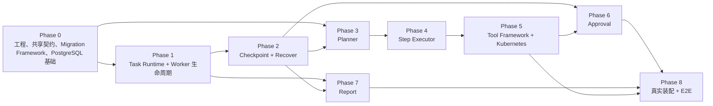

# AgentOps Runtime 开发实施计划

| 属性 | 值 |
|---|---|
| 文档状态 | Ready for Development |
| 需求基线 | `docs/design/001-requirements.md` |
| 架构基线 | `docs/design/003-system-architecture-design.md` |
| 详细设计基线 | `docs/design/004`～`011` |
| 实施范围 | 单 Runtime、单 Task Worker、PostgreSQL、顺序 Plan 的 MVP |
| 明确排除 | MQ、微服务、DAG、Multi-Agent 协作、分布式 Worker、HA、Leader Election |

本文档只定义开发顺序、任务边界、测试和验收门禁，不修改任何已冻结业务契约。实现中发现设计与代码无法一致时，应停止当前任务并回到设计文档处理，不允许在代码中发明第二套 Port、DTO、状态或错误语义。

## 1. 总体开发路线

### 1.1 实施策略

开发采用“契约先行、持久化先行、上游编排使用 Fake、真实 Provider 后置替换”的路线：

1. 先建立工程骨架、Shared Domain Contract、Migration Framework、PostgreSQL 单写事务能力和测试基础，不创建业务领域表。
2. 使用 Fake Planner、Fake Step Executor、Fake Checkpoint 和 Fake Pending Report Writer 完成 Task Runtime 与单 Worker 的生命周期骨架。
3. 实现 Checkpoint 与 Recover，使执行版本和恢复边界先闭合。
4. 实现 Planner，并使用 Fake Model Client、Fake Tool Catalog 验证顺序 Plan。
5. 实现 Step Executor，并使用 Fake Tool Framework、Fake Approval、Fake Model Client 验证步骤编排。
6. 实现真实 Tool Registry、Tool Catalog 和 Kubernetes Adapter，测试时继续使用 Fake Kubernetes。
7. 实现 Approval，接通冻结证据、等待、决定和同版本恢复排队。
8. 实现 Report，接通唯一 Pending Report、Report Worker 和事实生成。
9. 在组合根替换 Fake，完成端到端、崩溃恢复、并发竞态和稳定性验收。

每个 Task ID 是一个独立 Codex 会话的最大范围。一个任务必须同时提交实现、同范围测试、必要文档同步和 Review 说明；不得只提交实现后把测试推迟到其他任务。

各 Phase 是可评审的增量开发切片，不代表该切片可以独立部署。依赖模块尚未提供真实数据库能力时，Fake 只用于单元测试和编排测试；生产组合根不得启用会提交不完整领域事务的入口。真实 Provider 与其领域 Migration 接入后，必须补做跨模块原子性集成测试，才能解除相应入口门禁。

### 1.2 依赖路线



这里的顺序不是文档编号顺序。Planner 和 Step Executor 可以先依赖冻结 Port 的 Fake；Tool Framework 和 Approval 的真实 Provider 在后续 Phase 接入。`PendingReportWriter` 契约可以提前由消费者依赖，但 Report 表、Entity、Repository 和真实 Provider 只在 Report Phase 创建。

### 1.3 计划目录

以下目录是实施目标，不要求在第一个任务中提前创建空目录：

```text
cmd/agentops/                         # main，仅装配和启动
configs/                              # 基础设施配置与 Agent 业务配置模板，分层存放
migrations/                           # Migration Framework 与按领域模块分组的版本化 Migration
internal/app/                         # Runtime Host、启动/关闭与组合根
internal/config/                      # infra/business 分层配置；禁止互相补默认值
internal/contracts/                   # 仅跨模块冻结值类型和 DTO
internal/lifecycle/                   # 无 I/O 的 Task Lifecycle Policy
internal/taskruntime/                 # Task Runtime 应用服务及其 Port
internal/worker/                      # 单执行槽 Task Worker
internal/checkpoint/                  # Checkpoint Manager
internal/planner/                     # Planner 与 Plan 校验
internal/stepexecutor/                # 单 Step 执行
internal/toolframework/               # Registry、Catalog、Tool 执行
internal/approval/                    # Approval Manager
internal/report/                      # Report Manager 与 Report Worker
internal/adapter/postgres/            # PostgreSQL Repository/事务适配器
internal/adapter/eino/                # Eino DeepSeek Model Client Adapter
internal/adapter/kubernetes/          # Kubernetes Adapter
internal/api/                         # HTTP Handler、DTO 与路由
test/integration/                     # PostgreSQL/模块集成测试
test/e2e/                             # 进程级端到端测试
test/fixtures/                        # 固定配置、JSON、数据库事实夹具
```

`internal/contracts` 只能保存确实跨模块共享且已冻结的类型，例如 ID、`ExecutionScope`、`ExecutionConfigV1` 值结构、Model Client DTO、引用协议和 Catalog DTO。模块入站 Port、Repository Interface 和领域行为仍放在拥有该契约的模块中，禁止形成通用杂物包。

### 1.4 全局完成规则

每个任务完成前必须满足：

- 仅修改任务卡列出的目录或直接依赖文件。
- `gofmt`、受影响包 `go test`、受影响包 `go vet` 通过。
- 数据库任务必须在全新数据库和已应用前序 Migration 的数据库上验证。
- 业务 Migration、Entity、Repository Interface/实现和业务数据访问规则必须由领域 Owner 所在 Phase 一起交付；Phase 0 不得创建业务领域表。
- 公共契约任务必须包含编译期接口断言和跨模块契约测试。
- 状态任务必须覆盖合法迁移、非法迁移、迟到结果和条件更新未命中。
- 外部适配器任务必须使用 Fake Server、Fake Model 或 Fake Kubernetes；单元测试不访问真实 DeepSeek 或 Kubernetes。
- 任何领域写只能经持有 advisory lock 的 Runtime Write Executor；普通连接池只读。
- 外部模型/Kubernetes 调用不得位于数据库事务中。
- Review 必须检查“设计章节 → 实现 → 测试”三者映射，并确认没有扩大 MVP。

业务表的 Migration Owner 固定如下：

| 领域 Owner | 负责创建的业务表 |
|---|---|
| Task Runtime | `task`、`run`、`task_execution`、`command_receipt` |
| Planner | `plan` |
| Checkpoint | `checkpoint` |
| Step Executor | `step` |
| Tool Framework | `tool_execution` |
| Approval | `approval` |
| Report | `report` |

现有设计中的 `task_log` 是跨模块附属日志，不新增独立模块。其基础表和通用 append-only Repository 随最先使用它的 Task Runtime Phase 创建；各模块仍只负责自己拥有的事件、脱敏和写入时机。任何模块不得借 `task_log` 反向读取或重建领域状态。

跨 Phase 外键遵循“列归属不变、目标表就绪后补约束”：例如 `run.plan_id` 和 `run.current_step_id` 列仍由 Task Runtime Migration 定义；Planner/Step Executor 创建目标表后，只追加已冻结的 FK 约束，不得修改上游列语义或借机扩展上游表。此类集成约束必须由两个 Owner 的 Repository/Migration 契约测试共同覆盖。

## 2. Phase 0：工程、共享契约与 PostgreSQL 基础设施

### 2.1 开发目标

建立所有后续模块共同依赖的可编译工程、基础设施配置加载、Shared Domain Contract、Migration Framework、PostgreSQL 连接与事务基础、单 Runtime 锁、唯一写通道和测试基础。基础设施配置覆盖 Runtime Host、PostgreSQL、HTTP Server、Logger 和 Shutdown 启动所需字段，使 Phase 0 不依赖后续业务配置即可独立启动基础设施。Phase 0 不实现领域行为，也不创建任何业务领域表。

### 2.2 涉及模块

工程入口、基础设施配置、Runtime Host、HTTP Server/Logger/Shutdown 基础能力、Shared Domain Contract、PostgreSQL Migration Framework、PostgreSQL Adapter 基础设施、测试基础。

### 2.3 前置依赖

仅依赖已经冻结的 Requirements、Architecture 和八个详细设计。

### 2.4 任务列表

| ID | 单会话开发任务 | 输入与前置 | 修改范围 | 输出物 | 必须测试 | Review 检查点 |
|---|---|---|---|---|---|---|
| P0-T01 | 初始化 Go module、基础设施配置、命令入口、基础构建与测试命令 | 开发规范；无代码前置 | `go.mod`、`go.sum`、`cmd/agentops/`、`internal/app/`、`internal/config/infra/`、基础配置模板、构建脚本 | 配置读取/严格解析；PostgreSQL 三身份、Runtime Host、HTTP Server、Logger、Shutdown 配置类型；可启动的基础 Logger/HTTP Server/Host 生命周期；固定 Go/依赖版本；`go test ./...` 入口 | 默认值与显式值、未知/缺失/非法字段、敏感值不输出、启动参数、Logger 初始化、HTTP 监听与关闭、Shutdown 超时、空 Host 启停 | 只包含基础设施配置；不得包含 Agent、Tool 或 `ExecutionConfigV1` 构造；main 无业务逻辑；未引入新框架 |
| P0-T02 | 实现 Shared Domain Contract | P0-T01；最终一致性检查结论 | `internal/contracts/` | 跨模块 ID、时间值、状态/错误枚举、`cause_code`、`termination_reason`、`ExecutionScope`、`ExecutionConfigV1` 值结构、Model/Reference/Catalog/Approval/Checkpoint DTO 等冻结类型 | 枚举封闭性、序列化、非法值、编译期接口/DTO 契约、禁止旧签名 | 只定义共享值结构，不包含业务 Entity、Repository、状态迁移、配置加载、canonical encoder 或 hasher；无第三方 SDK 类型 |
| P0-T03 | 建立 PostgreSQL Migration Framework | P0-T01 | `migrations/`、`internal/adapter/postgres/migration/`、`test/integration/migration/` | 版本发现、顺序应用、版本记录、失败回滚和启动调用能力 | 空目录、单个/多个版本、顺序、重复启动、失败回滚、未知/损坏版本 | 只允许 Migration Framework 自身元数据；不得创建 task/run/step 等业务表 |
| P0-T04 | 实现 PostgreSQL 连接、Database Clock、advisory lock 和 Runtime Write Executor | P0-T01 的 PostgreSQL/Runtime 配置、P0-T03；架构单写通道 | `internal/adapter/postgres/runtime/`、`internal/app/`、`test/integration/postgres/` | 从基础设施配置初始化三个 `session_user=current_user` 的独立 Migration、Runtime 写和 Runtime 读登录身份、专用持锁写连接、READ COMMITTED 短事务执行器和数据库 ACL 只读池；实现共享 `RuntimeWriteExecutor` Port 与不透明事务令牌；失锁 fail-fast；提供“立即封闭写准入、随后有界释放资源”的两阶段关闭；Shutdown 超时强制断开持锁连接 | PostgreSQL 三个真实登录身份及启动角色切换拒绝、Reader 表级和列级写 ACL 扫描、共享 Port 编译契约、第二实例抢锁失败、写事务串行、同令牌多 Repository 原子提交/回滚、Host 关闭时已进入 Handler 的迟到写拒绝、已接纳事务宽限期提交、写准入封闭幂等与并发竞态、只读身份即使关闭会话只读 GUC 或执行 `RESET ROLE` 仍不能写、连接断开失去写能力、DB UTC 时间、关闭宽限期与超时中止事务、并发 Close | 业务模块只依赖 contracts，不导入 PostgreSQL Adapter 或取得 pgx 事务；不重新解析或维护第二套 PostgreSQL 配置；一个 Database 一个 Runtime；只读安全边界不能仅依赖 SQL 过滤、`default_transaction_read_only` 或表级权限扫描；关闭一开始必须先于 HTTP Handler 排空封闭新写，关闭后旧事务不得迟到提交；无 lease/选主/优先级队列 |
| P0-T05 | 建立 PostgreSQL 与模块测试基础 | P0-T03～04 | `test/integration/postgres/`、`test/fixtures/`、测试支持文件 | 每测试独立数据库/Schema、Migration 选择器、事务回滚/清理、Repository 契约测试框架 | 并行隔离、失败清理、按 Phase 应用 Migration、写连接/读池边界 | 测试工具不进入生产包；不预置业务表；不隐藏 SQL/事务错误 |

### 2.5 输出物

- 可编译工程和固定依赖。
- 严格分层的基础设施配置加载，以及 PostgreSQL、Runtime Host、HTTP Server、Logger、Shutdown 配置。
- 冻结 Shared Domain Contract。
- 可按领域模块追加版本的 Migration Framework。
- 单实例 advisory lock、数据库权威时间和串行写事务能力。
- PostgreSQL 集成测试基础设施。

### 2.6 验收标准

- 全新数据库可以完成“获取锁 → 执行空业务集的 Migration Framework → 基础启动 → 释放锁”。
- 不提供任何业务配置时，仅凭基础设施配置即可按“Logger → PostgreSQL → advisory lock → Migration Framework → HTTP Server”启动基础 Runtime Host，并按 Shutdown 配置有界关闭；HTTP 监听不得早于锁与 Migration 成功。
- 基础设施配置缺失或非法时在启动组件前失败，错误输出不得包含密码、连接串敏感部分或其他 Secret。
- 第二个 Runtime 无法在同一 Database 启动。
- Shared Domain Contract 中的状态、错误和 DTO 只有一个代码定义来源。
- 数据库中不存在 task、run、task_execution、command_receipt、plan、step、checkpoint、tool_execution、approval、report 或 task_log 等业务表。
- Phase 0 不包含 Lifecycle Policy、`execution_config_hash` 计算、Task 创建/领取或模型/Kubernetes 调用。

### 2.7 Phase 演示

只提供基础设施配置启动一个无业务入口的 Runtime Host，展示 Logger 初始化、PostgreSQL 连接、advisory lock、空业务 Migration 集、HTTP Server 依次启动，第二实例启动失败和有界 Shutdown；再展示断开持锁连接后旧实例拒绝写入，同时验证没有加载 Agent 业务配置和创建业务表。

## 3. Phase 1：Task Runtime 与单 Worker 生命周期

### 3.1 开发目标

由 Task Runtime 创建并拥有 `task`、`run`、`task_execution`、`command_receipt` 的 Migration、Entity、Repository 和数据访问规则；在 Phase 0 基础设施配置之上增加独立的业务配置层，该层只负责 Agent 配置、`ExecutionConfigV1` 构造、Canonical Encoder、`execution_config_hash` 和 Task Lifecycle Policy。完成 Task 创建、FIFO Claim、单执行槽 Worker、取消、超时、启动清理和执行编排骨架。Planner、Step Executor、Checkpoint 和 Pending Report 在本阶段使用严格契约 Fake；依赖真实 Checkpoint/Report 原子性的生产入口暂不装配。

### 3.2 涉及模块

Task Runtime、Worker、Agent/Execution 业务配置、Task Lifecycle Policy、Task Runtime 领域 Migration/Entity/Repository、Runtime Host、Task API 基础入口。

### 3.3 前置依赖

Phase 0 全部通过。

### 3.4 Fake 使用

- Fake Checkpoint：只按 FIFO 返回冻结联合结果，不实现真实校验。
- Fake Planner、Fake Step Executor：提供确定结果、取消、迟到结果和系统错误。
- Fake PendingReportWriter：只记录事务内调用并验证唯一入口。
- 不使用 Fake Kubernetes；本阶段不调用 Kubernetes。

### 3.5 任务列表

| ID | 单会话开发任务 | 输入与前置 | 修改范围 | 输出物 | 必须测试 | Review 检查点 |
|---|---|---|---|---|---|---|
| P1-T01 | 创建 Task Runtime 领域 Migration 与 Entity | Phase 0 Migration Framework/Shared Contract | `migrations/taskruntime/`、`internal/taskruntime/entity*`、Migration 测试 | `task`、`run`、`task_execution`、`command_receipt` 表及 Entity；同时创建既有跨模块附属 `task_log` 表 | 全新库/前序版本升级、字段/NULL/CHECK/FK/唯一键/索引正反例、回滚 | 不创建 plan/step/checkpoint/tool_execution/approval/report；Entity 不含 SQL/流程 |
| P1-T02 | 实现 Task Runtime Repository 与业务数据访问规则 | P1-T01 | `internal/taskruntime/repository*`、`internal/adapter/postgres/taskruntime/` | Task/Run/Execution/Receipt Repository Interface/实现；FIFO 候选、条件更新、TaskLog append | Repository 契约、条件行数、DB 时间、当前版本指针、Receipt 唯一、只读/写通道 | Repository 不决定状态；不访问其他模块尚未创建的表 |
| P1-T03 | 实现 Agent 业务配置、`ExecutionConfigV1` canonical/hash 和 Task Lifecycle Policy | P0-T01 的基础设施配置边界、P0-T02、P1-T01；Task Runtime 4.3/状态矩阵 | `internal/config/business/`、`internal/taskruntime/config_hash*`、`internal/lifecycle/`、Agent 业务配置模板 | Agent 配置读取/校验；Shared Contract 的 `ExecutionConfigV1` 构造与业务默认值；唯一 Canonical Encoder/hasher；Lifecycle 纯规则 | 固定 hash 向量、Agent/Tool/执行语义字段敏感性、排序/非法业务配置、基础设施配置变化不改变 hash、合法/非法迁移、deadline/version/worker Guard | 不读取或定义 PostgreSQL/HTTP/Logger/Shutdown 配置；只有 Task Runtime 拥有 hasher；不修改共享字段集；Policy 无 I/O |
| P1-T04 | 实现 `CreateTask` 与命令幂等编排 | P1-T02～03；Fake Checkpoint | `internal/taskruntime/create*`、单元/编排测试 | Create 用例及 Task/Run/Execution/Receipt 原子编排；Checkpoint 调用契约 | 同 command 重放、指纹冲突、失败全回滚、deadline/queued_at DB 时间、Agent disabled、Fake tx token | Task Runtime 是事务 Owner；未接真实 Checkpoint 前不得在生产组合根启用 Create |
| P1-T05 | 实现 FIFO `ClaimNextExecution` 和配置门禁编排 | P1-T02～04；Fake Checkpoint/PendingReport | `internal/taskruntime/claim*`、单元/编排测试 | `NoWork`、`Claimed`、配置中断、CheckpointInvalid、数据不一致等封闭结果 | FIFO、hash 三方门禁、worker_id、过期、异常收敛、条件更新竞态、Fake tx token | 不使用 lease/MAX(version)/第二 Worker；真实 Claim 原子性在 Phase 2/7补验 |
| P1-T06 | 实现单执行槽 Worker Run Loop | P1-T05；Fake Runtime Port | `internal/worker/` | Poll、Claim、Execute、等待、关闭；单一 `worker_id` | 无工作等待、业务分支继续 Poll、系统错误停机、context 取消、并发计数恒为 1 | Worker 不读 Repository、不解释状态、不调用 Approval/Checkpoint |
| P1-T07 | 实现 Task Runtime 执行主循环与 Active Call Registry | P1-T05～06；Fake Planner/Step/Checkpoint | `internal/taskruntime/execute*`、`internal/taskruntime/activecall/` | 按 next_action 顺序调度；PREPARED/ACTIVE 取消控制；版本 Guard | 五种 next_action、等待审批释放槽、迟到结果丢弃、事务外调用、重载事实 | 不动态推断/改写 next_action；外部调用不在事务中 |
| P1-T08 | 实现 `CancelTask`、Timeout Scanner 与 `ExpireTask` 编排 | P1-T02～07；Fake PendingReport | `internal/taskruntime/cancel*`、`timeout*`、`internal/app/` | 取消命令、5 秒扫描、终态编排、类型化进程取消 | 各非终态、deadline、读 Tool FAILED/写 Tool UNKNOWN 夹具、竞态、Pending Report tx token | `TIMED_OUT` 仅写 termination_reason；真实 Report 原子性延至 Phase 7 |
| P1-T09 | 实现 `StartupCleanup` 编排和启动门禁 | P1-T02～08；Fake Checkpoint/PendingReport | `internal/taskruntime/startup_cleanup*`、`internal/app/` | 遗留事实分类、清理决策与启用门禁 | Planner/Model/读 Tool 中断、写 Tool UNKNOWN 夹具、超时优先、不可能状态 | 未接真实 Checkpoint/ToolExecution/Report 前只运行编排测试，不开放生产组件 |
| P1-T10 | 完成 Task 查询/API Handler 与 Phase 1 模块测试 | P1-T04～09 | `internal/api/task*`、`test/integration/runtime/` | Create/Get/List/Cancel Handler；Repository 集成和 Runtime 编排套件 | HTTP DTO/错误码、recoverable 派生、单 Worker、Cancel/Timeout/Claim 竞态、日志安全 | Handler 不访问 Repository；依赖未闭合的写 API 只构建不装配 |

### 3.6 输出物

- 已实现创建、领取、取消、超时和启动清理的 Task Runtime 应用编排；依赖未闭合的生产入口暂不装配。
- 单执行槽 Worker。
- 使用 Fake Planner/Step/Checkpoint 驱动的顺序执行骨架。
- Task 基础 API。
- Task Runtime 自有 Migration、Entity、Repository 和数据访问规则。
- 独立于 Phase 0 基础设施配置的 Agent/Execution 业务配置、Canonical Encoder 和唯一 `execution_config_hash`。

### 3.7 验收标准

- 任意时刻最多一个 Task 被 Worker 执行。
- 所有写入经过持锁连接；普通池不产生写事务。
- 领取前完成 execution version、worker、Checkpoint 和配置 hash 门禁。
- Cancel/Timeout/Startup Cleanup 的状态组合与冻结矩阵一致。
- 业务终态或配置中断只通过唯一 `PendingReportWriter` 入口创建/确认 Report。
- Task Runtime Migration 只创建本模块表和既有共享附属 task_log，不创建其他领域表。
- Phase 1 业务配置不重复解析 PostgreSQL、Runtime Host、HTTP Server、Logger 或 Shutdown 配置；基础设施字段变化不得影响 `execution_config_hash`。
- 使用 Fake Checkpoint/PendingReport 的测试不得被当作数据库原子性验收；相关生产入口保持未装配。

### 3.8 Phase 演示

通过模块编排测试使用 Fake Checkpoint、Fake Planner 和 Fake Step 展示 FIFO 串行领取、成功、取消、Timeout 与 Startup Cleanup；演示明确标记为非生产装配，不在数据库中提交缺少 Checkpoint/Report 的领域事实。

## 4. Phase 2：Checkpoint、Runtime Context 与 Recover

### 4.1 开发目标

由 Checkpoint 模块创建并拥有 `checkpoint` 的 Migration、Entity、Repository 和数据访问规则；实现不可变 Runtime Context、引用绑定、最新记录选择与校验，以及显式人工 Recover 的新 execution version 创建。完成后替换 Phase 1 的 Fake Checkpoint。

### 4.2 涉及模块

Checkpoint Manager、Task Runtime Recover、Step Reference 协议、PostgreSQL Repository、Recover API。

### 4.3 前置依赖

Phase 0 Migration Framework/Shared Contract；Phase 1 的 Task Runtime Entity、Repository 和单写通道。

### 4.4 Fake 使用

- Fake Planner/Fake Step Executor 继续用于产生确定的执行边界。
- Approval 尚未实现时，用不可变 Approval fixture/Fake Repository 验证 Approved Context。
- 不调用模型或 Kubernetes。

### 4.5 任务列表

| ID | 单会话开发任务 | 输入与前置 | 修改范围 | 输出物 | 必须测试 | Review 检查点 |
|---|---|---|---|---|---|---|
| P2-T01 | 实现 `RuntimeContextV1`、next_action、ApprovalContext 和严格 JSON codec | Phase 0 contracts | `internal/checkpoint/context*`、`internal/contracts/` | 强类型上下文与严格解析/编码 | 未知字段、null、大小/深度、五种 next_action、ApprovalContext 条件 | 不保存 Prompt、原始响应或完整历史 |
| P2-T02 | 实现共享 `StepReferenceExtractor` 与 Canonical Resolved References | P2-T01 | `internal/contracts/references/` 或冻结共享契约位置 | 唯一引用提取、排序和稳定 issue code | key/index 路径、相邻 Step、非法模板、重复/超限、NO_STEP_INPUT 空数组 | Planner/Step/Checkpoint 共用一个实现；无 JSONPath/JMESPath |
| P2-T03 | 创建 Checkpoint Migration/Entity/Repository，并实现 sequence、Save/LoadLatest/Validate | P1-T01～02、P2-T01～02 | `migrations/checkpoint/`、`internal/checkpoint/entity*`、`repository*`、`internal/adapter/postgres/checkpoint/` | `checkpoint` 表、不可变 Entity、Repository Interface/实现、最大 sequence 选择与验证联合结果 | Migration 升级/约束/FK/索引、Repository 契约、Run 锁下递增、回滚复用、最大记录损坏不回退、hash/归属错误 | 只创建 checkpoint 表；Manager 不推进生命周期；没有 update；不反向拥有 Task 表 |
| P2-T04 | 接入 Initialization 与领取阶段 Execution Checkpoint | P2-T03；Phase 1 Runtime | `internal/taskruntime/`、`internal/checkpoint/`、集成测试 | Create 初始 Checkpoint、Claim 的 GENERATE_PLAN Execution Checkpoint；替换对应 Fake | Create 原子性、首次/继续 Claim、worker/version/hash Guard、失败全回滚 | Task Runtime 构造持久化引用；Plan/Step/Approval 边界分别在 Phase 4/6 接入；Report 原子性待 Phase 7 |
| P2-T05 | 实现 `ValidateRecoverySource` 封闭矩阵和 Recovery Start | P2-T03～04 | `internal/checkpoint/recovery*` | `ValidatedRecoverySource`、双版本起点、自包含 Approved Context | GENERATE_PLAN 真实 DB 场景；其余矩阵用强类型事实 fixture 覆盖每一允许/禁止组合、连续 Recover、UNKNOWN、直接来源 | 不扫描更早 Checkpoint；依赖 step/tool_execution/approval 的数据库矩阵须在各 Owner Phase 重跑 |
| P2-T06 | 实现 `RecoverTask`、Receipt 和 Recover API | P2-T05；Task Runtime | `internal/taskruntime/recover*`、`internal/api/recover*`、集成测试 | 三方 hash 校验、新 Execution、版本指针、起点、排队的单事务 | GENERATE_PLAN 成功恢复、配置失配失败 Receipt、同 command 重放、新 command 重试、Timeout 竞争、旧结果拒绝 | Task Runtime 是 Recover Owner；Step/Tool/Approval 来源的真实数据库验收在 Phase 5/6 完成 |

### 4.6 输出物

- 真实 Checkpoint Manager。
- Checkpoint 自有 Migration、Entity、Repository 和业务数据访问规则。
- Runtime Context V1 和共享引用协议。
- 完整 Recover 命令与新版本起点。
- Phase 1 中 Fake Checkpoint 的生产依赖替换。

### 4.7 验收标准

- Worker 只读取当前 execution version 的最大序号 Checkpoint。
- 无效最大记录绝不向前回退。
- Recover 在同一事务完成 Receipt、三方 hash、版本递增、状态、Checkpoint 和 queued_at。
- Recovery Start 对 Approved Tool 场景自包含，不递归来源链。
- UNKNOWN 或写副作用不明的执行无法 Recover。
- `checkpoint` 表只由 Checkpoint Phase Migration 创建，Phase 0 和 Task Runtime Migration 不得创建或修改该表。
- Create 初始 Checkpoint、GENERATE_PLAN Claim/Recover 已完成真实数据库原子性验证；Plan/Step/Tool/Approval 来源随对应 Owner Migration 接入，Pending Report 分支在 Phase 7 完成最终原子性验收。

### 4.8 Phase 演示

使用 Fake Planner/Step 将 Task 中断在 `GENERATE_PLAN` 和 `EXECUTE_STEP`，通过 Recover 创建新版本并从精确位置继续；展示损坏最大 Checkpoint 和 UNKNOWN 写 Tool 均被拒绝。

## 5. Phase 3：Planner 与 Eino Model Client

### 5.1 开发目标

由 Planner 模块创建并拥有 `plan` 的 Migration、Entity、Repository 和数据访问规则；实现顺序 Plan 的生成、严格解析、静态验证、安全处理和一次 Repair。Planner Application Service 仍保持无数据库依赖，Plan Repository 由 Task Runtime 在结果事务中消费。接入 Eino DeepSeek Adapter，但测试默认使用 Fake Model Client 和 Fake Tool Catalog。

### 5.2 涉及模块

Planner、Plan Migration/Entity/Repository、Model Client 契约、Eino Adapter、Tool Catalog 消费端。

### 5.3 前置依赖

Phase 0 Shared Contract/Migration Framework；Phase 2 Checkpoint/引用协议；Task Runtime 执行主循环。

### 5.4 Fake 使用

- Fake Model Client：FIFO 返回原始候选、错误、取消和迟到结果。
- Fake Planning Tool Catalog：实现唯一 Catalog Port，返回冻结 Snapshot。
- Phase 结束时可验证 Eino Adapter 合同，但不要求访问真实 DeepSeek。

### 5.5 任务列表

| ID | 单会话开发任务 | 输入与前置 | 修改范围 | 输出物 | 必须测试 | Review 检查点 |
|---|---|---|---|---|---|---|
| P3-T01 | 创建 Plan Migration、Entity、Repository 和数据访问规则 | P1-T01、Phase 0 Migration Framework | `migrations/planner/`、`internal/planner/entity*`、`repository*`、`internal/adapter/postgres/planner/` | `plan` 表、`run.plan_id` 冻结 FK 约束、不可变 Plan Entity、Repository Interface/实现 | Migration 升级/约束/FK/一 Run 一 Plan、Repository 契约、条件写、原始响应禁存 | 只创建 plan 表并补既定 FK；不改变 run 列语义；Planner Service 不调用 Repository |
| P3-T02 | 实现 Plan/Step Draft、OutputSchema、非 Tool 输入和严格 JSON 解析 | P0-T02、P2-T02、P3-T01 | `internal/planner/schema*`、`internal/contracts/` | 版本化 Plan 线协议和安全 parser | 未知/重复字段、null、类型、大小/深度、固定示例 | Draft 与持久化 Plan Entity 分离；不使用 `map[string]any` 作为领域模型 |
| P3-T03 | 实现 Plan 静态 Validator | P3-T02；Fake Catalog | `internal/planner/validator*` | 顺序 sequence、Step 类型、最终 Verification、Tool/Input/Output/引用校验 | 每个 ValidationIssue、数量限制、连续 sequence、只引用紧邻前序、Tool allowlist/schema | 不引入 DAG；验证顺序和稳定 code 固定 |
| P3-T04 | 实现 Catalog consumer、Snapshot 验证和 Fake 契约套件 | P0-T02；最终 Catalog 设计 | `internal/planner/catalog*`、契约测试 | selector 调用、snapshot JCS 验证、类型化错误映射 | PL-TC 全矩阵、多个静态 Agent 同 selector、不同 catalog 隔离、Fake/validator 契约 | Catalog hash 不与 execution_config_hash 比较；Planner 不读 Registry |
| P3-T05 | 实现 Prompt Builder、安全边界和单次 Repair | P3-T02～04 | `internal/planner/prompt*`、`repair*` | 初次 Prompt、受限候选摘要、一次 Repair Prompt | 固定顺序、注入文本隔离、大小预算、0/1 次 Repair、第二次失败 | 不把原始内部错误/敏感配置进入 Prompt 或日志 |
| P3-T06 | 实现 Planner Application Service | P3-T02～05；Fake Model/Catalog | `internal/planner/service*` | `GeneratePlan` 封闭结果、context/timeout、成功关联 | 成功、模型错误、验证失败、Repair 成功/失败、取消、迟到结果、RuntimeFatal | 成功和 error 互斥；不访问 DB；不创建部分 Plan |
| P3-T07 | 实现 Eino DeepSeek Adapter 和 Model Client 契约测试 | P3-T06 | `internal/adapter/eino/`、`test/integration/model/` | Eino 类型隔离、`deepseek-chat` 结构化调用、错误映射 | Fake HTTP server、请求 DTO、超时/取消、Provider 错误、响应上限、无 SDK 类型泄漏 | Adapter 不决定 Task/Planner 状态；依赖版本已锁定 |

### 5.6 输出物

- 真实 Planner。
- Planner 自有 `plan` Migration、Entity、Repository 和业务数据访问规则。
- Fake 与 Eino 两种 Model Client。
- 严格顺序 Plan Schema、Validator 和一次 Repair。

### 5.7 验收标准

- Planner 不读取数据库、不调用执行 Tool、不创建 Task 状态。
- Plan 只能是连续 sequence 的顺序列表，不存在 DAG 字段或调度。
- 最多一次 Repair。
- Tool Catalog Snapshot 与生成 Prompt/校验候选使用同一次快照。
- Planner Service 全程无数据库依赖；Plan Repository 仅作为 Owner 提供的持久化契约，真实 Plan+Step+Checkpoint 原子接入在 Phase 4 完成。
- Phase 0 与 Task Runtime Migration 不创建 `plan` 表。

### 5.8 Phase 演示

使用 Fake Model 返回一次非法、一次修复后的 Plan，展示 Repair 后得到合法顺序 Draft；验证 `plan` Repository 能独立保存安全 Plan Entity，但在 Step 表尚未创建前不启用 Plan+Step 生产结果事务；再展示 Tool Catalog 版本不匹配时模型调用次数为零。

## 6. Phase 4：Step Executor

### 6.1 开发目标

由 Step Executor 模块创建并拥有 `step` 的 Migration、Entity、Repository 和数据访问规则；实现单 Step 输入解析、模型 Step、只读 Tool Step、审批准备和已批准写 Tool 的调度逻辑。Step Executor Application Service 保持无数据库写能力，Step Repository 由 Task Runtime 的 Plan/结果事务消费。Tool Framework 与 Approval 在本阶段均使用 Fake。

### 6.2 涉及模块

Step Executor、Step Migration/Entity/Repository、Model Client、Tool Framework Port、Approval Request Port、Task Runtime Plan/Step 结果事务。

### 6.3 前置依赖

Phase 2 的 Checkpoint/Reference；Phase 3 的 Plan Migration/Repository、Planner 和 Model Client；Phase 1 的执行主循环。

### 6.4 Fake 使用

- Fake Tool Framework：只实现三个冻结执行入口。
- Fake Approval Request Port：唯一 Command/Result 签名。
- Fake Model Client：用于 Analysis、ModelCall、Verification。
- 不调用真实 Kubernetes。

### 6.5 任务列表

| ID | 单会话开发任务 | 输入与前置 | 修改范围 | 输出物 | 必须测试 | Review 检查点 |
|---|---|---|---|---|---|---|
| P4-T01 | 创建 Step Migration、Entity、Repository 和数据访问规则 | P1-T01、P3-T01、Phase 0 Migration Framework | `migrations/stepexecutor/`、`internal/stepexecutor/entity*`、`repository*`、`internal/adapter/postgres/stepexecutor/` | `step` 表、`run.current_step_id` 冻结 FK 约束、Step Entity、Repository Interface/实现 | Migration 升级/FK/`(run_id,sequence)`唯一/CHECK/索引、Repository 条件更新、连续序列查询 | 只创建 step 表并补既定 FK；不改变 run 列语义；Step Executor Service 不直接写 Repository |
| P4-T02 | 实现 StepExecutionRequest、StepOutcome、错误映射与 Port Fake | P0-T02 | `internal/stepexecutor/contract*`、测试 Fake | 封闭结果、三类依赖 Port Fake、稳定 cause code | 编译期签名、联合分支、深拷贝、context 传播、禁止 `ValidateCapability` | 不声明 Tool/Approval DTO 副本；不持有 Repository |
| P4-T03 | 实现 Input Resolver 和运行期引用解析 | P2-T02、P3 Plan、P4-T01～02 | `internal/stepexecutor/resolver*` | 从当前 Step 与紧邻前序安全 output 构造 resolved input | object/array 路径、类型保持、缺字段、schema、超限、Checkpoint 绑定相等 | 复用共享 extractor；不读取任意历史 Step |
| P4-T04 | 实现 Analysis/ModelCall/Verification | P4-T02～03；Fake Model | `internal/stepexecutor/model_step*` | 模型 Step 请求、输出校验和安全结果 | 三类 Step、OutputSchema、取消、错误映射、大小/脱敏、迟到 | 模型调用事务外；不保存原始响应 |
| P4-T05 | 实现只读 ToolCall 分支 | P4-T02～03；Fake Tool | `internal/stepexecutor/tool_read*` | `InvokeReadTool` 请求与结果映射 | ExecutionScope/hash/authorization 原样传递、业务失败、处理失败、系统错误、取消 | 不预调用能力校验；只调用冻结入口 |
| P4-T06 | 实现写 Tool 审批准备与 RequestApproval 分支 | P4-T02～03；Fake Tool/Approval | `internal/stepexecutor/tool_approval*` | `PrepareWriteApproval` → 唯一 `RequestApprovalCommand` → Waiting/Existing/Conflict 等映射 | Command 每字段一致、三份 hash、五类 Approval result、无位置参数旧接口 | Step Executor 不拥有等待事务、不创建 Approval |
| P4-T07 | 实现 Approved Write 分支 | P4-T02～03；Fake Tool/Checkpoint/Approval facts | `internal/stepexecutor/tool_approved*` | `ApprovedAction + ApprovedCheckpointEvidence + Scope` 请求 | 同版本/Recovery 两矩阵、绑定字段改写拒绝、ContextChanged、UNKNOWN、取消 | Action/Evidence 来源分离；不遍历 Checkpoint 来源链 |
| P4-T08 | Task Runtime 接入真实 Planner/Step Executor 及 Plan+Step+Checkpoint 结果事务 | P3-T06、P4-T01～07、P2 | `internal/taskruntime/`、`test/integration/runtime/` | 唯一 Plan、全部 Step、Run Context、Checkpoint 原子保存；顺序 Step 推进 | Plan/Step 事务全回滚、NEXT_STEP/WAITING/FINALIZE、version/worker Guard、结果保存失败、迟到结果、Fake Tool/Approval | Planner/Step 外部调用在事务外；Runtime 是结果事务 Owner；模块 Repository 规则不被绕过 |

### 6.6 输出物

- 真实 Step Executor。
- Step Executor 自有 `step` Migration、Entity、Repository 和业务数据访问规则。
- 模型、只读 Tool、审批准备和批准写 Tool 四条执行路径。
- Task Runtime 对 Plan+Step+Checkpoint 的真实原子持久化和完整顺序 Step 调度。

### 6.7 验收标准

- Step Executor 没有数据库和生命周期写能力。
- Tool Framework 公共执行 Port 恰好三个方法。
- Approval 只通过唯一 `RequestApprovalCommand/Result` Port。
- 所有 Step 结果由 Task Runtime 在短事务内与 Run Context、ToolExecution/Checkpoint 一致保存。
- Fake Tool、Fake Approval 能驱动完整等待与恢复分支。
- `step` 表只由 Step Executor Phase Migration 创建；Planner 和 Task Runtime 只能通过 Owner 提供的 Entity/Repository 规则访问。

### 6.8 Phase 演示

先展示 Planner Draft 在同一事务创建唯一 Plan、连续 Step 和下一 Checkpoint，再运行包含 Analysis、只读 ToolCall、Verification 的顺序 Plan；另一个写 ToolCall 使用 Fake Approval 进入 WaitingApproval，并通过构造 Approved Evidence 继续到 Fake Tool。

## 7. Phase 5：Tool Framework 与 Kubernetes Adapter

### 7.1 开发目标

由 Tool Framework 创建并拥有 `tool_execution` 的 Migration、Entity、Repository 和数据访问规则；实现静态 Registry、Planning Tool Catalog、能力/授权校验、四类只读 Kubernetes Tool、受限 Deployment Patch、ToolExecution 保守边界和 UNKNOWN 处理。

### 7.2 涉及模块

Tool Framework、Kubernetes Adapter、PostgreSQL ToolExecution Repository、Planner Catalog Provider、Step Executor 集成。

### 7.3 前置依赖

Phase 0 Shared Contract/Migration Framework；Phase 3 Catalog consumer；Phase 4 Tool Framework Port consumer 与 Step Entity；Phase 1 单写通道。

### 7.4 Fake 使用

- 所有自动化测试默认使用 Fake Kubernetes Adapter 或 fake Kubernetes API server。
- Approval Provider 尚未接入时，使用 ApprovedAction/Checkpoint fixture 测试写路径。
- Planner 与 Step Executor 使用真实 Tool Framework。

### 7.5 任务列表

| ID | 单会话开发任务 | 输入与前置 | 修改范围 | 输出物 | 必须测试 | Review 检查点 |
|---|---|---|---|---|---|---|
| P5-T01 | 创建 ToolExecution Migration、Entity、Repository 和数据访问规则 | P1-T01、P4-T01、Phase 0 Migration Framework | `migrations/toolframework/`、`internal/toolframework/entity*`、`repository*`、`internal/adapter/postgres/toolframework/` | `tool_execution` 表、Entity、Repository Interface/实现、唯一动作与状态条件规则 | Migration 升级/FK/唯一/CHECK/索引、Repository RUNNING/终态/UNKNOWN、不可变 input、条件更新 | 只创建 tool_execution 表；UNKNOWN 不可逆；不增加 risk/read_only 字段 |
| P5-T02 | 实现 Static Registry Set、启动校验和 Catalog Adapter | P1-T03、P3-T04 | `internal/toolframework/registry*`、`catalog*` | catalog_id Registry 集合、版本、Snapshot hash、Catalog Port Provider | TF-TC 全矩阵、排序/JCS、多个静态 Agent selector、不同 catalog 隔离、漂移 | Catalog evidence 与 execution_config_hash 解耦；Adapter 不实现执行 Port |
| P5-T03 | 实现 Capability、Input Schema、Authorization 和 Access Policy 校验 | P5-T02 | `internal/toolframework/validation*`、`policy*` | 内部 `validateCapability` 纯函数和结构化拒绝 | 五种 capability、risk/read_only、allowed_tools、cluster/namespace/resource/field、Schema | `ValidateCapability` 不公开；执行入口均复用同一纯函数 |
| P5-T04 | 实现结果安全处理、大小限制与脱敏 | P5-T03 | `internal/toolframework/result*` | 白名单 DTO、规范 JSON、安全摘要、截断公共能力 | secret/token、UTF-8、1 MiB、Pod/Log 完整项/行、Event 禁止二次选择 | 原始响应不进入 DB/日志/Checkpoint/Report |
| P5-T05 | 实现 Kubernetes Adapter 基础与 Get Deployment/Get Pods | P5-T03 | `internal/adapter/kubernetes/client*`、`deployment*`、`pods*` | SDK 隔离、单页读取、白名单 DTO | Fake API、field/label selector、limit=200、不跟随 continue、context/错误映射 | SDK 类型不穿透 Port；无自动重试 |
| P5-T06 | 实现 Get Events 有界排序与 Get Container Logs 流式处理 | P5-T04～05 | `internal/adapter/kubernetes/events*`、`logs*` | 960 KiB Event 候选算法、稳定排序、Log 环形完整行 | 输入顺序置换、较新项替换、超大单项/单行、continue、tail 1～1000、内存上限 | Event 排序/选择仅 Adapter 一次；Log 不按字节截断 |
| P5-T07 | 实现只读 Tool 执行与 ToolExecution 起止事务 | P5-T01、P5-T03～06 | `internal/toolframework/read*` | RUNNING 保守登记、事务外 K8s、确定结果、TaskLog best effort | 成功/业务失败/处理失败、取消/Timeout、结果 Guard、持久化失败、唯一 ToolExecution | 只能通过 Owner Repository；Tool Framework 拥有起始事务，Task Runtime 拥有 Step/终态收敛 |
| P5-T08 | 实现 `PrepareWriteApproval` 和 Frozen Request | P5-T03～05 | `internal/toolframework/prepare_write*` | live resource 读取、受限规范输入、observed values、resourceVersion、frozen hash | replicas/image 组合、策略、规范 JSON、固定 hash 向量、无 ToolExecution/Patch | 只准备证据，不创建 Approval、不执行 Patch |
| P5-T09 | 实现 Approved Patch、原子 resourceVersion test 和 UNKNOWN 分类 | P5-T01、P5-T04～08 | `internal/toolframework/approved_write*`、`internal/adapter/kubernetes/patch*` | 预检、内部 JSON Patch、RUNNING 边界、三分支最终状态 | Action/Evidence/Scope 绑定、live 变化、2xx/non-2xx/无可信最终状态、取消、UNKNOWN 不可覆盖 | 不接受任意 Patch；不重试；resourceVersion test 与写入同请求 |
| P5-T10 | Planner/Step/Runtime 接入真实 Tool Framework | P5-T01～09 | 组合测试与 `test/integration/tool/` | Fake Tool 替换；真实 Catalog 和 Tool 路由 | 只读顺序 Plan、审批准备停点、Approved fixture、结果事务、配置漂移 | Kubernetes 仍为 Fake；所有 ToolExecution 访问遵守 Owner 规则 |

### 7.6 输出物

- 真实 Planning Tool Catalog Provider。
- 五种固定 Tool capability。
- Kubernetes Adapter 和 Fake Kubernetes 测试环境。
- ToolExecution 的 RUNNING、COMPLETED、FAILED、UNKNOWN 完整语义。
- Tool Framework 自有 `tool_execution` Migration、Entity、Repository 和业务数据访问规则。

### 7.7 验收标准

- 只读 Tool 不重试且结果经过白名单、大小限制和脱敏。
- 写 Tool 只允许受限 Deployment Patch。
- `ToolExecution=RUNNING` 在外部写调用前提交。
- 无法证明写结果时固定进入 UNKNOWN，禁止恢复、重放或覆盖。
- Planner Catalog 和执行 Registry 复用同一静态 Tool Definition。
- `tool_execution` 表只由 Tool Framework Phase Migration 创建；Task Runtime 终态收敛必须复用其 Repository 条件规则。

### 7.8 Phase 演示

使用 Fake Kubernetes 执行四种只读查询，展示 Event/Log 有界行为；准备一条 Patch 并用 Approved fixture 执行，分别展示成功、resourceVersion 冲突和 UNKNOWN。

## 8. Phase 6：Approval 与冻结证据闭环

### 8.1 开发目标

由 Approval 模块创建并拥有 `approval` 的 Migration、Entity、Repository 和数据访问规则；实现高风险 Tool 的冻结审批、Pending 等待事务、Approve/Reject 幂等决定、同 execution version 重新排队，以及 ApprovedAction/CheckpointEvidence 的闭合调用链。

### 8.2 涉及模块

Approval Manager、Checkpoint Manager、Task Lifecycle Policy、Task Runtime、Tool Framework、Approval API、Pending Report Writer 契约。

### 8.3 前置依赖

Phase 0 Migration Framework；Phase 2 Checkpoint/Recover；Phase 4 Step Executor/Step Entity；Phase 5 Frozen Request、ToolExecution 和 Approved Write。

### 8.4 Fake 使用

- 使用真实 Tool Framework，底层继续使用 Fake Kubernetes。
- Pending Report Writer 在 Report Provider 未实现前仍使用严格 Fake。
- 不使用 Fake Approval；本 Phase 结束时替换它。

### 8.5 任务列表

| ID | 单会话开发任务 | 输入与前置 | 修改范围 | 输出物 | 必须测试 | Review 检查点 |
|---|---|---|---|---|---|---|
| P6-T01 | 创建 Approval Migration、Entity、Repository 和 Frozen Evidence codec | P1-T01、P4-T01、P5-T08、Phase 0 Migration Framework | `migrations/approval/`、`internal/approval/entity*`、`repository*`、`internal/adapter/postgres/approval/` | `approval` 表、不可变冻结事实、frozen_input_hash、Repository Interface/实现 | Migration 升级/FK/唯一/CHECK/索引、Repository 契约、字段不可变、hash/归属/version、唯一 Pending | 只创建 approval 表；不保存 Checkpoint source 字段；事实来源单一 |
| P6-T02 | 实现唯一 `RequestApproval` 事务 | P6-T01、P2 Checkpoint、Lifecycle Policy | `internal/approval/request*` | 五分支结果；Approval、Waiting 状态、Checkpoint、清 worker/queue 原子提交 | 新建、Existing、Conflict、CheckpointInvalid、RuntimeFatal、全回滚、锁序 | Approval Manager 是等待事务 Owner；Step Executor 不拥有事务 |
| P6-T03 | 实现 Approve 命令、Receipt 和 Continuation Checkpoint | P6-T02 | `internal/approval/approve*`、API | Approved、同版本 QUEUED、queued_at、Approved Continuation、Receipt | 幂等、指纹冲突、deadline、版本/状态、与 Cancel/Timeout 提交顺序 | 不创建新 execution version；不调用 Task Runtime 或 Kubernetes |
| P6-T04 | 实现 Reject 命令和终态 Pending Report | P6-T02；Fake PendingReport | `internal/approval/reject*`、API | Rejected、Step/Run/Task/Execution 终态、唯一 Pending Report、Receipt | 幂等、终态映射、未创建 ToolExecution、Cancel/Timeout 竞态、Report 同事务 | Reject 不执行 Tool；唯一 PendingReportWriter |
| P6-T05 | 接通 ApprovedAction、ApprovedCheckpointEvidence 和恢复路径 | P6-T03、P5-T09、P2-T05 | `internal/taskruntime/`、`internal/checkpoint/`、`internal/stepexecutor/`、集成测试 | Approve 后重新 Claim 并执行；Recover Start 直接证据 | 同版本、一次/连续 Recover、三方 hash、冻结输入/resourceVersion、改写拒绝 | Action 只来自 Approval；Evidence 只来自当前最大 Checkpoint |
| P6-T06 | 完成 Approval API、并发与端到端模块测试 | P6-T01～05 | `internal/api/approval*`、`test/integration/approval/` | Approve/Reject 查询与完整模块流程 | Approve/Reject/Cancel/Timeout 四方竞态、重复命令、进程重启、日志安全 | 固定锁序；API 不重新携带或重建 Frozen Request |

### 8.6 输出物

- 真实 Approval Manager 和 API。
- Approval 自有 `approval` Migration、Entity、Repository 和业务数据访问规则。
- Frozen Request、ApprovedAction、ApprovedCheckpointEvidence 完整链路。
- WaitingApproval → Approve/Reject → Resume/终态。

### 8.7 验收标准

- RequestApproval、Approve、Reject 各自只有一个事务 Owner。
- Approve 沿用当前 execution version，重新进入 Worker FIFO。
- Reject 不创建 ToolExecution，不调用 Kubernetes。
- Approved write 的三类证据逐字段绑定且不可混用。
- Approval 后 Recover 只读取当前 Recovery Start 和直接引用 Approval。
- `approval` 表只由 Approval Phase Migration 创建；其他模块只能通过冻结 Port/Repository 规则消费其事实。

### 8.8 Phase 演示

创建高风险 Tool Task，展示冻结字段和 resourceVersion；Approve 后由同一 Worker 重新领取并 Patch；另一个 Task Reject 后直接终止且 Kubernetes 调用次数为零。

## 9. Phase 7：Report 与唯一 Pending Report

### 9.1 开发目标

由 Report 模块创建并拥有 `report` 的 Migration、Entity、Repository 和数据访问规则；实现唯一 Pending Report 入口、确定性事实加载、安全报告生成、单执行槽 Report Worker、启动重置和查询 API，并替换所有 Fake PendingReportWriter。

### 9.2 涉及模块

Report Manager、Report Worker、Task Runtime、Approval、PostgreSQL、Model Client、Report API。

### 9.3 前置依赖

Phase 0 Migration Framework；Phase 1 Task Runtime Entity/终态；Phase 2 Checkpoint；Phase 4 Step；Phase 5 ToolExecution；Phase 6 Approval；Phase 3 Model Client。

### 9.4 Fake 使用

- 先使用 Fake Model Client 验证事实和状态机。
- Eino Adapter 通过契约测试后接入。
- 不使用 Fake Report/PendingReportWriter 作为生产依赖。

### 9.5 任务列表

| ID | 单会话开发任务 | 输入与前置 | 修改范围 | 输出物 | 必须测试 | Review 检查点 |
|---|---|---|---|---|---|---|
| P7-T01 | 创建 Report Migration、Entity、Repository、状态约束和 Claim | P1-T01、Phase 0 Migration Framework | `migrations/report/`、`internal/report/entity*`、`repository*`、`internal/adapter/postgres/report/` | `report` 表、Report Entity、Repository Interface/实现、Pending/Generating/Completed/Failed 条件更新与 FIFO Claim | Migration 升级/FK/唯一/CHECK/索引、Repository 契约、确定排序、迟到结果 Guard | 只创建 report 表；Report Worker 不创建 Report；所有写走单写通道 |
| P7-T02 | 实现唯一 `PendingReportWriter.EnsurePending` | P7-T01 | `internal/report/pending*`、共享事务能力 | 调用方事务内创建或确认同一 Report | 首次/重复、配置中断占位复用、task/run 归属、并发唯一、非终态不可生成 | 唯一创建入口；不拥有调用方终态事务 |
| P7-T03 | 替换 Task Runtime 与 Approval 的 Fake PendingReportWriter | P7-T02 | `internal/taskruntime/`、`internal/approval/`、集成测试 | 所有终态/中断入口接真实 Pending Writer | Cancel/Timeout/Failed/Reject/ConfigMismatch/CheckpointInvalid、回滚原子性 | 不存在直接 Report insert；Pending 与业务状态同时可见 |
| P7-T04 | 实现 ReportFacts Loader、安全事实和确定性前缀 | P7-T01～03 | `internal/report/facts*`、`render*` | Task/Run/Step/Tool/Approval 只读事实、UNKNOWN 人工提示、固定结论 | 成功/失败/取消/超时/拒绝/UNKNOWN、数据不一致、脱敏/大小、模型不可覆盖字段 | 状态与安全结论来自代码/DB，不相信模型 |
| P7-T05 | 实现 Report Generator 和结果事务 | P7-T04；Fake Model | `internal/report/generator*` | Prompt、模型补充叙述、Completed/Failed 提交 | 成功、模型明确失败、超时60秒、取消/关机、迟到、非法候选、安全失败 | 模型调用事务外；MVP 不自动重试明确失败 |
| P7-T06 | 实现 Report Worker、Startup Reset 和关闭 | P7-T01、P7-T05 | `internal/report/worker*`、`internal/app/` | Pending Claim 循环、单槽生成、遗留 Generating→Pending | 单槽、FIFO、重启重做、关闭迟到结果、无工作等待、锁丢失 | 与 Task Worker 是不同后台组件但共享单写通道；无 MQ |
| P7-T07 | 实现 Report 查询 API 与模块集成测试 | P7-T01～06 | `internal/api/report*`、`test/integration/report/` | Pending/Generating/Completed/Failed 查询 DTO | 四状态 HTTP、内容安全、查询不触发生成、唯一 Report、Eino 契约替换 | API 不修改 Report；不泄漏 Prompt/Provider/raw response |

### 9.6 输出物

- 真实 PendingReportWriter。
- Report 自有 `report` Migration、Entity、Repository 和业务数据访问规则。
- Report Manager、Report Worker、事实加载和生成。
- Report 查询 API。

### 9.7 验收标准

- 每个 Task 最多一个 Report。
- Pending Report 只在业务事务内通过 `EnsurePending` 创建/确认。
- Report Worker 只领取业务已终态的 Task。
- UNKNOWN 报告明确要求人工检查，不宣称写操作成功或失败。
- 遗留 Generating 在启动时重置为 Pending；明确模型失败不自动重试。
- `report` 表只由 Report Phase Migration 创建；Phase 1～6 不得创建临时生产 Report 表。
- 替换 Fake 后重新执行 Task Runtime/Approval 的全部终态事务测试，确认业务终态与 Pending Report 在真实 PostgreSQL 同事务提交；通过后才能启用相关生产入口。

### 9.8 Phase 演示

展示 Completed、Cancelled、ApprovalRejected、Timeout 和 UNKNOWN 五类 Task 的报告；中断一次 Generating 并重启，验证自动回到 Pending 后生成。

## 10. Phase 8：真实装配、端到端 Demo 与稳定性

### 10.1 开发目标

在单进程组合根中替换所有生产 Fake，完成 API、Task Worker、Report Worker、Timeout Scanner、真实 PostgreSQL、Eino Adapter 和 Kubernetes Adapter 的启动/关闭顺序，执行完整验收矩阵。

### 10.2 涉及模块

全部模块、Runtime Host、配置、API、PostgreSQL、Eino、Kubernetes、集成和 E2E 测试。

### 10.3 前置依赖

Phase 0～7 全部通过。

### 10.4 Fake 使用

- CI/E2E 默认使用 Fake DeepSeek HTTP Server 和 Fake Kubernetes API。
- 可提供人工演示配置连接真实 DeepSeek/Kubernetes，但不作为自动测试前置。
- 生产组合根禁止装配 Fake。

### 10.5 任务列表

| ID | 单会话开发任务 | 输入与前置 | 修改范围 | 输出物 | 必须测试 | Review 检查点 |
|---|---|---|---|---|---|---|
| P8-T01 | 完成 Runtime Host 组合根、模块 Migration 装配、启动和关闭顺序 | Phase 0～7 | `cmd/agentops/`、`internal/app/`、`internal/config/` | Config→DB→lock→按 Phase 顺序应用领域 Migration→Cleanup→API/Workers/Scanner 启动；反向关闭 | 空库全量升级、逐 Phase 升级、重复启动、任一模块 Migration 失败、锁/Cleanup/关闭/失锁 | 组合根只注册各 Owner Migration；不集中重建业务 Schema；无 Service Locator/可变全局依赖 |
| P8-T02 | 完成确定性纯模型/纯 Tool 基础 E2E | P8-T01 | `test/e2e/basic/` | Create→Claim→Plan→Steps→Completed→Report | 顺序 Plan、单 Worker、唯一 Plan/Report、API 最终结果 | 使用 Fake Model/Fake K8s；无外部不稳定依赖 |
| P8-T03 | 完成只读 Kubernetes Tool E2E | P8-T01 | `test/e2e/read_tools/` | 四类只读 Tool 的完整执行和报告 | Deployment/Pod/Event/Log、截断、错误、安全输出、取消 | 原始 K8s 数据不持久化；无重试 |
| P8-T04 | 完成 Approval Patch E2E | P8-T01 | `test/e2e/approval/` | Prepare→Pending→Approve/Reject→Resume→Patch/Report | Approve、Reject、resourceVersion 冲突、Patch UNKNOWN、重复命令 | 同版本 Resume；冻结证据和原子 Patch 前置条件 |
| P8-T05 | 完成 Recover、Restart 与迟到结果 E2E | P8-T01 | `test/e2e/recovery/` | 各安全边界中断、重启清理、人工 Recover、新版本继续 | GeneratePlan/Model/read Tool/approval 后中断、连续 Recover、配置漂移、旧结果 | 不自动 Recover；UNKNOWN 不恢复；只读当前版本最大 Checkpoint |
| P8-T06 | 完成 Cancel、Timeout 和命令竞态 E2E | P8-T01 | `test/e2e/concurrency/` | 固定提交顺序下的终态与 Report | Claim/Cancel、Approve/Cancel、Approve/Timeout、Recover/Timeout、结果/Timeout | 不以 goroutine 调度结果作为断言；验证数据库提交后状态 |
| P8-T07 | 完成容量、稳定性、race 和故障注入 | P8-T02～06 | `test/stability/`、测试脚本 | 20 个同时到期、连接断开、慢模型/K8s、崩溃点、资源上限结果 | deadline+10s、单槽、无 goroutine 泄漏、`go test -race`、锁丢失拒写 | 不通过优先级/MQ/多 Worker规避容量缺陷 |
| P8-T08 | 执行发布门禁和最终 Demo 脚本 | P8-T01～07 | `docs/`、`test/e2e/demo/`、配置模板 | 可重复演示步骤、验收结果、已知限制、运维 UNKNOWN 指引 | `go test ./...`、`go vet ./...`、race、Migration 空库、全量 E2E | 文档只描述已实现能力；所有 Fake 仅存在测试装配 |

### 10.6 输出物

- 单进程 AgentOps Runtime。
- 全量 API 和后台组件装配。
- 自动化 E2E、稳定性与故障注入套件。
- 可重复执行的 MVP Demo。

### 10.7 验收标准

- 单 Database 同时只能运行一个 Runtime。
- 全新数据库按 Task Runtime→Checkpoint→Planner→Step Executor→Tool Framework→Approval→Report 的依赖顺序应用领域 Migration；升级数据库只应用缺失版本，任何 Owner Migration 失败均不启动业务组件。
- 一个 Task Worker 单槽执行，Report Worker 独立处理 Report，但所有写共享同一持锁连接。
- 没有 MQ、微服务、DAG、多 Agent 协作、多 Worker、HA 或自动恢复扩展。
- Requirements 验收项和八个详细设计测试矩阵均有自动化映射。
- 全量测试、vet、race、Migration 和 E2E 门禁通过。

### 10.8 最终 Demo

最终 Demo 至少包含：

1. 创建只读诊断 Task，顺序执行并生成 Completed Report。
2. 创建高风险 Patch Task，展示 Frozen Evidence、Approve、同版本重新领取和原子 Patch。
3. Reject 一个审批并证明没有 Kubernetes Patch。
4. 在安全边界中断 Task，重启后人工 Recover 到新 execution version。
5. 制造写 Tool 无可信最终状态，展示 UNKNOWN、禁止 Recover 和 Report 人工检查提示。
6. 展示 Cancel、Timeout、配置 hash 漂移、Catalog 漂移和命令幂等。

## 11. 分阶段任务总表

| Phase | 核心交付 | 生产 Provider 状态 | 主要测试替身 | 阶段退出门禁 |
|---|---|---|---|---|
| 0 | 工程、基础设施配置、Shared Contract、Migration Framework、单写通道、测试基础 | Runtime Host/PostgreSQL 基础真实 | 无 | 无业务表、infra config、framework、lock/tx 通过 |
| 1 | Agent/Execution 业务配置、Task Runtime 表/Entity/Repository 与 Worker 生命周期骨架 | Runtime/Worker 增量实现 | Fake Planner/Step/Checkpoint/PendingReport | Owner Migration、hash/Lifecycle、配置分层和编排测试通过 |
| 2 | Checkpoint 表/Entity/Repository 与 Recover | Checkpoint 真实 | Fake Planner/Step；Approval fixture | Migration、最大记录、恢复矩阵、版本递增通过 |
| 3 | Plan 表/Entity/Repository、Planner 与 Eino Adapter | Planner 真实 | Fake Model、Fake Catalog | Migration、顺序 Plan、Repair、Catalog 契约通过 |
| 4 | Step 表/Entity/Repository 与 Step Executor | Step Executor 真实 | Fake Tool、Fake Approval、Fake Model | Migration、Plan+Step 事务、四条 Step 路径通过 |
| 5 | ToolExecution 表/Entity/Repository、Tool/Kubernetes | Tool/Catalog/K8s 真实 | Fake Kubernetes API | Migration、五种 Tool、Patch/UNKNOWN、安全限制通过 |
| 6 | Approval 表/Entity/Repository 与审批闭环 | Approval 真实 | Fake Kubernetes、Fake PendingReport | Migration、Frozen Evidence、Approve/Reject/Resume 通过 |
| 7 | Report 表/Entity/Repository 与 Pending/Worker | Report/Pending Writer 真实 | Fake Model Client | Migration、真实终态原子性、Facts、Worker、Restart 通过 |
| 8 | 全部装配 | 全部真实 | CI 中 Fake 外部系统 | E2E、race、容量、故障注入通过 |

## 12. 推荐的第一个开发任务

推荐从 **P0-T01：初始化 Go module、基础设施配置、命令入口、基础构建与测试命令** 开始。

### 12.1 任务输入

- `docs/AGENTS.md`
- `docs/develop-spec/01-go-coding-guidelines.md`
- `docs/develop-spec/02-project-structure.md`
- `docs/develop-spec/03-design-principles.md`
- `docs/develop-spec/04-architecture.md`
- 本实施计划 Phase 0

### 12.2 任务范围

- 创建并固定 `go.mod` 和基础依赖管理方式。
- 创建基础设施配置读取与严格解析，覆盖 PostgreSQL、Runtime Host、HTTP Server、Logger 和 Shutdown。
- 创建最小 `cmd/agentops/main.go`、基础 Logger/HTTP Server 与 `internal/app` Host 生命周期骨架。
- 建立 `go test ./...`、`go vet ./...` 的统一执行入口。
- 只创建本任务实际使用的目录和文件。
- 不实现 Agent 业务配置、`ExecutionConfigV1` 构造、配置 hash、数据库业务表、Task、Worker 或任何业务模块。

### 12.3 输出和验收

- 工程能够编译。
- 仅凭基础设施配置，空 Host、Logger 和 HTTP Server 可以启动并按 Shutdown 配置响应 context 关闭。
- 基础设施配置非法时启动前失败，且错误不泄漏敏感值。
- 最小单元测试通过。
- main 只负责调用组合根，不含业务逻辑。
- Review 确认目录符合规范、依赖已锁定且没有提前引入框架。

## 13. 模块完成顺序与依赖关系

### 13.1 完成顺序

1. `shared contracts + migration framework + postgres runtime`
2. `taskruntime migration/entity/repository + Agent业务配置/lifecycle/hash + worker`
3. `checkpoint migration/entity/repository + recover`
4. `planner migration/entity/repository + planner`
5. `stepexecutor migration/entity/repository + step executor`
6. `toolframework migration/entity/repository + kubernetes`
7. `approval migration/entity/repository + approval manager`
8. `report migration/entity/repository + report worker`
9. `所有模块 Migration/Provider 的 app composition + e2e`

### 13.2 关键依赖说明

| 消费模块 | 依赖契约 | Provider 何时真实化 | 之前如何开发 |
|---|---|---|---|
| Task Runtime | Planner Port | Phase 3 | Phase 1～2 使用 Fake Planner |
| Task Runtime | Step Executor Port | Phase 4 | Phase 1～3 使用 Fake Step Executor |
| Task Runtime/Approval | Checkpoint Port | Phase 2 | Phase 1 使用严格 Fake |
| Task Runtime/Approval | PendingReportWriter | Phase 7 | Phase 1～6 使用严格 Fake |
| Planner | Planning Tool Catalog Port | Phase 5 | Phase 3 使用共享契约 Fake |
| Planner/Step/Report | Model Client | Phase 3 提供 Eino Adapter | 各模块单测使用 Fake Model |
| Step Executor | Tool Framework 执行 Port | Phase 5 | Phase 4 使用三个入口的 Fake |
| Step Executor | Approval Request Port | Phase 6 | Phase 4～5 使用唯一签名 Fake |
| Tool Framework | Kubernetes Adapter Port | Phase 5 | 单元/CI 始终可用 Fake Kubernetes |
| Approval | Task Lifecycle Policy | Phase 1 | 直接依赖 Task Runtime Phase 交付的真实纯函数 |
| Recover | Checkpoint Validation | Phase 2 | 不允许 Fake Provider 进入最终装配 |

### 13.3 不得改变的实现边界

- 单个 Task 只使用一个选定静态 Agent；不得引入 Agent 间协作或委派。
- Task Worker 数量固定为 1，单执行槽；不得把 goroutine 并行执行解释为性能优化。
- Plan 是严格顺序列表；不得增加依赖边、拓扑排序或 DAG executor。
- PostgreSQL 是唯一持久化和队列事实来源；`queued_at` 是唯一 Task 排队事实。
- advisory lock 是 Runtime 实例级 fail-fast 保护，不是 HA、租约或选主。
- `execution_config_hash` 只由 Task Runtime 计算；Catalog 使用独立 selector/snapshot evidence。
- Checkpoint 只保存最小 Runtime Context；Recover 由用户命令触发并创建新 execution version。
- Approval 冻结输入、旧值和 resourceVersion；Approve 不创建新 execution version。
- Pending Report 只能由终态/配置中断事务通过 `EnsurePending` 创建或确认。
- 写 Tool UNKNOWN 不自动恢复、不重放，必须通过 API、日志和 Report 提示人工核查。
