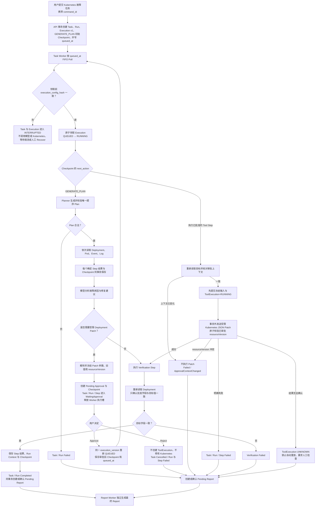
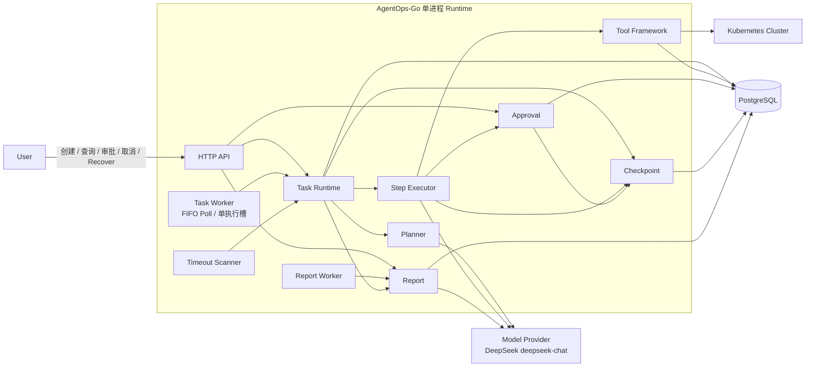
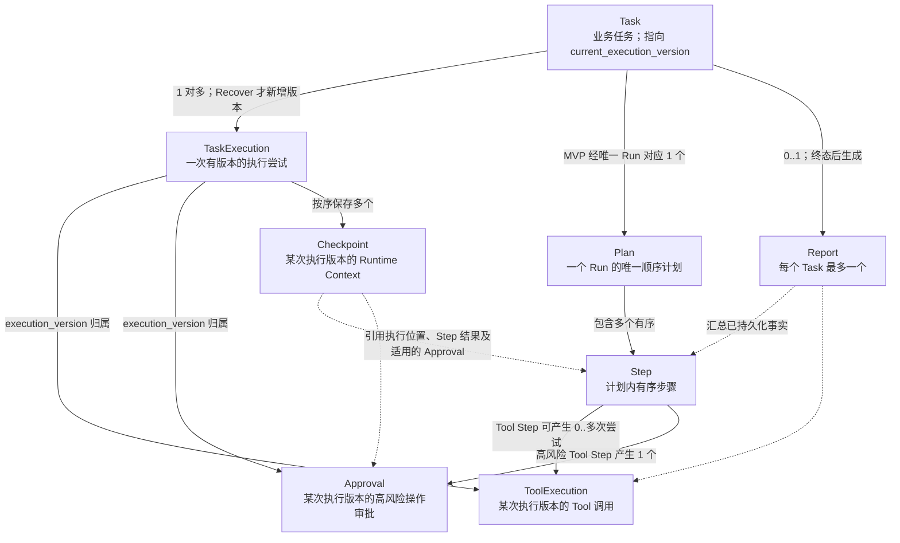
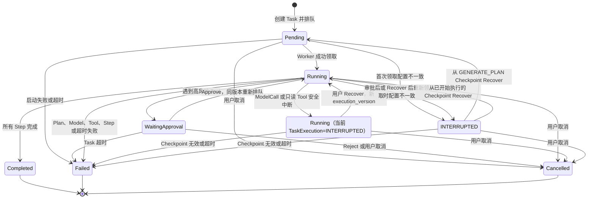

# AgentOps-Go 项目概览

本文仅根据以下两份文档整理：

- `docs/design/001-requirements.md`（V3.5）
- `docs/design/003-system-architecture-design.md`（V1.3）

## 1. 项目简介

AgentOps-Go 是一个用 Go 实现的 AI Agent 任务运行时。用户提交自然语言任务后，模型生成一个不可变的顺序计划，后台 Worker 再逐步调用模型或 Kubernetes Tool，并持续保存状态、日志和结果。它解决的是长任务在执行中可能失败、暂停、重启或产生外部副作用时，如何可靠排队、审批、恢复和追踪。

核心场景是 Kubernetes 故障处理：自动读取 Deployment、Pod、Event 和容器日志并分析原因；需要修改副本数或镜像时等待人工审批；执行后验证目标字段并生成报告。真实运维任务跨越多个步骤和外部系统，因此不能只依赖一次模型请求。与普通 Agent Demo 相比，它更像小型执行平台：以数据库为事实来源，具备状态机、异步 Worker、执行版本、Checkpoint、人工审批、受限 Tool、未知副作用处理和独立报告，而不是简单的“模型调用—返回文本”。

## 2. 核心执行流程

以下以“Kubernetes 故障分析、审批修复、结果验证”为例。图中的“验证”只确认已批准字段是否达到目标值，不代表等待 rollout、判断应用健康或自动回滚。

补充说明：Planner 完成、每个 Step 得到确定结果、进入审批前和审批通过后都会保存 Checkpoint。审批暂停和继续沿用同一个 `execution_version`；只有可安全恢复的中断经用户发起 Recover 后，才会创建新的执行版本。

## 3. 整体架构

系统以单进程模块化单体运行。启动时加载静态 Agent、Tool 和安全配置，生成本次进程的 `worker_id`，取得 PostgreSQL advisory lock，执行 Schema Migration 和遗留状态清理，然后才启动 HTTP API、Task Worker、Report Worker 与 Timeout Scanner。Task 通过 PostgreSQL 的 `queued_at` 排队，不使用内存队列或消息队列。

主要调用方向是“入口驱动应用模块，应用模块通过适配器访问外部依赖”。HTTP API 不执行长任务；Worker 只 Poll 和触发 Task Runtime；模型与 Kubernetes 调用都在数据库短事务之外执行。PostgreSQL 是任务状态、排队、恢复和报告的唯一事实来源，所有 Runtime 写入经持有 advisory lock 的专用写身份连接串行提交；普通连接池使用数据库 ACL 无业务写权限的独立只读身份，Migration 使用独立 DDL 身份。

## 4. 核心模块说明

| 模块 | 主要职责 | 不负责什么 | 依赖模块 |
|---|---|---|---|
| Task Runtime | 编排 Task/Run 生命周期；创建首次执行；领取前做配置门禁；驱动 Planner 和 Step Executor；处理取消、超时、恢复、启动清理与终态收尾；拒绝旧执行版本推进状态 | HTTP、FIFO Poll、进程启停、具体 LLM/Kubernetes 调用、审批命令事务、重复定义生命周期规则 | Task Lifecycle Policy、Planner、Step Executor、Checkpoint、Report、Config、Repository |
| Worker | 按 `queued_at` FIFO Poll；携带进程 `worker_id` 请求领取；一次只把一个已领取 Execution 交给 Task Runtime；等待审批或终态后释放执行槽 | 直接改 Task/Run/Step、决定状态迁移、创建执行版本、调用 Approval、维护内存队列、多任务并行、自动接管、生成 Report | Task Runtime 的 Worker 用例入口 |
| Planner | 调用单一模型生成一个结构化顺序 Plan；校验 Step、Tool 权限和受限引用；非法结构只修复一次 | 执行 Step、动态改 Plan、调用 Tool、管理 Task 状态 | Model Client、Tool Registry |
| Step Executor | 顺序执行当前 Step；解析紧邻前序 Step 的 `step.output.<field>`；调用模型或 Tool；提交确定结果并推动 Checkpoint 保存 | 领取 Task、重新规划、并行调度、自动注入完整历史或 Memory、生成 Report | Model Client、Tool Framework、Approval、Checkpoint |
| Tool Framework | 静态注册与查找 Tool；校验 Schema、白名单、权限和风险；路由 Kubernetes 调用；管理写 Tool 的 RUNNING/UNKNOWN 边界；截断并脱敏结果 | 决定审批结果、修改 Task 生命周期、自动重试写 Tool、提供运行期 Tool 管理 | Kubernetes Adapter、Repository |
| Approval | 冻结高风险 Tool 参数和资源上下文；创建单次 Approval；原子处理首次有效 Approve/Reject；暂停、继续排队或终止同一执行版本 | 复杂身份体系、多级/会签/撤销审批、定义 Task 状态机、调用 Task Runtime 或 Worker、执行 Patch | Task Lifecycle Policy、Checkpoint、Repository |
| Checkpoint | 保存最小 Runtime Context；加载并校验当前执行版本的最新 Checkpoint；为恢复后的新版本创建带来源的起点 Checkpoint | 决定能否恢复、修改 Task/Run/Step、重新排队、自动接管、保存完整快照、回退到更早 Checkpoint | Repository |
| Report | 从已持久化事实生成成功、失败或取消报告；维护 PENDING/GENERATING/COMPLETED/FAILED；只处理已进入业务终态的 Task | 参与 Plan 或 Step、改变业务终态、修复失败 Task；模型明确失败后自动重试 | Model Client、Repository |

## 5. 核心数据关系

说明：

- MVP 中一个 Task 只有一个 Run，一个 Run 只有一个 Plan；恢复继续原 Run，Plan 和 Step 不复制。
- `TaskExecution` 表示执行尝试，不是 Run，也不是 Worker Lease。Task 通过 `current_execution_version` 指向当前有效版本。
- `ToolExecution`、`Approval` 和 `Checkpoint` 必须记录所属 `execution_version`，从而隔离旧执行的迟到结果。
- Report 不属于 Plan 或 Step，只基于数据库中已处理、已脱敏的事实独立生成。

## 6. 状态流转

`SafeInterrupted` 不是新增的 Task 状态，而是为了在图中表达“Task 仍为 Running，但当前 `TaskExecution` 已是 `INTERRUPTED`”的组合情形。写 Tool 进入 `ToolExecution=RUNNING` 保守边界后发生中断，不走恢复路径，而是进入失败并把 ToolExecution 标为 `UNKNOWN`。`Completed`、`Failed`、`Cancelled` 是终态，不能恢复。

## 7. 关键设计机制

### Worker 领取任务

新 Task、审批通过和恢复请求都把 `queued_at` 写入 PostgreSQL，Worker 按该时间 FIFO Poll，一次只执行一个 Task。Worker 本身不解释或推进业务状态，只调用 Task Runtime 的领取与执行入口。这样进程重启后无需重建内存队列，也避免在 MVP 中引入消息队列、Lease 和多 Worker 竞争。

### execution_version

每个 Task 创建时拥有 `TaskExecution v1`，只有从可恢复的 `INTERRUPTED` 执行人工 Recover 时才创建 `version+1`。Task 持久化 `current_execution_version`，所有异步结果和状态更新都必须匹配它。这样旧进程或旧调用的迟到结果不会覆盖恢复后的新执行；审批暂停和继续只是同一次尝试，不递增版本。

### execution_config_hash

该 hash 摘要化影响执行语义和安全边界的配置，例如 Agent 指令、模型参数、Tool 集合与 Schema、风险等级、审批策略和 Plan 约束。首次领取、审批后再领取、恢复校验和恢复后再领取都要按相应规则比较 hash，防止旧任务在新配置下静默执行。凭证、API 地址、日志级别等运维配置不进入 hash，MVP 也不保存完整配置快照。

### Checkpoint 与 Recover

Checkpoint 保存的是继续执行所需的最小 Runtime Context，包括当前位置、下一动作、结果引用及适用的审批信息，不是数据库全量快照。系统在初始起点、Planner 完成、每个确定 Step 结果以及审批边界保存它。发生 ModelCall 或只读 Tool 等安全中断后，必须由用户显式 Recover，校验通过才创建新的执行版本并从最新 Checkpoint 继续；已完成 Step 不重复执行，也不会自动回退到更早 Checkpoint。

### Human Approval

只读低风险 Tool 自动执行，受限 Deployment Patch 必须先暂停并等待单次人工审批。审批前，系统解析并冻结完整参数、旧值和 `resourceVersion`，确保用户看到的内容与随后执行的内容一致。Approve 后沿用同一执行版本重新排队；Reject 时不调用 Patch，Task 取消。审批用于展示人工把关，不构成生产级身份隔离、职责分离或多级审批。

### Tool 副作用与 UNKNOWN

写 Tool 在调用 Kubernetes 前，先提交冻结输入和 `ToolExecution=RUNNING`；这一状态表示系统已进入“无法证明请求未发送”的保守边界。若之后发生超时、断连、Worker 中断或结果持久化失败，系统不能安全断言修改是否生效，因此记录 `UNKNOWN` 和 `side_effect_unknown=true`。这类操作禁止自动恢复或重放，API、TaskLog 和 Report 必须提示人工检查 Kubernetes 实际状态。

### Report 独立生成

Report 不属于 Plan 或 Step，也不参与业务成功与否的判断。Task/Run 进入 Completed、Failed 或 Cancelled 时，在同一事务中创建或确认唯一的 Pending Report，再由独立 Report Worker 调用模型生成。报告失败只改变 Report 自身状态，不反向修改 Task、Run 或 Step；进程中断遗留的 Generating 可在启动清理后重做，但模型明确失败时 MVP 不自动重试。

### PostgreSQL advisory lock

advisory lock 保护的是整个 Runtime Instance，而不只是 Task Worker；同一个 PostgreSQL Database 只允许一个 AgentOps Runtime。只有成功持锁后，系统才执行 Migration、启动清理并开放 API 和后台循环，所有 Runtime 写入也通过这条持锁连接串行提交。连接断开时旧进程停止接收和启动工作、丢弃迟到结果并退出，由外部进程管理器启动新实例；它不是 Leader Election、Lease 或自动故障接管。

## 8. MVP 范围

### 当前 MVP 必须实现的能力

- 静态注册 Agent 与 Tool；一个 DeepSeek `deepseek-chat` Model Provider。
- REST API：创建、查询、取消、审批、恢复 Task，查询 Plan、Step、TaskLog 和 Report；loopback 监听、静态 Bearer Token。
- 所有状态变更命令使用 `command_id` 和 Command Receipt 保证幂等。
- PostgreSQL 持久化、`queued_at` FIFO Poll、单 Runtime、单 Task Worker、Report Worker、Timeout Scanner 和 advisory lock。
- 单个不可变顺序 Plan、最多 20 个 Step、受限的相邻 Step 结构化字段引用。
- Kubernetes 只读 Tool：Get Deployment、Pod、Event、Container Log。
- 受限 Deployment Patch：只允许副本数和指定容器镜像，受集群、命名空间、数值范围及 Registry 白名单约束。
- 高风险 Tool 单次人工审批、参数冻结、执行前上下文校验和请求内 `resourceVersion` 原子前置条件。
- Task Execution Guard、`execution_version`、`current_execution_version`、`execution_config_hash` 和旧结果隔离。
- Checkpoint 手动恢复；安全中断可重做，写 Tool 结果不明时记录 UNKNOWN 且禁止重放。
- TaskLog、结果截断与脱敏、独立最终 Report，以及成功、失败、取消、超时和审批路径。

### 当前明确不实现的能力

- Multi-Agent、动态 Plan、多版本 Plan、DAG、并行 Step、复杂 Workflow DSL。
- 多 Worker、消息队列、优先级/延迟队列、Lease、Heartbeat、Leader Election、自动接管。
- 多级审批、会签、撤销、审批版本，以及生产级用户、组织、RBAC、多租户和公网认证。
- 多模型路由、Fallback、熔断、复杂重试、Token/成本/配额治理。
- Tool exactly-once、自动 Reconciliation、写 Tool 自动重试、自动回滚。
- Deployment 以外的 Kubernetes 写 Tool、任意 JSON/Merge Patch、完整资源对象写入、Secret 读取。
- rollout 等待、应用健康判断和自动回滚。
- Event Source/Replay、Outbox、不可变审计链、完整 OpenTelemetry/Prometheus 治理。
- 运行期 Agent/Tool 配置管理、完整配置快照与历史版本。

### 后续可扩展能力

- 多 Worker、Lease 与自动接管。
- Tool 幂等、结果核验与 Reconciliation。
- 动态 Plan 和更强工作流能力。
- 多模型 Provider 与 Fallback。
- 配置版本、策略治理及显式迁移工具。
- Token、成本与配额治理。
- 事件流、OpenTelemetry 与更完整可观测性。
- 更细粒度审批、Kubernetes Patch 策略、多租户与 RBAC。

## 9. 需求与架构差异

未发现两份文档存在实质性的需求或架构冲突。架构文档明确以需求文档 V3.5 为基线，二者在单进程、单 Worker、执行版本、配置门禁、审批、恢复、UNKNOWN、独立 Report 和 advisory lock 等核心决策上保持一致。

架构文档比需求文档进一步明确了两处实现边界，但没有改变需求：一是由 Runtime Host 负责 advisory lock、Migration、启动清理和组件启停，Task Runtime 只负责任务用例；二是受限 Deployment Patch 除执行前复核外，还由 Kubernetes Adapter 在同一 JSON Patch 请求中加入 `resourceVersion` 原子 `test`。这些属于职责和并发边界的细化，不是新增产品能力。

## 10. 一句话总结

> AgentOps-Go 本质上是一个以 PostgreSQL 为事实中心、可审批、可人工恢复、能安全编排模型与 Kubernetes Tool 的单机 AI Agent 任务运行时。
