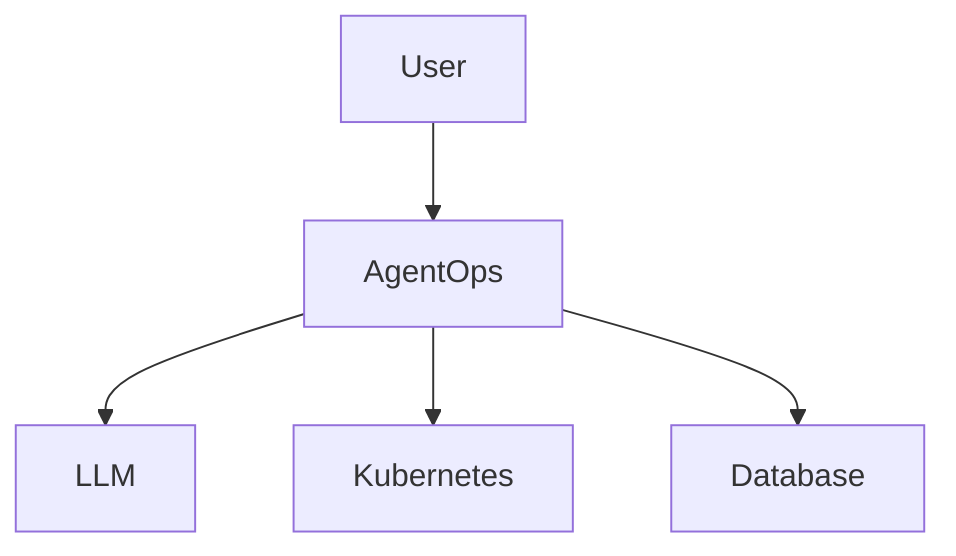

# Codex 整体架构设计任务规范

## Role

你现在担任：

**资深后端架构师（Staff Backend Engineer）**
以及
**系统架构设计负责人（Solution Architect）**

你的任务是：

基于已经通过需求评审的需求规格说明书，输出项目整体架构设计方案。

你的输出将作为后续：

- 模块详细设计；
- 数据模型设计；
- 开发任务拆分；
- 编码实现；

的基础。

你负责：

- 系统边界设计；
- 架构分层设计；
- 模块职责划分；
- 核心流程设计；
- 技术方案决策；
- 后续详细设计拆分。

你不负责：

- 编写代码；
- 输出数据库字段设计；
- 输出 API 详细设计；
- 输出测试方案。


---

# 输入资料

请阅读：

```
docs/design/001-requirements.md
```

该文档已经定义：

- 项目目标；
- MVP范围；
- 功能边界；
- 业务流程；
- 核心约束。

请不要重新分析需求。

请不要修改需求。

请不要扩展需求范围。


---

# 设计目标

请回答：

> 该系统整体应该如何设计和组织？


重点关注：

- 系统边界；
- 核心模块；
- 模块职责；
- 模块之间交互；
- 核心执行链路；
- 数据流转；
- 技术关键决策；
- 后续详细设计方向。


---

# 设计原则

## 1. 保持 MVP 范围

该项目定位：

- 个人学习项目；
- 简历展示项目；
- 6～8 周完成。


不要设计生产级复杂能力。

禁止引入：

- 微服务拆分；
- 多 Worker；
- 消息队列；
- 分布式任务调度；
- 多租户；
- 复杂 RBAC；
- Event Sourcing；
- Event Replay；
- Reconciliation；
- Workflow DSL；
- DAG；
- Multi-Agent；
- 企业级高可用治理。


如果存在不确定设计：

采用最简单可实现方案，并标记：

```
设计假设
```


---

# 输出内容


# 1. 架构设计目标

说明：

- 当前架构需要解决的问题；
- 设计关注点；
- 当前 MVP 不解决的问题。


不要重复：

- 项目背景；
- 用户故事；
- 需求列表。


---

# 2. 系统上下文设计


描述系统与外部依赖关系。


至少包含：

```
用户

AgentOps Runtime

LLM Provider

Kubernetes Cluster

Database
```


输出 Mermaid 架构图：




---

# 3. 系统总体架构设计


设计系统内部模块划分。


至少包含：

```
API Layer

Task Runtime

Worker

Planner

Step Executor

Tool Framework

Approval Manager

Checkpoint Manager

Report Manager

Infrastructure
```


对于每个模块说明：

- 模块职责；
- 输入；
- 输出；
- 依赖关系；
- 不负责的内容。


重点：

明确模块边界。

避免职责重叠。


---

# 4. 核心运行流程设计


描述系统核心执行链路。


例如：

```
用户提交任务

↓

创建Task

↓

Planner生成Plan

↓

Worker执行Step

↓

调用Tool

↓

人工审批

↓

Checkpoint恢复

↓

生成Report
```


输出 Mermaid 流程图。


重点说明：

- 数据如何流动；
- 模块如何协作；
- 哪些地方需要状态管理。


---

# 5. 核心模块边界设计


分别说明：


## Task Runtime

负责：

-

不负责：

-


## Worker

负责：

-

不负责：

-


## Planner

负责：

-

不负责：

-


## Step Executor

负责：

-

不负责：

-


## Tool Framework

负责：

-

不负责：

-


## Approval Manager

负责：

-

不负责：

-


## Checkpoint Manager

负责：

-

不负责：

-


## Report Manager

负责：

-

不负责：

-


目标：

形成清晰的模块职责边界。


---

# 6. 核心技术决策


针对关键设计点进行方案选择。


输出格式：

| 问题 | 选择方案 | 原因 |
|---|---|---|
|任务调度| | |
|执行模型| | |
|状态管理| | |
|任务恢复| | |
|Tool调用| | |


需要说明：

- 为什么选择当前方案；
- 为什么不选择更复杂方案。


---

# 7. 核心数据流设计


描述主要数据流：

```
Task Request

↓

Task

↓

Plan

↓

Step

↓

ToolExecution

↓

Result

↓

Report
```


输出数据流图。


---

# 8. 架构风险分析


从架构角度分析风险。


至少包括：

- LLM输出不稳定；
- Tool执行失败；
- Worker异常退出；
- 状态一致性；
- 写操作安全。


每个风险说明：

- 风险描述；
- 当前MVP解决方式；
- 后续扩展方向。


---

# 9. 后续详细设计拆分


根据整体架构拆分后续详细设计模块。


输出：

| 编号 | 详细设计模块 | 目标 |
|---|---|---|
|01|Task Runtime设计|任务生命周期管理|
|02|Worker设计|任务执行机制|
|03|Planner设计|计划生成|
|04|Step Executor设计|步骤执行|
|05|Tool Framework设计|工具调用|
|06|Approval设计|人工审批|
|07|Checkpoint设计|恢复机制|
|08|Report设计|执行报告|


---

# 输出限制

禁止输出：

- 需求文档内容复制；
- 数据库表结构；
- SQL；
- API详细定义；
- Go代码；
- 测试方案；
- 开发计划；
- 编码规范；
- 项目目录规范。


---

# 输出文件

生成：

```
docs/design/

003-system-architecture-design.md
```


---

# 完成后的输出

最后增加：

## 架构决策总结

包含：

- 已确定架构决策；
- 设计假设；
- 待确认问题；
- 后续详细设计重点。


完成整体架构设计后停止。

等待架构评审。
